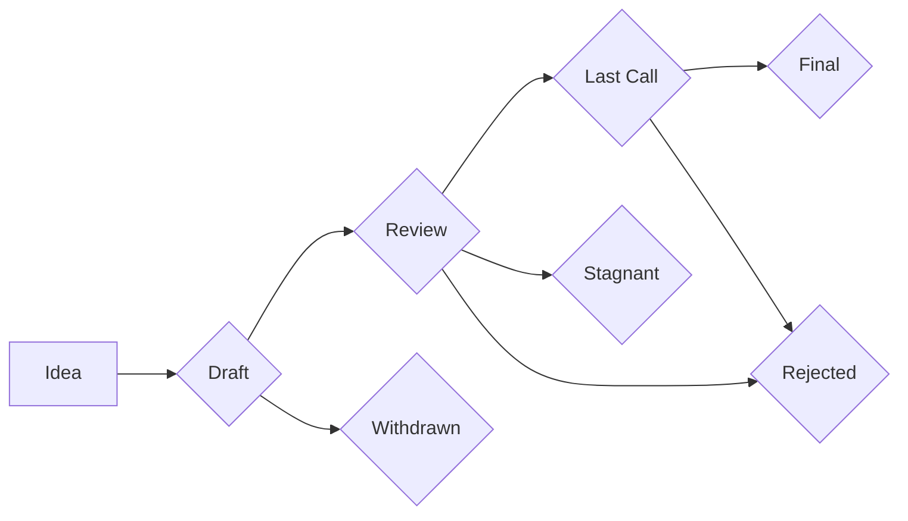

```
---
eip: 107
title: 通过 HTML 弹出窗口安全授权 "eth_sendTransaction"
author: Ronan Sandford (@wighawag)
created: 2016-06-05
status: Stagnant
type: Standards Track
category: Interface
---

## 摘要

此 EIP 草案详细描述了一种授权方法，如果启用 RPC 的以太坊节点提供此方法，则允许常规网站发送交易（通过 ```eth_sendTransaction```），而无需启用 CORS。 用户将被要求通过 HTML 弹出窗口确认交易。

dapp 想要执行的每个只读 rpc 调用都会被重定向到来自节点域的不可见 iframe，并且对于 dapp 希望执行的每个交易，都会向用户显示一个 HTML 弹出窗口，以允许他/她取消或确认交易。 这允许 dapp 连接到节点的 rpc api，而无需授予任何特权。 这允许用户在他们的日常 Web 浏览器中安全地与 dapps 交互，同时他们的帐户已解锁。 如果帐户未解锁，并且节点已通过 rpc 允许 "personal" api，则 HTML 页面还允许用户输入其密码以解锁交易范围内的帐户。

## 动机

目前，如果用户使用她的/他的日常浏览器导航到在网站上运行的 dapp，出于安全原因，默认情况下，dapp 将无法访问 rpc api。 用户必须为网站的域启用 CORS，dapp 才能工作。 不幸的是，如果用户这样做，dapp 将能够从任何已解锁的帐户发送交易，而无需任何用户同意。 换句话说，用户不仅需要更改节点的默认设置，而且用户还必须信任 dapp 才能使用它。 这当然是不可接受的，并且迫使现有的 dapps 依赖于使用以下解决方法：
- 如果交易只是简单的以太币转移，则会要求用户在专用的受信任钱包（如“Mist”）中输入它。
- 对于更复杂的情况，会要求用户通过节点命令行界面手动输入交易。

本提案旨在提供一种安全且用户友好的替代方案。

以下是提供的 HTML 弹出窗口实现的一些屏幕截图：

### 帐户已解锁

当帐户已解锁时，对于 dapp 尝试进行的每笔交易，都会向用户显示以下弹出窗口：


### 帐户已锁定且未通过 rpc 公开 "personal" api：

当帐户被锁定，并且节点不提供通过其 rpc 接口解锁帐户的访问权限时，将显示以下弹出窗口。 这并不理想，因为这需要用户知道如何解锁帐户：


### 帐户已锁定，但节点通过 rpc 公开 "personal" api：

更好的选择是要求用户提供他们的密码，但这只有在节点允许通过 rpc 访问 "personal" api 时才有可能。 在这种情况下，将向用户显示以下对话框，以便他/她可以通过提供解锁帐户所需的密码来接受交易：


## 规范

为了使该机制能够工作，节点需要在 URL \<节点 URL\>/authorization.html 通过 HTTP 提供一个 HTML 文件。

然后，dapp 将以 2 种不同的模式使用此文件（不可见的 iframe 和弹出窗口）。

dapp 中将嵌入不可见的 iframe，以允许 dapp 发送其只读 rpc 调用，而无需为 dapp 的网站域启用 CORS。 这是通过将消息发送到 iframe（通过 JavaScript ```window.postMessage```）来完成的，该消息反过来执行 rpc 调用。 这是可行的，因为 iframe 和节点共享相同的域/端口。

在 iframe 模式下，HTML 文件的 JavaScript 代码将确保无法进行需要解锁密钥的调用。 这是为了防止 dapps 嵌入不可见的 iframe 并诱骗用户单击确认按钮。
如果 dapp 需要 ```eth_sendTransaction``` 调用，dapp 将使用相同的 URL 打开一个新窗口。

在此弹出窗口模式下，HTML 文件的 JavaScript 代码将允许调用 ```eth_sendTransaction```（但不能调用 ```eth_sign```，因为无法以安全的方式向用户显示要签名的交易的有意义的内容）。 但是，不会直接将调用发送到节点，而是会显示一个确认对话框，显示发送者和接收者的地址，以及传输的金额以及潜在的 gas 成本。 用户批准后，请求将被发送，结果将返回给 dapp。 如果用户取消请求，将返回错误。

HTML 页面还会检查 "personal" api 的可用性，如果可用，则会要求用户在必要时解锁帐户。 解锁是暂时的 (3s)，因此如果在短时间内尝试交易，将再次询问密码。

在 iframe 模式和窗口模式下，通过 ```window.postMessage``` 实现与 dapp 的通信。
iframe/窗口发送的第一个消息是包含字符串“ready”的消息，以让 dapp 知道它现在接受消息。 然后，dapp 可以通过使用以下对象发送消息来开始执行 rpc 调用：
```
{
  id:<一个 id>, //以便可以匹配响应，因为不能保证响应的顺序
  payload:<json rpc 对象> //这是通常发送到节点的精确对象
}
```

对于 ```eth_sendTransaction```，需要在 rpc 参数中设置 "gas"、"gasPrice" 和 "from" 字段，以便窗口可以显示正确的值。 如果并非所有这些都已传入，则窗口将返回错误。

收到此类消息后，iframe 将对节点执行实际的 rpc 调用，但前提是此类调用是只读调用（不需要解锁密钥）。 如果不是，它将返回错误。 另一方面，窗口将只接受 ```eth_sendTransaction``` 调用，但将显示一个对话框，以便用户可以接受或取消请求。

在所有情况下，iframe/窗口都将使用以下对象将消息发送回 dapp：
```
{
  id:<与请求匹配的 id>,
  result:<rpc 结果原样>,
  error:<错误对象>
}
```

由于 postMessage 的限制，错误对象不能是 JavaScript 的 Error 对象。 相反，它是
```
{
  message:<描述错误的字符串>,
  type:<定义错误类型的字符串> //type="cancel" 表示用户取消了交易
}
```

## 理由

选择该提案的设计是因为它的简单性和安全性。 之前的想法是使用类似 OAuth 的协议，以便用户接受或拒绝交易请求。 这将需要在节点中进行更深层次的代码更改，并且一些 Geth 贡献者认为这种更改不适合 Geth 代码库，因为它需要 dapp 感知的代码。
相反，当前的设计具有非常简单的实现（可以跨节点的实现共享的独立 HTML 文件），并且其安全性由浏览器的跨域策略保证。

需要使用 iframe/window 才能兼顾安全性和用户友好性。 不可见的 iframe 允许 dapp 执行只读调用，而无需用户输入，而 window 确保在进行调用之前获得用户批准。 虽然我们可以通过使 iframe 确认使用本机浏览器 ```window.confirm``` 对话框来在没有窗口模式的情况下实现它，但这将阻止使用当前设计允许的更优雅的确认弹出窗口。 碰巧的是，```window.confirm``` 在某些浏览器中是不安全的，因为它将焦点放在接受选项上并且可以自动触发 (https://bugs.chromium.org/p/chromium/issues/detail?id=260653)。

## 实现

为了实现此设计，需要在 URL \<节点 URL\>/authorization.html 上提供以下 HTML 文件或等效文件。

就是这样。

```html
<!DOCTYPE html>
<html>
  <head>
    <title>Ethereum Authorization</title>
  </head>
  <script>
    //https://github.com/alexvandesande/blockies
    !function(){function r(r){for(var t=0;t<l.length;t++)l[t]=0;for(var t=0;t<r.length;t++)l[t%4]=(l[t%4]<<5)-l[t%4]+r.charCodeAt(t)}function t(){var r=l[0]^l[0]<<11;return l[0]=l[1],l[1]=l[2],l[2]=l[3],l[3]=l[3]^l[3]>>19^r^r>>8,(l[3]>>>0)/(1<<31>>>0)}function e(){var r=Math.floor(360*t()),e=60*t()+40+"%",o=25*(t()+t()+t()+t())+"%",n="hsl("+r+","+e+","+o+")";return n}function o(r){for(var e=r,o=r,n=Math.ceil(e/2),a=e-n,l=[],c=0;o>c;c++){for(var f=[],h=0;n>h;h++)f[h]=Math.floor(2.3*t());var i=f.slice(0,a);i.reverse(),f=f.concat(i);for(var v=0;v<f.length;v++)l.push(f[v])}return l}function n(r,t,e,o,n){var a=document.createElement("canvas"),l=Math.sqrt(r.length);a.width=a.height=l*e;var c=a.getContext("2d");c.fillStyle=o,c.fillRect(0,0,a.width,a.height),c.fillStyle=t;for(var f=0;f<r.length;f++){var h=Math.floor(f/l),i=f%l;c.fillStyle=1==r[f]?t:n,r[f]&&c.fillRect(i*e,h*e,e,e)}return a}function a(t){t=t||{};var a=t.size||8,l=t.scale||4,c=t.seed||Math.floor(Math.random()*Math.pow(10,16)).toString(16);r(c);var f=t.color||e(),h=t.bgcolor||e(),i=t.spotcolor||e(),v=o(a),u=n(v,f,l,h,i);return u}var l=new Array(4);window.blockies={create:a}}();
``````md
---
title: EIP 草案模板
description: 如何编写优秀 EIP 的指南
---

## 序言

这是编写以太坊改进提案 (EIP) 的模板。

## 标题
EIP：[EIP 编号]
标题：[EIP 标题]
作者：[作者姓名] <[作者电子邮件]>，[作者姓名] <[作者电子邮件]> (等等。)
讨论：[URL 指向讨论的地点]
状态：草案
类型：标准轨道
类别：核心、接口、网络、ERC
创建日期：YYYY-MM-DD
需要：[EIP 号] (可选)
被取代：[EIP 号] (可选)
需要合并：[EIP 号] (可选)

## 摘要

摘要应为技术性简述。它应该是一个简洁的解释，说明问题的解决方案。如果可能，篇幅限制在 200 个字以内。

## 动机

动机对于想要实施 EIP 的人来说至关重要。它应该清楚地解释为什么现有的协议规范不足以解决提案所解决的问题。它应该描述提案的动机。动机越令人信服，社区就越有可能评估它。

## 规范

规范必须以足够的技术细节来描述提案，以便实现可以被实现。

每个边缘情况都必须考虑周全，并且必须清晰地说明。

## 基本原理

基本原理阐述了设计决策的基本原理，并提供了关于该解决方案可能被认为优于替代方案的原因的见解。基本原理应讨论重要的反对意见或担忧，这些意见或担忧在最终被拒绝之前已经表达过。

## 向后兼容性

所有 EIP 都可能影响以太坊客户端的向后兼容性。作者必须考虑他们的 EIP 对现有系统的影响。例如，如果 EIP 的任何部分都与现有客户端有关，则必须说明。作者需要描述哪些客户端受到影响，以及软件供应商需要做些什么来适应 EIP。

## 安全考虑

所有 EIP 都必须考虑安全含义。始终包括可能对以太坊协议产生的与安全相关的含义。你应该做的具体事情包括：

*   引入新的攻击向量是什么？
*   对现有攻击向量的影响是什么？
*   如果本 EIP 被拒绝，会放弃哪些安全改进？
*   本 EIP 与其他安全 EIP 的兼容性如何？
*   本 EIP 会对 gas 消耗产生什么影响？

## 版权

版权归作者所有，通过 CC0-1.0 许可发布。
``````md
!function(e){"use strict";function n(e){function E(e,n){var t,r,i,o,u,s,f=this;if(!(f instanceof E))return j&&L(26,"constructor call without new",e),new E(e,n);if(null!=n&&H(n,2,64,M,"base")){if(n=0|n,s=e+"",10==n)return f=new E(e instanceof E?e:s),U(f,P+f.e+1,k);if((o="number"==typeof e)&&0*e!=0||!new RegExp("^-?"+(t="["+N.slice(0,n)+"]+")+"(?:\\."+t+")?$",37>n?"i":"").test(s))return h(f,s,o,n);o?(f.s=0>1/e?(s=s.slice(1),-1):1,j&&s.replace(/^0\.0*|\./,"").length>15&&L(M,v,e),o=!1):f.s=45===s.charCodeAt(0)?(s=s.slice(1),-1):1,s=D(s,10,n,f.s)}else{if(e instanceof E)return f.s=e.s,f.e=e.e,f.c=(e=e.c)?e.slice():e,void(M=0);if((o="number"==typeof e)&&0*e==0){if(f.s=0>1/e?(e=-e,-1):1,e===~~e){for(r=0,i=e;i>=10;i/=10,r++);return f.e=r,f.c=[e],void(M=0)}s=e+""}else{if(!g.test(s=e+""))return h(f,s,o);f.s=45===s.charCodeAt(0)?(s=s.slice(1),-1):1}}for((r=s.indexOf("."))>-1&&(s=s.replace(".","")),(i=s.search(/e/i))>0?(0>r&&(r=i),r+=+s.slice(i+1),s=s.substring(0,i)):0>r&&(r=s.length),i=0;48===s.charCodeAt(i);i++);for(u=s.length;48===s.charCodeAt(--u););if(s=s.slice(i,u+1))if(u=s.length,o&&j&&u>15&&(e>y||e!==d(e))&&L(M,v,f.s*e),r=r-i-1,r>z)f.c=f.e=null;else if(G>r)f.c=[f.e=0];else{if(f.e=r,f.c=[],i=(r+1)%O,0>r&&(i+=O),u>i){for(i&&f.c.push(+s.slice(0,i)),u-=O;u>i;)f.c.push(+s.slice(i,i+=O));s=s.slice(i),i=O-s.length}else i-=u;for(;i--;s+="0");f.c.push(+s)}else f.c=[f.e=0];M=0}function D(e,n,t,i){var o,u,f,c,a,h,g,p=e.indexOf("."),d=P,m=k;for(37>t&&(e=e.toLowerCase()),p>=0&&(f=J,J=0,e=e.replace(".",""),g=new E(t),a=g.pow(e.length-p),J=f,g.c=s(l(r(a.c),a.e),10,n),g.e=g.c.length),h=s(e,t,n),u=f=h.length;0==h[--f];h.pop());if(!h[0])return"0";if(0>p?--u:(a.c=h,a.e=u,a.s=i,a=C(a,g,d,m,n),h=a.c,c=a.r,u=a.e),o=u+d+1,p=h[o],f=n/2,c=c||0>o||null!=h[o+1],c=4>m?(null!=p||c)&&(0==m||m==(a.s<0?3:2)):p>f||p==f&&(4==m||c||6==m&&1&h[o-1]||m==(a.s<0?8:7)),1>o||!h[0])e=c?l("1",-d):"0";else{if(h.length=o,c)for(--n;++h[--o]>n;)h[o]=0,o||(++u,h.unshift(1));for(f=h.length;!h[--f];);for(p=0,e="";f>=p;e+=N.charAt(h[p++]));e=l(e,u)}return e}function F(e,n,t,i){var o,u,s,c,a;if(t=null!=t&&H(t,0,8,i,w)?0|t:k,!e.c)return e.toString();if(o=e.c[0],s=e.e,null==n)a=r(e.c),a=19==i||24==i&&B>=s?f(a,s):l(a,s);else if(e=U(new E(e),n,t),u=e.e,a=r(e.c),c=a.length,19==i||24==i&&(u>=n||B>=u)){for(;n>c;a+="0",c++);a=f(a,u)}else if(n-=s,a=l(a,u),u+1>c){if(--n>0)for(a+=".";n--;a+="0");}else if(n+=u-c,n>0)for(u+1==c&&(a+=".");n--;a+="0");return e.s<0&&o?"-"+a:a}function _(e,n){var t,r,i=0;for(u(e[0])&&(e=e[0]),t=new E(e[0]);++i<e.length;){if(r=new E(e[i]),!r.s){t=r;break}n.call(t,r)&&(t=r)}return t}function x(e,n,t,r,i){return(n>e||e>t||e!=c(e))&&L(r,(i||"decimal places")+(n>e||e>t?" out of range":" not an integer"),e),!0}function I(e,n,t){for(var r=1,i=n.length;!n[--i];n.pop());for(i=n[0];i>=10;i/=10,r++);return(t=r+t*O-1)>z?e.c=e.e=null:G>t?e.c=[e.e=0]:(e.e=t,e.c=n),e}function L(e,n,t){var r=new Error(["new BigNumber","cmp","config","div","divToInt","eq","gt","gte","lt","lte","minus","mod","plus","precision","random","round","shift","times","toDigits","toExponential","toFixed","toFormat","toFraction","pow","toPrecision","toString","BigNumber"][e]+"() "+n+": "+t);throw r.name="BigNumber Error",M=0,r}function U(e,n,t,r){var i,o,u,s,f,l,c,a=e.c,h=S;if(a){e:{for(i=1,s=a[0];s>=10;s/=10,i++);if(o=n-i,0>o)o+=O,u=n,f=a[l=0],c=f/h[i-u-1]%10|0;else if(l=p((o+1)/O),l>=a.length){if(!r)break e;for(;a.length<=l;a.push(0));f=c=0,i=1,o%=O,u=o-O+1}else{for(f=s=a[l],i=1;s>=10;s/=10,i++);o%=O,u=o-O+i,c=0>u?0:f/h[i-u-1]%10|0}if(r=r||0>n||null!=a[l+1]||(0>u?f:f%h[i-u-1]),r=4>t?(c||r)&&(0==t||t==(e.s<0?3:2)):c>5||5==c&&(4==t||r||6==t&&(o>0?u>0?f/h[i-u]:0:a[l-1])%10&1||t==(e.s<0?8:7)),1>n||!a[0])return a.length=0,r?(n-=e.e+1,a[0]=h[(O-n%O)%O],e.e=-n||0):a[0]=e.e=0,e;if(0==o?(a.length=l,s=1,l--):(a.length=l+1,s=h[O-o],a[l]=u>0?d(f/h[i-u]%h[u])*s:0),r)for(;;){if(0==l){for(o=1,u=a[0];u>=10;u/=10,o++);for(u=a[0]+=s,s=1;u>=10;u/=10,s++);o!=s&&(e.e++,a[0]==b&&(a[0]=1));break}if(a[l]+=s,a[l]!=b)break;a[l--]=0,s=1}for(o=a.length;0===a[--o];a.pop());}e.e>z?e.c=e.e=null:e.e<G&&(e.c=[e.e=0])}return e}var C,M=0,T=E.prototype,q=new E(1),P=20,k=4,B=-7,$=21,G=-1e7,z=1e7,j=!0,H=x,V=!1,W=1,J=100,X={decimalSeparator:".",groupSeparator:",",groupSize:3,secondaryGroupSize:0,fractionGroupSeparator:" ",fractionGroupSize:0};return E.another=n,E.ROUND_UP=0,E.ROUND_DOWN=1,E.ROUND_CEIL=2,E.ROUND_FLOOR=3,E.ROUND_HALF_UP=4,E.ROUND_HALF_DOWN=5,E.ROUND_HALF_EVEN=6,E.ROUND_HALF_CEIL=7,E.ROUND_HALF_FLOOR=8,E.EUCLID=9,E.config=function(){var e,n,t=0,r={},i=arguments,s=i[0],f=s&&"object"==typeof s?function(){return s.hasOwnProperty(n)?null!=(e=s[n]):void 0}:function(){return i.length>t?null!=(e=i[t++]):void 0};return f(n="DECIMAL_PLACES")&&H(e,0,A,2,n)&&(P=0|e),r[n]=P,f(n="ROUNDING_MODE")&&H(e,0,8,2,n)&&(k=0|e),r[n]=k,f(n="EXPONENTIAL_AT")&&(u(e)?H(e[0],-A,0,2,n)&&H(e[1],0,A,2,n)&&(B=0|e[0],$=0|e[1]):H(e,-A,A,2,n)&&(B=-($=0|(0>e?-e:e)))),r[n]=[B,$],f(n="RANGE")&&(u(e)?H(e[0],-A,-1,2,n)&&H(e[1],1,A,2,n)&&(G=0|e[0],z=0|e[1]):H(e,-A,A,2,n)&&(0|e?G=-(z=0|(0>e?-e:e)):j&&L(2,n+" cannot be zero",e))),r[n]=[G,z],f(n="ERRORS")&&(e===!!e||1===e||0===e?(M=0,H=(j=!!e)?x:o):j&&L(2,n+m,e)),r[n]=j,f(n="CRYPTO")&&(e===!!e||1===e||0===e?(V=!(!e||!a),e&&!V&&j&&L(2,"crypto unavailable",a)):j&&L(2,n+m,e)),r[n]=V,f(n="MODULO_MODE")&&H(e,0,9,2,n)&&(W=0|e),r[n]=W,f(n="POW_PRECISION")&&H(e,0,A,2,n)&&(J=0|e),r[n]=J,f(n="FORMAT")&&("object"==typeof e?X=e:j&&L(2,n+" not an object",e)),r[n]=X,r},E.max=function(){return _(arguments,T.lt)},E.min=function(){return _(arguments,T.gt)},E.random=function(){var e=9007199254740992,n=Math.random()*e&2097151?function(){return d(Math.random()*e)}:function(){return 8388608*(1073741824*Math.random()|0)+(8388608*Math.random()|0)};return function(e){var t,r,i,o,u,s=0,f=[],l=new E(q);if(e=null!=e&&H(e,0,A,14)?0|e:P,o=p(e/O),V)if(a&&a.getRandomValues){for(t=a.getRandomValues(new Uint32Array(o*=2));o>s;)u=131072*t[s]+(t[s+1]>>>11),u>=9e15?(r=a.getRandomValues(new Uint32Array(2)),t[s]=r[0],t[s+1]=r[1]):(f.push(u%1e14),s+=2);s=o/2}else if(a&&a.randomBytes){for(t=a.randomBytes(o*=7);o>s;)u=281474976710656*(31&t[s])+1099511627776*t[s+1]+4294967296*t[s+2]+16777216*t[s+3]+(t[s+4]<<16)+(t[s+5]<<8)+t[s+6],u>=9e15?a.randomBytes(7).copy(t,s):(f.push(u%1e14),s+=7);s=o/7}else j&&L(14,"crypto unavailable",a);if(!s)for(;o>s;)u=n(),9e15>u&&(f[s++]=u%1e14);for(o=f[--s],e%=O,o&&e&&(u=S[O-e],f[s]=d(o/u)*u);0===f[s];f.pop(),s--);if(0>s)f=[i=0];else{for(i=-1;0===f[0];f.shift(),i-=O);for(s=1,u=f[0];u>=10;u/=10,s++);O>s&&(i-=O-s)}return l.e=i,l.c=f,l}}(),C=function(){function e(e,n,t){var r,i,o,u,s=0,f=e.length,l=n%R,c=n/R|0;for(e=e.slice();f--;)o=e[f]%R,u=e[f]/R|0,r=c*o+u*l,i=l*o+r%R*R+s,s=(i/t|0)+(r/R|0)+c*u,e[f]=i%t;return s&&e.unshift(s),e}function n(e,n,t,r){var i,o;if(t!=r)o=t>r?1:-1;else for(i=o=0;t>i;i++)if(e[i]!=n[i]){o=e[i]>n[i]?1:-1;break}return o}function r(e,n,t,r){for(var i=0;t--;)e[t]-=i,i=e[t]<n[t]?1:0,e[t]=i*r+e[t]-n[t];for(;!e[0]&&e.length>1;e.shift());}return function(i,o,u,s,f){var l,c,a,h,g,p,m,w,v,N,y,S,R,A,D,F,_,x=i.s==o.s?1:-1,I=i.c,L=o.c;if(!(I&&I[0]&&L&&L[0]))return new E(i.s&&o.s&&(I?!L||I[0]!=L[0]:L)?I&&0==I[0]||!L?0*x:x/0:NaN);for(w=new E(x),v=w.c=[],c=i.e-o.e,x=u+c+1,f||(f=b,c=t(i.e/O)-t(o.e/O),x=x/O|0),a=0;L[a]==(I[a]||0);a++);if(L[a]>(I[a]||0)&&c--,0>x)v.push(1),h=!0;else{for(A=I.length,F=L.length,a=0,x+=2,g=d(f/(L[0]+1)),g>1&&(L=e(L,g,f),I=e(I,g,f),F=L.length,A=I.length),R=F,N=I.slice(0,F),y=N.length;F>y;N[y++]=0);_=L.slice(),_.unshift(0),D=L[0],L[1]>=f/2&&D++;do{if(g=0,l=n(L,N,F,y),0>l){if(S=N[0],F!=y&&(S=S*f+(N[1]||0)),g=d(S/D),g>1)for(g>=f&&(g=f-1),p=e(L,g,f),m=p.length,y=N.length;1==n(p,N,m,y);)g--,r(p,m>F?_:L,m,f),m=p.length,l=1;else 0==g&&(l=g=1),p=L.slice(),m=p.length;if(y>m&&p.unshift(0),r(N,p,y,f),y=N.length,-1==l)for(;n(L,N,F,y)<1;)g++,r(N,y>F?_:L,y,f),y=N.length}else 0===l&&(g++,N=[0]);v[a++]=g,N[0]?N[y++]=I[R]||0:(N=[I[R]],y=1)}while((R++<A||null!=N[0])&&x--);h=null!=N[0],v[0]||v.shift()}if(f==b){for(a=1,x=v[0];x>=10;x/=10,a++);U(w,u+(w.e=a+c*O-1)+1,s,h)}else w.e=c,w.r=+h;return w}}(),h=function(){var e=/^(-?)0([xbo])(?=\w[\w.]*$)/i,n=/^([^.]+)\.$/,t=/^\.([^.]+)$/,r=/^-?(Infinity|NaN)$/,i=/^\s*\+(?=[\w.])|^\s+|\s+$/g;return function(o,u,s,f){var l,c=s?u:u.replace(i,"");if(r.test(c))o.s=isNaN(c)?null:0>c?-1:1;else{if(!s&&(c=c.replace(e,function(e,n,t){return l="x"==(t=t.toLowerCase())?16:"b"==t?2:8,f&&f!=l?e:n}),f&&(l=f,c=c.replace(n,"$1").replace(t,"0.$1")),u!=c))return new E(c,l);j&&L(M,"not a"+(f?" base "+f:"")+" number",u),o.s=null}o.c=o.e=null,M=0}}(),T.absoluteValue=T.abs=function(){var e=new E(this);return e.s<0&&(e.s=1),e},T.ceil=function(){return U(new E(this),this.e+1,2)},T.comparedTo=T.cmp=function(e,n){return M=1,i(this,new E(e,n))},T.decimalPlaces=T.dp=function(){var e,n,r=this.c;if(!r)return null;if(e=((n=r.length-1)-t(this.e/O))*O,n=r[n])for(;n%10==0;n/=10,e--);return 0>e&&(e=0),e},T.dividedBy=T.div=function(e,n){return M=3,C(this,new E(e,n),P,k)},T.dividedToIntegerBy=T.divToInt=function(e,n){return M=4,C(this,new E(e,n),0,1)},T.equals=T.eq=function(e,n){return M=5,0===i(this,new E(e,n))},T.floor=function(){return U(new E(this),this.e+1,3)},T.greaterThan=T.gt=function(e,n){return M=6,i(this,new E(e,n))>0},T.greaterThanOrEqualTo=T.gte=function(e,n){return M=7,1===(n=i(this,new E(e,n)))||0===n},T.isFinite=function(){return!!this.c},T.isInteger=T.isInt=function(){return!!this.c&&t(this.e/O)>this.c.length-2},T.isNaN=function(){return!this.s},T.isNegative=T.isNeg=function(){return this.s<0},T.isZero=function(){return!!this.c&&0==this.c[0]},T.lessThan=T.lt=function(e,n){return M=8,i(this,new E(e,n))<0},T.lessThanOrEqualTo=T.lte=function(e,n){return M=9,-1===(n=i(this,new E(e,n)))||0===n},T.minus=T.sub=function(e,n){var r,i,o,u,s=this,f=s.s;if(M=10,e=new E(e,n),n=e.s,!f||!n)return new E(NaN);if(f!=n)return e.s=-n,s.plus(e);var l=s.e/O,c=e.e/O,a=s.c,h=e.c;if(!l||!c){if(!a||!h)return a?(e.s=-n,e):new E(h?s:NaN);if(!a[0]||!h[0])return h[0]?(e.s=-n,e):new E(a[0]?s:3==k?-0:0)}if(l=t(l),c=t(c),a=a.slice(),f=l-c){for((u=0>f)?(f=-f,o=a):(c=l,o=h),o.reverse(),n=f;n--;o.push(0));o.reverse()}else for(i=(u=(f=a.length)<(n=h.length))?f:n,f=n=0;i>n;n++)if(a[n]!=h[n]){u=a[n]<h[n];break}if(u&&(o=a,a=h,h=o,e.s=-e.s),n=(i=h.length)-(r=a.length),n>0)for(;n--;a[r++]=0);for(n=b-1;i>f;){if(a[--i]<h[i]){for(r=i;r&&!a[--r];a[r]=n);--a[r],a[i]+=b}a[i]-=h[i]}for(;0==a[0];a.shift(),--c);return a[0]?I(e,a,c):(e.s=3==k?-1:1,e.c=[e.e=0],e)},T.modulo=T.mod=function(e,n){var t,r,i=this;return M=11,e=new E(e,n),!i.c||!e.s||e.c&&!e.c[0]?new E(NaN):!e.c||i.c&&!i.c[0]?new E(i):(9==W?(r=e.s,e.s=1,t=C(i,e,0,3),e.s=r,t.s*=r):t=C(i,e,0,W),i.minus(t.times(e)))},T.negated=T.neg=function(){var e=new E(this);return e.s=-e.s||null,e},T.plus=T.add=function(e,n){var r,i=this,o=i.s;if(M=12,e=new E(e,n),n=e.s,!o||!n)return new E(NaN);if(o!=n)return e.s=-n,i.minus(e);var u=i.e/O,s=e.e/O,f=i.c,l=e.c;if(!u||!s){if(!f||!l)return new E(o/0);if(!f[0]||!l[0])return l[0]?e:new E(f[0]?i:0*o)}if(u=t(u),s=t(s),f=f.slice(),o=u-s){for(o>0?(s=u,r=l):(o=-o,r=f),r.reverse();o--;r.push(0));r.reverse()}for(o=f.length,n=l.length,0>o-n&&(r=l,l=f,f=r,n=o),o=0;n;)o=(f[--n]=f[n]+l[n]+o)/b|0,f[n]%=b;return o&&(f.unshift(o),++s),I(e,f,s)},T.precision=T.sd=function(e){var n,t,r=this,i=r.c;if(null!=e&&e!==!!e&&1!==e&&0!==e&&(j&&L(13,"argument"+m,e),e!=!!e&&(e=null)),!i)return null;if(t=i.length-1,n=t*O+1,t=i[t]){for(;t%10==0;t/=10,n--);for(t=i[0];t>=10;t/=10,n++);}return e&&r.e+1>n&&(n=r.e+1),n},T.round=function(e,n){var t=new E(this);return(null==e||H(e,0,A,15))&&U(t,~~e+this.e+1,null!=n&&H(n,0,8,15,w)?0|n:k),t},T.shift=function(e){var n=this;return H(e,-y,y,16,"argument")?n.times("1e"+c(e)):new E(n.c&&n.c[0]&&(-y>e||e>y)?n.s*(0>e?0:1/0):n)},T.squareRoot=T.sqrt=function(){var e,n,i,o,u,s=this,f=s.c,l=s.s,c=s.e,a=P+4,h=new E("0.5");if(1!==l||!f||!f[0])return new E(!l||0>l&&(!f||f[0])?NaN:f?s:1/0);if(l=Math.sqrt(+s),0==l||l==1/0?(n=r(f),(n.length+c)%2==0&&(n+="0"),l=Math.sqrt(n),c=t((c+1)/2)-(0>c||c%2),l==1/0?n="1e"+c:(n=l.toExponential(),n=n.slice(0,n.indexOf("e")+1)+c),i=new E(n)):i=new E(l+""),i.c[0])for(c=i.e,l=c+a,3>l&&(l=0);;)if(u=i,i=h.times(u.plus(C(s,u,a,1))),r(u.c).slice(0,l)===(n=r(i.c)).slice(0,l)){if(i.e<c&&--l,n=n.slice(l-3,l+1),"9999"!=n&&(o||"4999"!=n)){(!+n||!+n.slice(1)&&"5"==n.charAt(0))&&(U(i,i.e+P+2,1),e=!i.times(i).eq(s));break}if(!o&&(U(u,u.e+P+2,0),u.times(u).eq(s))){i=u;break}a+=4,l+=4,o=1}return U(i,i.e+P+1,k,e)},T.times=T.mul=function(e,n){var r,i,o,u,s,f,l,c,a,h,g,p,d,m,w,v=this,N=v.c,(M=17,e=new E(e,n)).c;if(!(N&&y&&N[0]&&y[0]))return!v.s||!e.s||N&&!N[0]&&!y||y&&!y[0]&&!N?e.c=e.e=e.s=null:(e.s*=v.s,N&&y?(e.c=[0],e.e=0):e.c=e.e=null),e;for(i=t(v.e/O)+t(e.e/O),e.s*=v.s,l=N.length,h=y.length,h>l&&(d=N,N=y,y=d,o=l,l=h,h=o),o=l+h,d=[];o--;d.push(0));for(m=b,w=R,o=h;--o>=0;){for(r=0,g=y[o]%w,p=y[o]/w|0,s=l,u=o+s;u>o;)c=N[--s]%w,a=N[s]/w|0,f=p*c+a*g,c=g*c+f%w*w+d[u]+r,r=(c/m|0)+(f/w|0)+p*a,d[u--]=c%m;d[u]=r}return r?++i:d.shift(),I(e,d,i)},T.toDigits=function(e,n){var t=new E(this);return e=null!=e&&H(e,1,A,18,"precision")?0|e:null,n=null!=n&&H(n,0,8,18,w)?0|n:k,e?U(t,e,n):t},T.toExponential=function(e,n){return F(this,null!=e&&H(e,0,A,19)?~~e+1:null,n,19)},T.toFixed=function(e,n){return F(this,null!=e&&H(e,0,A,20)?~~e+this.e+1:null,n,20)},T.toFormat=function(e,n){var t=F(this,null!=e&&```md
---
title: EIP 草案模板
description: 如何编写以太坊改进提案（EIP）并将其纳入的过程。
---

## 前言

EIP 代表以太坊改进提案。EIP 是设计文档，用于向以太坊社区介绍新功能或流程，记录以太坊的设计决策，并为社区意见提供信息。EIP 的作者负责建立共识，并记录反对意见。

## EIP 类型

EIP 有几种类型：

- **标准轨道 EIP：** 描述了对以太坊的大多数或所有以太坊实现有影响的任何更改，例如对网络协议、区块或交易有效性规则或建议标准的更改/补充。标准轨道 EIP 分为以下几个子类别。
  - **核心：** 改进核心协议的 EIP，例如共识、交易有效性、挖矿/质押或密码学。需要网络升级才能实施。
  - **网络：** 包括改进节点间通信协议（例如 devp2p）以及 EIP-778 等协议规范。
  - **接口：** 改进客户端 API/RPC 规范和标准，以及一些语言层面的标准，例如 EIP-20、EIP-721、EIP-1155 等。
  - **ERC：** 应用程序级别的标准和约定，包括标准轨道 EIP 中未包含的代币标准、URI 方案、库/包格式和钱包格式。
- **元 EIP：** 描述了以太坊周围的过程或提出对流程的更改。元 EIP 的例子包括 EIP-1 (此 EIP) 、EIP-1559 和 EIP-5069。
- **信息性 EIP：** 描述以太坊设计问题，或为以太坊社区提供一般准则或信息，但不提出新功能。信息性 EIP 不需要社区共识。

## EIP 工作流程

以下是 EIP 的生命周期：



每个 EIP 都将经历以下阶段：

- **草案：** EIP 的开放审阅期。任何人都可以提出意见，EIP 作者负责根据需要解决这些意见。
- **审阅：** EIP 已准备好供 EIP 编辑审阅。
- **最后征求意见：** EIP 已准备好最终审阅，并有望很快进入“最终”状态。在“最后征求意见”期间，应解决重要的技术错误。“最后征求意见”通常持续 14 天。
- **最终：** EIP 已完成，被认为已完成。最终的 EIP 不再被修改。
- **停滞：** 由于缺乏进展或不活动，EIP 不再被考虑。EIP 可以从“停滞”返回到“草案”。
- **已拒绝：** EIP 已被拒绝，不再被考虑。
- **已撤回：** EIP 作者已撤回 EIP。EIP 不再被考虑。

任何人都可以编写 EIP。要提交 EIP，请执行以下操作：

1.  在 [ethereum/EIPs](https://github.com/ethereum/EIPs) 仓库中 fork 代码库。
2.  将您的 EIP 复制到代码库中。
3.  提交一个 pull request。

EIP 编辑负责将 EIP 分配给一个数字，并根据此 EIP 校验清单合并 pull request：

- [ ] EIP 是否格式正确？
- [ ] EIP 类型是否合适？
- [ ] EIP 是否动机清晰？
- [ ] EIP 是否范围过大？
- [ ] EIP 在技术上是否合理？
- [ ] EIP 是否提出了不必要的复杂性？
- [ ] EIP 是否经过适当的审阅？

如果 EIP 编辑发现任何问题，他们会将 pull request 返回给作者进行修改。

## EIP 格式

EIP 必须采用 [Markdown](https://github.com/adam-p/markdown-here/wiki/Markdown-Cheatsheet) 格式。

EIP 应该从包含以下元数据的标题开始。元数据与 [RFC 822](https://tools.ietf.org/html/rfc822) 类似：

```markdown
---
eip: <EIP 的编号（如有）>
title: <EIP 的标题>
description: <一句话的 EIP 描述>
author: <作者列表>
discussions-to: <发布讨论线程的 URL>
status: <草案 | 审阅 | 最后征求意见 | 最终 | 停滞 | 已拒绝 | 已撤回>
type: <核心 | 网络 | 接口 | ERC | 元 | 信息性>
category: <仅 ERC：标准 | 元>
created: <EIP 创建的日期>
requires: <EIP 编号列表>
---
```

- `eip`: EIP 编号。在您提交 pull request 之后，EIP 编辑将分配一个 EIP 编号。
- `title`: EIP 的标题。标题应该简单明了。
- `description`: EIP 的一句话摘要。
- `author`: 作者的姓名和/或电子邮件地址。
- `discussions-to`: 讨论 EIP 的论坛或邮件列表的 URL。
- `status`: EIP 的状态。
- `type`: EIP 的类型。
- `category`: EIP 的类别。仅适用于 ERC EIP。
- `created`: 创建 EIP 的日期。
- `requires`: 此 EIP 依赖的 EIP 列表。

## EIP 结构

EIP 应该包含以下部分：

- 前言
- 简单总结
- 动机
- 规范
- 理据
- 向后兼容性
- 安全考虑

### 前言

前言应该包含 EIP 的标题、作者和创建日期。前言还应该包含 EIP 的状态和类型。

### 简单总结

简单总结是一个对 EIP 的简短描述。它应该少于 200 个字。

### 动机

动机部分应该解释 EIP 解决的问题。它应该解释为什么需要 EIP。

### 规范

规范部分应该详细描述 EIP 的技术规范。它应该足够详细，以便任何人都可以实施 EIP。

### 理据

理据部分应该解释 EIP 背后的设计决策。它应该解释为什么以这种方式做出特定的设计选择。

### 向后兼容性

向后兼容性部分应该解释 EIP 如何影响以太坊的向后兼容性。它应该解释如何将 EIP 集成到现有的以太坊实现中。

### 安全考虑

安全考虑部分应该解释 EIP 带来的安全考虑。它应该解释如何缓解这些安全考虑。

## EIP 示例

以下是一个 EIP 示例：

```markdown
---
eip: 1
title: EIP 目的和指南
description: 定义以太坊改进提案（EIP）的目的和指南。
author: Casey Detrio <casey@consensys.net>
discussions-to: https://ethereum-magicians.org/t/eip-purpose-and-guidelines/471
status: Final
type: Meta
created: 2015-10-30
---

## 前言

EIP 代表以太坊改进提案。EIP 是设计文档，用于向以太坊社区介绍新功能或流程，记录以太坊的设计决策，并为社区意见提供信息。EIP 的作者负责建立共识，并记录反对意见。

## 简单总结

EIP 是以太坊的标准。它们是定义以太坊预期功能的主要机制。

## 动机

EIP 的目的是标准化以太坊。通过标准化以太坊，我们可以确保所有以太坊实现都兼容。这使得开发以太坊应用程序变得更容易。

## 规范

EIP 必须采用 [Markdown](https://github.com/adam-p/markdown-here/wiki/Markdown-Cheatsheet) 格式。

EIP 应该从包含以下元数据的标题开始。元数据与 [RFC 822](https://tools.ietf.org/html/rfc822) 类似：

```markdown
---
eip: <EIP 的编号（如有）>
title: <EIP 的标题>
description: <一句话的 EIP 描述>
author: <作者列表>
discussions-to: <发布讨论线程的 URL>
status: <草案 | 审阅 | 最后征求意见 | 最终 | 停滞 | 已拒绝 | 已撤回>
type: <核心 | 网络 | 接口 | ERC | 元 | 信息性>
category: <仅 ERC：标准 | 元>
created: <EIP 创建的日期>
requires: <EIP 编号列表>
---
```

- `eip`: EIP 编号。在您提交 pull request 之后，EIP 编辑将分配一个 EIP 编号。
- `title`: EIP 的标题。标题应该简单明了。
- `description`: EIP 的一句话摘要。
- `author`: 作者的姓名和/或电子邮件地址。
- `discussions-to`: 讨论 EIP 的论坛或邮件列表的 URL。
- `status`: EIP 的状态。
- `type`: EIP 的类型。
- `category`: EIP 的类别。仅适用于 ERC EIP。
- `created`: 创建 EIP 的日期。
- `requires`: 此 EIP 依赖的 EIP 列表。

## 理据

EIP 的设计基于以下原则：

- 简洁性
- 清晰性
- 完整性

## 向后兼容性

EIP 被设计为向后兼容。这意味着现有的以太坊实现应该能够在没有修改的情况下实施 EIP。

## 安全考虑

EIP 带来了以下安全考虑：

- EIP 可能会引入新的漏洞。
- EIP 可能会被用于进行拒绝服务攻击。
- EIP 可能被用于进行 Sybil 攻击。

我们相信这些安全考虑可以通过仔细的设计和实施来缓解。
```
好的，请您提供需要翻译的以太坊改进提案(EIP) 相关的英文 md 文档内容。我将严格按照上述规则进行翻译，并尽量保证翻译质量。
```html
<style>
    body{
      font-family: 'HelveticaNeue-Light', 'Helvetica Neue Light', 'Helvetica Neue', 'Helvetica', 'Arial', 'Lucida Grande', sans-serif;
      background: #E2E2E2;
    }
    *, *:after, *:before {
      box-sizing: border-box;
      margin: 0;
      padding: 0;
    }

    #pleasewait{
      position: absolute;
      top: 0;
      left: 0;
      width: 100%;
      height: 100%;
      padding: 0;
      margin: 0;
    }
    #infomessage {
      text-align: center;
      font-size: 1rem;
      margin: 0 2rem 4.5rem;
    }

    .wrapper{
      background: #E2E2E2;
      position: absolute;
      top: 0;
      left: 0;
      width: 100%;
      height: 100%;
      padding: 0;
      margin: 0;
      display:none;
      text-align: center;
    }
    .title {
      text-align: center;
      font-size: 1.2rem;
      margin: 1rem 0rem;
    }
    .message {
      text-align: center;
      font-size: 1rem;
      /*margin: 0 2rem 4.5rem;*/
    }

    #passwordField {
      text-align: center;
      font-size: 1rem;
      margin: 1rem 0rem;
      /*margin: 0 2rem 4.5rem;*/
    }

    .wrapper button {
      background: transparent;
      border: none;
      color: #1678E5;
      height: 3rem;
      font-size: 1rem;
      width: 50%;
      position: absolute;
      bottom: 0;
      cursor: pointer;
    }
    #cancel-button {
      border-top: 1px solid #B4B4B4;
      border-right: 1px solid #B4B4B4;
      left: 0;
      border-radius: 0 0 0 10px;
    }
    #confirm-button {
      border-top: 1px solid #B4B4B4;
      right: 0;
      border-radius: 0 0 10px 0;
    }
    .wrapper button:focus,
    .wrapper button:hover {
      font-weight: bold;
      background: #EFEFEF;
    }
    .wrapper button:active {
      background: #D6D6D6;
    }

    .button {
      margin: 1rem 0rem;
      display: inline-block;
      padding: 9px 15px;
      background-color: #3898EC;
      color: white;
      border: 0;
      line-height: inherit;
      text-decoration: none;
      cursor: pointer;
      border-radius: 0;
    }

    input.button {
      -webkit-appearance: button;
    }
  </style>

  <body>

    <div id="pleasewait">
      <br/>
      <p id="infomessage">请稍候...</p>
    </div>

    <form id="form" class="wrapper">
      <br/>
      <p id="message" class="message"></p>
      <p id="passwordField"><label>需要密码:</label><input id="password" type="password" /></p>
      <button id="cancel-button" type="button" autofocus>取消</button>
      <button id="confirm-button" type="button" >确认</button>
    </form>

    <div id="modal-dialog" class="wrapper">
      <h3 id="modal-dialog-title" class="title">标题</h3>
      <p id="modal-dialog-message" class="message">消息</p>
      <span id="modal-dialog-button" class="button">确定</span>
    </div>

    <script>
    var noMessageReceivedYet = true;
    var closedByCode = false;
    var pleaseWait = document.getElementById("pleasewait");
    var form = document.getElementById("form");
    var cancelButton = document.getElementById("cancel-button");
    var confirmButton = document.getElementById("confirm-button");
    var message = document.getElementById("message");
    var infoMessage = document.getElementById("infomessage");
    var password = document.getElementById("password");
    var passwordField = document.getElementById("passwordField");
    var modalDialog = document.getElementById("modal-dialog");
    var modalDialogButton = document.getElementById("modal-dialog-button");
    var modalDialogTitle = document.getElementById("modal-dialog-title");
    var modalDialogMessage = document.getElementById("modal-dialog-message");

    var firstUrl = null;

    var inIframe = true;
    var source = null;
    if(window.opener){
      inIframe = false;
      source = window.opener;
    }else if(window.parent != window){
      source = window.parent;
    }else{
      console.log("closing");
      window.close();
    }

    function closeWindow(){
      closedByCode = true;
      window.close();
    }

    function showWaiting(text){
      if(!text){
        text = "Please wait..."
      }
      infoMessage.innerHTML = text;
      pleaseWait.style.display = "block";
      form.style.display = "none";
    }

    function hideWaiting(){
      pleaseWait.style.display = "none";
      form.style.display = "block";

      window.onbeforeunload = null;
    }

    function showMessage(title, message, callback, buttonText){
      modalDialog.style.display = "block";
      modalDialogTitle.innerHTML = title;
      modalDialogMessage.innerHTML = "";
      if((typeof message) == "string"){
        modalDialogMessage.innerHTML += message;
      }else{
        modalDialogMessage.appendChild(message);
      }
      modalDialogMessage.appendChild(document.createElement('br'));

      if(!buttonText){
        buttonText = "Ok";
      }
      modalDialogButton.innerHTML = buttonText;
      modalDialogButton.onclick = function(){
        modalDialogButton.onclick = null;
        modalDialog.style.display = "none";
        if(callback){
          callback();
        }
      }
    }

    function hideMessage(){
      modalDialog.style.display = "none";
      modalDialogButton.onclick = null;
    }

    function sendAsync(url,payload, callback) {
      var request = new XMLHttpRequest();
      request.open('POST', url, true);
      request.setRequestHeader('Content-Type','application/json');

      request.onreadystatechange = function() {
        if (request.readyState === 4) {
          var result = request.responseText;
          var error = null;
          try {
            result = JSON.parse(result);
          } catch(e) {
            var message = !!result && !!result.error && !!result.error.message ? result.error.message : 'Invalid JSON RPC response: ' + JSON.stringify(result);
            error = {message:message,type:"JsonParse"};
          }
          callback(error, result);
        }
      };

      try {
        request.send(JSON.stringify(payload));
      } catch(e) {
        callback({message:'CONNECTION ERROR: Couldn\'t connect to node '+ url +'.',type:"noConnection"});
      }
    }

    function addBlocky(message, address){
      var icon = blockies.create({
        seed: address,
        size: 8,
        scale: 6
      });
      message.appendChild(icon);
    }

    function askAuthorization(transactionInfo, data, requireUnlock, sourceWindow){


      var value = transactionInfo["value"] ? transactionInfo.value : "0";
      var gasProvided = transactionInfo.gas;
      var gasPriceProvided = transactionInfo.gasPrice;
      var gasPrice = new BigNumber(gasPriceProvided,16);
      var gas = new BigNumber(gasProvided,16);
      var weiValue = new BigNumber(value,16);
      var gasWeiValue = gas.times(gasPrice);
      var etherValue = weiValue.dividedBy(new BigNumber("1000000000000000000"));
      var gasEtherValue = gasWeiValue.dividedBy(new BigNumber("1000000000000000000"));

      hideWaiting();

      message.innerHTML = "";

      addBlocky(message,transactionInfo.from);

      var span = document.createElement('span');
      span.style="font-size:3em;";
      span.innerHTML = "&nbsp;&nbsp;&nbsp;" + "&#x2192;" + "&nbsp;&nbsp;&nbsp;";
      message.appendChild(span);

      addBlocky(message,transactionInfo.to);

      message.appendChild(document.createElement('br'));
      var textSpan = document.createElement("span");
      message.appendChild(textSpan);
      textSpan.innerHTML = etherValue.toFormat() + " ether <br/>  + gas cost (" + gasEtherValue.toFormat() + " ether )"

      if(requireUnlock){
        passwordField.style.display = "block";
      }else{
        passwordField.style.display = "none";
      }

      cancelButton.onclick = function(){
        sourceWindow.postMessage({id:data.id,result:null,error:{message:"Not Authorized"},type:"cancel"},firstUrl);
        closeWindow();
      }

      var submitFunc = function(){
        window.onbeforeunload = function (event) {
          if(!closedByCode){
            return "do not close now as a transaction is progress, this cannot be canceled and we wait for an answer";
          }
        };
        if(requireUnlock){
          if(password.value == ""){
            password.style.border = "2px solid red";
            return false;
          }
          password.style.border = "none";
          var params = [transactionInfo.from,password.value,3];
          showWaiting("请稍候...<br/>请勿关闭窗口。");
          sendAsync(data.url,{id:999992,method:"personal_unlockAccount",params:params},function(error,result){
            if(error || result.error){
              showMessage("Error unlocking account", "Please retry.", hideWaiting);
            }else{
              sendAsync(data.url,data.payload,function(error,result){
                sourceWindow.postMessage({id:data.id,result:result,error:error},firstUrl);
                closeWindow();
              });
            }
          });
        }else{
          sendAsync(data.url,data.payload,function(error,result){
            if(result && result.error){
              processMessage(data,sourceWindow);
            }else{
              sourceWindow.postMessage({id:data.id,result:result,error:error},firstUrl);
              closeWindow();
            }
          });
          showWaiting();
        }
        return false;
      }

      form.onsubmit = submitFunc;
      confirmButton.onclick = submitFunc;
    }

    function needToAndCanUnlockAccount(address,url,callback){
      sendAsync(url,{id:9999990,method:"eth_sign",params:[address,"0xc6888fa8d57087278718986382264244252f8d57087278718986382264244252f"]},function(error,result){
        if(error || result.error){
          sendAsync(url,{id:9999991,method:"personal_listAccounts",params:[]},function(error,result){
            if(error || result.error){
              callback(true,false);
            }else{
              callback(true,true);
            }
          });
        }else{
          callback(false);
        }
      });
    }

    function receiveMessage(event){
      if(event.source != source){
        return;
      }
      if(firstUrl){
        if(firstUrl != event.origin){
          return;
        }
      }else{
        firstUrl = event.origin;
      }
      hideMessage();
      noMessageReceivedYet = false;
      var data = event.data;
      try{
        processMessage(data,event.source);
      }catch(e){
        event.source.postMessage({id:data.id,result:null,error:{message:"Could not process message data"},type:"notValid"},firstUrl);
        showMessage("Error","The application has sent invalid data", function(){
          closeWindow();
        });
      }

    }

    var allowedMethods = [
       "web3_clientVersion"
      ,"web3_sha3"
      ,"net_version"
      ,"net_peerCount"
      ,"net_listening"
      ,"eth_protocolVersion"
      ,"eth_syncing"
      ,"eth_coinbase"
      ,"eth_mining"
      ,"eth_hashrate"
      ,"eth_gasPrice"
      ,"eth_accounts"
      ,"eth_blockNumber"
      ,"eth_getBalance"
      ,"eth_getStorageAt"
      ,"eth_getTransactionCount"
      ,"eth_getBlockTransactionCountByHash"
      ,"eth_getBlockTransactionCountByNumber"
      ,"eth_getUncleCountByBlockHash"
      ,"eth_getUncleCountByBlockNumber"
      ,"eth_getCode"
      ,"eth_sendRawTransaction"
      ,"eth_call"
      ,"eth_estimateGas"
      ,"eth_getBlockByHash"
      ,"eth_getBlockByNumber"
      ,"eth_getTransactionByHash"
      ,"eth_getTransactionByBlockHashAndIndex"
      ,"eth_getTransactionByBlockNumberAndIndex"
      ,"eth_getTransactionReceipt"
      ,"eth_getUncleByBlockHashAndIndex"
      ,"eth_getUncleByBlockNumberAndIndex"
      ,"eth_getCompilers"
      ,"eth_compileLLL"
      ,"eth_compileSolidity"
      ,"eth_compileSerpent"
      ,"eth_newFilter"
      ,"eth_newBlockFilter"
      ,"eth_newPendingTransactionFilter"
      ,"eth_uninstallFilter"
      ,"eth_getFilterChanges"
      ,"eth_getFilterLogs"
      ,"eth_getLogs"
      ,"eth_getWork"
      ,"eth_submitWork"
      ,"eth_submitHashrate"
      // ,"shh_post"
      // ,"shh_version"
      // ,"shh_newIdentity"
      // ,"shh_hasIdentity"
      // ,"shh_newGroup"
      // ,"shh_addToGroup"
      // ,"shh_newFilter"
      // ,"shh_uninstallFilter"
      // ,"shh_getFilterChanges"
      // ,"shh_getMessages"
    ];

    function isMethodAllowed(method){
      return allowedMethods.indexOf(method) != -1;
    }

    function processMessage(data, sourceWindow){

      if(inIframe){
        if(isMethodAllowed(data.payload.method)){
          sendAsync(data.url,data.payload,function(error,result){
            sourceWindow.postMessage({id:data.id,result:result,error:error},firstUrl);
          });
        }else{
          sourceWindow.postMessage({id:data.id,result:null,error:{message:"method (" + data.payload.method + ") not allowed in iframe"},type:"notAllowed"},firstUrl);
        }
      }else if(data.payload.method == "eth_sendTransaction"){
        var transactionInfo = null;
        if(data.payload.params.length > 0){
          if(data.payload.params[0]["gas"] && data.payload.params[0]["gasPrice"] && data.payload.params[0]["to"] && data.payload.params[0]["from"]){
            transactionInfo = data.payload.params[0];
          }
        }
        if(transactionInfo != null){
          needToAndCanUnlockAccount(transactionInfo.from,data.url,function(requireUnlock,canUnlock){
            if(requireUnlock && canUnlock){
              askAuthorization(transactionInfo,data,true, sourceWindow);
            }else if(!requireUnlock){
              askAuthorization(transactionInfo,data,false,sourceWindow);
            }else if(requireUnlock && !canUnlock){
              var messageHtml = document.createElement('span');
              addBlocky(messageHtml,transactionInfo.from);
              messageHtml.appendChild(document.createElement('br'));
              var span = document.createElement('span');
              span.innerHTML = "You need to unlock your account first : <br/>" + transactionInfo.from;
              messageHtml.appendChild(span);

              showMessage("Account Locked",messageHtml,function(){
                processMessage(data,sourceWindow);
              }, "Done");
            }

          });
        }else{
          sourceWindow.postMessage({id:data.id,result:null,error:{message:"Need to specify from , to, gas and gasPrice"},type:"notValid"},firstUrl);
          closeWindow();
        }
      }else{
        sourceWindow.postMessage({id:data.id,result:null,error:{message:"method (" + data.payload.method + ") not allowed in popup"},type:"notAllowed"},firstUrl);
      }     
    }

    function checkMessageNotReceived(){
      if(noMessageReceivedYet){
        showMessage("Error","No transaction received. Please make sure popup are not blocked.", function(){
          closeWindow();
        });
      }
    }
    setTimeout(checkMessageNotReceived,1000);

    window.addEventListener("message", receiveMessage);
    if(source){
      source.postMessage("ready","*");
    }

    </script>
  </body>
</html>
```

## Copyright

版权及相关权利通过 [CC0](../LICENSE.md) 放弃。