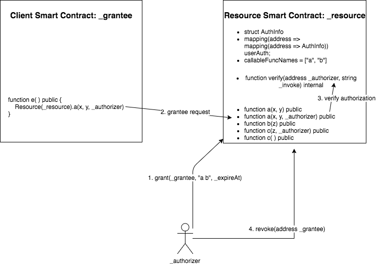

DAuth 访问委托标准
=====

## 简单概述
DAuth 是一个用于在智能合约和用户之间进行授权委托的标准接口。

## 摘要
DAuth 协议定义了一组标准 API，允许在智能合约之间进行身份委托，而无需用户的私钥。身份委托包括访问和操作委托合约中包含的用户数据和资产。

## 动机
设计 DAuth 的灵感来自在 Web 应用程序中广泛使用的 OAuth 协议。但与 OAuth 的集中式授权不同，DAuth 以分布式方式工作，从而提供更高的可靠性和通用性。

## 规范


**资源所有者**: 授权者

**资源合约**: 提供数据和操作符的合约

**API**: 受让人合约可以调用的资源合约 API

**客户端合约**: 使用授权来访问和操作数据的受让人合约

**受让人请求**: 客户端合约使用授权者的授权调用资源合约


**AuthInfo**
``` js
struct AuthInfo {
    string[] funcNames;
    uint expireAt;
}
```
必需 - 该结构体包含用户授权信息
* `funcNames`: 受授权合约可以调用的函数名称列表
* `expireAt`: 授权到期时间戳，以秒为单位

**userAuth**
```  js
mapping(address => mapping(address => AuthInfo)) userAuth;
```
必需 - userAuth 将（授权者地址，受让人合约地址）对映射到用户的授权 AuthInfo 对象

**callableFuncNames**
```  js
string[] callableFuncNames;
```
必需 - 允许其他合约调用的所有方法
* 可调用函数必须验证受让人的授权

**updateCallableFuncNames**
```  js
function updateCallableFuncNames(string _invokes) public returns (bool success);
```
可选 - 由资源合约的管理员更新客户端合约的可调用函数列表
* `_invokes`: 客户端合约可以调用的调用方法
* return: 是否更新了 callableFuncNames
* 此方法必须返回成功或抛出异常，不能有其他结果

**verify**
```  js
function verify(address _authorizer, string _invoke) internal returns (bool success);
```
必需 - 检查客户端合约的调用方法权限
* `_authorizer`: 客户端合约代理的用户地址
* `_invoke`: 客户端合约想要调用的调用方法
* return: 是否授权了受让人请求
* 此方法必须返回成功或抛出异常，不能有其他结果

**grant**
```  js
function grant(address _grantee, string _invokes, uint _expireAt) public returns (bool success);
```
必需 - 委托客户端合约访问用户的资源
* `_grantee`: 客户端合约地址
* `_invokes`: 客户端合约可以访问的可调用方法。它是一个字符串，包含所有以空格分隔的函数名称
* `_expireAt`: 授权到期时间戳，以秒为单位
* return: 授权是否成功
* 此方法必须返回成功或抛出异常，不能有其他结果
* 成功的授权必须触发 Grant 事件（如下定义）

**regrant**
```  js
function regrant(address _grantee, string _invokes, uint _expireAt) public returns (bool success);
```
可选 - 更改客户端合约的委托

**revoke**
```  js
function revoke(address _grantee) public returns (bool success);
```
必需 - 删除客户端合约的委托
* `_grantee`: 客户端合约地址
* return: 撤销是否成功
* 成功的撤销必须触发 Revoke 事件（如下定义）。

**Grant**
```  js
event Grant(address _authorizer, address _grantee, string _invokes, uint _expireAt);
```
* 当授权者在 `grant` 或 `regrant` 成功时授予新的授权时，必须触发此事件

**Revoke**
```  js
event Revoke(address _authorizer, address _grantee);
```
* 当授权者成功撤销特定授权时，必须触发此事件

**可调用的资源合约函数**

允许受让人调用的所有公共或外部函数必须使用重载来实现两个函数：第一个是用户直接调用的标准方法，第二个是具有相同函数名称的受让人方法，但多一个授权者地址参数。

示例:
```  js
function approve(address _spender, uint256 _value) public returns (bool success) {
    return _approve(msg.sender, _spender, _value);
}

function approve(address _spender, uint256 _value, address _authorizer) public returns (bool success) {
    verify(_authorizer, "approve");

    return _approve(_authorizer, _spender, _value);
}

function _approve(address sender, address _spender, uint256 _value) internal returns (bool success) {
    allowed[sender][_spender] = _value;
    emit Approval(sender, _spender, _value);
    return true;
}
```

## 动机

**当前限制**

当前许多智能合约的设计只考虑用户使用私钥自己调用智能合约函数。然而，在某些情况下，用户希望委托其他客户端智能合约来访问和操作他们在资源智能合约中的数据或资产。目前没有一个通用的协议来提供标准的委托方法。

**原理**

在以太坊平台上，所有存储都是透明的，并且 `msg.sender` 是可靠的。因此，DAuth 不需要像 OAuth 那样的 `access_token`。DAuth 只是记录用户对特定客户端智能合约地址的授权。这在以太坊平台上既简单又可靠。

## 向后兼容性
此 EIP 不引入向后兼容性问题。将来，新版本的协议必须保留这些接口。

## 实现
以下是 DAuth 接口的实现。此外，还提供了 EIP20 接口和 ERC-DAuth 接口的示例实现。开发人员可以使用 ERC-DAuth 接口和其他 EIP 轻松实现自己的合约。

* ERC-DAuth 接口的实现可在此处获得：

  https://github.com/DIA-Network/ERC-DAuth/blob/master/ERC-DAuth-Interface.sol

* EIP20 接口和 ERC-DAuth 接口的示例实现可在此处获得：

  https://github.com/DIA-Network/ERC-DAuth/blob/master/eip20-dauth-example/EIP20DAuth.sol


## 版权
版权及相关权利通过 [CC0](../LICENSE.md) 放弃。