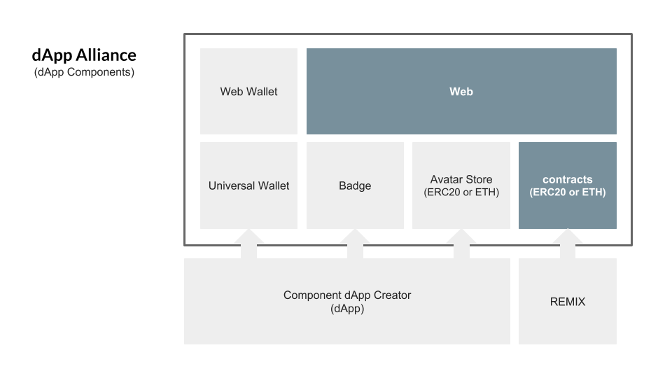
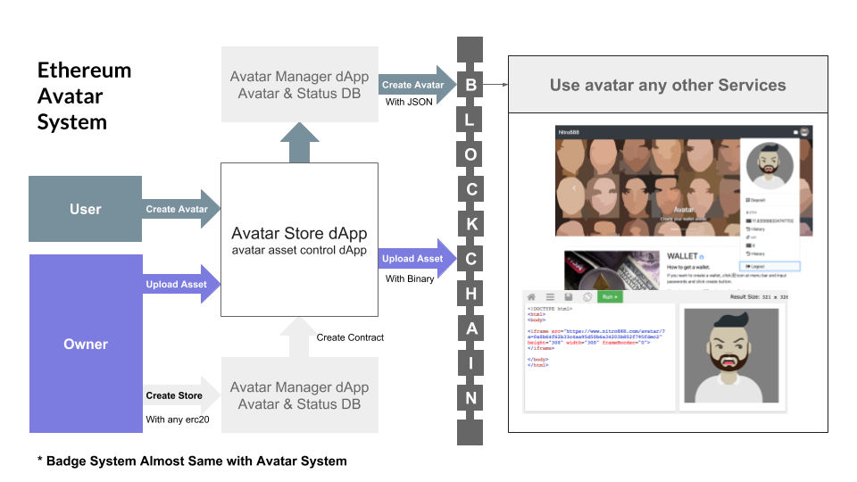
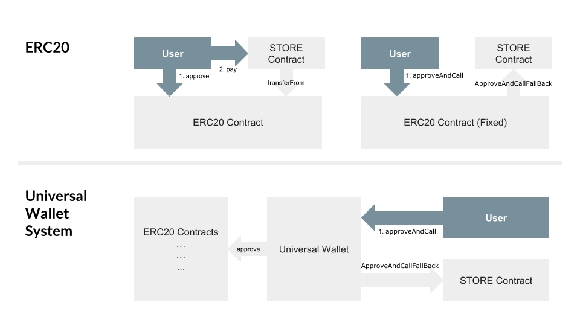

## 简单概要
合约是基于开源的。大多数开发者在项目开始时使用公共合约进行修改或直接包含它们。这是以项目为中心的集中式开发，我认为这是一种资源浪费。因此，我们建议使 dApp 或合约组件可以用于其他服务。

## 摘要
已经有人提出了基于 erc20 的修改过的 token 的建议，但是由于许多 token 已经建立在 erc20 上，因此有必要提高已开发的 erc20 token 的利用率。因此，我们提出了一个可以通用地使用 erc20 token 的通用钱包。我们还提出了一个组件 dApp，允许您创建和保存您的头像（& 社交徽章系统），并立即在其他服务中使用它。本文档中建议的所有 dApp 均基于去中心化开发，并且任何人都可以创建和参与。

## 动机
虽然许多项目都在以开源方式开发，但它们只是简单地将开源代码添加到他们的项目中并进行部署。这意味着您正在开发一个集中式服务，该服务使用您自己的 dApp 生成的信息。为了改善区块链生态系统，由 dApp 创建并放置在公共区块链中的所有资源必须可以在另一个 dApp 中重复使用。这意味着您可以通过与其他 dApp 交换生成的信息来增强您的服务。同样，ERC20 Token 需要通用钱包标准才能易于用于直接交易。

### 改善区块链生态系统的种子。
- 协同作用 - 与其他 dApp 和资源。
- 增强的界面 - 对于 ERC20 token。
- 简单 & 去中心化 - 每个人都应该能够轻松地添加到他们的服务中，而无需审查。

#### 以下头像商店、徽章系统和通用钱包是关于组件 dApp 的一些例子。


## 规范
### 1. 头像
#### 1.1. 头像商店
- 在设置 ERC20 货币后创建头像商店。
- 您可以自定义资产类别和查看器脚本。

#### 1.2. 上传资产和用户数据
头像的信息和资产存储在区块链的事件日志部分中。
- 资产为 SVG 格式。（使用 gzip 压缩）
- 头像信息数据为 json 格式（使用 msgpack 压缩）


** 来自 [Avataaars](https://github.com/fangpenlin/avataaars) 的头像资产由 [Fang-Pen Lin](https://twitter.com/fangpenlin) 开发，原始头像由 [Pablo Stanley](https://twitter.com/pablostanley) 设计。

### 2. 通用钱包

#### 2.1. ERC20 接口
``` js
contract ERC20Interface {
    function totalSupply() public constant returns (uint);
    function balanceOf(address tokenOwner) public constant returns (uint balance);
    function allowance(address tokenOwner, address spender) public constant returns (uint remaining);
    function transfer(address to, uint tokens) public returns (bool success);
    function approve(address spender, uint tokens) public returns (bool success);
    function transferFrom(address from, address to, uint tokens) public returns (bool success);

    event Transfer(address indexed from, address indexed to, uint tokens);
    event Approval(address indexed tokenOwner, address indexed spender, uint tokens);
}
```

#### 2.2. 用于在一个调用中接收批准和执行功能的固定 ERC20 合约
``` js
function approveAndCall(address spender, uint tokens, bytes data) public returns (bool success) {
    allowed[msg.sender][spender] = tokens;
    emit Approval(msg.sender, spender, tokens);
    ApproveAndCallFallBack(spender).receiveApproval(msg.sender, tokens, this, data);
    return true;
}
```

#### 2.3. 以及用于固定 ERC20 的 ApproveAndCallFallBack 合约。
但是，许多 ERC20 token 尚未准备好。
``` js
contract ApproveAndCallFallBack {
    function receiveApproval(address from, uint256 tokens, address token, bytes data) public;
}
```
#### 2.4. 通用钱包
我们提出了一个通用钱包来解决这个问题。

``` js
contract UniversalWallet is _Base {

    constructor(bytes _msgPack) _Base(_msgPack) public {}
    function () public payable {}

    //-------------------------------------------------------
    // erc20 接口
    //-------------------------------------------------------
    function balanceOf(address _erc20) public constant returns (uint balance) {
        if(_erc20==address(0))
            return address(this).balance;
        return _ERC20Interface(_erc20).balanceOf(this);
    }
    function transfer(address _erc20, address _to, uint _tokens) onlyOwner public returns (bool success) {
        require(balanceOf(_erc20)>=_tokens);
        if(_erc20==address(0))
            _to.transfer(_tokens);
        else
            return _ERC20Interface(_erc20).transfer(_to,_tokens);
        return true;
    }
    function approve(address _erc20, address _spender, uint _tokens) onlyOwner public returns (bool success) {
        require(_erc20 != address(0));
        return _ERC20Interface(_erc20).approve(_spender,_tokens);
    }

    //-------------------------------------------------------
    // pay 接口
    //-------------------------------------------------------
    function pay(address _store, uint _tokens, uint256[] _options) onlyOwner public {
        address erc20   = _ApproveAndCallFallBack(_store).erc20();
        address spender = _ApproveAndCallFallBack(_store).spender();
        if(erc20 == address(0)) {
            transfer(erc20,spender,_tokens);
            _ApproveAndCallFallBack(_store).receiveApproval(_options);
        } else {
            _ERC20Interface(erc20).approve(spender,_tokens);
            _ApproveAndCallFallBack(_store).receiveApproval(_options);
        }
    }
    function pay(address _store, uint _tokens, bytes _msgPack) onlyOwner public {
        address erc20   = _ApproveAndCallFallBack(_store).erc20();
        address spender = _ApproveAndCallFallBack(_store).spender();
        if(erc20 == address(0)) {
            transfer(erc20,spender,_tokens);
            _ApproveAndCallFallBack(_store).receiveApproval(_msgPack);
        } else {
            _ERC20Interface(erc20).approve(spender,_tokens);
            _ApproveAndCallFallBack(_store).receiveApproval(_msgPack);
        }
    }
}
```

## 测试用例
- https://www.nitro888.com
- https://github.com/Nitro888/nitro888.github.io
- https://github.com/Nitro888/dApp-Alliance

## 版权
版权及相关权利通过 [CC0](../LICENSE.md) 放弃。
