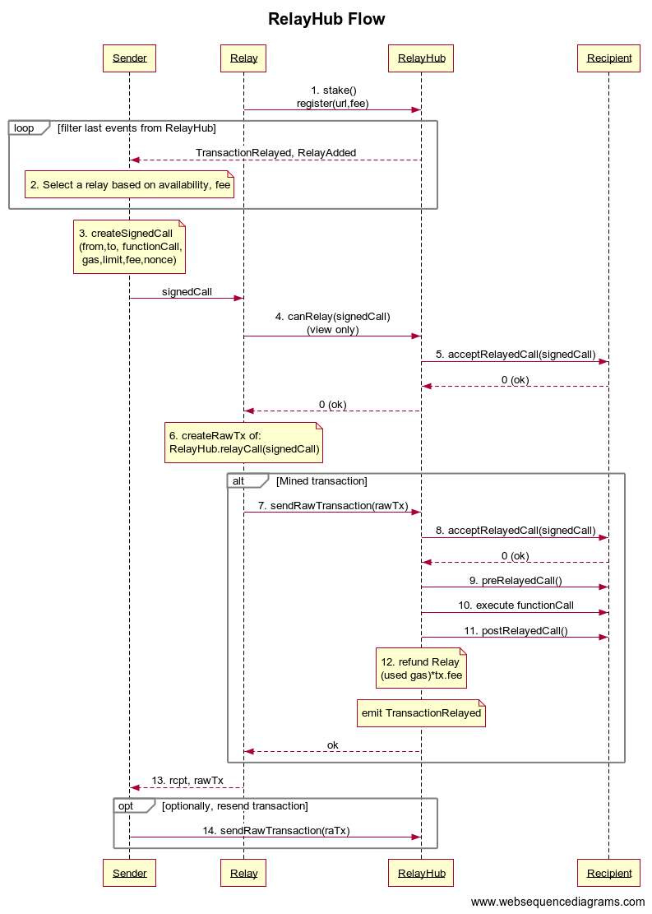

## 简述
通过允许合约接受“[对方付费电话](https://en.wikipedia.org/wiki/Collect_call)”，并为来电付费，使智能合约（例如 dapps）能够被非以太币用户访问。
让合约“监听”公共可访问的通道（例如 web URL 或 whisper 地址）。
激励节点运行“gas stations”来促进这一点。
不需要网络更改，并且合约更改最少。

## 摘要
目前，与 dapps 通信需要支付 ETH 作为 gas 费用，这限制了 dapp 在以太币用户中的采用。
因此，合约所有者可能希望支付 gas 费用来增加用户获取，或者让他们的用户用法币支付 gas 费用。
或者，第三方可能希望补贴某些合约的 gas 费用。
[EIP-1077](./eip-1077.md) 中描述的解决方案可以允许来自不持有 ETH 的地址的交易。

gas stations network 是一个符合 [EIP-1077](./eip-1077.md) 的工作，旨在通过激励节点运行 gas stations 来解决这个问题，gasless 交易可以在其中“加油”。
它从 dapp 维护者和用户那里抽象出实现细节，从而可以轻松地将现有 dapps 转换为接受“对方付费电话”。

该网络由一个受所有参与 dapp 合约信任的公共合约和一个去中心化的中继节点网络（gas stations）组成，这些中继节点被激励去监听非以太币接口（如 web 或 whisper），
支付交易费用并从该合约获得补偿。受信任的合约可以被任何人验证，并且系统在其他方面是无需信任的。
只要至少有一个诚实的 gas station，gas stations 就无法审查交易。破坏系统的企图可以在链上证明，并且可以惩罚违规者。

## 动机

* 通过以下方式增加智能合约的用户采用率：
    * 消除用户获取 ETH 的麻烦。交易仍然由 ETH 支付，但费用可以由 dapp 承担，或者由用户通过其他方式支付。
    * 消除直接与区块链交互的需要，同时保持去中心化和抗审查性。
      合约可以“监听”多个公共通道，并且用户可以通过即使在限制性环境中通常也被允许的通用协议与合约交互。
* 以太坊节点获得收入来源，而无需采矿设备。整个网络受益于拥有更多节点。
* 无需协议更改。gas station network 通过智能合约进行自组织，dapps 通过实现接口与网络交互。

## 规范

该系统由一个 `RelayHub` 单例合约、继承 `RelayRecipient` 合约的参与合约、一个去中心化的 `Relay` 节点网络（又名 Gas Stations）组成，
以及通过 relays 与合约交互的用户应用程序（例如，移动或 web）。

`RelayHub` 的角色：

* 维护一个活动的 relays 列表。发送者从此列表中为每个交易选择一个 `Relay`。选择过程将在下面讨论。
* 调解 relays 和合约之间的所有通信。
* 为合约提供受信任的实际 msg.sender 和 msg.data 版本。
* 持有 relays 放置的 ETH 质押。强制执行最小质押规模。在 relay 注销并等待冷却期后，可以提取质押。
* 持有合约预付的 ETH 预付款，并使用它们来补偿 relays。
* 通过将其质押提供给提供证明的地址来惩罚可证明具有攻击性的 relays，从而保持 relays 的诚实。
* 为 relays 提供一种免费的方式来了解他们是否会因未来的交易获得补偿。

`Relay` 节点的角色：

* 维护一个包含少量 ETH 的热钱包，以支付 gas 费用。
* 提供一个公共接口，供用户应用程序通过诸如 https 或 whisper 之类的通道发送 gasless 交易。
* 在 `RelayHub` 中发布其公共接口及其价格（作为实际交易 gas 成本的倍数）。
* 可选择通过 RelayHub 监视其他 relays 的已回滚交易，捕获违规 relays 并索取其质押。这可以由任何人完成，而不仅仅是 relay。

实现一个 `RelayRecipient` 合约：

* 知道 `RelayHub` 的地址并信任它提供有关交易的信息。
* 在 `RelayHub` 中维护一小笔 ETH gas 预付款存款。可以直接由 `RelayRecipient` 合约支付，也可以由 dapp 的所有者代表 `RelayRecipient` 地址支付。
  dapp 所有者负责确保下一次交易有足够的余额，并且可以在出现问题时停止存款，从而限制系统错误的潜在滥用。在 DAO 用例中，将由 DAO 逻辑来维持足够的存款。
* 到处使用 `getSender()` 和 `getMessageData()` 代替 `msg.sender` 和 `msg.data`。`RelayRecipient` 提供这些功能并从 `RelayHub` 获取信息。
* 实现一个 `acceptRelayedCall(address relay, address from, bytes memory encodedFunction, uint gasPrice, uint transactionFee, bytes memory approval)` 视图函数，如果且仅当它愿意接受交易并为其付款时，该函数才返回**零**。
  当 `Relay` 查询 `RelayHub` 时，以及在实际交易期间，`RelayHub` 会将 `acceptRelayedCall` 作为视图函数调用。（如果**非零**，则交易会被回滚，并且只有在 `acceptRelayedCall` 返回**零**时，`Relay` 才会获得交易补偿（无论交易成功还是回滚）。以下是一些 `acceptRelayedCall()` 实现的示例：
    * 受信任 dapp 成员的白名单。
    * 由 dapp 所有者维护的注册用户资产负债表。用户使用信用卡或其他非 ETH 方式向 dapp 付款，并在 `RelayRecipient` 资产负债表中记入贷方。
      用户绝不会使 dapp 的成本超过他们被记入贷方的金额。
    * dapp 可以向交易发送者提供一个名为 `approval` 的链下签名消息并验证它。
    * 用于引导新用户的已知交易的白名单。这允许某些匿名调用，并会受到女巫攻击。
      因此，它应该与受限制的 gasPrice 和受信任 relays 的白名单结合使用，以减少 relays 创建虚假交易并窃取 dapp 预付 gas 租金的动机。
      允许匿名引导交易的 Dapps 可能会受益于注册自己的 `Relay` 并仅接受来自该 `Relay` 的匿名交易，而其他交易可以从任何 relay 接受。
      或者，dapps 也可以使用资产负债表方法进行引导，方法是应用以下 attacks/mitigations 部分中建议的方法。
* 实现 `preRelayedCall(address relay, address from, bytes memory encodedFunction, uint transactionFee) returns (bytes32)`。此方法在交易中继之前被调用。默认情况下，它什么也不做。

* 实现 `postRelayedCall(ddress relay, address from, bytes memory encodedFunction, bool success, uint usedGas, uint transactionFee, bytes32 preRetVal)`。此方法在交易中继之后被调用。默认情况下，它什么也不做。

  这两种方法可用于以 dapp 特定的方式向用户收费。

以下过程中使用的术语表：

* `RelayHub` - 每个人都使用的 RelayHub 单例合约。
* `Recipient` - 实现 `RelayRecipient` 的合约，接受来自 RelayHub 合约的中继交易，并为传入交易付费。
* `Sender` - 具有有效密钥对但没有 ETH 支付 gas 费用的外部地址。
* `Relay` - 在外部地址中持有 ETH 的节点，在 RelayHub 中列出，并以收费方式将交易从中继到 RelayHub。

注册/刷新 `Relay` 的过程：

* Relay 开始以 web 应用程序（或其他某些通信通道）的身份进行侦听。
* 如果是第一次启动（还没有密钥），请为 Relay 的地址生成一个密钥对。
* 如果 Relay 的地址没有足够的资金来支付 gas 费用（例如，因为它刚刚生成），则 Relay 将保持非活动状态，直到其所有者为其提供资金。
* Relay 的所有者为其提供资金。
* Relay 的所有者通过调用 `RelayHub.stake(address relay, uint unstakeDelay)` 将所需的质押发送到 `RelayHub`。
* `RelayHub` 将 `owner` 和 `unstake delay` 放入 relays 映射中，并按 `relay` 地址建立索引。
* Relay 使用 relay 的 `transaction fee`（作为交易 gas 成本的倍数）和传入交易的 URL 调用 `RelayHub.registerRelay(uint transactionFee, string memory url)`。
* `RelayHub` 确保 Relay 拥有足够的质押。
* `RelayHub` 将 `transaction fee` 放入 relays 映射中。
* `RelayHub` 发出一个事件 `RelayAdded(Relay, owner, transactionFee, relayStake, unstakeDelay, url)`。
* Relay 启动一个计时器，每 6000 个区块执行一次 `keepalive` 交易。
* `Relay` 进入休眠状态并等待签名请求。

发送中继交易的过程：

* `Sender` 通过查看来自 `RelayHub` 的 `RelayAdded` 事件，并根据自己的标准进行排序，从 RelayHub 的列表中选择一个活动的 `Relay`。选择可能基于以下各项的组合：
    * Relay 发布的交易费用。
    * Relay 质押规模和锁定时间。
    * 最近的 relay 交易（通过 `RelayHub` 的 `TransactionRelayed` 事件可见）。
    * （可选）发送者应用程序本身或其后端按应用程序持有的信誉/黑名单/白名单（不是 gas stations network 的一部分）。
* Sender 准备交易，其中包含 Sender 的地址、接收者地址、实际交易数据、Relay 的交易费用、gas 价格、gas 限制、来自 `RelayHub.nonces` 的当前 nonce、RelayHub 的地址和 Relay 的地址，然后对其进行签名。
* Sender 验证 `RelayHub.balances[recipient]` 是否持有足够的 ETH 来支付 Relay 的费用。
* Sender 验证 `Relay.balance` 是否持有足够的 eth 来发送交易
* Sender 读取 Relay 的当前 `nonce` 值并确定 `max_nonce` 参数。
* Sender 将签名的交易和元数据发送到 Relay 的 web 界面。
* `Relay` 用零 ETH 值的到 `RelayHub` 的交易包装该交易。
* `Relay` 使用其密钥对包装器交易进行签名，以便支付 gas 费用。
* `Relay` 验证：
    * 交易的接收者合约在提交时将接受此交易，方法是调用 `RelayHub.canRelay()`，这是一个视图函数，
      它会检查接收者的 `acceptRelayedCall`（也是一个视图函数），说明它是否愿意接受费用）。
    * 交易 nonce 与 `RelayHub.nonces[sender]` 匹配。
    * 交易中的 relay 地址与 Relay 的地址匹配。
    * 交易的接收者在 `RelayHub` 中存入了足够的 ETH 来支付交易费用。
    * Relay 有足够的 ETH 来支付交易所需的 gas 费用。
    * `max_nonce` 的值高于当前的 Relay 的 `nonce`
* 如果 Relay 的任何检查失败，则它会将错误返回给发送者，并且不继续。
* Relay 将签名的包装交易提交到区块链。
* Relay 立即将签名的包装交易返回给发送者。此步骤将在下面的 attacks/mitigations 中讨论。
* `Sender` 接收包装的交易并验证：
    * 它是从 Relay 的地址到 `RelayHub` 的有效 relay 调用。
    * 交易的以太坊 nonce 与 Relay 的当前 nonce 匹配。
    * 交易的以太坊 nonce 小于或等于 `max_nonce`。
    * `Relay` 已获得充分的资金来支付费用。
    * 接收者合约在 `RelayHub.balances` 中有足够的资金来支付交易中规定的 Relay 的费用。
* 如果发送者的任何检查失败，则它将返回以选择新的 Relay。发送者还可以向其后端提交有关无响应 relay 的报告，或者将其保存在本地，以便在以后的交易中降低此 relay 的排序。
* `Sender` 还可以通过任何以太坊节点将原始包装交易提交到区块链，而无需支付 gas 费用。
  此提交很可能会被忽略，因为网络待处理交易中已经存在相同的交易，但是重复提交没有害处，以确保它发生。
  此步骤并非绝对必要，原因将在下面的 attacks/mitigations 中讨论，但可以加快速度。
* `Sender` 监视区块链，等待交易被挖掘。
  该交易已使用 Relay 的当前 nonce 进行了验证，因此挖掘必须成功，除非 Relay 提交了另一个（不同的）具有相同 nonce 的交易。
  如果由于此类攻击而导致挖掘失败，则发送者可以通过另一个 relay 调用 `RelayHub.penalizeRepeatedNonce`，以获取其奖励并烧毁攻击性 relay 质押的剩余部分，然后返回以选择用于交易的新 Relay。
  请参阅下面的 attacks/mitigations 部分中的讨论。
* `RelayHub` 接收交易：
    * 记录 `gasleft()` 作为 `initialGas` 以供以后付款。
    * 验证交易是否从注册的 relay 发送。
    * 验证内部交易的签名与其声明的来源（发送者的密钥）是否匹配。
    * 验证交易中写入的 relay 地址是否与 msg.sender 匹配。
    * 验证交易的 `nonce` 是否与 `RelayHub.nonces` 中声明的来源的 nonce 匹配。
    * 调用接收者的 `acceptRelayedCall` 函数，询问其是否要接受交易。如果不是，则将发出 `TransactionRelayed`，状态为 `CanRelayFailed`，并且 `chargeOrCanRelayStatus` 将包含 `acceptRelayedCall` 的返回值。在这种情况下，Relay 不会获得报酬，因为它有责任在发布交易之前检查 `RelayHub.canRelay`。
    * 调用接收者的 `preRelayedCall` 函数。如果此调用恢复，则将发出状态为 `PreRelayedFailed` 的 `TransactionRelayed`。
    * 将交易发送给接收者。如果此调用恢复，则将发出状态为 `RelayedCallFailed` 的 `TransactionRelayed`。
      在将 gas 传递给 `call()` 时，`RelayHub` 会保留足够的 gas 用于调用后处理。接收者可能会耗尽 gas，但 `RelayHub` 永远不会。
      `RelayHub` 还在 `msg.data` 的末尾发送发送者的地址，因此 `RelayRecipient.getSender()` 将能够提取真实的发送者，并信任它，因为该交易来自已知的 `RelayHub` 地址。
* 接收者合约处理交易。
* `RelayHub` 调用接收者的 `postRelayedCall`。
* `RelayHub` 检查 call 的返回值，并发出 `TransactionRelayed(address relay, address from, address to, bytes4 selector, uint256 status, uint256 chargeOrCanRelayStatus)`。
* `RelayHub` 增加 `RelayHub.nonces[sender]`。
* `RelayHub` 将 ETH 余额从接收者转移到 `Relay.owner`，以根据测量的交易成本支付交易费用。
  关于 relay 付款的说明：无论接收者是否恢复，relay 都会获得实际使用的 gas 的报酬。
  relay 遭受损失的唯一情况是 `canRelay` 返回非零值，因为 relay 有责任在提交之前验证此视图函数。
  任何其他还原都会被捕获并支付费用。请参阅下面的 attacks/mitigations。
* `Relay` 跟踪其发送的交易，并等待 `TransactionRelayed` 事件以查看费用。
  如果交易恢复并且未付款，这意味着接收者的 `acceptRelayedCall()` 函数不一致，则 `Relay` 会暂时拒绝向该接收者提供服务（或者如果经常发生，则无限期地将其列入黑名单）。
  请参阅下面的 attacks/mitigations。

关闭 `Relay` 的过程：

* Relay 的所有者（最初为其提供资金的地址）调用 `RelayHub.removeRelayByOwner(Relay)`。
* `RelayHub` 确保发送者确实是 Relay 的所有者，然后删除 `Relay`，并发出 `RelayRemoved(Relay)`。
* `RelayHub` 启动倒计时，以释放所有者的质押。
* `Relay` 接收其 `RelayRemoved` 事件。
* `Relay` 将其所有剩余的 ETH 发送给其所有者。
* `Relay` 关闭。
* 一旦所有者的解除质押延迟结束，所有者将调用 `RelayHub.unstake()` 并提取质押。

## 论证
gas stations network 设计的基本原理是易于采用和稳健性的结合。

为了便于采用，设计目标是：

* 没有网络更改。
* 对合约、应用程序和框架的最小更改。

稳健性要求转化为去中心化和抗攻击性。gas stations network 是去中心化的，我们必须假设任何实体都可能攻击系统中的其他实体。

具体来说，我们考虑了以下类型的攻击：

* 针对单个发送者的拒绝服务攻击，即交易审查。
* 针对单个 relays 的拒绝服务和财务攻击。
* 针对单个合约的拒绝服务和财务攻击。
* 针对整个网络的拒绝服务攻击，无论是通过攻击现有实体，还是通过引入任意数量的恶意实体。

#### 攻击和缓解措施

##### 攻击：Relay 尝试通过不签名或以其他方式忽略用户请求来审查交易。
Relay 应立即将签名的交易返回给发送者。
发送者无需等待交易被挖掘，并且立即知道其请求是否已得到服务。
如果 relay 在几秒钟内未返回签名的交易，则发送者会取消操作，断开连接并切换到另一个 relay。
它还在其私有存储中将 Relay 标记为无响应，以避免在不久的将来使用它。

因此，relay 通过此类攻击可能造成的最大损害是一次性的几秒钟延迟。过了一段时间，发送者将完全避免使用它。

##### 攻击：Relay 尝试通过对其进行签名，将其返回给发送者，但从不将其放在区块链上来审查交易。
这次攻击会适得其反，并且不会审查交易。
发送者可以将 Relay 签名的交易作为原始交易通过任何节点提交到区块链，因此该交易确实会发生，
但 Relay 可能不知道，因此会卡在错误的 nonce 中，这会破坏其下一次交易。

##### 攻击：Relay 尝试通过对其进行签名来审查交易，但发布具有相同 nonce 的不同交易。
重用 nonce 是 Relay 执行的唯一 DoS，在 http 请求期间无法在几秒钟内检测到。
只有在具有相同 nonce 的恶意交易被挖掘并触发 `RelayHub.TransactionRelayed` 事件时，才能检测到它。
但是，这次攻击会适得其反，并使 Relay 损失其全部质押。

发送者有一个来自 Relay 的签名交易，nonce 为 N，并且还从区块链获得一个已挖掘的交易，nonce 为 N，也由 Relay 签名。
这证明 Relay 对发送者执行了 DoS 攻击。
发送者调用 `RelayHub.penalizeRepeatedNonce(bytes transaction1, bytes transaction2)`，该调用会验证攻击，没收 Relay 的质押，
并将其中一半发送给提供 `penalizeRepeatedNonce` 调用的发送者。通过将其发送到 `address(0)` 来烧毁另一半质押。这样做是为了防止作弊 relays 有效地惩罚自己并逃脱损失。
然后，发送者继续选择一个新的 relay 并发送原始交易。

此类攻击的结果是在发送交易时延迟了几个区块（直到检测到攻击），但 relay 会被删除并损失其全部质押。
扩大此类攻击的规模将非常昂贵，实际上对于发送者和诚实的 relays 来说非常有利可图。

##### 攻击：Relay 尝试通过对其进行签名来审查交易，但使用的 nonce 高于其当前的 nonce。
在此攻击中，Relay 确实创建并返回了一个完全有效的交易，但是在 Relay 用“缺失”交易填补 nonce 中的空白之前，不会挖掘该交易。
这可能会无限期地延迟某些交易的中继。为了缓解这种情况，发送者在其签名请求中包含一个 `max_nonce` 参数。
建议比当前 nonce 高 2-3，以允许 relay 处理多个交易。

当发送者收到由 Relay 签名的交易时，他会验证所使用的 nonce 是否有效，如果无效，则客户端将忽略给定的 relay，并使用其他 relays 来中继给定的交易。因此，此类攻击不会引入任何实际延迟。

##### 攻击：Dapp 尝试通过实施不一致的 acceptRelayedCall() 并使用多个发送者地址生成昂贵的交易来烧毁 relays 资金，因此对 relays 执行 DoS 攻击并降低其盈利能力。
在此攻击中，合约设置了一个不一致的 acceptRelayedCall（例如，对于偶数区块返回零，对于奇数区块返回非零），并使用它通过未付款交易耗尽 relay 资源。
Relays 事后很容易检测到它。
如果交易未付款，则 relay 知道接收者合约的 acceptRelayedCall 的行为不一致，因为 relay 在发送交易之前已验证了其视图函数。
这可能是合约的状态在视图调用和交易之间发生了变化的罕见竞争条件的结果，但是如果发生得过于频繁，relays 会将此合约列入黑名单并拒绝为其提供交易服务。
在被列入黑名单之前，每个攻击性合约只会对 relay 造成很小的损害（例如，2-3 笔交易的成本）。

Relays 也可以查看区块链上接收者的历史记录，寻找过去未付款的交易（由 RelayHub 回滚而未付款），并且拒绝为失败率高的合约提供服务。
如果合约对一些 relays 造成了这种很小的损失，则所有 relays 将停止为其提供服务，因此它不会造成进一步的损害。

此攻击无法扩展，因为创建恶意合约的成本与它可能对网络造成的损害处于同一数量级。
造成足够的损害以耗尽所有 relays 的资源将非常昂贵。

通过将 RelayHub 设置为要求 dapps 在获得服务之前进行质押，并强制执行解除质押延迟，可以使攻击更加不切实际，
因此攻击者必须筹集大量 ETH 才能同时创建足够的恶意合约并攻击 relays。
此保护可能过度，因为攻击无法扩展。

##### 攻击：用户尝试通过注册自己的 relay 并向 dapps 发送昂贵的交易来窃取 dapps。
如果恶意发送者通过发送无意义/已恢复的交易并导致接收者为 relay 付款而未获得任何回报来反复滥用接收者，
则接收者有责任将该发送者列入黑名单，并使其 acceptRelayedCall 函数返回该发送者的非零值。
对方付费电话通常不适用于接收者未知的匿名发送者。
利用 gas station network 的 Dapps 应该有一种方法来将恶意用户列入其系统的黑名单，并防止女巫攻击。

缓解此类女巫攻击的一种简单方法是，dapp 让用户使用信用卡购买信用，并在 dapp 合约中记入其帐户，
因此，仅当用户的信用足够时，acceptRelayedCall() 才会返回零，并在为该用户中继交易时，从用户的余额中扣除支付给 relay 的金额。
使用此方法，攻击者只能烧毁自己的资源，而不能烧毁 dapp 的资源。

此方法的一种变体，对于免费 dapps（不向用户收费，而喜欢为用户的交易付款）是要求在 web 界面中创建用户期间进行验证码验证，
或使用 Google/Facebook 帐户登录，这会将攻击的速率限制为攻击者打开许多 Google/Facebook 帐户的能力。
只有通过该过程的用户才能在 RelayRecipient 中获得信用。此类女巫攻击的发生率太低，不会造成任何实际损害。

##### 攻击：攻击者试图通过注册许多不可靠的 relays 来降低网络可用性。
注册 relay 需要在 RelayHub 中进行质押，并且只有在 relay 注销且经过较长的冷却期（例如一个月）后才能提取质押。

每个不可靠的 relay 只能对发送者造成几秒钟的延迟（一次），然后会被他们列入黑名单，如上面的第一个攻击中所述。
在造成这种很小的延迟并被列入黑名单之后，攻击者必须等待一个月才能重新使用资金来启动另一个不可靠的 relay。
同时启动大量不可靠的 relays，足以导致明显的网络延迟，由于所需的质押，这将非常昂贵，
即使这样，所有这些 relays 也会在短时间内被列入黑名单。

##### 攻击：攻击者试图重放中继的交易。
交易包括一个 nonce。RelayHub 为每个发送者维护一个 nonce（计数器）。具有错误 nonce 的交易会被 RelayHub 回滚。每笔交易只能中继一次。

##### 攻击：用户不执行从 Relayer 收到的原始交易，因此阻止执行此 relayer 签名的所有进一步交易
用户实际上不必执行原始交易。用户可以执行就足够了。relay 和发送者之间的关系是相互不信任。上面描述的过程激励 relay 执行交易，因此用户无需等待实际挖掘就知道交易已执行。

一旦 relay 返回签名的交易（应该立即发生），它就会被激励也在链上执行它，以便它可以推进其 nonce 并服务于下一次交易。用户也可以（但不必）执行交易。要理解为什么此攻击不可行，请考虑将签名交易返回给发送者后的四种可能的情况：

1. Relay 执行交易，但用户不执行。在这种情况下，交易已执行，因此没有问题。这是此攻击中描述的情况。
2. Relay 不执行交易，但用户执行交易。与 1 类似，交易已执行，因此没有问题。
3. 他们都执行交易。这些交易在待处理交易池中是相同的，因此该交易被执行一次。没问题。
4. 他们都不执行交易。在这种情况下，交易未执行，但 relay 卡住了。它无法使用下一个 nonce 服务于下一次交易，因为其 nonce 尚未在链上推进。它也无法使用当前 nonce 服务于下一次交易，因为这可以由用户证明，用户具有同一 relay 签名的具有相同 nonce 的两个不同交易。用户可以使用它来获取 relay 的 nonce。因此，除非 relay 执行交易，否则 relay 会卡住。

正如该矩阵所示，一旦 relay 将交易返回给用户，relay 总是被激励执行交易，以便最终出现在 #1 或 #3 中，并避免 #4 的风险。这只是一种承诺 relay 完成其工作的方式，而无需用户等待链上确认。

## 向后兼容性

gas stations network 作为智能合约和外部实体实现，不需要任何网络更改。

添加 gas station network 支持的 Dapps 仍然与其现有的应用程序/用户向后兼容。添加的方法应用于现有方法的顶部，因此现有应用程序不需要进行任何更改。

## 实现

[**gas stations network**](https://github.com/tabookey-dev/tabookey-gasless) 的有效实现正在由 **TabooKey** 开发。它由 `RelayHub`、`RelayRecipient`、`web3 hooks`、`geth` 中的 gas station 实现以及使用 gas stations network 的示例 dapps 组成。

## 版权
Copyright 及相关权利通过 [CC0](../LICENSE.md) 放弃。