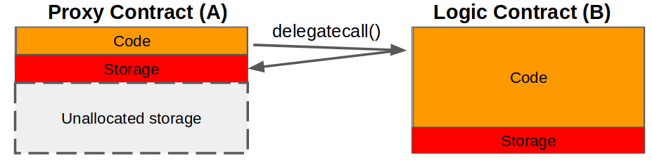

## 简单总结

标准的可升级代理合约。

## 抽象

以下描述了一种代理合约的标准，它与所有合约普遍兼容，并且不会在代理和业务逻辑合约之间产生不兼容性。这是通过利用代理合约中的唯一存储位置来存储逻辑合约的地址来实现的。兼容性检查确保升级成功。升级可以执行无限次，或由自定义逻辑确定。此外，还提供了一种从多个构造函数中进行选择的方法，该方法不会影响验证字节码的能力。

## 动机

- 改进现有的代理实现，以改善部署和维护代理和逻辑合约的开发者体验。

- 标准化和改进用于验证代理合约使用的字节码的方法。

## 术语

- `delegatecall()` - 合约 **A** 中的函数，允许外部合约 **B**（委托）修改 **A** 的存储（参见下图，[Solidity 文档](https://solidity.readthedocs.io/en/v0.5.3/introduction-to-smart-contracts.html#delegatecall-callcode-and-libraries)）
- **代理合约** - 合约 **A** 存储数据，但通过 `delegatecall()` 使用外部合约 **B** 的逻辑。
- **逻辑合约** - 合约 **B** 包含代理合约 **A** 使用的逻辑
- **可代理合约** - 在逻辑合约 **B** 中继承，以提供升级功能



## 规范

此处提出的代理合约应按原样部署，并用作任何现有合约生命周期管理方法的直接替代品。除了代理合约之外，我们还提出了可代理合约接口/基础，它建立了一种升级模式，该模式不会干扰现有的业务规则。允许升级的逻辑可以根据需要来实现。

### 代理合约

#### 函数

##### `fallback`

建议的回退函数遵循在其他代理合约实现中常见的模式，例如 [Zeppelin][1] 或 [Gnosis][2]。

但是，逻辑合约的地址不是强制使用变量，而是存储在定义的存储位置 `keccak256("PROXIABLE")`。这样就消除了代理和逻辑合约中变量之间发生冲突的可能性，从而提供了与任何逻辑合约的“通用”兼容性。

```javascript
function() external payable {
    assembly { // solium-disable-line
        let contractLogic := sload(0xc5f16f0fcc639fa48a6947836d9850f504798523bf8c9a3a87d5876cf622bcf7)
        calldatacopy(0x0, 0x0, calldatasize)
        let success := delegatecall(sub(gas, 10000), contractLogic, 0x0, calldatasize, 0, 0)
        let retSz := returndatasize
        returndatacopy(0, 0, retSz)
        switch success
        case 0 {
            revert(0, retSz)
        }
        default {
            return(0, retSz)
        }
    }
}
```

#### `constructor`

建议的构造函数接受任何类型的任意数量的参数，因此与任何逻辑合约构造函数兼容。

此外，代理合约构造函数的任意性质提供了从逻辑合约源代码中可用的一个或多个构造函数中进行选择的能力（例如，`constructor1`、`constructor2` 等）。请注意，如果逻辑合约中包含多个构造函数，则应包含一个检查以禁止在初始化后再次调用构造函数。

值得注意的是，支持多个构造函数的附加功能不会影响代理合约字节码的验证，因为初始化 tx 调用数据（输入）可以通过首先使用代理合约 ABI，然后使用逻辑合约 ABI 来解码。

下面的合约显示了建议的代理合约实现。

```javascript
contract Proxy {
    // Code position in storage is keccak256("PROXIABLE") = "0xc5f16f0fcc639fa48a6947836d9850f504798523bf8c9a3a87d5876cf622bcf7"
    constructor(bytes memory constructData, address contractLogic) public {
        // save the code address
        assembly { // solium-disable-line
            sstore(0xc5f16f0fcc639fa48a6947836d9850f504798523bf8c9a3a87d5876cf622bcf7, contractLogic)
        }
        (bool success, bytes memory _ ) = contractLogic.delegatecall(constructData); // solium-disable-line
        require(success, "Construction failed");
    }

    function() external payable {
        assembly { // solium-disable-line
            let contractLogic := sload(0xc5f16f0fcc639fa48a6947836d9850f504798523bf8c9a3a87d5876cf622bcf7)
            calldatacopy(0x0, 0x0, calldatasize)
            let success := delegatecall(sub(gas, 10000), contractLogic, 0x0, calldatasize, 0, 0)
            let retSz := returndatasize
            returndatacopy(0, 0, retSz)
            switch success
            case 0 {
                revert(0, retSz)
            }
            default {
                return(0, retSz)
            }
        }
    }
}
```

### 可代理合约

可代理合约包含在逻辑合约中，并提供执行升级所需的函数。兼容性检查 `proxiable` 可防止在升级期间进行不可修复的更新。

> :warning: 警告：`updateCodeAddress` 和 `proxiable` 必须存在于逻辑合约中。未能包含这些可能会阻止升级，并可能导致代理合约完全无法使用。请参见下面的 [限制危险函数](#restricting-dangerous-functions)

#### 函数

##### `proxiable`

兼容性检查以确保新的逻辑合约实现了通用可升级代理标准。请注意，为了支持未来的实现，可以更改 `bytes32` 比较，例如，`keccak256("PROXIABLE-ERC1822-v1")`。

##### `updateCodeAddress`

将逻辑合约的地址存储在代理合约中的存储 `keccak256("PROXIABLE")` 处。

下面的合约显示了建议的可代理合约的实现。

```javascript
contract Proxiable {
    // Code position in storage is keccak256("PROXIABLE") = "0xc5f16f0fcc639fa48a6947836d9850f504798523bf8c9a3a87d5876cf622bcf7"

    function updateCodeAddress(address newAddress) internal {
        require(
            bytes32(0xc5f16f0fcc639fa48a6947836d9850f504798523bf8c9a3a87d5876cf622bcf7) == Proxiable(newAddress).proxiableUUID(),
            "Not compatible"
        );
        assembly { // solium-disable-line
            sstore(0xc5f16f0fcc639fa48a6947836d9850f504798523bf8c9a3a87d5876cf622bcf7, newAddress)
        }
    }
    function proxiableUUID() public pure returns (bytes32) {
        return 0xc5f16f0fcc639fa48a6947836d9850f504798523bf8c9a3a87d5876cf622bcf7;
    }
}
```

## 使用代理时的陷阱

对于所有使用代理合约的逻辑合约，应采用以下常见最佳实践。

### 将变量与逻辑分离

在设计新的逻辑合约时，应仔细考虑，以防止在升级后与代理合约的现有存储发生不兼容。具体来说，不应修改在新合约中实例化变量的顺序，并且应在先前逻辑合约中的所有现有变量之后添加任何新变量。

为了方便这种做法，我们建议使用一个保存所有变量的“基本”合约，并在后续逻辑合约中继承该合约。这种做法大大降低了意外重新排列变量或在存储中覆盖变量的可能性。

### 限制危险函数

可代理合约中的兼容性检查是一种安全机制，可防止升级到未实现通用可升级代理标准的逻辑合约。但是，正如 parity 钱包黑客攻击事件中所发生的那样，仍然有可能对逻辑合约本身造成不可修复的损害。

为了防止对逻辑合约的损害，我们建议将任何潜在的破坏性函数的权限限制为 `onlyOwner`，并在部署后立即将逻辑合约的所有权转让给空地址（例如，address(1)）。潜在的破坏性函数包括本机函数，例如 `SELFDESTRUCT`，以及代码可能源自外部的函数，例如 `CALLCODE` 和 `delegatecall()`。在下面的 [ERC-20 代币](#erc-20-token) 示例中，使用 `LibraryLock` 合约来防止销毁逻辑合约。

## 例子

### 已拥有

在此示例中，我们展示了标准所有权示例，并将 `updateCodeAddress` 限制为仅所有者。

```javascript
contract Owned is Proxiable {
    // ensures no one can manipulate this contract once it is deployed
    // 确保合约一经部署，无人可以操纵
    address public owner = address(1);

    function constructor1() public{
        // ensures this can be called only once per *proxy* contract deployed
        // 确保每个*代理*合约只能调用一次
        require(owner == address(0));
        owner = msg.sender;
    }

    function updateCode(address newCode) onlyOwner public {
        updateCodeAddress(newCode);
    }

    modifier onlyOwner() {
        require(msg.sender == owner, "Only owner is allowed to perform this action");
        _;
    }
}
```

### ERC-20 代币

#### 代理合约

```javascript
pragma solidity ^0.5.1;

contract Proxy {
    // Code position in storage is keccak256("PROXIABLE") = "0xc5f16f0fcc639fa48a6947836d9850f504798523bf8c9a3a87d5876cf622bcf7"
    constructor(bytes memory constructData, address contractLogic) public {
        // save the code address
        // 保存代码地址
        assembly { // solium-disable-line
            sstore(0xc5f16f0fcc639fa48a6947836d9850f504798523bf8c9a3a87d5876cf622bcf7, contractLogic)
        }
        (bool success, bytes memory _ ) = contractLogic.delegatecall(constructData); // solium-disable-line
        require(success, "Construction failed");
    }

    function() external payable {
        assembly { // solium-disable-line
            let contractLogic := sload(0xc5f16f0fcc639fa48a6947836d9850f504798523bf8c9a3a87d5876cf622bcf7)
            calldatacopy(0x0, 0x0, calldatasize)
            let success := delegatecall(sub(gas, 10000), contractLogic, 0x0, calldatasize, 0, 0)
            let retSz := returndatasize
            returndatacopy(0, 0, retSz)
            switch success
            case 0 {
                revert(0, retSz)
            }
            default {
                return(0, retSz)
            }
        }
    }
}
```

#### 代币逻辑合约

``` javascript

contract Proxiable {
    // Code position in storage is keccak256("PROXIABLE") = "0xc5f16f0fcc639fa48a6947836d9850f504798523bf8c9a3a87d5876cf622bcf7"

    function updateCodeAddress(address newAddress) internal {
        require(
            bytes32(0xc5f16f0fcc639fa48a6947836d9850f504798523bf8c9a3a87d5876cf622bcf7) == Proxiable(newAddress).proxiableUUID(),
            "Not compatible"
        );
        assembly { // solium-disable-line
            sstore(0xc5f16f0fcc639fa48a6947836d9850f504798523bf8c9a3a87d5876cf622bcf7, newAddress)
        }
    }
    function proxiableUUID() public pure returns (bytes32) {
        return 0xc5f16f0fcc639fa48a6947836d9850f504798523bf8c9a3a87d5876cf622bcf7;
    }
}


contract Owned {

    address owner;

    function setOwner(address _owner) internal {
        owner = _owner;
    }
    modifier onlyOwner() {
        require(msg.sender == owner, "Only owner is allowed to perform this action");
        _;
    }
}

contract LibraryLockDataLayout {
  bool public initialized = false;
}

contract LibraryLock is LibraryLockDataLayout {
    // Ensures no one can manipulate the Logic Contract once it is deployed.
    // 确保合约一经部署后无人可以操纵。
    // PARITY WALLET HACK PREVENTION
    // PARITY 钱包黑客攻击预防

    modifier delegatedOnly() {
        require(initialized == true, "The library is locked. No direct 'call' is allowed");
        _;
    }
    function initialize() internal {
        initialized = true;
    }
}

contract ERC20DataLayout is LibraryLockDataLayout {
  uint256 public totalSupply;
  mapping(address=>uint256) public tokens;
}

contract ERC20 {
    //  ...
    function transfer(address to, uint256 amount) public {
        require(tokens[msg.sender] >= amount, "Not enough funds for transfer");
        tokens[to] += amount;
        tokens[msg.sender] -= amount;
    }
}

contract MyToken is ERC20DataLayout, ERC20, Owned, Proxiable, LibraryLock {

    function constructor1(uint256 _initialSupply) public {
        totalSupply = _initialSupply;
        tokens[msg.sender] = _initialSupply;
        initialize();
        setOwner(msg.sender);
    }
    function updateCode(address newCode) public onlyOwner delegatedOnly  {
        updateCodeAddress(newCode);
    }
    function transfer(address to, uint256 amount) public delegatedOnly {
        ERC20.transfer(to, amount);
    }
}
```

## 参考文献

- ["Escape-hatch" 代理 Medium 文章](https://medium.com/terminaldotco/escape-hatch-proxy-efb681de108d)

## 版权

在 [CC0](../LICENSE.md) 下放弃版权及相关权利。

[1]: https://github.com/maraoz/solidity-proxy/blob/master/contracts/Dispatcher.sol
[2]: https://blog.gnosis.pm/solidity-delegateproxy-contracts-e09957d0f201
