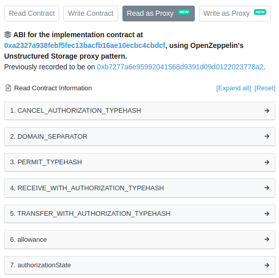

## 摘要
委托**代理合约**被广泛用于升级和节省 gas。这些代理依赖于一个**逻辑合约**（也称为实现合约或主副本），该合约使用 `delegatecall` 调用。这允许代理保持持久状态（存储和余额），同时代码被委托给逻辑合约。

为了避免代理和逻辑合约之间存储使用的冲突，逻辑合约的地址通常保存在一个特定的存储槽中（例如 OpenZeppelin 合约中的 `0x360894a13ba1a3210667c828492db98dca3e2076cc3735a920a3ca505d382bbc`），保证永远不会被编译器分配。这个 EIP 提出了一组标准槽来存储代理信息。这允许像区块浏览器这样的客户端正确提取并将这些信息展示给终端用户，并允许逻辑合约有选择地对其进行操作。

## 动机
委托代理被广泛使用，既可以支持升级，又可以降低部署的 gas 成本。这些代理的例子可以在 OpenZeppelin Contracts、Gnosis、AragonOS、Melonport、Limechain、WindingTree、Decentraland 和许多其他项目中找到。

然而，由于缺乏用于获取代理的逻辑地址的通用接口，因此无法构建基于此信息的通用工具。

一个经典的例子是区块浏览器。在这里，终端用户希望与底层的逻辑合约进行交互，而不是代理本身。拥有一个通用的方式来从代理中检索逻辑合约地址，允许区块浏览器显示逻辑合约的 ABI，而不是代理的 ABI。浏览器检查合约在指定槽中的存储，以确定它是否确实是一个代理，如果是，则显示关于代理和逻辑合约的信息。例如，这就是 `0xa0b86991c6218b36c1d19d4a2e9eb0ce3606eb48` 在 Etherscan 上的显示方式：



另一个例子是逻辑合约显式地基于它们被代理的事实进行操作。这允许它们潜在地触发代码更新作为其逻辑的一部分。一个通用的存储槽允许这些用例独立于所使用的特定代理实现。

## 规范
代理的监控对于许多应用程序的安全性至关重要。因此，必须能够跟踪实现和管理槽的变化。不幸的是，跟踪存储槽的变化并不容易。因此，建议任何更改这些槽的函数都应该发出相应的事件。这包括初始化，从 `0x0` 到第一个非零值。

建议的代理特定信息的存储槽如下。如有需要，可以在后续的 ERC 中添加更多用于附加信息的槽。

### 逻辑合约地址

存储槽 `0x360894a13ba1a3210667c828492db98dca3e2076cc3735a920a3ca505d382bbc`
(通过 `bytes32(uint256(keccak256('eip1967.proxy.implementation')) - 1)` 获得)。

保存此代理委托到的逻辑合约的地址。如果改用信标，则应该为空。对此槽的更改应通过以下事件通知：

```solidity
event Upgraded(address indexed implementation);
```

### 信标合约地址

存储槽 `0xa3f0ad74e5423aebfd80d3ef4346578335a9a72aeaee59ff6cb3582b35133d50` (通过 `bytes32(uint256(keccak256('eip1967.proxy.beacon')) - 1)` 获得)。

保存此代理依赖的信标合约的地址（回退）。如果直接使用逻辑地址，则应该为空，并且只有在逻辑合约槽为空时才应考虑使用。对此槽的更改应通过以下事件通知：

```solidity
event BeaconUpgraded(address indexed beacon);
```

信标用于将多个代理的逻辑地址保存在一个位置，允许通过修改单个存储槽来升级多个代理。一个信标合约必须实现以下函数：

```
function implementation() returns (address)
```

基于信标的代理合约不使用逻辑合约槽。相反，它们使用信标合约槽来存储它们所连接的信标的地址。为了知道信标代理使用的逻辑合约，客户端应该：

- 从信标逻辑存储槽中读取信标的地址；
- 调用信标合约上的 `implementation()` 函数。

信标合约上 `implementation()` 函数的结果不应依赖于调用者 (`msg.sender`)。

### 管理地址

存储槽 `0xb53127684a568b3173ae13b9f8a6016e243e63b6e8ee1178d6a717850b5d6103`
(通过 `bytes32(uint256(keccak256('eip1967.proxy.admin')) - 1)` 获得)。

保存允许升级此代理的逻辑合约地址的地址（可选）。对此槽的更改应通过以下事件通知：

```solidity
event AdminChanged(address previousAdmin, address newAdmin);
```

## 原理

这个 EIP 标准化了逻辑合约地址的**存储槽**，而不是代理合约上的公共方法。这样做的理由是代理永远不应该向终端用户公开可能与逻辑合约冲突的函数。

请注意，即使是具有不同名称的函数也可能发生冲突，因为 ABI 仅依赖于函数选择器的四个字节。这可能导致意外的错误，甚至是漏洞，其中对代理合约的调用返回的值与预期不同，因为代理拦截了调用并以自己的值响应。

来自 Nomic Labs 的 _Ethereum 代理中的恶意后门_:

> 代理合约中任何选择器与实现合约中的选择器匹配的函数都将被直接调用，完全跳过实现代码。
>
> 由于函数选择器使用固定数量的字节，因此总是存在冲突的可能性。对于日常开发来说，这不是一个问题，因为 Solidity 编译器会检测到合约内的选择器冲突，但是当选择器用于跨合约交互时，这变得可以利用。冲突可能被滥用以创建一个看似行为良好的合约，但实际上隐藏了一个后门。

代理公共函数可能被利用的事实使得以不同的方式标准化逻辑合约地址成为必要。

所选存储槽的主要要求是它们永远不能被编译器选择来存储任何合约状态变量。否则，逻辑合约可能会在写入自己的变量时无意中覆盖代理上的此信息。

Solidity 根据变量声明的顺序，在合约继承链线性化后，将变量映射到存储：第一个变量被分配到第一个槽，依此类推。例外情况是动态数组和映射中的值，它们存储在键和存储槽的连接的哈希中。Solidity 开发团队已经确认存储布局将在新版本中保留：

> 存储中状态变量的布局被认为是 Solidity 外部接口的一部分，因为存储指针可以传递给库。这意味着对本节中概述的规则的任何更改都被认为是该语言的重大更改，并且由于其关键性质，在执行之前应非常仔细地考虑。如果发生这种重大更改，我们希望发布一种兼容模式，在该模式下，编译器将生成支持旧布局的字节码。

Vyper 似乎遵循与 Solidity 相同的策略。请注意，用其他语言或直接用汇编编写的合约可能会发生冲突。

选择它们的方式是保证它们不会与编译器分配的状态变量冲突，因为它们依赖于不以存储索引开头的字符串的哈希。此外，添加了一个 `-1` 偏移量，因此无法知道哈希的原像，从而进一步降低了可能发生攻击的可能性。

## 参考实现

```solidity
/**
 * @dev This contract implements an upgradeable proxy. It is upgradeable because calls are delegated to an
 * implementation address that can be changed. This address is stored in storage in the location specified by
 * https://eips.ethereum.org/EIPS/eip-1967[EIP1967], so that it doesn't conflict with the storage layout of the
 * implementation behind the proxy.
 * @dev 此合约实现了一个可升级的代理。 它是可升级的，因为调用被委托给一个可以更改的实现地址。
 * @dev 此地址存储在 https://eips.ethereum.org/EIPS/eip-1967[EIP1967] 指定的位置的存储中，
 * @dev 以便它不会与代理后面实现的存储布局冲突。
 */
contract ERC1967Proxy is Proxy, ERC1967Upgrade {
    /**
     * @dev Initializes the upgradeable proxy with an initial implementation specified by `_logic`.
     * @dev 使用 `_logic` 指定的初始实现来初始化可升级代理。
     *
     * If `_data` is nonempty, it's used as data in a delegate call to `_logic`. This will typically be an encoded
     * function call, and allows initializing the storage of the proxy like a Solidity constructor.
     * 如果 `_data` 不为空，它将用作委托调用 `_logic` 中的数据。 这通常是一个编码的函数调用，
     * 并且允许像 Solidity 构造函数一样初始化代理的存储。
     */
    constructor(address _logic, bytes memory _data) payable {
        assert(_IMPLEMENTATION_SLOT == bytes32(uint256(keccak256("eip1967.proxy.implementation")) - 1));
        _upgradeToAndCall(_logic, _data, false);
    }

    /**
     * @dev Returns the current implementation address.
     * @dev 返回当前的实现地址。
     */
    function _implementation() internal view virtual override returns (address impl) {
        return ERC1967Upgrade._getImplementation();
    }
}

/**
 * @dev This abstract contract provides getters and event emitting update functions for
 * https://eips.ethereum.org/EIPS/eip-1967[EIP1967] slots.
 * @dev 这个抽象合约为 https://eips.ethereum.org/EIPS/eip-1967[EIP1967] 插槽提供了 getter 和事件发射更新函数。
 */
abstract contract ERC1967Upgrade {
    // This is the keccak-256 hash of "eip1967.proxy.rollback" subtracted by 1
    // 这是 "eip1967.proxy.rollback" 的 keccak-256 哈希值减 1
    bytes32 private constant _ROLLBACK_SLOT = 0x4910fdfa16fed3260ed0e7147f7cc6da11a60208b5b9406d12a635614ffd9143;

    /**
     * @dev Storage slot with the address of the current implementation.
     * This is the keccak-256 hash of "eip1967.proxy.implementation" subtracted by 1, and is
     * validated in the constructor.
     * @dev 具有当前实现地址的存储槽。
     * @dev 这是 "eip1967.proxy.implementation" 的 keccak-256 哈希值减 1，并在构造函数中进行验证。
     */
    bytes32 internal constant _IMPLEMENTATION_SLOT = 0x360894a13ba1a3210667c828492db98dca3e2076cc3735a920a3ca505d382bbc;

    /**
     * @dev Emitted when the implementation is upgraded.
     * @dev 当实现被升级时发出。
     */
    event Upgraded(address indexed implementation);

    /**
     * @dev Returns the current implementation address.
     * @dev 返回当前的实现地址。
     */
    function _getImplementation() internal view returns (address) {
        return StorageSlot.getAddressSlot(_IMPLEMENTATION_SLOT).value;
    }

    /**
     * @dev Stores a new address in the EIP1967 implementation slot.
     * @dev 在 EIP1967 实现槽中存储一个新地址。
     */
    function _setImplementation(address newImplementation) private {
        require(Address.isContract(newImplementation), "ERC1967: new implementation is not a contract");
        StorageSlot.getAddressSlot(_IMPLEMENTATION_SLOT).value = newImplementation;
    }

    /**
     * @dev Perform implementation upgrade
     * @dev 执行实现升级
     *
     * Emits an {Upgraded} event.
     * 发出 {Upgraded} 事件。
     */
    function _upgradeTo(address newImplementation) internal {
        _setImplementation(newImplementation);
        emit Upgraded(newImplementation);
    }

    /**
     * @dev Perform implementation upgrade with additional setup call.
     * @dev 使用额外的设置调用执行实现升级。
     *
     * Emits an {Upgraded} event.
     * 发出 {Upgraded} 事件。
     */
    function _upgradeToAndCall(
        address newImplementation,
        bytes memory data,
        bool forceCall
    ) internal {
        _upgradeTo(newImplementation);
        if (data.length > 0 || forceCall) {
            Address.functionDelegateCall(newImplementation, data);
        }
    }

    /**
     * @dev Perform implementation upgrade with security checks for UUPS proxies, and additional setup call.
     * @dev 对 UUPS 代理执行带有安全检查的实现升级，并带有额外的设置调用。
     *
     * Emits an {Upgraded} event.
     * 发出 {Upgraded} 事件。
     */
    function _upgradeToAndCallSecure(
        address newImplementation,
        bytes memory data,
        bool forceCall
    ) internal {
        address oldImplementation = _getImplementation();

        // Initial upgrade and setup call
        // 初始升级和设置调用
        _setImplementation(newImplementation);
        if (data.length > 0 || forceCall) {
            Address.functionDelegateCall(newImplementation, data);
        }

        // Perform rollback test if not already in progress
        // 如果尚未进行，则执行回滚测试
        StorageSlot.BooleanSlot storage rollbackTesting = StorageSlot.getBooleanSlot(_ROLLBACK_SLOT);
        if (!rollbackTesting.value) {
            // Trigger rollback using upgradeTo from the new implementation
            // 使用来自新实现的 upgradeTo 触发回滚
            rollbackTesting.value = true;
            Address.functionDelegateCall(
                newImplementation,
                abi.encodeWithSignature("upgradeTo(address)", oldImplementation)
            );
            rollbackTesting.value = false;
            // Check rollback was effective
            // 检查回滚是否有效
            require(oldImplementation == _getImplementation(), "ERC1967Upgrade: upgrade breaks further upgrades");
            // Finally reset to the new implementation and log the upgrade
            // 最后重置为新的实现并记录升级
            _upgradeTo(newImplementation);
        }
    }

    /**
     * @dev Storage slot with the admin of the contract.
     * This is the keccak-256 hash of "eip1967.proxy.admin" subtracted by 1, and is
     * validated in the constructor.
     * @dev 具有合约管理地址的存储槽。
     * @dev 这是 "eip1967.proxy.admin" 的 keccak-256 哈希值减 1，并在构造函数中进行验证。
     */
    bytes32 internal constant _ADMIN_SLOT = 0xb53127684a568b3173ae13b9f8a6016e243e63b6e8ee1178d6a717850b5d6103;

    /**
     * @dev Emitted when the admin account has changed.
     * @dev 当 admin 帐户已更改时发出。
     */
    event AdminChanged(address previousAdmin, address newAdmin);

    /**
     * @dev Returns the current admin.
     * @dev 返回当前的 admin。
     */
    function _getAdmin() internal view returns (address) {
        return StorageSlot.getAddressSlot(_ADMIN_SLOT).value;
    }

    /**
     * @dev Stores a new address in the EIP1967 admin slot.
     * @dev 在 EIP1967 admin 槽中存储一个新地址。
     */
    function _setAdmin(address newAdmin) private {
        require(newAdmin != address(0), "ERC1967: new admin is the zero address");
        StorageSlot.getAddressSlot(_ADMIN_SLOT).value = newAdmin;
    }

    /**
     * @dev Changes the admin of the proxy.
     * @dev 更改代理的 admin。
     *
     * Emits an {AdminChanged} event.
     * 发出 {AdminChanged} 事件。
     */
    function _changeAdmin(address newAdmin) internal {
        emit AdminChanged(_getAdmin(), newAdmin);
        _setAdmin(newAdmin);
    }

    /**
     * @dev The storage slot of the UpgradeableBeacon contract which defines the implementation for this proxy.
     * This is bytes32(uint256(keccak256('eip1967.proxy.beacon')) - 1)) and is validated in the constructor.
     * @dev UpgradeableBeacon 合约的存储槽，它定义了此代理的实现。
     * @dev 这是 bytes32(uint256(keccak256('eip1967.proxy.beacon')) - 1)) 并在构造函数中进行验证。
     */
    bytes32 internal constant _BEACON_SLOT = 0xa3f0ad74e5423aebfd80d3ef4346578335a9a72aeaee59ff6cb3582b35133d50;

    /**
     * @dev Emitted when the beacon is upgraded.
     * @dev 当信标升级时发出。
     */
    event BeaconUpgraded(address indexed beacon);

    /**
     * @dev Returns the current beacon.
     * @dev 返回当前的信标。
     */
    function _getBeacon() internal view returns (address) {
        return StorageSlot.getAddressSlot(_BEACON_SLOT).value;
    }

    /**
     * @dev Stores a new beacon in the EIP1967 beacon slot.
     * @dev 将新信标存储在 EIP1967 信标槽中。
     */
    function _setBeacon(address newBeacon) private {
        require(Address.isContract(newBeacon), "ERC1967: new beacon is not a contract");
        require(
            Address.isContract(IBeacon(newBeacon).implementation()),
            "ERC1967: beacon implementation is not a contract"
        );
        StorageSlot.getAddressSlot(_BEACON_SLOT).value = newBeacon;
    }

    /**
     * @dev Perform beacon upgrade with additional setup call. Note: This upgrades the address of the beacon, it does
     * not upgrade the implementation contained in the beacon (see {UpgradeableBeacon-_setImplementation} for that).
     * @dev 执行带有额外设置调用的信标升级。 注意：这会升级信标的地址，而不会升级信标中包含的实现（请参阅 {UpgradeableBeacon-_setImplementation}）。
     *
     * Emits a {BeaconUpgraded} event.
     * 发出 {BeaconUpgraded} 事件。
     */
    function _upgradeBeaconToAndCall(
        address newBeacon,
        bytes memory data,
        bool forceCall
    ) internal {
        _setBeacon(newBeacon);
        emit BeaconUpgraded(newBeacon);
        if (data.length > 0 || forceCall) {
            Address.functionDelegateCall(IBeacon(newBeacon).implementation(), data);
        }
    }
}

/**
 * @dev This abstract contract provides a fallback function that delegates all calls to another contract using the EVM
 * instruction `delegatecall`. We refer to the second contract as the _implementation_ behind the proxy, and it has to
 * be specified by overriding the virtual {_implementation} function.
 * @dev 这个抽象合约提供了一个回退函数，它使用 EVM 指令 `delegatecall` 将所有调用委托给另一个合约。
 * @dev 我们将代理后面的第二个合约称为_实现_，它必须通过覆盖虚拟的 {_implementation} 函数来指定。
 *
 * Additionally, delegation to the implementation can be triggered manually through the {_fallback} function, or to a
 * different contract through the {_delegate} function.
 * 此外，可以通过 {_fallback} 函数手动触发对实现的委托，或者通过 {_delegate} 函数触发对不同合约的委托。
 *
 * The success and return data of the delegated call will be returned back to the caller of the proxy.
 * 委托调用的成功和返回数据将返回给代理的调用者。
 */
abstract contract Proxy {
    /**
     * @dev Delegates the current call to `implementation`.
     * @dev 将当前调用委托给 `implementation`。
     *
     * This function does not return to its internal call site, it will return directly to the external caller.
     * 此函数不会返回到其内部调用站点，它将直接返回到外部调用者。
     */
    function _delegate(address implementation) internal virtual {
        assembly {
            // Copy msg.data. We take full control of memory in this inline assembly
            // block because it will not return to Solidity code. We overwrite the
            // Solidity scratch pad at memory position 0.
            // 复制 msg.data。 我们在这个内联汇编块中完全控制内存，因为它不会返回到 Solidity 代码。
            // 我们覆盖内存位置 0 处的 Solidity 草稿板。
            calldatacopy(0, 0, calldatasize())

            // Call the implementation.
            // out and outsize are 0 because we don't know the size yet.
            // 调用实现。
            // out 和 outsize 为 0，因为我们还不知道大小。
            let result := delegatecall(gas(), implementation, 0, calldatasize(), 0, 0)

            // Copy the returned data.
            // 复制返回的数据。
            returndatacopy(0, 0, returndatasize())

            switch result
            // delegatecall returns 0 on error.
            // delegatecall 在出错时返回 0。
            case 0 {
                revert(0, returndatasize())
            }
            default {
                return(0, returndatasize())
            }
        }
    }

    /**
     * @dev This is a virtual function that should be overridden so it returns the address to which the fallback function
     * and {_fallback} should delegate.
     * @dev 这是一个虚拟函数，应该被覆盖，以便它返回回退函数和 {_fallback} 应该委托到的地址。
     */
    function _implementation() internal view virtual returns (address);

    /**
     * @dev Delegates the current call to the address returned by `_implementation()`.
     * @dev 将当前调用委托给 `_implementation()` 返回的地址。
     *
     * This function does not return to its internal call site, it will return directly to the external caller.
     * 此函数不会返回到其内部调用站点，它将直接返回到外部调用者。
     */
    function _fallback() internal virtual {
        _beforeFallback();
        _delegate(_implementation());
    }

    /**
     * @dev Fallback function that delegates calls to the address returned by `_implementation()`. Will run if no other
     * function in the contract matches the call data.
     * @dev 回退函数，它将调用委托给 `_implementation()` 返回的地址。
     * @dev 如果合约中没有其他函数与调用数据匹配，则将运行。
     */
    fallback() external payable virtual {
        _fallback();
    }

    /**
     * @dev Fallback function that delegates calls to the address returned by `_implementation()`. Will run if call data
     * is empty.
     * @dev 回退函数，它将调用委托给 `_implementation()` 返回的地址。
     * @dev 如果调用数据为空，则将运行。
     */
    receive() external payable virtual {
        _fallback();
    }

    /**
     * @dev Hook that is called before falling back to the implementation. Can happen as part of a manual `_fallback`
     * call, or as part of the Solidity `fallback` or `receive` functions.
     * @dev 在回退到实现之前调用的 Hook。
     * @dev 可以作为手动 `_fallback` 调用的一部分发生，也可以作为 Solidity `fallback` 或 `receive` 函数的一部分发生。
     *
     * If overridden should call `super._beforeFallback()`.
     * 如果被覆盖，应该调用 `super._beforeFallback()`。
     */
    function _beforeFallback() internal virtual {}
}

/**
 * @dev Library for reading and writing primitive types to specific storage slots.
 * @dev 用于读取和写入原始类型到特定存储槽的库。
 *
 * Storage slots are often used to avoid storage conflict when dealing with upgradeable contracts.
 * This library helps with reading and writing to such slots without the need for inline assembly.
 * 存储槽通常用于避免在处理可升级合约时出现存储冲突。
 * 该库有助于读取和写入此类槽，而无需内联汇编。
 *
 * The functions in this library return Slot structs that contain a `value` member that can be used to read or write.
 * 此库中的函数返回包含 `value` 成员的 Slot 结构，该成员可用于读取或写入。
 */
library StorageSlot {
    struct AddressSlot {
        address value;
    }

    struct BooleanSlot {
        bool value;
    }

    struct Bytes32Slot {
        bytes32 value;
    }

    struct Uint256Slot {
        uint256 value;
    }

    /**
     * @dev Returns an `AddressSlot` with member `value` located at `slot`.
     * @dev 返回一个 `AddressSlot`，其成员 `value` 位于 `slot`。
     */
    function getAddressSlot(bytes32 slot) internal pure returns (AddressSlot storage r) {
        assembly {
            r.slot := slot
        }
    }

    /**
     * @dev Returns an `BooleanSlot` with member `value` located at `slot`.
     * @dev 返回一个 `BooleanSlot`，其成员 `value` 位于 `slot`。
     */
    function getBooleanSlot(bytes32 slot) internal pure returns (BooleanSlot storage r) {
        assembly {
            r.slot := slot
        }
    }

    /**
     * @dev Returns an `Bytes32Slot` with member `value` located at `slot`.
     * @dev 返回一个 `Bytes32Slot`，其成员 `value` 位于 `slot`。
     */
    function getBytes32Slot(bytes32 slot) internal pure returns (Bytes32Slot storage r) {
        assembly {
            r.slot := slot
        }
    }

    /**
     * @dev Returns an `Uint256Slot` with member `value` located at `slot`.
     * @dev 返回一个 `Uint256Slot`，其成员 `value` 位于 `slot`。
     */
    function getUint256Slot(bytes32 slot) internal pure returns (Uint256Slot storage r) {
        assembly {
            r.slot := slot
        }
    }
}
```

## 安全注意事项

这个 ERC 依赖于所选择的存储槽**不**被 solidity 编译器分配这一事实。这保证了实现合约不会意外覆盖代理运行所需的任何信息。因此，选择了具有高槽号的位置，以避免与编译器分配的槽发生冲突。此外，选择了没有已知原像的位置，以确保写入带有恶意制作的键的映射不会覆盖它。

旨在修改代理特定信息的逻辑合约必须通过写入特定的存储槽来故意这样做（就像 UUPS 的情况一样）。

## 版权

版权和相关权利通过 [CC0](../LICENSE.md) 放弃。