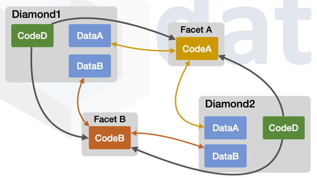
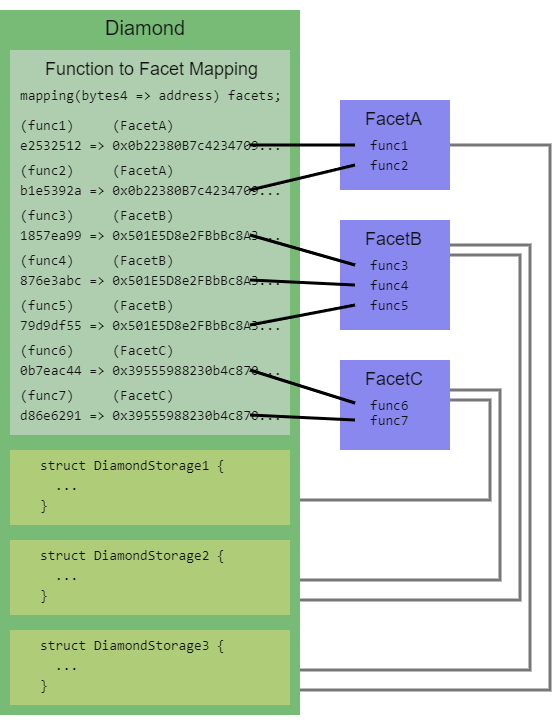
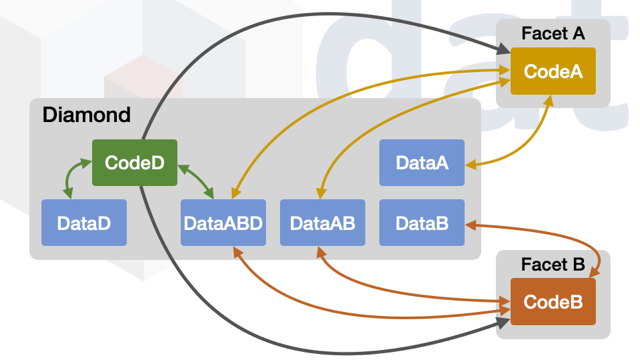

## 摘要


本提案标准化了 diamonds，它是一种模块化的智能合约系统，可以在部署后进行升级/扩展，并且几乎没有大小限制。更技术地说，**diamond** 是一个具有外部函数的合约，这些函数由称为 **facets** 的合约提供。Facets 是独立的合约，可以共享内部函数、库和状态变量。

## 动机

使用 diamonds 的原因有很多。以下是其中的一些：

1. **一个地址用于无限的合约功能。** 使用单个地址进行合约功能可以简化部署、测试以及与其他智能合约、软件和用户界面的集成。
2. **你的合约超过了 24KB 的最大合约大小。** 你可能有一些相关的功能，将它们保存在单个合约或单个合约地址中是有意义的。一个 diamond 没有最大合约大小。
3. **一个 diamond 提供了一种组织合约代码和数据的方法。** 你可能想要构建一个具有大量功能的合约系统。一个 diamond 提供了一种系统的方法来隔离不同的功能，并将它们连接在一起，并在需要时以 gas 高效的方式在它们之间共享数据。
4. **一个 diamond 提供了一种升级功能的方法。** 可升级的 diamonds 可以升级以添加/替换/删除功能。因为 diamonds 没有最大合约大小，所以可以随着时间的推移添加到 diamonds 的功能数量没有限制。可以升级 Diamonds，而无需重新部署现有功能。可以添加/替换/删除 diamond 的某些部分，同时保留其他部分。
5. **一个 diamond 可以是不可变的。** 可以部署一个不可变的 diamond，或者在以后使可升级的 diamond 变得不可变。
6. **一个 diamond 可以重用已部署的合约。** 可以使用现有的、已部署的、链上的合约来创建 diamonds，而不是将合约部署到区块链。可以从现有的已部署合约创建自定义 diamonds。这使得创建链上智能合约平台和库成为可能。

本标准是对 [EIP-1538](./eip-1538.md) 的改进。该标准的相同动机也适用于本标准。

一个已部署的 facet 可以被任意数量的 diamonds 使用。

下图显示了两个 diamonds 使用相同的两个 facets。

- `Diamond1` 使用 `FacetA`
- `Diamond2` 使用 `FacetA`
- `Diamond1` 使用 `FacetB`
- `Diamond2` 使用 `FacetB`



### 可升级的 Diamond vs. 中心化的私有数据库

为什么要有可升级的 diamond 而不是中心化的、私有的、可变的数据库？

1. 去中心化自治组织 (DAOs) 和其他治理系统可以用于升级 diamonds。
2. 与以太坊生态系统的广泛互动和集成。
3. 凭借开放的存储数据和经过验证的源代码，可以展示可证明的信任历史。
4. 通过开放性，可以在发生时发现并报告不良行为。
5. 独立的安全性专家和领域专家可以审查合约的变更历史，并为他们的信任历史提供保证。
6. 可升级的 diamond 有可能变得不可变和无需信任。

### 一些 Diamond 优势

1. 一个稳定的合约地址，提供所需的功能。
2. 一个具有多个合约（facets）功能的单一地址，这些合约彼此独立，但可以共享内部函数、库和状态变量。
3. 从单个地址发出事件可以简化事件处理。
4. 一种以原子方式（在同一交易中）添加、替换和删除多个外部函数的方法。
5. 细粒度的升级，因此你可以只更改需要更改的 diamond 部分。
6. 更好地控制何时以及存在哪些函数。
7. 去中心化自治组织 (DAOs)、多重签名合约和其他治理系统可以用于升级 diamonds。
8. 一个显示添加、替换和删除哪些函数的事件。
9. 查看对 diamond 所做的所有更改的能力。
10. 通过显示对 diamond 所做的所有更改来随着时间的推移增加信任。
11. 查看 diamond 以查看其当前 facets 和函数的方法。
12. 拥有一个不可变的、无需信任的 diamond。
13. 解决了 24KB 的最大合约大小限制。Diamonds 可以是任何大小。
14. 单独的功能可以在单独的 facets 中实现，并在 diamond 中一起使用。
15. 可以从已经部署的、现有的链上合约创建 Diamonds。
16. 较大的合约必须通过删除错误消息和其他内容来缩小其大小。你可以通过实现一个 diamond 来保留所需的全部功能。
17. 根据需要启用零，部分或完全的 diamond 不可变性，并在需要时启用。
18. 随着时间的推移，使用可升级的 diamond 开发和改进应用程序，然后在需要时使其不可变和无需信任的能力。
19. 逐步开发，让你的 diamond 随着你的应用程序一起增长。
20. 升级 diamonds 以修复错误、添加功能和实施新标准。
21. 使用 diamond 和 facets 组织你的代码。
22. Diamonds 可能很大（具有许多函数），但由于它们与 facets 分区，因此仍然是模块化的。
23. 在单个交易中调用多个合约的合约架构可以通过将这些合约压缩为单个 diamond 并直接访问状态变量来节省 gas。
24. 通过将外部函数转换为内部函数来节省 gas。这是通过在 facets 之间共享内部函数来完成的。
25. 通过为 gas 优化的特定用例（例如批量转移）创建外部函数来节省 gas。
26. Diamonds 专为工具和用户界面软件而设计。

## 规范

### 术语

1. 一个 **diamond** 是一个外观智能合约，它 `delegatecall` 到其 facets 中以执行函数调用。一个 diamond 是有状态的。数据存储在 diamond 的合约存储中。
2. 一个 **facet** 是一个无状态的智能合约或具有外部函数的 Solidity 库。部署一个 facet，并将其一个或多个函数添加到一个或多个 diamonds 中。一个 facet 不在其自身的合约存储中存储数据，但它可以定义状态并读取和写入一个或多个 diamonds 的存储。术语 facet 来自 diamond 行业。它是 diamond 的一个面，或扁平表面。
3. 一个 **loupe facet** 是一个提供内省功能的 facet。在 diamond 行业中，loupe 是一种用于观察 diamonds 的放大镜。
4. 一个 **不可变的函数** 是一个无法被替换或删除的外部函数（因为它直接在 diamond 中定义，或者因为 diamond 的逻辑不允许修改它）。
5. 本 EIP 的 **映射** 是指两个事物之间的关联，并不指代特定的实现。

术语 **合约** 被宽松地用于表示智能合约或已部署的 Solidity 库。

当本 EIP 使用 **函数** 而不指定内部或外部时，它指的是外部函数。

在本 EIP 中，适用于外部函数的信息也适用于公共函数。

### 概述

一个 diamond 使用 `delegatecall` 调用其 facets 中的函数。

在 diamond 行业中，diamonds 通过切割来创建和成型，从而创建 facets。在本标准中，通过添加、替换或删除 facets 中的函数来切割 diamonds。

### 关于实现接口的说明

由于 diamonds 的性质，diamond 可以通过两种方式之一来实现接口：直接（`contract Contract is Interface`），或者通过从一个或多个 facets 向其添加函数。就本提案而言，当说一个 diamond 实现了接口时，允许任何一种实现方法。

### 回退函数

当在 diamond 上调用外部函数时，将执行其回退函数。回退函数根据调用数据的前四个字节（称为函数选择器）确定要调用的 facet，并使用 `delegatecall` 从 facet 执行该函数。

diamond 的回退函数和 `delegatecall` 使 diamond 能够执行 facet 的函数，就像它是 diamond 本身实现的一样。`msg.sender` 和 `msg.value` 的值不会改变，并且只读取和写入 diamond 的存储。

以下是 diamond 的回退函数如何实现的一个说明性示例：

```solidity
// 查找被调用的函数的 facet，如果找到 facet，则执行该函数并返回任何值。
fallback() external payable {
  // 从函数选择器获取 facet
  address facet = selectorTofacet[msg.sig];
  require(facet != address(0));
  // 使用 delegatecall 从 facet 执行外部函数，并返回任何值。
  assembly {
    // 复制函数选择器和任何参数
    calldatacopy(0, 0, calldatasize())
    // 使用 facet 执行函数调用
    let result := delegatecall(gas(), facet, 0, calldatasize(), 0, 0)
    // 获取任何返回值
    returndatacopy(0, 0, returndatasize())
    // 将任何返回值或错误返回给调用者
    switch result
      case 0 {revert(0, returndatasize())}
      default {return (0, returndatasize())}
  }
}
```

此图显示了 diamond 的结构：



### 存储

因为 Solidity 的内置存储布局系统不支持代理合约或 diamonds，所以需要一个状态变量或存储布局组织模式。本 EIP 中未定义存储的特定布局，但可能会在以后的提案中定义。与 diamonds 一起使用的存储布局模式的示例包括 [Diamond Storage](../assets/eip-2535/storage-examples/DiamondStorage.sol) 和 [AppStorage](../assets/eip-2535/storage-examples/AppStorage.sol)。

Facets 可以通过在相同的存储位置使用相同的结构来共享状态变量。Facets 可以通过继承相同的合约或使用相同的库来共享内部函数和库。通过这些方式，facets 是独立的单元，但可以共享状态和功能。

下图显示了具有自己的数据以及在它们之间共享的数据的 facets。

请注意，所有数据都存储在 diamond 的存储中，但是不同的 facets 对数据的访问权限不同。

在此图中

- 只有 `FacetA` 可以访问 `DataA`
- 只有 `FacetB` 可以访问 `DataB`
- 只有 diamond 自己的代码可以访问 `DataD`。
- `FacetA` 和 `FacetB` 共享对 `DataAB` 的访问权限。
- diamond 自己的代码、`FacetA` 和 `FacetB` 共享对 `DataABD` 的访问权限。



### Solidity 库作为 Facets

智能合约或已部署的 Solidity 库可以是 diamonds 的 facets。

只有具有一个或多个外部函数的 Solidity 库才能部署到区块链并成为一个 facet。

仅包含内部函数的 Solidity 库无法部署，也无法成为 facet。Solidity 库中的内部函数包含在使用它们的 facets 和合约的字节码中。仅具有内部函数的 Solidity 库对于在 facets 之间共享内部函数很有用。

Solidity 库 facets 具有一些与其用作 facets 相匹配的属性：
* 它们不能被删除。
* 它们是无状态的。它们没有合约存储。
* 它们的语法阻止在 Diamond Storage 之外声明状态变量。

### 添加/替换/删除函数

#### `IDiamond` 接口

所有 diamonds 必须实现 `IDiamond` 接口。

在部署 diamond 期间，添加到 diamond 的任何不可变函数和任何外部函数都必须在 `DiamondCut` 事件中发出。

**每当添加、替换或删除外部函数时，都必须发出 `DiamondCut` 事件。** 这适用于所有升级、所有函数更改、在任何时间，无论是通过 `diamondCut` 还是不通过。

```solidity
interface IDiamond {
    enum FacetCutAction {Add, Replace, Remove}
    // Add=0, Replace=1, Remove=2

    struct FacetCut {
        address facetAddress;
        FacetCutAction action;
        bytes4[] functionSelectors;
    }

    event DiamondCut(FacetCut[] _diamondCut, address _init, bytes _calldata);
}
```

`DiamondCut` 事件记录对 diamond 的所有函数更改。

#### `IDiamondCut` 接口

一个 diamond 在其中包含一个函数选择器到 facet 地址的映射。通过修改此映射来添加/替换/删除函数。

如果 diamonds 在部署后允许修改其函数选择器映射，则应实现 `IDiamondCut` 接口。

`diamondCut` 函数在单个交易中更新来自任意数量的 facets 的任意数量的函数。在单个交易中执行所有更改可以防止数据损坏，而数据损坏可能发生在通过多个交易完成的升级中。

指定 `diamondCut` 是为了实现互操作性。Diamond 工具、软件和用户界面应期望并使用标准 `diamondCut` 函数。

```solidity
interface IDiamondCut is IDiamond {
    /// @notice 添加/替换/删除任意数量的函数，并选择性地使用 delegatecall 执行一个函数
    /// @param _diamondCut 包含 facet 地址和函数选择器
    /// @param _init 要在其上执行 _calldata 的合约或 facet 的地址
    /// @param _calldata 函数调用，包括函数选择器和参数
    ///                  _calldata 使用 delegatecall 在 _init 上执行
    function diamondCut(
        FacetCut[] calldata _diamondCut,
        address _init,
        bytes calldata _calldata
    ) external;
}
```

`_diamondCut` 参数是一个 `FacetCut` 结构的数组。

每个 `FacetCut` 结构包含一个 facet 地址和一个函数选择器数组，这些函数选择器在 diamond 中更新。

对于每个 `FacetCut` 结构：

 * 如果 `action` 是 `Add`，则将每个 `functionSelectors` 项的函数选择器映射更新为 `facetAddress`。如果任何 `functionSelectors` 具有映射的 facet，则回退。
 * 如果 `action` 是 `Replace`，则将每个 `functionSelectors` 项的函数选择器映射更新为 `facetAddress`。如果任何 `functionSelectors` 具有等于 `facetAddress` 的值或选择器未设置，则回退。
 * 如果 `action` 是 `Remove`，则删除每个 `functionSelectors` 项的函数选择器映射。如果任何 `functionSelectors` 之前未设置，则回退。

任何尝试替换或删除不可变函数的尝试都必须回退。

有意且明确地添加/替换/删除函数有助于捕获和防止升级错误。

##### 执行 `_calldata`

添加/替换/删除函数后，使用 `delegatecall` 在 `_init` 上执行 `_calldata` 参数。执行此操作是为了初始化数据或设置或删除在添加、替换和/或删除函数后需要或不再需要的任何内容。

如果 `_init` 值为 `address(0)`，则跳过 `_calldata` 执行。在这种情况下，`_calldata` 可以包含 0 字节或自定义信息。

### 检查 Facets 和函数

> loupe 是一个用于观察 diamonds 的小型放大镜。

Diamonds 必须通过实现 `IDiamondLoupe` 接口来支持检查 facets 和函数。

#### `IDiamondLoupe` 接口

```solidity
// Loupe 是一个用于观察 diamonds 的小型放大镜。
// 这些函数用于观察 diamonds
interface IDiamondLoupe {
    struct Facet {
        address facetAddress;
        bytes4[] functionSelectors;
    }

    /// @notice 获取所有 facet 地址及其四字节函数选择器。
    /// @return facets_ Facet
    function facets() external view returns (Facet[] memory facets_);

    /// @notice 获取特定 facet 支持的所有函数选择器。
    /// @param _facet facet 地址。
    /// @return facetFunctionSelectors_
    function facetFunctionSelectors(address _facet) external view returns (bytes4[] memory facetFunctionSelectors_);

    /// @notice 获取 diamond 使用的所有 facet 地址。
    /// @return facetAddresses_
    function facetAddresses() external view returns (address[] memory facetAddresses_);

    /// @notice 获取支持给定选择器的 facet。
    /// @dev 如果找不到 facet，则返回 address(0)。
    /// @param _functionSelector 函数选择器。
    /// @return facetAddress_ facet 地址。
    function facetAddress(bytes4 _functionSelector) external view returns (address facetAddress_);
}
```

请参阅 [参考实现](#参考实现) 以了解如何实现此功能。

loupe 函数可以在用户界面软件中使用。用户界面调用这些函数以提供有关和可视化 diamonds 的信息。

loupe 函数可以在部署功能、升级功能、测试和其他软件中使用。

### 实现要点

一个 diamond 必须实现以下内容：

1. 一个 diamond 包含一个回退函数和零个或多个在其自身中定义的不可变函数。
2. 一个 diamond 将函数选择器与 facets 相关联。
3. 当在 diamond 上调用一个函数时，如果它是一个直接在 diamond 中定义的“不可变函数”，则会立即执行它。否则，将执行 diamond 的回退函数。回退函数查找与该函数关联的 facet，并使用 `delegatecall` 执行该函数。如果该函数没有 facet，则可以选择执行一个默认函数。如果该函数没有 facet，没有默认函数，也没有其他处理机制，则执行回退。
4. 每次添加、替换或删除函数时，都会发出 `DiamondCut` 事件来记录它。
5. 一个 diamond 实现了 DiamondLoupe 接口。
6. 所有不可变函数都必须在 `DiamondCut` 事件中作为添加的新函数发出。如果存在，loupe 函数必须返回有关不可变函数的信息。不可变函数的 facet 地址是 diamond 的地址。任何删除或替换不可变函数的尝试都必须回退。

一个 diamond 可以实现以下内容：

1. [EIP-165](./eip-165.md) 的 `supportsInterface`。如果一个 diamond 具有 `diamondCut` 函数，则用于它的接口 ID 是 `IDiamondCut.diamondCut.selector`。用于 diamond loupe 接口的接口 ID 是 `IDiamondLoupe.facets.selector ^ IDiamondLoupe.facetFunctionSelectors.selector ^ IDiamondLoupe.facetAddresses.selector ^ IDiamondLoupe.facetAddress.selector`。

diamond 地址是用户与之交互的地址。diamond 地址不会更改。只有 facet 地址可以通过使用 `diamondCut` 函数或其他函数来更改。

## 原理

### 使用函数选择器

可以使用用户界面软件从 diamond 检索函数选择器和 facet 地址，以便显示 diamond 具有哪些函数。

本标准旨在使 diamonds 与用户界面软件良好配合。具有合约 ABI 的函数选择器提供了足够多的有关函数的信息，可以用于用户界面软件。

### Gas 考量

委托函数调用确实有一些 gas 开销。这可以通过以下几种方式缓解：

1. 因为 Diamonds 没有最大大小限制，所以可以添加 gas 优化函数以供使用。例如，有人可以使用 diamond 来实现 [EIP-721](./eip-721.md) 标准，并实现批量传输函数以减少 gas（并使批量传输更加方便）。
2. 一些合约架构需要在一次交易中调用多个合约。通过将这些合约压缩为单个 diamond 并直接访问合约存储，可以实现 gas 节省。
3. Facets 可以包含很少的外部函数，从而降低了 gas 成本。因为调用具有许多函数的合约中的函数比调用具有很少函数的合约中的函数花费更多的 gas。
4. 可以将 Solidity 优化器设置为高设置，从而生成更多的字节码，但是执行时 facets 将使用更少的 gas。

### 函数版本

软件或用户可以通过获取该函数的 facet 地址来验证调用了哪个版本的函数。这可以通过从 `IDiamondLoupe` 接口调用 `facetAddress` 函数来完成。此函数将函数选择器作为参数，并返回实现该函数的 facet 地址。

### 默认函数

Solidity 提供了 `fallback` 函数，以便在合约中不存在的函数在合约上被调用时，可以执行特定的功能。可以通过实现和使用默认函数在 diamond 中选择性地实现相同的行为，默认函数是在 diamond 上调用一个 diamond 中不存在的函数时执行的函数。

默认函数可以通过多种方式实现，并且本标准未指定必须如何实现。

### Loupe 函数和 `DiamondCut` 事件

要找出常规合约具有哪些函数，只需要查看其经过验证的源代码即可。

diamond 的经过验证的源代码不包括它具有哪些函数，因此需要不同的机制。

一个 diamond 具有四个标准函数，称为 loupe 函数，用于显示一个 diamond 具有哪些函数。

loupe 函数可以用于许多事情，包括：
1. 显示 diamond 使用的所有函数。
2. 查询像 Etherscan 这样的服务或文件，以检索和显示 diamond 使用的所有源代码。
3. 查询像 Etherscan 这样的服务或文件，以检索 diamond 的 ABI 信息。
4. 测试或验证在 diamond 上添加/替换/删除函数的交易是否成功。
5. 在 diamond 上调用函数之前，找出 diamond 具有哪些函数。
6. 由工具和编程库用于部署和升级 diamonds。
7. 由用户界面用于显示有关 diamonds 的信息。
8. 由用户界面用于使用户能够在 diamonds 上调用函数。

Diamonds 支持另一种形式的透明度，即 diamond 上所有升级的历史记录。这是通过 `DiamondCut` 事件完成的，该事件用于记录在 diamond 上添加、替换或删除的所有函数。

### 在 Facets 之间共享函数

在某些情况下，可能需要调用在不同 facet 中定义的函数。以下是执行此操作的方法：

1. 将一个 facet 中的内部函数代码复制到另一个 facet 中。
2. 将公共内部函数放在由多个 facets 继承的合约中。
3. 将公共内部函数放在 Solidity 库中，并在 facets 中使用该库。
4. 调用在另一个 facet 中定义的外部函数的类型安全方法是执行以下操作：`MyOtherFacet(address(this)).myFunction(arg1, arg2)`
5. 调用在另一个 facet 中定义的外部函数的一种更高效的 gas 方法是使用 delegatecall。以下是如何执行此操作的示例：
```solidity
DiamondStorage storage ds = diamondStorage();
bytes4 functionSelector = bytes4(keccak256("myFunction(uint256)"));
// 获取函数的 facet 地址
address facet = ds.selectorToFacet[functionSelector];
bytes memory myFunctionCall = abi.encodeWithSelector(functionSelector, 4);
(bool success, bytes memory result) = address(facet).delegatecall(myFunctionCall);
```
6. 不是调用在另一个 facet 中定义的外部函数，而是可以创建一个内部函数版本的外部函数。将内部版本的函数添加到需要使用它的 facet。

### Facets 可以是可重用和可组合的

一个已部署的 facet 可以被任意数量的 diamonds 使用。

不同 facets 的组合可以与不同的 diamonds 一起使用。

可以创建和部署一组 facets，这些 facets 会随着时间的推移被不同的 diamonds 重用。

对许多 diamonds 使用相同的已部署的 facets 的能力降低了部署成本。

可以用一种使其可用/可组合/与其他 facets 兼容的方式实现 facets 。也可以用一种使其不可用/不可组合/与其他 facets 不兼容的方式实现 facets。

函数签名是函数的名称及其参数类型。示例函数签名：`myfunction(uint256)`。一个限制是不能同时将具有相同函数签名的两个外部函数添加到同一个 diamond 中，因为 diamond 或任何合约不能具有具有相同函数签名的两个外部函数。

不必将一个 facet 的所有函数添加到 diamond 中。可以将 facet 中的某些函数添加到 diamond 中，而 facet 中的其他函数则不添加到 diamond 中。

## 向后兼容性

本标准使可升级的 diamonds 与未来的标准和功能的兼容，因为可以添加新功能，并且可以替换或删除现有功能。

## 参考实现

完整参考实现的所有 Solidity 代码都已放在此处的单个文件中：[Diamond.sol](../assets/eip-2535/reference/Diamond.sol)

相同的参考实现已组织成多个文件和目录，并且还包括一个部署脚本和测试。将其下载为 zip 文件：[`EIP2535-Diamonds-Reference-Implementation.zip`](../assets/eip-2535/reference/EIP2535-Diamonds-Reference-Implementation.zip)

## 安全注意事项

### 所有权和身份验证

> **注意：** Diamond 所有权/身份验证的设计和实现**不是**本标准的一部分。本标准和参考实现中给出的示例只是如何完成它的**示例**。

可以使用此提案创建许多不同的身份验证或所有权方案。身份验证方案可以非常简单或复杂，细粒度或粗粒度。该提案不以任何方式限制它。例如，所有权/身份验证可能就像单个帐户地址有权添加/替换/删除函数一样简单。或者，去中心化自治组织可以有权仅添加/替换/删除某些功能。

可以实现共识功能，例如批准功能，多人调用该功能以在通过 `diamondCut` 函数执行更改之前批准更改。这些只是例子。

鼓励开发 diamonds 的所有权、控制和身份验证的标准和实现。

### 使用 `diamondCut` 任意执行

`diamondCut` 函数允许任意执行，并且可以访问 diamond 的存储（通过 `delegatecall`）。必须小心限制对此函数的访问。

### 不要自毁
强烈建议不要在 facet 中使用 `selfdestruct`。滥用它会删除 diamond 或 facet。

### 函数选择器冲突

当两个不同的函数签名哈希到相同的四字节哈希时，会发生函数选择器冲突。当打算添加新函数时，这会产生替换 diamond 中现有函数的意外后果。如果正确实现了 `diamondCut` 函数，则这种情况是不可能发生的，因为它会阻止添加已经存在的函数选择器。

### 透明度

每当添加、替换或删除一个或多个函数时，Diamonds 都会发出一个事件。可以验证所有源代码。这使人们和软件可以监视对合约的更改。如果向 diamond 添加了任何不良行为函数，都可以看到。

安全专家和领域专家可以查看 diamond 的更改历史记录，以检测任何不良行为的历史记录。

## 版权

版权及相关权利通过 [CC0](../LICENSE.md) 放弃。