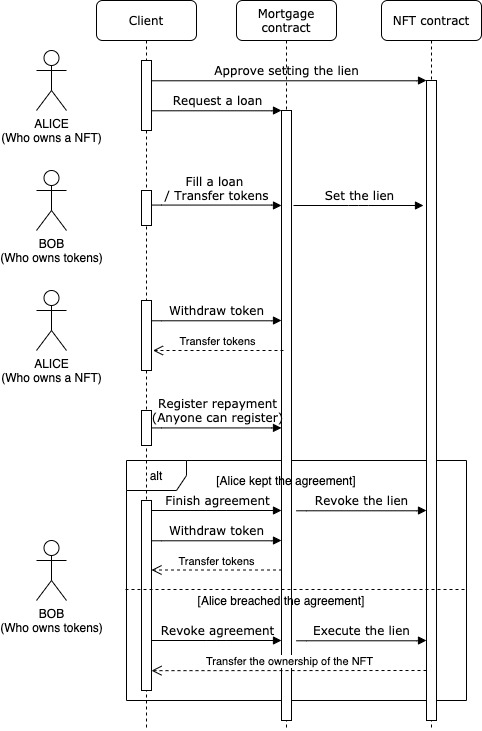
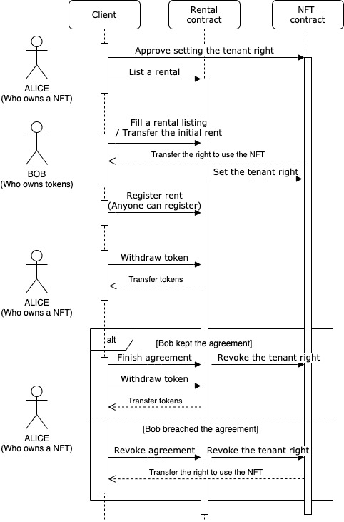

## 简要概括

本标准提议对 ERC721 非同质化代币 (NFT) 进行扩展，以支持租赁和抵押功能。这些功能对于 NFT 模拟现实世界的房地产是必要的，就像现实世界中的那些一样。

## 摘要

本标准是 ERC721 的扩展。它提出了额外的角色、租户启用租赁的权利以及留置权。

借助 ERC2615，NFT 所有者将能够出租他们的 NFT 并通过抵押他们的 NFT 来获得抵押贷款。例如，该标准可以应用于：

- 虚拟物品（游戏内资产、虚拟艺术品等）
- 实体物品（房屋、汽车等）
- 知识产权
- DAO 会员代币

NFT 开发人员也能够轻松集成 ERC2615，因为它与 ERC721 标准完全向后兼容。

一个值得注意的点是，有权使用应用程序的人不是所有者，而是用户（即租户）。应用程序开发人员必须将此规范集成到他们的应用程序中。

## 动机

使用 ERC721 标准实施租赁和抵押功能一直具有挑战性，因为它只定义了一个角色（即所有者）。

目前，使用 ERC721 进行无需信任的租赁需要保证金，并且每当一个人选择抵押他们的 ERC721 财产时，都必须在合约中锁定所有权。这些关系的跟踪和促进必须与 ERC721 标准分开进行。

该提案通过整合租户权和留置权的基本权利来消除这些要求。通过标准化这些功能，开发人员可以更轻松地为其应用程序集成租赁和抵押功能。

## 规范

本标准提出了三个用户角色：**留置权持有人**、**所有者**和**用户**。他们的权利如下：

- **留置权持有人**有权：

  1. 转移**所有者**角色
  2. 转移**用户**角色

- **所有者**有权：

  1. 转移**所有者**角色
  2. 转移**用户**角色

- **用户**有权：
  1. 转移**用户**角色

### ERC-2615 接口

```solidity
event TransferUser(address indexed from, address indexed to, uint256 indexed itemId, address operator);
event ApprovalForUser(address indexed user, address indexed approved, uint256 itemId);
event TransferOwner(address indexed from, address indexed to, uint256 indexed itemId, address operator);
event ApprovalForOwner(address indexed owner, address indexed approved, uint256 itemId);
event ApprovalForAll(address indexed owner, address indexed operator, bool approved);
event LienApproval(address indexed to, uint256 indexed itemId);
event TenantRightApproval(address indexed to, uint256 indexed itemId);
event LienSet(address indexed to, uint256 indexed itemId, bool status);
event TenantRightSet(address indexed to, uint256 indexed itemId,bool status);

function balanceOfOwner(address owner) public view returns (uint256);
function balanceOfUser(address user) public view returns (uint256);
function userOf(uint256 itemId) public view returns (address);
function ownerOf(uint256 itemId) public view returns (address);

function safeTransferOwner(address from, address to, uint256 itemId) public;
function safeTransferOwner(address from, address to, uint256 itemId, bytes memory data) public;
function safeTransferUser(address from, address to, uint256 itemId) public;
function safeTransferUser(address from, address to, uint256 itemId, bytes memory data) public;

function approveForOwner(address to, uint256 itemId) public;
function getApprovedForOwner(uint256 itemId) public view returns (address);
function approveForUser(address to, uint256 itemId) public;
function getApprovedForUser(uint256 itemId) public view returns (address);
function setApprovalForAll(address operator, bool approved) public;
function isApprovedForAll(address requester, address operator) public view returns (bool);

function approveLien(address to, uint256 itemId) public;
function getApprovedLien(uint256 itemId) public view returns (address);
function setLien(uint256 itemId) public;
function getCurrentLien(uint256 itemId) public view returns (address);
function revokeLien(uint256 itemId) public;

function approveTenantRight(address to, uint256 itemId) public;
function getApprovedTenantRight(uint256 itemId) public view returns (address);
function setTenantRight(uint256 itemId) public;
function getCurrentTenantRight(uint256 itemId) public view returns (address);
function revokeTenantRight(uint256 itemId) public;
```

### ERC-2615 接收器

```solidity
function onERCXReceived(address operator, address from, uint256 itemId, uint256 layer, bytes memory data) public returns(bytes4);
```

### ERC-2615 扩展

此处提供的扩展旨在帮助开发人员使用此标准进行构建。

#### 1. ERC721 兼容函数

此扩展使该标准与 ERC721 兼容。通过添加以下函数，开发人员可以利用现有的 ERC721 工具。

当未设置租户权时，此扩展中的转移函数将同时转移**所有者**和**用户**角色。相反，当设置了租户权时，只会转移**所有者**角色。

```solidity
function balanceOf(address owner) public view returns (uint256)
function ownerOf(uint256 itemId) public view returns (address)
function approve(address to, uint256 itemId) public
function getApproved(uint256 itemId) public view returns (address)
function transferFrom(address from, address to, uint256 itemId) public
function safeTransferFrom(address from, address to, uint256 itemId) public
function safeTransferFrom(address from, address to, uint256 itemId, bytes memory data) pubic
```

#### 2. 可枚举

此扩展类似于 ERC721 标准的可枚举扩展。

```solidity
function totalNumberOfItems() public view returns (uint256);
function itemOfOwnerByIndex(address owner, uint256 index, uint256 layer)public view returns (uint256 itemId);
function itemByIndex(uint256 index) public view returns (uint256);
```

#### 3. 元数据

此扩展类似于 ERC721 标准的元数据扩展。

```solidity
function itemURI(uint256 itemId) public view returns (string memory);
function name() external view returns (string memory);
function symbol() external view returns (string memory);
```

## 租赁和抵押如何运作

本标准不处理代币或价值转移。必须使用其他逻辑（超出本标准的范围）来协调这些转移并实施付款验证。

### 抵押功能

下图演示了抵押功能。



假设 Alice 拥有一枚 NFT 并想获得抵押贷款，而 Bob 想通过将代币借给 Alice 来赚取利息。

1. Alice 批准为 Alice 拥有的 NFT 设置留置权。
2. Alice 向抵押贷款合约发送贷款请求。
3. Bob 填写贷款请求并将代币转移到抵押贷款合约。然后，抵押贷款合约在 NFT 上设置留置权。
4. Alice 现在可以从抵押贷款合约中提取借来的代币。
5. Alice 登记还款（任何人都可以支付还款）。
6. 如果协议期限结束且协议得到遵守（即按时支付还款），Bob 可以完成协议。
7. 如果协议被违反（例如，未按时支付还款），Bob 可以撤销协议并执行留置权并接管 NFT 的所有权。

### 租赁功能

下图演示了租赁功能。



假设 Alice 拥有 NFT 并且想要出租 NFT，而 Bob 想要租赁 NFT。

1. Alice 批准为 Alice 拥有的 NFT 设置租户权。
2. Alice 向租赁合约发送出租列表。
3. Bob 填写租赁请求，并且使用 NFT 的权利转移给 Bob。同时，设置了租户权，并且 Alice 变得无法转让使用 NFT 的权利。
4. Bob 登记租金（任何人都可以支付租金）。
5. Alice 可以从租赁合约中提取租金。
6. 如果协议期限已结束并且协议得到遵守（即按时支付租金），Alice 可以完成协议。
7. 如果协议被违反（例如，未按时支付租金），Alice 可以撤销协议并撤销租户权并接管使用 NFT 的权利。

## 理论依据

已经有一些尝试使用 ERC721 实现租赁或抵押。但是，正如我之前指出的，实现起来一直具有挑战性。我将在下面解释此标准的原因和优点。

### 租赁无需保证金锁定

为了使用 ERC721 实现 NFT 的无需信任的租赁，必须存入资金作为担保。这是为了防止租户的恶意活动，因为一旦所有权被转移，就不可能收回所有权。

有了这个标准，不再需要保证金，因为该标准本身支持租赁和租户权功能。

### 抵押贷款时无需所有权托管

为了对 NFT 进行抵押，必须将 NFT 作为抵押品转移到合约。这是为了防止抵押贷款的潜在违约风险。

但是，使用 ERC721 担保抵押品会损害 NFT 的效用。由于大多数 NFT 应用程序向 NFT 的规范所有者提供服务，因此 NFT 本质上无法在托管下使用。

借助 ERC2615，可以抵押 NFT 并同时使用它们。

### 易于集成

由于上述原因，使用 ERC721 实施租赁和抵押功能需要付出大量的努力。采用此标准是集成租赁和抵押功能的一种更简单的方法。

### 代币内没有货币/代币交易

NFT 本身并不直接处理借贷或租赁功能。此标准是开源的，并且没有平台锁定。开发人员可以集成它，而不必担心这些风险。

## 向后兼容性

如规范部分所述，通过添加扩展函数集，该标准可以完全与 ERC721 兼容。

此外，该标准中引入的新函数与 ERC721 中的现有函数有许多相似之处。这使开发人员可以快速轻松地采用该标准。

## 测试用例

运行测试时，您需要使用 Ganache-CLI 创建一个测试网络：

```
ganache-cli -a 15  --gasLimit=0x1fffffffffffff -e 1000000000
```

然后使用 Truffle 运行测试：

```
truffle test -e development
```

由 Truffle 和 Openzeppelin 测试助手提供支持。

## 实现

[Github 仓库](https://github.com/kohshiba/ERC-X)。

## 安全考虑

由于外部合约将控制留置权或租户权，因此外部合约中的缺陷会直接导致该标准的意外行为。

## 版权

根据 [CC0](../LICENSE.md) 放弃版权和相关权利。