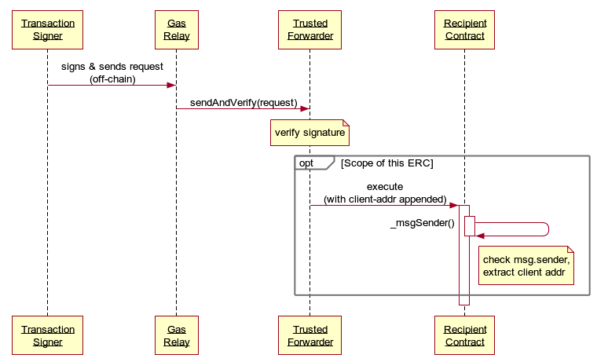

```md
---
eip: 2771
title: 本地元交易的安全协议
description: 用于通过可信转发器接收元交易的合约接口
author: Ronan Sandford (@wighawag), Liraz Siri (@lirazsiri), Dror Tirosh (@drortirosh), Yoav Weiss (@yoavw), Alex Forshtat (@forshtat), Hadrien Croubois (@Amxx), Sachin Tomar (@tomarsachin2271), Patrick McCorry (@stonecoldpat), Nicolas Venturo (@nventuro), Fabian Vogelsteller (@frozeman), Gavin John (@Pandapip1)
discussions-to: https://ethereum-magicians.org/t/erc-2771-secure-protocol-for-native-meta-transactions/4488
status: Final
type: Standards Track
category: ERC
created: 2020-07-01
---

## 摘要

此 EIP 定义了一个合约级别的协议，用于 `Recipient` 合约通过受信任的 `Forwarder` 合约接受元交易。未进行协议更改。通过附加额外的调用数据，将有效的 `msg.sender` (称为 `_msgSender()`) 和 `msg.data` (称为 `_msgData()`) 发送到 `Recipient` 合约。

## 动机

越来越多的人对使以太坊合约能够接受来自没有 ETH 支付 gas 费用的外部拥有帐户的调用感兴趣。允许第三方支付 gas 费用的解决方案称为元交易。就本 EIP 而言，元交易是由**交易签名者**授权并由支付 gas 费用的不受信任的第三方（**Gas 中继**）中继的交易。

## 规范

本文档中的关键词“必须（MUST）”、“禁止（MUST NOT）”、“必需（REQUIRED）”、“应该（SHALL）”、“不应该（SHALL NOT）”、“推荐（SHOULD）”、“不推荐（SHOULD NOT）”、“可以（MAY）”和“可选（OPTIONAL）”应按照 RFC 2119 中的描述进行解释。

### 定义

**交易签名者**：签名并将交易发送到 Gas 中继

**Gas 中继**：从交易签名者处接收链下签名请求，并支付 gas 将其转换为通过受信任的转发器的有效交易

**受信任的转发器**：`Recipient` 信任的合约，用于正确验证签名和 nonce，然后再转发来自交易签名者的请求

**Recipient**：通过受信任的转发器接受元交易的合约

### 示例流程



### 提取交易签名者地址

**受信任的转发器**负责调用 **Recipient** 合约，并且必须将 **交易签名者** 的地址（20 字节的数据）附加到调用数据的末尾。

例如：

```solidity
(bool success, bytes memory returnData) = to.call.value(value)(abi.encodePacked(data, from));
```

然后，**Recipient** 合约可以通过执行 3 个操作来提取 **交易签名者** 地址：

1. 检查 **Forwarder** 是否受信任。如何实现这一点不在本提案的范围之内。
2. 从调用数据的最后 20 个字节中提取 **交易签名者** 地址，并将其用作交易的原始 `sender`（而不是 `msg.sender`）
3. 如果 `msg.sender` 不是受信任的转发器（或者如果 `msg.data` 短于 20 字节），则返回原始 `msg.sender`。

**Recipient** 必须检查它是否信任转发器，以防止它从不受信任的合约中提取附加的地址数据。这可能会导致伪造的地址。

### 协议支持发现机制

除非 **Recipient** 合约被特定的前端使用，该前端知道该合约支持本地元交易，否则不可能为用户提供使用元交易与合约交互的选择。因此，我们需要一种机制，让 **Recipient** 通知世界它支持元交易。

这对于在 Web3 钱包级别支持元交易尤其重要。此类钱包可能不一定了解用户可能希望与之交互的 **Recipient** 合约。

由于 **Recipient** 可以信任具有不同接口和功能的转发器（例如，交易批处理、不同的消息签名格式），我们需要允许钱包发现哪些 Forwarder 是受信任的。

为了提供这种发现机制，**Recipient** 合约必须实现以下功能：

```solidity
function isTrustedForwarder(address forwarder) external view returns(bool);
```

如果转发器受 Recipient 信任，则 `isTrustedForwarder` 必须返回 `true`，否则必须返回 `false`。`isTrustedForwarder` 必须不能恢复（revert）。

在内部，**Recipient** 必须接受来自转发器的请求。

`isTrustedForwarder` 函数可以在链上调用，因此必须设置 gas 限制。它消耗的 gas 不应超过 50,000

## 理由

* 通过标准化最简单的可行合约接口，使合约开发人员可以轻松地添加对元交易的支持。
* 如果在接收者合约中不支持元交易，则外部拥有的帐户不能使用元交易与接收者合约进行交互。
* 如果没有标准的合约接口，则客户端没有标准的方法来发现接收者是否支持元交易。
* 如果没有标准的合约接口，则没有标准的方法将元交易发送给接收者。
* 如果没有利用受信任的转发器的能力，则每个接收者合约都必须在内部实现安全接受元交易所需的逻辑。
* 如果没有发现协议，则客户端没有机制来发现接收者是否支持特定的转发器。
* 使合约接口与受信任转发器的内部实现细节无关，使接收者合约可以支持多个转发器，而无需更改代码。
* `msg.sender` 是一个交易参数，合约可以检查该参数以确定谁签署了交易。此参数的完整性由以太坊 EVM 保证，但是对于元交易，保护 `msg.sender` 是不够的。
  * 问题在于，对于原生不了解元交易的合约，交易的 `msg.sender` 会使其看起来来自 **Gas 中继** 而不是 **交易签名者**。合约接受元交易的安全协议需要防止 **Gas 中继** 伪造、修改或复制 **交易签名者** 的请求。

## 参考实现

### 接收者示例

```solidity
contract RecipientExample {

    function purchaseItem(uint256 itemId) external {
        address sender = _msgSender();
        // ... perform the purchase for sender
    }

    address immutable _trustedForwarder;
    constructor(address trustedForwarder) internal {
        _trustedForwarder = trustedForwarder;
    }

    function isTrustedForwarder(address forwarder) public returns(bool) {
        return forwarder == _trustedForwarder;
    }

    function _msgSender() internal view returns (address payable signer) {
        signer = msg.sender;
        if (msg.data.length>=20 && isTrustedForwarder(signer)) {
            assembly {
                signer := shr(96,calldataload(sub(calldatasize(),20)))
            }
        }    
    }

}
```

## 安全注意事项

恶意转发器可能会伪造 `_msgSender()` 的值，并有效地从任何地址发送交易。因此，`Recipient` 合约在信任转发器时必须非常小心。如果转发器是可升级的，那么还必须信任该合约不会执行恶意升级。

此外，修改信任哪些转发器必须受到限制，因为攻击者可以“信任”他们自己的地址来转发交易，因此能够伪造交易。建议受信任的转发器的列表是不可变的，如果这是不可行的，那么只有受信任的合约所有者才能修改它。

## 版权

版权及相关权利通过 [CC0](../LICENSE.md) 放弃。
```