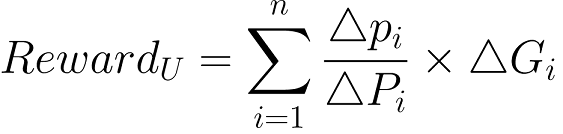

## 简单总结
ERC2917 是一种用于链上质押奖励计算的新标准化方案。

## 摘要
ERC2917 基于有效抵押品和时间的乘积，计算用户在任何时间可以获得的奖励，并实现真正的去中心化 DeFi。以下是用於计算用户 U 的奖励的公式：



其中 ∆p<sub>i</sub> 表示用户 U 在连续区块号 t<sub>i-1</sub> 和 t<sub>i</sub> 之间的个人生产力，∆P<sub>i</sub> 表示在连续区块号 t<sub>i-1</sub>  和 t<sub>i</sub> 之间的全局生产力，∆G<sub>i</sub> 表示在连续区块号 t<sub>i-1</sub>  和 t<sub>i</sub> 之间的总产值。该公式确保了在计算中提前退出或稍后进入的情况下没有任何好处。用户在一段时间内可以获得的奖励取决于他在该特定时间内的总生产力。该公式已通过 Solidity 和通用设计进行了简化，使其可在所有 DeFi 产品中使用。
我们注意到，智能合约可以在以下事件的每次计算时触发：
- 每当用户的生产力发生变化（增加/减少）时，
- 每当用户提款时。

## 动机

许多 DeFi 项目的主要缺点之一是智能合约中的奖励分配机制。 事实上，到目前为止，已经采用了两种主要的机制。
1. 奖励的分配仅在所有用户退出合约时进行
2. 项目收集链上数据，进行链下计算，并将结果发送
到链上，然后再相应地开始奖励分配

第一种方法以链上的方式进行所有计算，其奖励分配的周期太长。此外，用户需要在获得奖励之前移除抵押品，这对他们的奖励可能有害。第二种方法是一种半去中心化模型，因为主要算法涉及链下计算。 因此，公平和透明的属性无法体现，这甚至会给用户带来投资障碍。

由于每天都有越来越多的 DeFi 项目出现，用户找不到合适的方式来了解：
1) 他/她将获得的利息金额
2) 利息如何计算
3) 与整体相比，他/她的贡献是什么

通过标准化 ERC2917，它抽象了利息生成过程的接口。使钱包应用程序更容易收集每个 DeFi 的指标，对用户更友好。

## 规范

每个符合 ERC-2917 的合约都必须实现 ERC2917 和 ERC20 接口（如果需要）：

```solidity
interface IERC2917 is IERC20 {

    /// @dev 当合约所有者更改每个区块的利息金额时，会发出此事件。
    /// 它会发出旧的利息金额和新的利息金额。
    event InterestRatePerBlockChanged (uint oldValue, uint newValue);

    /// @dev 当用户的生产力发生变化时，会发出此事件
    /// 它会发出用户的地址和更改后的值。
    event ProductivityIncreased (address indexed user, uint value);

    /// @dev 当用户的生产力发生变化时，会发出此事件
    /// 它会发出用户的地址和更改后的值。
    event ProductivityDecreased (address indexed user, uint value);

    
    /// @dev 返回当前合约的每个区块的利息率。
    /// @return 当前每个区块产生的利息金额。
    function interestsPerBlock() external view returns (uint);

    /// @notice 更改当前合约的利息率。
    /// @dev 请注意，最佳实践是限制总产值提供者的合约地址来调用此函数。
    /// @return true/false 表示该值是否已成功更改，如果成功，则会发出 InterestRatePerBlockChanged 事件。
    function changeInterestRatePerBlock(uint value) external returns (bool);

    /// @notice 它将获取给定用户的生产力。
    /// @dev 如果用户在合约中没有证明生产力，它将返回 0。
    /// @return 用户的生产力和总生产力。
    function getProductivity(address user) external view returns (uint, uint);

    /// @notice 增加用户的生产力。
    /// @dev 请注意，最佳实践是将调用者限制为生产力证明的合约地址。
    /// @return true 以确认已成功添加生产力。
    function increaseProductivity(address user, uint value) external returns (bool);

    /// @notice 降低用户的生产力。
    /// @dev 请注意，最佳实践是将调用者限制为生产力证明的合约地址。
    /// @return true 以确认已成功移除生产力。
    function decreaseProductivity(address user, uint value) external returns (bool);

    /// @notice take() 将返回调用者在当前区块高度将获得的利息。
    /// @dev 它始终按 block.number 计算，因此当区块高度发生变化时，它也会发生变化。
    /// @return 用户能够在当前区块高度 mint() 的利息金额。
    function take() external view returns (uint);

    /// @notice 类似于 take()，但是加入了区块高度来计算返回值。
    /// @dev 例如，它返回 (_amount, _block)，这意味着在区块高度 _block，调用者已经积累了 _amount 的利息。
    /// @return 利息金额和区块高度。
    function takeWithBlock() external view returns (uint, uint);

    /// @notice 将可用的利息铸造给调用者。
    /// @dev 一旦铸造，利息金额将转移到调用者的地址。
    /// @return 铸造的利息金额。
    function mint() external returns (uint);
}
```

### InterestRatePerBlockChanged

当合约所有者更改每个区块的利息金额时，会发出此事件。 它会发出旧的利息金额和新的利息金额。
 

### ProductivityIncreased

它会发出用户的地址和更改后的值。
 

### ProductivityDecreased

它会发出用户的地址和更改后的值。

### interestsPerBlock

它会返回当前每个区块产生的利息金额。
 
### changeInterestRatePerBlock

请注意，最佳实践是将总产值提供者的合约地址限制为调用此函数。

true/false 表示该值是否已成功更改，如果成功，则会发出 InterestRatePerBlockChanged 事件。
 
### getProductivity

它会返回用户的生产力和总生产力。 如果用户没有证明合约中的生产力，它将返回 0。

### increaseProductivity

它会增加用户的生产力。

### decreaseProductivity

它会降低用户的生产力。

### take

它会返回调用者在当前区块高度将获得的利息。

###  takeWithBlock

类似于 take()，但是加入了区块高度来计算返回值。

例如，它返回 (_amount, _block)，这意味着在区块高度 _block，调用者已经积累了 _amount 的利息。

它会返回利息金额和区块高度。

### mint
它会铸造利息金额，并将其转移到调用者的地址。 它会返回铸造的利息金额。

## 原理
待定

## 实现
github 上提供了实现代码：

- [ERC2917 演示](https://github.com/gnufoo/ERC3000-Proposal)

## 安全考虑
待定

## 版权
通过 [CC0](../LICENSE.md) 放弃版权和相关权利。