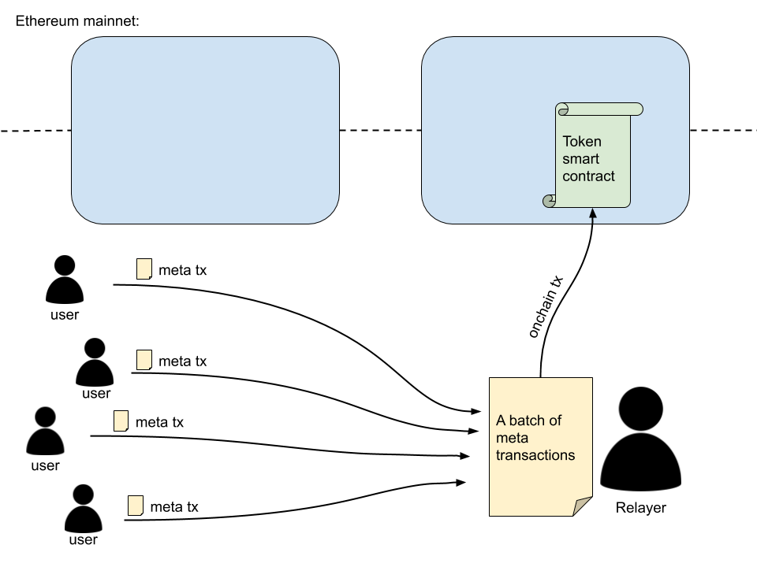

```md
---
eip: 3005
title: 批量元交易
author: Matt (@defifuture)
discussions-to: https://ethereum-magicians.org/t/eip-3005-the-economic-viability-of-batched-meta-transactions/4673
status: Stagnant
type: Standards Track
category: ERC
created: 2020-09-25
---

## 简单总结

为 ERC-20（和其他同质化代币标准）定义了一个扩展函数，允许接收和处理一批元交易。

## 摘要

本 EIP 定义了一个名为 `processMetaBatch()` 的新函数，该函数扩展了任何同质化代币标准，并允许在一个链上交易中处理来自多个发送者的批量元交易。

该函数必须能够接收多个元交易数据并进行处理。这意味着在基于数据进行代币转移之前，需要验证数据和签名。

该函数使发送者可以进行无 gas 交易，同时由于批处理而降低了中继者的 gas 成本。

## 动机

元交易已被证明是一种有用的解决方案，适用于没有任何以太币但持有 ERC-20 代币并希望转移它们（无 gas 交易）的以太坊账户。

当前的元交易中继器实现仅允许一次中继一个元交易。有些还允许来自同一发送者的批量元交易。但没有一个提供来自**多个**发送者的批量元交易。

本 EIP 背后的动机是找到一种方法，允许在**一个链上交易**中中继来自**多个发送者**的批量元交易，同时**降低中继者需要承担的总 gas 成本**。



## 规范

本文档中使用的关键词 "MUST"、"MUST NOT"、"REQUIRED"、"SHALL"、"SHALL NOT"、"SHOULD"、"SHOULD NOT"、"RECOMMENDED"、"MAY" 和 "OPTIONAL" 按照 RFC 2119 中的描述进行解释。

本文档中使用的关键词 "MUST (BUT WE KNOW YOU WON'T)"、"SHOULD CONSIDER"、"REALLY SHOULD NOT"、"OUGHT TO"、"WOULD PROBABLY"、"MAY WISH TO"、"COULD"、"POSSIBLE" 和 "MIGHT" 按照 RFC 6919 中的描述进行解释。

### 元交易数据

为了成功验证和转移代币，`processMetaBatch()` 函数必须处理以下关于元交易的数据：

- 发送者地址
- 接收者地址
- 代币数量
- 中继者费用
- （元交易）nonce 值
- 到期日期（这可以是区块号，也可以是区块时间戳）
- 代币地址
- 中继者地址
- 签名

并非所有数据都需要由中继者发送到函数（参见函数接口规范）。有些数据可以从其他来源（来自交易数据和合约状态）推断或提取出来。

### `processMetaBatch()` 函数输入数据

`processMetaBatch()` 函数必须接收以下数据：

- 发送者地址
- 接收者地址
- 代币数量
- 中继者费用
- 到期日期（这可以是区块号，也可以是区块时间戳）
- 签名

以下数据是可选的，可以发送到函数，因为它可以通过其他来源提取或推导出来：

- （元交易）nonce 值
- 代币地址
- 中继者地址

### 元交易数据哈希

创建元交易数据哈希的伪代码如下：

```
keccak256(address(sender)
	   ++ address(recipient)
	   ++ uint256(amount)
	   ++ uint256(relayerFee)
	   ++ uint256(nonce)
	   ++ uint256(expirationDate)
	   ++ address(tokenContract)
	   ++ address(relayer)
)
```

创建的哈希必须使用发送者的私钥进行签名。

### 验证规则

- 新交易的 Nonce 值必须始终比同一发送者向同一代币合约的上次成功处理的元交易的 Nonce 值大 1。
- 必须禁止向 0x0 地址发送和从 0x0 地址发送。
- 元交易必须在到期日之前处理。
- 每个发送者的代币余额必须等于或大于其各自的元交易代币数量和中继者费用的总和。
- 如果批处理中至少有一个元交易不满足上述要求，则不得恢复交易。相反，必须跳过或忽略失败的元交易。

### `processMetaBatch()` 函数接口

`processMetaBatch()` 函数必须具有以下接口：

```solidity
function processMetaBatch(address[] memory senders,
                          address[] memory recipients,
                          uint256[] memory amounts,
                          uint256[] memory relayerFees,
                          uint256[] memory blocks,
                          uint8[] memory sigV,
                          bytes32[] memory sigR,
                          bytes32[] memory sigS) public returns (bool);
```

传递的参数概述：

- `senders`：元交易发送者地址（代币发送者）的数组
- `recipients`：代币接收者地址的数组
- `amounts`：分别从每个发送者发送到每个接收者的代币数量的数组
- `relayerFees`：发送者以代币支付的中继者费用数组。费用接收者是中继者 (`msg.address`)
- `blocks`：表示元交易必须处理的到期日期的区块号数组（或者，可以使用时间戳代替区块号）
- `sigV`、`sigR`、`sigS`：表示元交易签名部分的三个数组

每个数组中的每个条目必须表示来自一个元交易的数据。数据的顺序非常重要。来自单个元交易的数据必须在每个数组中具有相同的索引。

### 元交易 nonce 值

代币智能合约必须跟踪每个代币持有者的元交易 nonce 值。

```solidity
mapping (address => uint256) private _metaNonces;
```

`nonceOf()` 函数的接口如下：

```solidity
function nonceOf(address account) public view returns (uint256);
```

### 代币转移

在成功验证元交易后，元交易发送者的元 nonce 值必须增加 1。

然后必须进行两次代币转移：

- 指定的代币数量必须转移到接收者。
- 中继者费用必须转移到中继者 (`msg.sender`)。

## 实现

**参考实现**向现有的 ERC-20 代币标准添加了几个函数：

- `processMetaBatch()`
- `nonceOf()`

您可以在此文件中查看这两个函数的实现：[ERC20MetaBatch.sol](https://github.com/defifuture/erc20-batched-meta-transactions/blob/master/contracts/ERC20MetaBatch.sol)。这是一个扩展的 ERC-20 合约，具有添加的元交易批量转移功能。

### `processMetaBatch()`

`processMetaBatch()` 函数负责接收和处理一批更改代币余额的元交易。

```solidity
function processMetaBatch(address[] memory senders,
                          address[] memory recipients,
                          uint256[] memory amounts,
                          uint256[] memory relayerFees,
                          uint256[] memory blocks,
                          uint8[] memory sigV,
                          bytes32[] memory sigR,
                          bytes32[] memory sigS) public returns (bool) {
    
    address sender;
    uint256 newNonce;
    uint256 relayerFeesSum = 0;
    bytes32 msgHash;
    uint256 i;

    // 循环处理所有元交易
    for (i = 0; i < senders.length; i++) {
        sender = senders[i];
        newNonce = _metaNonces[sender] + 1;

        if(sender == address(0) || recipients[i] == address(0)) {
            continue; // 如果发送者或接收者是 0x0 地址，则跳过此元交易
        }

        // 元交易应处理到（包括）指定的块号，否则无效
        if(block.number > blocks[i]) {
            continue; // 如果当前块号大于请求的块号，则跳过此元交易
        }

        // 检查元交易发送者的余额是否足够
        if(_balances[sender] < (amounts[i] + relayerFees[i])) {
            continue; // 如果发送者的余额小于金额和中继者费用，则跳过此元交易
        }

        // 检查签名是否有效
        msgHash = keccak256(abi.encode(sender, recipients[i], amounts[i], relayerFees[i], newNonce, blocks[i], address(this), msg.sender));
        if(sender != ecrecover(keccak256(abi.encodePacked("\x19Ethereum Signed Message:\n32", msgHash)), sigV[i], sigR[i], sigS[i])) {
            continue; // 如果签名无效，则跳到下一个元交易
        }

        // 为发送者设置一个新的 nonce 值
        _metaNonces[sender] = newNonce;

        // 转移代币
        _balances[sender] -= (amounts[i] + relayerFees[i]);
        _balances[recipients[i]] += amounts[i];
        relayerFeesSum += relayerFees[i];
    }

	// 将所有中继者费用的总和交给中继者
    _balances[msg.sender] += relayerFeesSum;

    return true;
}
```

### `nonceOf()`

由于重放保护需要 Nonce 值（请参阅 *安全注意事项* 下的 *重放攻击*）。

```solidity
mapping (address => uint256) private _metaNonces;

// ...

function nonceOf(address account) public view returns (uint256) {
    return _metaNonces[account];
}
```

此处提供完整实现的链接（以及 gas 使用情况结果）：[https://github.com/defifuture/erc20-batched-meta-transactions](https://github.com/defifuture/erc20-batched-meta-transactions)。

> 请注意，此处使用了 OpenZeppelin ERC-20 实现。某些其他实现可能以不同的方式命名了 `_balances` 映射，这需要在 `processMetaBatch()` 函数中进行细微的更改。

## 原理

### 多合一

替代实现（如 GSN）使用多个智能合约来启用元交易，尽管这会增加 gas 使用量。此实现 (EIP-3005) 有意将所有内容保留在一个函数中，从而降低了复杂性和 gas 成本。

因此，`processMetaBatch()` 函数可以接收一批元交易，验证它们，然后将代币从一个地址转移到另一个地址。

### 函数参数

如您所见，参考实现中的 `processMetaBatch()` 函数采用以下参数：

- **发送者地址**数组（元交易发送者，不是中继者）
- **接收者地址**数组
- **金额**数组
- **中继者费用**数组（中继者是 `msg.sender`）
- **块号**数组（元交易的到期“日期”）
- 表示**签名**各部分 (v, r, s) 的三个数组

这些数组中的**每个项目**都代表**一个元交易的数据**。这就是为什么数组中的**正确顺序**非常重要。

如果中继者弄错了顺序，`processMetaBatch()` 函数会注意到这一点（在验证签名时），因为元交易值的哈希与签名的哈希不匹配。具有无效签名的元交易将被**跳过**。

### 将元交易数据传递到函数的可选方法

参考实现将参数作为数组。每个元交易数据类别都有一个单独的数组（无法从其他来源推断或提取的数组）。

另一种方法是将元交易的所有数据位压缩为一个值，然后在智能合约中解压缩它。一批元交易的数据将以数组形式发送，但只需要一个数组（压缩数据），而不是多个数组。

### 为什么 Nonce 值不是参考实现中的参数之一？

元 Nonce 值用于构造签名哈希（请参阅构造 `keccak256` 哈希的 `msgHash` 行 - 您将在那里找到 Nonce 值）。

由于新的 Nonce 值必须始终比前一个值大 1，因此无需将其作为参数数组包含在 `processMetaBatch()` 函数中，因为可以推断出其值。

这也有助于避免“堆栈太深”错误。

### EIP-2612 Nonce 值映射可以重用吗？

EIP-2612（`permit()` 函数）也需要 Nonce 值映射。在这一点上，我还不确定如果智能合约同时实现 EIP-3005 和 EIP-2612，是否应该**重用**此映射。

乍一看，似乎可以重用 EIP-2612 中的 `nonces` 映射，但这应该经过深思熟虑（并经过测试），以了解可能的安全影响。

### 代币转移

参考实现中的代币转移可以替代地通过调用 `_transfer()` 函数（OpenZeppelin ERC-20 实现的一部分）来完成，但这会增加 gas 使用量，并且如果某些元交易无效，它也会恢复整个批处理（当前的实现只是跳过它）。

另一个 gas 用量优化是在函数末尾将总中继者费用分配给中继者，而不是在 for 循环内的每次代币转移中分配（从而避免了多次 SSTORE 调用，每次调用成本为 5'000 gas）。

## 向后兼容性

批量元交易的代码实现与任何同质化代币标准向后兼容，例如，ERC-20（它仅使用一个函数扩展它）。

## 测试用例

测试链接：[https://github.com/defifuture/erc20-batched-meta-transactions/tree/master/test](https://github.com/defifuture/erc20-batched-meta-transactions/tree/master/test)。

## 安全注意事项

以下是潜在安全问题的列表，以及此实现中如何解决这些问题。

### 伪造元交易

防止中继者伪造元交易的解决方案是让用户使用其私钥对元交易进行签名。

然后，`processMetaBatch()` 函数使用 `ecrecover()` 验证签名。

### 重放攻击

`processMetaBatch()` 函数可防止两种类型的重放攻击：

**在同一代币智能合约中两次使用相同的元交易**

Nonce 值可防止中继者多次发送同一元交易的重放攻击。

**在不同的代币智能合约中两次使用相同的元交易**

必须将代币智能合约地址添加到签名哈希（元交易）中。

此地址不需要作为参数发送到 `processMetaBatch()` 函数中。相反，该函数在构造哈希以验证签名时使用 `address(this)`。这样，不适用于代币智能合约的元交易将被拒绝（跳过）。

### 签名验证

签名元交易和验证签名对于整个方案的运作至关重要。

`processMetaBatch()` 函数验证元交易签名，如果签名**无效**，则会**跳过**该元交易（但整个链上交易**不会被恢复**）。

```solidity
msgHash = keccak256(abi.encode(sender, recipients[i], amounts[i], relayerFees[i], newNonce, blocks[i], address(this), msg.sender));

if(sender != ecrecover(keccak256(abi.encodePacked("\x19Ethereum Signed Message:\n32", msgHash)), sigV[i], sigR[i], sigS[i])) {
    continue; // 如果签名无效，则跳到下一个元交易
}
```

为什么不恢复整个链上交易？因为可能只有一个有问题的元交易，其他元交易不应仅仅因为一个烂苹果而被删除。

也就是说，期望中继者在转发元交易之前提前验证它们。这就是为什么中继者无权获得无效元交易的中继者费用的原因。

### 恶意中继者强迫用户过度消费

恶意中继者可能会延迟发送某些用户的元交易，直到用户决定在链上进行代币交易。

之后，中继者将转发延迟的元交易，这意味着用户将进行两次代币交易（过度消费）。

**解决方案：**每个元交易都应具有“到期日期”。这以块号的形式定义，元交易必须在此块号之前在链上转发。

```solidity
function processMetaBatch(...
                          uint256[] memory blocks,
                          ...) public returns (bool) {
    
    //...

	// 循环处理所有元交易
    for (i = 0; i < senders.length; i++) {

        // 元交易应处理到（包括）指定的块号，否则无效
        if(block.number > blocks[i]) {
            continue; // 如果当前块号大于请求的块号，则跳过此元交易
        }

        //...
```

### 抢跑攻击

恶意中继者可以侦察以太坊内存池以窃取元交易并抢跑原始中继者。

**解决方案：**`processMetaBatch()` 函数使用的保护是，它要求元交易发送者将中继者的以太坊地址添加为哈希中的值之一（然后对其进行签名）。

当 `processMetaBatch()` 函数生成哈希时，它会在其中包含 `msg.sender` 地址：

```solidity
msgHash = keccak256(abi.encode(sender, recipients[i], amounts[i], relayerFees[i], newNonce, blocks[i], address(this), msg.sender));

if(sender != ecrecover(keccak256(abi.encodePacked("\x19Ethereum Signed Message:\n32", msgHash)), sigV[i], sigR[i], sigS[i])) {
    continue; // 如果签名无效，则跳到下一个元交易
}
```

如果元交易被“盗用”，则签名检查将失败，因为 `msg.sender` 地址与预期中继者的地址不同。

### 恶意（或过于急躁）的用户通过多个中继者同时发送具有相同 Nonce 值的元交易

恶意或只是不耐烦的用户可以向各个中继者提交具有相同 Nonce 值（对于同一代币合约）的元交易。只有其中一个会获得中继者费用（链上的第一个），而其他中继者会获得无效的元交易。

**解决方案：**中继者可以**在彼此之间共享其待处理元交易的列表**（有点像信息内存池）。

由于防止抢跑的保护（见上文），中继者不必担心有人会窃取其各自的待处理交易。

如果中继者看到来自某个发送者地址的元交易具有相同的 Nonce 值，并且应该转发到同一代币智能合约，则他们可以决定仅第一个注册的元交易通过，而其他元交易将被删除（或者，如果在同一时间注册了元交易，则可以随机选择剩余的元交易）。

至少，中继者需要共享此元交易数据（为了检测元交易冲突）：

- 发送者地址
- 代币地址
- Nonce 值

### 过大的到期块号

中继者可能会欺骗元交易发送者添加过大的到期块号 - 这意味着必须处理元交易的块。块号可能在遥远的未来，例如，在 10 年后。这意味着中继者将有 10 年的时间来提交元交易。

**一种**解决此问题的方法是在智能合约中为块号添加上限约束。例如，我们可以说指定的到期块号不得大于当前块号之后的 100'000 个块（如果我们假设 15 秒的块时间，则这大约是未来 17 天）。

```solidity
// 元交易应处理到（包括）指定的块号，否则无效
if(block.number > blocks[i] || blocks[i] > (block.number + 100000)) {
    // 如果当前块号大于请求的到期块号，则跳过此元交易。
    // 如果到期块号太大（大于未来 100'000 个块），也跳过。
    continue;
}
```

此添加可能会打开新的安全隐患，这就是为什么将其排除在此概念验证之外的原因。但是，任何希望实现它的人都应该了解这种潜在的约束。

**另一种方法**是保持 `processMetaBatch()` 函数不变，而是在**中继者级别**检查过大的到期块号。在这种情况下，可以通知用户该问题，并且可以使用另一个具有更低块参数（和相同 Nonce 值）的中继者发布新的元交易。

## 版权

版权和相关权利通过 [CC0](../LICENSE.md) 放弃。
```