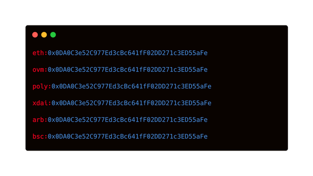

## 摘要

[ERC-3770](./eip-3770.md) 引入了一种新的地址标准，供钱包和 dApp 通过使用人类可读的前缀来显示链特定的地址。

## 动机

该提案的需求源于使用以太坊虚拟机 (EVM) 的非以太坊主网链的日益普及。在这种情况下，地址变得模棱两可，因为同一地址可能指的是链 X 上的 EOA 或链 Y 上的智能合约。这最终会导致以太坊用户因人为错误而损失资金。例如，用户将资金发送到未在特定链上部署的智能合约钱包地址。

因此，我们应该为地址添加一个唯一的标识符前缀，以向 Dapp 和钱包指示目标帐户所在的链。理论上，此前缀可以是 [EIP-155](./eip-155.md) chainID。但是，这些链 ID 并非旨在在 dApp 或钱包中向用户显示，并且它们针对开发人员的互操作性进行了优化，而不是人类可读性。

## 规范

该提案使用人类可读的区块链短名称扩展了地址。

### 语法

链特定的地址以链 shortName 为前缀，并用冒号 (:) 分隔。

链特定的地址 = "`shortName`" "`:`" "`address`"

- `shortName` = STRING

- `address` = STRING

### 语义

* `shortName` 是强制性的，并且必须是来自 https://github.com/ethereum-lists/chains 的有效链短名称
* `address` 是强制性的，并且必须是与 [ERC-55](./eip-55.md) 兼容的十六进制地址

### 例子

## 理由

为了解决在多链上下文中面向用户的地址不明确的最初问题，我们需要将 EIP-155 链 ID 映射为显示链标识符的面向用户的格式。

## 向后兼容性

没有链说明符的以太坊地址将继续需要额外的上下文才能理解该地址指的是哪个链。

## 安全考虑

可以使用外观相似的链短名称来迷惑用户。

## 版权

版权及相关权利通过 [CC0](../LICENSE.md) 放弃。