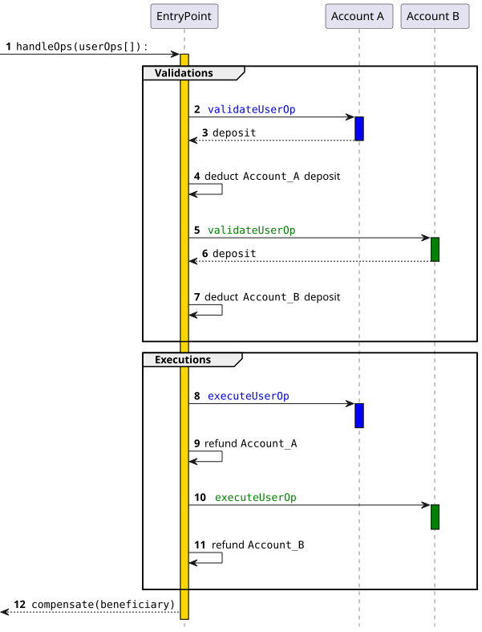
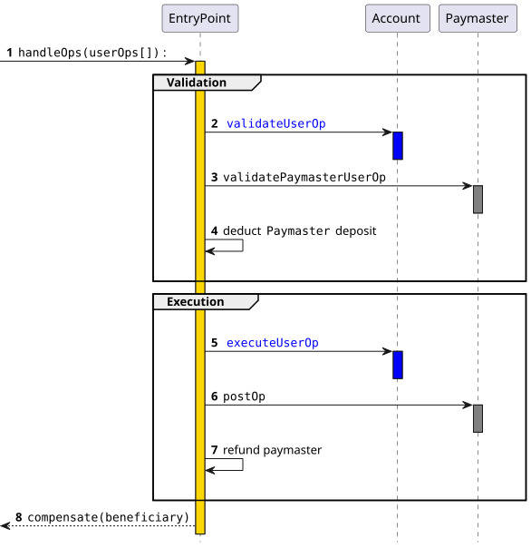
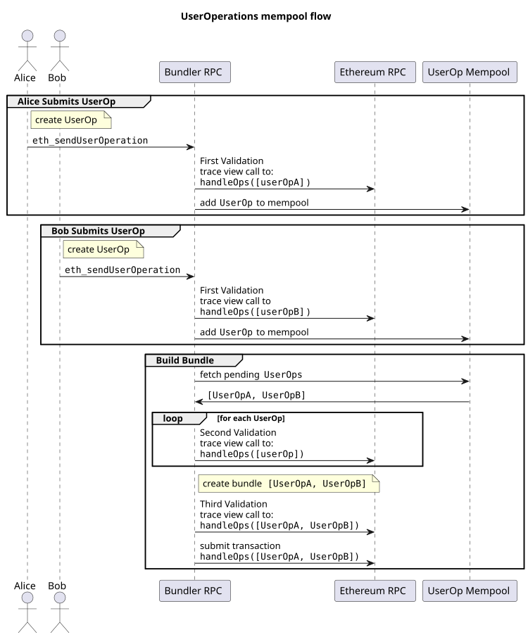

## 摘要

一种账户抽象提案，它完全避免了对共识层协议进行更改的需要。该提案没有添加新的协议功能和更改底层交易类型，而是引入了一种更高层的伪交易对象，称为 `UserOperation`。用户将 `UserOperation` 对象发送到单独的内存池。一种特殊的参与者，称为捆绑者，将一组这些对象打包到一个交易中，该交易对一个特殊的合约进行 `handleOps` 调用，然后该交易被包含在一个区块中。

## 动机

另请参阅 `https://ethereum-magicians.org/t/implementing-account-abstraction-as-part-of-eth1-x/4020` 和其中的链接，了解历史工作和动机，以及 [EIP-2938](./eip-2938.md)，了解实现相同目标的共识层提案。

本提案采用不同的方法，避免对共识层进行任何调整。它旨在实现以下目标：

* **实现账户抽象的关键目标**：允许用户使用包含任意验证逻辑的智能合约账户，而不是 EOA 作为其主要账户。完全消除用户也需要 EOA 的任何需求，
  这既是现状智能合约账户的要求，也是 [EIP-7702](./eip-7702.md) 的要求。
* **去中心化**
    * 允许任何捆绑者（可以理解为：区块构建者）参与包含账户抽象的 `UserOperations` 的过程
    * 适用于公共内存池上的所有活动；用户不需要知道任何特定参与者的直接通信地址（例如 IP、onion）
    * 避免对捆绑者的信任假设
* **不需要任何以太坊共识的更改**：以太坊共识层开发专注于面向可扩展性的功能，并且可能在很长一段时间内没有任何进一步的协议更改的机会。因此，为了增加更快采用的机会，本提案避免了以太坊共识的更改。
* **支持其他用例**
    * 保护隐私的应用程序
    * 原子多操作（类似于 [EIP-7702](./eip-7702.md) 的目标）
    * 使用 [ERC-20](./eip-20.md) 代币支付交易费用，允许开发者为其用户支付费用，并且更普遍地支持类似 [EIP-7702](./eip-7702.md) 的**赞助交易**用例
    * 抽象验证允许合约使用不同的签名方案、多重签名配置、自定义恢复等。
    * 抽象 gas 支付允许通过第三方支付轻松入门、使用代币支付、跨链 gas 支付
    * 抽象执行允许捆绑交易

## 规范

### 定义

* **UserOperation** - 一个描述代表用户发送的交易的结构。为了避免混淆，它没有被命名为“交易”。
  * 就像交易一样，它包含 `to`、`calldata`、`maxFeePerGas`、`maxPriorityFeePerGas`、`nonce`、`signature`。
  * 与交易不同，它包含几个其他字段，如下所述。
  * 值得注意的是，`signature` 字段的用法不是由协议定义的，而是由智能合约账户实现定义的。
* **Sender** - 发送 `UserOperation` 的智能合约账户。
* **EntryPoint** - 用于执行 `UserOperations` 捆绑包的单例合约。捆绑者必须将支持的 `EntryPoint` 列入白名单。
* **Bundler** - 一个可以处理 `UserOperations` 的节点（区块构建者），
  创建一个有效的 `entryPoint.handleOps()` 交易，
  并在其仍然有效时将其添加到区块中。
  这可以通过多种方式实现：
  * 捆绑者可以充当区块构建者本身。
  * 如果捆绑者不是区块构建者，它必须与区块构建基础设施（如 `mev-boost`）或
    其他类型的提议者-构建者分离（如 [EIP-7732](./eip-7732.md)）一起工作。
  * 如果可用，`bundler` 也可以依赖于 [ERC-7796](./eip-7796.md) 中定义的实验性 `eth_sendRawTransactionConditional` RPC API。
* **Paymaster** - 一个同意为交易支付的辅助合约，而不是发送者本身。
* **Factory** - 一个在必要时为新的 `sender` 合约执行部署的辅助合约。
* **Aggregator** - 也称为“授权者合约” - 一个使多个 `UserOperations` 能够共享单个验证的合约，在 [ERC-7766](./eip-7766.md) 中完全定义。
* **规范 UserOperation 内存池** - 一个去中心化的无需许可的 P2P 网络，捆绑者可以在其中交换有效并符合 [ERC-7562](./eip-7562.md) 的 `UserOperations`。
* **替代 UserOperation 内存池** - 任何其他 P2P 内存池，其中 `UserOperations` 的有效性由与 [ERC-7562](./eip-7562.md) 不同的规则以任何方式确定。
* **Deposit** - `Sender` 或 `Paymaster` 合约已转移到 `EntryPoint` 合约的以太币（或任何 L2 原生货币）金额，旨在支付未来 `UserOperations` 的 gas 成本。

### UserOperation

为了避免以太坊共识的更改，我们不尝试为账户抽象的交易创建新的交易类型。相反，用户将其智能合约账户要采取的操作打包到一个名为 `UserOperation` 的结构中：

| 字段                           | 类型      | 描述                                                                                              |
|---------------------------------|-----------|---------------------------------------------------------------------------------------------------|
| `sender`                        | `address` | 进行 `UserOperation` 的账户                                                                            |
| `nonce`                         | `uint256` | 防重放参数（参见“半抽象 Nonce 支持”）                                                                 |
| `factory`                       | `address` | 新账户的账户工厂 OR EIP-7702 账户的 `0x7702` 标志，否则为 `address(0)`                                  |
| `factoryData`                   | `bytes`   | 如果提供了 `factory`，则为账户工厂的数据，或 EIP-7702 初始化数据，或空数组                                |
| `callData`                      | `bytes`   | 在主执行调用期间传递给 `sender` 的数据                                                                |
| `callGasLimit`                  | `uint256` | 为主执行调用分配的 gas 量                                                                             |
| `verificationGasLimit`          | `uint256` | 为验证步骤分配的 gas 量                                                                               |
| `preVerificationGas`            | `uint256` | 支付给捆绑者的额外 gas                                                                                |
| `maxFeePerGas`                  | `uint256` | 每个 gas 的最大费用（类似于 [EIP-1559](./eip-1559.md) `max_fee_per_gas`）                               |
| `maxPriorityFeePerGas`          | `uint256` | 每个 gas 的最大优先级费用（类似于 EIP-1559 `max_priority_fee_per_gas`）                               |
| `paymaster`                     | `address` | paymaster 合约的地址，（如果 `sender` 自己支付 gas，则为空）                                             |
| `paymasterVerificationGasLimit` | `uint256` | 为 paymaster 验证代码分配的 gas 量（仅当 paymaster 存在时）                                            |
| `paymasterPostOpGasLimit`       | `uint256` | 为 paymaster 后操作代码分配的 gas 量（仅当 paymaster 存在时）                                            |
| `paymasterData`                 | `bytes`   | paymaster 的数据（仅当 paymaster 存在时）                                                              |
| `signature`                     | `bytes`   | 传递到 `sender` 以验证授权的数据                                                                      |

用户将 `UserOperation` 对象发送到专用的 `UserOperation` 内存池。

为了防止跨链或具有多个 `EntryPoint` 合约版本的重放攻击，
`signature` 必须依赖于 `chainid` 和 `EntryPoint` 地址。

请注意，可以与 `UserOperation` 结构一起提供一个 [EIP-7702](./eip-7702.md)“授权元组”值，
但“授权元组”不包含在 `UserOperation` 本身中。

### `EntryPoint` 接口

当在链上传递到 `EntryPoint` 合约、`Account` 和 `Paymaster` 时，使用上述结构的“打包”版本，称为 `PackedUserOperation`：

| 字段                | 类型      | 描述                                                                                                                |
|----------------------|-----------|---------------------------------------------------------------------------------------------------------------------|
| `sender`             | `address` |                                                                                                                     |
| `nonce`              | `uint256` |                                                                                                                     |
| `initCode`           | `bytes`   | factory 地址和 factoryData 的连接（或为空），或 [EIP-7702 数据](#support-for-eip-7702-authorizations)                 |
| `callData`           | `bytes`   |                                                                                                                     |
| `accountGasLimits`   | `bytes32` | verificationGasLimit（16 字节）和 callGasLimit（16 字节）的连接                                                     |
| `preVerificationGas` | `uint256` |                                                                                                                     |
| `gasFees`            | `bytes32` | maxPriorityFeePerGas（16 字节）和 maxFeePerGas（16 字节）的连接                                                      |
| `paymasterAndData`   | `bytes`   | paymaster 字段的连接（或为空）                                                                                       |
| `signature`          | `bytes`   |                                                                                                                     |


`EntryPoint` 合约的核心接口如下：

```solidity
function handleOps(PackedUserOperation[] calldata ops, address payable beneficiary);
```

`beneficiary` 是将收到在捆绑执行期间收集的所有 gas 费用的地址。

### 智能合约账户接口

智能合约账户所需的核心接口是：

```solidity
interface IAccount {
  function validateUserOp
      (PackedUserOperation calldata userOp, bytes32 userOpHash, uint256 missingAccountFunds)
      external returns (uint256 validationData);
}
```

`userOpHash` 是 `userOp`（除了 `signature`）、`entryPoint` 和 `chainId` 的哈希值。

智能合约账户：

* 必须验证调用者是可信的 `EntryPoint`
* 必须验证签名是 `userOpHash` 的有效签名，并且
  如果签名不匹配，应该返回 `SIG_VALIDATION_FAILED` (`1`)，而不是恢复。任何其他错误必须恢复。
* 在返回 `SIG_VALIDATION_FAILED` (`1`) 时，不应过早返回。相反，它应该完成正常流程，以便为验证函数执行 gas 估算。
* 必须向 `EntryPoint`（调用者）支付至少 `missingAccountFunds`（如果当前 `sender` 的存款足够，则可能为零）
* `sender` 可以支付超过此最低金额以支付未来的交易。它也可以随时调用 `withdrawTo` 来稍后检索它。
* 返回值必须打包 `aggregator`/`authorizer`、`validUntil` 和 `validAfter` 时间戳。
  * `aggregator`/`authorizer` - 如果签名有效，则为 0，如果标记签名失败，则为 1。否则，为 [ERC-7766](./eip-7766.md) 中定义的 `aggregator`/`authorizer` 合约的地址。
  * `validUntil` 是 6 字节的时间戳值，如果为“无限”，则为零。`UserOperation` 仅在此时间之前有效。
  * `validAfter` 是 6 字节的时间戳。`UserOperation` 仅在此时间之后有效。

智能合约账户可以实现接口 `IAccountExecute`

```solidity
interface IAccountExecute {
  function executeUserOp(PackedUserOperation calldata userOp, bytes32 userOpHash) external;
}
```

`EntryPoint` 将使用当前 UserOperation 调用此方法，而不是直接在 `sender` 上执行 `callData` 本身。

### 半抽象 Nonce 支持

在以太坊协议中，顺序交易 `nonce` 值用作重放保护方法以及
确定包含在区块中的交易的有效顺序。

它还有助于交易哈希唯一性，因为具有相同发送者和相同
nonce 的交易可能不会在链中包含两次。

然而，需要单个顺序 `nonce` 值限制了发送者定义其自定义逻辑的能力
关于交易排序和重放保护。

我们没有实现顺序 `nonce`，而是实现了一种 nonce 机制，该机制在 `UserOperation` 中使用单个 `uint256` nonce 值，
但将其视为两个值：

* 192 位“密钥”
* 64 位“序列”

这些值在链上的 `EntryPoint` 合约中表示。
我们在 `EntryPoint` 接口中定义以下方法来公开这些值：

```solidity
function getNonce(address sender, uint192 key) external view returns (uint256 nonce);
```

对于每个 `key`，`EntryPoint` 针对每个 UserOperation 验证 `sequence`。
如果 nonce 验证失败，则 `UserOperation` 被认为是无效的，并且捆绑恢复。
对于每个 UserOperation，`sequence` 值按顺序且单调地递增。
可以在任何时候引入具有任意值的新 `key`，其 `sequence` 从 `0` 开始。

这种方法保持了协议级别链上 `UserOperation` 哈希唯一性的保证，同时允许
账户实现他们可能需要操作的任何自定义逻辑，在 192 位“密钥”字段上，同时适应 32 字节的字。

#### 读取和验证 nonce

在准备 `UserOperation` 时，捆绑者可以对该方法进行视图调用，以确定 `nonce` 字段的有效值。

捆绑者对 `UserOperation` 的验证应以 `getNonce` 开始，以确保交易具有有效的 `nonce` 字段。

如果捆绑者愿意接受来自同一发送者的多个 `UserOperations` 进入其内存池，
则该捆绑者应该跟踪已添加到内存池中的 `UserOperations` 的 `key` 和 `sequence` 对。

#### 用法示例

1. 经典顺序 nonce。

   为了要求账户具有经典的顺序 nonce，验证函数必须执行：

   ```solidity
   require(userOp.nonce<type(uint64).max)
   ```

2. 有序管理事件

   在某些情况下，账户可能需要有一个“管理”操作通道与正常操作并行运行。

   在这种情况下，账户可以在调用账户本身的方法时使用特定的 `key`：

   ```solidity
   bytes4 sig = bytes4(userOp.callData[0 : 4]);
   uint key = userOp.nonce >> 64;
   if (sig == ADMIN_METHODSIG) {
       require(key == ADMIN_KEY, "wrong nonce-key for admin operation");
   } else {
       require(key == 0, "wrong nonce-key for normal operation");
   }
   ```

### 需要的 `EntryPoint` 合约功能

`EntryPoint` 方法是 `handleOps`，它处理 `UserOperations` 数组

`EntryPoint` 的 `handleOps` 函数必须执行以下步骤（我们首先描述更简单的非 paymaster 情况）。它必须进行两个循环，**验证循环**和**执行循环**。
在验证循环中，`handleOps` 调用必须为每个 `UserOperation` 执行以下步骤：

* **创建 `sender` 智能合约账户（如果它还不存在）**，使用 `UserOperation` 中提供的 `initcode`。
  * 如果 `factory` 地址为“0x7702”，则 sender 必须是具有 [EIP-7702](./eip-7702.md) 授权指定的 EOA。`EntryPoint` 验证授权地址是否与 `UserOperation` 签名中指定的地址匹配（参见 [支持 [EIP-7702] 授权](#support-for-eip-7702-authorizations)）。
  * 如果 `sender` 不存在，_并且_ `initcode` 为空，或者没有在“sender”地址部署合约，则调用必须失败。
* 根据 gas 限制和当前 gas 值计算 `sender` 需要支付的最大可能费用。
* 计算 `sender` 必须添加到 `EntryPoint` 中的“存款”中的费用
* **在 `sender` 合约上调用 `validateUserOp`**，传入 `UserOperation`、其哈希值和所需的费用。
  如果 `sender` 认为 `UserOperation` 有效，则智能合约账户应该验证 `UserOperation` 的签名并支付费用。如果任何 `validateUserOp` 调用失败，`handleOps` 必须跳过至少该 `UserOperation` 的执行，并且可能会完全恢复。
* 验证账户在 `EntryPoint` 中的存款是否足够高以支付最大可能的成本（支付已经完成的验证和最大执行 gas）

在执行循环中，`handleOps` 调用必须为每个 `UserOperation` 执行以下步骤：

* **使用 `UserOperation` 的 calldata 调用账户**。由账户选择如何解析 calldata；预期工作流程是账户具有一个 `execute` 函数，该函数将剩余的 calldata 解析为账户应进行的一系列一个或多个调用。
* 如果 calldata 以 methodsig `IAccountExecute.executeUserOp` 开头，则 `EntryPoint` 必须通过编码 `executeUserOp(userOp,userOpHash)` 来构建 calldata，并使用该 calldata 调用账户。
* 在调用之后，将预先收取的过多的 gas 成本退还到账户的存款中。\
  对 `callGasLimit` 和 `paymasterPostOpGasLimit` gas 的**未使用**金额处以 `10%` (`UNUSED_GAS_PENALTY_PERCENT`) 的惩罚。\
  仅当剩余未使用 gas 的数量大于或等于 `40000` (`PENALTY_GAS_THRESHOLD`) 时，才应用此惩罚。\
  此惩罚是必要的，以防止 `UserOperations` 在捆绑包中保留大部分 gas 空间，但使其未使用，并阻止捆绑者包含其他 `UserOperations`。
* 在执行完所有调用后，将从所有 `UserOperations` 收取的费用支付给捆绑者提供的 `beneficiary` 地址。



在接受 `UserOperation` 之前，捆绑者应该使用 RPC 方法在 `EntryPoint` 上本地调用 `handleOps` 函数，
以验证签名是否正确并且 `UserOperation` 实际上支付了费用；有关详细信息，请参见下面的 [模拟部分](#useroperation-simulation)。
节点/捆绑者必须拒绝验证失败的 `UserOperation`，这意味着不将其添加到本地内存池
并且不将其传播给其他对等方。

### 用于 [ERC-4337](./eip-4337) 的 JSON-RPC API

为了支持将 `UserOperation` 对象发送给捆绑者，而捆绑者又通过 P2P 内存池传播它们，
我们引入了一组 JSON-RPC API，包括 `eth_sendUserOperation` 和 `eth_getUserOperationReceipt`。

新的 JSON-RPC API 的完整定义可以在 [ERC-7769](./eip-7769.md) 中找到。

### 支持 [EIP-712](./eip-712.md) 签名

`userOpHash` 被计算为具有以下参数的 [EIP-712] 类型消息哈希：

```solidity
bytes32 constant TYPE_HASH =
    keccak256(
        "EIP712Domain(string name,string version,uint256 chainId,address verifyingContract)"
    );

bytes32 constant PACKED_USEROP_TYPEHASH =
    keccak256(
        "PackedUserOperation(address sender,uint256 nonce,bytes initCode,bytes callData,bytes32 accountGasLimits,uint256 preVerificationGas,bytes32 gasFees,bytes paymasterAndData)"
    );
```

### 支持 [EIP-7702](./eip-7702.md) 授权

在启用了 [EIP-7702](./eip-7702.md) 的网络上，`eth_sendUserOperation` 方法接受一个额外的 `eip7702Auth` 参数。
如果设置了此参数，则它必须是有效的 [EIP-7702](./eip-7702.md) 授权元组，并由 `sender` 地址签名。
捆绑者必须将捆绑包中所有 `UserOperations` 的所有必需的 `eip7702Auth` 添加到 `authorizationList` 并执行
使用交易类型 `SET_CODE_TX_TYPE` 的捆绑包。
此外，更新了 `UserOperation` 哈希计算以包括所需的 [EIP-7702](./eip-7702.md) 委托地址。

如果 `initCode` 字段以零填充的 `0x7702` 开头，并且此账户是使用 EIP-7702 交易部署的，则哈希计算如下：

* 为了进行哈希计算，`UserOperation` 的 `initCode` 字段的前 20 个字节设置为账户的 EIP-7702 委托地址（使用 EXTCODECOPY 获取）
* `initCode` 不用于调用工厂合约。
* 如果 `initCode` 的长度超过 20 个字节，则 initCode 的其余部分用于调用账户本身的初始化函数。

请注意，`UserOperation` 仍然可以在没有此类 `initCode` 的情况下执行。
在这种情况下，`EntryPoint` 不会哈希当前的 [EIP-7702 委托](./eip-7702.md)，并且可以针对修改后的账户执行。

此外，EIP-7702 定义了执行授权的 gas 成本等于 `PER_EMPTY_ACCOUNT_COST = 25000`。
此 gas 消耗在链上无法被 `EntryPoint` 合约观察到，并且必须包含在 `preVerificationGas` 值中。

### 扩展：paymaster

我们扩展了 `EntryPoint` 逻辑以支持可以赞助其他用户交易的 **paymaster**。此功能可用于允许应用程序开发人员补贴其用户的费用，允许用户使用 [ERC-20] 代币支付费用以及许多其他用例。当 `UserOperation` 中的 `paymasterAndData` 字段不为空时，`EntryPoint` 为该 UserOperation 实现不同的流程：



在验证循环期间，除了调用 `validateUserOp` 之外，`handleOps` 执行还必须检查 paymaster 是否在 `EntryPoint` 中存入了足够的 ETH 来支付 `UserOperation` 的费用，然后调用 paymaster 上的 `validatePaymasterUserOp` 以验证 paymaster 是否愿意为 `UserOperation` 支付费用。请注意，在这种情况下，调用 `validateUserOp` 时，`missingAccountFunds` 为 0，以反映账户的存款不用于支付此 `UserOperation`。

如果 paymaster 的 `validatePaymasterUserOp` 返回非空的 `context` 字节数组，则 `handleOps` 必须在进行主执行调用后在 paymaster 上调用 `postOp`。
否则，不会调用 `postOp` 函数。

恶意制作的 paymaster _可以_ DoS 系统。为了防止这种情况，我们使用信誉系统。paymaster 必须限制其存储使用量，或者拥有股份。有关详细信息，请参见 [信誉、限制和禁止部分](#reputation-scoring-and-throttlingbanning-for-global-entities)。

paymaster 接口如下：

```solidity
function validatePaymasterUserOp
    (PackedUserOperation calldata userOp, bytes32 userOpHash, uint256 maxCost)
    external returns (bytes memory context, uint256 validationData);

function postOp
    (PostOpMode mode, bytes calldata context, uint256 actualGasCost, uint256 actualUserOpFeePerGas)
    external;

enum PostOpMode {
    opSucceeded, // UserOperation 成功
    opReverted // UserOperation 恢复。paymaster 仍然必须支付 gas 费用。
}
```

`EntryPoint` 必须实现以下 API，以使 paymaster 等实体可以拥有股份，从而在存储访问方面具有更大的灵活性（有关详细信息，请参见 [信誉、限制和禁止部分](#reputation-scoring-and-throttlingbanning-for-global-entities)。）

```solidity
// 向调用实体添加股份
function addStake(uint32 _unstakeDelaySec) external payable;

// 解锁股份（必须等待 unstakeDelay 才能提取）
function unlockStake() external;

// 提取已解锁的股份
function withdrawStake(address payable withdrawAddress) external;
```

paymaster 还必须有一个存款，`EntryPoint` 将从中收取 `UserOperation` 费用。
存款（用于支付 gas 费用）与股份（已锁定）分开。

`EntryPoint` 必须实现以下接口，以允许 Paymaster（以及可选的账户）管理其存款：

```solidity
// 返回账户的存款
function balanceOf(address account) public view returns (uint256);

// 添加到给定账户的存款
function depositTo(address account) public payable;

// 新增至调用账户的押金
receive() external payable;

// 从当前账户的存款中提取
function withdrawTo(address payable withdrawAddress, uint256 withdrawAmount) external;
```

### 接收 UserOperation 时的捆绑者行为



与以太坊交易类似，`UserOperation` 的链下流程可以描述如下：
1. 客户端通过 RPC 调用 `eth_sendUserOperation` 将 `UserOperation` 发送给捆绑者。
2. 在将 `UserOperation` 包含在内存池中之前，捆绑者运行新接收到的 UserOperation 的*首次验证*。如果 `UserOperation` 验证失败，则捆绑者会删除它并在响应 `eth_sendUserOperation` 时返回错误。
3. 稍后，一旦构建了一个捆绑包，捆绑者就会从内存池中获取 `UserOperations`，并对每个 `UserOperations` 运行*第二次验证*。如果成功，则安排将其包含在下一个捆绑包中，否则将其丢弃。
4. 在链上提交新捆绑包之前，捆绑者会对整个 `UserOperations` 捆绑包执行*第三次验证*。如果任何 `UserOperations` 验证失败，则捆绑者会丢弃它们，并按照 [ERC-7562](./eip-7562.md) 中的详细描述更新其声誉。

当捆绑者收到 `UserOperation` 时，它必须首先运行一些基本的健全性检查，即：

* `sender` 是现有合约，或者 `initCode` 不为空（但不能同时满足这两点）
* 如果 `initCode` 不为空，则将其前 20 个字节解析为工厂地址或 [EIP-7702](./eip-7702.md) 标志。\
  记录工厂是否已抵押，以防稍后的模拟表明需要抵押。如果工厂访问全局状态，则必须抵押 - 有关详细信息，请参见 [信誉、限制和禁止部分](#reputation-scoring-and-throttlingbanning-for-global-entities)。
* `verificationGasLimit` 和 `paymasterVerificationGasLimits` 低于 `MAX_VERIFICATION_GAS` (`500000`)，并且 `preVerificationGas` 足够高以支付序列化 `UserOperation` 的 calldata gas 成本加上 `PRE_VERIFICATION_OVERHEAD_GAS` (`50000`)。
* `paymasterAndData` 为空，或者以 **paymaster** 地址开头，该地址是一个合约，该合约 (i) 当前在链上具有非空代码，(ii) 具有足够的存款来支付 UserOperation 的费用，并且 (iii) 当前未被禁止。在模拟期间，还会检查 paymaster 的股份，具体取决于其存储使用情况 - 有关详细信息，请参见 [信誉、限制和禁止部分](#reputation-scoring-and-throttlingbanning-for-global-entities)。
* `callGasLimit` 至少是非零值的 `CALL` 的成本。
* `maxFeePerGas` 和 `maxPriorityFeePerGas` 高于捆绑者愿意接受的可配置最小值。至少，它们足够高，可以包含在即将到来的 `block.basefee` 中。
* `sender` 在内存池中没有另一个已经存在的 `UserOperation`（或者它将现有条目替换为相同的 sender 和 nonce，具有更高的 `maxPriorityFeePerGas` 和同等增加的 `maxFeePerGas`）。
  每个 sender 只能在一个捆绑包中包含一个 `UserOperation`。
  如果 sender 已抵押，则 sender 可免于此规则，并且在内存池和捆绑包中可以有多个 `UserOperations`（请参阅下面的 [信誉、限制和禁止部分](#reputation-scoring-and-throttlingbanning-for-global-entities)）。

### UserOperation 模拟

我们将 `UserOperation` 模拟定义为使用 `UserOperation` 对 `EntryPoint` 合约进行的链下视图调用（或跟踪调用），并作为 `UserOperation` 验证的一部分强制执行 [ERC-7562](./eip-7562.md) 规则。

#### 模拟原理
为了验证正常的以太坊交易 `tx`，捆绑者执行静态检查，例如：
1. `ecrecover(tx.v, tx.r, tx.s)` 必须返回有效的 EOA
2. `tx.nonce` 必须是恢复的 EOA 的当前 nonce
3. 恢复的 EOA 的 `balance` 必须足以支付交易费用
4. `tx.gasLimit` 必须足以支付交易的内在 gas 成本
5. `chainId` 必须与当前链匹配

所有这些检查都不依赖于 EVM 状态，也不会受到其他账户交易的影响。

相反，`UserOperation` 验证依赖于 EVM 状态（对 `validateUserOp`、`validatePaymasterUserOp` 的调用），并且可以被其他 `UserOperations`（或正常的以太坊交易）更改。因此，我们引入模拟作为一种新的机制来检查其有效性。
直观地说，模拟的目的是确保 `UserOperation` 的链上验证代码是沙盒化的，并与同一捆绑包中的其他 `UserOperations` 隔离。

#### 模拟规范：

为了模拟 `UserOperation` 验证，捆绑者会对 `handleOps()` 方法进行视图调用，并使用 `UserOperation` 进行检查。

模拟应仅在 `sender` 和 `paymaster` 的验证部分运行，并且不需要用于 `UserOperation` 的执行。
捆绑者可以向捆绑包添加第二个 "始终失败" 的 `UserOperation`，以便模拟在第一个 UserOperation 的验证完成后立即结束。

如果模拟恢复，则捆绑者必须丢弃 `UserOperation`

模拟调用通过调用以下内容来执行完整验证：

1. 如果存在 `initCode`，则创建 `sender` 账户。
2. `account.validateUserOp`。
3. 如果指定了 paymaster：`paymaster.validatePaymasterUserOp`。

`sender` 或 `paymaster` 可能会返回时间范围 (`validAfter`/`validUntil`)。
`UserOperation` 必须在当前时间有效才能被视为有效，定义为 `validAfter<=block.timestamp`。

如果 `UserOperation` 过期过快并且可能在下一个区块之前变为无效，则捆绑者必须丢弃它。
为了解码返回的时间范围，捆绑者必须使用跟踪运行验证，以解码来自 `validateUserOp` 和 `validatePaymasterUserOp` 方法的返回值。

为了防止 DoS 攻击捆绑者，他们必须确保上述验证方法通过验证规则，这些规则限制了他们对操作码和存储的使用。
有关完整过程，请参见 [ERC-7562](./eip-7562.md)

### 估算 `preVerificationGas`

本文档未指定估算此值的规范方式，因为它取决于非永久网络属性，例如操作和数据 gas 定价以及预期的捆绑包大小。

但是，要求是估计值足以支付以下费用：

* 基本捆绑包交易成本。在以太坊上，为 `21000` gas 除以 `UserOperations` 的数量。
* 与 [EIP-2028](./eip-2028.md) 中定义的 `UserOperation` 相关的 calldata gas 成本。
* 静态 `EntryPoint` 合约代码执行。
* 将 `UserOperation` 的固定大小字段加载到 EVM 内存时的静态内存成本
* 由于 paymaster `validatePaymasterUserOp` 函数返回的上下文而产生的内存成本（包括扩展成本），如果相关。
  * 对 `innerHandleOp()` 函数的外部调用，这是 `EntryPoint` 实现的主要部分。
  请注意，此值不是静态的，而是取决于 `UserOperation` 在捆绑包中的位置。
* [EIP-7702] 授权成本（如果有）。
* [EIP-7623](./eip-7623.md) calldata 底价增加估算如下：
  * 应用 `tx.gasUsed` 的新公式，将 `execution_gas_used` 值替换为此 UserOperation 所做的值的估计值。
  * 该估计值计算为模拟期间使用的所有验证 gas（账户创建、验证和 paymaster 验证）之和以及执行和 `postOp` gas 限制之和的 10%。

捆绑者必须要求 `PreVerificationGas` 值具有松弛度，以适应未来捆绑包中的内存扩展成本以及 `UserOperation` 在其中的预期位置。

### 替代内存池

上述模拟规则很严格，可防止 paymaster 干扰系统。
但是，可能存在某些用例，其中可以验证特定的 paymaster
（通过手动审核）并验证它们不会引起任何问题，同时仍然需要放宽操作码规则。
捆绑者不能简单地“白名单”来自特定 paymaster 的请求：如果并非所有人都接受该 paymaster，
捆绑者，那么对它的支持最多是零星的。
相反，我们引入了术语“替代内存池”：修改后的验证规则，以及将它们传播给其他捆绑者的过程。

使用替代内存池的过程在 [ERC-7562](./eip-7562.md#alt-mempools-rules) 中定义

### 捆绑

捆绑是节点/捆绑者收集多个 `UserOperations` 并创建单个交易以在链上提交的过程。

在捆绑期间，捆绑者必须：

* 从同一捆绑包中排除访问另一个 `UserOperation` 的任何发送者地址的 `UserOperations`。
* 从同一捆绑包中排除访问由同一捆绑包中另一个 `UserOperation` 验证创建的任何地址（通过工厂）的 `UserOperations`。
*```md
* 运行 `debug_traceCall` 并使用尽可能多的 gas，以强制执行对操作码和存储访问的验证规则，
  以及验证整个 `handleOps` 捆绑交易，
  并使用消耗的 gas 用于实际的交易执行。
* 如果调用回滚，捆绑器必须使用追踪结果找到导致回滚的实体。\
  这是回滚之前，由 `EntryPoint` CALL 的最后一个实体。\
  （捆绑器不能假设回滚是 `FailedOp`）
* 如果任何验证上下文规则被违反，捆绑器必须将其视为与此 `UserOperation` 回滚相同。
* 从当前捆绑包和 mempool 中移除违规的 `UserOperation`。
* 如果错误是由 `factory` 或 `paymaster` 引起的，并且 `UserOperation` 的 `sender`
  **不是** 已质押的实体，则对有罪的 factory 或 paymaster 发出“ban”（见[“声誉、限制和禁止”](#reputation-scoring-and-throttlingbanning-for-global-entities)）。
* 如果错误是由 `factory` 或 `paymaster` 引起的，并且 `UserOperation` 的 `sender`
  **是** 已质押的实体，则不要从 mempool 中禁止 `factory` / `paymaster`。
  而是对已质押的 `sender` 实体发出“ban”。
* 重复直到 `debug_traceCall` 成功。

由于已质押的条目可能会使用某种瞬态存储来在同一捆绑包中的 `UserOperations` 之间传递数据，
因此对于整个 `handleOps` 验证，以及对于单个 `UserOperations`，强制执行完全相同的操作码和预编译禁止规则以及存储访问规则至关重要。
否则，攻击者可能能够使用被禁止的操作码来检测链上运行并触发 `FailedOp` 回滚。

当捆绑器在一个区块中包含一个捆绑包时，它必须确保该区块中较早的交易不会导致任何 `UserOperation` 失败。

### 错误代码。

在执行验证时，`EntryPoint` 必须在失败时回滚。在模拟期间，调用的捆绑器必须能够确定哪个实体（`sender`、`factory` 或 `paymaster`）导致了失败。
将回滚归因于实体是通过调用追踪完成的：回滚之前，`EntryPoint` 调用的最后一个实体是导致回滚的实体。
* 出于诊断目的，`EntryPoint` 必须仅使用显式的 `SignatureValidationFailed()`、`FailedOp()` 或 `FailedOpWithRevert()` 错误进行回滚。
* 错误消息以事件代码开头，AA##
* 以“AA1”开头的事件代码表示在 `sender` 创建期间发生错误
* 以“AA2”开头的事件代码表示在 `sender` 验证期间发生错误 (`validateUserOp`)
* 以“AA3”开头的事件代码表示在 `paymaster` 验证期间发生错误 (`validatePaymasterUserOp`)

## 基本原理

纯粹基于“智能合约账户”的账户抽象系统面临的主要挑战是 DoS 安全性：包含操作的区块构建者如何确保它实际上会支付费用，而无需首先执行整个操作？
要求区块构建者执行整个操作会开启 DoS 攻击向量，因为攻击者可以轻松发送许多假装支付费用但在长时间执行后在最后一刻回滚的操作。
同样，为了防止攻击者廉价地堵塞 mempool，P2P 网络中的节点需要在愿意转发操作之前检查该操作是否会支付费用。

第一步是验证（接受 UserOperation 并接受付款）和执行之间的清晰分离。
在本提案中，我们期望账户具有 `validateUserOp` 方法，该方法将 `UserOperation` 作为输入，验证签名并支付费用。
只有当此方法成功返回时，才会执行。

基于 `EntryPoint` 的方法允许验证和执行之间的清晰分离，并保持智能合约账户的逻辑简单。它强制执行简单的规则，即只有在验证成功并且 `UserOperation` 可以支付后，才会执行并且仅执行一次，并且还保证费用支付。

### 验证规则依据
下一步是保护捆绑器免受大量表面上有效（并支付）但最终回滚的 `UserOperations` 的拒绝服务攻击，从而阻止捆绑器处理有效的 `UserOperations`。

有两种类型的 `UserOperations` 可能会验证失败：
1. 在初始验证中成功（并被接受到 mempool 中），但在尝试将其包含在区块中时，依赖于环境状态而稍后失败的 `UserOperations`。
2. 独立检查时有效但在捆绑在一起并放在链上时失败的 `UserOperations`。
为了防止此类恶意 `UserOperations`，要求捆绑器遵循一组[对验证函数的限制](./eip-7562.md)，以防止此类拒绝服务攻击。

### 声誉依据

UserOperation 的存储访问规则防止它们相互干扰。
但是“全局”实体——paymaster 和 factory 会被多个 `UserOperations` 访问，因此可能会使多个先前有效的 `UserOperations` 失效。

为了防止滥用，我们降低（或完全禁止一段时间）导致 mempool 中大量 `UserOperations` 失效的实体的速度。
为了防止此类实体进行“女巫攻击”，我们要求它们使用系统进行质押，从而使此类 DoS 攻击非常昂贵。
请注意，此质押永远不会被削减。不涉及削减机制，质押的唯一用途是防止女巫攻击。
在指定的取消质押延迟后，可以随时提取质押。

在以下规则下允许未质押的实体。

质押后，实体在使用合约存储方面受到的限制较少。

质押值不是在链上强制执行的，而是由每个捆绑器在模拟交易时专门执行的。

### 全局实体的声誉评分和限制/禁止

[ERC-7562] 定义了捆绑器在将 `UserOperations` 接受到 mempool 中时必须遵循的一组规则。
它还描述了“声誉”

### Paymaster

Paymaster 合约允许 gas 的抽象：让一个不是交易发送者的合约来支付交易费用。

Paymaster 的架构允许它们遵循“预先收费，稍后退款”的模型。
例如，token-paymaster 可能会预先向用户收取交易的最大可能价格，并在之后将多余的部分退还给用户。

### 首次创建智能合约账户

注意：对于使用 EIP-7702 的合约，此流程在 [支持 [EIP-7702] 授权](#support-for-eip-7702-authorizations) 中描述。

本提案的一个重要设计目标是复制 EOA 的关键属性，即用户无需执行某些自定义操作或依赖现有用户来创建他们的智能合约账户；
他们可以简单地在本地生成一个地址并立即开始接受资金。

智能合约账户的创建本身是由一个“factory”合约完成的，其中包含一些特定于账户的数据。
Factory 预计使用 `CREATE2 0xF5`（而不是 `CREATE 0xF0`）来创建账户，以便账户的创建顺序不会干扰生成的地址。
`initCode` 字段（如果长度非零）被解析为 20 字节的 `factory` 地址，后跟要传递到此地址的 `calldata`。
此方法调用预计会创建账户并返回其地址。
如果 factory 使用 `CREATE2 0xF5` 或其他一些确定性方法来创建账户，则即使该账户已经被创建，也应返回该账户地址。
这样可以使捆绑器更容易查询地址，而无需知道该账户是否已经被部署，方法是模拟对 `entryPoint.getSenderAddress()` 的调用，该调用在底层调用 `factory`。
当指定了 `initCode` 时，如果 `sender` 地址指向现有合约，或者在调用 `initCode` 后 `sender` 地址仍然不存在，
则操作将被中止。
`initCode` 必须不能直接从 `EntryPoint` 调用，而是从另一个地址调用。
由此 factory 方法创建的合约必须接受对 `validateUserOp` 的调用来验证 `UserOperation` 的签名。
出于安全原因，重要的是生成的合约地址将取决于初始签名。
这样，即使有人可以在该地址部署一个账户，他也无法设置不同的凭据来控制它。
如果 Factory 访问全局存储，则必须进行质押 - 有关详细信息，请参见[声誉、限制和禁止部分](#reputation-scoring-and-throttlingbanning-for-global-entities)。

注意：为了让钱包应用程序在创建账户之前确定账户的“反事实”地址，
它应该对 `entryPoint.getSenderAddress()` 进行静态调用

## 向后兼容性

本 ERC 不会更改共识层，因此整个以太坊不存在向后兼容性问题。不幸的是，它不容易与 pre-[ERC-4337](./eip-4337.md) 智能合约账户兼容，因为这些账户没有 `validateUserOp` 函数。如果智能合约账户具有授权受信任的 `UserOperation` 提交者的函数，则可以通过创建一个 [ERC-4337](./eip-4337.md) 兼容的账户来解决此问题，该账户将验证逻辑重新实现为包装器，并将其设置为原始账户的受信任的 `UserOperation` 提交者。

## 参考实现

请参见 `https://github.com/eth-infinitism/account-abstraction/tree/main/contracts`

## 安全考虑

`EntryPoint` 合约将需要进行审计和正式验证，因为它将充当 _所有_ [ERC-4337] 的中心信任点。总的来说，这种架构减少了生态系统的审计和正式验证负担，因为各个 _账户_ 必须做的工作量变得小得多（它们只需要验证 `validateUserOp` 函数及其“检查签名和支付费用”逻辑），并检查其他函数是否被 `msg.sender == ENTRY_POINT` 门控（可能还允许 `msg.sender == self`），但无论如何，这正是通过将安全风险集中在需要验证为非常健壮的 `EntryPoint` 合约中来实现的。

验证需要涵盖两个主要主张（不包括保护 paymaster 所需的主张，以及建立 p2p 级 DoS 抵抗所需的主张）：

* **防止任意劫持的安全性**：`EntryPoint` 仅使用 `userOp.calldata` 调用 `sender`，并且仅当针对该特定 `sender` 的 `validateUserOp` 通过时才调用。
* **防止费用耗尽的安全性**：如果 `EntryPoint` 调用 `validateUserOp` 并通过，它还必须使用等于 `userOp.calldata` 的 calldata 进行通用调用

### Factory 合约

所有 `factory` 合约必须检查对 `createAccount()` 函数的所有调用是否源自 `entryPoint.senderCreator()` 地址。

### Paymaster 合约

所有 `paymaster` 合约必须检查对 `validatePaymasterUserOp()` 和 `postOp()` 函数的所有调用是否源自 `EntryPoint`。

### 聚合器合约

所有 `aggregator` 合约必须检查对 `validateSignatures()` 函数的所有调用是否源自 `EntryPoint`。

### EIP-7702 委托的智能合约账户

所有 EIP-7702 委托的智能合约账户实现必须检查对初始化函数的所有调用是否源自 `entryPoint.senderCreator()` 地址。

`EntryPoint` 合约无法知道 EIP-7702 账户是否已初始化，因此可以通过 `EntryPoint` 多次调用 EIP-7702 账户初始化代码。
账户代码应该只允许调用一次，并且钱包应用程序不应该重复传递 `initCode`。

### 智能合约账户

#### 存储布局冲突

预计大多数 ERC-4337 智能合约账户都是可升级的，
无论是通过链上委托代理合约还是通过 EIP-7702。

在更改底层实现时，所有账户必须确保两个合约的存储布局中没有冲突。

解决此问题的一种常见方法通常被称为“钻石存储”，并在 [ERC-7201](./eip-7201) 中进行了完整描述。

### 瞬态存储

使用 [EIP-1153](./eip-1153) 瞬态存储的合约必须考虑到 ERC-4337 允许将来自不同不相关的 `sender` 地址的多个
`UserOperations` 包含在同一个底层交易中。
如果瞬态存储包含任何敏感信息或用于访问控制，则必须手动清理。

## 版权

在 [CC0](../LICENSE.md) 下放弃版权及相关权利。
```