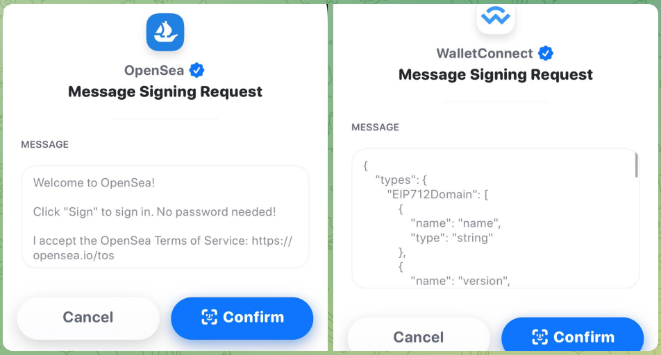

## 摘要

通过以太坊登录描述了以太坊账户如何通过签署由范围、会话详细信息和安全机制（例如，nonce）参数化的标准消息格式与链下服务进行身份验证。本规范的目标是为集中式身份提供程序提供一种自我托管的替代方案，改进基于以太坊的身份验证的链下服务之间的互操作性，并为钱包供应商提供一种一致的机器可读消息格式，以实现改进的用户体验和同意管理。

## 动机

如今，在登录流行的非区块链服务时，用户通常会使用身份提供商（IdP），这些身份提供商是集中式实体，对用户的标识符拥有最终控制权，例如，大型互联网公司和电子邮件提供商。这些参与者之间的激励措施常常不一致。对于希望对其自身数字身份承担更多控制权和责任的用户，通过以太坊登录提供了一种新的自我托管选项。

目前，许多服务已经开始支持使用消息签名来验证以太坊账户的工作流程，例如建立基于 Cookie 的 Web 会话，该会话可以管理有关身份验证地址的特权元数据。这是一个标准化登录工作流程并提高现有服务之间互操作性的机会，同时还为钱包供应商提供了一种可靠的方法来将签名请求识别为通过以太坊登录的请求，从而改善用户体验。

## 规范

本文档中的关键词“必须 (MUST)”，“禁止 (MUST NOT)”，“需要 (REQUIRED)”，“应当 (SHALL)”，“不应当 (SHALL NOT)”，“应该 (SHOULD)”，“不应该 (SHOULD NOT)”，“推荐 (RECOMMENDED)”，“不推荐 (NOT RECOMMENDED)”，“可以 (MAY)”，和“可选 (OPTIONAL)”按照 RFC 2119 和 RFC 8174 中的描述进行解释。

### 概述

通过以太坊登录（SIWE）的工作方式如下：

1. 依赖方生成一个 SIWE 消息，并在 SIWE 消息前加上 `\x19Ethereum Signed Message:\n<消息长度>`，如 [ERC-191](./eip-191.md) 中所定义。
2. 钱包向用户提供一个结构化的纯文本消息或等效界面，用于使用 [ERC-191](./eip-191.md) 签名数据格式对 SIWE 消息进行签名。
3. 然后将签名呈现给依赖方，后者检查签名的有效性和 SIWE 消息内容。
4. 依赖方可能会进一步获取与以太坊地址相关联的数据，例如来自以太坊区块链（例如，ENS，账户余额，[ERC-20](./eip-20.md)/[ERC-721](./eip-721.md)/[ERC-1155](./eip-1155.md) 资产所有权），或者可能或可能未经许可的其他数据源。

### 消息格式

#### ABNF 消息格式

SIWE 消息必须符合以下增强型巴科斯范式（ABNF，RFC 5234）表达式（请注意，根据 RFC 7405，`%s` 表示字符串术语区分大小写）。

```abnf
sign-in-with-ethereum =
    [ scheme "://" ] domain %s" wants you to sign in with your Ethereum account:" LF
    address LF
    LF
    [ statement LF ]
    LF
    %s"URI: " uri LF
    %s"Version: " version LF
    %s"Chain ID: " chain-id LF
    %s"Nonce: " nonce LF
    %s"Issued At: " issued-at
    [ LF %s"Expiration Time: " expiration-time ]
    [ LF %s"Not Before: " not-before ]
    [ LF %s"Request ID: " request-id ]
    [ LF %s"Resources:"
    resources ]

scheme = ALPHA *( ALPHA / DIGIT / "+" / "-" / "." )
    ; 有关“scheme”的完全上下文化的
    ; 定义，请参见 RFC 3986。

domain = authority
    ; 来自 RFC 3986：
    ;     authority     = [ userinfo "@" ] host [ ":" port ]
    ; 有关“authority”的完全上下文化的
    ; 定义，请参见 RFC 3986。

address = "0x" 40*40HEXDIG
    ; 还必须符合 EIP-55 中规定的
    ; 大小写校验和编码（如适用）（EOA）。

statement = *( reserved / unreserved / " " )
    ; 有关“reserved”和“unreserved”的定义，
    ; 请参见 RFC 3986。
    ; 目的是排除 LF（换行符）。

uri = URI
    ; 有关“URI”的定义，请参见 RFC 3986。

version = "1"

chain-id = 1*DIGIT
    ; 有关有效的 CHAIN_ID，请参见 EIP-155。

nonce = 8*( ALPHA / DIGIT )
    ; 有关“ALPHA”和“DIGIT”的定义，
    ; 请参见 RFC 5234。

issued-at = date-time
expiration-time = date-time
not-before = date-time
    ; 有关“date-time”的定义，
    ; 请参见 RFC 3339（ISO 8601）。

request-id = *pchar
    ; 有关“pchar”的定义，请参见 RFC 3986。

resources = *( LF resource )

resource = "- " URI
```

#### 消息字段

本规范定义了以下 SIWE 消息字段，这些字段可以通过遵循 [ABNF 消息格式](#abnf-message-format) 中的规则从 SIWE 消息中解析出来：

- `scheme` 可选。请求来源的 URI 方案。其值必须是一个 RFC 3986 URI 方案。
- `domain` 必需。请求签名的域名。其值必须是一个 RFC 3986 authority。该 authority 包括一个可选的端口。如果未指定端口，则假定使用提供的 `scheme` 的默认端口（例如，HTTPS 的 443 端口）。如果未指定 `scheme`，则默认假定使用 HTTPS。
- `address` 必需。执行签名的以太坊地址。其值应符合 [ERC-55](./eip-55.md) 中指定的大小写混合校验和地址编码（如适用）。
- `statement` 可选。用户将签署的可读 ASCII 断言，其中不得包含 `'\n'`（字节 `0x0a`）。
- `uri` 必需。一个 RFC 3986 URI，引用作为签名的主题的资源（如同_声明的主题_中一样）。
- `version` 必需。SIWE 消息的当前版本，对于本规范，该值必须为 `1`。
- `chain-id` 必需。会话绑定到的 [EIP-155](./eip-155.md) 链 ID，以及必须解析合约账户的网络。
- `nonce` 必需。一个随机字符串，通常由依赖方选择，用于防止重放攻击，至少 8 个字母数字字符。
- `issued-at` 必需。生成消息的时间，通常是当前时间。其值必须是一个 ISO 8601 日期时间字符串。
- `expiration-time` 可选。签名身份验证消息不再有效的时间。其值必须是一个 ISO 8601 日期时间字符串。
- `not-before` 可选。签名身份验证消息将变为有效的时间。其值必须是一个 ISO 8601 日期时间字符串。
- `request-id` 可选。一个系统特定的标识符，可以用于唯一地引用登录请求。
- `resources` 可选。用户希望作为依赖方身份验证的一部分进行解析的信息或信息引用的列表。每个资源必须是一个由 `"\n- "` 分隔的 RFC 3986 URI，其中 `\n` 是字节 `0x0a`。

#### 非正式消息模板

下面提供了一个类似 Bash 的完整 SIWE 消息的非正式模板，以方便阅读和理解，并且它不反映字段的允许可选性。字段描述在以下部分中提供。完整的 ABNF 描述在 [ABNF 消息格式](#abnf-message-format) 中提供。

```
${scheme}:// ${domain} wants you to sign in with your Ethereum account:
${address}

${statement}

URI: ${uri}
Version: ${version}
Chain ID: ${chain-id}
Nonce: ${nonce}
Issued At: ${issued-at}
Expiration Time: ${expiration-time}
Not Before: ${not-before}
Request ID: ${request-id}
Resources:
- ${resources[0]}
- ${resources[1]}
...
- ${resources[n]}
```

#### 示例

以下是一个带有隐式 scheme 的 SIWE 消息示例：

```
example.com wants you to sign in with your Ethereum account:
0xC02aaA39b223FE8D0A0e5C4F27eAD9083C756Cc2

I accept the ExampleOrg Terms of Service: https://example.com/tos

URI: https://example.com/login
Version: 1
Chain ID: 1
Nonce: 32891756
Issued At: 2021-09-30T16:25:24Z
Resources:
- ipfs://bafybeiemxf5abjwjbikoz4mc3a3dla6ual3jsgpdr4cjr3oz3evfyavhwq/
- https://example.com/my-web2-claim.json
```

以下是一个带有隐式 scheme 和显式端口的 SIWE 消息示例：

```
example.com:3388 wants you to sign in with your Ethereum account:
0xC02aaA39b223FE8D0A0e5C4F27eAD9083C756Cc2

I accept the ExampleOrg Terms of Service: https://example.com/tos

URI: https://example.com/login
Version: 1
Chain ID: 1
Nonce: 32891756
Issued At: 2021-09-30T16:25:24Z
Resources:
- ipfs://bafybeiemxf5abjwjbikoz4mc3a3dla6ual3jsgpdr4cjr3oz3evfyavhwq/
- https://example.com/my-web2-claim.json
```

以下是一个带有显式 scheme 的 SIWE 消息示例：

```
https://example.com wants you to sign in with your Ethereum account:
0xC02aaA39b223FE8D0A0e5C4F27eAD9083C756Cc2

I accept the ExampleOrg Terms of Service: https://example.com/tos

URI: https://example.com/login
Version: 1
Chain ID: 1
Nonce: 32891756
Issued At: 2021-09-30T16:25:24Z
Resources:
- ipfs://bafybeiemxf5abjwjbikoz4mc3a3dla6ual3jsgpdr4cjr3oz3evfyavhwq/
- https://example.com/my-web2-claim.json
```

### 使用以太坊账户签名和验证消息

- 对于外部拥有账户（EOA），必须使用 [ERC-191](./eip-191.md) 中指定的验证方法。

- 对于合约账户，
    - 应该使用 [ERC-1271](./eip-1271.md) 中指定的验证方法，如果未使用，则实现者必须明确定义验证方法，以实现钱包和依赖方的安全性和互操作性。
    - 在执行 [ERC-1271](./eip-1271.md) 签名验证时，执行验证的合约必须从指定的 `chain-id` 中解析。
    - 实现者应该考虑到 [ERC-1271](./eip-1271.md) 实现不需要是纯函数，并且可以根据区块链状态为相同的输入返回不同的结果。这会影响安全模型和会话验证规则。例如，启用了 [ERC-1271](./eip-1271.md) 签名的服务可以依赖 Webhook 来接收状态更改影响结果的通知。当它收到通知时，它会使任何匹配的会话无效。

### 解析以太坊域名服务（ENS）数据

- 依赖方或钱包还可以执行 ENS 数据的解析，因为这可以通过显示与 `address` 相关的用户友好的信息来改善用户体验。可解析的 ENS 数据包括：
    - [主 ENS 名称](./eip-181.md)。
    - ENS 头像。
    - ENS 文档中指定的任何其他可解析资源。
- 如果执行 ENS 数据的解析，则实现者应该采取预防措施以保护用户隐私和同意，因为他们的 `address` 可能会作为解析过程的一部分转发给第三方服务。

### 依赖方实施者步骤

#### 指定请求来源

- SIWE 消息中的 `domain` 和（如果存在）`scheme` 必须与发出签名请求的来源相对应。例如，如果签名请求是在嵌入在父浏览器窗口中的跨域 iframe 中发出的，则 `domain`（以及，如果存在，`scheme`）必须与 iframe 的来源匹配，而不是父级的来源。出于安全原因，这对于防止 iframe 错误地声明其祖先窗口之一的来源至关重要。此行为由符合要求的钱包强制执行。

#### 验证已签名的消息

- 必须检查 SIWE 消息是否符合前几节中的 ABNF 消息格式，在解析后检查是否符合预期值（例如，`expiration-time`、`nonce`、`request-uri` 等），并且必须按照 [使用以太坊账户签名和验证消息](#signing-and-verifying-messages-with-ethereum-accounts) 中定义的方式检查其签名。

#### 创建会话

- 会话必须绑定到 `address`，而不是绑定到其他可以更改的已解析资源。

#### 解释和解析资源

- 实施者应该确保列出的 `resources` 中的 URI 以纯文本形式表达时是用户友好的。
- SIWE 消息中列出的 `resources` 的解释不在本规范的范围之内。

### 钱包实施者步骤

#### 验证消息格式

- 必须检查完整的 SIWE 消息是否符合 [ABNF 消息格式](#abnf-message-format) 中定义的 ABNF。
- 如果子字符串 `"wants you to sign in
  with your Ethereum account"` 出现在 [ERC-191](./eip-191.md) 消息签名请求中的任何位置，除非该消息完全符合 [ABNF 消息格式](#abnf-message-format) 中定义的格式，否则钱包实施者应该警告用户。

#### 验证请求来源

- 钱包实施者必须通过根据 SIWE 消息中的 `scheme` 和 `domain` 字段验证请求的来源来防止网络钓鱼攻击。例如，当处理以 `"example.com wants you to sign in..."` 开头的 SIWE 消息时，钱包会检查该请求是否实际上来自 `https://example.com`。
- 应该从受信任的数据源（例如浏览器窗口或通过 WalletConnect（[ERC-1328](./eip-1328.md)）会话）读取来源，以便与签名消息内容进行比较。
- 如果来源指向 localhost，钱包实施者可以发出警告而不是拒绝验证。

以下是钱包符合本规范定义的请求来源验证要求的推荐算法。

该算法采用以下输入变量：

- 来自 SIWE 消息的字段。
- 签名请求的 `origin` - 在浏览器钱包实现的情况下 - 通过 provider 请求登录的页面的来源。
- `allowedSchemes` - 钱包允许的 scheme 列表。
- `defaultScheme` - 没有提供 scheme 时假设的 scheme。浏览器中的钱包实施者应该使用 `https`。
- 开发者模式指示 - 决定某些风险应该是警告而不是拒绝的设置。可以手动配置或从作为 localhost 的 `origin` 派生。

该算法描述如下：

- 如果没有提供 `scheme`，则将 `defaultScheme` 分配为 `scheme`。
- 如果 `scheme` 未包含在 `allowedSchemes` 中，则 `scheme` 是非预期的，并且钱包必须拒绝该请求。除非激活了开发者模式，否则浏览器中的钱包实施者应该将 `allowedSchemes` 列表限制为仅 `'https'`。
- 如果 `scheme` 与 `origin` 的 scheme 不匹配，则钱包应该拒绝该请求。如果激活了开发者模式，钱包实施者可以显示警告而不是拒绝该请求。在这种情况下，钱包继续处理该请求。
- 如果 `domain` 和 `origin` 的 `host` 部分不匹配，则钱包必须拒绝该请求，除非钱包处于开发者模式。在开发者模式下，钱包可以显示警告并继续处理该请求。
- 如果 `domain` 和 `origin` 具有不匹配的子域，则钱包应该拒绝该请求，除非钱包处于开发者模式。在开发者模式下，钱包可以显示警告并继续处理该请求。
- 令 `port` 为 `domain` 的端口组件，如果没有端口包含在 `domain` 中，则为 `port` 分配为 `scheme` 指定的默认端口。
- 如果 `port` 不为空，则如果 `port` 与 `origin` 的端口不匹配，钱包应该显示警告。
- 如果 `port` 为空，则如果 `origin` 包含特定端口，则钱包可以显示警告。（请注意，'https' 的默认端口为 443，因此这仅在 `allowedSchemes` 包含不寻常的 scheme 时适用）
- 返回请求来源验证完成。

#### 创建使用以太坊登录的界面

- 钱包实施者必须默认情况下在签名之前向用户显示来自 SIWE 消息请求的以下字段（如果存在）：`scheme`、`domain`、`address`、`statement` 和 `resources`。其他存在的字段也必须默认情况下或通过扩展界面在签名之前提供给用户。
- 向用户显示纯文本 SIWE 消息的钱包实现者应该要求用户在签名之前滚动到文本区域的底部。
- 钱包实现者可以通过将 ABNF 术语解析为数据元素以在界面中使用来构建自定义 SIWE 用户界面。上述显示规则仍然适用于自定义界面。

#### 支持国际化 (i18n)

- 在成功将消息解析为 ABNF 术语后，可以在 UX 级别按人类语言进行翻译。

## 原理

### 要求

编写一个关于通过以太坊登录应如何工作的规范。该规范应该简单并且通常遵循现有实践。避免功能膨胀，特别是包含那些希望通过加入规范来获得采用的、使用较少的项目。核心规范应该是去中心化的、开放的、非专有的，并且具有长期可行性。除了用户登录的应用程序已经运行的服务器之外，它不应依赖于集中式服务器。基本规范应包括：用于身份验证的以太坊账户、用于用户名的 ENS 名称（通过反向解析）以及来自 ENS 名称的文本记录的数据，以获取其他个人资料信息（例如头像、社交媒体句柄等）。

其他功能要求：

1. 在签名之前，必须向用户呈现一个人类可理解的界面，该界面主要没有面向机器的人工制品，例如 JSON blob、十六进制代码（以太坊地址除外）和 baseXX 编码的字符串。
2. 应用程序服务器必须能够为其终端实现完全可用的支持，而无需强制更改钱包。
3. 对于已经使用基于以太坊账户的签名进行身份验证的应用程序和钱包，必须有一个简单明了的升级路径。
4. 必须有充分缓解中间人 (MITM) 攻击、重放攻击和恶意签名请求的工具和指南。

### 设计目标

1. 对人类友好
2. 易于实施
3. 安全
4. 机器可读
5. 可扩展

### 技术决策

- 为什么选择 [ERC-191](./eip-191.md)（签名数据标准）而不是 [EIP-712](./eip-712.md)（以太坊类型结构化数据哈希和签名）
    - [ERC-191](./eip-191.md) 已经获得了钱包 UX 的广泛支持，而 [EIP-712](./eip-712.md) 对用户友好的显示支持仍在等待中。**(1, 2, 3, 4)**
    - [ERC-191](./eip-191.md) 易于使用签名之前的预设前缀来实现，而 [EIP-712](./eip-712.md) 的实现更为复杂，需要进一步实现定制的 Solidity 风格的类型系统、基于 RLP 的编码格式和自定义的基于 keccak 的哈希方案。**(2)**
    - [ERC-191](./eip-191.md) 生成更具人类可读性的消息，而 [EIP-712](./eip-712.md) 创建用于机器消费的签名输出，大多数钱包不以对人类友好的方式显示要签名的有效负载。**(1)**

    - [EIP-712](./eip-712.md) 具有链上表示和链上可验证性的优势，例如用于元交易中，但此功能与规范的范围无关。**(2)**
- 为什么不使用 JWT？钱包不支持 JWT。IANA 未分配 keccak 哈希函数用作 JOSE 算法。**(2, 3)**
- 为什么不使用 YAML 或带有异常的 YAML？与 ABNF 相比，YAML 比较宽松，ABNF 可以轻松地表达字符集限制、必需的排序和严格的空白。**(2, 3)**

### 超出范围

以下问题超出了本规范的版本定义范围：

- 其他不基于以太坊地址的身份验证。
- 对服务器资源的授权。
- 将 `resources` 字段中的 URI 解释为声明或其他资源。
- 确保域绑定的特定机制。
- 生成 nonce 的特定机制以及对其适当性的评估。
- 在没有 TLS 连接的情况下使用的协议。

### 向前兼容性的注意事项

以下项目被考虑在未来通过本规范的迭代或使用本规范作为依赖项的新工作项来提供支持。

- 可能支持去中心化身份标识符和可验证凭据。
- 可能的跨链支持。
- 可能的 SIOPv2 支持。
- 可能未来支持 [EIP-712](./eip-712.md)。
- 版本解释规则，例如，使用大于理解的次要版本签名，但不大于主要版本。

## 向后兼容性

- 大多数钱包实现已经支持 [ERC-191](./eip-191.md)，因此将其用作具有附加功能的基本模式。
- 从类似登录工作流程的现有实现中收集了需求，包括允许用户接受服务条款的声明、用于重放保护的 nonce 以及消息中包含以太坊地址本身。

## 参考实现

一个参考实现可在此处获得 [here](../assets/eip-4361/example.js)。

## 安全注意事项

### 标识符重用

- 为了实现完美的隐私，理想情况下，每次数字交互都应该使用一个新的不相关的标识符（例如，以太坊地址），有选择地披露所需的信息，不多也不少。
- 此问题与某些可能成为本规范早期采用者的人口统计数据不太相关，例如那些管理有意与其公开形象相关的以太坊地址和/或 ENS 名称的人。这些用户通常更喜欢标识符重用，以在许多服务中维护一个关联的身份。
- 随着主流采用，这种考虑将变得越来越重要。有几种方法可以朝着这个模型发展，例如使用 HD 钱包、签名委托和零知识证明。但是，这些方法超出了本规范的范围，更适合后续规范。

### 密钥管理

- 通过以太坊登录使用户可以通过其密钥进行控制。这是主流用户可能不习惯接受的额外责任，并且密钥管理是一个难题，尤其是对于个人而言。例如，没有像集中式身份提供商通常实现的“忘记密码”按钮。
- 本规范的早期采用者可能已经精通密钥管理，因此这种考虑随着主流采用变得更加相关。
- 某些钱包可以使用智能合约和多重签名来提供增强的用户体验，包括密钥使用和密钥恢复，并且可以通过 [ERC-1271](./eip-1271.md) 签名支持这些功能。

### 钱包和依赖方相结合的安全性

- 钱包和依赖方都必须实施此规范，以提高最终用户的安全性。具体来说，钱包必须确认 SIWE 消息是否适用于正确的请求来源，或提供用户手动执行此操作的方式（例如，指示在通过 QR 码或深层链接连接之前，以可视方式确认 TLS 保护的网站中的正确域名），否则用户将遭受网络钓鱼攻击。

### 最小化钱包和服务器交互

- 在某些钱包登录工作流程的实现中，服务器首先将 SIWE 消息的参数发送到钱包。其他方法完全在客户端（例如，dapps）中生成用于签名的 SIWE 消息。当通过最小化钱包-服务器的交互来获得用户隐私优势时，应该首选后一种没有初始服务器交互的方法。通常，后端服务器首先生成一个 `nonce` 以防止重放攻击，并在签名后对其进行验证。在下一节关于防止重放攻击中，提出了保护隐私的替代方法。
- 在钱包向用户呈现 SIWE 消息签名请求之前，它可能会咨询服务器以获取要签名的消息的正确内容，例如可接受的 `nonce` 或请求的 `resources` 集。在与服务器通信时，钱包应采取预防措施，通过尽可能减少泄露的用户信息来保护用户隐私。
- 在签名之前，钱包可以征求用户的偏好，例如从多个 `address` 中选择一个 `address`，或从多个 ENS 名称中选择首选的 ENS 名称。

### 防止重放攻击

- 应该为每个会话启动选择一个 `nonce`，该 `nonce` 具有足够的熵来防止重放攻击，在这种中间人攻击中，攻击者能够捕获用户的签名并重新发送它以为自己建立一个新会话。
- 实施者可以考虑使用保护隐私但又广泛可用的 `nonce` 值，例如从最近的以太坊区块哈希或最近的 Unix 时间戳派生的值。

### 防止网络钓鱼攻击

- 为了防止网络钓鱼攻击，钱包必须如 [验证请求来源](#verifying-the-request-origin) 中所述实施请求来源验证。

### 频道安全

- 对于基于 Web 的应用程序，所有通信都应该使用 HTTPS，以防止对消息签名进行中间人攻击。
- 当使用 HTTPS 以外的协议时，所有通信都应该受到适当技术的保护，以保持机密性、数据完整性和发送方/接收方身份验证。

### 会话失效

在某些情况下，实施者应该检查与会话相关的状态更改。

- 如果 [ERC-1271](./eip-1271.md) 实现或依赖数据更改了签名计算，则服务器应该适当地使会话失效。
- 如果 `resources` 中指定的任何资源发生更改，则服务器应该适当地使会话失效。但是，对 `resources` 的解释超出了本规范的范围。

### ABNF 术语的最大长度

- 虽然本规范不包含关于最大字符串长度的规范性要求，但实施者应该为术语选择最大长度，以在防止拒绝服务攻击、支持任意用例和用户可读性之间取得平衡。

## 版权

版权和相关权利通过 [CC0](../LICENSE.md) 放弃。