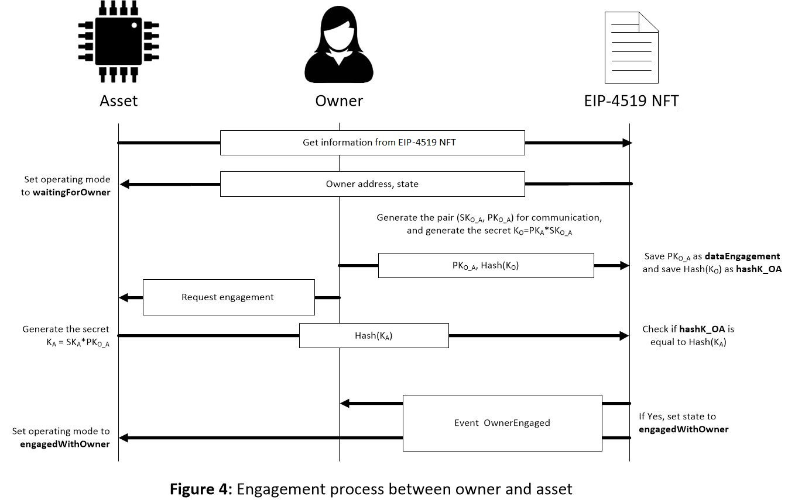
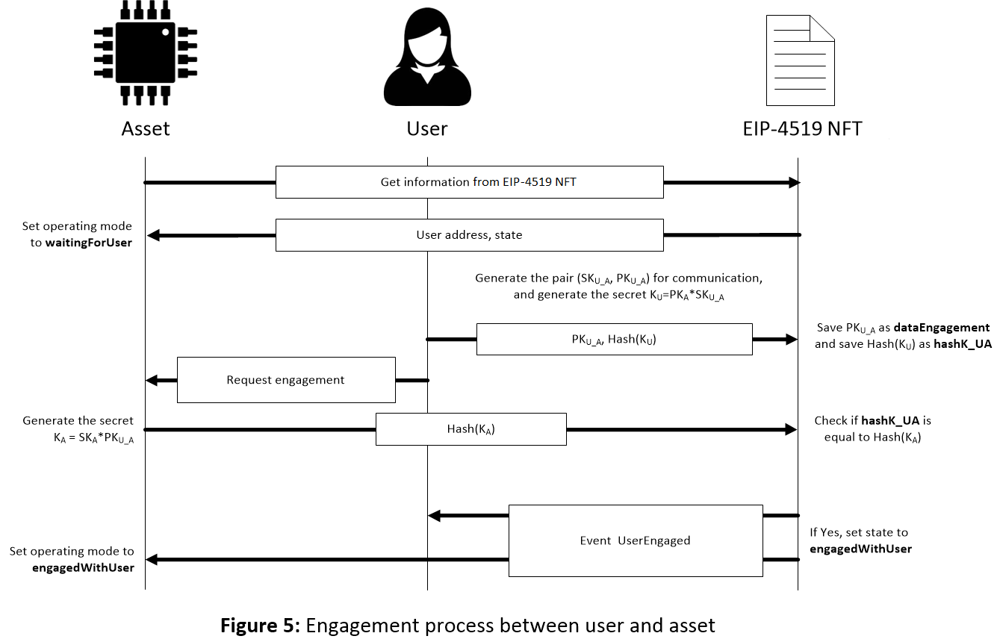

## 摘要

本 EIP 标准化了代表物理资产（如物联网 (IoT) 设备）的非同质化代币的接口。这些 NFT 与物理资产绑定，并且可以验证绑定的真实性。它们可以包括物理资产的以太坊地址，从而允许物理资产签署消息和交易。物理资产可以使用由其对应的 NFT 定义的操作模式进行操作。

## 动机

开发此标准是因为 [EIP-721](./eip-721.md) 仅跟踪所有权（而非使用权），并且不跟踪资产的以太坊地址。智能资产（如 IoT 设备）的普及率正在提高。为了允许安全和可追溯的管理，这些 NFT 可用于在物理资产、其所有者和用户之间建立安全通信通道。

## 规范

属性 `addressAsset` 和 `addressUser` 分别是物理资产和用户的以太坊地址。它们是可选属性，但至少应在 NFT 中使用其中一个。如果仅使用属性 `addressUser`，则有两种状态定义代币是否已分配给用户。 `图 1` 在流程图中显示了这些状态。创建、转移或取消分配代币时，代币状态设置为 `notAssigned`。如果代币已分配给有效用户，则状态设置为 `userAssigned`。


在定义了属性 `addressAsset` 但未定义属性 `addressUser` 的情况下，有两种状态定义代币是正在等待与所有者进行身份验证，还是身份验证已成功完成。 `图 2` 在流程图中显示了这些状态。创建代币或将其转移给新所有者时，代币会将其状态更改为 `waitingForOwner`。在此状态下，代币正在等待资产和所有者之间的相互身份验证。身份验证成功完成后，代币将其状态更改为 `engagedWithOwner`。


最后，如果同时定义了属性 `addressAsset` 和 `addressUser`，则 NFT 的状态定义资产是否已与所有者或用户建立联系（`waitingForOwner`、`engagedWithOwner`、`waitingForUser` 和 `engagedWithUser`）。 `图 3` 中的流程图显示了所有可能的状态更改。与所有者相关的状态与 `图 2` 中的状态相同。不同之处在于，在状态 `engagedWithOwner` 时，可以将代币分配给用户。如果分配了用户（代币处于状态 `engagedWithOwner`、`waitingForUser` 或 `engagedWithUser`），则代币会将其状态更改为 `waitingForUser`。资产和用户相互验证后，代币的状态设置为 `engagedWithUser`，并且用户可以使用该资产。

 

为了完成代币的所有权转移，新所有者必须使用其以太坊地址与资产执行相互身份验证过程，该过程在链下与资产进行，在链上与代币进行。同样，新用户必须与资产执行相互身份验证过程才能完成使用转移。 NFT 定义了身份验证过程如何开始和结束。这些身份验证过程允许派生新的会话加密密钥，以实现资产和所有者之间以及资产和用户之间的安全通信。因此，即使新的所有者和用户对其进行管理，也可以追溯资产的可信度。

创建 NFT 或转移所有权时，代币状态为 `waitingForOwner`。资产将其操作模式设置为 `waitingForOwner`。所有者使用椭圆曲线 secp256k1 和此曲线上使用的原始元素 P 生成一对密钥：一个私钥 SK<sub>O_A</sub> 和一个公钥 PK<sub>O_A</sub>，因此 PK<sub>O_A</sub> = SK<sub>O_A</sub> * P。为了生成所有者和资产之间的共享密钥 K<sub>O</sub>，资产的公钥 PK<sub>A</sub> 采用如下方式：

K<sub>O</sub> = PK<sub>A</sub> * SK<sub>O_A</sub>

使用函数 `startOwnerEngagement`，PK<sub>O_A</sub> 保存为属性 `dataEngagement`，K<sub>O</sub> 的哈希保存为属性 `hashK_OA`。所有者向资产发送参与请求，资产计算：

K<sub>A</sub> = SK<sub>A</sub> * PK<sub>O_A</sub>

如果一切正确完成，则 K<sub>O</sub> 和 K<sub>A</sub> 相同，因为：

K<sub>O</sub> = PK<sub>A</sub> * SK<sub>O_A</sub> = (SK<sub>A</sub> * P) * SK<sub>O_A</sub> = SK<sub>A</sub> * (SK<sub>O_A</sub> * P) = SK<sub>A</sub> * PK<sub>O_A</sub>

使用函数 `ownerEngagement`，资产发送 K<sub>A</sub> 的哈希，如果它与 `hashK_OA` 中的数据相同，则代币的状态更改为 `engagedWithOwner` 并且发送事件 `OwnerEngaged`。资产收到事件后，将其操作模式更改为 `engagedWithOwner`。此过程如 `图 4` 所示。从那时起，资产可以由所有者管理，并且他们可以使用共享密钥以安全的方式进行通信。

 

如果资产查询以太坊，并且其 NFT 的状态为 `waitingForUser`，则资产（假设它是电子物理资产）将其操作模式设置为 `waitingForUser`。然后，与用户执行相互身份验证过程，就像与所有者已经完成的那样。用户发送与函数 `startUserEngagement` 关联的交易。与 `startOwnerEngagement` 中一样，此函数将用户生成的公钥 PK<sub>U_A</sub> 保存为属性 `dataEngagement`，并将 K<sub>U</sub> = PK<sub>A</sub> * SK<sub>U_A</sub> 的哈希保存为 NFT 中的属性 `hashK_UA`。

用户发送参与请求，资产计算：

K<sub>A</sub> = SK<sub>A</sub> * PK<sub>U_A</sub>

如果一切正确完成，则 K<sub>U</sub> 和 K<sub>A</sub> 相同，因为：

K<sub>U</sub> = PK<sub>A</sub> * SK<sub>U_A</sub> = (SK<sub>A</sub> * P) * SK<sub>U_A</sub> = SK<sub>A</sub> * (SK<sub>U_A</sub> * P) = SK<sub>A</sub> * PK<sub>U_A</sub>

使用函数 `userEngagement`，资产发送获得的 K<sub>A</sub> 的哈希，如果它与 `hashK_UA` 中的数据相同，则代币的状态更改为 `engagedWithUser` 并且发送事件 `UserEngaged`。资产收到事件后，将其操作模式更改为 `engagedWithUser`。此过程如 `图 5` 所示。从那时起，资产可以由用户管理，并且他们可以使用共享密钥以安全的方式进行通信。

 

由于建立共享密钥对于安全通信非常重要，因此 NFT 包括属性 `hashK_OA`、`hashK_UA` 和 `dataEngagement`。前两个属性分别定义资产与其所有者之间以及资产与其用户之间共享的密钥的哈希。资产、所有者和用户应检查它们是否正在使用正确的共享密钥。属性 `dataEngagement` 定义协议所需的公共数据。

```solidity
pragma solidity ^0.8.0;
 /// @title EIP-4519 NFT: 对 EIP-721 非同质化代币标准的扩展。
///  注意：此接口的 EIP-165 标识符为 0x8a68abe3
 interface EIP-4519 NFT is EIP721/*,EIP165*/{
    /// @dev 当 NFT 被分配为新用户的实用程序时，会发出此事件。
    ///  当令牌的用户更改时，会发出此事件。
    ///  （`_addressUser` == 0）当未分配用户时。
    event UserAssigned(uint256 indexed tokenId, address indexed _addressUser);
    
    /// @dev 当用户和资产成功完成相互身份验证过程时，会发出此事件。
    ///  当用户和资产都证明它们共享安全通信通道时，会发出此事件。
    event UserEngaged(uint256 indexed tokenId);
    
    /// @dev 当所有者和资产成功完成相互身份验证过程时，会发出此事件。
    ///  当所有者和资产都证明它们共享安全通信通道时，会发出此事件。
    event OwnerEngaged(uint256 indexed tokenId);
    
    /// @dev 当检查到超时已过期时，会发出此事件。
    ///  当 EIP-4519 NFT 的时间戳未在超时内更新时，会发出此事件。
    event TimeoutAlarm(uint256 indexed tokenId);
    /// @notice 此函数定义了如何将 NFT 分配为新用户的实用程序（如果定义了“addressUser”）。
    /// @dev 只有 EIP-4519 NFT 的所有者才能分配用户。如果定义了“addressAsset”，则令牌的状态必须为
    /// "engagedWithOwner"、"waitingForUser" 或 "engagedWithUser"，并且此函数将由 "_tokenId" 定义的令牌的状态更改为
    /// "waitingForUser"。如果未定义“addressAsset”，则状态设置为“userAssigned”。在这两种情况下，此函数都将参数
    /// "addressUser" 设置为 "_addressUser"。
    /// @param _tokenId 是与资产绑定的 EIP-4519 NFT 的 tokenId。
    /// @param _addressUser 是新用户的地址。
    function setUser(uint256 _tokenId, address _addressUser) external payable; 
    /// @notice 此函数定义了所有者和资产之间的相互身份验证过程的初始化。
    /// @dev 只有令牌的所有者才能启动此身份验证过程（如果定义了“addressAsset”且令牌的状态为“waitingForOwner”）。
    /// 该函数不会更改令牌的状态，并将“_dataEngagement”
    /// 和“_hashK_OA”保存在令牌的参数中。
    /// @param _tokenId 是与资产绑定的 EIP-4519 NFT 的 tokenId。
    /// @param _dataEngagement 是所有者为共享密钥的协议提出的公共数据。
    /// @param _hashK_OA 是所有者提出的与资产共享的密钥的哈希。
    function startOwnerEngagement(uint256 _tokenId, uint256 _dataEngagement, uint256 _hashK_OA) external payable;
 
    /// @notice 此函数完成所有者和资产之间的相互身份验证过程。
    /// @dev 只有与令牌绑定的资产才能完成此身份验证过程，前提是令牌的状态为 
    /// "waitingForOwner" 且 dataEngagement 与 0 不同。此函数比较保存在
    /// 令牌中的 hashK_OA 与 hashK_A。如果它们相等，则令牌的状态更改为“engagedWithOwner”，dataEngagement 设置为 0，
    /// 并发出事件“OwnerEngaged”。
    /// @param _hashK_A 是资产生成的与所有者共享的密钥的哈希。
    function ownerEngagement(uint256 _hashK_A) external payable; 
 
    /// @notice 此函数定义了用户和资产之间的相互身份验证过程的初始化。
    /// @dev 只有令牌的用户才能启动此身份验证过程（如果定义了“addressAsset”和“addressUser”且
    /// 令牌的状态为“waitingForUser”）。该函数不会更改令牌的状态，并将“_dataEngagement”
    /// 和“_hashK_UA”保存在令牌的参数中。
    /// @param _tokenId 是与资产绑定的 EIP-4519 NFT 的 tokenId。
    /// @param _dataEngagement 是用户为共享密钥的协议提出的公共数据。
    /// @param _hashK_UA 是用户提出的与资产共享的密钥的哈希。
    function startUserEngagement(uint256 _tokenId, uint256 _dataEngagement, uint256 _hashK_UA) external payable;
    
    /// @notice 此函数完成用户和资产之间的相互身份验证过程。
    /// @dev 只有与令牌绑定的资产才能完成此身份验证过程，前提是令牌的状态为 
    /// "waitingForUser" 且 dataEngagement 与 0 不同。此函数比较保存在
    /// 令牌中的 hashK_UA 与 hashK_A。如果它们相等，则令牌的状态更改为“engagedWithUser”，dataEngagement 设置为 0，
    /// 并发出事件“UserEngaged”。
    /// @param _hashK_A 是资产生成的与用户共享的密钥的哈希。
    function userEngagement(uint256 _hashK_A) external payable; 
 
    /// @notice 此函数检查超时是否已过期。
    /// @dev 任何人都可以调用此函数来检查超时是否已过期。如果超时已过期，则会发出事件“TimeoutAlarm”。
    /// @param _tokenId 是与资产绑定的 EIP-4519 NFT 的 tokenId。
    /// @return 如果超时已过期，则为 true，否则为 false。
    function checkTimeout(uint256 _tokenId) external returns (bool);
    
    /// @notice 此函数设置超时的值。
    /// @dev 只有令牌的所有者才能设置此值，前提是令牌的状态为“engagedWithOwner”、
    /// "waitingForUser" 或 "engagedWithUser"。
    /// @param _tokenId 是与资产绑定的 EIP-4519 NFT 的 tokenId。
    /// @param _timeout 是要分配给超时的值。
    function setTimeout(uint256 _tokenId, uint256 _timeout) external; 
    
    /// @notice 此函数更新时间戳，从而避免超时警报。
    /// @dev 只有与令牌绑定的资产才能更新其自己的时间戳。
    function updateTimestamp() external; 
    
    /// @notice 此函数允许从地址获取 tokenId。
    /// @dev 任何人都可以调用此函数。执行的代码仅从以太坊读取。
    /// @param _addressAsset 是要从中获取 tokenId 的地址。
    /// @return 与生成 _addressAsset 的资产绑定的令牌的 tokenId。
    function tokenFromBCA(address _addressAsset) external view returns (uint256);
    
    /// @notice 此函数允许从与令牌绑定的资产的地址了解令牌的所有者。
    /// @dev 任何人都可以调用此函数。执行的代码仅从以太坊读取。
    /// @param _addressAsset 是要从中获取所有者的地址。
    /// @return 绑定到生成 _addressAsset 的资产的令牌的所有者。
    function ownerOfFromBCA(address _addressAsset) external view returns (address);
    
    /// @notice 此函数允许从其 tokenId 了解令牌的用户。
    /// @dev 任何人都可以调用此函数。执行的代码仅从以太坊读取。
    /// @param _tokenId 是与资产绑定的 EIP-4519 NFT 的 tokenId。
    /// @return 来自其 _tokenId 的令牌的用户。
    function userOf(uint256 _tokenId) external view returns (address);
    
    /// @notice 此函数允许从与令牌绑定的资产的地址了解令牌的用户。
    /// @dev 任何人都可以调用此函数。执行的代码仅从以太坊读取。
    /// @param _addressAsset 是要从中获取用户的地址。
    /// @return 与生成 _addressAsset 的资产绑定的令牌的用户。
    function userOfFromBCA(address _addressAsset) external view returns (address);
    
    /// @notice 此函数允许了解分配给用户的令牌数量。
    /// @dev 任何人都可以调用此函数。执行的代码仅从以太坊读取。
    /// @param _addressUser 是用户的地址。
    /// @return 分配给用户的令牌数量。
    function userBalanceOf(address _addressUser) external view returns (uint256);
    
    /// @notice 此函数允许了解特定所有者的多少个令牌分配给用户。
    /// @dev 任何人都可以调用此函数。执行的代码仅从以太坊读取。
    /// @param _addressUser 是用户的地址。
    /// @param _addressOwner 是所有者的地址。
    /// @return 从所有者分配给用户的令牌数量。
    function userBalanceOfAnOwner(address _addressUser, address _addressOwner) external view returns (uint256);
}
```
 
## 理由

### 身份验证

本 EIP 使用智能合约来验证相互身份验证过程，因为智能合约是无需信任的。

### 绑定时间

此 EIP 建议包括属性 timestamp（用于在以太坊中注册物理资产上次检查与其令牌的绑定的时间）和属性 timeout（用于注册为物理资产再次证明绑定而建立的最大延迟时间）。这些属性避免了恶意所有者或用户可以无休止地使用该资产。

当资产调用 `updateTimestamp` 时，智能合约必须调用 `block.timestamp`，该函数提供自 Unix 纪元以来的当前区块时间戳（以秒为单位）。因此，必须以秒为单位提供 `timeout`。

### 基于 EIP-721

[EIP-721](./eip-721.md) 是最常用的通用 NFT 标准。此 EIP 扩展了 EIP-721 以实现向后兼容性。
  
## 向后兼容性

此标准是 EIP-721 的扩展。它与 EIP-721 标准中提到的两个常用可选扩展（`IERC721Metadata` 和 `IERC721Enumerable`）完全兼容。

## 测试用例

下面所示的论文中提供的测试用例可在此处获得 [here](../assets/eip-4519/PoC_SmartNFT/README.md)。

## 参考实现

第一个版本发表在 **MDPI** 编辑部的 **Sensors** 杂志的特刊 **新计算环境中的安全、信任和隐私** 上。该论文题为[通过使用 PUF 将物联网设备物理绑定到智能非同质化代币来安全地结合物联网和区块链](../assets/eip-4519/sensors-21-03119.pdf)，由本 EIP 的同一作者撰写。

## 安全考虑

在此 EIP 中，提出了一个用于创建与物理资产绑定的非同质化代币的通用系统。提供了基于当前 EIP-721 NFT 改进的通用观点，例如用户管理机制的实施，这不会影响代币的所有权。物理资产应能够以完全随机的方式从自身生成以太坊地址，以便只有该资产能够知道从中生成以太坊地址的秘密。通过这种方式，避免了身份盗用，并且可以证明该资产是完全真实的。为了确保这一点，建议只有资产的制造商才能创建其关联的令牌。对于 IoT 设备，设备固件将无法共享和修改秘密。建议资产从非敏感信息（例如与物理不可克隆函数 (PUF) 关联的辅助数据）重建其秘密，而不是存储秘密。虽然已经提出了一种基于椭圆曲线的安全密钥交换协议，但该令牌可以与其他类型的密钥交换共存。

## 版权

版权和相关权利通过 [CC0](../LICENSE.md) 放弃。