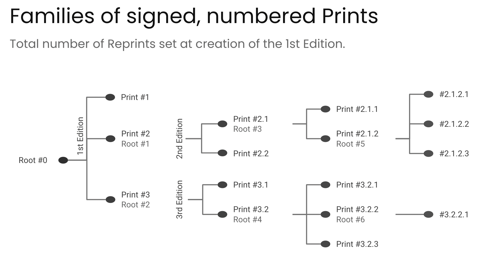
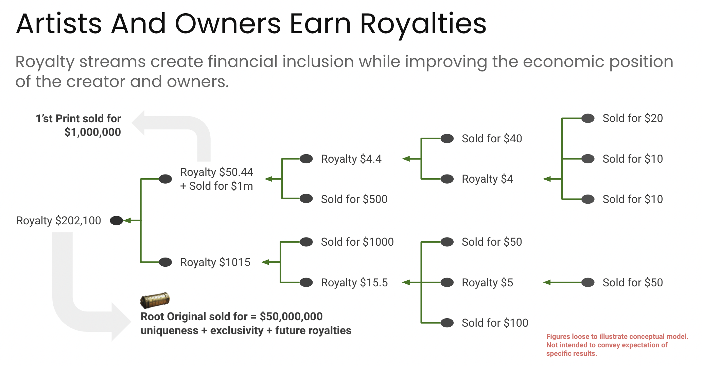

## 摘要

该提案通过扩展 [ERC-721](./eip-721.md) 标准的智能合约架构，将 NFT 和版税直接连接起来，旨在防止中心机构操纵或规避向合法权利人的付款。

该提案基于 OpenZeppelin 智能合约工具箱架构构建，并对其进行扩展，以包括版税账户管理 (CRUD)、版税余额和支付管理、简单的交易功能——挂单/撤单/购买——以及追踪交易所交易的能力。版税管理功能允许建立分层版税结构，本文中称之为版税树，通过将“父”NFT 逻辑连接到其“子”NFT，并递归地使 NFT“子”NFT 能够拥有更多子 NFT。

## 动机

版税管理是一个由来已久的问题，其特点是合同复杂、管理不透明、存在大量欺骗和欺诈。

对于版税层级结构而言，上述情况尤其如此，在这种结构中，一个或多个资产是从原始资产派生出来的，例如原始绘画作品的印刷品，或者一首歌被用于创作另一首歌，或者通过一系列附属机构管理发行权和报酬。

在下面的示例中，创作原始作品的艺术家有资格从印刷品的每次销售和转售中获得收益。



下图展示了利用上述“血统概念”的分层版税的基本概念。



为了解决复杂的继承问题，本提案将深度为 N 的层级树的递归问题分解为 N 个单独的问题，每个层对应一个问题。这使我们能够从最低层向上遍历树到其根，从而实现最有效的遍历。

这为创作者以及从原创作品中衍生出来的艺术品的发行者提供了从创作过程中获得被动收入的机会，从而提高了 NFT 的价值，因为它不仅具有内在价值，还附带了现金流。

## 规范

本文档中的关键词“必须 (MUST)”、“禁止 (MUST NOT)”、“必需 (REQUIRED)”、“应该 (SHALL)”、“不应该 (SHALL NOT)”、“推荐 (RECOMMENDED)”、“可以 (MAY)”和“可选 (OPTIONAL)”应按照 RFC 2119 中的描述进行解释。

### 概述

本提案引入了几个新概念作为 ERC-721 标准的扩展，需要进行解释：

* **版税账户 (RA)**
    * 版税账户通过其 `tokenId` 附加到每个 NFT，由几个子账户组成，这些子账户可以是个人账户或其他 RA。版税账户由账户标识符标识。
* **账户类型**
    * 这指定了 RA 子账户是否属于个人（用户）或另一个 RA。如果存在另一个 RA 作为 RA 子账户，则必须将分配的余额重新分配给构成被引用 RA 的子账户。
* **版税分配**
    * 每个子账户根据与RA关联的NFT的销售额获得的百分比
* **版税余额**
    * 与 RA 关联的版税余额
* **子账户版税余额**
    * 与每个 RA 子账户关联的版税余额。请注意，只有个人账户才能拥有可以支付的余额。这意味着如果 RA 子账户是一个 RA，则其最终子账户余额必须为零，因为所有 RA 余额必须分配给个人账户。
* **Token 类型**
    * Token 类型可以是 ETH 或支持的实用代币的符号，例如 `DAI`
* **资产 ID**
    * 这是 RA 所属的 `tokenId`。
* **父级**
    * 这表明哪个 `tokenId` 是 RA 所属的 `tokenId` 的直接父级。

下面概述了本文档要求涵盖的数据结构和功能（不具有规范性）。

#### 数据结构

为了创建将 NFT 链接到 RA 的互连数据结构，需要某些全局数据结构：

* 版税账户和关联的版税子账户，以建立具有子账户的版税账户的概念。
* 将 `tokenId` 链接到版税账户标识符。
* 一种映射父子 NFT 关系的数据结构。
* Token 类型列表和上次验证的余额（用于交易和版税支付目的）
* `executePayment` 函数中要进行的注册支付以及 `safeTransferFrom` 中验证的支付列表。这已经足够了，因为一旦在 `safeTransferFrom` 函数中收到并分配了付款，该付款将从列表中删除。
* 要出售的 NFT 列表

#### 版税账户函数

版税账户 RUD（读取-更新-删除）函数的定义和接口。由于 RA 是在铸造函数中创建的，因此无需单独创建一个函数来创建版税帐户。

#### 铸造具有版税的 NFT

当 NFT 被铸造时，必须创建一个 RA 并将其与 NFT 和 NFT 所有者关联，如果存在祖先，则与祖先的 RA 关联。为此，规范在新定义的 `mint` 函数中使用了 `_safemint` 函数，并对输入变量应用了各种业务规则。

#### 挂单出售 NFT 和移除挂单

授权用户地址可以列出 NFT 进行非交易所中介的 NFT 购买。

#### 从买方到卖方的付款功能

为了避免规避版税，买方将始终直接向 NFT 合同付款，而不是向卖方付款。卖方通过版税分配获得报酬，并且可以稍后请求支付。

支付过程取决于是以 ETH 还是以 [ERC-20](./eip-20.md) 代币接收付款：

* ERC-20 代币
    1. 买方必须针对购买价格 `payment` 批准 NFT 合同，以用于所选的支付代币（ERC-20 合同地址）。
    2. 对于 ERC-20 支付代币，买方必须在 NFT 合同中调用 `executePayment` —— ERC-20 不直接参与。
* 对于非 ERC-20 支付，买方必须将协议代币 (ETH) 发送到 NFT 合同，并且需要将 `msg.data` 编码为购买的 NFT 数组 `uint256[] tokenId`。

#### 修改后的 NFT 转移函数，包括分配版税所需的交易数据

输入参数必须满足 NFT 在正确分配版税后才能转移的几个要求。此外，还考虑了一次转移多个代币的能力。

该提案定义：

* 输入参数验证
* 支付参数验证
* 分配版税
* 使用支付更新版税账户所有权
* 转移 NFT 的所有权
* 在成功转移后删除 `registeredPayment` 中的付款条目

最后，分配版税的方法是将相互连接的版税账户的层级结构分解为各个层，然后一次处理一层，其中代币及其祖先之间的每个关系都用于遍历版税账户链，直到到达根祖先和关联的 RA。

#### 向 NFT 所有者支付版税——`safeTransferFrom` 函数中的 `from` 地址

这是该提案的最后一部分。

支付函数有两个版本——`public` 函数和 `internal` 函数。

公共函数具有以下接口：

```
function royaltyPayOut (uint256 tokenId, address RAsubaccount, address payable payoutAccount, uint256 amount) public virtual nonReentrant returns (bool)
```

这里我们只需要 `tokenId`，RA 子帐户地址 `_RAsubaccount`（即 `owner`）以及要支付的金额 `_amount`。请注意，该函数具有 `nonReentrant` 修改器保护，因为资金正在被支付。

要最终发送支付款，需要执行以下步骤：

* 基于 `RAaccount` 和 `subaccountPos` 找到 RA 子帐户，并提取余额
* 从子帐户中提取 `tokenType`
* 根据 Token 类型，发送支付款（不超过可用余额）

### 数据结构

#### 版税账户和版税子账户

为了创建一个将 NFT 链接到 RA 的互连数据结构，该数据结构需要进行搜索优化，需要对 ERC-721 的全局数据结构进行以下补充。

请注意，版税帐户被定义为链接到元帐户的版税子帐户的集合。此元帐户由 NFT 特有的常规帐户标识符组成，例如资产标识符、父标识符等。

<a name="r1">**[R1]**</a> *一个或多个版税子帐户必须链接到版税帐户。*

<a name="r2">**[R2]**</a> *版税帐户的帐户标识符 `raAccountId` 必须是唯一的。*

<a name="r3">**[R3]**</a> *NFT 的 `tokenId` 必须链接到 `raAccountID`，以便将 `raAccountId` 连接到 `tokenId`。*

#### 印刷品（子）NFT

用于管理父子 NFT 关系以及 NFT（家族）树的每个级别的约束（例如，允许的子节点数量，NFT 父节点必须链接到其直接 NFT 子节点）的要求集如下。

<a name="r4">**[R4]**</a> *必须存在直接父子关系的链接*

#### NFT 支付 Token

为了捕获版税，NFT 合同必须参与 NFT 交易。因此，NFT 合同需要了解 NFT 支付，而 NFT 支付又要求 NFT 合同了解哪些 Token 可以用于交易。

<a name="r5">**[R5]**</a> *必须存在支持的 Token 类型列表*

由于 NFT 合同管理版税分配和支付以及销售，因此它需要跟踪合同拥有的允许的 Token 类型的最后一次可用余额。

<a name="r6">**[R6]**</a> *合同中允许的 Token 类型的最后一次验证的余额必须链接到相应的允许的 Token 合同。*

#### NFT 挂单和付款

由于该合同直接参与销售过程，因此需要具备一个或多个 NFT 出售的能力。

<a name="r7">**[R7]**</a> *必须存在 NFT 出售列表。*

<a name="r8">**[R8]**</a> *销售列表必须具有唯一的标识符。*

除了挂单之外，合同还需要管理销售。这需要能够注册付款，以便立即执行或以后付款，例如在拍卖情况下。

<a name="r9">**[R9]**</a> *必须存在注册付款列表*

<a name="r10">**[R10]**</a> *注册付款必须具有唯一的标识符。*

#### 合同构造函数和全局变量及其更新函数

该标准扩展了当前的 ERC-721 构造函数，并添加了几个全局变量，以表彰 NFT 创建者的特殊角色，以及合同现在直接参与管理销售和版税的事实。

<a name="r11">**[R11]**</a> *最小合同构造函数必须包含以下输入元素。*

```
///
/// @dev 合同构造函数的定义
///
/// @param name 就像在 ERC-721 中一样
/// @param symbol 就像在 ERC-721 中一样
/// @param baseTokenURI 就像在 ERC-721 中一样
/// @param allowedTokenTypes 是允许用于付款的 Token 数组

constructor(
        string memory name,
        string memory symbol,
        string memory baseTokenURI,
        address[] memory allowedTokenTypes
    ) ERC721(name, symbol) {...}
```

### 版税账户管理

以下是版税账户 RUD（读取-更新-删除）函数的定义和接口。由于版税账户是在 NFT 铸造函数中创建的，因此无需单独创建一个函数来创建版税账户。

#### 获取版税账户

只需要一个 get 函数，因为可以通过版税帐户的 `ancestry` 字段中的 `tokenId` 来检索版税帐户及其子帐户。

<a name="r12">**[R12]**</a> *`getRoyaltyAccount` 函数接口必须遵守以下定义：*

```
/// @dev 用于获取给定 tokenId 的版税帐户的函数
/// @param tokenId 是 NFT 的标识符，该 NFT 附加了版税帐户
/// @param RoyaltyAccount 是一个包含版税帐户信息的数据结构
/// @param RASubAccount[] 是一个数据结构数组，其中包含与版税帐户关联的版税子帐户的信息

function getRoyaltyAccount (uint256 tokenId) public view virtual returns (address,
            RoyaltyAccount memory,
            RASubAccount[] memory);
```

<a name="r13">**[R13]**</a> *必须在 `getRoyaltyAccount` 函数中强制执行以下业务规则：*

* *`tokenId` 存在且未被烧毁*

#### 更新版税账户

为了更新版税账户，调用者必须同时拥有 'tokenId' 和 `RoyaltyAccount` 本身，可以从版税账户 getter 函数中获取。

<a name="r14">**[R14]**</a> *`updateRoyaltyAccount` 函数接口必须遵守以下定义：*

```
/// @dev 用于更新版税帐户及其子帐户的函数
/// @param tokenId 是 NFT 的标识符，该 NFT 附加了要更新的版税帐户
/// @param RoyaltyAccount 是具有更新值的版税帐户及其关联的版税子帐户

function updateRoyaltyAccount (uint256 _tokenId, `RoyaltyAccount memory _raAccount) public virtual returns (bool)
```

版税帐户的更新功能虽然简单，但也非常微妙。为了避免复杂的变更控制规则（例如多重签名规则），版税帐户的更改保持简单。

<a name="r15">**[R15]**</a> *更新功能的业务规则如下：*

1. *NFT 的资产标识符不得更改。*
2. *NFT 的祖先不得更新。*
3. *NFT 接受的支付 Token 类型不得更新。*
4. *版税子帐户中的版税余额不得更改。*
5. *子节点从 NFT 父节点继承的版税分配不得更改。*
6. *新的版税分配值必须大于或小于或等于版税分配的任何已建立的边界值（如果存在）。*
7. *现有版税子帐户的数量加上要添加的新版税子帐户的数量必须小于或等于已建立的边界值（如果存在）。*
8. *所有现有和新的版税子帐户的所有版税分配的总和必须始终等于 1 或其等效的数值。*
9. *'msg.sender` 必须等于要修改的版税帐户的版税子帐户中的帐户标识符，并且该版税子帐户必须标识为不属于父 NFT*

    9.1 *属于帐户标识符的子帐户不得删除*

    9.2 *版税分配只能减少，并且现有子帐户的版税分配必须相应增加，以使所有版税分配的总和保持等于 1 或其数值等效值，或者必须根据规则 10 添加一个或多个新的版税子帐户。*

    9.3 *版税余额不得更改*

    9.4 *帐户标识符不得为 NULL*

10. *如果 `msg.sender` 等于其中一个并非父 NFT 的子帐户所有者的帐户标识符，则可以添加其他版税子帐户*

    10.1 *如果属于 `msg.sender` 的版税子帐户的版税分配减少*

    * 则每个新版税子帐户中的版税余额必须为零

    * 并且新版税分配数据的总和必须等于 `msg.sender` 的版税子帐户在修改之前的版税分配

    10.2 *新的帐户标识符不得为 NULL*

11. *如果版税帐户更新正确，则该函数返回 `true`，否则返回 `false`。*

#### 删除版税帐户

虽然有时删除版税帐户是必要的，甚至是方便的，但就 Gas 而言，这是一个非常昂贵的函数，除非您绝对确定满足下面列出的条件，否则不应使用它。

<a name="r16">**[R16]**</a> *`deleteRoyaltyAccount` 函数接口必须遵守以下定义：*

```
/// @dev 用于删除版税帐户的函数
/// @param tokenId 是 NFT 的标识符，该 NFT 附加了要更新的版税帐户

function deleteRoyaltyAccount (uint256 _tokenId) public virtual returns (bool)
```

<a name="r17">**[R17]**</a> *此函数的业务规则如下：*

* *`_tokenId` 必须被烧毁，即所有者为 `address(0)`。*
* *所有与 `_tokenId` 有关的族谱中的 `tokenId` 数字（无论是祖先还是后代）也必须被烧毁。*
* *版税子帐户中的所有余额必须为零。*

### NFT 铸造

除了建立支持约束（例如 NFT 可以拥有的最大子节点数）的 NFT Token 特定数据结构之外，我们还需要在铸造期间添加一个带有版税子帐户的版税帐户。

<a name="r18">**[R18]**</a> *当铸造新的 NFT 时，必须创建一个包含一个或多个版税子帐户的版税帐户，并将其与 NFT 和 NFT 所有者关联，如果存在祖先，则与祖先的版税帐户关联。*

为此，规范在新定义的 `mint` 函数中使用了 ERC-721 `_safemint` 函数，并对函数的输入变量应用了各种业务规则。

<a name="d1">**[D1]**</a> *请注意，`mint` 函数应该能够一次铸造多个 NFT。*

<a name="r19">**[R19]**</a> *另请注意，新 NFT 的 `owner` 必须是 NFT 合同本身。*

<a name="r20">**[R20]**</a> *NFT 的非合同所有者必须设置为 `isApproved`，这允许非合同所有者像 `owner` 一样运行。*

上述两个要求中的这种奇怪的选择是必要的，因为 NFT 合同充当付款和版税的托管，因此需要能够跟踪从买方收到的付款和应付给接收方的版税，并将它们与有效的 `tokenId` 相关联。

<a name="r21">**[R21]**</a> *为了输入的紧凑性，并且由于 Token 元数据可能因 Token 而异，因此必须存在一个包含以下内容的最小数据结构：*

```
/// @param parent 是（子）Token 的父 tokenId，如果设置为 0，则没有父节点。
/// @param canBeParent 指示 tokenId 是否可以有子节点。
/// @param maxChildren 定义 NFT 可以拥有的子节点数。
/// @param royaltySplitForItsChildren 是子节点必须支付给其父节点的版税百分比。
/// @param uri 是 NFT 的唯一 Token URI
```

<a name="r22">**[R22]**</a> *`mint` 函数接口必须遵守以下定义：*

```
/// @dev 函数使用与 `to` 地址相关的版税所需的其相关元数据以及带有其关联元数据的版税帐户创建一个或多个新的 NFT。tokenId(s) 将自动分配（并在发出的 {IERC-721-Transfer} 事件中可用）。
/// @param to 是 NFT(s) 要铸造到的地址
/// @param nfttoken 是 NFTToken 结构类型的数组，用于已铸造的 NFT(s) 的元数据
/// @param tokenType 是 NFT 允许的支付 Token 类型

function mint(address to, NFTToken[] memory nfttoken, address tokenType) public virtual
```

<a name="r23">**[R23]**</a> *必须满足 `mint` 函数输入数据的以下业务规则：*

* *要铸造的 Token 数量不得为零。*
* *`msg.sender` 必须具有 `MINTER_ROLE` 或 `CREATOR_Role`，以识别第一个 NFT 的创建者。*
* *`to` 地址不得为零地址。*
* *`to` 地址不得为合同，除非已将其列入白名单——有关更多详细信息，请参见[安全注意事项](#security-considerations)。*
* *`tokenType` 必须是合同支持的 Token 类型。*
* *`royaltySplitForItsChildren` 必须小于或等于 100% 或其数值等效值减去任何约束（例如平台费用）*
* *如果新的 NFT(s) 不能有子节点，则 `royaltySplitForItsChildren` 必须为零。*
* *如果新的 NFT(s) 有父节点，则父 NFT `tokenId` 必须存在。*
* *如果指定了，则父节点的血统级别必须小于允许的最大 NFT 代数。*
* *如果要铸造的 NFT 允许的子节点数量必须小于允许的最大子节点数量（如果已指定）。*

### 为直接销售挂单和撤单 NFT

在销售过程中，我们需要最少区分两种类型的交易

* 交易所中介的销售
* 直接销售

第一种类型的交易不需要智能合约知道销售列表，因为交易所合同将直接与作为所有者的 NFT 合同触发付款和转移交易。但是，对于后一种交易类型，这是必不可少的，因为直接销售需要由智能合约在每个步骤进行中介。

<a name="r24">**[R24]**</a> *对于直接销售，NFT 挂单、撤单，交易必须通过 NFT 智能合约执行。*

当本文档讨论付款时，将讨论交易所中介的销售。

在直接销售中，授权用户地址可以列出 NFT 以供出售，请参阅下面的业务规则。

<a name="r25">**[R25]**</a> *`listNFT` 函数接口必须遵守以下定义：*

```
/// @dev 用于为直接销售挂单一个或多个 NFT 的函数
/// @param tokenIds 是要包含在挂单中的 tokenIds 数组
/// @param price 是所有者为挂单的 NFT(s) 设置的价格
/// @param tokenType 是挂单允许的支付 Token 类型

function listNFT (uint256[] calldata tokenIds, uint256 price, address tokenType) public virtual returns (bool)
```

布尔返回值 `true` 表示函数成功执行，`false` 表示函数未成功执行。

<a name="r26">**[R26]**</a> *`listNFT` 函数的业务规则如下：*

* 在提议的挂单的 `listedNFT` 映射中，不得已有针对一个或多个 NFT 的挂单。
* 对于提议的挂单中的所有 NFT，`seller` 必须等于 `getApproved(tokenId[i])`。
* 智能合约必须支持 `tokenType`。
* `price` 必须大于 `0`。

<a name="r27">**[R27]**</a> *如果满足 [**[R26]**](#r26) 中的条件，则必须更新 NFT 销售列表。*

授权用户地址也可以删除 NFT 的直接销售列表。

<a name="r28">**[R28]**</a> *`removeNFTListing` 函数接口必须遵守以下定义：*

```
/// @dev 用于取消挂单一个或多个 NFT 以进行直接销售的函数
/// @param listingId 是 NFT 挂单的标识符

function removeNFTListing (uint256 listingId) public virtual returns (bool)
```

布尔返回值 `true` 表示函数成功执行，`false` 表示函数未成功执行。

<a name="r29">**[R29]**</a> *必须遵守下面的 `removeNFTListing` 函数的业务规则：*

* *注册的支付条目必须为 NULL*
* *对于 NFT 挂单，`msg.sender = getApproved(tokenId)`*

<a name="r30">**[R30]**</a> *如果满足 [**[R29]**](#r29) 中的条件，则必须删除 NFT 销售列表。*

### NFT 销售付款

如前所述，买方将始终直接向 NFT 合同付款，而不是向卖方付款。卖方通过版税分配获得报酬，并且可以稍后请求支付到其钱包。

<a name="r31">**[R31]**</a> *付款流程需要一个或两个步骤：*

1. *对于 ERC-20 Token*
    * *买方必须针对购买价格 `payment` 批准 NFT 合同，以用于所选的支付 Token 类型。*
    * *买方必须调用 `executePayment` 函数。*
2. *对于协议 Token*
    * *买方必须调用带有 `msg.data` 不为 NULL 的支付回退函数。*

<a name="r32">**[R32]**</a> *对于 ERC-20 Token 类型，所需的 `executePayment` 函数接口必须遵守以下定义：*

```
/// @dev 用于进行 NFT 直接销售或交易所中介销售付款的函数
/// @param receiver 是付款接收者的地址
/// @param seller 是 NFT 卖方的地址
/// @param tokenIds 是要购买的 NFT 的 tokenIds
/// @param payment 是要进行的付款金额
/// @param tokenType 是支付 Token 的类型
/// @param trxnType 是支付交易的类型——最少为直接销售或交易所中介

function executePayment (address receiver, address seller, uint 256[] tokenIds, uint256 payment, string tokenType, int256 trxnType) public virtual nonReentrant returns (bool)
```

布尔返回值 `true` 表示函数成功执行，`false` 表示函数未成功执行。

<a name="r33">**[R33]**</a> *独立于 `trxnType`，输入数据的业务规则如下：*

* *`tokenIds` 数组中的所有购买的 NFT 必须存在且不得被烧毁。*
* *`tokenType` 必须是支持的 Token。*
* *`trxnType` 必须设置为 `0`（直接销售）或 `1`（交易所中介销售），或另一个支持的类型。*
* *`receiver` 可以为 NULL，但不得为零地址。*
* *`seller` 必须是相应列表中的地址。*
* *`msg.sender` 不得为合同，除非已将其列入 NFT 合同中的白名单。*

在下文中，本文档将仅讨论两种最低要求的交易类型之间的差异。

<a name="r34">**[R34]**</a> *对于 `trxnType = 0`，必须根据以下规则验证付款数据与列表的匹配情况：*

* *必须列出 NFT(s)*
* *`payment` 必须大于或等于挂牌价格。*
* *列出的 NFT(s) 必须与付款数据中的 NFT(s) 匹配。*
* *列出的 NFT(s) 必须由 `seller` 控制。*

<a name="r35">**[R35]**</a> *如果在 [**[R33]**](#r33) 以及 [**[R34]**](#r34) 中针对 `trxnType = 0` 的所有检查均通过，则 `executePayment` 函数必须调用 ERC-20 合同（由 `tokenType` 标识）中的 `transfer` 函数，其中 `recipient = address(this)` 且 `amount = payment`。*

请注意，NFT 合同会从买方在 `approve` 交易中设置的可用额度中支付给自己。

<a name="r36">**[R36]**</a> *对于 `trxnType = 1`，并且对于成功的付款，必须使用付款更新 `registeredPayment` 映射，以便可以在单独的 `safeTransferFrom` 调用中转移 NFT 时验证该付款，并且如果成功，则必须返回 `true` 用作该函数的返回值，否则返回 `false`。*

<a name="r37">**[R37]**</a> *对于 `trxnType = 0`，必须调用带有消息数据的 `safeTransferFrom` 函数的 `internal` 版本，以将 NFT 转移给买方，并且成功后，必须为买方提供 `MINTER_ROLE`，除非买方已经具有该角色。*

请注意，`_safeTransferFrom` 函数具有与 `safeTransferFrom` 相同的结构，但会跳过输入数据验证。

<a name="r38">**[R38]**</a> *对于 `trxnType = 0`，并且如果 NFT 转移成功，则必须删除 NFT 的挂单。*

<a name="r39">**[R39]**</a> *对于作为支付 Token 的协议 Token，并且独立于 `trxnType`，买方必须将协议 Token 发送到 NFT 合同作为托管，并且 `msg.data` 必须编码购买的 NFT 数组 `uint256[] tokenIds`。*

<a name="r40">**[R40]**</a> *为了使 NFT 合同能够接收协议 Token，必须实现可支付的回退函数 (`fallback() external payable`)。*

请注意，由于必须传递付款所针对的 NFT 的信息，因此不允许使用简单的 `receive()` 回退函数，因为它不允许随交易一起发送 `msg.data`。

<a name="r41">**[R41]**</a> *回退函数的 `msg.data` 必须至少包含以下数据：
`address memory seller, uint256[] memory _tokenId, address memory receiver, int256 memory trxnType`*

<a name="r42">**[R42]**</a> *如果 `trxnType` 不等于 ‘0’ 或 ‘1’，或另一个支持的类型，则回退函数必须 `revert`。*

<a name="r43">**[R43]**</a> *对于 `trxnType` 等于 ‘0’ 或 ‘1’，必须满足 [**[R33]**](#r33) 到 [**[R38]**](#r38) 的要求，回退函数才能成功执行，否则回退函数必须 `revert`。*

<a name="r44">**[R44]**</a> *如果发生交易失败（对于直接销售，`trxnType = 0`），或者 NFT 挂单的买方改变主意（对于交易所中介的销售，`trxnType = 1`），则必须能够使用 `reversePayment` 函数恢复提交的付款，该函数的接口定义如下：*

```
/// @dev 启用在销售完成之前撤消付款的函数的定义
/// @param paymentId 是进行付款的唯一标识符
/// @param tokenType 是付款中使用的支付 Token 的类型
function reversePayment(uint256 paymentId, string memory tokenType) public virtual returns (bool)
```

布尔返回值 `true` 表示函数成功执行，`false` 表示函数未成功执行。

请注意，强烈建议通过来自 Open Zeppelin 库的 `nonReentrant` 进行 `reentrancy` 保护，因为资金正在被支付。

<a name="r45">**[R45]**</a> *`reversePayment` 函数的业务规则如下：*

* *对于给定的 `paymentId` 和 `tokenType`，必须存在注册的付款。*
* *`msg.sender` 必须是注册的付款中的买方地址。*
* *付款金额必须大于 `0`。*
* *当付款已成功恢复时，必须删除注册的付款，否则该函数必须失败。*

### 修改后的 NFT 转移函数

本文档遵守以下给出的 `safeTransferFrom` 函数的 ERC-721 接口格式：

```
function safeTransferFrom(address from, address to, uint256 tokenId, bytes memory _data) external virtual override
```

请注意，数据输入必须满足几个要求，以便在正确分配版税后转移 NFT(s)。另请注意，一次转移多个 Token 的能力是必需的。但是，标准接口一次只允许转移一个 Token。为了与 ERC-721 标准保持一致，本文档仅将 `tokenId` 用于要转移的第一个 NFT。所有其他转移相关数据都编码在 `_data` 中。

高级要求如下：

* 必须验证编码在 `_data` 中的交易的付款参数。
* 卖方和出售的 NFT Token 必须存在，并且卖方必须是 Token 的所有者。
* `msg.sender` 必须是卖方地址或批准的地址。
* NFT 智能合约收到的交易付款必须正确地支付给所有版税子帐户所有者。
* 在与 NFT Token 关联的所有版税子帐户及其持有者已正确记入贷方后，转移 NFT Token。

另请注意，为了避免规避版税的攻击，只有一个 NFT 转移函数。

<a name="r46">**[R46]**</a> *因此，必须禁用没有 `data` 的 `transferFrom` 和 `safeTransferFrom`。*

例如，可以通过 `override` 函数中的 `revert` 语句来实现这一点。

<a name="r47">**[R47]**</a> *该函数的输入参数的要求如下*：

* *`from` 不得为 `address(0)`。*
* *`from` 必须是 `tokenId` 和 `_data` 中包含的其他 Token 的所有者或 `approved`。*
* *`from` 不得为智能合约，除非列入白名单。*
* *必须将版税帐户与 `tokenId` 以及 `_data` 中包含的其他 Token 相关联。*
* *`_data` 不得为 NULL。*
* *`msg.sender` 必须等于 `from` 或 `approved` 地址，或列入白名单的合同。*

请注意，在本文档的上下文中，只有正在创建调用合同的场景，即正在执行构造函数是可能的攻击媒介，应在转移场景中谨慎处理。

转向 `_data` 对象。

<a name="r48">**[R48]**</a> *`_data` 对象必须至少包含以下付款参数：*

* *作为 `address` 的卖方地址。*
* *作为 `address` 的买方地址。*
* *作为 `address` 的接收者地址。*
* *作为 `uint256[]` 的 Token 标识符。*
* *用于付款的 Token 类型。*
* *支付给 NFT 合同的付款金额，即 `uint256`。*
* *注册的付款标识符。*
* *底层区块链的区块链 ID `block.chainid`。*

<a name="r49">**[R49]**</a> *`_data` 中的付款数据必须满足以下业务规则：*
* *`seller == from`.*
* *`tokenId[0] == tokenId`.*
* *`_tokenId` 中的每个 token 都有一个相关的 Royalty Account（版税账户）。*
* *`chainid == block.chainid`.*
* *`buyer` 等于给定 `paymentId` 的已注册付款中的买方地址。*
* *`receiver == to`.*
* *token 的接收者不是卖家。*
* *token 的接收者不是合约，就是已加入白名单的合约*
* *对于付款中的所有 NFT，`tokenId[i] = registeredPayment[paymentId].boughtTokens[i]`.*
* *合约中支持 `tokenType`。*
* *`allowedToken[tokenType]` 不为 NULL。*
* *`tokenType = registeredPayment[paymentId].tokenType`.*
* *`payment > lastBalanceAllowedToken[allowedToken[listingId]]`.*
* *`payment = registeredPayment[paymentId].payment`.*

### 在转移函数中分配版税

分配版税的方法是将相互连接的 Royalty Account 的分层结构分解为多个层，然后一次处理一个层，其中 NFT 与其祖先之间的每个关系都用于遍历 Royalty Account 链，直到根祖先及其相关的 Royalty Account。

请注意，分配函数假设支付是针对请求转移中的所有 token 进行的。这意味着，分配函数的 `payment` 在付款中包含的所有 NFT 之间平均分配。

<a name="r5">**[R50]**</a> *`distributePayment` 函数接口必须遵守以下定义：*

```
/// @dev 用于将付款作为版税分配给 Royalty Account 链的函数
/// @param tokenId 是销售中包含的 tokenId，用于查找相关的 Royalty Account
/// @param payment 是要作为版税分配的付款（部分）

function distributePayment (uint256 tokenId, uint265 payment) internal virtual returns (bool)
```

布尔返回值：函数执行成功时为 `true`，函数执行不成功时为 `false`。

如前所述，内部 `distributePayment` 函数在修改后的 `safeTransferFrom` 函数中调用。

请注意，有必要将两个 `uint256` 数字相乘 -- 支付金额与版税分成百分比（表示为整数），例如 `10000 = 100%`。然后将结果除以代表 `100%` 的整数，以便正确地将版税分成百分比应用于付款金额。这需要在实现中仔细处理数字，以防止出现缓冲区上溢或下溢等问题。

<a name="r51">**[R51]**</a> *`distributePayment` 函数的处理逻辑必须如下：*

* *使用传入的 `tokenId` 加载 Royalty Account (`RA`) 和相关的 Royalty Sub Account。*
* *对于 `RA` 中的每个 Royalty Sub Account，应用以下规则：*
    * *如果 `RA` 中的 Royalty Sub Account 的 `isIndividual` 设置为 `true`，则*
        * *将该 Royalty Sub Account 的版税百分比应用于 `payment`，并将计算出的金额（例如 `royaltyAmountTemp`）添加到该 Royalty Sub Account 的 `royaltybalance`。*
        * *发出一个事件，作为向 Royalty Sub Account 的 `accountId` 付款的通知，其中包含：assetId、accountId、tokenType、royaltybalance。*
        * *在 RA 中将 `royaltyamountTemp` 金额添加到 `balance`*
    * *如果 `RA` 中的 Royalty Sub Account 的 `isIndividual` 设置为 `false`，则*
        * *将该 Royalty Sub Account 的版税百分比应用于 `payment`，并临时存储在一个新变量中（例如 `RApaymenttemp`），但不要更新 Royalty Sub Account 的 `royaltybalance`，该值保持为 `0`。*
    * *然后使用 `ancestor` 获取连接到 `ancestor` 的 `RA`，例如通过 Royalty Account 映射进行查找。*
    * *加载新的 RA*
        * *如果 Royalty Sub Account 的 `isIndividual` 设置为 `true`，则传递下一个 `RA` 的 Royalty Sub Account，并应用 `isIndividual = true` 的规则。*
        * *如果 Royalty Sub Account 的 `isIndividual` 设置为 `false`，则传递下一个 `RA` 的 Royalty Sub Account，并应用 `isIndividual = false` 的规则。*
    * *重复 `isIndividual` 等于 `true` 和 `false` 的步骤，直到到达一个没有 `ancestor` 的 `RA`，并且所有 Royalty Sub Account 的 `isIndividual` 都设置为 `true`，并将 Royalty Sub Account 的 `isIndividual` 设置为 `true` 的规则应用于该 `RA` 中的所有 Royalty Sub Account。*

### 使用向已批准地址（`from`）的付款更新 Royalty Sub Account 所有权

为了简化所有权转移，首先向已批准的地址（即非合约 NFT 所有者）`from` 支付其应得的版税份额。然后使用新所有者 `to` 更新 Royalty Sub Account。此步骤针对要转移的每个 token 重复进行。

<a name="r52">**[R52]**</a> *业务规则如下：*

* *`royaltyPayOut` 函数的内部版本必须将 `from` 地址拥有的 Royalty Sub Account 的整个版税余额支付给 `from` 地址。*
* *只有在支付功能成功完成且 `royaltybalance = 0` 后，才能使用新所有者更新 Royalty Sub Account。*

流程链中的最后一步是将购买中的 NFT 转移到 `to` 地址。

<a name="r53">**[R53]**</a> *对于每个 NFT（在批处理中），必须 `approved`（ERC-721 函数）`to` 地址才能完成所有权转移：*

```
_approve(to, tokenId[i]);
```

技术 NFT 所有者仍然是 NFT 合约。

### 成功转移后删除付款条目

只有在 NFT 的实际所有权（即已批准的地址）已更新后，才能删除付款注册表条目，以允许再次出售转移的 NFT。

<a name="r54">**[R54]**</a> *在 `approve` 关系已成功更新为 `to` 地址后，必须删除已注册的付款。*

### 在 `safeTransferFrom` 函数中向 `from` 地址支付版税

根据购买期间是否存在付款，或者 Royalty Sub Account 所有者是否请求付款，存在两个版本的付款函数 -- `public` 和 `internal` 函数。

<a name="r55">**[R55]**</a> *public `royaltyPayOut` 函数接口必须遵守以下定义：*

```
/// @dev 用于支付版税的函数
/// @param tokenId 是 NFT token 的标识符
/// @param RAsubaccount 是应该从中进行支付的 Royalty Sub Account 的地址
/// @param receiver 是接收付款的地址
/// @param amount 是要支付的金额

function royaltyPayOut (uint256 tokenId, address RAsubaccount, address payable payoutAccount, uint256 amount) public virtual nonReentrant returns (bool)
```

布尔返回值：函数执行成功时为 `true`，函数执行不成功时为 `false`。

请注意，该函数通过 Open Zeppelin 库中的 `nonReentrant` 具有 `reentrancy` 保护，因为正在支付资金。

<a name="r56">**[R56]**</a> *`royaltyPayOut` 函数的输入参数必须满足以下要求：*

* *`msg.sender == RAsubaccount`.*
* *`tokenId` 必须存在且不得被销毁。*
* *`tokenId` 必须与 Royalty Account 相关联。*
* *`RAsubaccount` 必须是 `tokenId` 的 Royalty Account 的 Royalty Sub Account 中的有效 `accountId`。*
* *Royalty Sub Account `RAsubaccount` 的 `isIndividual == true`。*
* *Royalty Sub Account `RAsubaccount` 的 `amount <= royaltybalance`。*

<a name="r57">**[R57]**</a> *internal `_royaltyPayOut` 函数接口必须遵守以下定义：*

```
function _royaltyPayOut (uint256 tokenId, address RAsubaccount, address payable payoutAccount, uint256 amount) public virtual returns (bool)
```

<a name="r58">**[R58]**</a> *internal `_royaltyPayOut` 函数必须执行以下操作：*

* *将付款发送到 `payoutaccount`。*
* *成功转移后，更新 Royalty Account 的 `RAsubaccount` 的 `royaltybalance`。*

<a name="r59">**[R59]**</a> *必须采取以下步骤将版税支付发送给其接收者：*

* *找到 Royalty Sub Account。*
* *从 Royalty Sub Account 中提取 `tokenType`。*
* *根据 token 类型，将资金发送到 `payoutAccount`，可以是*
    * *“ETH”/相关的协议 token，也可以是*
    * *基于 token 类型的另一个 token*
* *并且只有在付款交易成功后，才从 Royalty Sub Account `RAsubaccount` 的 `royaltybalance` 中扣除 `amount`，然后返回 `true` 作为函数返回参数，否则返回 `false`。*

## 理由

NFT 的版税本质上是一个分发许可问题。买方获得一项资产/内容的权利，该资产/内容可能可以或可能无法由买方或买方的代理人复制、更改等。因此，一个全面的规范必须解决版税的层次结构问题，其中一个或多个资产是从原始资产派生的，如动机部分详细描述的那样。因此，一个设计必须解决多层继承问题，从而解决递归问题。

为了解决复杂的继承问题，本提案的设计首先将层次结构的递归问题分解为深度为 N 的树。然后，进一步将树结构分解为 N 个单独的问题，每个层一个。这种设计允许人们以最有效的方式从树的最低层向上遍历到它的根。这是通过 `distributePayment` 函数的设计以及允许树结构的 NFT 数据结构（例如 `ancestry`、`royaltyAccount`、`RAsubaccount`）来实现的。

为了避免在版税支付期间产生大量的 gas 成本，可能超过大型版税树的区块 gas 限制，该设计需要创建一个版税会计系统来维护接收者的版税余额，就像使用 `royaltyAccount`、`RAsubaccount` 数据结构和相关的 CRUD 操作一样，并且要求版税支付仅由个人提出请求，这可以通过 `royaltyPayout` 函数设计来实现。

此外，该设计必须确保为了核算和支付版税，智能合约必须“知道” NFT 的所有买卖行为，包括货币的交换。这种买卖可以是直接通过 NFT 合约进行，也可以是像今天最常见的那样通过交易所进行中介 -- 这是一个中心化因素！所选择的购买设计考虑了这两种模式。

为了在购买过程开始时保持 NFT 合约的“知情”，需要授权用户地址可以列出 NFT 以进行直接销售，而对于交易所中介的购买，在完成购买之前，必须向 NFT 合约注册付款。

该设计需要避免在购买过程中规避版税，因此，NFT 必须保持“知情”，对于两种购买模式，买方都必须直接向 NFT 合约付款，而不是向卖方付款。随后，通过 NFT 合约中的版税分配函数向卖方付款。因此，一个关键的设计选择，并且为了保持与 ERC-721 的兼容性，NFT 合约必须是 NFT 的所有者，而实际所有者是一个 `approved` 的地址。

该规范设计还需要考虑支付过程是否取决于以 ETH 还是 ERC-20 token 接收付款：

* ERC-20 Token
    1. 买方必须 `approve` NFT 合约以支付所选付款 token（ERC-20 合约地址）的购买价格 `payment`。
    2. 对于 ERC-20 支付 token，买方必须在 NFT 合约中调用 `executePayment` -- ERC-20 不直接参与。
* 对于非 ERC-20 支付，买方必须将协议 token (ETH) 发送到 NFT 合约，并且需要发送编码的列表和支付信息。

此外，`executePayment` 函数必须设计为处理直接销售（通过 NFT 合约）和交易所中介的销售，这需要引入一个指标来指示购买是直接的还是交易所中介的。

`executePayment` 函数还必须处理 NFT 转移和购买清理 -- 删除列表、或删除已注册的付款、分配版税、向卖方付款，最后转移给卖方。

为了保持与 ERC-721 设计的兼容性，但避免规避版税，必须禁用所有转移函数，但允许通过该函数提交额外信息，以便管理复杂的购买清理过程 -- `safeTransferFrom`。为了确保安全，该设计强制要求输入参数必须满足某些要求，才能在正确分配版税后转移 NFT，而不是之前。该设计考虑了对于直接销售与交易所中介销售，我们需要以略有不同的方式处理转移。

最后，该规范需要考虑到 NFT 必须能够被 `minted` 和 `burned`，以保持与 ERC-721 规范的兼容性，同时还必须设置树的所有数据结构。

该设计强制规定，当 mint 一个 NFT 时，必须为该 NFT 创建一个版税账户，并将其与 NFT 和 NFT 所有者相关联，并且，如果存在 NFT 的祖先，则使用祖先的版税账户来强制执行树结构。为此，该规范在新定义的 `mint` 函数中利用 ERC-721 `_safemint` 函数，并对所需的输入变量应用各种业务规则，以确保正确设置。

可以销毁具有版税账户的 NFT。但是，为了避免锁定资金，不仅包括 NFT 的版税账户，还包括其后代（如果存在），必须满足几个条件。这意味着必须支付 NFT 及其后代（如果存在）的所有版税。此外，如果存在后代，则必须先销毁它们，然后才能销毁祖先。如果这些规则没有得到清晰的执行，则树结构中的部分层次版税结构可能会崩溃，并导致资金损失、未支付的版税等。

## 向后兼容性

此 EIP 向后兼容 ERC-721 标准，引入了新的接口和功能，但保留了 ERC-721 标准的核心接口和功能。

## 测试用例

完整的测试套件是参考实现的一部分。

## 参考实现

该标准的 Treetrunk 参考实现可以在公共 treetrunkio Github 仓库中的 treetrunk-nft-reference-implementation 下找到。

## 安全考虑

鉴于此 EIP 将版税收集、分配和支付引入 ERC-721 标准，攻击向量的数量增加了。下面讨论了最重要的攻击向量类别及其缓解措施：

* **付款和支付**：
    * 通过对所有付款功能进行重入保护来缓解重入攻击。例如，请参见 Open Zeppelin 参考实现。
    * 从未经授权的账户付款。缓解措施：Royalty Sub Account 至少需要将 `msg.sender` 作为 Royalty Sub Account 所有者。
    * 如果 `executePayment` 函数失败，则付款可能会卡在 NFT 合约中。缓解措施：对于交易所中介的销售，如果 `executePayment` 函数失败，买方始终可以使用 `reversePayment` 撤消付款。对于直接销售，将在 `executePayment` 函数中直接触发 `reversePayment`。
* **规避版税**：
    * 链下密钥交换
        * 在任何情况下都无法阻止链下交换私钥以获取资金。
    * 智能合约钱包作为 NFT 所有者
        * 由多个地址控制的智能合约钱包可以拥有一个 NFT，并且所有者可以在链下资金交换的情况下在钱包内转移资产。缓解措施：除非明确允许，否则禁止智能合约拥有 NFT，以适应特殊场景，例如收藏。
    * 拒绝支付版税
        * 如果攻击者在给定的 NFT 系列中购买了一个或多个 NFT，则他们可以为合约导致 gas 不足错误或运行时错误，如果他们添加了许多具有极低版税分成百分比的虚假版税子账户，然后 mint 更多购买的 NFT 的副本，然后重复该步骤，直到达到设置的 `maxGeneration` 限制。然后，由于版税分配函数的递归性质，在层次结构底部的 NFT 交易将需要大量的代码周期。缓解措施：限制每个 NFT 的版税子账户数量，并强制执行版税分成百分比限制。
        * 按照与上述相同的方法，但现在以 `addListNFT` 函数为目标，攻击者可以通过以低价列出许多 NFT 并在另一个账户执行购买来强制执行 `executePayment` 函数中的 gas 不足错误或运行时错误。缓解措施：限制可以包含在一个列表中的 NFT 数量。
        * NFT 系列的创建者可以将代数设置得太高，以至于由于该函数的递归性质，版税分配函数可能会导致 gas 不足或运行时错误。缓解措施：限制创建者的 `maxNumberGeneration`。
    * 一般注意事项：NFT 系列的创建者必须仔细考虑 NFT 系列的商业模式，然后设置参数，例如最大代数、版税子账户、每个副本的副本数、一个列表中的 NFT 数量以及允许的最大和最小版税分成百分比。
* **网络钓鱼攻击**
    * NFT 网络钓鱼攻击通常以 `approve` 和 `setApprovalForAll` 函数为目标，通过欺骗 NFT 所有者签署交易，将攻击者账户添加为经批准可以访问受害者的一个或所有 NFT。缓解措施：此合约不易受到这些类型的网络钓鱼攻击，因为所有 NFT 转移都是销售，并且 NFT 合约本身是所有 NFT 的所有者。这意味着在购买后，通过在 `_approve` 函数中设置新所有者来实现转移。调用公有 `approve` 函数将导致函数调用出错，因为恶意交易的 `msg.sender` 不能是 NFT 所有者。
    * NFT 网络钓鱼攻击以 `addListNFT` 函数为目标，以欺骗受害者以非常低的价格列出一个或多个 NFT，然后攻击者立即注册付款，并立即执行该付款。缓解措施：实施购买的等待期，可以让受害者有时间调用 `removeListNFT` 函数。此外，实施者可以要求双因素身份验证，无论是内置在合约中，还是利用内置在钱包软件中的身份验证器应用程序，例如 Google Authenticator。

除了使用专业的安全分析工具外，还建议每个实现都对其实现执行安全审计。

## 版权

版权和相关权利通过 [CC0](../LICENSE.md) 放弃。
