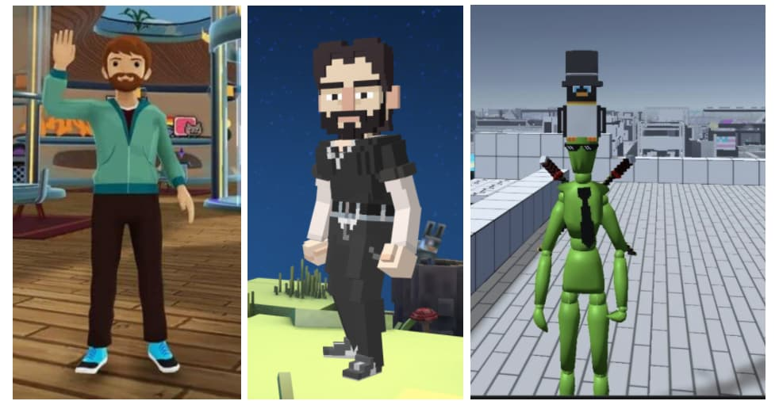

```
---
eip: 4955
title: NFT 的供应商元数据扩展
description: 向 NFT 元数据添加一个新字段，用于存储特定于供应商的数据
author: Ignacio Mazzara (@nachomazzara)
discussions-to: https://ethereum-magicians.org/t/eip-4955-non-fungible-token-metadata-namespaces-extension/8746
status: Final
type: Standards Track
category: ERC
created: 2022-03-29
requires: 721, 1155
---

## 摘要

此 EIP 标准化了 NFT 元数据的模式，以便为 [EIP-721](./eip-721.md) 和 [EIP-1155](./eip-1155.md) NFT 的 JSON 模式添加新的字段命名空间。

## 动机

标准化的 NFT 元数据模式允许钱包、市场、元宇宙和类似应用程序与任何 NFT 互操作。NFT 市场和元宇宙等应用程序可以通过使用自定义 3D 表示或其他任何新属性来渲染 NFT，从而有效地利用它们。

一些项目，如 Decentraland、TheSandbox、Cryptoavatars 等，需要自己的 3D 模型来表示 NFT。由于不同的美学和数据格式，这些模型不具有交叉兼容性。

## 规范

本文档中的关键词 "MUST"、"MUST NOT"、"REQUIRED"、"SHALL"、"SHALL NOT"、"SHOULD"、"SHOULD NOT"、"RECOMMENDED"、"MAY" 和 "OPTIONAL" 按照 RFC 2119 中的描述进行解释。

### 模式

（受以下“注意事项”约束）

引入了一个名为 `namespaces` 的新属性。 此属性预期每个项目一个对象，如下例所示。

```jsonc
{
    "title": "Asset Metadata",
    "type": "object",
    "properties": {
        "name": {
            "type": "string",
            "description": "Identifies the asset that this NFT represents" // 标识此 NFT 代表的资产
        },
        "description": {
            "type": "string",
            "description": "Describes the asset that this NFT represents" // 描述此 NFT 代表的资产
        },
        "image": {
            "type": "string",
            "description": "A URI pointing to a resource with mime type image/* representing the asset that this NFT represents. Consider making any images at a width between 320 and 1080 pixels and aspect ratio between 1.91:1 and 4:5 inclusive." // 指向具有 MIME 类型 image/* 的资源的 URI，表示此 NFT 代表的资产。 考虑使任何图像的宽度在 320 到 1080 像素之间，宽高比在 1.91:1 到 4:5 之间。
        },
        "namespaces": {
          "type": "object",
          "description": "Application-specific NFT properties" // 应用程序特定的 NFT 属性
        }
    }
}
```

### 例子

```jsonc
{
  "name": "My NFT",
  "description": "NFT description", // NFT 描述
  "image": "ipfs://QmZfmRZHuawJDtDVMaEaPWfgWFV9iXoS9SzLvwX76wm6pa",
  "namespaces": {
    "myAwesomeCompany": {
      "prop1": "value1",
      "prop2": "value2",
    },
    "myAwesomeCompany2": {
      "prop3": "value3",
      "prop4": "value4",
    },
  }
}

// Or by simply using a `URI` to reduce the size of the JSON response. // 或者简单地使用“URI”来减小 JSON 响应的大小。

{
  "name": "My NFT",
  "description": "NFT description", // NFT 描述
  "image": "ipfs://QmZfmRZHuawJDtDVMaEaPWfgWFV9iXoS9SzLvwX76wm6pa",
  "namespaces": {
    "myAwesomeCompany": "URI",
    "myAwesomeCompany2": "URI",
  }
}
```

## 理由

有许多项目需要自定义属性才能显示当前的 NFT。 每个项目可能都有自己的方式来渲染 NFT，因此它们需要不同的值。 例如，像 Decentraland 或 TheSandbox 这样的元宇宙需要不同的 3d 模型，以便根据每个元宇宙的视觉/引擎来渲染 NFT。 像 Cryptopunks、Bored Apes 等 NFT 项目可以创建每个项目所需的 3d 模型，因此可以开箱即用地支持。

渲染 3d NFT（模型）的项目之间的主要区别在于：

### 骨架

每个元宇宙都使用自己的骨架。 有一个人形标准，但并非每个元宇宙都使用它，而且并非所有元宇宙都使用人形。 例如，Decentraland 的美学与 Cryptovoxels 和 TheSandbox 不同。 这意味着每个元宇宙都需要一个不同的模型，并且它们可能具有相同的扩展名（GLB、GLTF）



### 元数据（表示文件）

例如，每个元宇宙都使用自己的元数据表示文件，以使其在引擎内部工作，具体取决于其游戏需求。

这是 Decentraland 中可穿戴物品的 JSON 配置：

```jsonc
"data": {
  "replaces": [],
  "hides": [],
  "tags": [],
  "category": "upper_body",
  "representations": [
    {
      "bodyShapes": [
        "urn:decentraland:off-chain:base-avatars:BaseMale"
      ],
      "mainFile": "male/Look6_Tshirt_A.glb",
      "contents": [
        {
          "key": "male/Look6_Tshirt_A.glb",
          "url": "https://peer-ec2.decentraland.org/content/contents/QmX3yMhmx4AvGmyF3CM5ycSQB4F99zXh9rL5GvdxTTcoCR"
        }
      ],
      "overrideHides": [],
      "overrideReplaces": []
    },
    {
      "bodyShapes": [
        "urn:decentraland:off-chain:base-avatars:BaseFemale"
      ],
      "mainFile": "female/Look6_Tshirt_B (1).glb",
      "contents": [
        {
          "key": "female/Look6_Tshirt_B (1).glb",
          "url": "https://peer-ec2.decentraland.org/content/contents/QmcgddP4L8CEKfpJ4cSZhswKownnYnpwEP4eYgTxmFdav8"
        }
      ],
      "overrideHides": [],
      "overrideReplaces": []
    }
  ]
},
"image": "https://peer-ec2.decentraland.org/content/contents/QmPnzQZWAMP4Grnq6phVteLzHeNxdmbRhKuFKqhHyVMqrK",
"thumbnail": "https://peer-ec2.decentraland.org/content/contents/QmcnBFjhyFShGo9gWk2ETbMRDudiX7yjn282djYCAjoMuL",
"metrics": {
  "triangles": 3400,
  "materials": 2,
  "textures": 2,
  "meshes": 2,
  "bodies": 2,
  "entities": 1
}
```

Decentraland 需要 `replaces`、`overrides`、`hides` 以及同一资产的不同身体形状表示，以便正确渲染 3D 资产。

使用 `namespaces` 而不是像下面这样的对象使特定的供应商/第三方可以轻松访问和索引所需的模型。 此外，`styles` 不存在，因为没有关于如何渲染资产的标准。 正如我上面提到的，例如，每个元宇宙都使用自己的骨架和美学。 没有其他元宇宙使用的 Decentraland 风格或 TheSandbox 风格。 它们中的每一个都是独特且具体的，为了平台存在的理由。 像 Cryptoavatars 这样的项目试图推行不同的标准，但由于与骨架/动画/元数据的独特性相关的相同原因而没有成功。

```jsonc
{
    "id": "model",
    "type": "model/gltf+json",
    "style": "Decentraland",
    "uri": "..."
},

// Or // 或者

{
    "id": "model",
    "type": "model/gltf+json",
    "style": "humanoide",
    "uri": "..."
},
```

使用 `namespaces`，每个供应商将通过执行以下操作来了解如何渲染资产：

```ts
fetch(metadata.namespaces["PROJECT_NAME"].uri).then(res => render(res))
```

扩展 [EIP-721](./eip-721.md) 元数据模式背后的想法是为了向后兼容。 以太坊上的大多数项目都使用不可升级的合约。 如果此 EIP 需要对这些合约进行新的实现，则必须重新部署它们。 这既耗时又浪费金钱。 利用 EIP-721 现有的元数据字段可以最大限度地减少必要的更改数量。 最后，JSON 元数据已经用于使用 `image` 字段存储表示。 将资产的所有表示形式都放在同一位置似乎是合理的。

## 向后兼容性

无法修改元数据响应（模式）的现有项目可能能够创建一个新的智能合约，该合约基于 `tokenId` 返回更新后的元数据模式。 当然，这些项目可能需要接受这些链接的智能合约作为有效的，以便通过 `tokenURI` 函数获取元数据。

## 安全注意事项

与 [EIP-721](./eip-721.md) 相关的安全注意事项同样适用于使用 http 网关或 IPFS 的 tokenURI 方法。

## 版权

通过 [CC0](../LICENSE.md) 放弃版权及相关权利。
```