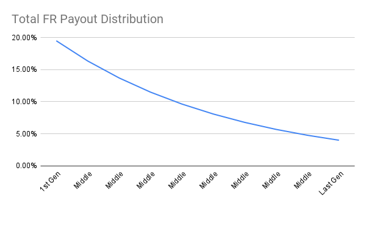
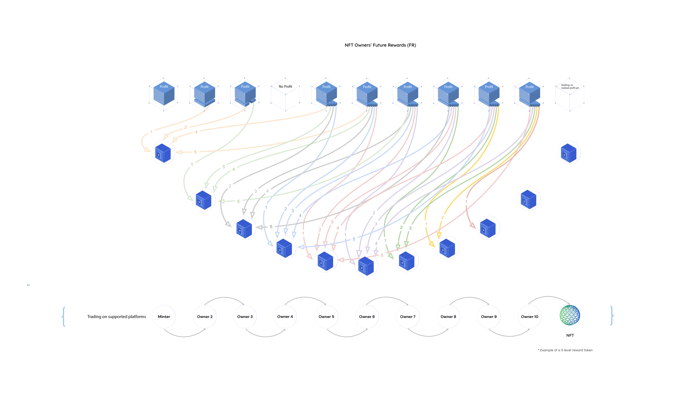
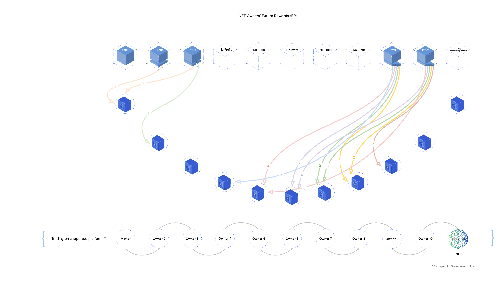

```md
---
eip: 5173
title: NFT 未来奖励 (nFR)
description: 一种多代奖励机制，奖励所有非同质化代币 (NFT) 的所有者。
author: Yale ReiSoleil (@longnshort), dRadiant (@dRadiant), D Wang, PhD <david@iob.fi>
discussions-to: https://ethereum-magicians.org/t/non-fungible-future-rewards-token-standard/9203
status: Draft
type: Standards Track
category: ERC
created: 2022-05-08
requires: 165, 721
---

## 摘要

本提案介绍了非同质化未来奖励 (nFR) 框架，扩展了 [ERC-721](./eip-721.md) 代币 (NFT) 的功能，使代币持有者能够在转让所有权后从价值升值中受益。通过整合合作博弈论，它协调了利益相关者的激励，解决了资产交易中的低效率问题。该框架促进了协作、透明和公平的利润分享。 它提高了公平性和效率，认可了所有权阶段，并建立了一个合作的资产交易模型。

## 动机

传统的金融市场通常以效率低下、不透明的操作和系统性失衡为特征，导致大多数参与者处于明显的劣势。 尽管区块链技术提供了交易的透明度，但当前的实现方式并不能充分促进公平的价值分配或参与者的协调。 本提案通过引入结构化的协作和公平的补偿系统来解决这些差距，确保对资产价值贡献的公平奖励。

### 框架组件

#### 流动机制

每个 [ERC-5173](./eip-5173.md) 代币都维护着所有权和价格变动的不可变记录，从而创建了一个由历史代币所有者组成的专用网络。 这个独特的社区协同合作以产生额外的价值，即使在出售后也对项目或代币保持既得利益，确保贡献者从资产的升值中受益。 这种机制促进了协作性的价值创造，公平的利润分享以及一个相互联系的金融生态系统，这与传统的金融市场系统不同。

#### 合作价值（未来奖励）分配

nFR 框架改变了零和金融等式：

```
P(A) + P(B) + F ≤ 0
```
其中：

- P(A)：交易者 A 的利润
- P(B)：交易者 B 的利润
- F：交易费用，摩擦成本和运营费用

进入协作模型：

```
P(A) + P(B) + F + FR > 0
```
其中：

- FR：通过合作机制共享的价值创造

此模型奖励公平性，并在整个资产生命周期中奖励贡献。

## 规范

本文档中的关键词“必须”，“不得”，“必需”，“应”，“不应”，“应该”，“不应该”，“推荐”，“可以”和“可选”应按照 RFC 2119 中的描述进行解释。

以下是 [ERC-721](./eip-721.md) 标准的扩展。

符合 [ERC-721](./eip-721.md) 的合约 MAY 实现此 EIP 以进行奖励，以提供一种标准方法，奖励未来的买家和以前的所有者，并在将来获得已实现的利润。

此标准的实现者 MUST 具有以下所有功能：

```solidity

pragma solidity ^0.8.0;

import "@openzeppelin/contracts/utils/introspection/IERC165.sol";

/*
 *
 * @dev Interface for the Future Rewards Token Standard.
 * 未来奖励代币标准接口。
 *
 * A standardized way to receive future rewards for non-fungible tokens (NFTs.)
 * 一种接收非同质化代币（NFT）未来奖励的标准化方法。
 *
 */
interface IERC5173 is IERC165 {

    event FRClaimed(address indexed account, uint256 indexed amount);

    event FRDistributed(uint256 indexed tokenId, uint256 indexed soldPrice, uint256 indexed allocatedFR);

    event Listed(uint256 indexed tokenId, uint256 indexed salePrice);

    event Unlisted(uint256 indexed tokenId);

    event Bought(uint256 indexed tokenId, uint256 indexed salePrice);

    function list(uint256 tokenId, uint256 salePrice) external;

    function unlist(uint256 tokenId) external;

    function buy(uint256 tokenId) payable external;

    function releaseFR(address payable account) external;

    function retrieveFRInfo(uint256 tokenId) external returns(uint8, uint256, uint256, uint256, uint256, address[] memory);

    function retrieveAllottedFR(address account) external returns(uint256);

    function retrieveListInfo(uint256 tokenId) external returns(uint256, address, bool);
    
}

```

nFR 合约 MUST 为每个代币 ID 实现和更新。 `FRInfo` 结构中的数据 MAY 可以完全存储在单个映射中，也可以分解为多个映射。 该结构 MUST 公开在公共映射中，或者 MUST 具有访问私有数据的公共函数。 这是为了客户端数据获取和验证。

```solidity

struct FRInfo {
        uint8 numGenerations; //  Number of generations corresponding to that Token ID
        uint256 percentOfProfit; // Percent of profit allocated for FR, scaled by 1e18
        uint256 successiveRatio; // The common ratio of successive in the geometric sequence, used for distribution calculation
        uint256 lastSoldPrice; // Last sale price in ETH mantissa
        uint256 ownerAmount; // Amount of owners the Token ID has seen
        address[] addressesInFR; // The addresses currently in the FR cycle
}

struct ListInfo {
        uint256 salePrice; // ETH mantissa of the listed selling price
        address lister; // Owner/Lister of the Token
        bool isListed; // Boolean indicating whether the Token is listed or not
}

```
 
此外，nFR 智能合约 MUST 在映射中存储每个代币 ID 对应的 `ListInfo`。 检索代币 ID 对应的 `ListInfo` 的方法 MUST 也可以公开访问。

nFR 智能合约 MUST 还会存储并更新使用 `_allottedFR` 映射分配给特定地址的以太币数量。 `_allottedFR` 映射 MUST 是公共的，或者具有用于获取分配给特定地址的 FR 付款的函数。

### 百分比定点数

`allocatedFR` MUST 使用百分比定点数进行计算，缩放因子为 1e18 (X/1e18) - 例如"5e16" - 代表 5%。 这是 REQUIRED 的，以保持整个标准的统一性。 最大值和最小值将为 - 1e18 - 1。

### 默认 FR 信息

必须存储默认的 `FRInfo`，以便与 [ERC-721](./eip-721.md) mint 函数向后兼容。 假设未进行硬编码，它 MAY 还可以具有更新 `FRInfo` 的函数。

### ERC-721 覆盖

符合 nFR 的智能合约 MUST 覆盖 [ERC-721](./eip-721.md) `_mint`、`_transfer` 和 `_burn` 函数。 在覆盖 `_mint` 函数时，如果希望在调用 [ERC-721](./eip-721.md) `_mint` 函数而不是 nFR `_mint` 函数时 mint 成功，则 REQUIRED 建立默认的 FR 模型。 它还会更新所有者数量，并将接收人地址直接添加到 FR 周期中。 在覆盖 `_transfer` 函数时，智能合约 SHALL 将 NFT 视为以 0 ETH 售出，并在成功转让后相应地更新状态。 这是为了防止 FR 规避。 此外，`_transfer` 函数 SHALL 禁止调用者将代币转让给自己或已经在 FR 滑动窗口中的地址，这可以通过 require 语句来完成，以确保发送者或 FR 滑动窗口中的地址不是接收者，否则，可能会用自己的地址或重复的地址填充 FR 序列。 最后，在覆盖 `_burn` 函数时，智能合约 SHALL 在成功销毁后删除对应于该代币 ID 的 `FRInfo` 和 `ListInfo`。

此外，如果智能合约旨在进行安全转移和 mint，则 MAY 可以在铸造和转移后显式调用 [ERC-721](./eip-721.md) `_checkOnERC721Received` 函数。

### 安全转移

如果钱包/经纪人/拍卖应用程序将接受安全转移，则它 MUST 实现 [ERC-721](./eip-721.md) 钱包接口。

### 挂牌、下架和购买

`list`、`unlist` 和 `buy` 函数 MUST 被实现，因为它们提供了出售代币的能力。

```solidity
function list(uint256 tokenId, uint256 salePrice) public virtual override {
   //...
}


function unlist(uint256 tokenId) public virtual override {
   //...
}

function buy(uint256 tokenId) public virtual override payable {
   //...
}

```

`list` 函数接受 `tokenId` 和 `salePrice`，并在确保 `msg.sender` 经过批准或者是该代币的所有者之后，更新给定 `tokenId` 的对应 `ListInfo`。 `list` 函数 SHOULD 发出 `Listed` 事件。 该函数表明该代币已挂牌，并以什么价格挂牌。

`unlist` 函数接受 `tokenId` 并在所有者验证已满足后，删除对应的 `ListInfo`。 `unlist` 函数 SHOULD 发出 `Unlisted` 事件。

`buy` 函数接受 `tokenId` 并且 MUST 是可支付的。 在继续并调用 FR `_transferFrom` 函数之前，它 MUST 验证 `msg.value` 是否与代币的 `salePrice` 匹配，以及该代币是否已挂牌。 该函数还 MUST 验证买方是否已在 FR 滑动窗口中。 这是为了确保值有效，并且还将允许将必要的 FR 保留在合约中。 `buy` 函数 SHOULD 发出 `Bought` 事件。

### 未来奖励 `_transferFrom` 函数

FR `_transferFrom` 函数 MUST 由所有支持 nFR 的智能合约调用，尽管也可以实现对不支持 nFR 的合约的容纳，以确保向后兼容性。

```solidity

function transferFrom(address from, address to, uint256 tokenId, uint256 soldPrice) public virtual override payable {
       //...
}

```

根据存储的 `lastSoldPrice`，在调用 [ERC-721](./eip-721.md) transfer 函数并转移 NFT 之后，智能合约将确定销售是否有利润。 如果没有盈利，智能合约 SHALL 更新相应代币 ID 的上次售出价格，增加所有者数量，转移代，并根据具体实现将所有 `msg.value` 转移到 `lister`。 否则，如果交易有利可图，智能合约 SHALL 调用 `_distributeFR` 函数，然后更新 `lastSoldPrice`，增加所有者数量，并最终转移代。 `_distributeFR` 函数或 FR `_transferFrom` MUST 返回要在 `_addressesInFR` 之间分配的已分配 FR 与 `msg.value` 到 `lister` 之间的差额。 操作完成后，该函数 MUST 清除对应的 `ListInfo`。 与 `_transfer` 覆盖类似，FR `_transferFrom` SHALL 确保接收人不是代币的发送者或 FR 滑动窗口中的地址。

### 未来奖励计算

支持此标准的市场 MAY 可以实现各种计算或将未来奖励转移给以前所有者的方法。

```solidity

function _calculateFR(uint256 totalProfit, uint256 buyerReward, uint256 successiveRatio, uint256 ownerAmount, uint256 windowSize) pure internal virtual returns(uint256[] memory) {
    //...        
}

```

在此示例 (*图 1*) 中，卖家 REQUIRED 与代币的 10 个先前持有者分享其净利润的一部分。 未来奖励还将支付给同一卖家，因为代币的价值从最多 10 个后续所有者那里增加。

当所有者在其持有期内亏损时，他们 MUST NOT 有义务分享未来奖励分配，因为没有利润可分享。 但是，如果他们有利润，他 SHALL 仍然会从未来几代所有者的未来奖励分配中获得一部分。



*图 1：几何序列分配*

买家/所有者从 NFT 交易中获得已实现利润 (P) 的一部分 (r)。 剩余收益归卖家所有。

由于定义了滑动窗口机制 (n)，我们可以确定哪些先前的所有者将收到分配。 所有者按队列排列，从最早的所有者开始，到紧邻着当前所有者的所有者（最后一代）结束。 第一代是接下来的 n 代的最后一代。 从第一代到最后一代都有固定大小的利润分配窗口。

利润分配 SHALL 仅适用于属于该窗口的先前所有者。

在此示例中，根据几何序列（其中分配了利润），SHALL 将一部分收益授予最后一代所有者（紧邻当前卖家之前的那个所有者）。 较大一部分收益 SHALL 归于中间代所有者，越早越大，直到最后一个符合条件的所有者由滑动窗口确定，即第一代。 较早购买的所有者 SHALL 获得更大的奖励，第一代所有者获得最大的奖励。

### 未来奖励分配



*图 2：NFT所有者的未来奖励 (nFR)*

*图 2* 展示了基于所有者已实现利润的五代未来奖励分配计划的示例。

```solidity

function _distributeFR(uint256 tokenId, uint256 soldPrice) internal virtual {
       //...

        emit FRDistributed(tokenId, soldPrice, allocatedFR);
 }
 
```

如果有有利可图的销售，则 MUST 在 FR `_transferFrom` 函数中调用 `_distributeFR` 函数。 该函数 SHALL 确定有资格获得 FR 的地址，这本质上是排除 `addressesInFR` 中的最后一个地址，以防止任何地址为自己付款。 如果该函数确定没有符合条件的地址，即这是第一次出售，那么如果 `_transferFrom` 正在处理 FR 付款，则它 SHALL `return 0`，或者将 `msg.value` 发送到 `lister`。 该函数 SHALL 计算当前销售价格与 `lastSoldPrice` 之间的差额，然后 SHALL 调用 `_calculateFR` 函数以接收正确的 FR 分配。 然后，它 SHALL 相应地分配 FR，并在必要时进行顺序调整。 然后，合约 SHALL 计算分配的 FR 总量 (`allocatedFR`)，以便将 `soldPrice` 和 `allocatedFR` 的差额返回到 `lister`。 最后，它 SHALL 发出 `FRDistributed` 事件。 此外，该函数 MAY 返回分配的 FR，如果 `_transferFrom` 函数将 `allocatedFR` 发送到 `lister`，则该 FR 将由 FR `_transferFrom` 函数接收。

### 未来奖励申领

未来的奖励支付 SHOULD 利用拉取支付模型，类似于 OpenZeppelin 通过其 PaymentSplitter 合约演示的。 事件 FRClaimed 将在成功提出申领后触发。

```solidity

function releaseFR(address payable account) public virtual override {
        //...
}

```

### 所有者代转移

无论销售是否有利可图，MUST 都要调用 `_shiftGenerations` 函数。 因此，将在 `_transfer` [ERC-721](./eip-721.md) 覆盖函数和 FR `transferFrom` 函数中调用它。 该函数 SHALL 从对应的 `_addressesInFR` 数组中删除最旧的帐户。 此计算将考虑数组的当前长度与给定代币 ID 的总代数。

## 理由

### 固定百分比为 10^18

考虑到将要强制执行定点算法，因此逻辑上应使 1e18 代表 100%，而 1e16 代表 1% 用于定点运算。 这种处理百分比的方法在用于定点运算的许多 Solidity 库中也很常见。

### 发出付款事件

由于每个 NFT 合约都是独立的，并且虽然市场合约可以在出售商品时发出事件，但是选择发出付款事件非常重要。 由于版税和 FR 接收者可能没有意识到/关注其 NFT 的二次销售，因此他们永远不会知道他们收到了付款，除了他们的 ETH 钱包已随机增加。

因此，二次销售的接收者将能够通过调用正在出售的 NFT 的父合约来验证是否已收到付款，如 [ERC-2981](./eip-2981.md) 中所实现的那样。

### 所有所有者的世代数 (n) 与仅盈利所有者的世代数

决定后续所有者将分享多少所有者的利润的是所有所有者的代数，而不仅仅是那些盈利的所有者，请参见 *图 3*。 作为阻止“所有权囤积”的努力的一部分，如果所有所有者都在持有 NFT 时赔钱，则不会向当前所有者/购买者分配未来奖励。 更多信息可以在安全注意事项下找到。



*图 3：亏损所有者*

### 单代与多代

在单代奖励中，新的买家/所有者仅获得下一代已实现利润的一部分。 在多代奖励系统中，买家在购买数年后将获得未来奖励。 在这种情况下，NFT 应该具有长期的增长潜力，并且可能会有大量的股息支付。

我们建议市场运营商可以在单代分配系统和多代分配系统之间进行选择。

### 卖家直接支付 FR 与智能合约管理的支付

直接从销售收益中获得的 FR 支付是立即的和最终的。 作为安全注意事项部分稍后详细介绍的欺诈检测的一部分，我们选择了一种方法，其中智能合约计算了每一代先前所有者的所有 FR 金额，并根据市场设置的其他标准来处理支付，例如降低或延迟支付给得分较低的钱包地址，或者使用时间启发式分析检测到的一系列连续订单。

### 相等与线性奖励分配

#### 相等 FR 支付


*图 4：相等、线性奖励分配*

来自后期所有者实现利润分配将平均分配给所有符合条件的所有者 ( *图 4* )。 但是，指数级奖励曲线可能更理想，因为它会给最新的购买者稍大份额。 此外，此分配使最早的几代人获得了最大的份额，因为他们的 FR 分配接近尾声，因此他们为早期的参与获得了更高的奖励，但是该分配远不如基于算术序列的分配 ( *图 5* ) 极端。

此系统不会歧视任何购买者，因为每个购买者都将经历相同的分配曲线。

#### 直线算术序列 FR 支付


*图 5：算术序列分配*

利润按照算术序列分配，即 1、2、3 等等。 第一个所有者将获得 1 份，第二个所有者将获得 2 份，第三个所有者将获得 3 份，依此类推。

## 向后兼容性

该提案与当前的 [ERC-721](./eip-721.md) 标准和 [ERC-2981](./eip-2981.md) 完全兼容。 也可以轻松地使其与 [ERC-1155](./eip-1155.md) 配合使用。

## 测试用例

[此合约](../assets/eip-5173/Implementation/nFRImplementation.sol) 包含此提案的参考实现。

[这是测试用例的可视化](../assets/eip-5173/animate-1920x1080-1750-frames.gif?raw=true)。

由于实施了 ERC-5173，因此启动了一个名为 untrading.org 的新项目。

## 参考实现

此实现使用 OpenZeppelin 合约和 Paul R Berg 创建的 PRB Math 库进行定点运算。 它演示了 nFR 标准的接口，符合 nFR 标准的扩展和使用该扩展的 [ERC-721](./eip-721.md) 实现。

参考实现的代代码位于[此处](../assets/eip-5173/Implementation/nFRImplementation.sol)。

### 将 NFT 版税分配给艺术家和创作者

我们同意艺术家的版税应该是统一的并且在链上的。 我们支持[ERC-2981](./eip-2981.md) NFT 版税标准提案。

所有平台都可以支持基于链上参数和功能的相同 NFT 的版税奖励：

- 无利润，无利润分享，无成本；
- “谁拥有它”的问题通常对于收藏品的来源和价值至关重要；
- 应重新补偿先前的所有者以表彰他们的所有权；
- 买方/所有者在 FR 中的激励因素消除了规避版税支付计划的任何动机；

### 分配 NFT 所有者的未来奖励 (FR)

#### 未来奖励计算

当 NFT 出售时，任何已实现的利润 (P) 都将在买家/所有者之间分配。 先前的所有者将获得利润 (P) 的固定部分，此部分称为未来奖励 (FR)。 卖家获得剩余的利润。

我们定义了一种滑动窗口机制，以确定哪些先前的所有者将参与利润分配。 让我们将所有者想象成从第一个所有者到当前所有者的队列。 利润分配窗口从紧邻当前所有者的先前所有者开始，并延伸到第一个所有者，并且窗口的大小是固定的。 只有位于窗口内的先前所有者才会加入利润分配。


在此等式中：

- P 是总利润，即售价减去购买价格之差；
- _R_ 是总 P 的买家奖励比率；
- _g_ 是几何序列中连续项的公共比率；
- _n_ 是符合条件并参与未来奖励分享的实际所有者数量。 为了计算 _n_，我们有 _n_ = min( _m_ , _w_ )，其中 _m_ 是代币的当前所有者数量，而 _w_ 是利润分配滑动窗口算法的窗口大小

#### 转换为代码

```solidity

pragma solidity ^0.8.0;
//...

/* Assumes usage of a Fixed Point Arithmetic library (prb-math) for both int256 and uint256, and OpenZeppelin Math utils for Math.min. */
/* 假设使用定点算法库 (prb-math) 用于 int256 和 uint256，以及 OpenZeppelin Math utils 用于 Math.min。*/
function _calculateFR(uint256 p, uint256 r, uint256 g, uint256 m, uint256 w) pure internal virtual returns(uint256[] memory) {
        uint256 n = Math.min(m, w);
        uint256[] memory FR = new uint256[](n);

        for (uint256 i = 1; i < n + 1; i++) {
            uint256 pi = 0;

            if (successiveRatio != 1e18) {
                int256 v1 = 1e18 - int256(g).powu(n);
                int256 v2 = int256(g).powu(i - 1);
                int256 v3 = int256(p).mul(int256(r));
                int256 v4 = v3.mul(1e18 - int256(g));
                pi = uint256(v4 * v2 / v1);
            } else {
                pi = p.mul(r).div(n);
            }

            FR[i - 1] = pi;
        }

        return FR;
}

```

完整的实现代码可以在[此处](../assets/eip-5173/Implementation/nFRImplementation.sol)找到。

## 安全注意事项

### 支付攻击

由于本 EIP 将版税和已实现的利润奖励的收集、分配和支付引入了 ERC-721 标准，因此攻击媒介也会增加。 正如 Andreas Freund 在关于缓解网络钓鱼攻击中所讨论的那样，我们建议对所有支付功能进行重入保护，以减少最显着的支付和支付攻击媒介。

### 规避版税

在当前的 [ERC-721](./eip-721.md) 标准下，许多方法被用来避免向创作者支付版税。 通过秘密交易，新买家的成本基础将降为零，从而使他们对 FR 的责任增加到全额售价。 所有人，无论是买方还是卖方，都将支付先前所有者的净已实现利润的一部分 ( P x r )。 出于自身利益，买方拒绝任何规避忠诚度的建议。

### 通过虚假交易进行 FR 囤积

Quantexa 博客和 beincrypto 文章报道了在所有不受管制的加密货币交易平台和 NFT 市场中广泛存在的虚假交易。 不诚实的行为者使用虚假交易可能会导致不公平的优势，以及抬高价格和洗钱。 当单个实体成为多代所有者以在未来积累更多奖励时，该系统的有效性就会受到损害。

#### 用户进行虚假交易

使用不同的钱包地址，攻击者可以亏本将 NFT“出售”给自己。 有可能重复此过程 n 次，以最大程度地提高他们在后续 FR 分配中的份额 ( *图 6* )。 钱包排名得分可以部分缓解此问题。 显然，全新的钱包是一个危险信号，如果市场交易历史较短（即交易次数少于一定数量），则市场可能会暂停向其分配 FR。

我们不希望很大一部分未来奖励流向少数洗钱交易者。 使这种做法减少盈利是阻止虚假交易和奖励囤积的一种方法。 例如，可以通过实施基于钱包得分和持有期的激励系统来部分缓解这种情况。 如果使用新钱包或持有期少于某个时期，则双方的奖励都会减少。


*图 6：同一所有者使用不同的钱包*

#### 市场运营商进行虚假交易

但是，根据 Decrypt 的说法，最大的违规者似乎是市场，该市场大量参与虚假交易，或者根本不在乎。 作者亲自经历了这种现象。 一家排名前 5 位的加密货币交易所的一位高级管理人员在 2018 年的一次午夜饮酒会上吹嘘说，他们已经“优化”（虚假交易）了一些新上市的代币，他们称之为“做市”。 该交易所至今仍位居前五名加密货币交易所之列。

许多公司都在自行从事虚假交易或与某些用户勾结，并且会在暗中报销版税和 FR 付款。 至关重要的是，所有交易所都必须具有强大的功能来防止自我交易。 用户应该能够透明地观察观察者。 市场应为其客户提供免费访问链上交易监控服务，例如 Chainalysis Reactor。

### 长期/周期性 FR 享有权利的所有者世代

在大多数情况下，恶意行为者将创建过长或循环的未来奖励所有者世代，这将导致尝试分配 FR 或转移世代的应用程序耗尽 gas 并且无法运行。 因此，客户有责任验证与他们交互的合约是否具有适当的代数，以便循环迭代不会耗尽 gas。

## 版权

版权及相关权利通过 [CC0](../LICENSE.md) 放弃。
```