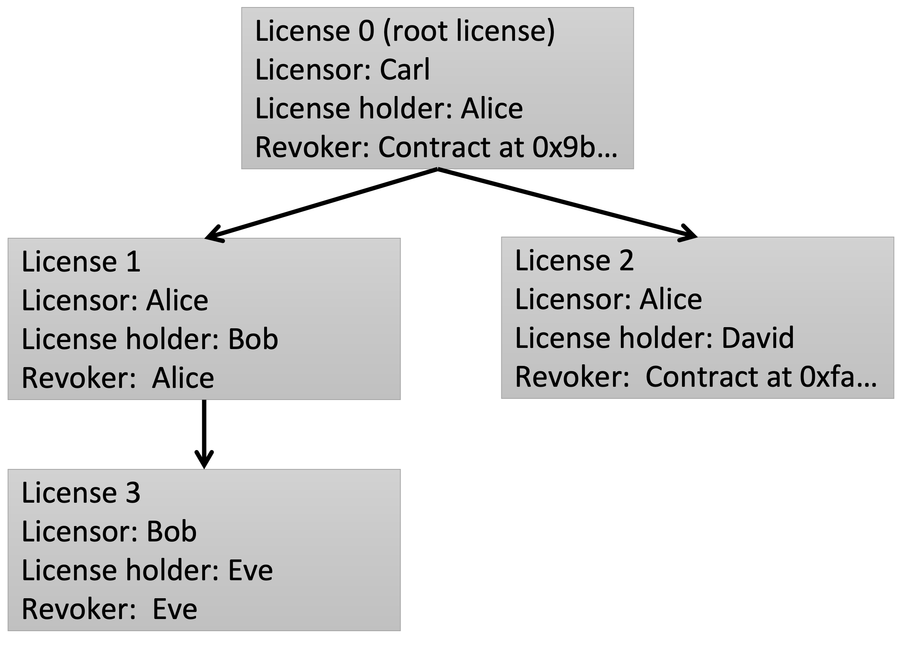

## 摘要

以下标准定义了用于管理 NFT 许可的 API。该标准提供了创建、转移和撤销许可，以及确定 NFT 当前许可状态的基本功能。该标准不定义许可的法律细节。相反，它提供了一个结构化的框架来记录许可细节。

我们考虑了 NFT 创建者的用例，他们希望授予 NFT 持有者版权许可，以使用与 NFT 相关的作品。有效许可的持有人可以向他人颁发子许可，以执行许可授予的权利。许可可以随 NFT 转移，因此所有子许可也随之转移。许可可以选择在创建者指定的条件下撤销。

## 动机

[ERC-721](./eip-721.md) 标准定义了一个 API 来跟踪和转移 NFT 的所有权。然而，当 NFT 代表某些链下资产时，我们需要一些具有法律效力的机制将链上资产（NFT）*绑定*到链下财产。链下财产的一个重要例子是创意作品，例如图像或音乐文件。最近，大多数涉及创意作品的 NFT 项目都使用许可来澄清授予 NFT 所有者的合法权利。但是这些许可几乎总是链下的，并且 NFT 本身并不表明哪些许可适用于它们，从而导致使用与 NFT 相关的作品的权利存在不确定性。避免 NFT 中的所有版权漏洞并非易事，而且现有的 EIP 尚未解决 NFT 的权利管理问题，超出直接所有权（参见 [ERC-721](./eip-721.md)）或租赁（参见 [ERC-4907](./eip-4907.md)）的简单案例。

本 EIP 尝试提供一个标准，以促进 Web3 世界中 NFT 的权利管理。特别是，[ERC-5218](./eip-5218.md) 智能合约允许将 NFT 的所有许可（包括颁发给 NFT 所有者的*根许可*和许可持有人授予的*子许可*）记录下来，并轻松地通过链上数据进行跟踪。这些许可可以包括人类可读的法律代码、机器可读的摘要（例如以 CC REL 编写的摘要），或两者兼而有之。ERC-5218 智能合约通过记录 URI 来指向许可，为用户提供可靠的参考以了解他们被授予的合法权利，并为 NFT 创建者和审计员提供检测未经授权的侵权使用的工具。

## 规范

本文档中的关键词“必须（MUST）”、“禁止（MUST NOT）”、“需要（REQUIRED）”、“应该（SHALL）”、“不应该（SHALL NOT）”、“推荐（SHOULD）”、“不推荐（SHOULD NOT）”、“可以（MAY）”和“可选（OPTIONAL）”应按照 RFC 2119 中的描述进行解释。

**每个符合 ERC-5218 的合约*必须*实现 `IERC5218` 接口**：

```solidity
pragma solidity ^0.8.0;

/// @title ERC-5218: NFT 权利管理
interface IERC5218 is IERC721 {

  /// @dev 当通过任何机制创建新许可时，都会发出此事件。
  event CreateLicense(uint256 _licenseId, uint256 _tokenId, uint256 _parentLicenseId, address _licenseHolder, string _uri, address _revoker);
 
  /// @dev 当许可被撤销时，会发出此事件。请注意，根据某些
  ///  许可条款，在撤销某些祖先许可后，子许可可能被 `隐式` 撤销。
  ///  在这种情况下，您的智能合约
  ///  可能只为祖先许可发出一次此事件，并且可以暗示撤销
  ///  其所有子许可，而无需消耗额外的 gas。
  event RevokeLicense(uint256 _licenseId);
 
  /// @dev 当许可转移到新的持有人时，会发出此事件。NFT 的
  ///  根许可应与 NFT 一起在 ERC721 中转移
  ///  `transfer` 函数调用。
  event TransferLicense(uint256 _licenseId, address _licenseHolder);
  
  /// @notice 检查许可是否有效。
  /// @dev 不存在或被撤销的许可无效，并且此函数必须
  ///  在其上返回 `false`。根据某些许可条款，许可可能会变得
  ///  无效，因为某些祖先许可已被撤销。在这种情况下，
  ///  此函数应返回 `false`。
  /// @param _licenseId 查询许可的标识符
  /// @return 查询的许可是否有效
  function isLicenseActive(uint256 _licenseId) external view returns (bool);

  /// @notice 检索颁发许可的 token 标识符。
  /// @dev 除非许可有效，否则抛出异常。
  /// @param _licenseId 查询许可的标识符
  /// @return 颁发查询许可的 token 标识符
  function getLicenseTokenId(uint256 _licenseId) external view returns (uint256);

  /// @notice 检索许可的父许可标识符。
  /// @dev 除非许可有效，否则抛出异常。如果许可没有
  ///  父许可，则返回一个不引用任何许可的特殊标识符
  ///  （例如 0）。
  /// @param _licenseId 查询许可的标识符
  /// @return 查询许可的父许可标识符
  function getParentLicenseId(uint256 _licenseId) external view returns (uint256);

  /// @notice 检索许可的持有人。
  /// @dev 除非许可有效，否则抛出异常。
  /// @param _licenseId 查询许可的标识符
  /// @return 查询许可的持有人地址
  function getLicenseHolder(uint256 _licenseId) external view returns (address);

  /// @notice 检索许可的 URI。
  /// @dev 除非许可有效，否则抛出异常。
  /// @param _licenseId 查询许可的标识符
  /// @return 查询许可的 URI
  function getLicenseURI(uint256 _licenseId) external view returns (string memory);

  /// @notice 检索许可的撤销者地址。
  /// @dev 除非许可有效，否则抛出异常。
  /// @param _licenseId 查询许可的标识符
  /// @return 查询许可的撤销者地址
  function getLicenseRevoker(uint256 _licenseId) external view returns (address);

  /// @notice 检索 NFT 的根许可标识符。
  /// @dev 除非查询的 NFT 存在，否则抛出异常。如果 NFT 没有根
  ///  许可绑定到它，则返回一个不引用任何
  ///  许可的特殊标识符（例如 0）。
  /// @param _tokenId 查询 NFT 的标识符
  /// @return 查询 NFT 的根许可标识符
  function getLicenseIdByTokenId(uint256 _tokenId) external view returns (uint256);
  
  /// @notice 创建新许可。
  /// @dev 除非 NFT `_tokenId` 存在，否则抛出异常。除非父
  ///  许可 `_parentLicenseId` 有效，或者 `_parentLicenseId` 是一个特殊的
  ///  不引用任何许可的标识符（例如 0），并且 NFT
  ///  `_tokenId` 没有绑定到它的根许可，否则抛出异常。除非
  ///  消息发送者有资格创建许可，即，要么
  ///  要创建的许可是一个根许可，并且 `msg.sender` 是 NFT 所有者，
  ///  要么要创建的许可是一个子许可，并且 `msg.sender` 是
  ///  父许可的持有人，否则抛出异常。
  /// @param _tokenId 颁发许可的 NFT 的标识符
  /// @param _parentLicenseId 父许可的标识符
  /// @param _licenseHolder 许可持有人的地址
  /// @param _uri 许可条款的 URI
  /// @param _revoker 撤销者地址
  /// @return 创建的许可的标识符
  function createLicense(uint256 _tokenId, uint256 _parentLicenseId, address _licenseHolder, string memory _uri, address _revoker) external returns (uint256);

  /// @notice 撤销许可。
  /// @dev 除非许可有效且消息发送者是
  ///  有资格的撤销者，否则抛出异常。此函数应用于撤销根
  ///  许可和子许可。请注意，如果撤销了根许可，则
  ///  NFT 应转移回其创建者。
  /// @param _licenseId 查询许可的标识符
  function revokeLicense(uint256 _licenseId) external;
  
  /// @notice 转移子许可。
  /// @dev 除非子许可有效且 `msg.sender` 是许可
  ///  持有人，否则抛出异常。请注意，NFT 的根许可应绑定到
  ///  并与 NFT 一起转移。每当通过调用
  ///  ERC721 `transfer` 函数转移 NFT 时，根许可的持有人应
  ///  更改为新的 NFT 所有者。
  /// @param _licenseId 查询许可的标识符
  /// @param _licenseHolder 新的许可持有人
  function transferSublicense(uint256 _licenseId, address _licenseHolder) external;
}
```

通常，NFT 的许可具有如下所示的树状结构：



NFT 本身有一个根许可，授予 NFT 所有者对链接作品的某些权利。NFT 所有者（即根许可持有人）可以创建子许可，子许可的持有人也可以递归地创建子许可。

许可创建、转移和撤销的完整日志*必须*可通过事件日志进行追踪。因此，所有许可创建和转移*必须*发出相应的日志事件。撤销可能略有不同。本 EIP 的实现可能仅当在函数调用中撤销许可时才发出 `Revoke` 事件，或者为每个撤销的许可发出，这两者都足以跟踪所有许可的状态。如果撤销许可会自动撤销其下的所有子许可，则前者消耗的 gas 较少，而后者在查询许可状态方面效率更高。实施者应根据其许可条款进行权衡。

许可的 `revoker` 可能是许可人、许可持有人或智能合约地址，该地址在满足某些条件时调用 `revokeLicense` 函数。实施者应仔细考虑授权，并且可以使 `revoker` 智能合约通过不硬编码 `licensor` 或 `licenseHolder` 的地址来向前兼容转移。

许可 `URI` 可能指向符合以下“ERC-5218 Metadata JSON Schema”的 JSON 文件，该文件采用了 Creative Commons 许可的“三层”设计：

```json
{
    "title": "License Metadata",
    "type": "object",
    "properties": {
        "legal-code": {
            "type": "string",
            "description": "The legal code of the license."
        },
        "human-readable": {
            "type": "string",
            "description": "The human readable license deed."
        },
        "machine-readable": {
            "type": "string",
            "description": "The machine readable code of the license that can be recognized by software, such as CC REL."
        }
    }
}
```

请注意，本 EIP 不包括更新许可 URI 的函数，因此许可条款默认应是持久的。建议将许可元数据存储在 IPFS 等去中心化存储服务上，或者采用 IPFS 风格的 URI，该 URI 编码元数据的哈希值以进行完整性验证。另一方面，如果某些场景中需要许可更新功能，则可以通过撤销原始许可并创建新许可，或者添加更新函数来实现，该函数的合格调用者必须在许可中仔细指定，并在智能合约中安全地实现。

当使用 `0xac7b5ca9` 调用时，`supportsInterface` 方法必须返回 `true`。

## 理由

本 EIP 旨在允许跟踪 NFT 的所有许可，以促进权利管理。ERC-721 标准仅记录属性，而不记录绑定到 NFT 的合法权利。即使通过可选的 ERC-721 元数据扩展记录许可，子许可也是不可追踪的，这不符合 Web3 的透明度目标。一些实现尝试通过铸造 NFT 来表示特定许可来规避此限制，例如 BAYC #6068 免版税使用许可。这不是一个理想的解决方案，因为 NFT 的不同许可之间的链接是模糊的。审计员必须调查区块链中的所有 NFT 并检查在子许可关系方面尚未标准化的元数据。为了避免这些问题，本 EIP 将 NFT 的所有许可记录在树状数据结构中，该结构与 ERC-721 兼容并允许高效的可追溯性。

本 EIP 尝试默认将 NFT 与创意作品的版权许可绑定，并且不受版权所有权转移的高法律门槛的限制，后者需要版权所有者的明确签名。为了转移和跟踪版权所有权，人们可能会在仔细审查后整合 ERC-5218 和 [ERC-5289](./eip-5289.md)，并实现一个智能合约，该合约以原子方式 (1) 通过 ERC-5289 签署法律合同，以及 (2) 通过 ERC-5218 将 NFT 与版权所有权一起转移。要么两者都发生，要么两者都回滚。

## 向后兼容性

此标准与当前的 ERC-721 标准兼容：合约可以同时从 ERC-721 和 ERC-5218 继承。

## 测试用例

测试用例可在此处获得 [这里](../assets/eip-5218/contracts/test/Contract.t.sol)。

## 参考实现

参考实现维护以下数据结构：

```solidity
  struct License {
    bool active; // 许可是否有效
    uint256 tokenId; // 许可绑定到的 NFT 的标识符
    uint256 parentLicenseId; // 父许可的标识符
    address licenseHolder; // 许可持有人
    string uri; // 许可 URI
    address revoker; // 许可撤销者
  }
  mapping(uint256 => License) private _licenses; // 从许可标识符映射到许可对象
  mapping(uint256 => uint256) private _licenseIds; // 从 NFT 映射到其根许可标识符
```

每个 NFT 都有一个许可树，从每个许可开始，人们可以通过 `parentLicenseId` 沿着路径追溯到根许可。

在参考实现中，一旦许可被撤销，其下的所有子许可都会被撤销。这是以*惰性*方式实现的，以降低 gas 成本，即，仅为在 `revokeLicense` 函数调用中显式撤销的许可分配 `active=false`。因此，仅当其所有祖先许可均未被撤销时，`isLicenseActive` 才返回 `true`。

对于非根许可，创建、转移和撤销非常简单：

1. 只有有效许可的持有人才能创建子许可。
2. 只有有效许可的持有人才能将其转移给其他许可持有人。
3. 只有有效许可的撤销者才能撤销它。

根许可必须与 `ERC-721` 兼容：

1. 当 NFT 被铸造时，许可被授予给 NFT 所有者。
2. 当 NFT 被转移时，许可持有人将更改为 NFT 的新所有者。
3. 当根许可被撤销时，NFT 将返回给 NFT 创建者，NFT 创建者稍后可以将它转移给具有新许可的新所有者。

完整的实现可以在 [这里](../assets/eip-5218/contracts/src/RightsManagement.sol) 找到。

此外，[令牌绑定 NFT 许可](../assets/eip-5218/ic3license/ic3license.pdf) 专门设计用于与此接口一起使用，并提供了 NFT 许可语言的参考。

## 安全考虑

`IERC5218` 标准的实施者必须彻底考虑他们授予 `licenseHolder` 和 `revoker` 的权限。如果许可要转移给其他许可持有人，则 `revoker` 智能合约不应硬编码 `licenseHolder` 地址以避免不希望出现的情况。

## 版权

通过 [CC0](../LICENSE.md) 放弃版权和相关权利。