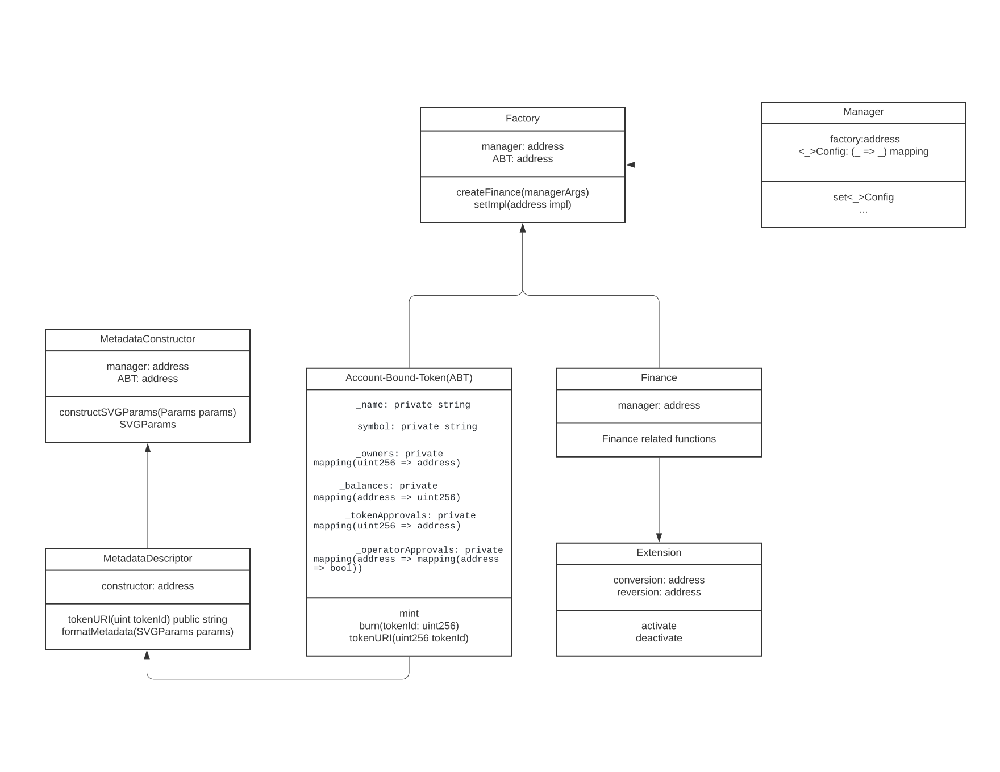

## 摘要

本 EIP 提出了一种智能合约设计模式和一种新的账户抽象方式，用于管理个人财务，即使在金融运营商的控制下，也能确保投资管理的透明度和自我主权的保护。本 EIP 通过为每个人提供个人财务合约，从而实现更大的资产自我主权。个人智能合约中明确规定了投资者的资金和运营费用之间的分离，因此投资者可以确保运营团队的控制不会造成任意资金损失。

本 EIP 扩展了 [ERC-5114](./eip-5114.md)，以进一步实现将资金转移到其他账户，从而实现管理多个钱包之间的流动性。

## 动机

去中心化金融（DeFi）面临着信任问题。智能合约通常是代理，合约的实际逻辑隐藏在单独的逻辑合约中。许多项目都包含一个具有不必要强大权限的多重签名“钱包”。而且，无法独立验证稳定币是否拥有足够的真实资产来继续维持其挂钩，从而造成了大量的资金损失（例如 Celsius 的正式破产公告以及 UST 脱钩和 Anchor 协议失败中所发生的情况）。不应信任交易所或其他第三方来管理自己在 Web3.0 中拥有运营商影响力的投资。

智能合约最好以代码形式实现的双方之间的承诺，但当前的 DeFi 合约通常使用少于 7 个智能合约来管理其所有投资者的资金，并且通常拥有一个具有完全控制权的受信任密钥。这显然是一个问题，因为投资者必须信任合约运营商的资金，这意味着用户实际上并不拥有自己的资金。

与将混合基金财务数据存储在运营团队的合约中相比，使用个人财务合约的模式也提供了更高的透明度。与一个全局智能合约的活动相比，使用个人财务合约更容易跟踪账户的活动。该模式引入了一个非同质化的账户绑定代币（ABT）来存储来自个人财务合约的凭证。

### 链下身份与凭证上的灵魂绑定代币

本 EIP 提供了一种更好的替代方案来代替那些接管整个系统的链下身份解决方案，因为它们的后端最终依赖于运营商的信任，而不是密码学证明（例如，工作量证明、权益证明等）。链下身份作为凭证与加密货币的整个前提直接对立。灵魂绑定代币是一种更好、可验证的凭证，链下存储的数据仅用于存储代币元数据。

## 规范

本文档中的关键字“必须”，“禁止”，“必需”，“应”，“不应”，“应该”，“不应该”，“推荐”，“可能”和“可选”应按照 RFC 2119 中的描述进行解释。

该规范由 **交互** 和 **治理** 的两种模式组成。

### 交互

#### 接口

交互模式由 4 个组件组成，用于交互：管理器、工厂、财务、账户绑定代币和扩展。

交互合约模式由以下合约定义：

- 一个灵魂绑定或账户绑定代币合约，用于授予访问权限以使用凭证与金融合约进行交互
- 一个管理器合约，作为与投资者的第一个联系点
- 一个工厂合约，用于为每个用户创建金融合约
- 一个可以与投资者交互的金融合约

#### 要求

灵魂绑定或账户绑定代币合约由以下属性定义：

1. 它应是非同质化的，并且必须满足 [ERC-721](./eip-721.md)。
2. 凭证应通过 `tokenURI()` 函数以其元数据表示。
3. 它必须仅引用工厂来验证其铸造。
4. 如果它是可转移的，则它是账户绑定的。否则，它是灵魂绑定的。

管理器合约由以下属性定义：

1. 它必须是唯一调用工厂创建的合约类型。
2. 它应存储所有与财务参数相关的配置。

工厂合约由以下属性定义：

1. 它应使用统一的实现来克隆金融合约。
2. 它必须是唯一可以铸造账户绑定代币的合约。
3. 它必须保留最近的账户绑定代币 ID。

金融合约由以下属性定义：

1. 金融合约必须只能从工厂合约的构造函数中初始化一次。
2. 除非拥有灵魂绑定或账户绑定代币的发送者签名同意，否则合约中的资金不得转移到其他合约或账户。
3. 智能合约的每个状态更改函数必须仅接受拥有灵魂绑定或账户绑定代币的发送者，除非是全局函数（例如，清算）。
4. 全局函数应注释为 `/* global */`，以表明该函数可以被任何人访问。
5. 每个金融合约应能够仅表示与拥有账户绑定代币的人发生的交易。
6. 如果灵魂绑定代币用于访问，则金融合约必须能够仅表示拥有私钥的人和金融合约之间发生的交易。

#### 合约



<center>
[ERC-5252](eip-5252.md) 的合约图
</center>

**`Manager`**：**`Manager`** 合约充当与投资者交互的入口点。该合约还存储 **`Finance`** 合约的参数。

**`Factory`**：**`Factory`** 合约管理合约字节码，用于创建管理投资者资金的合约，并在 **`Manager`** 合约的批准下克隆 **`Finance`** 合约。它还铸造账户绑定代币以与 `Finance` 合约交互。

**`Finance`**：**`Finance`** 合约指定管理投资者资金的所有规则。该合约只能通过拥有帐户绑定代币的帐户访问。当投资者将资金存入 **`Manager`** 合约时，该合约会在分离运营费用后将资金发送到 **`Finance`** 合约帐户。

**`Account-bound token`**：本 EIP 中的 **`Account-bound token`** 合约可以获取 **`Finance`** 合约的数据并添加元数据。例如，如果存在货币市场贷款
**`Finance`** 合约，它的 **`Account-bound token`** 可以使用 SVG 显示协议中还有多少余额。

**`Extension`**：**`Extension`** 合约是另一个可以利用 **`Finance`** 合约中锁定资金的合约。该合约可以在 **`Manager`** 合约中管理的运营商批准下访问 **`Finance`** 合约。`Extension` 的示例用例可以是会员资格。

**`Metadata`**: **`Metadata`** 合约是存储与帐户凭据相关的元数据的合约。凭证相关数据存储在特定密钥中。图像通常显示为 SVG，但也可以使用链下图像。

---

### 治理

治理模式由 2 个组件组成：影响者和管理者。

#### 接口

#### 要求

影响者合约由以下属性定义：

1. 该合约应管理投票的乘数。
2. 该合约应设置一个小数来计算标准化分数。
3. 该合约应设置一个函数，供治理机构决定因子参数。

管理者合约由以下属性定义：

1. 该合约必须满足 OpenZeppelin 的管理者合约。
2. 该合约应参考影响者合约获取乘数
3. 该合约必须限制帐户绑定代币的转移，一旦声明，以防止重复投票。

#### 从代币治理到基于贡献的治理

|             | 代币治理                     | 基于凭证的治理                   |
| ----------- | ---------------------------- | ---------------------------------- |
| 强制执行    | 更多代币，更多权力          | 更多贡献，更多权力                |
| 激励        | 更多代币，更多激励          | 更多贡献，更多激励                |
| 惩罚        | 没有惩罚                     | 权力丧失                         |
| 分配        | 持有代币的人                 | 拥有最大影响力的人               |

<center>
代币治理与基于凭证的治理
</center>

代币治理是不可持续的，因为它将 **更多** 权力赋予“最想统治的人”。任何获得超过 51% 代币供应的个人都可以强制控制。

需要考虑对协议做出贡献的新治理，因为：

- **统治者可能会因违反协议而受到惩罚**
- **统治者可以更有效地激励维护协议**

权力应该赋予“最负责任的人”。投票权不是由锁定或拥有的代币决定，而是由账户绑定代币 (ABT) 中标记的贡献决定。本 EIP 将这种形式的投票权定义为 **`Influence`**。

#### 计算影响力

**`Influence`** 是对已抵押代币的乘数，可将 DAO 更多的投票权赋予其贡献者。要获得 **`Influence`**，需要根据加权贡献矩阵计算分数。然后，对分数进行标准化，以给出成员在整个分布中的位置。最后，根据每个社区成员的位置确定乘数。

#### 计算分数

权重表示每个因素的相对重要性。总重要性是因素的总和。社区可以添加更多可以在提交提案时进行标准化的因素。

|     | 描述                                                                                   |
| --- | -------------------------------------------------------------------------------------- |
| α   | 当前提案中每个 **`Finance`** 合约的贡献值                                                 |
| β   | 他们从当前提案的时间戳开始，为每个合约维护 **`Finance`** 的时间                             |

```math
(每个ABT的分数) = α * (贡献值) + β * (abt从现在起被维护的时间)
```

#### 归一化

归一化适用于 DAO 中用户贡献的数据完整性。
标准化分数可以从提交提案的状态计算出来

```math
(每个 ABT 的标准化分数) = α * (贡献值)/(提交 tx 时的总贡献值) + β * (abt 维护的时间)/(从创世到提案创建所经过的时间)
```

并且值介于 0 和 1 之间（因为 α + β = 1）。

#### 乘数

乘数是根据基本因子 (b) 和乘数 (m) 线性确定的。

影响力的等式为：

```math
(influence) = m * (sum(normalized_score))
```

#### 例子

例如，如果一个用户有 3 个 **`Account-bound tokens`**，每个代币的标准化分数分别为 1.0、0.5、0.3，锁定代币为 100，乘数为 0.5，基本因子为 1.5。那么总影响力为

````math
0.5 * {(1.0 + 0.5 + 0.3) / 3} + 1.5 = 1.8

 总投票权为

```math
(voting power) = 1.8 * sqrt(100)  = 18
````

#### 质押者与执行者

|              | 质押者                           | 执行者                                                                                       |
| ------------ | --------------------------------- | ------------------------------------------------------------------------------------------- |
| 角色         | 质押治理代币进行投票             | 对系统做出贡献，可以提出更改规则的提案，拥有更多投票权，例如 1.5                               |
| 人数         | 很多                              | 少量                                                                                       |
| 贡献         | 影响较小                       | 影响较大                                                                                     |
| 影响力       | sqrt(已锁定代币)                  | 影响力 \* sqrt(已锁定代币)                                                                    |

<center>
质押者与执行者
</center>

**质押者**：质押者是投票支持执行者的提案并获得质押代币股息的人

**执行者**：执行者是承担管理协议风险并通过提出提案并对其进行更改来为协议做出贡献的人。

#### 合约

**`Influencer`**：**`Influencer`** 合约存储影响力配置，并根据用户在注册的账户绑定代币合约中所做的活动来衡量用户的贡献。该合约会锁定该账户绑定代币，直到提案最终确定。

**`Governor`**：**`Governor`** 合约与 OpenZeppelin 中的当前管理者合约兼容。对于其特殊用例，它配置了影响者管理和访问 **`Manager`** 配置参数更改的因素。只有 `Enforcer` 才能提出新参数。

## 理由

### 节省最终用户的 Gas 费用

如果应用克隆工厂模式，使用多个合约（而不是单个合约）的 Gas 成本实际上可以长期节省 Gas。一个在全球范围内存储用户状态的合约意味着每个用户实际上在与合约交互后都在为其他用户的存储成本付费。例如，这意味着 MakerDAO 的合约运营成本有时超过 0.1 ETH，限制了用户 CDP 的最低存款额，以节省 Gas 成本。为了解决将来用户交互中低效的 n 倍收取 Gas 成本的问题，每个用户都使用一个合约。

#### 分离投资者资金和运营资金

智能合约中明确规定了投资者资金和运营费用之间的分离，因此投资者可以确保运营团队的控制不会造成任意资金损失。

## 向后兼容性

此 EIP 没有已知的向后兼容性问题。

## 参考实现

[参考实现](../assets/eip-5252/README.md) 是一个简单的存款账户合约，作为 `Finance` 合约，其贡献值 α 用 ETH 的存款金额衡量。

## 安全注意事项

- **`Factory`** 合约必须确保每个 **`Finance`** 合约都在工厂中注册，并检查 **`Finance`** 合约是否正在发送与其绑定所有者相关的交易。

- 应在 **`Manager`** 合约或 **`Finance`** 合约的每个用户函数中应用重入攻击防护或在 delegatecall 之前更改状态。否则，**`Finance`** 可以双倍生成并破坏整个索引。

- 一旦用户锁定对提案投票的影响力，**`Account Bound Token`** 就不能转移到另一个钱包。否则，可能会发生双重影响力。

## 版权

版权和相关权利通过 [CC0](../LICENSE.md) 放弃。
