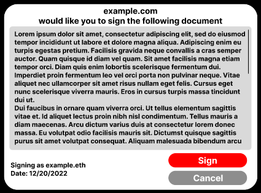

```md
---
eip: 5289
title: 以太坊公证人接口
description: 允许智能合约在链下具有法律约束力
author: Gavin John (@Pandapip1)
discussions-to: https://ethereum-magicians.org/t/pr-5289-discussion-notary-interface/9980
status: 审查
type: 标准追踪
category: ERC
created: 2022-07-16
requires: 165, 5568
---

## 摘要

目前，智能合约的现实世界应用受到它们不具有法律约束力的限制。此 EIP 提出了一个标准，通过提供法律文件的 IPFS 链接并确保智能合约的用户与相关法律文件具有私密性，使智能合约具有法律约束力。

请注意，作者不是律师，并且此 EIP 不是法律建议。

## 动机

NFT 经常被标榜为持有和证明特定作品版权的方式。然而，在实践中，这种情况几乎从未发生过。大多数时候，NFT 没有法律约束力，在极少数情况下，NFT 确实具有法律约束力，但 NFT 仅为初始持有者提供使用该作品的有限许可（但不能为任何未来的持有者提供任何许可）。

## 规范

本文档中的关键词“必须”，“禁止”，“需要”，“应该”，“不应该”，“推荐”，“可以”和“可选”应按照 RFC 2119 中的描述进行解释。

### 法律合同库接口

```solidity
/// SPDX-License-Identifier: CC0-1.0
pragma solidity ^0.8.0;

import "./IERC165.sol";

interface IERC5289Library is IERC165 {
    /// @notice 当调用 signDocument 时触发
    event DocumentSigned(address indexed signer, uint16 indexed documentId);
    
    /// @notice 法律文件的不可变链接（建议托管在 IPFS 上）。这必须使用通用的文件格式，例如 PDF、HTML、TeX 或 Markdown。
    function legalDocument(uint16 documentId) external view returns (string memory);
    
    /// @notice 返回给定用户是否已签署文档。
    function documentSigned(address user, uint16 documentId) external view returns (bool signed);

    /// @notice 返回给定用户签署文档的时间。
    /// @dev 如果用户未签署文档，则时间戳可以是任何值。
    function documentSignedAt(address user, uint16 documentId) external view returns (uint64 timestamp);

    /// @notice 签署文档
    /// @dev 这必须由智能合约验证。这必须触发 DocumentSigned 或抛出异常。
    function signDocument(address signer, uint16 documentId) external;
}
```

### 请求签名

要请求签署某些文档，请使用 [ERC-5568](./eip-5568.md) 信号恢复。`instruction_data` 的格式是一个 ABI 编码的 `(address, uint16)` 对，其中 address 是库的地址，`uint16` 是文档的 `documentId`：

```solidity
throw WalletSignal24(0, 5289, abi.encode(0xcbd99eb81b2d8ca256bb6a5b0ef7db86489778a7, 12345));
```

### 签署文档

当请求签名时，钱包必须调用 `legalDocument`，向用户显示结果文档，并提示他们签署文档或取消：



如果用户同意，钱包必须调用 `signDocument`。

## 理由

- 选择 `uint64` 作为时间戳返回类型，因为 64 位时间寄存器是标准配置。
- 选择 `uint16` 作为文档 ID，因为 65536 个文档可能足以满足任何用例，并且合约始终可以重新部署。
- `signDocument` 不采用 ECDSA 签名，以便将来与帐户抽象兼容。此外，未来的扩展可以提供此功能。
- IPFS 是强制性的，因为可以证明签名文档的真实性。

## 向后兼容性

未发现向后兼容性问题。

## 参考实现

请参阅 [`IERC5289Library`](../assets/eip-5289/interfaces/IERC5289Library.sol), [`ERC5289Library`](../assets/eip-5289/ERC5289Library.sol)。

## 安全考虑

用户可以声称他们的私钥被盗并用于欺诈性地“签署”合同。因此，**文档的性质必须是允许的，而不是限制性的。** 例如，授予使用附加到 NFT 的图像的许可的文档是可以接受的，因为签名者没有理由合理地否认签署该文档。

## 版权

版权和相关权利通过 [CC0](../LICENSE.md) 放弃。
```