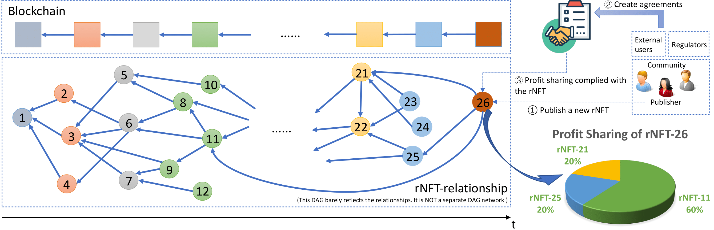

```md
---
eip: 5521
title: 可引用 NFT
description: 用于构建 NFT 之间引用关系的 ERC-721 扩展
author: Saber Yu (@OniReimu), Qin Wang <qin.wang@data61.csiro.au>, Shange Fu <shange.fu@monash.edu>, Yilin Sai <yilin.sai@data61.csiro.au>, Shiping Chen <shiping.chen@data61.csiro.au>, Sherry Xu <xiwei.xu@data61.csiro.au>, Jiangshan Yu <jiangshan.yu@monash.edu>
discussions-to: https://ethereum-magicians.org/t/eip-x-erc-721-referable-nft/10310
status: Final
type: Standards Track
category: ERC
created: 2022-08-10
requires: 165, 721
---

## 摘要

本标准是 [ERC-721](./eip-721.md) 的扩展。它提出了两个可引用指标，即 `referring`（引用）和 `referred`（被引用），以及一个基于时间的指标 `createdTimestamp`（创建时间戳）。每个 NFT 之间的关系形成一个有向无环图 (DAG)。该标准允许用户查询、跟踪和分析它们的关系。



## 动机

许多场景需要 NFT 的继承、引用和扩展。例如，一位艺术家可能会基于之前的 NFT 开发他的 NFT 作品，或者一位 DJ 可能会通过引用两首流行歌曲来重新混合他的唱片等。现有 NFT 标准的一个差距是 NFT 与其原始创建者之间缺乏已建立的关系。这种空白隔离了 NFT，使得每个 NFT 的销售都变成一次性交易，从而阻碍了创作者随着时间的推移获得其知识产权的全部价值。

从这个意义上讲，为现有 NFT 提出一种可引用的解决方案，以便能够对交叉引用进行高效查询是必要的。通过在 NFT 之间引入引用关系，可以建立一种可持续的经济模型，以激励持续参与 NFT 的创建、使用和推广。

因此，本标准引入了一个新概念，即可引用 NFT (rNFT)，它可以将静态 NFT 转换为动态可扩展的网络。我们嵌入了引用信息，包括 `referring` 和 `referred` 关系，有助于形成基于有向无环图 (DAG) 的 NFT 网络。这种结构提供了透明的图形化历史记录，并允许用户查询、跟踪和分析关系。它可以使 NFT 创作者能够在现有作品的基础上进行构建，而无需从头开始。

一个直观的例子：用户可以通过引用现有的 NFT（A、B）来创建新的 NFT（C、D、E），而 `referred` 函数会告知原始 NFT（A、B）它们被引用了（例如，A &#8592; D；C &#8592; E；B &#8592; E 和 A &#8592; E）。在这里，`createdTimestamp`（块级别）用作 NFT（A、B、C、D、E）创建时间的指标。

### 主要收获

该标准提供了几个优点：

*清晰的所有权继承*：该标准将静态 NFT 扩展为虚拟可扩展的 NFT 网络。艺术家不必创作与其他作品隔离的作品。所有权继承避免了重复发明轮子。

*激励兼容性*：该标准阐明了不同 NFT 之间的可引用关系，有助于整合多个上层激励模型，以激励原始 NFT 所有者和新创作者。

*易于集成*：该标准使现有 Token 标准或第三方协议更容易集成。例如，rNFT 可以应用于可租赁场景（参见 [ERC-5006](./eip-5006.md)）以构建分层租赁市场，其中多个用户可以在同一时间租赁相同的 NFT，或者一个用户可以在同一duration（持续时间）内租赁多个 NFT）。

*可扩展的互操作性*：该标准支持跨合约引用，为更广泛的公众提供了可扩展的采用，并具有更强的互操作性。

## 规范

本文档中使用的关键词“MUST”、“MUST NOT”、“REQUIRED”、“SHALL”、“SHALL NOT”、“SHOULD”、“SHOULD NOT”、“RECOMMENDED”、“MAY”和“OPTIONAL”应按照 RFC 2119 中的描述进行解释。

- `UpdateNode`：当调用 `setNode` 时发出的事件；
- `safeMint`：铸造一个新的 rNFT；
- `setNode`：设置 rNFT 的引用列表，并更新引用列表中每个 rNFT 的被引用列表；
    - `setNodeReferring`：设置 rNFT 的引用列表；
    - `setNodeReferred`：设置给定 rNFT 的被引用列表，这些 rNFT 来自不同的合约地址；
        - `setNodeReferredExternal`：设置给定 rNFT 的被引用列表，这些 rNFT 来自外部合约；
- `referringOf`：获取 rNFT 的引用列表；
- `referredOf`：获取 rNFT 的被引用列表；
- `createdTimestampOf`：获取 rNFT 被创建时的时间戳。

本标准的实现者**必须**具有以下所有函数：

```solidity

pragma solidity ^0.8.4;

import "@openzeppelin/contracts/utils/introspection/IERC165.sol";

interface IERC_5521 is IERC165 {

    /// Logged when a node in the rNFT gets referred and changed.
    /// @notice Emitted when the `node` (i.e., an rNFT) is changed.
    // 当 rNFT 中的节点被引用和更改时记录。
    // @notice 当 `node`（即 rNFT）更改时发出。
    event UpdateNode(uint256 indexed tokenId, 
                     address indexed owner, 
                     address[] _address_referringList,
                     uint256[][] _tokenIds_referringList,
                     address[] _address_referredList,
                     uint256[][] _tokenIds_referredList
    );

    /// @notice set the referred list of an rNFT associated with different contract addresses and update the referring list of each one in the referred list. Checking the duplication of `addresses` and `tokenIds` is **RECOMMENDED**.
    // @notice 设置与不同合约地址关联的 rNFT 的被引用列表，并更新被引用列表中每个合约地址的引用列表。**建议**检查 `addresses` 和 `tokenIds` 是否重复。
    /// @param `tokenId` of rNFT being set. `addresses` of the contracts in which rNFTs with `tokenIds` being referred accordingly. 
    // @param 要设置的 rNFT 的 `tokenId`。相应地，rNFT 与 `tokenIds` 被引用的合约的 `addresses`。
    /// @requirement 
    // @requirement （要求）
    /// - the size of `addresses` **MUST** be the same as that of `tokenIds`;
    // - `addresses` 的大小**必须**与 `tokenIds` 的大小相同。
    /// - once the size of `tokenIds` is non-zero, the inner size **MUST** also be non-zero;
    // - 一旦 `tokenIds` 的大小非零，则内部大小**必须**也非零。
    /// - the `tokenId` **MUST** be unique within the same contract;
    // - `tokenId` 在同一合约中**必须**是唯一的。
    /// - the `tokenId` **MUST NOT** be the same as `tokenIds[i][j]` if `addresses[i]` is essentially `address(this)`.
    // - 如果 `addresses[i]` 本质上是 `address(this)`，则 `tokenId` **不得**与 `tokenIds[i][j]` 相同。
    function setNode(uint256 tokenId, address[] memory addresses, uint256[][] memory tokenIds) external;

    /// @notice get the referring list of an rNFT.
    // @notice 获取 rNFT 的引用列表。
    /// @param `tokenId` of the rNFT being focused, `_address` of contract address associated with the focused rNFT.
    // @param 关注的 rNFT 的 `tokenId`，与关注的 rNFT 关联的合约地址 `_address`。
    /// @return the referring mapping of the rNFT.
    // @return rNFT 的引用映射。
    function referringOf(address _address, uint256 tokenId) external view returns(address[] memory, uint256[][] memory);

    /// @notice get the referred list of an rNFT.
    // @notice 获取 rNFT 的被引用列表。
    /// @param `tokenId` of the rNFT being focused, `_address` of contract address associated with the focused rNFT.
    // @param 关注的 rNFT 的 `tokenId`，与关注的 rNFT 关联的合约地址 `_address`。
    /// @return the referred mapping of the rNFT.
    // @return rNFT 的被引用映射。
    function referredOf(address _address, uint256 tokenId) external view returns(address[] memory, uint256[][] memory);

    /// @notice get the timestamp of an rNFT when is being created.
    // @notice 获取 rNFT 创建时的时间戳。
    /// @param `tokenId` of the rNFT being focused, `_address` of contract address associated with the focused rNFT.
    // @param 关注的 rNFT 的 `tokenId`，与关注的 rNFT 关联的合约地址 `_address`。
    /// @return the timestamp of the rNFT when is being created with uint256 format.
    // @return rNFT 创建时的时间戳，格式为 uint256。
    function createdTimestampOf(address _address, uint256 tokenId) external view returns(uint256);
    
    /// @notice check supported interfaces, adhereing to ERC165.
    // @notice 检查支持的接口，遵守 ERC165。
    function supportsInterface(bytes4 interfaceId) external view returns (bool);
}

interface TargetContract is IERC165 {
    /// @notice set the referred list of an rNFT associated with external contract addresses. 
    // @notice 设置与外部合约地址关联的 rNFT 的被引用列表。
    /// @param `_tokenIds` of rNFTs associated with the contract address `_address` being referred by the rNFT with `tokenId`.
    // @param 与合约地址 `_address` 关联的 rNFT 的 `_tokenIds`，这些 rNFT 被具有 `tokenId` 的 rNFT 引用。
    /// @requirement
    // @requirement （要求）
    /// - `_address` **MUST NOT** be the same as `address(this)` where `this` is executed by an external contract where `TargetContract` interface is implemented.
    // - `_address` **不得**与 `address(this)` 相同，其中 `this` 由实现了 `TargetContract` 接口的外部合约执行。
    function setNodeReferredExternal(address _address, uint256 tokenId, uint256[] memory _tokenIds) external;

    function referringOf(address _address, uint256 tokenId) external view returns(address[] memory, uint256[][] memory);

    function referredOf(address _address, uint256 tokenId) external view returns(address[] memory, uint256[][] memory);

    function createdTimestampOf(address _address, uint256 tokenId) external view returns(uint256);
    
    function supportsInterface(bytes4 interfaceId) external view returns (bool);
}

```

## 原理

### 这个事件是否足够信息丰富？
`UpdateNode`：此事件传播关键信息，包括 rNFT ID、其所有者以及合约地址/ID 列表，其中 rNFT 引用或被该主题 rNFT 引用。此数据集使利益相关者能够有效地管理和导航 rNFT 生态系统中固有的复杂关系网络。

实现者可以自由选择使用结构体（参考实现中给出了推荐的结构体），或几个单独的映射，或任何其他存储机制。只要其输出能够满足 `UpdateNode` 事件，所选择的任何机制对合约的行为都没有可观察到的影响。

### 为什么需要 `createdTimestampOf`？
`createdTimestamp`：此标准的一个关键原则是 rNFT 应该引用已被社区接受的内容（参与者已知的时间序列）。因此，rNFT 的全局时间戳至关重要，有助于防止冲突状态（类似于事务处理和块组织中的并发问题）。我们定义了一个块级别的时间戳，其中 `createdTimestamp = block.timestamp`。请注意，鉴于引用的粒度与块时间戳相关联，因此无法区分同一块中两个 rNFT 的顺序。

### 如何执行跨合约引用？
`setNodeReferredExternal`：此函数有条件地运行，具体取决于外部合约中接口验证的成功与否。这种选择性调用确保了与现有合约的向后兼容性和集成，前提是它们遵循指定的接口。

## 向后兼容性

通过添加扩展函数集，此标准可以完全与 [ERC-721](./eip-721.md) 兼容。

## 测试用例

测试用例包含在 [ERC_5521.test.js](../assets/eip-5521/ERC_5521.test.js) 中。

## 参考实现

推荐的实现如下所示：

- `Relationship`：一个结构体，包含 `referring`、`referred`、`referringKeys`、`referredKeys`、`createdTimestamp` 和其他自定义和可选属性（即，不一定包含在该标准中），例如 `privityOfAgreement` 记录创建可引用 NFT (rNFT) 时被引用 NFT 的所有权，或者 `profitSharing` 记录 `referring` 的利润分成。
- `referring`：出度指示器，用于显示此 NFT 引用了哪些用户；
- `referred`：入度指示器，用于显示哪些用户引用了此 NFT；
- `referringKeys`：用于出度指示器映射转换的辅助函数，用于事件；
- `referredKeys`：用于入度指示器映射转换的辅助函数，用于事件；
- `createdTimestamp`：基于时间的指示器，用于比较铸造时间戳，调用者不应以任何方式对其进行编辑。
- `referringOf` 和 `referredOf`：首先，当前的 `referringOf` 和 `referredOf` 允许跨合约查找，而这无法通过直接访问 `_relationship` 来完成。其次，只有在不涉及隐私问题的情况下，使 `_relationship` 公开才能通过依赖 Solidity 自动生成的 getter 来简化合约。但是，如果您需要控制数据的可见性，则最好保持状态变量私有并提供特定的 getter 函数。例如，如果 `_relationship` 包含有关特定用户交互或交易的详细信息或一些私有可扩展参数（在更新的版本中，我们特别强调 `Relationship` 可以扩展以满足不同的需求），始终公开此数据可能会泄露用户的行为模式或偏好，从而导致潜在的隐私泄露。
- `convertMap`：此函数对于检索结构体中的完整映射内容至关重要。即使 `_relationship` 是公共的，getter 也只允许检索特定键的单个值。由于我们需要全面访问所有存储的地址，因此 `convertMap` 对于满足我们的事件触发要求是必不可少的。

```solidity

pragma solidity ^0.8.4;

import "@openzeppelin/contracts/token/ERC721/ERC721.sol";
import "./IERC_5521.sol";

contract ERC_5521 is ERC721, IERC_5521, TargetContract {

    struct Relationship {
        mapping (address => uint256[]) referring;
        mapping (address => uint256[]) referred;
        address[] referringKeys;
        address[] referredKeys;
        uint256 createdTimestamp; // unix timestamp when the rNFT is being created
        // rNFT 创建时的 Unix 时间戳

        // extensible parameters
        // 可扩展参数
        // ...
    }

    mapping (uint256 => Relationship) internal _relationship;
    address contractOwner = address(0);

    constructor(string memory name_, string memory symbol_) ERC721(name_, symbol_) {
        contractOwner = msg.sender;
    }

    function safeMint(uint256 tokenId, address[] memory addresses, uint256[][] memory _tokenIds) public {
        // require(msg.sender == contractOwner, "ERC_rNFT: Only contract owner can mint");
        // require(msg.sender == contractOwner, "ERC_rNFT: 只有合约所有者才能铸造");
        _safeMint(msg.sender, tokenId);
        setNode(tokenId, addresses, _tokenIds);
    }

    /// @notice set the referred list of an rNFT associated with different contract addresses and update the referring list of each one in the referred list
    // @notice 设置与不同合约地址关联的 rNFT 的被引用列表，并更新被引用列表中每个合约地址的引用列表
    /// @param tokenIds array of rNFTs, recommended to check duplication at the caller's end
    // @param tokenIds rNFT 数组，建议在调用者端检查重复项
    function setNode(uint256 tokenId, address[] memory addresses, uint256[][] memory tokenIds) public virtual override {
        require(
            addresses.length == tokenIds.length,
            "Addresses and TokenID arrays must have the same length"
            // "地址和 TokenID 数组的长度必须相同"
        );
        for (uint i = 0; i < tokenIds.length; i++) {
            if (tokenIds[i].length == 0) { revert("ERC_5521: the referring list cannot be empty"); }
            // if (tokenIds[i].length == 0) { revert("ERC_5521: 引用列表不能为空"); }
        }
        setNodeReferring(addresses, tokenId, tokenIds);
        setNodeReferred(addresses, tokenId, tokenIds);
    }

    /// @notice set the referring list of an rNFT associated with different contract addresses 
    // @notice 设置与不同合约地址关联的 rNFT 的引用列表
    /// @param _tokenIds array of rNFTs associated with addresses, recommended to check duplication at the caller's end
    // @param _tokenIds 与地址关联的 rNFT 数组，建议在调用者端检查重复项
    function setNodeReferring(address[] memory addresses, uint256 tokenId, uint256[][] memory _tokenIds) private {
        require(_isApprovedOrOwner(msg.sender, tokenId), "ERC_5521: transfer caller is not owner nor approved");
        // require(_isApprovedOrOwner(msg.sender, tokenId), "ERC_5521: 转移调用者不是所有者，也没有获得批准");

        Relationship storage relationship = _relationship[tokenId];

        for (uint i = 0; i < addresses.length; i++) {
            if (relationship.referring[addresses[i]].length == 0) { relationship.referringKeys.push(addresses[i]); } // Add the address if it's a new entry
            // if (relationship.referring[addresses[i]].length == 0) { relationship.referringKeys.push(addresses[i]); } // 如果是新条目，则添加地址
            relationship.referring[addresses[i]] = _tokenIds[i];
        }

        relationship.createdTimestamp = block.timestamp;
        emitEvents(tokenId, msg.sender);
    }

    /// @notice set the referred list of an rNFT associated with different contract addresses 
    // @notice 设置与不同合约地址关联的 rNFT 的被引用列表
    /// @param _tokenIds array of rNFTs associated with addresses, recommended to check duplication at the caller's end
    // @param _tokenIds 与地址关联的 rNFT 数组，建议在调用者端检查重复项
    function setNodeReferred(address[] memory addresses, uint256 tokenId, uint256[][] memory _tokenIds) private {
        for (uint i = 0; i < addresses.length; i++) {
            if (addresses[i] == address(this)) {
                for (uint j = 0; j < _tokenIds[i].length; j++) {
                    Relationship storage relationship = _relationship[_tokenIds[i][j]];
                    if (relationship.referred[addresses[i]].length == 0) { relationship.referredKeys.push(addresses[i]); } // Add the address if it's a new entry
                    // if (relationship.referred[addresses[i]].length == 0) { relationship.referredKeys.push(addresses[i]); } // 如果是新条目，则添加地址
                    
                    require(tokenId != _tokenIds[i][j], "ERC_5521: self-reference not allowed");
                    // require(tokenId != _tokenIds[i][j], "ERC_5521: 不允许自引用");
                    if (relationship.createdTimestamp >= block.timestamp) { revert("ERC_5521: the referred rNFT needs to be a predecessor"); } // Make sure the reference complies with the timing sequence
                    // if (relationship.createdTimestamp >= block.timestamp) { revert("ERC_5521: 被引用的 rNFT 需要是一个前任"); } // 确保引用符合时序

                    relationship.referred[address(this)].push(tokenId);
                    emitEvents(_tokenIds[i][j], ownerOf(_tokenIds[i][j]));
                }
            } else {
                TargetContract targetContractInstance = TargetContract(addresses[i]);
                bool isSupports = targetContractInstance.supportsInterface(type(TargetContract).interfaceId);
                if (isSupports) {
                    // The target contract supports the interface, safe to call functions of the interface.
                    // 目标合约支持该接口，可以安全地调用该接口的函数。
                    targetContractInstance.setNodeReferredExternal(address(this), tokenId, _tokenIds[i]);
                }
            }
        }
    }

    /// @notice set the referred list of an rNFT associated with different contract addresses 
    // @notice 设置与不同合约地址关联的 rNFT 的被引用列表
    /// @param _tokenIds array of rNFTs associated with addresses, recommended to check duplication at the caller's end
    // @param _tokenIds 与地址关联的 rNFT 数组，建议在调用者端检查重复项
    function setNodeReferredExternal(address _address, uint256 tokenId, uint256[] memory _tokenIds) external {
        for (uint i = 0; i < _tokenIds.length; i++) {
            Relationship storage relationship = _relationship[_tokenIds[i]];
            if (relationship.referred[_address].length == 0) { relationship.referredKeys.push(_address); } // Add the address if it's a new entry
            // if (relationship.referred[_address].length == 0) { relationship.referredKeys.push(_address); } // 如果是新条目，则添加地址

            require(_address != address(this), "ERC_5521: this must be an external contract address");
            // require(_address != address(this), "ERC_5521: 这必须是一个外部合约地址");
            if (relationship.createdTimestamp >= block.timestamp) { revert("ERC_5521: the referred rNFT needs to be a predecessor"); } // Make sure the reference complies with the timing sequence
            // if (relationship.createdTimestamp >= block.timestamp) { revert("ERC_5521: 被引用的 rNFT 需要是一个前任"); } // 确保引用符合时序

            relationship.referred[_address].push(tokenId);
            emitEvents(_tokenIds[i], ownerOf(_tokenIds[i]));
        }
    }

    /// @notice Get the referring list of an rNFT
    // @notice 获取 rNFT 的引用列表
    /// @param tokenId The considered rNFT, _address The corresponding contract address
    // @param tokenId 要考虑的 rNFT，_address 对应的合约地址
    /// @return The referring mapping of an rNFT
    // @return rNFT 的引用映射
    function referringOf(address _address, uint256 tokenId) external view virtual override(IERC_5521, TargetContract) returns (address[] memory, uint256[][] memory) {
        address[] memory _referringKeys;
        uint256[][] memory _referringValues;

        if (_address == address(this)) {
            require(_exists(tokenId), "ERC_5521: token ID not existed");
            // require(_exists(tokenId), "ERC_5521: Token ID 不存在");
            (_referringKeys, _referringValues) = convertMap(tokenId, true);
        } else {
            TargetContract targetContractInstance = TargetContract(_address);
            require(targetContractInstance.supportsInterface(type(TargetContract).interfaceId), "ERC_5521: target contract not supported");
            // require(targetContractInstance.supportsInterface(type(TargetContract).interfaceId), "ERC_5521: 目标合约不支持");
            (_referringKeys, _referringValues) = targetContractInstance.referringOf(_address, tokenId);     
        }      
        return (_referringKeys, _referringValues);
    }

    /// @notice Get the referred list of an rNFT
    // @notice 获取 rNFT 的被引用列表
    /// @param tokenId The considered rNFT, _address The corresponding contract address
    // @param tokenId 要考虑的 rNFT，_address 对应的合约地址
    /// @return The referred mapping of an rNFT
    // @return rNFT 的被引用映射
    function referredOf(address _address, uint256 tokenId) external view virtual override(IERC_5521, TargetContract) returns (address[] memory, uint256[][] memory) {
        address[] memory _referredKeys;
        uint256[][] memory _referredValues;

        if (_address == address(this)) {
            require(_exists(tokenId), "ERC_5521: token ID not existed");
            // require(_exists(tokenId), "ERC_5521: Token ID 不存在");
            (_referredKeys, _referredValues) = convertMap(tokenId, false);
        } else {
            TargetContract targetContractInstance = TargetContract(_address);
            require(targetContractInstance.supportsInterface(type(TargetContract).interfaceId), "ERC_5521: target contract not supported");
            // require(targetContractInstance.supportsInterface(type(TargetContract).interfaceId), "ERC_5521: 目标合约不支持");
            (_referredKeys, _referredValues) = targetContractInstance.referredOf(_address, tokenId);           
        }
        return (_referredKeys, _referredValues);
    }

    /// @notice Get the timestamp of an rNFT when is being created.
    // @notice 获取 rNFT 创建时的时间戳。
    /// @param `tokenId` of the rNFT being focused, `_address` of contract address associated with the focused rNFT.
    // @param 关注的 rNFT 的 `tokenId`，与关注的 rNFT 关联的合约地址 `_address`。
    /// @return The timestamp of the rNFT when is being created with uint256 format.
    // @return rNFT 创建时的时间戳，格式为 uint256。
    function createdTimestampOf(address _address, uint256 tokenId) external view returns(uint256) {
        uint256 memory createdTimestamp;

        if (_address == address(this)) {
            require(_exists(tokenId), "ERC_5521: token ID not existed");
            // require(_exists(tokenId), "ERC_5521: Token ID 不存在");
            Relationship storage relationship = _relationship[tokenId];
            createdTimestamp = relationship.createdTimestamp;
        } else {
            TargetContract targetContractInstance = TargetContract(_address);
            require(targetContractInstance.supportsInterface(type(TargetContract).interfaceId), "ERC_5521: target contract not supported");
            // require(targetContractInstance.supportsInterface(type(TargetContract).interfaceId), "ERC_5521: 目标合约不支持");
            createdTimestamp = targetContractInstance.createdTimestampOf(_address, tokenId);            
        }
        return createdTimestamp;
    }

    /// @dev See {IERC165-supportsInterface}.
    // @dev 参见 {IERC165-supportsInterface}。
    function supportsInterface(bytes4 interfaceId) public view virtual override (ERC721, IERC_5521, TargetContract) returns (bool) {
        return interfaceId == type(IERC_5521).interfaceId
            || interfaceId == type(TargetContract).interfaceId
            || super.supportsInterface(interfaceId);    
    }

    // @notice Emit an event of UpdateNode
    // @notice 触发一个 UpdateNode 事件
    function emitEvents(uint256 tokenId, address sender) private {
        (address[] memory _referringKeys, uint256[][] memory _referringValues) = convertMap(tokenId, true);
        (address[] memory _referredKeys, uint256[][] memory _referredValues) = convertMap(tokenId, false);
        
        emit UpdateNode(tokenId, sender, _referringKeys, _referringValues, _referredKeys, _referredValues);
    }

    // @notice Convert a specific `local` token mapping to a key array and a value array
    // @notice 将特定的“本地”Token 映射转换为键数组和值数组
    function convertMap(uint256 tokenId, bool isReferring) private view returns (address[] memory, uint256[][] memory) {
        Relationship storage relationship = _relationship[tokenId];

        address[] memory returnKeys;
        uint256[][] memory returnValues;

        if (isReferring) {
            returnKeys = relationship.referringKeys;
            returnValues = new uint256[][](returnKeys.length);
            for (uint i = 0; i < returnKeys.length; i++) {
                returnValues[i] = relationship.referring[returnKeys[i]];
            }            
        } else {
            returnKeys = relationship.referredKeys;
            returnValues = new uint256[][](returnKeys.length);
            for (uint i = 0; i < returnKeys.length; i++) {
                returnValues[i] = relationship.referred[returnKeys[i]];
            }
        }
        return (returnKeys, returnValues);
    }
}

```

## 安全考虑

### 时间戳

`createdTimestamp` 仅涵盖块级别的时间戳（基于块头），不支持诸如事务级别之类的细粒度比较。

### 所有权和引用

所有权变更与引用关系无关。通常，利润分配符合创建 NFT 时的协议，无论所有权是否发生变更，除非协议中另有规定。

默认情况下，引用一个 Token 不会引用其后代。如果仅引用特定的子 Token，则意味着合约的Privity（私密性）将不涉及此特定子 Token 的所有者以外的任何人。或者，可以构建一条从根 Token 到特定最底层子 Token 的引用链（从根到叶），并将其记录在 `referring` 中，以显式定义利润分配。

### 开放铸造和关系风险

`safeMint` 函数经过精心设计，允许无限制地铸造和设置关系，类似于 Google Scholar 等平台中看到的开放引用系统。 此决策有助于实现强大的灵活性，使任何用户都无需集中控制即可创建和定义 NFT 之间的关系。 虽然此设计与系统的预期开放性相符，但它本质上带有一定的风险。 可能会创建未经授权或不正确的参考，类似于传统学术参考中面临的挑战，在传统学术参考中可能会发生错误的引用。 此外，其开放性可能会使系统容易受到恶意行为者（他们可能会操纵关系或夸大 Token 供应）的潜在滥用。 重要的是要认识到，这些风险不被认为是设计缺陷，而是有意的权衡，可以在系统的灵活性与潜在的可靠性问题之间取得平衡。

利益相关者应注意，链上数据完整性保证仅扩展到区块链上已记录的内容，并不排除链下错误或操纵的可能性。 因此，用户和集成者在解释和使用此系统提供的关系和其他数据时应谨慎行事并进行判断。

## 版权

在 [CC0](../LICENSE.md) 下放弃版权及相关权利。
```