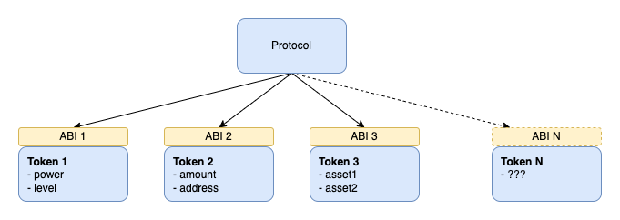
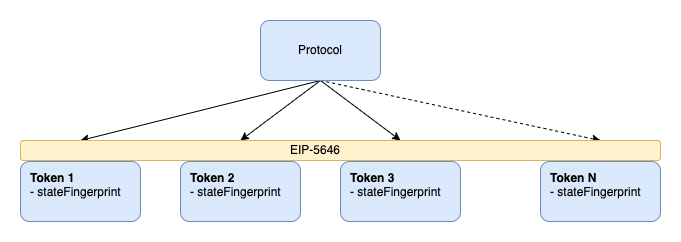

## 摘要

本规范定义了在不知道实现细节的情况下，明确标识可变令牌状态所需的最小接口。

## 动机

目前，协议需要了解令牌的状态属性才能创建明确的标识符。不幸的是，这导致了一个明显的瓶颈，即协议需要专门支持每个新令牌。



## 规范

本文档中的关键词 “MUST”、“MUST NOT”、“SHOULD”、“SHOULD NOT” 和 “MAY” 按照 RFC 2119 中的描述进行解释。

```solidity
pragma solidity ^0.8.0;

interface ERC5646 is ERC165 {

    /// @notice 用于返回当前令牌状态指纹的函数。
    /// @param tokenId 所查询的令牌状态的ID。
    /// @return 当前令牌状态指纹。
    function getStateFingerprint(uint256 tokenId) external view returns (bytes32);

}
```

- 当令牌状态改变时，`getStateFingerprint` MUST 返回不同的值。
- 当令牌状态保持不变时，`getStateFingerprint` MUST NOT 返回不同的值。
- `getStateFingerprint` MUST 包含令牌生命周期中可能改变的所有状态属性（不是不可变的）。
- `getStateFingerprint` MAY 包含计算值，例如基于当前时间戳的值（例如，到期日、成熟日）。
- `getStateFingerprint` MAY 包含令牌元数据 URI。
- `supportsInterface(0xf5112315)` MUST 返回 `true`。

## 理由

协议可以使用状态指纹作为令牌标识符的一部分，并在不知道任何状态实现细节的情况下支持可变令牌。



状态指纹不必考虑不可变的状态属性，因为它们可以通过令牌 ID 安全地识别。

本标准不适用于需要令牌状态属性知识的用例，因为这些情况无法逃脱前面所述的瓶颈问题。

## 向后兼容性

此 EIP 没有引入任何向后不兼容性。

## 参考实现

```solidity
pragma solidity ^0.8.0;

/// @title 实现状态指纹的可变令牌示例。
contract LPToken is ERC721, ERC5646 {

    /// @dev 存储的令牌状态（令牌 ID => 状态）。
    mapping (uint256 => State) internal states;

    struct State {
        address asset1;
        address asset2;
        uint256 amount1;
        uint256 amount2;
        uint256 fee; // 不可变的
        address operator; // 不可变的
        uint256 expiration; // 依赖于 block.timestamp 的参数
    }


    /// @dev 状态指纹获取器。
    /// @param tokenId 所查询的令牌状态的ID。
    /// @return 当前令牌状态指纹。
    function getStateFingerprint(uint256 tokenId) override public view returns (bytes32) {
        State storage state = states[tokenId];

        return keccak256(
            abi.encode(
                state.asset1,
                state.asset2,
                state.amount1,
                state.amount2,
                // state.fee 不需要成为指纹计算的一部分，因为它是不可变的
                // state.operator 不需要成为指纹计算的一部分，因为它是不可变的
                block.timestamp >= state.expiration
            )
        );
    }

    function supportsInterface(bytes4 interfaceId) public view virtual override returns (bool) {
        return super.supportsInterface(interfaceId) ||
            interfaceId == type(ERC5646).interfaceId;
    }

}
```

## 安全考虑

来自两个不同合约的令牌状态指纹可能会冲突。因此，它们应该只在一个令牌合约的上下文中进行比较。

如果 `getStateFingerprint` 实现不包括所有可能改变令牌状态的参数，则令牌所有者将能够在不更改令牌指纹的情况下更改令牌状态。这可能会打破几个协议的无信任假设，这些协议会创建例如令牌的购买报价。令牌所有者将能够在接受报价之前更改令牌的状态。

## 版权

版权及相关权利通过 [CC0](../LICENSE.md) 放弃。