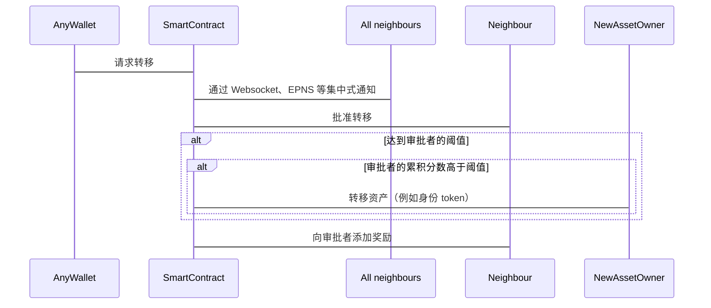

## 摘要

这个 EIP 标准化了一种社交恢复机制，在这种机制中，如果得到来自其他身份的足够批准，token 可以从不可访问的账户转移到新账户。这种批准不仅仅是技术性的，而是需要人为干预。这些人——基于 Soul Bound Token 提案——被称为 Souls。当足够多的 Souls 给出他们的批准（这是一个是/否的决定），并且达到一个阈值时，token 会从旧身份转移到新身份。

## 动机

一个众所周知的问题是，账户的私钥可能会丢失。如果该密钥丢失，则无法恢复该账户拥有的 token。持有人永远失去这些 token。除了直接损害 token 持有者之外，token 本身的整个生态系统也会受到影响：丢失的 token 越多，可用于自然增长和计划演变的 token 就越少。

## 规范

```solidity

pragma solidity ^0.8.7;

interface ISocialRecovery {
    /// @dev 相关的但独立的身份批准转移
    function approveTransfer(address from_, address to_) external;

    /// @dev 用户想要将其链上身份转移到另一个钱包，这需要得到 n 个最近邻身份的批准
    function requestTransfer(address from_, address to_) external payable;

    function addNeighbour(address neighbour_) external;

    function removeNeighbour(address neighbour_) external;
}
```

**其背后的数学原理**：

一个符合规范的合约 SHOULD 使用以下公式计算节点 n 的分数：

$$ score(n) = tanh({ { {\displaystyle\sum_{i = 1}^{|N|} } {log{(n_i^{r} {1 \over t - n_i^{t} + 1})}} \over{|N| + 1}} + n^{r}}) $$

其中：

$t$ 是当前时间（可以是任何时间标识值，例如 `block.timestamp`、`block.number` 等）

$n^{r}$ 是节点 n 的奖励计数

$N$ 是 n 的邻居列表

$n_i^{r}$ 是来自 n 的邻居节点 i 的奖励计数

$n_i^{t}$ 是邻居节点 i 的最后一个时间戳（在该账户上预订了奖励）


**流程**：



## 理由

所提出的公式被认为非常有弹性，并提供了一个连贯的激励结构，以实际看到链上分数的价值。该公式根据时间添加基于分数权重，这进一步有助于指标的公平性。

## 安全注意事项

1) 我们目前没有看到任何阻止用户获得大量奖励的机制。当然，高奖励必然需要大量投资，但想要获得该奖励金额并且有足够资金的人将会达到。唯一可以改进的是，我们以某种方式找到一种机制来真正识别绑定到地址的用户。我们考虑过使用一种哈希机制，该机制对现实世界的对象进行哈希处理，该对象可能是模糊的（当然！），并从中生成一个哈希，该哈希基于模糊集是相同的。

2) 我们实现了一个必须达到的阈值，以使社交 token 转移成为可能。目前没有经验定义“好”或“坏”阈值，因此我们试图找到第一个值。这可以或必须根据未来的经验进行调整。

3) 我们看到的另一个问题是，邻居网络不再活跃，无法达到必要的最低阈值。这意味着由于无法达到最低批准数量，用户会被他/她想要执行的例如社交 token 转移所困扰。因此，合约的生命周期取决于它的使用情况，如果它趋于不再使用，它将变得毫无用处。

## 版权

版权及相关权利通过 [CC0](../LICENSE.md) 放弃。
