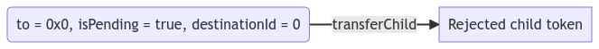
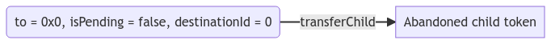
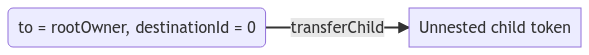

## 摘要

父级管理的、可嵌套的 NFT 标准通过允许新的 NFT 间的关系和交互来扩展 [ERC-721](./eip-721.md)。

该提案的核心思想很简单：NFT 的所有者不必是外部拥有的帐户 (EOA) 或智能合约，它也可以是 NFT。

将 NFT 嵌套到另一个 NFT 中的过程在功能上与将其发送给另一个用户相同。将代币从另一个代币中发送出去的过程涉及从拥有父代币的帐户发出交易。

一个 NFT 可以由单个其他 NFT 拥有，但反过来可以拥有许多 NFT。该提案建立了 NFT 父子关系的框架。父代币是拥有另一个代币的代币。子代币是由另一个代币拥有的代币。一个代币可以同时是父代币和子代币。给定代币的子代币可以由父代币的所有者完全管理，但可以由任何人提议。


该图示说明了子代币如何也可以是父代币，但两者仍然由根父代币的所有者管理。

## 动机

随着 NFT 成为以太坊生态系统中一种广泛的代币形式，并被用于各种用例，现在是时候标准化它们的额外效用了。拥有代币拥有其他代币的能力可以提高效用、可用性和向前兼容性。

自从 [ERC-721](./eip-721.md) 发布以来的四年中，对额外功能的需求导致了无数的扩展。此 ERC 在以下方面改进了 ERC-721：

- [捆绑](#bundling)
- [收集](#collecting)
- [成员资格](#membership)
- [委托](#delegation)

### 捆绑

[ERC-721](./eip-721.md) 最常见的用途之一是传播与代币绑定的多媒体内容。如果有人想提供来自不同集合的 NFT 捆绑包，目前还没有一种简单的方法可以将所有这些捆绑在一起并将其作为单个交易处理。该提案引入了一种标准化的方法来做到这一点。将所有代币嵌套到一个简单的捆绑包中并出售该捆绑包将通过一次交易将所有代币的控制权转移给买方。

### 收集

许多 NFT 消费者根据无数标准收集它们。有些人追求代币的效用，有些追求独特性，有些追求视觉吸引力等等。没有标准化的方法来对与特定帐户绑定的 NFT 进行分组。通过根据 NFT 所有者的偏好嵌套 NFT，该提案引入了执行此操作的能力。根父代币可以代表一组特定的代币，并且所有嵌套到其中的子代币都将属于它。

灵魂绑定、不可转让的代币的兴起，引入了对该提案的另一个需求。拥有一个具有多个灵魂绑定特征（子代币）的代币，允许无数的用例。一个具体的例子可以从供应链用例中得出。一个由 NFT 代表的运输集装箱，具有其自身的特征，可以有多个子代币表示其旅程的每一段。

### 成员资格

附加到 NFT 的常见效用是加入去中心化自治组织 (DAO) 或其他一些封闭访问组的成员资格。这些组织和团体中的一些偶尔会向会员 NFT 的当前持有者铸造 NFT。通过将代币嵌套到代币中的能力，可以通过简单地将奖励 NFT 直接铸造到会员 NFT 中来简化这种铸造。

### 委托

DAO 的核心功能之一是投票，并且有多种方法可以实现它。一种这样的机制是使用可替代的投票代币，成员可以通过将这些代币发送给另一个成员来委托他们的投票。使用此提案，委托投票可以通过将您的投票 NFT 嵌套到您要委托投票的 NFT 中，并在成员不再希望委托其投票时转移它来处理。

## 规范

本文档中的关键词“必须 (MUST)”、“不得 (MUST NOT)”、“必需 (REQUIRED)”、“应 (SHALL)”、“不应 (SHALL NOT)”、“应该 (SHOULD)”、“不应该 (SHOULD NOT)”、“推荐 (RECOMMENDED)”、“可以 (MAY)”和“可选 (OPTIONAL)”应按照 RFC 2119 中的描述进行解释。

```solidity
/// @title EIP-6059 父级管理的、可嵌套的非同质化代币
/// @dev 请参阅 https://eips.ethereum.org/EIPS/eip-6059
/// @dev 注意：此接口的 ERC-165 标识符为 0x42b0e56f。

pragma solidity ^0.8.16;

interface IERC6059 /* is ERC165 */ {
    /**
     * @notice 核心所有权结构体。
     * @dev `DirectOwner` 结构体用于存储下一个直接所有者的信息，无论是父代币、
     * 一个 `ERC721Receiver` 合约还是一个外部拥有的账户。
     * @dev 如果代币不属于 NFT，则 `tokenId` 必须等于 `0`。
     * @param tokenId 父代币的 ID
     * @param ownerAddress 代币所有者的地址。如果所有者是另一个代币，则地址必须是
     *  父代币的集合智能合约的地址。如果所有者是外部拥有的帐户，则地址
     *  必须是此帐户的地址
     */
    struct DirectOwner {
        uint256 tokenId;
        address ownerAddress;
    }

    /**
     * @notice 用于通知侦听器该代币正在被转移。
     * @dev 当 `tokenId` 代币从 `from` 转移到 `to` 时发出。
     * @param from 前一个直接所有者的地址，如果代币被嵌套，则为智能合约。
     * @param to 新的直接所有者的地址，如果代币正在被嵌套，则为智能合约。
     * @param fromTokenId 前一个父代币的 ID。如果该代币之前未嵌套，则值必须为 `0`
     * @param toTokenId 新的父代币的 ID。如果该代币未被嵌套，则值必须为 `0`
     * @param tokenId 被转移的代币的 ID
     */
    event NestTransfer(
        address indexed from,
        address indexed to,
        uint256 fromTokenId,
        uint256 toTokenId,
        uint256 indexed tokenId
    );

    /**
     * @notice 用于通知侦听器已将新代币添加到给定代币的待处理子代币数组。
     * @dev 当子 NFT 被添加到代币的待处理数组时发出。
     * @param tokenId 接收到新的待处理子代币的代币的 ID
     * @param childIndex 提议的子代币在父代币的待处理子代币数组中的索引
     * @param childAddress 提议的子代币的集合智能合约的地址
     * @param childId 子代币在子代币的集合智能合约中的 ID
     */
    event ChildProposed(
        uint256 indexed tokenId,
        uint256 childIndex,
        address indexed childAddress,
        uint256 indexed childId
    );

    /**
     * @notice 用于通知侦听器新子代币已被父代币接受。
     * @dev 当父代币从其待处理数组中接受一个代币，将其迁移到活动数组时发出。
     * @param tokenId 接受新子代币的代币的 ID
     * @param childIndex 新接受的子代币在父代币的活动子代币数组中的索引
     * @param childAddress 子代币的集合智能合约的地址
     * @param childId 子代币在子代币的集合智能合约中的 ID
     */
    event ChildAccepted(
        uint256 indexed tokenId,
        uint256 childIndex,
        address indexed childAddress,
        uint256 indexed childId
    );

    /**
     * @notice 用于通知侦听器已拒绝给定代币的所有待处理子代币。
     * @dev 当代币从其待处理数组中移除所有子代币时发出。
     * @param tokenId 拒绝所有待处理子代币的代币的 ID
     */
    event AllChildrenRejected(uint256 indexed tokenId);

    /**
     * @notice 用于通知侦听器已将子代币从父代币转移。
     * @dev 当代币将其自身转移子代币时发出，转移所有权。
     * @param tokenId 转移子代币的代币的 ID
     * @param childIndex 被转移的子代币在其所属数组中的索引
     * @param childAddress 子代币的集合智能合约的地址
     * @param childId 子代币在其自己的集合智能合约中的 ID
     * @param fromPending 一个布尔值，表示该代币是否在待处理子代币数组中 (`true`) 或
     *  在活动子代币数组中 (`false`)
     */
    event ChildTransferred(
        uint256 indexed tokenId,
        uint256 childIndex,
        address indexed childAddress,
        uint256 indexed childId,
        bool fromPending
    );

    /**
     * @notice 核心子代币结构体，保存有关子代币的信息。
     * @return tokenId 子代币在子代币的集合智能合约中的 ID
     * @return contractAddress 子代币的智能合约的地址
     */
    struct Child {
        uint256 tokenId;
        address contractAddress;
    }

    /**
     * @notice 用于检索给定代币的*根*所有者。
     * @dev 代币的*根*所有者是层次结构中不是 NFT 的顶层所有者。
     * @dev 如果代币由另一个 NFT 拥有，它必须递归查找父代的根所有者。
     * @param tokenId 为其检索*根*所有者的代币的 ID
     * @return owner 代币的*根*所有者
     */
    function ownerOf(uint256 tokenId) external view returns (address owner);

    /**
     * @notice 用于检索给定代币的直接所有者。
     * @dev 如果直接所有者是另一个代币，则返回的地址必须是父代币的
     *  集合智能合约的地址。
     * @param tokenId 为其检索直接所有者的代币的 ID
     * @return address 给定代币的所有者的地址
     * @return uint256 父代币的 ID。如果所有者不是 NFT，则必须为 `0`
     * @return bool 指示所有者是否为 NFT 的布尔值
     */
    function directOwnerOf(uint256 tokenId)
        external
        view
        returns (
            address,
            uint256,
            bool
        );

    /**
     * @notice 用于销毁给定的代币。
     * @dev 当一个代币被销毁时，它的所有子代币也会被递归销毁。
     * @dev 当指定最大递归销毁时，如果还有更多的子代币要销毁，则执行必须回滚。
     * @dev 将 `maxRecursiveBurn` 值设置为 0 应该只尝试销毁指定的代币，并且如果
     *  存在任何子代币，则必须回滚。
     * @param tokenId 要销毁的代币的 ID
     * @param maxRecursiveBurns 要递归销毁的最大代币数
     * @return uint256 递归销毁的子代币数
     */
    function burn(uint256 tokenId, uint256 maxRecursiveBurns)
        external
        returns (uint256);

    /**
     * @notice 用于将子代币添加到给定的父代币。
     * @dev 这会将子代币添加到给定父代币的待处理子代币数组中。
     * @dev 目标代币不得是被转移的代币或其下游子代币的子代币。
     * @dev 此方法不得直接调用。它只能作为 `IERC6059` 实例的一部分调用，
     `nestTransfer` 或 `transferChild` 到一个 NFT。
     * @dev 要求：
     *
     *  - 子合约上的 `directOwnerOf` 必须解析为被调用的合约。
     *  - 父合约的待处理数组不得已满。
     * @param parentId 接收新子代币的父代币的 ID
     * @param childId 新提议的子代币的 ID
     */
    function addChild(uint256 parentId, uint256 childId) external;

    /**
     * @notice 用于接受给定父代币的待处理子代币。
     * @dev 这会将子代币从父代币的待处理子代币数组移动到活动子代币
     *  数组中。
     * @param parentId 为其接受子代币的父代币的 ID
     * @param childIndex 在给定代币的待处理子代币数组中要接受的子代币的索引
     * @param childAddress 预期位于指定索引处的子代币的集合智能合约的地址
     * @param childId 预期位于指定索引处的子代币的 ID
     */
    function acceptChild(
        uint256 parentId,
        uint256 childIndex,
        address childAddress,
        uint256 childId
    ) external;

    /**
     * @notice 用于拒绝给定父代币的所有待处理子代币。
     * @dev 从 pending 数组映射中移除子代币。
     * @dev 子代币的所有权结构不会更新。
     * @dev 要求：
     *
     * - `parentId` 必须存在
     * @param parentId 要为其拒绝所有待处理代币的父代币的 ID
     * @param maxRejections 预期要拒绝的最大子代币数，用于防止拒绝
     *  刚好在此操作之前到达的子代币。
     */
    function rejectAllChildren(uint256 parentId, uint256 maxRejections) external;

    /**
     * @notice 用于从给定父代币转移子代币。
     * @dev 必须从父代的活动或待处理子代币中移除该子代币。
     * @dev 当转移子代币时，代币的所有者必须设置为 `to`，或者在 `to` 的情况下不更新
     *  是 `0x0` 地址。
     * @param tokenId 要从中转移子代币的父代币的 ID
     * @param to 要将代币转移到的地址
     * @param destinationId 接收此子代币的代币的 ID（如果目的地不是代币，则必须为 0）
     * @param childIndex 我们正在转移的代币的索引，在其所属的数组中（可以是活动数组或
     *  待处理数组）
     * @param childAddress 子代币的集合智能合约的地址
     * @param childId 子代币在其自己的集合智能合约中的 ID
     * @param isPending 一个布尔值，指示被转移的子代币是否在父代币的待处理数组中
     *  (`true`) 或在活动数组中 (`false`)
     * @param data 没有指定格式的附加数据，在调用 `to` 时发送
     */
    function transferChild(
        uint256 tokenId,
        address to,
        uint256 destinationId,
        uint256 childIndex,
        address childAddress,
        uint256 childId,
        bool isPending,
        bytes data
    ) external;

    /**
     * @notice 用于检索给定父代币的活动子代币。
     * @dev 返回父代币存在的 Child 结构体数组。
     * @dev Child 结构体由以下值组成：
     *  [
     *      tokenId,
     *      contractAddress
     *  ]
     * @param parentId 要为其检索活动子代币的父代币的 ID
     * @return struct[] 包含父代币的活动子代币的 Child 结构体数组
     */
    function childrenOf(uint256 parentId)
        external
        view
        returns (Child[] memory);

    /**
     * @notice 用于检索给定父代币的待处理子代币。
     * @dev 返回给定父代币存在的待处理 Child 结构体数组。
     * @dev Child 结构体由以下值组成：
     *  [
     *      tokenId,
     *      contractAddress
     *  ]
     * @param parentId 要为其检索待处理子代币的父代币的 ID
     * @return struct[] 包含父代币的待处理子代币的 Child 结构体数组
     */
    function pendingChildrenOf(uint256 parentId)
        external
        view
        returns (Child[] memory);

    /**
     * @notice 用于检索给定父代币的特定活动子代币。
     * @dev 返回位于父代币的活动子代币数组的 `index` 处的单个 Child 结构体。
     * @dev Child 结构体由以下值组成：
     *  [
     *      tokenId,
     *      contractAddress
     *  ]
     * @param parentId 要为其检索子代币的父代币的 ID
     * @param index 子代币在父代币的活动子代币数组中的索引
     * @return struct 包含有关指定子代币数据的 Child 结构体
     */
    function childOf(uint256 parentId, uint256 index)
        external
        view
        returns (Child memory);

    /**
     * @notice 用于从给定父代币检索特定待处理子代币。
     * @dev 返回位于父代币的活动子代币数组的 `index` 处的单个 Child 结构体。
     * @dev Child 结构体由以下值组成：
     *  [
     *      tokenId,
     *      contractAddress
     *  ]
     * @param parentId 要为其检索待处理子代币的父代币的 ID
     * @param index 子代币在父代币的待处理子代币数组中的索引
     * @return struct 包含有关指定子代币数据的 Child 结构体
     */
    function pendingChildOf(uint256 parentId, uint256 index)
        external
        view
        returns (Child memory);

    /**
     * @notice 用于将代币转移到另一个代币中。
     * @dev 目标代币不得是被转移的代币或其下游子代币的子代币。
     * @param from 要转移的代币的直接所有者的地址
     * @param to 接收代币的代币的集合智能合约的地址
     * @param tokenId 要转移的代币的 ID
     * @param destinationId 接收被转移的代币的代币的 ID
     */
    function nestTransferFrom(
        address from,
        address to,
        uint256 tokenId,
        uint256 destinationId
    ) external;
}
```

ID 永远不能为 `0` 值，因为此提案使用 `0` 值来表示代币/目的地不是 NFT。

## 理由

在设计提案时，我们考虑了以下问题：

1. **如何命名提案？**\
为了提供尽可能多的关于提案的信息，我们确定了提案最重要的方面；父代币对嵌套的中心控制。子代币的作用只是能够被 `Nestable` 并支持代币拥有它。这就是我们如何确定标题的 `父代币中心` 部分。
2. **为什么使用 [EIP-712](./eip-712.md) 许可样式签名自动接受子代币不是此提案的一部分？**\
为了保持一致性。此提案扩展了 ERC-721，它已经使用 1 个交易来批准对代币的操作。同时支持签署用于资产操作的消息将是不一致的。
3. **为什么使用索引？**\
为了减少 gas 消耗。如果使用代币 ID 来查找要接受或拒绝的代币，则需要迭代数组，并且操作的成本将取决于活动或待处理子代币数组的大小。使用索引，成本是固定的。需要维护每个代币的活动和待处理子代币列表，因为获取它们的方法是提议接口的一部分。\
为了避免代币索引发生变化的竞争条件，需要使用代币索引执行操作时，操作中会包含预期的代币 ID 以及预期的代币集合智能合约，以验证使用索引访问的代币是否是预期的代币。\
曾尝试实现内部跟踪使用映射的索引。接受子代币的最低成本增加了 20% 以上，铸造的成本增加了 15% 以上。我们得出结论，对于此提案而言，这不是必需的，可以作为扩展来实现，以用于愿意接受由此产生的交易成本增加的用例。在提供的示例实现中，有几个钩子使这成为可能。
4. **为什么限制待处理子代币数组而不是支持分页？**\
待处理子代币数组不是用于收集父代币的根所有者想要保留但不足以提升为活动子代币的代币的缓冲区。它旨在成为一个易于遍历的子代币候选列表，并且应该定期维护；通过接受或拒绝提议的子代币。待处理子代币数组也不需要是无限制的，因为活动子代币数组是无限制的。\
拥有有界子代币数组的另一个好处是可以防止垃圾邮件和恶意行为。由于铸造恶意或垃圾邮件代币可能相对容易且成本较低，因此有界待处理数组可确保其中的所有代币都易于识别，并且如果发生垃圾邮件攻击，合法代币不会在大量垃圾邮件代币中丢失。\
与此问题相关的另一个考虑因素是如何确保在清除待处理子代币数组时不会意外拒绝合法代币。我们向清除待处理子代币数组调用添加了最大待处理子代币以拒绝的参数。这确保仅拒绝预期数量的待处理子代币，并且如果在此类调用的准备和执行过程中将新代币添加到待处理子代币数组，则清除此数组应该导致回滚的交易。
5. **我们是否应该允许将代币嵌套到其子代币之一中？**\
该提案强制执行父代币不能嵌套到其子代币之一中，或者下游子代币中。父代币及其子代币均由父代币的根所有者管理。这意味着如果将代币嵌套到其子代币之一中，这将创建所有权循环，并且循环中的任何代币都无法再被管理。
6. **为什么没有“安全”嵌套转移方法？**\
`nestTransfer` 始终是“安全”的，因为它必须检查目标上的 `IERC6059` 兼容性。
7. **此提案与其他试图解决类似问题的提案有何不同？**\
此接口允许将代币发送到其他代币并接收其他代币。提议-接受和父级管理模式允许更安全的使用。仅为 ERC-721 添加了向后兼容性，从而简化了接口。该提案还允许不同的集合相互操作，这意味着嵌套不会锁定到单个智能合约，而可以在完全独立的 NFT 集合之间执行。

### 用于子代币管理的提议-提交模式

向父代币添加子代币必须以提议-提交模式的形式完成，以允许第三方进行有限的更改。当将子代币添加到父代币时，首先将其放置在“待处理”数组中，并且必须由父代币的根所有者将其迁移到“活动”数组中。“待处理”子代币数组应限制为 128 个插槽，以防止垃圾邮件和恶意行为。

只有根所有者才能接受子代币的限制也引入了提案固有的信任。这确保代币的根所有者对其代币拥有完全控制权。没有人可以强迫用户接受他们不想要的子代币。

### 父级管理模式

嵌套代币的父级 NFT 和父级的根所有者在所有方面都是它的真正所有者。一旦您将代币发送给另一个代币，您就放弃了所有权。

我们继续使用 ERC-721 的 `ownerOf` 功能，该功能现在将递归查找父级，直到找到不是 NFT 的地址为止，这称为*根所有者*。此外，我们提供 `directOwnerOf`，它使用 3 个值返回代币的最近所有者：所有者地址、tokenId（如果直接所有者不是 NFT，则必须为 0）以及指示父级是否为 NFT 的标志。

根所有者或批准的方必须能够在子代币上执行以下操作：`acceptChild`、`rejectAllChildren` 和 `transferChild`。

仅当代币不归 NFT 所有时，才允许根所有者或批准的方执行这些操作：`transferFrom`、`safeTransferFrom`、`nestTransferFrom`、`burn`。

如果代币归 NFT 所有，则仅父级 NFT 本身必须被允许执行上面列出的操作。转移必须从父代币执行，使用 `transferChild`，此方法反过来应该根据目的地是否为 NFT，在子代币的智能合约中调用 `nestTransferFrom` 或 `safeTransferFrom`。对于销毁，代币必须首先转移到 EOA，然后再销毁。

我们添加此限制是为了防止父合约出现不一致，因为只有 `transferChild` 方法会在代币从父合约中转移出来时负责将其从父合约中移除。

### 子代币管理

该提案引入了许多子代币管理功能。除了从“待处理”到“活动”子代币数组的许可迁移之外，此提案中的主要代币管理功能是 `tranferChild` 函数。通过它可以使用子代币的以下状态转换：

1. 拒绝子代币
2. 放弃子代币
3. 取消嵌套子代币
4. 将子代币转移到 EOA 或 `ERC721Receiver`
5. 将子代币转移到新的父代币

为了更好地理解如何实现这些状态转换，我们必须查看传递给 `transferChild` 的可用参数：

```solidity
    function transferChild(
        uint256 tokenId,
        address to,
        uint256 destinationId,
        uint256 childIndex,
        address childAddress,
        uint256 childId,
        bool isPending,
        bytes data
    ) external;
```

根据所需的状态转换，必须相应地设置这些参数的值（以下示例中未设置的任何参数都取决于被管理的子代币）：

1. **拒绝子代币**\

2. **放弃子代币**\

3. **取消嵌套子代币**\

4. **将子代币转移到 EOA 或 `ERC721Receiver`**\

5. **将子代币转移到新的父代币**\
\
此状态更改会将代币放置在新父代币的待处理数组中。仍然需要新父代币的根所有者接受该子代币，才能将其放置在该代币的活动数组中。

## 向后兼容性

可嵌套代币标准已与 [ERC-721](./eip-721.md) 兼容，以便利用可用于 ERC-721 实现的可靠工具，并确保与现有 ERC-721 基础架构的兼容性。

## 测试用例

测试包含在 [`nestable.ts`](../assets/eip-6059/test/nestable.ts) 中。

要在终端中运行它们，您可以使用以下命令：

```
cd ../assets/eip-6059
npm install
npx hardhat test
```

## 参考实现

请参阅 [`NestableToken.sol`](../assets/eip-6059/contracts/NestableToken.sol)。

## 安全考虑

与 [ERC-721](./eip-721.md) 相同的安全考虑事项适用：隐藏的逻辑可能存在于任何函数中，包括销毁、添加子代币、接受子代币等等。

由于允许代币的当前所有者管理代币，因此存在一种可能性，即在父代币被列出出售后，卖方可能会在出售之前移除子代币，因此买方将不会收到预期的子代币。这是此标准的设计固有的风险。市场应考虑到这一点，并提供一种验证预期子代币在父代币出售时是否存在的万式，或以其他方式防范此类恶意行为。

建议在处理未经审计的合约时要谨慎。

## 版权

在 [CC0](../LICENSE.md) 下放弃版权及相关权利。