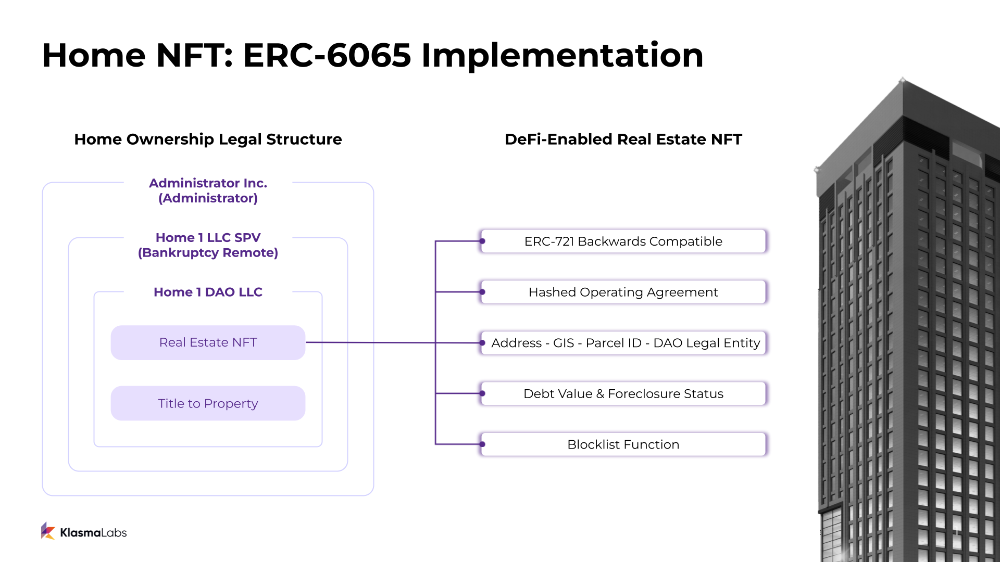

## 摘要

本提案介绍了一种在区块链上表示实体房地产和产权的开放式结构。此标准建立在 [ERC-721](./eip-721.md) 的基础上，增加了表示现实世界资产（如房地产）所必需的重要功能。本标准旨在实现的三个目标是：NFT 的通用可转移性、附加到 NFT 的私有财产权以及产权与 NFT 转移的原子性转移。该代币包含运营协议的哈希值，详细说明了 NFT 持有者对该房产的合法权利、该房产的唯一标识符、债务值和止赎状态以及管理者的地址。

## 动机

房地产是世界上最大的资产类别。通过代币化房地产，准入壁垒降低，交易成本最小化，信息不对称减少，所有权结构变得更具延展性，并形成了一个新的创新基石。然而，为了代币化这个资产类别，需要一个通用的标准，该标准既要考虑到其现实世界的特殊性，又要保持足够的灵活性以适应各种司法管辖区和监管环境。

涉及现实世界资产 (RWA) 的以太坊代币非常棘手。这是因为以太坊代币存在于链上，而房地产存在于链下。因此，两者都受到完全不同的共识环境的影响。对于以太坊代币，共识是通过分布式验证者的正式流程达成的。当纯数字 NFT 被转移时，新所有者拥有所有权的加密保证。对于房地产，共识由法律合同、财产法支持，并由法院系统执行。对于现有的资产支持的 ERC-721 代币，将代币转移给另一个人不一定对实物资产的合法所有权产生任何影响。

本标准试图解决现实世界的协调问题，使房地产 NFT 能够像纯数字 NFT 一样在链上无缝运行。

## 规格

本文档中的关键词“必须”、“禁止”、“必需”、“应”、“不应”、“应该”、“不应该”、“推荐”、“不推荐”、“可以”和“可选”应按照 RFC 2119 和 RFC 8174 中的描述进行解释。

为了实现上述目标并为链上产权所有权创建一个开放标准，我们创建了一个基于广泛使用的 ERC-721 标准的代币结构。

### 代币组件：

1. 继承 ERC-721 - 允许与最广泛接受的 NFT 代币标准向后兼容。
2. operatingAgreementHashOf - 详细说明所有权权利和财产使用条件的法律协议的不可变哈希值
3. 财产唯一标识符 - 法律描述（来自实体契约）、街道地址、GIS 坐标、地块/税务 ID、合法所有实体（在契约上）
4. debtOf - 可读的债务值、货币和 NFT 的止赎状态
5. managerOf - 具有财产管理控制权的可读以太坊地址

### 接口

此 EIP 继承了 ERC-721 NFT 代币标准，用于所有转移和批准逻辑。所有转移和批准功能都从该代币标准继承，没有更改。此外，此 EIP 还继承了 ERC-721 元数据标准，用于名称、符号和元数据 URI 查找。这使得此 EIP 下的 NFT 可以与预先存在的 NFT 交易所和服务互操作，但是，必须小心。请参阅[向后兼容性](#backwards-compatibility)和[安全考虑](#security-considerations)。

#### Solidity 接口

```
pragma solidity ^0.8.13;

import "forge-std/interfaces/IERC721.sol";

interface IERC6065 is IERC721 {

	// 如果资产被止赎，则必须发出此事件。
	event Foreclosed(uint256 id);

	/* 
	以下 getter 函数返回 NFT 的不可变数据。
	*/
	function legalDescriptionOf(uint256 _id) external view returns (string memory);
	function addressOf(uint256 _id) external view returns (string memory);
	function geoJsonOf(uint256 _id) external view returns (string memory);
	function parcelIdOf(uint256 _id) external view returns (string memory);
	function legalOwnerOf(uint256 _id) external view returns (string memory);
	function operatingAgreementHashOf(uint256 _id) external view returns (bytes32);

	/*
	以下 getter 函数返回 NFT 的债务面额代币、债务金额（负数债务 == 信用）以及支持 NFT 的基础资产是否已被止赎。
	这应专门用于链下债务和 RWA 资产的所需付款。
	建议管理员仅使用单一代币类型来表示债务。要求集成智能合约来实现可能无限制的代币来表示资产的链下债务是不现实的。

	如果止赎状态 == true，则 RWA 可以被视为与 NFT 分离。NFT 现在是“无支持”的 RWA。
	*/
	function debtOf(uint256 _id) external view returns (address debtToken, int256 debtAmt, bool foreclosed);

	// 获取 NFT 的 managerOf。manager 可以对链上或链下的 NFT 或 RWA 拥有额外的权利。
	function managerOf(uint256 _id) external view returns (address);
}
```

## 理由

### 介绍

现实世界的资产在混乱、非确定性的环境中运行。因此，验证资产的真实状态可能很模糊、昂贵或耗时。例如，在美国，财产所有权变更通常记录在县记录员办公室，有时使用笔和纸。每次在区块链上发生 NFT 交易时，不断更新此手动记录是不可行的。此外，由于现实世界的财产权由法院执行，因此必须以法院能够解释和执行所有权的方式记录财产所有权。

由于这些原因，有必要有一个受信任的方负责确保链上财产 NFT 的状态准确地反映其物理对应物。通过为财产指定一位管理员，该管理员发布具有法律约束力的实体财产数字表示形式，我们既能够解决财产权利与 NFT 转移的原子性转移问题，又能建立一个无缝流程，用于进行与财产所有权相关的必要付款和备案。通过消除每次 NFT 易手时合法所有权的变更，这成为可能。[参考实现](#reference-implementation)中提供了在美国实施的财产代币化的示例管理员法律结构。虽然实施此标准的代币必须具有一个法律实体来进行财产的链下交易，但此实施不是强制性的。

### 指导目标

我们设计此 EIP 以实现创建实体房地产 NFT 表示形式所需的三个主要目标：

#### 1. 房地产 NFT 可以普遍转移

私人财产的一个关键方面是可以将所有权转让给任何有能力拥有该财产的法人或实体。因此，实体财产的 NFT 表示形式应保持这种普遍的转让自由。

#### 2. 与财产所有权相关的所有权利都能够由 NFT 维护和保证

与私人财产所有权相关的权利是持有、占用、出租、更改、转售或转让财产的权利。至关重要的是，这些相同的权利能够通过房地产的 NFT 表示形式来维护和执行。

#### 3. 财产权与 NFT 的转移以原子方式转移

任何区块链上的代币所有权与数字代币的转移是原子的。为了确保实体财产的数字表示形式能够完全整合区块链技术的好处，至关重要的是，与财产相关的权利与数字代币的转移以原子方式传递。

以下部分指定了满足这三个目标所需的技术组件。

### operatingAgreementHashOf

由拥有该财产的法律实体发布的法律文件的不可变哈希值。该协议是独一无二的，包含 NFT 所代表的特定财产的权利、条款和条件。附加到 NFT 的协议哈希值必须是不可变的，以确保这些权利在未来对于集成商或受让人而言的合法性和可执行性。转移 NFT 后，这些合法权利立即对新所有者具有可执行性。为了更改法律结构或与财产相关的权利和条件，必须销毁原始代币并铸造具有新哈希值的新代币。

### 财产地唯一标识符

以下财产唯一标识符包含在 NFT 中并且是不可变的：

`legalDescriptionOf`：取自实体房产契约的房产书面描述
`addressOf`：房产的街道地址
`geoJsonOf`：房产的地理空间坐标的 GeoJSON 格式
`parcelIdOf`：用于识别地方当局房产的 ID 号
`legalOwnerOf`：在可验证的实体契约上命名的法律实体

这些唯一标识符确保相关实物资产清晰且可识别。这些字符串必须是不可变的，以确保将来不能更改房产的身份。这对于在发生有关房产的纠纷时为 NFT 持有者提供信心是必要的。

这些标识符，尤其是 `legalOwnerOf`，允许个人验证链下所有权和法律协议的合法性。将来，这些验证检查可以与 Chainlink 函数集成，以进行简化和自动化。

### debtOf

累积到房产的债务的可读值和表示货币。正余额表示对房产的债务，而负余额表示可由 NFT 所有者认领的信用。这是财产管理员向 NFT 持有者收取对该房产的任何必要款项（如财产税）或“现实世界”中的其他重要维修或维护费用的一种方式。可以通过相同的功能将信用授予 NFT 持有者，也许管理员和 NFT 持有者已经制定了财产管理或租赁收入分成协议。

`debtOf` 函数还返回 NFT 所代表的资产的布尔止赎状态。true 结果表示相关房产不再支持 NFT，false 结果表示相关房产仍在支持 NFT。管理员可以出于`运营协议`中规定的任何原因取消赎回资产，一个例子是过度的未付债务。智能合约可以通过调用此函数来检查止赎状态。如果资产被取消赎回，则应理解为支持 NFT 的 RWA 已被移除，并且智能合约在进行任何估值或其他计算时应考虑到这一点。

对于如何更新这些值没有标准要求，因为这些细节将由实施者决定。但是，此 EIP 会标准化如何指示和读取这些值，以简化集成。

### managerOf

一个可读的以太坊地址，可以被授予对财产采取行动的权利，而无需成为 NFT 的基础所有者。

此函数允许代币由一个以太坊地址拥有，同时将特定权利授予另一个以太坊地址。这使得协议和智能合约可以拥有基础资产（例如，贷款协议），但仍然允许另一个以太坊地址（例如，存款人）通过其他集成对 NFT 采取行动，例如管理员管理门户。该标准不要求 manager 角色的特定实现，只需要该值。在许多情况下，managerOf 值将与 NFT 的拥有地址相同。

## 向后兼容性

此 EIP 与 ERC-721 向后兼容。但是，重要的是要注意，在任何智能合约集成之前，都需要考虑潜在的实施注意事项。有关更多详细信息，请参阅[安全考虑](#security-considerations)。

## 参考实现

Klasma Labs 提供了一个正在进行中的[参考实现](../assets/eip-6065/Implementation.sol)。技术实施包括以下其他组件以供参考，此实施不是必需的。

此实施的摘要：

* NFT 销毁和铸造函数
* 不可变的 NFT 数据（唯一标识符和运营协议哈希值）
* 管理员的简单债务跟踪
* 用于冻结欺诈地址持有的资产的阻止列表函数（注意：将在未来实施）
* 由管理员发起的简单止赎逻辑
* `managerOf` 函数实现，用于将此调用链接到其他支持的智能合约

### 法律结构实施

本节解释了公司作为此代币的管理员可以采用的法律结构和实施方式。下面详细介绍的结构特定于美国 2023 年监管环境中的财产代币化。

本节详细介绍了一种法律标准的实施方式，公司可以专门将其用于美国 2022 年监管环境中的财产代币化。



此代币的法律结构如下：

* 一家母公司和财产管理员，为他们担任管理员的每处房产拥有一家破产隔离的 LLC。
* 破产隔离的 LLC 是 DAO LLC 的所有者和管理者。DAO LLC 拥有所有权契据，并发行相应的 NFT 和房产运营协议。
* 这种结构可以实现以下三个结果：

    1. 房主可以免受其实体资产管理员遇到的任何财务压力或破产的影响。如果管理员破产或解散，则 NFT 的所有者有权转让 DAO LLC，或出售和分配房产收益。
    2. 财产权利的转让与 NFT 的转让是原子的。NFT 代表着要求资产并将所有权转让给 NFT 所有者的权利，以及使用该资产的权利。这确保了实物资产的权利与 NFT 的转让以数字方式传递，而无需在每次转让后更新房产的合法所有者。

安全说明：如果私钥被盗，公司可能无法重新发行 Home NFT。对其安全存储 Home NFT 的能力没有信心的 Home NFT 所有者将拥有不同级别的安全选项（多重签名、托管人等）。对于公共的大型协议攻击，公司可以使用阻止列表函数冻结资产，并将 Home NFT 重新发行给原始所有者。阻止列表功能将在上面的参考实施中实施。

## 安全考虑

以下是集成此标准下的 NFT 的协议的检查和建议。这些与针对使用此标准的任何资产进行贷款的应用程序尤其相关。

* 建议协议集成商检查财产的唯一标识符和运营协议的哈希值对于他们希望集成的特定 NFT 是否不可变。为了正确实施此标准，这些值必须是不可变的，以确保未来受让人的合法性。
* 建议协议集成商检查 debtOf 值，以准确表示此代币的价值。
* 建议协议集成商检查止赎状态，以确保此代币仍由最初与其绑定的资产支持。
* 为了降低额外的风险，协议集成商可以在执行不可逆转的操作之前实施时间延迟。这是为了防止在被盗的 NFT 存入协议时可能发生的资产冻结。资产冻结是非强制性的，并且取决于资产管理员的实施。

## 版权

版权和相关权利通过 [CC0](../LICENSE.md) 放弃。