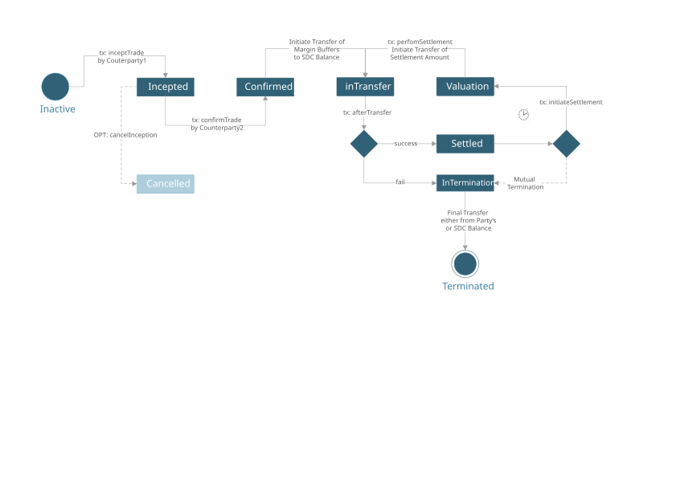
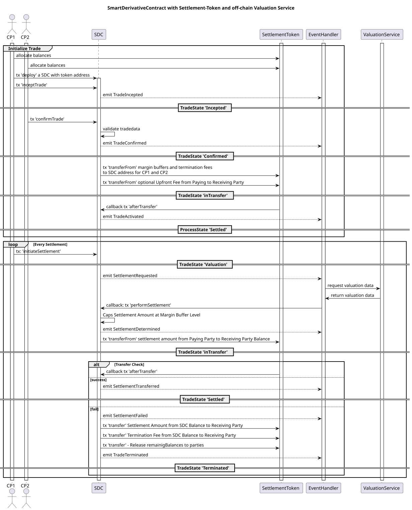

## 摘要

智能衍生品合约（SDC）允许完全自动化和保护金融产品（例如金融衍生品或债券）的完整交易生命周期。
SDC 利用智能合约的优势，消除了与经典衍生品生命周期相关的许多摩擦。最值得注意的是，该协议基本上允许消除交易对手风险。
SDC 可以使用预先约定的估值预言机和估值模型来实现，从而消除结算金额的歧义。SDC 提供方法和回调，以实现完全自动化和完全事务性的结算（交割与付款，付款与付款）。
基于 Token 的结算可以通过任何实现 [ERC-20](./eip-20.md) token 的合约实现。
2021 年和 2022 年进行了两个具有法律约束力的数字利率互换的概念验证。

## 动机

### 重新思考金融衍生品

就其本质而言，所谓的“场外交易（OTC）”金融合约是关于交换长期现金流计划的双边合同协议。
由于这些合约的内在市场价值会因不断变化的市场环境而发生变化，因此当一方交易对手出现违约时，它们会面临交易对手信用风险。
最初的白皮书描述了智能衍生品合约（SDC）的概念，其核心目标是将双边金融交易与交易对手信用风险分离，并通过完整的重新设计消除双边交易后处理的复杂性。

### 智能衍生品合约的概念

智能衍生品合约是一种确定性的结算协议，具有与金融合约（例如 OTC 衍生品或债券）相同的经济行为。
每个过程状态都是指定的；因此，交易和交易后流程是预先知道的，并且在交易的整个生命周期中是确定性的。一个 [ERC-20](./eip-20.md) token 可以用于无摩擦的去中心化结算，请参阅参考实现。我们为从 [ERC-20](./eip-20.md) 派生的特定“结算 Token”提供了单独的接口和实现。
这些功能使两个或多个交易方能够完全去中心化地处理其金融合约，而无需依赖第三方中央中介机构。
SDC 的流程逻辑可以在 solidity 上实现为有限状态机。

### 应用

该接口的生命周期功能适用于多种用例。

#### 抵押的场外交易衍生品

对于有抵押的场外交易衍生品，SDC 会频繁地（例如，每天）结算标的金融合约的未偿净现值。在每个结算周期中，都会交换标的合约的净现值，并且合约的价值会重置为零。预先约定的保证金缓冲会在每个结算周期开始时锁定，以确保结算在一定金额内得到保证。
如果交易对手未能遵守合约规则，例如未提供足够的预付款，SDC 将自动终止，并由造成方保证转让终止费。
我们为此案例提供了一个参考实现。

#### 可违约的场外交易衍生品

可违约的场外交易衍生品没有抵押流程。在这种情况下，智能衍生品将根据衍生品合约规范中确定的结算相应的现金流。如果无法进行结算，可违约的场外交易衍生品可能会以“未能付款”状态结束。

#### 智能债券合约

债券的生命周期也可以利用下面的函数目录。该接口使发行人能够分配和赎回债券并结算票息支付。另一方面，它允许债券持有人相互互动，进行二级市场交易。所有这一切都归结为结算阶段，该阶段需要双方预先同意或由发行人触发，并且可以以完全无摩擦的方式进行处理。

## 规范

方法和事件被分为不同的接口：

- `ISDCTrade` - 与交易开始、确认和终止相关的事件和函数。
- `ISDCSettlement` - 与交易的结算生命周期相关的事件和函数。
- `IAsyncTransferCallback` - 事件和回调函数 `afterTransfer`，用于利用外部支付系统的结算。
- `IAsyncTransfer` - 与异步转账相关的事件和函数（例如，用于外部支付系统）。

`ISDC` 接口是 `ISDCTrade`、`ISDCSettlement` 和 `IAsyncTransferCallback` 的聚合。

### `ISDCTrade` 的方法

以下方法指定了智能衍生品合约的交易启动、交易终止和结算生命周期。有关更多信息，请参阅接口文档 `ISDC.sol`。

#### 交易启动阶段：`inceptTrade`

一方可以通过提供与其交易的对方地址、交易数据、交易头寸、交易支付金额和初始结算数据来启动交易。只有注册的交易对手才允许使用该函数。

```solidity
function inceptTrade(address withParty, string memory tradeData, int position, int256 paymentAmount, string memory initialSettlementData) external returns (string memory);
```

`position` 和 `paymentAmount` 是从发起者角度来看的。
该函数将返回一个生成的唯一 `tradeId`。交易 id 也会通过事件发出。

#### 交易启动阶段：`confirmTrade`

交易对手可以通过提供其交易规范数据来确认交易，然后将其与从 `inceptTrade` 调用存储的数据进行匹配。

```solidity
function confirmTrade(address withParty, string memory tradeData, int position, int256 paymentAmount, string memory initialSettlementData) external;
```

在这里，`position` 和 `paymentAmount` 是从确认者角度来看的（与调用 `inceptTrade` 相比，符号相反）。

#### 交易启动阶段：`cancelTrade`

调用 `inceptTrade` 的交易对手可以选择取消交易，例如，在交易未及时确认的情况下。

```solidity
function cancelTrade(address withParty, string memory tradeData, int position, int256 paymentAmount, string memory initialSettlementData) external;
```

#### 交易终止：`requestTermination`

允许符合条件的当事方请求与对应的 `tradeId` 相互终止交易，并提供她愿意支付的终止金额以及进一步的终止条款（例如 XML）

```solidity
function requestTradeTermination(string memory tradeId, int256 terminationPayment, string memory terminationTerms) external;
```

#### 交易终止：`confirmTradeTermination`

允许符合条件的当事方确认先前请求的（相互）交易终止，包括终止支付价值和终止条款

```solidity
function confirmTradeTermination(string memory tradeId, int256 terminationPayment, string memory terminationTerms) external;
```

#### 交易终止：`cancelTradeTermination`

发起 `requestTradeTermination` 的当事方可以选择撤回请求，例如，在未及时确认终止的情况下。

```solidity
function cancelTradeTermination(string memory tradeId, int256 terminationPayment, string memory terminationTerms) external;
```

### `ISDCSettlement` 的方法

#### 结算阶段：`initiateSettlement`

允许符合条件的参与者（例如交易对手或委托代理）触发结算阶段。

```solidity
function initiateSettlement() external;
```

#### 结算阶段：`performSettlement`

可以通过链上或链下方式通过外部预言机服务提供估值，该服务计算结算或票息金额并使用外部市场数据。
此方法用作从外部预言机调用的回调，提供结算金额和使用的结算数据，这些数据也会被存储。
将根据合约条款检查结算金额，从而导致常规结算或终止交易。

```solidity
function performSettlement(int256 settlementAmount, string memory settlementData) external;
```

### `IAsyncTransferCallback` 的方法

#### 结算阶段：`afterTransfer`

此方法（可以直接从提供的结算 token 回调，也可以从符合条件的地址回调）完成结算转账。
transactionData 作为相应事件的一部分发出：`SettlementTransferred` 或 `SettlementFailed`
根据提供的成功标志，这可能会导致终止或开始下一个结算阶段。

```solidity
function afterTransfer(bool success, uint256 transactionID, string memory transactionData) external;
```


### 交易事件

以下事件在 SDC 交易生命周期中发出。

#### TradeIncepted

在交易开始时发出 - 方法 'inceptTrade'

```solidity
event TradeIncepted(address initiator, string tradeId, string tradeData);
```

#### TradeConfirmed

在交易确认时发出 - 方法 'confirmTrade'

```solidity
event TradeConfirmed(address confirmer, string tradeId);
```

#### TradeCanceled

在交易取消时发出 - 方法 'cancelTrade'

```solidity
event TradeCanceled(address initiator, string tradeId);
```

#### TradeActivated

当交易被激活时发出

```solidity
event TradeActivated(string tradeId);
```

#### TradeTerminationRequest

当终止请求由交易对手发起时发出

```solidity
event TradeTerminationRequest(address initiator, string tradeId, int256 terminationPayment, string terminationTerms);
```

#### TradeTerminationConfirmed

当终止请求由交易对手确认时发出

```solidity
event TradeTerminationConfirmed(address confirmer, string tradeId, int256 terminationPayment, string terminationTerms);
```

#### TradeTerminationCanceled

当终止请求被请求的交易对手取消时发出

```solidity
event TradeTerminationCanceled(address initiator, string tradeId, string terminationTerms);
```

#### TradeTerminated

当交易被终止时发出

```solidity
event TradeTerminated(string cause);
```


### 结算事件

以下事件在结算阶段发出。

#### SettlementRequested

当请求结算时发出。可能会触发结算阶段。

```solidity
event SettlementRequested(address initiator, string tradeData, string lastSettlementData);
```

#### SettlementDetermined

当结算阶段开始时发出。

```solidity
event SettlementDetermined(address initiator, int256 settlementAmount, string settlementData);
```

#### SettlementTransferred

当结算成功时发出。

```solidity
event SettlementTransferred(string transactionData);
```

#### SettlementFailed

当结算失败时发出。

```solidity
event SettlementFailed(string transactionData);
```


## 原理

接口设计和参考实现基于以下考虑因素：

- SDC 协议使交互方能够以双边和确定性的方式启动和处理金融交易。结算和交易对手风险由合约管理。
- 提供的接口规范应该完全反映整个交易生命周期。
- 接口规范足够通用，可以处理各方处理一项甚至多项金融交易（以净额为基础）的情况
- 通常，金融交易（例如 OTC 衍生品）的估值将需要先进的估值方法来确定市场价值。这就是为什么该概念可能依赖于外部市场数据源和托管估值算法的原因
- 可以使用提供的回调模式（方法：`initiateSettlement`、`performSettlement`）来实现基于拉取估值的预言机模式
- 参考实现 `SDCSingleTrade.sol` 考虑了单笔交易，并且基于状态机模式，其中状态也用作保护（通过修饰符）以检查允许在特定给定流程和交易状态下调用哪个方法
- 该接口允许扩展到具有共同（净额）结算的多笔交易。

### 交易和流程状态的状态图



该图显示了 `SDCSingleTrade.sol` 中单笔交易 SDC 的交易状态。

### 参考实现 'SDCPledgedBalance.sol' 的时序图



时序图显示了创建交易和结算状态转换以及发出的事件的函数调用。

## 测试用例

提供了基于示例实现和使用 [ERC-20](./eip-20.md) token 的生命周期单元测试。请参阅文件 [test/SDCTests.js](../assets/eip-6123/test/SDCTests.js)。

## 参考实现

提供了一个用于单笔交易 SDC 的抽象合约类 `SDCSingleTrade.sol`，以及一个用于 OTC 衍生品的完整参考实现 SDCPledgedBalance.sol，并且基于 [ERC-20](./eip-20.md) token 标准。
请参阅文件夹 `/assets/contracts`，有关该实现的更多说明以内联方式提供。

### 交易数据规范（建议）

请查看提供的 xml 文件，了解如何存储交易参数的建议。

## 安全注意事项

到目前为止，没有已知的安全问题。

## 版权

在 [CC0](../LICENSE.md) 下放弃版权和相关权利。