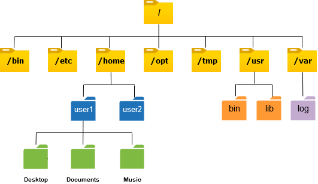
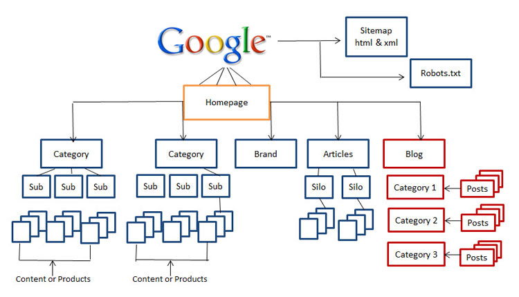

```md
---
eip: 6150
title: 分层 NFT
description: 分层 NFT，[EIP-721](./eip-721.md) 的扩展。
author: Keegan Lee (@keeganlee), msfew <msfew@hyperoracle.io>, Kartin <kartin@hyperoracle.io>, qizhou (@qizhou)
discussions-to: https://ethereum-magicians.org/t/eip-6150-hierarchical-nfts-an-extension-to-erc-721/12173
status: Final
type: Standards Track
category: ERC
created: 2022-12-15
requires: 165, 721
---

## 摘要

本标准是 [EIP-721](./eip-721.md) 的扩展。它提出了一个类似多层文件系统的分层 NFT。本标准提供了接口来获取父 NFT 或子 NFT，以及 NFT 是叶子节点还是根节点，从而维护它们之间的层次关系。

## 动机

本 EIP 标准化了类似文件系统的分层 NFT 的接口，并提供了一个参考实现。

层次结构通常由操作系统（如 Linux 文件系统层级结构（FHS））为文件系统实现。



网站通常使用目录和类别层次结构，例如 eBay（主页 -> 电子产品 -> 视频游戏 -> Xbox -> 产品）和 Twitter（主页 -> 列表 -> 列表 -> 推文）以及 Reddit（主页 -> r/ethereum -> 帖子 -> 热门）。



单个智能合约可以是 `root`，将每个目录/类别作为单独的 NFT 和 NFT 的层次关系进行管理。每个 NFT 的 `tokenURI` 可能是另一个合约地址、网站链接或任何形式的元数据。

使用此标准的以太坊生态系统的优势和进步包括：

- 层次结构完全链上存储，也可以通过额外的 DAO 合约进行链上治理
- 只需要一个合约来管理和操作层次关系
- 可转移的目录/类别所有权作为 NFT，这非常适合链上论坛等用例
- 前端可以轻松且无需许可地访问层次结构
- 传统应用程序（如电子商务或论坛）的理想结构
- 易于开发人员理解的接口，在概念上类似于 Linux 文件系统命令

用例可以包括：

- 链上论坛，如 Reddit
- 链上社交媒体，如 Twitter
- 链上公司，用于管理组织结构
- 链上电子商务平台，如 eBay 或个人商店
- 任何具有树状结构的应用程序

未来，随着以太坊数据可用性解决方案和外部无需许可的数据保留网络的发展，这些平台的内容（帖子、列表项或推文）也可以完全存储在链上，从而实现完全去中心化的应用程序。

## 规范

本文档中的关键词“必须（MUST）”、“禁止（MUST NOT）”、“需要（REQUIRED）”、“应该（SHALL）”、“不应（SHALL NOT）”、“推荐（SHOULD）”、“不推荐（SHOULD NOT）”、“可以（MAY）”和“可选（OPTIONAL）”应按照 RFC 2119 和 RFC 8174 中的描述进行解释。

每个符合标准的合约都必须实现此提案、[EIP-721](./eip-721.md) 和 [EIP-165](./eip-165.md) 接口。

```solidity
pragma solidity ^0.8.0;

// Note: the ERC-165 identifier for this interface is 0x897e2c73.
interface IERC6150 /* is IERC721, IERC165 */ {
    /**
     * @notice Emitted when `tokenId` token under `parentId` is minted.
     * @param minter The address of minter
     * @param to The address received token
     * @param parentId The id of parent token, if it's zero, it means minted `tokenId` is a root token.
     * @param tokenId The id of minted token, required to be greater than zero
     */
    event Minted(
        address indexed minter,
        address indexed to,
        uint256 parentId,
        uint256 tokenId
    );

    /**
     * @notice Get the parent token of `tokenId` token.
     * @param tokenId The child token
     * @return parentId The Parent token found
     */
    function parentOf(uint256 tokenId) external view returns (uint256 parentId);

    /**
     * @notice Get the children tokens of `tokenId` token.
     * @param tokenId The parent token
     * @return childrenIds The array of children tokens
     */
    function childrenOf(
        uint256 tokenId
    ) external view returns (uint256[] memory childrenIds);

    /**
     * @notice Check the `tokenId` token if it is a root token.
     * @param tokenId The token want to be checked
     * @return Return `true` if it is a root token; if not, return `false`
     */
    function isRoot(uint256 tokenId) external view returns (bool);

    /**
     * @notice Check the `tokenId` token if it is a leaf token.
     * @param tokenId The token want to be checked
     * @return Return `true` if it is a leaf token; if not, return `false`
     */
    function isLeaf(uint256 tokenId) external view returns (bool);
}
```

可选扩展：可枚举

```solidity
// Note: the ERC-165 identifier for this interface is 0xba541a2e.
interface IERC6150Enumerable is IERC6150 /* IERC721Enumerable */ {
    /**
     * @notice Get total amount of children tokens under `parentId` token.
     * @dev If `parentId` is zero, it means get total amount of root tokens.
     * @return The total amount of children tokens under `parentId` token.
     */
    function childrenCountOf(uint256 parentId) external view returns (uint256);

    /**
     * @notice Get the token at the specified index of all children tokens under `parentId` token.
     * @dev If `parentId` is zero, it means get root token.
     * @return The token ID at `index` of all chlidren tokens under `parentId` token.
     */
    function childOfParentByIndex(
        uint256 parentId,
        uint256 index
    ) external view returns (uint256);

    /**
     * @notice Get the index position of specified token in the children enumeration under specified parent token.
     * @dev Throws if the `tokenId` is not found in the children enumeration.
     * If `parentId` is zero, means get root token index.
     * @param parentId The parent token
     * @param tokenId The specified token to be found
     * @return The index position of `tokenId` found in the children enumeration
     */
    function indexInChildrenEnumeration(
        uint256 parentId,
        uint256 tokenId
    ) external view returns (uint256);
}
```

可选扩展：可销毁

```solidity
// Note: the ERC-165 identifier for this interface is 0x4ac0aa46.
interface IERC6150Burnable is IERC6150 {
    /**
     * @notice Burn the `tokenId` token.
     * @dev Throws if `tokenId` is not a leaf token.
     * Throws if `tokenId` is not a valid NFT.
     * Throws if `owner` is not the owner of `tokenId` token.
     * Throws unless `msg.sender` is the current owner, an authorized operator, or the approved address for this token.
     * @param tokenId The token to be burnt
     */
    function safeBurn(uint256 tokenId) external;

    /**
     * @notice Batch burn tokens.
     * @dev Throws if one of `tokenIds` is not a leaf token.
     * Throws if one of `tokenIds` is not a valid NFT.
     * Throws if `owner` is not the owner of all `tokenIds` tokens.
     * Throws unless `msg.sender` is the current owner, an authorized operator, or the approved address for all `tokenIds`.
     * @param tokenIds The tokens to be burnt
     */
    function safeBatchBurn(uint256[] memory tokenIds) external;
}
```

可选扩展：父级可转移

```solidity
// Note: the ERC-165 identifier for this interface is 0xfa574808.
interface IERC6150ParentTransferable is IERC6150 {
    /**
     * @notice Emitted when the parent of `tokenId` token changed.
     * @param tokenId The token changed
     * @param oldParentId Previous parent token
     * @param newParentId New parent token
     */
    event ParentTransferred(
        uint256 tokenId,
        uint256 oldParentId,
        uint256 newParentId
    );

    /**
     * @notice Transfer parentship of `tokenId` token to a new parent token
     * @param newParentId New parent token id
     * @param tokenId The token to be changed
     */
    function transferParent(uint256 newParentId, uint256 tokenId) external;

    /**
     * @notice Batch transfer parentship of `tokenIds` to a new parent token
     * @param newParentId New parent token id
     * @param tokenIds Array of token ids to be changed
     */
    function batchTransferParent(
        uint256 newParentId,
        uint256[] memory tokenIds
    ) external;
}
```

可选扩展：访问控制

```solidity
// Note: the ERC-165 identifier for this interface is 0x1d04f0b3.
interface IERC6150AccessControl is IERC6150 {
    /**
     * @notice Check the account whether a admin of `tokenId` token.
     * @dev Each token can be set more than one admin. Admin have permission to do something to the token, like mint child token,
     * or burn token, or transfer parentship.
     * @param tokenId The specified token
     * @param account The account to be checked
     * @return If the account has admin permission, return true; otherwise, return false.
     */
    function isAdminOf(uint256 tokenId, address account)
        external
        view
        returns (bool);

    /**
     * @notice Check whether the specified parent token and account can mint children tokens
     * @dev If the `parentId` is zero, check whether account can mint root nodes
     * @param parentId The specified parent token to be checked
     * @param account The specified account to be checked
     * @return If the token and account has mint permission, return true; otherwise, return false.
     */
    function canMintChildren(
        uint256 parentId,
        address account
    ) external view returns (bool);

    /**
     * @notice Check whether the specified token can be burnt by specified account
     * @param tokenId The specified token to be checked
     * @param account The specified account to be checked
     * @return If the tokenId can be burnt by account, return true; otherwise, return false.
     */
    function canBurnTokenByAccount(uint256 tokenId, address account)
        external
        view
        returns (bool);
}
```

## 基本原理

正如在摘要中提到的，此 EIP 的目标是拥有一个简单的接口来支持分层 NFT。以下是一些设计决策以及做出这些决策的原因：

### NFT 之间的关系

所有 NFT 将构成一个层次关系树。每个 NFT 都是树的一个节点，可能是根节点或叶节点，作为父节点或子节点。

此提案标准化了事件 `Minted`，以指示铸造新节点时的父子关系。当铸造根节点时，parentId 应为零。这意味着令牌 id 为零不能是真正的节点。因此，真正的节点令牌 id 必须大于零。

在层次树中，通常查询上层和下层节点。因此，此提案标准化了函数 `parentOf` 以获取指定节点的父节点，并标准化函数 `childrenOf` 以获取所有子节点。

函数 `isRoot` 和 `isLeaf` 可以检查一个节点是否是根节点或叶节点，这在许多情况下非常有用。

### 可枚举扩展

本提案标准化了三个函数作为扩展，以支持涉及子节点的可枚举查询。每个函数都具有参数 `parentId`，为了兼容性，当指定的 `parentId` 为零时，表示查询根节点。

### ParentTransferable 扩展

在某些情况下，例如文件系统，目录或文件可以从一个目录移动到另一个目录。因此，此提案添加了 ParentTransferable 扩展以支持这种情况。

### 访问控制

在层次结构中，通常有多个帐户有权操作节点，例如铸造子节点、传输节点、销毁节点。此提案添加了一些函数作为标准来检查访问控制权限。

## 向后兼容性

此提案与 [EIP-721](./eip-721.md) 完全向后兼容。

## 参考实现

实现：[EIP-6150](../assets/eip-6150/contracts/ERC6150.sol)

## 安全考虑事项

未发现任何安全考虑事项。

## 版权

通过 [CC0](../LICENSE.md) 放弃版权和相关权利。
```