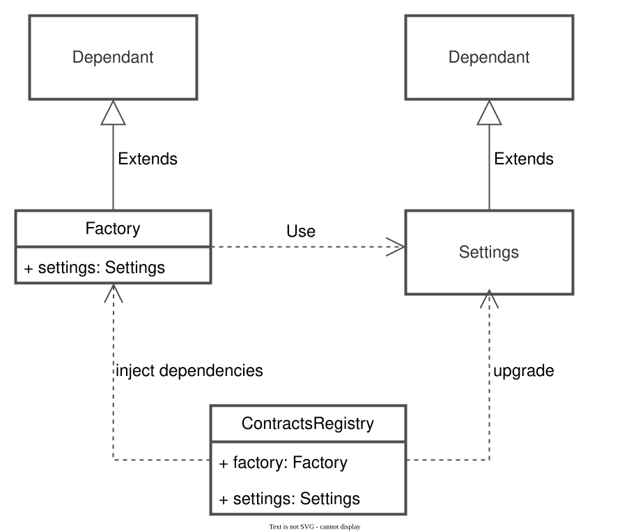

## 摘要

本 EIP 引入了一个链上注册表系统，去中心化协议可以使用它来管理其智能合约。

所提出的系统由两个组件组成：`ContractsRegistry` 和 `Dependant`。 `ContractsRegistry` 合约存储对协议中使用的每个智能合约的引用，可以选择通过在其之上部署自管理代理使其可升级，并充当 `Dependant` 合约查询的中心，以获取其所需的依赖项。

## 动机

在不断增长的以太坊生态系统中，项目往往变得越来越复杂。 现代协议需要可移植性和敏捷性，以通过不断提供新功能并与行业保持同步来满足客户需求。 然而，由于区块链和智能合约的不可变性，这个要求很难实现。 此外，复杂性的增加和持续的交付会带来错误并使合约之间的依赖关系变得复杂，从而降低系统的可支持性。

具有清晰架构外观的应用程序； 在设计时考虑到向前兼容性； 其依赖关系透明且干净，更易于开发和维护。 给定的 EIP 试图通过提供两个智能合约来解决上述问题：`ContractsRegistry` 和 `Dependant`。

使用所提供的系统可能具有的优点是：

- 通过专门的合约进行结构化的智能合约管理。
- 特设的协议升级能力提供。
- 运行时添加、删除和替换智能合约。
- 依赖注入机制，以保持智能合约的依赖关系在控制之下。
- 指定自定义访问控制规则以维护协议的能力。

## 规范

本文档中使用的关键词“MUST”，“MUST NOT”，“REQUIRED”，“SHALL”，“SHALL NOT”，“SHOULD”，“SHOULD NOT”，“RECOMMENDED”，“NOT RECOMMENDED”，“MAY”和“OPTIONAL”应按照 RFC 2119 和 RFC 8174 中的描述进行解释。

### 概述

该系统由两个智能合约组成：

- `ContractsRegistry` 是一个单例注册表，用于管理和升级协议的智能合约。
- `Dependant` 是一个 mix-in，它启用依赖注入机制。

下图描述了注册表及其依赖项之间的关系：



### ContractsRegistry

`ContractsRegistry` 是所提议系统的主要合约。 它必须存储对协议中使用的每个独立合约的引用。 可以配置 `ContractRegistry` 以在注册合约之上部署所选的代理合约。

此外，`ContractsRegistry` 必须拒绝注册零地址。

`ContractsRegistry` 必须实现以下接口：

```solidity
pragma solidity ^0.8.0;

interface IContractsRegistry {
    /**
     * @notice 合同添加到注册表时发出的事件
     * @param name 合同的名称
     * @param contractAddress 添加的合同的地址
     */
    event ContractAdded(string name, address contractAddress);
 
    /**
     * @notice 代理合同添加到注册表时发出的事件
     * @param name 合同的名称
     * @param contractAddress 代理合同的地址
     * @param implementation 实现合同的地址
     */
    event ProxyContractAdded(string name, address contractAddress, address implementation);
 
    /**
     * @notice 通过注册表升级代理合同时发出的事件
     * @param name 合同的名称
     * @param newImplementation 新的实现合同的地址
     */
    event ProxyContractUpgraded(string name, address newImplementation);
 
    /**
     * @notice 从注册表中删除合同时发出的事件
     * @param name 已删除合同的名称
     */
    event ContractRemoved(string name);
 
    /**
     * @notice 该函数通过名称返回关联的合同。
     *
     * 如果请求的合同是 `address(0)`，则必须回退
     *
     * @param name 合同的名称
     * @return 合同的地址
     */
    function getContract(string memory name) external view returns (address);
 
    /**
     * @notice 用于检查是否已添加具有给定名称的合同的函数
     * @param name 合同的名称
     * @return 如果合同存在于注册表中，则为 true
     */
    function hasContract(string memory name) external view returns (bool);
 
    /**
     * @notice 该函数将依赖项注入到给定的合同中。
     *
     * 必须使用 `address(this)` 和 `bytes("")` 作为参数在提供的合同上调用 `setDependencies()`
     *
     * @param name 合同的名称
     */
    function injectDependencies(string memory name) external;
 
    /**
     * @notice 该函数将依赖项注入到具有额外数据的给定合同中。
     *
     * 必须使用 `address(this)` 和 `data` 作为参数在提供的合同上调用 `setDependencies()`
     *
     * @param name 合同的名称
     * @param data 将传递到依赖合同的额外上下文数据
     */
    function injectDependenciesWithData(
        string memory name,
        bytes memory data
    ) external;
 
    /**
     * @notice 该函数使用新的实现来升级添加的代理合同。
     *
     * 所有者有责任确保实现之间的兼容性。
     *
     * 必须发出 `ProxyContractUpgraded` 事件
     *
     * @param name 代理合同的名称
     * @param newImplementation 代理将升级到的新实现
     */
    function upgradeContract(string memory name, address newImplementation) external;
 
    /**
     * @notice 该函数使用新的实现来升级添加的代理合同，提供数据
     *
     * 所有者有责任确保实现之间的兼容性。
     *
     * 必须发出 `ProxyContractUpgraded` 事件
     *
     * @param name 代理合同的名称
     * @param newImplementation 代理将升级到的新实现
     * @param data 代理升级后将使用的数据。 这可以是 ABI 编码的函数调用
     */
    function upgradeContractAndCall(
        string memory name,
        address newImplementation,
        bytes memory data
    ) external;
 
    /**
     * @notice 该函数将纯（非代理）合同添加到 `ContractsRegistry`。 合同可以是系统无法直接控制升级的合同，也可以是设计上不可升级的合同。
     *
     * 必须发出 `ContractAdded` 事件。 如果提供的地址是 `address(0)`，则回退
     *
     * @param name 与合同关联的名称
     * @param contractAddress 要添加的合同的地址
     */
    function addContract(string memory name, address contractAddress) external;
 
    /**
     * @notice 该函数通过在提供的实现之上部署代理合同来将它们添加到注册表中。
     *
     * 该函数可用于添加 `ContractsRegistry` 必须能够升级的合同。
     *
     * 必须发出 `ProxyContractAdded` 事件。 如果实现地址是 `address(0)`，则回退
     *
     * @param name 与合同关联的名称
     * @param contractAddress 指向代理的实现的地址
     */
    function addProxyContract(string memory name, address contractAddress) external;
 
    /**
     * @notice 该函数通过在提供的实现之上部署代理合同来将它们添加到注册表中，提供数据。
     *
     * 该函数可用于添加 `ContractsRegistry` 必须能够升级的合同。
     *
     * 必须发出 `ProxyContractAdded` 事件。 如果实现地址是 `address(0)`，则回退
     *
     * @param name 与合同关联的名称
     * @param contractAddress 实现的地址
     * @param data 将使用代理调用的数据。 这可以是 ABI 编码的初始化调用
     */
    function addProxyContractAndCall(
        string memory name,
        address contractAddress,
        bytes memory data
    ) external;
 
    /**
     * @notice 将已部署的代理添加到 `ContractsRegistry` 的函数。 当系统迁移到新的 `ContractRegistry` 时，可以使用它。 在这种情况下，新的注册表必须具有升级新添加的代理的凭据。
     *
     * 必须发出 `ProxyContractAdded` 事件。 如果实现地址是 `address(0)`，则回退
     *
     * @param name 与合同关联的名称
     * @param contractAddress 代理的地址
     */
    function justAddProxyContract(string memory name, address contractAddress) external;
 
    /**
     * @notice 从 ContractsRegistry 中删除合约的函数。
     *
     * 必须发出 `ContractRemoved` 事件。 如果合同已被删除，则回退
     *
     * @param name 与合同关联的名称
     */
    function removeContract(string memory name) external;
}
```

### Dependant

`ContractsRegistry` 与 `Dependant` 合约一起使用。 协议的每个独立合同都必须继承 `Dependant`，以支持依赖注入机制。

所需的依赖项必须在重写的 `setDependencies` 方法中设置，而不是在 `constructor` 或 `initializer` 方法中设置。

只有注入器才能调用 `setDependencies` 和 `setInjector` 方法。 初始注入器将为零地址，在这种情况下，对访问控制检查的调用不得回退。

`Dependant` 合约必须实现以下接口：

```solidity
pragma solidity ^0.8.0;

interface IDependant {
    /**
     * @notice 从 `ContractsRegistry` 调用的函数，用于注入依赖项。
     *
     * 合同必须对 `msg.sender` 执行正确的访问检查。 调用只能从 `ContractsRegistry` 进行
     *
     * @param contractsRegistry 用于从中提取依赖项的注册表
     * @param data 可能提供其他特定于应用程序的上下文的额外数据
     */
    function setDependencies(address contractsRegistry, bytes memory data) external;
 
    /**
     * @notice 设置新的依赖注入器的函数。
     *
     * 合同必须对 `msg.sender` 执行正确的访问检查
     *
     * @param injector 新的依赖注入器
     */
    function setInjector(address injector) external;
 
    /**
     * @notice 获取当前依赖注入器的函数
     * @return 当前依赖注入器
     */
    function getInjector() external view returns (address);
}
```

- `Dependant` 合约可以将依赖注入器（通常是 `ContractsRegistry`）地址存储在特殊插槽 `0x3d1f25f1ac447e55e7fec744471c4dab1c6a2b6ffb897825f9ea3d2e8c9be583` 中（通过 `bytes32(uint256(keccak256("eip6224.dependant.slot")) - 1)` 获得）。

## 理由

有一些设计决策必须明确指定：

### ContractsRegistry 理由

#### 合约标识符

选择 `string` 合约标识符而不是 `uint256` 和 `bytes32`，以保持代码可读性并减少与 `ContractsRegistry` 交互时的人为错误机会。 作为协议的最高级智能合约，用户通常可以通过区块浏览器或 DAO 与其交互。 清晰度优先于 gas 使用。

由于 `string` 标识符，事件参数未建立索引。 如果 `string indexed` 参数大于 32 字节，它将成为合同名称的 `keccak256` 哈希。 这一事实降低了可读性，这是优先考虑的。

#### 回退

如果请求的合同是 `address(0)`，则 `getContract` 视图函数会回退。 这对于最大限度地减少协议错误初始化的风险至关重要。 在执行任何依赖注入操作之前，应将正确的合同添加到注册表中。

如果提供的地址是 `address(0)`，则 `addContract`、`addProxyContract`、`addProxyContractAndCall` 和 `justAddProxyContract` 方法会回退，原因相同，以最大限度地降低风险。

### Dependant 理由

#### 依赖

提供 `data` 参数来携带其他特定于应用程序的上下文。 它可以用于扩展方法的行为。

#### 注入器

`setInjector` 函数被设为 `external`，以支持工厂制造的合约的依赖注入机制。 但是，应格外小心地使用该方法。

## 参考实现

> 请注意，参考实现依赖于 OpenZeppelin 合约 `4.9.2`。

### ContractsRegistry 实现

```solidity
pragma solidity ^0.8.0;

import {Address} from "@openzeppelin/contracts/utils/Address.sol";
import {TransparentUpgradeableProxy} from "@openzeppelin/contracts/proxy/transparent/TransparentUpgradeableProxy.sol";
import {OwnableUpgradeable} from "@openzeppelin/contracts-upgradeable/access/OwnableUpgradeable.sol";

import {Dependant} from "./Dependant.sol";

interface IContractsRegistry {
    event ContractAdded(string name, address contractAddress);
    event ProxyContractAdded(
        string name,
        address contractAddress,
        address implementation
    );
    event ProxyContractUpgraded(string name, address newImplementation);
    event ContractRemoved(string name);

    function getContract(string memory name) external view returns (address);

    function hasContract(string memory name) external view returns (bool);

    function injectDependencies(string memory name) external;

    function injectDependenciesWithData(string memory name, bytes memory data)
        external;

    function upgradeContract(string memory name, address newImplementation)
        external;

    function upgradeContractAndCall(
        string memory name,
        address newImplementation,
        bytes memory data
    ) external;

    function addContract(string memory name, address contractAddress) external;

    function addProxyContract(string memory name, address contractAddress)
        external;

    function addProxyContractAndCall(
        string memory name,
        address contractAddress,
        bytes memory data
    ) external;

    function justAddProxyContract(string memory name, address contractAddress)
        external;

    function removeContract(string memory name) external;
}

contract ProxyUpgrader {
    using Address for address;

    address private immutable _OWNER;

    modifier onlyOwner() {
        _onlyOwner();
        _;
    }

    constructor() {
        _OWNER = msg.sender;
    }

    function upgrade(address what_, address to_, bytes calldata data_) external onlyOwner {
        if (data_.length > 0) {
            TransparentUpgradeableProxy(payable(what_)).upgradeToAndCall(to_, data_);
        } else {
            TransparentUpgradeableProxy(payable(what_)).upgradeTo(to_);
        }
    }

    function getImplementation(address what_) external view onlyOwner returns (address) {
        // bytes4(keccak256("implementation()")) == 0x5c60da1b
        (bool success_, bytes memory returndata_) = address(what_).staticcall(hex"5c60da1b");

        require(success_, "ProxyUpgrader: not a proxy");

        return abi.decode(returndata_, (address));
    }

    function _onlyOwner() internal view {
        require(_OWNER == msg.sender, "ProxyUpgrader: not an owner");
    }
}

contract ContractsRegistry is IContractsRegistry, OwnableUpgradeable {
    ProxyUpgrader private _proxyUpgrader;

    mapping(string => address) private _contracts;
    mapping(address => bool) private _isProxy;

    function __ContractsRegistry_init() public initializer {
        _proxyUpgrader = new ProxyUpgrader();

        __Ownable_init();
    }

    function getContract(string memory name_) public view returns (address) {
        address contractAddress_ = _contracts[name_];

        require(
            contractAddress_ != address(0),
            "ContractsRegistry: this mapping doesn't exist"
        );

        return contractAddress_;
    }

    function hasContract(string memory name_) public view returns (bool) {
        return _contracts[name_] != address(0);
    }

    function getProxyUpgrader() external view returns (address) {
        return address(_proxyUpgrader);
    }

    function injectDependencies(string memory name_) public virtual onlyOwner {
        injectDependenciesWithData(name_, bytes(""));
    }

    function injectDependenciesWithData(string memory name_, bytes memory data_)
        public
        virtual
        onlyOwner
    {
        address contractAddress_ = _contracts[name_];

        require(
            contractAddress_ != address(0),
            "ContractsRegistry: this mapping doesn't exist"
        );

        Dependant dependant_ = Dependant(contractAddress_);
        dependant_.setDependencies(address(this), data_);
    }

    function upgradeContract(string memory name_, address newImplementation_)
        public
        virtual
        onlyOwner
    {
        upgradeContractAndCall(name_, newImplementation_, bytes(""));
    }

    function upgradeContractAndCall(
        string memory name_,
        address newImplementation_,
        bytes memory data_
    ) public virtual onlyOwner {
        address contractToUpgrade_ = _contracts[name_];

        require(
            contractToUpgrade_ != address(0),
            "ContractsRegistry: this mapping doesn't exist"
        );
        require(
            _isProxy[contractToUpgrade_],
            "ContractsRegistry: not a proxy contract"
        );

        _proxyUpgrader.upgrade(contractToUpgrade_, newImplementation_, data_);

        emit ProxyContractUpgraded(name_, newImplementation_);
    }

    function addContract(string memory name_, address contractAddress_)
        public
        virtual
        onlyOwner
    {
        require(
            contractAddress_ != address(0),
            "ContractsRegistry: zero address is forbidden"
        );

        _contracts[name_] = contractAddress_;

        emit ContractAdded(name_, contractAddress_);
    }

    function addProxyContract(string memory name_, address contractAddress_)
        public
        virtual
        onlyOwner
    {
        addProxyContractAndCall(name_, contractAddress_, bytes(""));
    }

    function addProxyContractAndCall(
        string memory name_,
        address contractAddress_,
        bytes memory data_
    ) public virtual onlyOwner {
        require(
            contractAddress_ != address(0),
            "ContractsRegistry: zero address is forbidden"
        );

        address proxyAddr_ = _deployProxy(
            contractAddress_,
            address(_proxyUpgrader),
            data_
        );

        _contracts[name_] = proxyAddr_;
        _isProxy[proxyAddr_] = true;

        emit ProxyContractAdded(name_, proxyAddr_, contractAddress_);
    }

    function justAddProxyContract(string memory name_, address contractAddress_)
        public
        virtual
        onlyOwner
    {
        require(
            contractAddress_ != address(0),
            "ContractsRegistry: zero address is forbidden"
        );

        _contracts[name_] = contractAddress_;
        _isProxy[contractAddress_] = true;

        emit ProxyContractAdded(
            name_,
            contractAddress_,
            _proxyUpgrader.getImplementation(contractAddress_)
        );
    }

    function removeContract(string memory name_) public virtual onlyOwner {
        address contractAddress_ = _contracts[name_];

        require(
            contractAddress_ != address(0),
            "ContractsRegistry: this mapping doesn't exist"
        );

        delete _isProxy[contractAddress_];
        delete _contracts[name_];

        emit ContractRemoved(name_);
    }

    function _deployProxy(
        address contractAddress_,
        address admin_,
        bytes memory data_
    ) internal virtual returns (address) {
        return
            address(
                new TransparentUpgradeableProxy(contractAddress_, admin_, data_)
            );
    }
}
```

### Dependant 实现

```solidity
pragma solidity ^0.8.0;

interface IDependant {
    function setDependencies(address contractsRegistry, bytes memory data) external;
 
    function setInjector(address injector) external;
 
    function getInjector() external view returns (address);
}

abstract contract Dependant is IDependant {
    /**
     * @dev bytes32(uint256(keccak256("eip6224.dependant.slot")) - 1)
     */
    bytes32 private constant _INJECTOR_SLOT =
        0x3d1f25f1ac447e55e7fec744471c4dab1c6a2b6ffb897825f9ea3d2e8c9be583;

    modifier dependant() {
        _checkInjector();
        _;
        _setInjector(msg.sender);
    }

    function setDependencies(address contractsRegistry_, bytes memory data_) public virtual;

    function setInjector(address injector_) external {
        _checkInjector();
        _setInjector(injector_);
    }

    function getInjector() public view returns (address injector_) {
        bytes32 slot_ = _INJECTOR_SLOT;

        assembly {
            injector_ := sload(slot_)
        }
    }

    function _setInjector(address injector_) internal {
        bytes32 slot_ = _INJECTOR_SLOT;

        assembly {
            sstore(slot_, injector_)
        }
    }

    function _checkInjector() internal view {
        address injector_ = getInjector();

        require(injector_ == address(0) || injector_ == msg.sender, "Dependant: not an injector");
    }
}
```

## 安全注意事项

`ContractsRegistry` 的所有者将其密钥保存在安全的地方至关重要。 凭据丢失/泄露到 `ContractsRegistry` 将导致应用程序无法返回。 `ContractRegistry` 是协议的基石，必须仅向受信任的各方授予访问权限。

### ContractsRegistry 安全性

- `ContractsRegistry` 不会在代理升级之间执行任何升级能力检查。 用户有责任确保新实现与旧实现兼容。

### Dependant 安全性

- `Dependant` 合约必须不迟于首次调用 `setDependencies` 函数时设置其依赖注入器。 也就是说，有可能抢先执行第一次依赖注入。

## 版权

版权及相关权利通过 [CC0](../LICENSE.md) 放弃。
