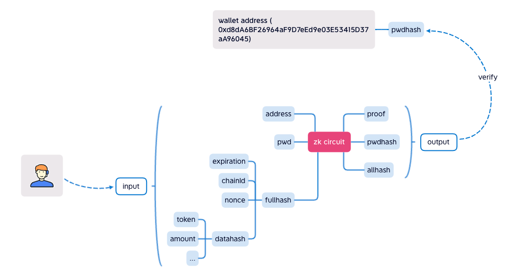
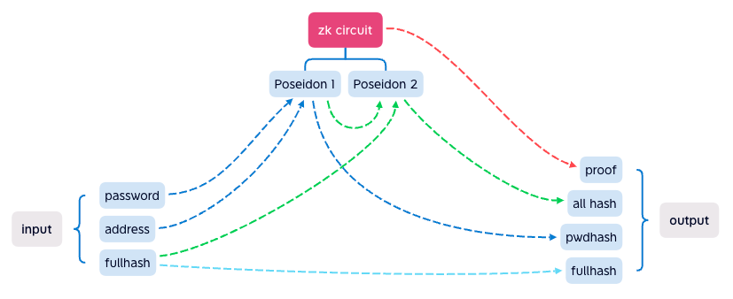
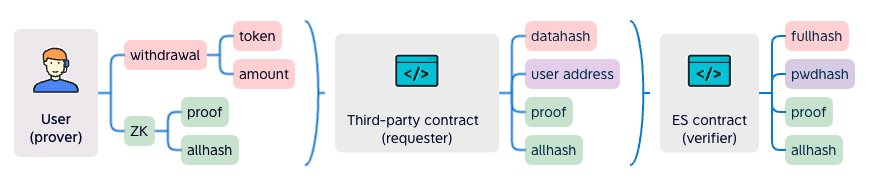

```md
---
eip: 6327
title: 弹性签名
description: 使用密码作为私钥来签名数据
author: George (@JXRow)
discussions-to: https://ethereum-magicians.org/t/eip-6327-elastic-signature-es/12554
status: Draft
type: Standards Track
category: ERC
created: 2023-01-13
---

## 摘要

弹性签名 (ES) 旨在用对人类友好的密钥来签名数据。该密钥将在链上完全验证，并且不会存储在任何地方。用户可以根据需要经常更改密钥。密钥没有固定的长度。该密钥将类似于密码，这是一个比私钥更容易理解的概念。对于非技术用户来说尤其如此。此 EIP 定义了一个智能合约接口，用于验证和授权 ES 的操作。

## 动机

一个可更改的 “私钥” 能让我们做什么？多年来，我们一直在寻找降低用户入门门槛的方法，特别是对于那些技术经验较少的人。私钥托管解决方案似乎提供了一种用户友好的入门体验，但它依赖于供应商，并且不是去中心化的。ES 通过零知识技术取得了突破。用户生成知道密钥的证明，智能合约将验证该证明。

### 用例

ES 是一种替代的签名算法。它不是私钥的非此即彼的解决方案。它旨在作为私钥签名之上的附加签名机制。

- DeFi 应用程序可以将 ES 应用于其转账资金流程。用户将被要求提供其密码才能完成交易。即使私钥被盗，这也能提供额外的保护。
- ES 也可以用作智能合约钱包的插件，例如账户抽象 [ERC-4337](./eip-4337.md)。选择一个去中心化的密码而不是私钥。这可能会为新的以太坊 Dapp 用户带来顺畅的入门体验。

## 规范

设：

- `pwdhash` 代表私有密钥（密码）的哈希值。
- `datahash` 代表目标交易数据的哈希值。
- `fullhash` 代表 `datahash` 和所有已知变量的哈希值。
- `expiration` 是目标交易过期的unix时间戳。
- `allhash` 代表 `fullhash` 和 `pwdhash` 的哈希值。

涉及三个参与方，验证者、请求者和证明者。

- 验证者，
  - 应该从请求者提供的 `datahash` 计算 `fullhash`。
  - 应该为给定的地址派生 `pwdhash`。该地址可以是 EOA 或智能合约钱包。
  - 应该使用派生的 `pwdhash`、计算出的 `fullhash` 和请求者提交的 `allhash` 来验证证明。
- 请求者
  - 应该生成 `datahash` 并决定一个 `expiration`。
  - 应从验证者处请求验证，
    - 来自证明者的 `proof` 和 `allhash`；
    - `datahash`；
    - `expiration`。
- 证明者
  - 应该从以下内容生成 `proof` 和 `allhash`，
    - 与请求者约定的 `datahash` 和 `expiration`；
    - `nonce` 和其他已知变量。

还有一些要求。

- 所有参与方都应该可以使用已知变量。
  - 应该包括一个 `nonce`。
  - 应该包括一个 `chainid`。
  - 可以包括任何特定于验证者的变量。
- 公共声明应该包括，
  - 一个反映 `pwdhash`；
  - 一个反映 `fullhash`；
  - 一个反映 `allhash`。
- `fullhash` 的计算应该由验证者和证明者双方约定。
- `datahash` 的计算

### `IElasticSignature` 接口

这是验证者接口。

```solidity
pragma solidity ^0.8.0;

interface IElasticSignature {
    /**
     * Event emitted after user set/reset their password
     * @param user - an user's address, for whom the password hash is set. It could be a smart contract wallet address
     *  or an EOA wallet address.
     * @param pwdhash - a password hash
     */
    event SetPassword(address indexed user, uint indexed pwdhash);

    /**
     * Event emitted after a successful verification performed for an user
     * @param user - an user's address, for whom the submitted `proof` is verified. It could be a smart contract wallet
     *  address or an EOA wallet address.
     * @param nonce - a new nonce, which is newly generated to replace the last used nonce. 
     */
    event Verified(address indexed user, uint indexed nonce);

    /**
     * Get `pwdhash` for a user
     * @param user - a user's address 
     * @return - the `pwdhash` for the given address
     */
    function pwdhashOf(address user) external view returns (uint);

    /**
     * Update an user's `pwdhash`
     * @param proof1 - proof generated by the old password
     * @param expiration1 - old password signing expiry seconds
     * @param allhash1 - allhash generated with the old password
     * @param proof2 - proof generated by the new password
     * @param pwdhash2 - hash of the new password
     * @param expiration2 - new password signing expiry seconds
     * @param allhash2 - allhash generated with the new password
     */
    function resetPassword(
        uint[8] memory proof1,
        uint expiration1,
        uint allhash1,
        uint[8] memory proof2,
        uint pwdhash2,
        uint expiration2,
        uint allhash2
    ) external;

    /**
     * Verify a proof for a given user
     * It should be invoked by other contracts. The other contracts provide the `datahash`. The `proof` is generated by
     *  the user. 
     * @param user -  a user's address, for whom the verification will be carried out.
     * @param proof - a proof generated by the password
     * @param datahash - the data what user signing, this is the hash of the data
     * @param expiration - number of seconds from now, after which the proof is expired 
     * @param allhash - public statement, generated along with the `proof`
     */
    function verify(
        address user,
        uint[8] memory proof,
        uint datahash,
        uint expiration,
        uint allhash
    ) external;
}
```

`verify` 函数应该由另一个合约调用。另一个合约应该生成 `datahash` 来调用它。该函数应该验证 `allhash` 是否使用密码正确且诚实地计算出来。

## 原理

该合约将存储每个人的 `pwdhash`。



下图显示了 ZK 电路逻辑。



要验证签名，它需要 `proof`、`allhash`、`pwdhash` 和 `fullhash`。



证明者生成 `proof` 以及公共输出。他们会将所有这些发送到第三方请求者合约。请求者将生成 `datahash`。它将 `datahash`、`proof`、`allhash`、`expiration` 和证明者的地址发送到验证者合约。该合约验证 `datahash` 是否来自证明者，这意味着提款操作是由证明者的密码签名的。

## 向后兼容性

此 EIP 与之前关于签名验证的工作向后兼容，因为此方法特定于基于密码的签名，而不是 EOA 签名。

## 参考实现

签名合约的示例实现：

```solidity
pragma solidity ^0.8.0;

import "../interfaces/IElasticSignature.sol";
import "./verifier.sol";

contract ZKPass is IElasticSignature {
    Verifier verifier = new Verifier();

    mapping(address => uint) public pwdhashOf;

    mapping(address => uint) public nonceOf;

    constructor() {
    }

    function resetPassword(
        uint[8] memory proof1,
        uint expiration1,
        uint allhash1,
        uint[8] memory proof2,
        uint pwdhash2,
        uint expiration2,
        uint allhash2
    ) public override {
        uint nonce = nonceOf[msg.sender];

        if (nonce == 0) {
            // init password
            // 初始化密码

            pwdhashOf[msg.sender] = pwdhash2;
            nonceOf[msg.sender] = 1;
            verify(msg.sender, proof2, 0, expiration2, allhash2);
        } else {
            // reset password
            // 重置密码

            // check old pwdhash
            // 检查旧的 pwdhash
            verify(msg.sender, proof1, 0, expiration1, allhash1);

            // check new pwdhash
            // 检查新的 pwdhash
            pwdhashOf[msg.sender] = pwdhash2;
            verify(msg.sender, proof2, 0, expiration2, allhash2);
        }

        emit SetPassword(msg.sender, pwdhash2);
    }

    function verify(
        address user,
        uint[8] memory proof,
        uint datahash,
        uint expiration,
        uint allhash
    ) public override {
        require(
            block.timestamp < expiration,
            "ZKPass::verify: expired"
        );

        uint pwdhash = pwdhashOf[user];
        require(
            pwdhash != 0,
            "ZKPass::verify: user not exist"
        );

        uint nonce = nonceOf[user];
        uint fullhash = uint(keccak256(abi.encodePacked(expiration, block.chainid, nonce, datahash))) / 8; // 256b->254b
        require(
            verifyProof(proof, pwdhash, fullhash, allhash),
            "ZKPass::verify: verify proof fail"
        );

        nonceOf[user] = nonce + 1;

        emit Verified(user, nonce);
    }

    /////////// util ////////////

    function verifyProof(
        uint[8] memory proof,
        uint pwdhash,
        uint fullhash, //254b
        uint allhash
    ) internal view returns (bool) {
        return
            verifier.verifyProof(
                [proof[0], proof[1]],
                [[proof[2], proof[3]], [proof[4], proof[5]]],
                [proof[6], proof[7]],
                [pwdhash, fullhash, allhash]
            );
    }
}
```

verifier.sol 是由 snarkjs 自动生成的，源代码 circuit.circom 如下所示

```javascript
pragma circom 2.0.0;

include "../../node_modules/circomlib/circuits/poseidon.circom";

template Main() {
    signal input in[3];
    signal output out[3];

    component poseidon1 = Poseidon(2);
    component poseidon2 = Poseidon(2);

    poseidon1.inputs[0] <== in[0];  //pwd
    poseidon1.inputs[1] <== in[1];  //address
    out[0] <== poseidon1.out; //pwdhash

    poseidon2.inputs[0] <== poseidon1.out;
    poseidon2.inputs[1] <== in[2]; //fullhash
    out[1] <== in[2]; //fullhash
    out[2] <== poseidon2.out; //allhash
}

component main = Main();
```

## 安全考虑

由于 pwdhash 是公开的，因此有可能破解密码。我们估计 RTX3090 的 Poseidon 哈希率为 100Mhash/s，这是破解时间的估计值：

8 个字符（数字）：1 秒

8 个字符（数字 + 英语）：25 天

8 个字符（数字 + 英语 + 符号）：594 天

12 个字符（数字）：10000 秒

12 个字符（数字 + 英语）：1023042 年

12 个字符（数字 + 英语 + 符号）：116586246 年

私钥的破解难度为 2^256，40 个字符（数字 + 英语 + 符号）的破解难度为 92^40，92^40 > 2^256，因此当密码为 40 个字符时，破解难度比私钥更大。

## 版权

版权和相关权利已通过 [CC0](../LICENSE.md) 放弃。
```