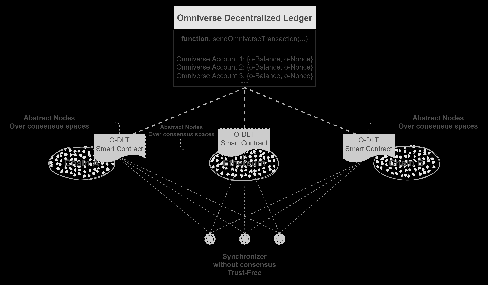

```md
---
eip: 6358
title: 跨链 Token 状态同步
description: 一种在多个现有公链上同步 Token 状态的范例
author: Shawn Zheng (@xiyu1984), Jason Cheng <chengjingxx@gmail.com>, George Huang (@virgil2019), Kay Lin (@kay404)
discussions-to: https://ethereum-magicians.org/t/add-eip-6358-omniverse-distributed-ledger-technology/12625
status: Review
type: Standards Track
category: ERC
created: 2023-01-17
---

## 摘要

本 ERC 标准化了一个与共识无关的可验证的跨链桥接的合约层接口，通过该接口，我们可以在多链上定义一个继承自 [ERC-20](./eip-20.md)/[ERC-721](./eip-721.md) 的新的全局 token。

### 图 1. 架构



通过这个 ERC，我们可以创建一个全局 token 协议，该协议利用现有区块链上的智能合约或类似机制来同步记录 token 状态。同步可以由无需信任的链下同步器完成。

## 动机

- 当前的 token 桥范例导致资产碎片化。
- 如果 ETH 通过当前的 token 桥转移到另一条链，如果该链崩溃，用户的 ETH 将会丢失。

本 ERC 的核心是同步而不是转移，即使所有其他链都崩溃了，只要以太坊还在运行，用户的资产就不会丢失。

- 碎片问题将得到解决。
- 用户多链资产的安全性可以大大提高。

## 规范

本文档中的关键词“必须 (MUST)”，“不得 (MUST NOT)”，“必需 (REQUIRED)”，“应 (SHALL)”，“不应 (SHALL NOT)”，“应该 (SHOULD)”，“不应该 (SHOULD NOT)”，“推荐 (RECOMMENDED)”，“不推荐 (NOT RECOMMENDED)”，“可以 (MAY)”和“可选 (OPTIONAL)”应按照 RFC 2119 和 RFC 8174 中的描述进行解释。

### Omniverse 账户

本 ERC 应该有一个全局用户标识符，建议在本文中将其称为 Omniverse 账户（简称 `o-account`）。
建议将 `o-account` 表示为由椭圆曲线 `secp256k1` 创建的公钥。建议为不同的环境使用 [映射机制](#mapping-mechanism-for-different-environments)。

### 数据结构

Omniverse 交易（简称 `o-transaction`）必须使用以下数据结构进行描述：

```solidity
/**
 * @notice Omniverse 交易数据结构
 * @member nonce: o-transaction 的数量。如果一个 omniverse 账户的当前 nonce 为 `k`，则该 o-account 在下一个 o-transaction 中的有效 nonce 为 `k+1`。
 * @member chainId: 发起 o-transaction 的链
 * @member initiateSC: 首次发起 o-transaction 的合约地址
 * @member from: 签署 o-transaction 的 Omniverse 账户
 * @member payload: 编码的业务逻辑数据，由开发者维护
 * @member signature: 上述信息的签名。
 */
struct ERC6358TransactionData {
    uint128 nonce;
    uint32 chainId;
    bytes initiateSC;
    bytes from;
    bytes payload;
    bytes signature;
}
```

- 数据结构 `ERC6358TransactionData` 必须如上定义。
- 成员 `nonce` 必须定义为 `uint128`，以便更好地兼容更多区块链技术栈。
- 成员 `chainId` 必须定义为 `uint32`。
- 成员 `initiateSC` 必须定义为 `bytes`。
- 成员 `from` 必须定义为 `bytes`。
- 成员 `payload` 必须定义为 `bytes`。它由与 o-transaction 相关的用户自定义数据编码而来。例如：
    - 对于同质化 token，建议如下：

        ```solidity
        /**
        * @notice 同质化 token 数据结构，`ERC6358TransactionData` 中的字段 `payload` 将由此编码
        *
        * @member op: 操作类型
        * NOTE op: 0-31 为保留值，32-255 为自定义值
        *           op: 0 - omniverse 账户 `from` 将 `amount` 个 token 转移到 omniverse 账户 `exData`，`from` 至少有 `amount` 个 token
        *           op: 1 - omniverse 账户 `from` 将 `amount` 个 token 铸造到 omniverse 账户 `exData`
        *           op: 2 - omniverse 账户 `from` 从自己的账户销毁 `amount` 个 token，`from` 至少有 `amount` 个 token
        * @member exData: 操作数据。该部分可以为空，由 `op` 决定。例如：
                    当 `op` 为 0 和 1 时，`exData` 存储接收方的 omniverse 账户。
                    当 `op` 为 2 时，`exData` 为空。
        * @member amount: 要操作的 token 数量
        */
        struct Fungible {
            uint8 op;
            bytes exData;
            uint256 amount;
        }
        ```

        - 建议将 `o-transaction` 中 `signature` 相关的原始数据设置为 `op`、`exData` 和 `amount` 的原始字节的连接。

    - 对于非同质化 token，建议如下：

        ```solidity
        /**
        * @notice 非同质化 token 数据结构，`ERC6358TransactionData` 中的字段 `payload` 将由此编码
        *
        * @member op: 操作类型
        * NOTE op: 0-31 为保留值，32-255 为自定义值
        *           op: 0 omniverse 账户 `from` 将 token `tokenId` 转移到 omniverse 账户 `exData`，`from` 拥有 `tokenId` 的 token
        *           op: 1 omniverse 账户 `from` 将 token `tokenId` 铸造到 omniverse 账户 `exData`
        *           op: 2 omniverse 账户 `from` 销毁 token `tokenId`，`from` 拥有 `tokenId` 的 token
        * @member exData: 操作数据。该部分可以为空，由 `op` 决定
        *           当 `op` 为 0 和 1 时，`exData` 存储接收方的 omniverse 账户。
                    当 `op` 为 2 时，`exData` 为空。
        * @member tokenId: 要操作的非同质化 token 的 tokenId
        */
        struct NonFungible {
            uint8 op;
            bytes exData;
            uint256 tokenId;
        }
        ```

        - 建议将 `o-transaction` 中 `signature` 相关的原始数据设置为 `op`、`exData` 和 `tokenId` 的原始字节的连接。

- 成员 `signature` 必须定义为 `bytes`。建议按如下方式创建。
    - 可以选择将 `ERC6358TransactionData` 中的各个部分连接起来，如下所示（以同质化 token 为例），并使用 `keccak256` 计算哈希值：

        ```solidity
        /**
        * @notice 将 `_data` 从 bytes 解码为 Fungible
        * @return 一个 `Fungible` 实例
        */
        function decodeData(bytes memory _data) internal pure returns (Fungible memory) {
            (uint8 op, bytes memory exData, uint256 amount) = abi.decode(_data, (uint8, bytes, uint256));
            return Fungible(op, exData, amount);
        }
        
        /**
        * @notice 获取交易的哈希值
        * @return `ERC6358TransactionData` 实例原始数据的哈希值
        */
        function getTransactionHash(ERC6358TransactionData memory _data) public pure returns (bytes32) {
            Fungible memory fungible = decodeData(_data.payload);
            bytes memory payload = abi.encodePacked(fungible.op, fungible.exData, fungible.amount);
            bytes memory rawData = abi.encodePacked(_data.nonce, _data.chainId, _data.initiateSC, _data.from, payload);
            return keccak256(rawData);
        }
        ```

    - 可以选择根据 `EIP-712` 封装 `ERC6358TransactionData` 中的各个部分。
    - 签署哈希值。

### 智能合约接口

- 每个 [ERC-6358](./eip-6358.md) 兼容的合约都必须实现 `IERC6358`

    ```solidity
    /**
    * @notice ERC-6358 的接口
    */
    interface IERC6358 {
        /**
        * @notice 在通过调用 {sendOmniverseTransaction} 发送 nonce 为 `nonce` 且由用户 `pk` 签名的 o-transaction 时发出
        */
        event TransactionSent(bytes pk, uint256 nonce);

        /**
        * @notice 发送一个 `o-transaction`
        * @dev
        * Note: 必须实现 `_data.signature` 的验证
        * Note: 推荐维护一个保存 `o-account` 和相关交易 nonce 的映射
        * Note: 必须根据当前账户 nonce 实现 `_data.nonce` 的验证
        * Note: 必须实现 `_data.payload` 的验证
        * Note: 此接口仅用于发送 `o-transaction`，执行不得在此接口内进行
        * Note: 建议 `o-transaction` 的实际执行在另一个函数中进行，并且可以延迟一段时间
        * @param _data: 类型为 {ERC6358TransactionData} 的 `o-transaction` 数据
        * 有关更多信息，请参见 {ERC6358TransactionData} 的定义
        *
        * 发出 {TransactionSent} 事件
        */
        function sendOmniverseTransaction(ERC6358TransactionData calldata _data) external;

        /**
        * @notice 获取用户 `_pk` 发送的 omniverse 交易数量，
        * 这也是用户 `_pk` 新 omniverse 交易的有效 `nonce`
        * @param _pk: 要查询的 Omniverse 账户
        * @return 用户 `_pk` 发送的 omniverse 交易数量
        */
        function getTransactionCount(bytes memory _pk) external view returns (uint256);

        /**
        * @notice 获取用户 `_use` 在指定 nonce `_nonce` 处的交易数据 `txData` 和时间戳 `timestamp`
        * @param _user 要查询的 Omniverse 账户
        * @param _nonce 要查询的 nonce
        * @return 返回用户 `_use` 在指定 nonce `_nonce` 处的交易数据 `txData` 和时间戳 `timestamp`
        */
        function getTransactionData(bytes calldata _user, uint256 _nonce) external view returns (ERC6358TransactionData memory, uint256);

        /**
        * @notice 获取链 ID
        * @return 返回链 ID
        */
        function getChainId() external view returns (uint32);
    }
    ```

    - `sendOmniverseTransaction` 函数可以实现为 `public` 或 `external`
    - `getTransactionCount` 函数可以实现为 `public` 或 `external`
    - `getTransactionData` 函数可以实现为 `public` 或 `external`
    - `getChainId` 函数可以实现为 `pure` 或 `view`
    - 调用 `sendOmniverseTransaction` 函数时，必须发出 `TransactionSent` 事件
- 可选扩展：同质化 Token

    ```solidity
    // import "{IERC6358.sol}";

    /**
    * @notice ERC-6358 同质化 token 的接口，它继承自 {IERC6358}
    */
    interface IERC6358Fungible is IERC6358 {
        /**
        * @notice 获取用户 `_pk` 的 omniverse 余额
        * @param _pk 要查询的 `o-account`
        * @return 返回用户 `_pk` 的 omniverse 余额
        */
        function omniverseBalanceOf(bytes calldata _pk) external view returns (uint256);
    }
    ```

    - `omniverseBalanceOf` 函数可以实现为 `public` 或 `external`

- 可选扩展：非同质化 Token

    ```solidity
    import "{IERC6358.sol}";

    /**
    * @notice ERC-6358 非同质化 token 的接口，它继承自 {IERC6358}
    */
    interface IERC6358NonFungible is IERC6358 {
        /**
        * @notice 获取账户 `_pk` 中 omniverse NFT 的数量
        * @param _pk 要查询的 `o-account`
        * @return 返回账户 `_pk` 中 omniverse NFT 的数量
        */
        function omniverseBalanceOf(bytes calldata _pk) external view returns (uint256);

        /**
        * @notice 获取 `tokenId` 的 omniverse NFT 的所有者
        * @param _tokenId 要查询的 Omniverse NFT ID
        * @return 返回 `tokenId` 的 omniverse NFT 的所有者
        */
        function omniverseOwnerOf(uint256 _tokenId) external view returns (bytes memory);
    }
    ```

    - `omniverseBalanceOf` 函数可以实现为 `public` 或 `external`
    - `omniverseOwnerOf` 函数可以实现为 `public` 或 `external`

## 原理

### 架构

如图 [图 1.](#figure1-architecture) 所示，部署在多链上的智能合约通过无需信任的链下同步器同步执行 ERC-6358 token 的 `o-transactions`。

- ERC-6358 智能合约被称为 **抽象节点**。分别部署在不同区块链上的抽象节点所记录的状态可以被认为是全局状态的副本，并且它们最终是一致的。
- **同步器** 是一个链下执行程序，负责将已发布的 `o-transactions` 从一个区块链上的 ERC-6358 智能合约传输到其他区块链。同步器的工作是无需信任的，因为它们只传递带有他人签名的 `o-transactions`，详细信息可以在 [工作流程](#workflow) 中找到。

### 原则

- `o-account` 已经在 [上面](#omniverse-account) 提到。
- `o-transactions` 的同步保证了所有链上 token 状态的最终一致性。相关的数据结构在 [这里](#data-structure)。

    - 引入 `nonce` 机制以使状态在全局范围内保持一致。
    - `nonce` 出现在两个地方，一个是 `o-transaction 中的 nonce` 数据结构，另一个是由链上 ERC-6358 智能合约维护的 `账户 nonce`。
    - 同步时，将通过将 `o-transaction 中的 nonce` 与 `账户 nonce` 进行比较来检查 `o-transaction 中的 nonce`。

#### 工作流程

- 假设一个普通用户 `A` 及其相关的操作 `账户 nonce` 为 $k$。
- `A` 通过调用 `IERC6358::sendOmniverseTransaction` 在以太坊上发起一个 `o-transaction`。部署在以太坊上的 ERC-6358 智能合约中 `A` 的当前 `账户 nonce` 为 $k$，因此 `o-transaction 中的 nonce` 的有效值需要为 $k+1$。
- 以太坊上的 ERC-6358 智能合约验证 `o-transaction` 数据的签名。如果验证成功，`o-transaction` 数据将由以太坊端的智能合约发布。验证包括：
    - 余额 (FT) 或所有权 (NFT) 是否有效
    - 以及 `o-transaction 中的 nonce` 是否为 $k+1$
- `o-transaction` 不应立即在以太坊上执行，而是等待一段时间。
- 现在，`A` 在以太坊上最新提交的 `o-transaction 中的 nonce` 为 $k+1$，但在其他链上仍然为 $k$。
- 链下同步器会找到一个在以太坊上新发布的 `o-transaction`，但在其他链上没有。
- 接下来，同步器将争先恐后地传递此消息，因为有奖励机制。（奖励策略可以由 ERC-6358 token 的部署者决定。例如，奖励可以来自服务费或挖矿机制。）
- 最后，部署在其他链上的 ERC-6358 智能合约将全部收到 `o-transaction` 数据，验证签名并在 **等待时间到** 时执行它。
- 执行后，所有链上的 `账户 nonce` 都将增加 1。现在，账户 `A` 的所有 `账户 nonce` 都将为 $k+1$，并且相关账户的余额状态也将相同。

## 参考实现

### Omniverse 账户

- 一个 Omniverse 账户示例：`3092860212ceb90a13e4a288e444b685ae86c63232bcb50a064cb3d25aa2c88a24cd710ea2d553a20b4f2f18d2706b8cc5a9d4ae4a50d475980c2ba83414a796`
    - Omniverse 账户是椭圆曲线 `secp256k1` 的公钥
    - 该示例的相关私钥为：`cdfa0e50d672eb73bc5de00cc0799c70f15c5be6b6fca4a1c82c35c7471125b6`

#### 不同环境的映射机制

在最简单的实现中，我们可以只构建两个映射来获取它。一个是类似于 `基于 sece256k1 的 pk => 特殊环境中的账户地址`，另一个是反向映射。

`Flow` 上的 `账户系统` 是一个典型的例子。

- `Flow` 有一个内置的 `账户地址 => pk` 机制。公钥可以绑定到一个账户（一个特殊的内置数据结构），并且可以直接从 `账户地址` 获取公钥。
- 可以通过创建一个映射 `{String: Address}` 来构建从 `pk` 到 Flow 上的 `账户地址` 的映射，其中 `String` 表示用于表示公钥的数据类型，而 `Address` 是 Flow 上 `账户地址` 的数据类型。

### ERC-6358 Token

ERC-6358 Token 可以使用 [上面提到的接口](#smart-contract-interface) 实现。它也可以与 [ERC-20](./eip-20.md)/[ERC-721](./eip-721.md) 结合使用。

- 接口的实现示例可以在以下位置找到：

    - [接口 `IERC6358`](../assets/eip-6358/src/contracts/interfaces/IERC6358.sol)，[上面](#smart-contract-interface) 提到的基本 ERC-6358 接口
    - [接口 `IERC6358Fungible`](../assets/eip-6358/src/contracts/interfaces/IERC6358Fungible.sol)，用于 ERC-6358 同质化 token 的接口
    - [接口 `IERC6358NonFungible`](../assets/eip-6358/src/contracts/interfaces/IERC6358NonFungible.sol)，用于 ERC-6358 非同质化 token 的接口

- 可以在以下位置找到一些用于操作 ERC-6358 的常用工具的实现示例：

    - [常用工具](../assets/eip-6358/src/contracts/libraries/OmniverseProtocolHelper.sol)。

- ERC-6358 同质化 Token 和 ERC-6358 非同质化 Token 的实现示例可以在以下位置找到：

    - [ERC-6358 同质化 Token 示例](../assets/eip-6358/src/contracts/ERC6358FungibleExample.sol)
    - [ERC-6358 非同质化 Token 示例](../assets/eip-6358/src/contracts/ERC6358NonFungibleExample.sol)

## 安全注意事项

### 攻击向量分析

根据以上内容，有两种角色：

- **普通用户** 是发起 `o-transaction` 的人
- **同步器** 是如果他们发现不同链之间的差异就传递 `o-transaction` 数据的人。

这两种角色可能是发生攻击的地方：

#### ***同步器* 会作弊吗？**

- 简而言之，这与**同步器**无关，因为**他们无法创建其他用户的签名**，除非一些 **普通用户** 告诉他，但在这一点上，我们认为这是 **普通用户** 角色的问题。
- **同步器** 没有意志，也无法作恶，因为他们传递的 `o-transaction` 数据是由其他 **普通用户** 的相关 **签名** 验证的。
- 只要 **同步器** 提交有效的 `o-transaction` 数据，他们就会获得奖励，而 *有效* 仅意味着签名和金额都有效。稍后在分析 **普通用户** 角色时将详细解释这一点。
- **同步器** 会在发现不同链之间的差异时进行传递：
    - 如果一条链上的当前 `账户 nonce` 小于另一条链上已发布的 `o-transaction 中的 nonce`
    - 如果一条链上与特定 `o-transaction 中的 nonce` 相关的交易数据与另一条链上具有相同 `o-transaction 中的 nonce` 的已发布的 `o-transaction` 数据不同

- **结论：*同步器* 不会作弊，因为他们没有作弊的好处，也没有作弊的方法。**

#### ***普通用户* 会作弊吗？**

- 简而言之，**他们可能会**，但幸运的是，**他们不会成功**。
- 假设 **普通用户** `A` 在所有链上的当前 `账户 nonce` 为 $k$。`A` 有 100 个 token `X`，这是 ERC-6358 token 的一个实例。
- 普通用户 `A` 首先在 Polkadot 的一条平行链上发起一个 `o-transaction`，其中 `A` 将 `10` 个 `X` 转移给 **普通用户** `B` 的一个 `o-account`。`o-transaction 中的 nonce` 需要为 $k+1$。在签名和数据验证之后，`o-transaction` 数据 (简称为 `ot-P-ab`) 将在 Polkadot 上发布。
- 同时，`A` 在以太坊上发起一个 **相同 nonce** $k+1$ 但 **不同数据**（例如，将 `10` 个 `X` 转移给另一个 `o-account` `C`）的 `o-transaction`。这个 `o-transaction` (简称为 `ot-E-ac`) 将首先通过以太坊上的验证，然后被发布。
- 在这一点上，`A` 似乎完成了一次 ***双花攻击***，并且 Polkadot 和以太坊上的状态不同。
- **应对策略**：
    - 正如我们上面提到的，同步器会将 `ot-P-ab` 传递给以太坊，并将 `ot-E-ac` 传递给 Polkadot，因为它们是不同的，尽管具有相同的 nonce。首先提交 `o-transaction` 的同步器将获得奖励，因为签名是有效的。
    - Polkadot 和以太坊上的 ERC-6358 智能合约或类似机制都会发现 `A` 在分别收到 `ot-E-ac` 和 `ot-P-ab` 后进行了作弊，因为 `A` 的签名是不可否认的。
    - 我们已经提到，`o-transaction` 的执行不会立即完成，而是需要一段固定的等待时间。因此，`A` 造成的 `双花攻击` 不会成功。
    - 将会有许多同步器等待传递 o-transactions 以获得奖励。因此，尽管一个 **普通用户** 几乎不可能向两条链提交两个 `o-transactions`，但由于网络问题或其他原因，没有任何同步器成功传递 `o-transactions`，我们仍然提供了一个解决方案：
        - 同步器将连接到每个公链的几个原生节点，以避免恶意原生节点。
        - 如果确实发生了所有同步器的网络中断的情况，`o-transactions` 将在网络恢复时同步。如果等待时间已到并且作弊的 `o-transaction` 已被执行，我们仍然能够根据 `o-transaction 中的 nonce` 和 `账户 nonce` 从作弊发生的地方恢复它。
- 最终，`A` 无法逃脱惩罚（例如，锁定他的账户或其他措施，这与开发者根据自己的情况确定的特定 token 经济学有关）。

- **结论：*普通用户* 可能会作弊，但不会成功。**

## 版权

版权和相关权利通过 [CC0](../LICENSE.md) 放弃。
```