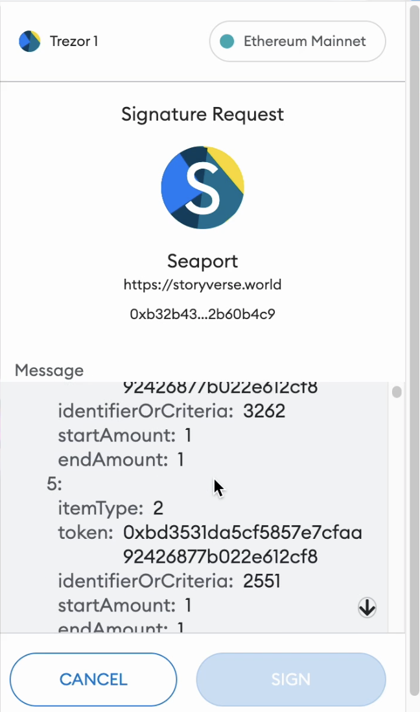
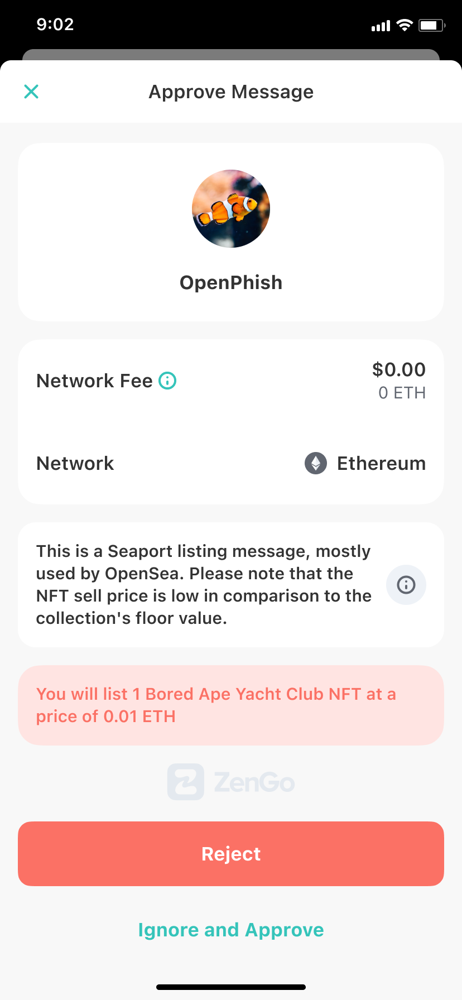

```md
---
eip: 6384
title: 人类可读的离线签名
description: 一种用于检索 EIP-712 类型化和结构化数据的人类可读描述的方法。
author: Tal Be'ery <tal@zengo.com>, RoiV (@DeVaz1)
discussions-to: https://ethereum-magicians.org/t/eip-6384-readable-eip-712-signatures/12752
status: Stagnant
type: Standards Track
category: ERC
created: 2023-01-08
requires: 712
---

## 摘要

本 EIP 引入了 `evalEIP712Buffer` 函数，该函数接受一个 [EIP-712](./eip-712.md) 缓冲区并返回一个人类可读的文本描述。

## 动机

Web3 链下签名的用例旨在用于链上交易，这种用例正日益普及，并被应用于多个领先的协议（例如 OpenSea）和标准 [EIP-2612](./eip-2612.md) 中，这主要是因为它提供了免手续费的体验。
众所周知，攻击者会积极且成功地滥用此类链下签名，利用了用户盲目签署链下消息这一事实，因为这些消息不是人类可读的。
虽然 [EIP-712](./eip-712.md) 最初在其标题中声明“人类可读”是其目标之一，但它最终并未实现其承诺，并且 EIP-712 消息对于普通用户来说是无法理解的。

在一个例子中，受害者浏览一个恶意的网络钓鱼网站。它请求受害者签署一条消息，该消息实际上是免费地将他们的 NFT 代币放在 OpenSea 平台上出售。

一些流行的钱包实现的UI没有传达签署此类交易的实际含义。

在本提案中，我们提供了一种安全且可扩展的方法，通过利用其绑定的智能合约，将真正的人类可读性带入 EIP-712 消息。
因此，一旦实施了此 EIP，钱包就可以将其用户体验从当前状态升级：



升级到更清晰的用户体验：



所提出的解决方案通过允许钱包查询 `verifyingContract` 来解决可读性问题。 保持 EIP-712 消息描述尽可能准确的激励措施是一致的，因为描述的责任现在由合约拥有，合约：

- 准确地知道消息的含义（并且可能会重用在链上接收到此消息时处理该消息的代码）
- 天然地激励提供最佳解释以防止可能的欺诈
- 不涉及需要信任的第三方
- 维护免手续费的客户体验，因为添加的函数处于“view”模式，不需要链上执行和手续费。
- 维护 Web3 的可组合性属性

## 规范

本文档中的关键词“MUST”、“MUST NOT”、“REQUIRED”、“SHALL”、“SHALL NOT”、“SHOULD”、“SHOULD NOT”、“RECOMMENDED”、“MAY”和“OPTIONAL”应按照 RFC 2119 中的描述进行解释。

EIP-712 已经使用 `verifyingContract` 参数将链下签名正式绑定到合约。 我们建议向此类合约添加一个 "view" 函数（`"stateMutability":"view"`），该函数返回此特定链下缓冲区含义的人类可读描述。

```solidity
/**
 * @dev 返回链下消息的预期结果.
*/

     function evalEIP712Buffer(bytes32 domainHash, string memory primaryType, bytes memory typedDataBuffer)
     external
     view
     returns (string[] memory) {
   ...

}
```

**每个兼容的合约都必须实现此函数。**

使用此函数，钱包可以将提议的链下签名提交给合约，并将结果呈现给用户，从而使他们能够享受与其链下消息的“链上模拟等效”体验。

此函数将具有一个众所周知的名称和签名，因此无需更新 EIP-712 结构。

### 函数的输入

函数的输入：

- `domainHash` 是 EIP-712 的 domainSeparator，一个哈希的 `eip712Domain` 结构体。
- `primaryType` 是 EIP-712 的 `primaryType`。
- `typedDataBuffer` 是 ABI 编码的消息部分，是 EIP-712 完整消息的一部分。

### 函数的输出

函数的输出是一个字符串数组。 钱包应该将它们显示给其最终用户。 钱包可以选择使用附加数据来扩充返回的字符串。 （例如，将合约地址解析为其名称）

这些字符串不应格式化（例如，不应包含 HTML 代码），并且钱包应将此字符串视为不受信任的输入并进行相应处理。

### 支持不打算在链上使用的 EIP-712 消息

如果 `verifyingContract` 未包含在 EIP-712 域分隔符中，则钱包不得使用此 EIP 检索人类可读的描述。 在这种情况下，钱包应回退到其原始 EIP-712 显示。

## 理由

- 我们选择将 `typeDataBuffer` 参数实现为 abi 编码，因为它是一种将数据传递给合约的通用方法。 另一种方法是传递 `typedData` 结构，它不是通用的，因为它要求合约指定消息数据。
- 我们选择返回一个字符串数组而不是单个字符串，因为在某些情况下，消息由多个部分组成。 例如，在同一 `typedDataBuffer` 中进行多个资产转移的情况下，建议合约在单独的字符串中描述每个转移，以允许钱包单独显示每个转移。

### 替代解决方案

#### 第三方服务：

目前，用户最好选择依赖某些第三方解决方案，这些解决方案将提议的消息作为输入，并向用户解释其预期的含义。 这种方法是：

- 不可扩展：第三方提供商需要学习所有此类专有消息
- 不一定正确：解释基于第三方对原始消息作者的解释
- 引入了不必要的第三方依赖，这可能会带来一些运营、安全和隐私方面的影响。

#### 域名绑定

或者，钱包可以将域名绑定到签名。 也就是说，仅当 EIP-712 定义的 `name` 的 web2 域名包含在 `eip712Domain` 中时，才接受来自该域名的 EIP-712 消息。 但是，这种方法具有以下缺点：

- 它打破了 Web3 的可组合性，因为现在其他 dapps 无法与此类消息交互
- 不能防止来自指定 web2 域名的错误消息，例如，当 web2 域名被黑客入侵时
- 某些当前连接器（例如 WalletConnect）不允许钱包验证 web2 域名的真实性

## 向后兼容性

对于不支持的合约，钱包将默认显示他们今天显示的内容。
不支持的钱包不会调用此函数，并且将默认显示他们今天显示的内容。

## 参考实现

参考实现可以在[这里](../assets/eip-6384/implementation/src/MyToken/MyToken.sol)找到.
这个玩具示例展示了一个支持此 EIP 的 [EIP-20](./eip-20.md) 合约如何为 "transferWithSig" 功能（Permit 的非标准变体）实现对 EIP-712 的支持，因为此 EIP 的目的是允许非标准 EIP-712 缓冲区具有可读性。
为了说明此 EIP 对某些真实世界用例的可用性，[此处](../assets/eip-6384/implementation/src/SeaPort/SeaPort712ParserHelper.sol)也实现了用于实际 OpenSea 的 SeaPort EIP-712 的辅助函数。

## 安全考虑

### 威胁模型：

攻击是由一个恶意的 web2 接口（“dapp”）促成的，该接口为一个旨在被合法合约使用的 EIP-712 格式消息提供了错误的参数。 因此，消息由攻击者控制，不能被信任，但合约由合法方控制，可以被信任。

攻击者打算稍后在链上使用该签名 EIP-712 消息，并使用攻击者精心设计的交易。 如果后续的链上交易要由受害者发送，那么常规的交易模拟就足够了。

恶意合约的情况无关紧要，因为无论是否存在 EIP-712 格式消息，此类恶意合约都可以进行攻击。

话虽如此，恶意合约可能会尝试滥用此功能，以便发送一些恶意制作的字符串，从而利用钱包在渲染字符串方面的漏洞。 因此，钱包应将此字符串视为不受信任的输入并进行相应的渲染。

### 对提出的解决方案的分析

解释由相关合约控制，而相关合约由合法方控制。 攻击者必须指定相关的合约地址，否则它不会被接受。 因此，攻击者不能使用此方法创建虚假的解释。
请注意，如果解释是签署消息的一部分，它将受到攻击者的控制，因此与安全目的无关。

由于添加到合约的功能具有“view”修饰符，因此它不能更改链上状态并损害合约的现有功能。

## 版权

Copyright and related rights waived via [CC0](../LICENSE.md).
```