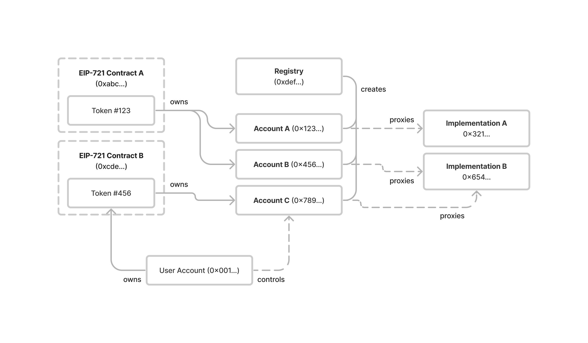

```md
---
eip: 6551
title: 非同质化代币绑定账户
description: 由非同质化代币所拥有的智能合约账户的接口和注册表
author: Jayden Windle (@jaydenwindle), Benny Giang <bg@futureprimitive.xyz>, Steve Jang, Druzy Downs (@druzydowns), Raymond Huynh (@huynhr), Alanah Lam <alanah@futureprimitive.xyz>, Wilkins Chung (@wwhchung) <wilkins@manifold.xyz>, Paul Sullivan (@sullivph) <paul.sullivan@manifold.xyz>, Auryn Macmillan (@auryn-macmillan), Jan-Felix Schwarz (@jfschwarz), Anton Bukov (@k06a), Mikhail Melnik (@ZumZoom), Josh Weintraub (@jhweintraub) <jhweintraub@gmail.com>, Rob Montgomery (@RobAnon) <rob@revest.finance>, vectorized (@vectorized), Víctor Martínez (@vnmrtz), Adrián Pajares (@0xadrii)
discussions-to: https://ethereum-magicians.org/t/non-fungible-token-bound-accounts/13030
status: Review
type: Standards Track
category: ERC
created: 2023-02-23
requires: 165, 721, 1167, 1271
---

## 摘要

本提案定义了一个将以太坊账户分配给所有非同质化代币的系统。这些代币绑定账户允许 NFT 拥有资产并与应用程序交互，而无需更改现有的智能合约或基础设施。

## 动机

[ERC-721](./eip-721.md) 标准促使非同质化代币应用激增。一些值得注意的用例包括可繁殖的猫、生成艺术品和交易流动性头寸。

然而，NFT 无法充当代理或与其他链上资产关联。这种限制使得将许多现实世界的非同质化资产表示为 NFT 变得困难。 例如：

- 一个角色扮演游戏中的角色，随着时间的推移，根据他们采取的行动积累资产和能力
- 一辆由许多同质化和非同质化组件组成的汽车
- 一个由多种同质化资产组成的投资组合
- 一张打孔通行会员卡，允许进入某个场所并记录过去的互动历史

本提案旨在赋予每个 NFT 与以太坊用户相同的权利。这包括自我托管资产、执行任意操作、控制多个独立账户以及跨多个链使用账户的能力。通过这样做，本提案允许使用与以太坊现有所有权模型相对应的通用模式，将复杂的现实世界资产表示为 NFT。

这是通过定义一个单例注册表来实现的，该注册表为所有现有和未来的 NFT 分配唯一的、确定性的智能合约账户地址。每个账户永久绑定到单个 NFT，对账户的控制权授予该 NFT 的持有者。

本提案中定义的模式不需要对现有 NFT 智能合约进行任何更改。它还与几乎所有支持以太坊账户的现有基础设施（从链上协议到链下索引器）开箱即用。代币绑定账户与每个现有的链上资产标准兼容，并且可以扩展以支持将来创建的新资产标准。

通过赋予每个 NFT 以太坊账户的全部功能，本提案为现有和未来的 NFT 启用了许多新颖的用例。

## 规范

本文档中的关键词“必须”，“禁止”，“需要”，“应该”，“不应该”，“推荐”，“不推荐”，“可以”和“可选”应按照 RFC 2119 和 RFC 8174 中的描述进行解释。

### 概述

本提案概述的系统有两个主要组成部分：

- 代币绑定账户的单例注册表
- 代币绑定账户实现的公共接口

下图说明了 NFT，NFT 持有者，代币绑定账户和注册表之间的关系：


### 注册表

注册表是一个单例合约，用作所有代币绑定账户地址查询的入口点。 它具有两个功能：

- `createAccount` - 给定一个 `implementation` 地址，为 NFT 创建代币绑定账户
- `account` - 给定一个 `implementation` 地址，计算 NFT 的代币绑定账户地址

注册表是无需许可的、不可变的且没有所有者。 注册表的完整源代码可以在 [注册表实现](#registry-implementation) 部分中找到。 注册表必须使用 Nick's Factory (`0x4e59b44847b379578588920cA78FbF26c0B4956C`) 和 salt `0x0000000000000000000000000000000000000000fd8eb4e1dca713016c518e31` 部署在地址 `0x000000006551c19487814612e58FE06813775758`。

可以使用以下交易将注册表部署到任何 EVM 兼容链：

```
{
        "to": "0x4e59b44847b379578588920ca78fbf26c0b4956c",
        "value": "0x0",
        "data": "0x0000000000000000000000000000000000000000fd8eb4e1dca713016c518e31608060405234801561001057600080fd5b5061023b806100206000396000f3fe608060405234801561001057600080fd5b50600436106100365760003560e01c8063246a00211461003b5780638a54c52f1461006a575b600080fd5b61004e6100493660046101b7565b61007d565b6040516001600160a01b03909116815260200160405180910390f35b61004e6100783660046101b7565b6100e1565b600060806024608c376e5af43d82803e903d91602b57fd5bf3606c5285605d52733d60ad80600a3d3981f3363d3d373d3d3d363d7360495260ff60005360b76055206035523060601b60015284601552605560002060601b60601c60005260206000f35b600060806024608c376e5af43d82803e903d91602b57fd5bf3606c5285605d52733d60ad80600a3d3981f3363d3d373d3d3d363d7360495260ff60005360b76055206035523060601b600152846015526055600020803b61018b578560b760556000f580610157576320188a596000526004601cfd5b80606c52508284887f79f19b3655ee38b1ce526556b7731a20c8f218fbda4a3990b6cc4172fdf887226060606ca46020606cf35b8060601b60601c60005260206000f35b80356001600160a01b03811681146101b257600080fd5b919050565b600080600080600060a086880312156101cf57600080fd5b6101d88661019b565b945060208601359350604086013592506101f46060870161019b565b94979396509194608001359291505056fea2646970667358221220ea2fe53af507453c64dd7c1db05549fa47a298dfb825d6d11e1689856135f16764736f6c63430008110033",
}
```

注册表必须将每个代币绑定账户部署为 [ERC-1167](./eip-1167.md) 最小代理，并将不可变的常量数据附加到字节码。

每个已部署的代币绑定账户的字节码必须具有以下结构：

```
ERC-1167 头部               (10 字节)
<implementation (address)>    (20 字节)
ERC-1167 尾部               (15 字节)
<salt (bytes32)>              (32 字节)
<chainId (uint256)>           (32 字节)
<tokenContract (address)>     (32 字节)
<tokenId (uint256)>           (32 字节)
```

例如，实现地址为 `0xbebebebebebebebebebebebebebebebebebebebe`，salt 为 `0`，链 ID 为 `1`，代币合约为 `0xcfcfcfcfcfcfcfcfcfcfcfcfcfcfcfcfcfcfcfcf`，代币 ID 为 `123` 的代币绑定账户将具有以下部署的字节码：

```
363d3d373d3d3d363d73bebebebebebebebebebebebebebebebebebebebe5af43d82803e903d91602b57fd5bf300000000000000000000000000000000000000000000000000000000000000000000000000000000000000000000000000000000000000000000000000000001000000000000000000000000cfcfcfcfcfcfcfcfcfcfcfcfcfcfcfcfcfcfcfcf000000000000000000000000000000000000000000000000000000000000007b
```

每个代币绑定账户代理必须将执行委托给实现 `IERC6551Account` 接口的合约。

注册表必须使用 `create2` 操作码部署所有代币绑定账户，以便每个账户地址都是确定性的。每个代币绑定账户地址应从其实现地址、代币合约地址、代币 ID、链 ID 和 salt 的唯一组合中派生。

注册表必须实现以下接口：

```solidity
interface IERC6551Registry {
    /**
     * @dev 注册表必须在成功创建账户后发出 ERC6551AccountCreated 事件。
     */
    event ERC6551AccountCreated(
        address account,
        address indexed implementation,
        bytes32 salt,
        uint256 chainId,
        address indexed tokenContract,
        uint256 indexed tokenId
    );

    /**
     * @dev 如果 create2 操作失败，注册表必须使用 AccountCreationFailed 错误还原。
     */
    error AccountCreationFailed();

    /**
     * @dev 为非同质化代币创建代币绑定账户。
     *
     * 如果账户已经创建，则返回账户地址而不调用 create2。
     *
     * 发出 ERC6551AccountCreated 事件。
     *
     * @return account 代币绑定账户的地址
     */
    function createAccount(
        address implementation,
        bytes32 salt,
        uint256 chainId,
        address tokenContract,
        uint256 tokenId
    ) external returns (address account);

    /**
     * @dev 返回非同质化代币的计算出的代币绑定账户地址。
     *
     * @return account 代币绑定账户的地址
     */
    function account(
        address implementation,
        bytes32 salt,
        uint256 chainId,
        address tokenContract,
        uint256 tokenId
    ) external view returns (address account);
}
```

### 账户接口

所有代币绑定账户都应通过单例注册表创建。

所有代币绑定账户实现都必须实现 [ERC-165](./eip-165.md) 接口检测。

所有代币绑定账户实现都必须实现 [ERC-1271](./eip-1271.md) 签名验证。

所有代币绑定账户实现必须实现以下接口：

```solidity
/// @dev 此接口的 ERC-165 标识符是 `0x6faff5f1`
interface IERC6551Account {
    /**
     * @dev 允许账户接收以太币。
     *
     * 账户必须实现 `receive` 函数。
     *
     * 账户可以执行任意逻辑来限制接收以太币的条件。
     */
    receive() external payable;

    /**
     * @dev 返回拥有该账户的非同质化代币的标识符。
     *
     * 此函数的返回值必须是常数 - 它不能随时间变化。
     *
     * @return chainId       代币所在的链的链 ID
     * @return tokenContract 代币的合约地址
     * @return tokenId       代币的 ID
     */
    function token()
        external
        view
        returns (uint256 chainId, address tokenContract, uint256 tokenId);

    /**
     * @dev 返回一个值，该值应在每次账户更改状态时修改。
     *
     * @return 当前账户状态
     */
    function state() external view returns (uint256);

    /**
     * @dev 返回一个神奇的值，指示给定的签名者是否有权代表账户行事。
     *
     * 如果给定签名者有效，则必须返回 bytes4 魔术值 0x523e3260。
     *
     * 默认情况下，账户绑定的非同质化代币的持有者必须被视为有效的签名者。
     *
     * 账户可以实现额外的授权逻辑，该逻辑会使持有者作为签名者无效或授予其他非持有者账户签名权限。
     *
     * @param  signer     signer (签名者) 要检查签名授权的地址
     * @param  context    用于确定签名者是否有效的其他数据
     * @return magicValue 指示签名者是否有效的魔术值
     */
    function isValidSigner(address signer, bytes calldata context)
        external
        view
        returns (bytes4 magicValue);
}

```

### 执行接口

所有代币绑定账户必须实现一个执行接口，允许有效的签名者代表账户执行任意操作。对执行接口的支持必须通过使用 ERC-165 接口检测由账户发出信号。

代币绑定账户可以支持以下执行接口：

```solidity
/// @dev 此接口的 ERC-165 标识符是 `0x51945447`
interface IERC6551Executable {
    /**
     * @dev 如果调用者是账户上的有效签名者，则执行低级操作。
     *
     * Reverts and bubbles up error if operation fails.
     *
     * 实现此接口的账户必须接受以下操作参数值：
     * - 0 = CALL
     * - 1 = DELEGATECALL
     * - 2 = CREATE
     * - 3 = CREATE2
     *
     * 实现此接口的账户可以支持其他操作或限制签名者执行某些操作的能力。
     *
     * @param to        操作的目标地址
     * @param value     要发送到目标的以太币值
     * @param data      编码操作的 calldata
     * @param operation 指示要执行的操作类型的value
     * @return 操作的结果
     */
    function execute(address to, uint256 value, bytes calldata data, uint8 operation)
        external
        payable
        returns (bytes memory);
}
```

## 合理依据

### 单例注册表

本提案指定了一个单一的、规范的注册表，可以无需许可地部署到任何已知地址的链上。它特意没有指定可以由多个注册表合约实现的公共接口。这种方法实现了几个关键属性。

#### 反事实账户

所有代币绑定账户都是使用 create2 操作码创建的，从而使账户能够在创建之前以反事实状态存在。这允许代币绑定账户在合约创建之前接收资产。单例账户注册表确保所有代币绑定账户地址都使用通用的寻址方案。

#### 无需信任的部署

一个单一的、无所有者的注册表确保任何代币绑定账户的唯一受信任合约是实现。这保证了代币持有者可以使用受信任的实现访问存储在反事实账户中的所有资产。

如果没有规范的注册表，则可以使用拥有的或可升级的注册表部署某些代币绑定账户。这可能导致存储在反事实账户中的资产丢失，并增加了支持本提案的应用程序必须考虑的安全模型的范围。

#### 跨链兼容性

具有已知地址的单例注册表使每个代币绑定账户都可以在多个链上存在。将 `chainId` 作为 `createAccount` 的参数可以使代币绑定账户的合约部署在任何受支持的链上的同一地址。因此，账户实现能够支持跨链账户执行，其中一条链上的 NFT 可以控制其在另一条链上的代币绑定账户。

#### 单一入口点

用于查询账户地址和 `AccountCreated` 事件的单一入口点简化了在此提案中支持的应用程序中索引代币绑定账户的复杂任务。

#### 实现多样性

单例注册表允许不同的账户实现共享一个通用的寻址方案。这使开发人员可以自由地实现账户特定的功能（例如，委派）以及替代账户模型（例如，临时账户），客户端应用程序可以轻松地支持这些功能和模型。

### 注册表 vs 工厂

选择术语“注册表”而不是“工厂”是为了突出合约的规范性质，并强调查询账户地址的行为（定期发生）而不是创建账户的行为（每个账户仅发生一次）。

### 可变执行接口

本提案不要求账户实现特定的执行接口才能兼容，只要它们通过 ERC-165 接口检测发出对至少一个执行接口的支持信号即可。允许账户开发人员选择自己的执行接口使本提案能够支持各种现有执行接口，并保持与未来可能的标准化接口的向前兼容性。

### 账户歧义

上面提出的规范允许 NFT 拥有多个代币绑定账户。在本提案的开发过程中，考虑了替代架构，这些架构将为每个 NFT 分配一个代币绑定账户，从而使每个代币绑定账户地址成为明确的标识符。

但是，这些替代方案存在一些权衡。

首先，由于智能合约的无需许可性质，因此无法强制限制每个 NFT 一个代币绑定账户。任何希望每个 NFT 使用多个代币绑定账户的人都可以通过部署额外的注册表合约来做到这一点。

其次，将每个 NFT 限制为单个代币绑定账户将需要在此提案中包含静态的、受信任的账户实现。这种实现将不可避免地对代币绑定账户的功能施加特定的约束。考虑到本提案启用的未探索用例的数量以及多样化的账户实现可能为非同质化代币生态系统带来的好处，作者认为在本提案中定义规范且受约束的实现为时过早。

最后，本提案旨在授予 NFT 充当链上代理的能力。在当前的实践中，链上代理通常利用多个账户。一个常见的例子是个人使用“热”账户进行日常使用，而使用“冷”账户来存储贵重物品。如果链上代理通常使用多个账户，那么 NFT 也应该继承相同的能力是有道理的。

### 代理实现

ERC-1167 最小代理受到现有基础设施的良好支持，并且是一种常见的智能合约模式。本提案使用自定义 ERC-1167 代理实现来部署每个代币绑定账户，该实现将 salt、链 ID、代币合约地址和代币 ID 存储为附加到合约字节码的 ABI 编码的常量数据。这允许代币绑定账户实现轻松查询此数据，同时确保其保持不变。采取这种方法是为了最大限度地提高与现有基础设施的兼容性，同时也让智能合约开发人员在创建自定义代币绑定账户实现时具有充分的灵活性。

### 链标识符

本提案使用链 ID 与其合约地址和代币 ID 一起标识每个 NFT。代币标识符在单个以太坊链上是全局唯一的，但在多个以太坊链上可能不是唯一的。

## 向后兼容性

本提案旨在与现有的非同质化代币合约实现最大程度的向后兼容。因此，它没有扩展 ERC-721 标准。

此外，本提案不要求注册表在创建账户之前执行 ERC-165 接口检查以确保 ERC-721 兼容性。这最大限度地提高了与早于 ERC-721 标准的非同质化代币合约（例如 CryptoKitties）的兼容性，或者仅实现 ERC-721 接口的一个子集（例如 ENS NameWrapper 名称）。它还允许本提案中描述的系统与半同质化或同质化代币一起使用，尽管这些用例超出了本提案的范围。

智能合约作者可以选择在其账户实现中强制执行 ERC-721 的接口检测。

## 参考实现

### 示例账户实现

```solidity
pragma solidity ^0.8.0;

import "@openzeppelin/contracts/utils/introspection/IERC165.sol";
import "@openzeppelin/contracts/token/ERC721/IERC721.sol";
import "@openzeppelin/contracts/interfaces/IERC1271.sol";
import "@openzeppelin/contracts/utils/cryptography/SignatureChecker.sol";

interface IERC6551Account {
    receive() external payable;

    function token()
        external
        view
        returns (uint256 chainId, address tokenContract, uint256 tokenId);

    function state() external view returns (uint256);

    function isValidSigner(address signer, bytes calldata context)
        external
        view
        returns (bytes4 magicValue);
}

interface IERC6551Executable {
    function execute(address to, uint256 value, bytes calldata data, uint8 operation)
        external
        payable
        returns (bytes memory);
}

contract ERC6551Account is IERC165, IERC1271, IERC6551Account, IERC6551Executable {
    uint256 immutable deploymentChainId = block.chainid;

    uint256 public state;

    receive() external payable {}

    function execute(address to, uint256 value, bytes calldata data, uint8 operation)
        external
        payable
        virtual
        returns (bytes memory result)
    {
        require(_isValidSigner(msg.sender), "Invalid signer");
        require(operation == 0, "Only call operations are supported");

        ++state;

        bool success;
        (success, result) = to.call{value: value}(data);

        if (!success) {
            assembly {
                revert(add(result, 32), mload(result))
            }
        }
    }

    function isValidSigner(address signer, bytes calldata) external view virtual returns (bytes4) {
        if (_isValidSigner(signer)) {
            return IERC6551Account.isValidSigner.selector;
        }

        return bytes4(0);
    }

    function isValidSignature(bytes32 hash, bytes memory signature)
        external
        view
        virtual
        returns (bytes4 magicValue)
    {
        bool isValid = SignatureChecker.isValidSignatureNow(owner(), hash, signature);

        if (isValid) {
            return IERC1271.isValidSignature.selector;
        }

        return bytes4(0);
    }

    function supportsInterface(bytes4 interfaceId) external pure virtual returns (bool) {
        return interfaceId == type(IERC165).interfaceId
            || interfaceId == type(IERC6551Account).interfaceId
            || interfaceId == type(IERC6551Executable).interfaceId;
    }

    function token() public view virtual returns (uint256, address, uint256) {
        bytes memory footer = new bytes(0x60);

        assembly {
            extcodecopy(address(), add(footer, 0x20), 0x4d, 0x60)
        }

        return abi.decode(footer, (uint256, address, uint256));
    }

    function owner() public view virtual returns (address) {
        (uint256 chainId, address tokenContract, uint256 tokenId) = token();
        if (chainId != deploymentChainId) return address(0);

        return IERC721(tokenContract).ownerOf(tokenId);
    }

    function _isValidSigner(address signer) internal view virtual returns (bool) {
        return signer == owner();
    }
}
```

### 注册表实现

```solidity
// SPDX-License-Identifier: MIT
pragma solidity ^0.8.4;

interface IERC6551Registry {
    /**
     * @dev 注册表必须在成功创建账户后发出 ERC6551AccountCreated 事件。
     */
    event ERC6551AccountCreated(
        address account,
        address indexed implementation,
        bytes32 salt,
        uint256 chainId,
        address indexed tokenContract,
        uint256 indexed tokenId
    );

    /**
     * @dev 如果 create2 操作失败，注册表必须使用 AccountCreationFailed 错误还原。
     */
    error AccountCreationFailed();

    /**
     * @dev 为非同质化代币创建代币绑定账户。
     *
     * 如果账户已经创建，则返回账户地址而不调用 create2。
     *
     * 发出 ERC6551AccountCreated 事件。
     *
     * @return account 代币绑定账户的地址
     */
    function createAccount(
        address implementation,
        bytes32 salt,
        uint256 chainId,
        address tokenContract,
        uint256 tokenId
    ) external returns (address account);

    /**
     * @dev 返回非同质化代币的计算出的代币绑定账户地址。
     *
     * @return account 代币绑定账户的地址
     */
    function account(
        address implementation,
        bytes32 salt,
        uint256 chainId,
        address tokenContract,
        uint256 tokenId
    ) external view returns (address account);
}

contract ERC6551Registry is IERC6551Registry {
    function createAccount(
        address implementation,
        bytes32 salt,
        uint256 chainId,
        address tokenContract,
        uint256 tokenId
    ) external returns (address) {
        assembly {
            // 内存布局：
            // ----
            // 0x00   0xff                           (1 byte)
            // 0x01   registry (address)             (20 bytes)
            // 0x15   salt (bytes32)                 (32 bytes)
            // 0x35   Bytecode Hash (bytes32)        (32 bytes)
            // ----
            // 0x55   ERC-1167 Constructor + Header  (20 bytes)
            // 0x69   implementation (address)       (20 bytes)
            // 0x5D   ERC-1167 Footer                (15 bytes)
            // 0x8C   salt (uint256)                 (32 bytes)
            // 0xAC   chainId (uint256)              (32 bytes)
            // 0xCC   tokenContract (address)        (32 bytes)
            // 0xEC   tokenId (uint256)              (32 bytes)

            // Silence unused variable warnings
            // 抑制未使用变量警告
            pop(chainId)

            // Copy bytecode + constant data to memory
            // 将字节码 + 常量数据复制到内存
            calldatacopy(0x8c, 0x24, 0x80) // salt, chainId, tokenContract, tokenId
            mstore(0x6c, 0x5af43d82803e903d91602b57fd5bf3) // ERC-1167 footer
            mstore(0x5d, implementation) // implementation
            mstore(0x49, 0x3d60ad80600a3d3981f3363d3d373d3d3d363d73) // ERC-1167 constructor + header

            // Copy create2 computation data to memory
            // 将 create2 计算数据复制到内存
            mstore(0x35, keccak256(0x55, 0xb7)) // keccak256(bytecode)
            mstore(0x15, salt) // salt
            mstore(0x01, shl(96, address())) // registry address
            mstore8(0x00, 0xff) // 0xFF

            // Compute account address
            // 计算账户地址
            let computed := keccak256(0x00, 0x55)

            // If the account has not yet been deployed
            // 如果账户尚未部署
            if iszero(extcodesize(computed)) {
                // Deploy account contract
                // 部署账户合约
                let deployed := create2(0, 0x55, 0xb7, salt)

                // Revert if the deployment fails
                // 如果部署失败则还原
                if iszero(deployed) {
                    mstore(0x00, 0x20188a59) // `AccountCreationFailed()`
                    revert(0x1c, 0x04)
                }

                // Store account address in memory before salt and chainId
                // 在 salt 和 chainId 之前将账户地址存储在内存中
                mstore(0x6c, deployed)

                // Emit the ERC6551AccountCreated event
                // 发出 ERC6551AccountCreated 事件
                log4(
                    0x6c,
                    0x60,
                    // `ERC6551AccountCreated(address,address,bytes32,uint256,address,uint256)`
                    0x79f19b3655ee38b1ce526556b7731a20c8f218fbda4a3990b6cc4172fdf88722,
                    implementation,
                    tokenContract,
                    tokenId
                )

                // Return the account address
                // 返回账户地址
                return(0x6c, 0x20)
            }

            // Otherwise, return the computed account address
            // 否则，返回计算出的账户地址
            mstore(0x00, shr(96, shl(96, computed)))
            return(0x00, 0x20)
        }
    }

    function account(
        address implementation,
        bytes32 salt,
        uint256 chainId,
        address tokenContract,
        uint256 tokenId
    ) external view returns (address) {
        assembly {
            // Silence unused variable warnings
            // 抑制未使用变量警告
            pop(chainId)
            pop(tokenContract)
            pop(tokenId)

            // Copy bytecode + constant data to memory
            // 将字节码 + 常量数据复制到内存
            calldatacopy(0x8c, 0x24, 0x80) // salt, chainId, tokenContract, tokenId
            mstore(0x6c, 0x5af43d82803e903d91602b57fd5bf3) // ERC-1167 footer
            mstore(0x5d, implementation) // implementation
            mstore(0x49, 0x3d60ad80600a3d3981f3363d3d373d3d3d363d73) // ERC-1167 constructor + header

            // Copy create2 computation data to memory
            // 将 create2 计算数据复制到内存
            mstore(0x35