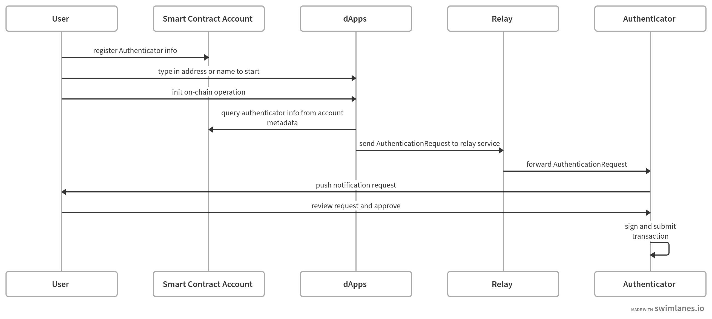

## 摘要

本 ERC 提出一个新的 **IAccountMetadata** 接口，作为 [ERC-4337](./eip-4337.md) 的扩展，用于在链上存储身份验证数据，以支持更友好的身份验证模型。

## 动机

在本提案中，我们提出了一个新的 **IAccountMetadata** 接口，作为 ERC-4337 **IAccount** 接口的扩展。通过这个新接口，用户可以通过一次性发布在链上存储身份验证数据，允许 dApp 主动从链上获取它，以支持更灵活和用户友好的身份验证模型。这将作为当前身份验证模型的一个替代方案，在当前的身份验证模型中，用户每次都需要使用钱包登录，并通过连接钱包预先将账户相关信息推送到 dApp。

## 规范

本文档中的关键词“必须”，“禁止”，“需要”，“应该”，“不应该”，“推荐”，“可以”和“可选”应按照 RFC 2119 中的描述进行解释。

### 身份验证流程



在新的身份验证工作流程中，用户使用与 AA 兼容的智能合约账户作为其钱包地址。**Authenticator** 可以是任何东西，但持有私钥来签署用户的操作。例如，它可以是一个离线身份验证器移动应用程序或一个在线云服务。**Relay** 是一种在线服务，负责将请求从 dApp 转发到 Authenticator。如果身份验证器在线，它可以扮演 Relay 服务的角色并直接监听 dApp。

### 接口

为了支持新的身份验证工作流程，本 ERC 提出了一个新的 **IAccountMetadata** 接口，作为 ERC-4337 定义的 **IAccount** 接口的扩展。

```
interface IAccountMetadata {
  struct AuthenticatorInfo {
    // a list of service URIs to relay message from dApps to authenticators
    string[] relayURI;
    // a JSON string or URI pointing to a JSON file describing the
    // schema of AuthenticationRequest. The URI should follow ERC-4804
    // if the schema file is stored on-chain
    string schema;
  }

  function getAuthenticationInfo() external view returns(AuthenticatorInfo[] memory);
}
```

中继端点应接受一个 AuthenticationRequest 对象作为输入。 AuthenticationRequest 对象的格式由 AuthenticationInfo 中的 schema 字段定义。

以下是一个支持端到端加密的 schema 示例，其中我们将所有加密的字段打包到一个 encryptedData 字段中。这里我们只列出基本字段，但每个 schema 定义可能有更多字段。可以使用诸如 "$e2ee" 之类的特殊符号来指示该字段已加密。

```json
{
    "title": "AuthenticationRequest",
    "type": "object",
    "properties": {
        "entrypoint": {
            "type": "string",
            "description": "入口点合约地址",
        },
        "chainId": {
            "type": "string",
            "description": "表示为十六进制字符串的链 id，例如 goerli 测试网络的 0x5",
        },
        "userOp": {
            "type": "object",
            "description": "由 ERC-4337 定义的没有签名的 UserOp 结构体",
        },
        "encryptedData": {
            "type": "string",
            "description": "包含所有加密字段"
        },
    }
}
```

## 原理

为了启用我们上面描述的新的身份验证工作流程，dApp 需要知道两件事：

1. **Authenticator 在哪里？** 这可以通过结构 **AuthenticationInfo** 中的 **relayURI** 字段来解决。 用户可以将 uri 发布为账户元数据，dApp 将会拉取该元数据以进行服务发现。

2. **AuthenticationRequest 的格式是什么？** 这可以通过结构 **AuthenticationInfo** 中的 **schema** 字段来解决。 该 schema 定义了 Authenticator 使用的 AuthenticationRequest 对象的结构。 它也可以用于为中继服务定义额外的字段，以实现灵活的访问控制。

### 中继服务选择

每个 Authenticator 都可以提供一个中继服务列表。 dApp 应该遍历中继服务列表，以找到第一个可用的服务。 每个 Authenticator 下的所有中继服务必须遵循相同的 schema。

### 签名聚合

如果每个智能合约账户下提供了多个 AuthenticatorInfo，则可以启用多重签名身份验证。 每个 Authenticator 可以独立地签名并将已签名的用户操作提交给 bundler。 这些签名将由 ERC-4337 中定义的 Aggregator 聚合。

### 未来扩展

**IAccountMetadata** 接口可以根据不同的需求进行扩展。 例如，可以为配置文件显示定义新的别名或头像字段。

## 向后兼容性

新接口与 ERC-4337 完全向后兼容。

## 安全考虑

### 端到端加密

为了保护用户的隐私并防止抢跑攻击，最好保持从 dApp 到 Authenticator 的数据在传输过程中加密。 这可以通过采用 JWE（JSON Web Encryption, RFC-7516）方法来完成。 在发送 AuthenticationRequest 之前，会生成一个对称 CEK(Content Encryption Key) 来加密启用了端到端加密的字段，然后使用签名者的公钥加密 CEK。 dApp 会将请求打包到 JWE 对象中，并通过中继服务将其发送到 Authenticator。 中继服务无权访问端到端加密的数据，因为只有 Authenticator 拥有解密 CEK 的密钥。

## 版权

在 [CC0](../LICENSE.md) 下放弃版权及相关权利。
