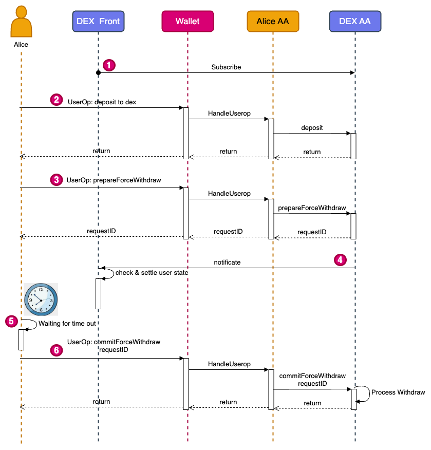

## 摘要

订单簿 DEX 标准是一组提议的接口规范，用于定义使用订单簿交易资产的去中心化交易所 (DEX) 协议。 该标准提供了一组函数，允许用户在去中心化交易所上存款、取款和交易资产。 此外，它提出了一种新颖的两阶段提款方案，以确保用户和交易所的资产安全，从而解决用户对交易所的信任问题。

## 动机

近年来，去中心化交易所（DEX）越来越受欢迎，因为它们能够让用户更好地控制自己的资产，并减少对中心化中介机构的依赖。 然而，许多现有的 DEX 协议都存在流动性低和价格发现效率低等问题。 基于 Layer2 的订单簿 DEX 已经成为一种流行的替代方案，但目前还没有用于实现此类交易所的标准化接口。

订单簿 DEX 标准旨在为开发者提供一个通用的接口，用于构建可以从网络效应中受益的可互操作的基于订单簿的 DEX。 通过建立一套用于存款、取款和强制取款的标准函数，订单簿 DEX 标准可以充分保证用户资产的安全性。 同时，两阶段强制取款机制也可以防止用户针对交易所的恶意取款。

两阶段提交协议是一种重要的分布式一致性协议，旨在确保分布式系统中的数据安全和一致性。 在 Layer2 订单簿 DEX 系统中，为了提升用户体验并确保金融安全，我们采用 1:1 储备策略，结合去中心化的清算和结算接口，以及强制提款功能，充分保障用户资金。

然而，这种设计也面临潜在的风险。 当用户进行永续合约交易时，他们可能会遭受损失。 在这种情况下，恶意用户可能会利用强制提款功能来逃避损失。 为了防止此类攻击，我们提出了一种两阶段强制提款机制。

通过引入两阶段强制提款功能，我们可以在保护用户金融安全的同时，确保交易所资产的安全。 在第一阶段，系统将对用户的提款请求进行初步审查，以确认用户的账户状态。 在第二阶段，在强制提款检查期过后，用户可以直接提交强制提款请求以完成强制提款流程。 通过这种方式，我们不仅可以防止用户利用强制提款功能来逃避损失，还可以确保交易所和用户的资产安全。

总之，通过采用两阶段提交协议和两阶段强制提款功能，我们可以有效地防范恶意行为，并确保分布式系统中的数据一致性和安全性，同时确保用户体验和金融安全。

## 规范

### 接口

订单簿 DEX 标准定义了以下接口：

#### `deposit`

`function deposit(address token, uint256 amount) external;`

**deposit** 函数允许用户将特定数量的特定 token 存入交易所。 *token* 参数指定 token 合约的地址，*amount* 参数指定要存入的 token 数量。

#### `withdraw`

`function withdraw(address token, uint256 amount) external;`

**withdraw** 函数允许用户从交易所提取特定数量的特定 token。 *token* 参数指定 token 合约的地址，*amount* 参数指定要提取的 token 数量。

#### `prepareForceWithdraw`

`function prepareForceWithdraw(address token, uint256 amount) external returns (uint256 requestID);`

用户存入的资产将存储在交易所合约的账户中，交易所可以实现实时的 1:1 储备证明。 **prepareForceWithdraw** 函数用于用户发起强制提取指定数量的特定 token。 此函数表示用户想要执行强制提款，并且可以在默认超时时间段后提交提款。 在超时时间内，交易所需要确认用户的订单状态是否满足预期标准，并强制取消用户的订单并结算交易，以避免用户恶意攻击。 此函数采用以下参数：

1. *token*：要提取的 token 的地址
2. *amount*：要提取的 token 数量

由于一个账户可以并行发起多个两阶段强制提款，因此每次强制提款都需要返回一个唯一的 *requestID*。 该函数返回一个唯一的 *requestID*，可用于使用 commitForceWithdraw 函数提交强制提款。

#### `commitForceWithdraw`

`function commitForceWithdraw(uint256 requestID) external;`

1. *requestID*：两阶段提款的请求 ID

**commitForceWithdraw** 函数用于在满足条件后执行强制提款操作。 该函数采用 *requestID* 参数，该参数指定要执行的强制提款请求的 ID。 该请求必须先前已使用 prepareForceWithdraw 函数发起。

### 事件

#### `PrepareForceWithdraw`

当用户成功调用 PrepareForceWithdraw 时必须触发。

`event PrepareForceWithdraw(address indexed user, address indexed tokenAddress, uint256 amount);`

## 理由

两阶段提款的流程图如下所示：

## 向后兼容性

未发现向后兼容性问题。

## 安全考虑

需要讨论。

## 版权

版权及相关权利通过 [CC0](../LICENSE.md) 放弃。
