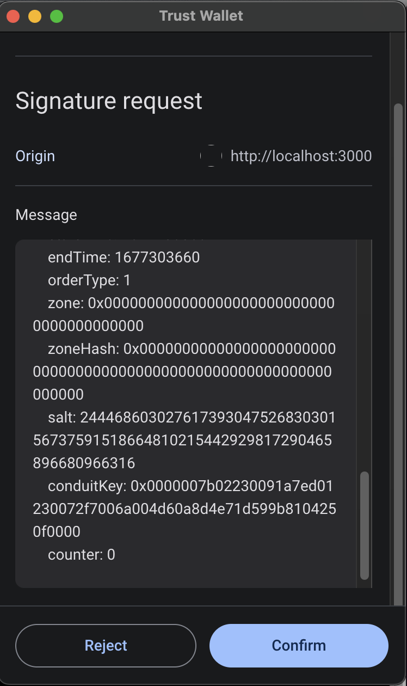
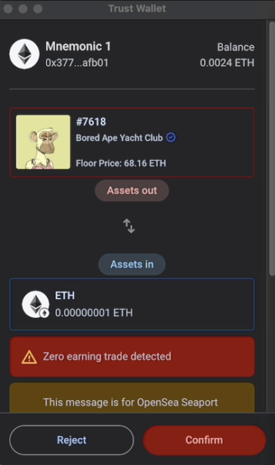

## 摘要

许多协议采用不同的 [EIP-712](./eip-712.md) 模式，导致整个生态系统中不可避免的不一致。为了解决这个问题，我们提出了一种标准化方法，供 dApp 实现一个名为 `visualizeEIP712Message` 的链上视图函数。此函数将 ABI 编码的 EIP-712 有效负载消息作为输入，并返回一个普遍认可的结构化数据格式，该格式强调对用户资产的潜在影响。然后，钱包可以以用户友好的方式显示此结构化数据，从而确保最终用户在与各种 dApp 和协议交互时获得一致的体验。

## 动机

web3.0 生态系统的快速扩张释放了大量机会和创新。然而，这种增长也增加了用户面临安全威胁（如网络钓鱼诈骗）的风险。确保用户全面了解他们签署的交易对于降低这些风险至关重要。

为了解决这个问题，我们开发了一个内部的开源离线 SDK，供钱包可视化各种协议。然而，在此过程中我们遇到了一些挑战：

- 可扩展性：识别和理解所有使用 EIP-712 的协议及其各自的业务逻辑是一项艰巨的任务，尤其是在资源有限的情况下。为所有这些协议创建离线解决方案几乎是不可能的。
- 可靠性：掌握每个协议的业务逻辑很困难，可能导致对实际实现的误解。这可能会导致不准确的可视化，其危害可能比不提供可视化更大。
- 可维护性：在一个快速发展的生态系统中，为具有离线解决方案的协议提供支持是不够的。协议经常通过扩展功能或修复错误来升级其实现，这进一步复杂化了维护过程。

为了克服这些挑战，我们提出了一种标准化的链上解决方案，可以适应多样化且不断变化的 web3.0 生态系统。这种方法将通过将可视化 EIP-712 有效负载的责任从钱包转移到协议本身，从而提高可扩展性、可靠性和可维护性。因此，钱包可以使用一致且有效的方法进行 EIP-712 消息可视化。

采用通用解决方案不仅可以简化钱包提供商的工作并减少维护负担，还可以更快、更广泛地覆盖整个生态系统。最终，这将使用户更清楚地了解他们正在签署的交易，从而提高安全性并改善加密货币领域的整体用户体验。

目前，大多数钱包显示的界面类似于下图：



通过可视化，我们可以实现类似于下图的效果，其中由于 EIP 返回的结构化数据，可以向用户显示更多有见地的详细信息



## 规范

本文档中使用的关键词“必须”、“禁止”、“必需”、“应”、“不应”、“应该”、“不应该”、“推荐”、“不推荐”、“可以”和“可选”应按照 RFC 2119 和 RFC 8174 中的描述进行解释。

实现此提案的合约必须在 `verifyingContract` 实现中包含 `visualizeEIP712Message` 函数，以便钱包在收到签署 EIP-712 消息 (`eth_signTypedData`) 的请求时，可以调用智能合约和 EIP-712 消息域分隔符 `verifyingContract` 和 `chainId` 字段中指定的链上的 `visualizeEIP712Message` 函数。

如果域分隔符不包含 `verifyingContract` 和 `chainId` 字段，钱包应忽略此提案。

```solidity
/**
* @notice 此函数处理 EIP-712 有效负载消息，并返回一个结构化数据格式，该格式强调对用户资产的潜在影响。
* @dev 该函数返回 assetsOut（用户提供的资产）、assetsIn（用户将收到的资产）和 liveness（EIP-712 消息的有效期限）。
* @param encodedMessage ABI 编码的 EIP-712 消息 (abi.encode(types, params))。
* @param domainHash EIP-712 提案中定义的 EIP-712 域分隔符的哈希值；参见 https://eips.ethereum.org/EIPS/eip-712#definition-of-domainseparator。
* @return Result struct，包含用户的资产影响和消息有效期。
*/
function visualizeEIP712Message(
    bytes memory encodedMessage,
    bytes32 domainHash
) external view returns (Result memory);
```

### 参数

`encodedMessage` 是表示使用 `abi.encode` 编码的 EIP-712 消息的字节，可以使用 `abi.decode` 进行解码。

`domainHash` 是 EIP-712 提案中定义的 EIP-712 域分隔符的 bytes32 哈希值。

### 输出

该函数必须返回 `Result`，这是一个包含有关用户资产影响以及此类消息在签名后的有效性的信息的结构。

```solidity
struct Liveness {
  uint256 from;
  uint256 to;
}

struct UserAssetMovement {
  address assetTokenAddress;
  uint256 id;
  uint256[] amounts;
}

struct Result {
  UserAssetMovement[] assetsIn;
  UserAssetMovement[] assetsOut;
  Liveness liveness;
}
```

#### `Liveness`

`Liveness` 是一个结构，用于定义消息有效的时间戳，其中：

- `from` 是起始时间戳。
- `to` 是过期时间戳。
- `from` 必须小于 `to`。

#### `UserAssetMovement`

`UserAssetMovement` 定义了用户的资产，其中：

- `assetTokenAddress` 是代币 ([ERC-20](./eip-20.md)、[ERC-721](./eip-721.md)、[ERC-1155](./eip-1155.md)) 智能合约地址，其中零地址必须代表原生代币（以太坊网络中的原生 ETH）。
- `id` 是 NFT ID，如果资产不是 NFT，则必须忽略此项。
    - 如果具有 `id` 的代币在 NFT 集合中不存在，则应将其视为该集合中的任何代币。
- `amounts` 是 `uint256` 的数组，其中各项必须定义每个时间曲线的数量，时间在有效期范围内定义。
    - `amounts` 数组中的第一个数量 (amounts[0]) 必须是 `liveness.from` 时间戳时资产的数量。
    - `amounts` 数组中的最后一个数量 (amounts[amounts.length-1]) 必须是 `liveness.to` 时间戳时资产的数量。
    - 在大多数情况下，`amounts` 将是一个包含单个项的数组，该项必须是资产的最小数量。

#### `assetsIn`

`assetsIn` 是如果消息被签名并满足，用户必须获得的最小资产。

#### `assetsOut`

`assetsOut` 是如果消息被签名并满足，用户必须提供的最大资产。

## 理由

### 链上

有人可能会争辩说，某些流程可以在链下完成，这是事实，但我们构建链下 TypeScript SDK 来解决此问题的经验揭示了一些问题：

- 可靠性：协议开发人员负责开发协议本身，因此由他们来制作可视化效果会更加准确。
- 可扩展性：跟上快速扩展的生态系统非常困难。钱包或第三方实体必须密切关注每个新协议，仔细理解它（这会带来上述可靠性问题），然后才能提出链下实现。
- 可维护性：许多协议以可升级的方式实现智能合约。这会导致链下可视化与真实协议行为（如果已更新）不同，从而使解决方案本身不可靠并且缺乏处理各种协议的可扩展性。

### `DomainHash`

协议非常需要 `domainHash`，以防止不支持其 EIP-712 实现的版本。如果协议实现了各种 EIP-712 实现 (`name`)，或者如果 `domainHash` 属于不同的协议，则它可以识别所需的实现。

将来，如果有一个注册表可以为已经部署的无法升级现有已部署智能合约的协议重新路由此 EIP 实现，则可以使用 `domainHash` 来识别协议。

### 数量数组

我们建议使用数量数组 (uint256[]) 而不是单个 uint256 来覆盖拍卖，这在 NFT 协议中很常见。

## 向后兼容性

未发现向后兼容性问题。

## 参考实现

openSea Seaport NFT 市场实现示例可在此处获得 [here](../assets/eip-6865/contracts/SeaPortEIP712Visualizer.sol)

## 安全考虑事项

`visualizeEIP712Message` 函数应可靠且准确地表示 EIP-712 消息对用户资产的潜在影响。钱包提供商和用户必须信任该协议对此函数的实现，以提供准确和最新的信息。

`visualizeEIP712Message` 函数的结果应根据其 `verifyingContract` 的声誉进行处理，如果 `verifyingContract` 受到信任，则意味着 `visualizeEIP712Message` 函数的结果也受到信任，因为此提案的实现与 `verifyingContract` 的地址相同。

## 版权

版权及相关权利通过 [CC0](../LICENSE.md) 放弃。