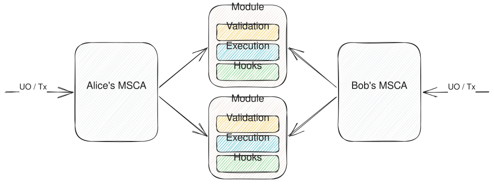
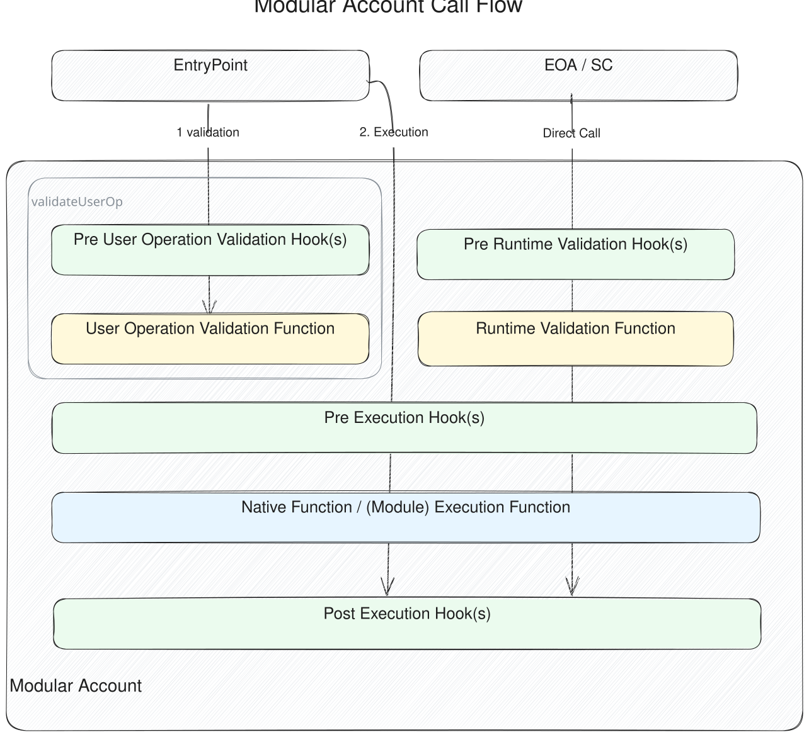

## 摘要

本提案标准化了智能合约账户和账户模块，它们是允许在智能合约账户中进行可组合逻辑的智能合约。本提案符合 [ERC-4337](./eip-4337.md)。本标准强调模块的安全权限控制，以及所有符合规范的账户和模块之间的最大互操作性。

这种模块化方法将账户功能分为三个类别，在外部合约中实现它们，并定义了来自账户的预期执行流程。

## 动机

ERC-4337 实现的目标之一是将执行和验证的逻辑抽象到每个智能合约账户。

可以通过自定义进入验证和执行步骤的逻辑来构建账户的许多新功能。此类功能的示例包括会话密钥、订阅、消费限额和基于角色的访问控制。目前，其中一些功能由特定的智能合约账户本地实现，而另一些功能可以通过专有的模块系统（如 Safe 模块）来实现。

然而，管理多个账户实现会提供较差的用户体验，将账户分散在支持的功能和安全配置中。此外，它还要求模块开发人员选择支持哪些平台，从而导致平台锁定或重复的开发工作。

我们提出了一个协调模块开发人员和账户开发人员之间实现工作的标准。该标准定义了一个模块化智能合约账户，能够支持所有符合标准定义的模块。这允许用户拥有更大的数据可移植性，并使模块开发人员不必选择要支持的特定账户实现。



这些模块可以包含执行逻辑、验证函数和钩子。验证函数定义了智能合约账户将批准代表其采取的操作的情况，而钩子允许执行前和执行后的控制。

采用此标准的账户将支持模块化、可升级的执行和验证逻辑。将此定义为智能合约账户的标准将使模块更易于安全地开发，并将允许更大的互操作性。

## 规范

本文档中的关键词“必须”、“不得”、“必需”、“应”、“不应”、“建议”、“不建议”、“可以”和“可选”应按照 RFC 2119 和 RFC 8174 中的描述进行解释。

### 术语

- **账户**（或 **智能合约账户，SCA**）是一个智能合约，可用于发送交易和持有数字资产。它实现了来自 ERC-4337 的 `IAccount` 接口。
- **模块化账户**（或 **模块化智能合约账户，MSCA**）是支持模块化功能的账户。模块化功能有三种类型：
  - **验证函数**验证代表账户的授权。
  - **执行函数**执行账户允许的自定义逻辑。
  - **钩子**在执行函数或验证函数之前和/或之后执行自定义逻辑和检查。钩子有两种类型：
    - **验证钩子**在验证函数之前运行。这些可以对验证函数授权的操作强制执行权限。
    - **执行钩子**可以在执行函数之前和/或之后运行。执行钩子可以附加到特定的执行函数或验证函数。执行前钩子可以选择性地返回要由执行后钩子消耗的数据。
- **原生函数**是指由模块化账户实现的函数，而不是由模块添加的函数。
- **模块**是一个已部署的智能合约，它托管上述三种模块化函数中的任何一种。
- 模块的 **清单** 描述了应安装在账户上的执行函数、接口 ID 和钩子。

### 概述

模块化账户处理两种调用：来自通过 ERC-4337 的 `EntryPoint` 的调用，或来自外部拥有的账户 (EOA) 和其他智能合约的直接调用。此标准支持这两种用例。

对模块化账户的调用可以分解为下图所示的步骤。验证步骤验证是否允许调用者执行调用。执行前钩子步骤可用于执行任何执行前检查或更新。它也可以与执行后钩子步骤一起使用，以执行其他操作或验证。执行步骤执行定义的任务或任务集合。



每个步骤都是模块化的，支持不同的实现，从而允许开放式的可编程账户。

### 接口

模块化账户必须实现：

- 来自 [ERC-4337](./eip-4337.md) 的 `IAccount.sol` 和 `IAccountExecute.sol`。
- `IERC6900Account.sol` 以支持模块管理和使用以及账户标识。
- 来自 [ERC-1271](./eip-1271.md) 的函数 `isValidSignature`

模块化账户可以实现：

- `IERC6900AccountView.sol` 以支持链上账户状态的可见性。
- [ERC-165](./eip-165.md) 用于从模块安装的接口。

模块必须实现：

- 下面描述的 `IERC6900Module.sol` 并实现 `IERC6900Module` 的 ERC-165。

模块可以实现以下任何模块类型：

- `IERC6900ValidationModule` 以支持账户的验证函数。
- `IERC6900ValidationHookModule` 以支持验证函数的钩子。
- `IERC6900ExecutionModule` 以支持执行函数及其在账户上的安装。
- `IERC6900ExecutionHookModule` 以支持执行函数的前后执行钩子。

#### `IERC6900Account.sol`

模块执行和管理接口。模块化账户必须实现此接口以支持安装和卸载模块以及开放式执行。

```solidity
/// @dev 模块函数的打包表示。
/// 包含以下内容，左对齐：
/// 模块地址：20字节
/// 实体ID：4字节
type ModuleEntity is bytes24;

/// @dev 验证函数及其关联标志的打包表示。
/// 包含以下内容，左对齐：
/// 模块地址：20字节
/// 实体ID：4字节
/// ValidationFlags：1字节
type ValidationConfig is bytes25;

// ValidationFlags 布局：
// 0b00000___ // 未使用
// 0b_____A__ // isGlobal
// 0b______B_ // isSignatureValidation
// 0b_______C // isUserOpValidation
type ValidationFlags is uint8;

/// @dev 钩子函数及其关联标志的打包表示。
/// 包含以下内容，左对齐：
/// 模块地址：20字节
/// 实体ID：4字节
/// 标志：1字节
///
/// 钩子标志布局：
/// 0b00000___ // 未使用
/// 0b_____A__ // hasPre（仅执行）
/// 0b______B_ // hasPost（仅执行）
/// 0b_______C // 钩子类型（执行为0，验证为1）
type HookConfig is bytes25;

struct Call {
    // 账户调用的目标地址。
    address target;
    // 随调用发送的值。
    uint256 value;
    // 调用的calldata。
    bytes data;
}

interface IERC6900Account {
    event ExecutionInstalled(address indexed module, ExecutionManifest manifest);
    event ExecutionUninstalled(address indexed module, bool onUninstallSucceeded, ExecutionManifest manifest);
    event ValidationInstalled(address indexed module, uint32 indexed entityId);
    event ValidationUninstalled(address indexed module, uint32 indexed entityId, bool onUninstallSucceeded);

    /// @notice 标准执行方法。
    /// @param target 账户调用的目标地址。
    /// @param value 随调用发送的值。
    /// @param data 调用的calldata。
    /// @return 来自调用的返回数据。
    function execute(address target, uint256 value, bytes calldata data) external payable returns (bytes memory);

    /// @notice 标准 executeBatch 方法。
    /// @dev 如果目标是一个模块，调用应该revert。如果任何调用revert，则整个批处理必须revert。
    /// @param calls 调用的数组。
    /// @return 包含来自调用的返回数据的数组。
    function executeBatch(Call[] calldata calls) external payable returns (bytes[] memory);

    /// @notice 使用指定的运行时验证执行调用。
    /// @param data 要发送到账户的calldata。
    /// @param authorization 用于调用的授权数据。前24个字节是一个 ModuleEntity，它指定要使用的运行时验证，其余部分作为参数发送到运行时验证。
    function executeWithRuntimeValidation(bytes calldata data, bytes calldata authorization)
        external
        payable
        returns (bytes memory);

    /// @notice 将模块安装到模块化账户。
    /// @param module 要安装的模块。
    /// @param manifest 描述要安装的函数的清单。
    /// @param installData 账户用于处理初始执行设置的可选数据。数据编码是特定于实现的。
    function installExecution(
        address module,
        ExecutionManifest calldata manifest,
        bytes calldata installData
    ) external;

    /// @notice 从模块化账户卸载模块。
    /// @param module 要卸载的模块。
    /// @param manifest 描述要卸载的函数的清单。
    /// @param uninstallData 账户用于处理执行卸载的可选数据。数据编码是特定于实现的。
    function uninstallExecution(
        address module,
        ExecutionManifest calldata manifest,
        bytes calldata uninstallData
    ) external;

    /// @notice 在一组执行选择器上安装验证函数，并可选择将其标记为全局验证函数。
    /// @param validationConfig 要安装的验证函数，以及配置标志。
    /// @param selectors 要安装验证函数的选择器。
    /// @param installData 账户用于处理初始验证设置的可选数据。数据编码是特定于实现的。
    /// @param hooks 要安装并与验证函数关联的可选钩子。数据编码是特定于实现的。
    function installValidation(
        ValidationConfig validationConfig,
        bytes4[] calldata selectors,
        bytes calldata installData,
        bytes[] calldata hooks
    ) external;

    /// @notice 从一组执行选择器卸载验证函数。
    /// @param validationFunction 要卸载的验证函数。
    /// @param uninstallData 账户用于处理验证卸载的可选数据。数据编码是特定于实现的。
    /// @param hookUninstallData 账户用于处理钩子卸载的可选数据。数据编码是特定于实现的。
    function uninstallValidation(
        ModuleEntity validationFunction,
        bytes calldata uninstallData,
        bytes[] calldata hookUninstallData
    ) external;

    /// @notice 返回账户实现的唯一标识符。
    /// @dev 此函数必须以“vendor.account.semver”格式返回一个字符串。供应商和账户名称不得包含句点字符。
    /// @return 账户 ID。
    function accountId() external view returns (string memory);
}
```

#### `IERC6900AccountView.sol`

模块检查接口。模块化账户可以实现此接口以支持模块配置的可见性。

```solidity
/// @dev 表示与特定函数选择器关联的数据。
struct ExecutionDataView {
    // 实现此执行函数的模块。
    // 如果这是一个原生函数，则地址必须是账户的地址。
    address module;
    // 该函数是否需要运行时验证，或者是否可以由任何人调用。如果此标志设置为 true，该函数仍然可以更改状态。
    // 请注意，即使将其设置为 true，仍然需要用户操作验证，否则任何人都可以通过浪费 gas 来耗尽账户的原生代币。
    bool skipRuntimeValidation;
    // 是否可以使用全局验证函数来验证此函数。
    bool allowGlobalValidation;
    // 此函数选择器的执行钩子。
    HookConfig[] executionHooks;
}

struct ValidationDataView {
    // ValidationFlags 布局：
    // 0b00000___ // 未使用
    // 0b_____A__ // isGlobal
    // 0b______B_ // isSignatureValidation
    // 0b_______C // isUserOpValidation
    ValidationFlags validationFlags;
    // 此验证函数的验证钩子。
    HookConfig[] validationHooks;
    // 要使用此验证函数运行的执行钩子。
    HookConfig[] executionHooks;
    // 可能由此验证函数验证的选择器集。
    bytes4[] selectors;
}

interface IERC6900AccountView {
    /// @notice 获取选择器的执行数据。
    /// @dev 如果选择器是一个原生函数，则模块地址将是账户的地址。
    /// @param selector 要获取数据的选择器。
    /// @return 此选择器的执行数据。
    function getExecutionData(bytes4 selector) external view returns (ExecutionDataView memory);

    /// @notice 获取验证函数的验证数据。
    /// @dev 如果选择器是一个原生函数，则模块地址将是账户的地址。
    /// @param validationFunction 要获取数据的验证函数。
    /// @return 此验证函数的验证数据。
    function getValidationData(ModuleEntity validationFunction)
        external
        view
        returns (ValidationDataView memory);
}
```

#### `IERC6900Module.sol`

模块接口。模块必须实现此接口以支持模块管理以及与 [ERC-6900](./eip-6900.md) 模块化账户的交互。

```solidity
interface IERC6900Module is IERC165 {
    /// @notice 初始化模块化账户的模块数据。
    /// @dev 由模块化账户在 `installExecution` 期间调用。
    /// @param data 可选的字节数组，由模块解码和使用，以设置模块化账户的初始模块数据。
    function onInstall(bytes calldata data) external;

    /// @notice 清除模块化账户的模块数据。
    /// @dev 由模块化账户在 `uninstallExecution` 期间调用。
    /// @param data 可选的字节数组，由模块解码和使用，以清除模块化账户的模块数据。
    function onUninstall(bytes calldata data) external;

    /// @notice 返回模块的唯一标识符。
    /// @dev 此函数必须以“vendor.module.semver”格式返回一个字符串。供应商和模块名称不得包含句点字符。
    /// @return 模块 ID。
    function moduleId() external view returns (string memory);
}
```

#### `IERC6900ValidationModule.sol`

验证模块接口。模块可以实现此接口以提供账户的验证函数。

```solidity
interface IERC6900ValidationModule is IERC6900Module {
    /// @notice 运行由 `entityId` 指定的用户操作验证函数。
    /// @param entityId 一个标识符，用于将调用路由到不同的内部实现，如果有多个内部实现。
    /// @param userOp 用户操作。
    /// @param userOpHash 用户操作哈希。
    /// @return 用于 validAfter（6个字节）、validUntil（6个字节）和 authorizer（20个字节）的打包验证数据。
    function validateUserOp(uint32 entityId, PackedUserOperation calldata userOp, bytes32 userOpHash)
        external
        returns (uint256);

    /// @notice 运行由 `entityId` 指定的运行时验证函数。
    /// @dev 为了指示整个调用应该 revert，该函数必须 revert。
    /// @param account 要验证的账户。
    /// @param entityId 一个标识符，用于将调用路由到不同的内部实现，如果有多个内部实现。
    /// @param sender 调用者地址。
    /// @param value 调用值。
    /// @param data 发送的calldata。
    /// @param authorization 供验证函数使用的其他数据。
    function validateRuntime(
        address account,
        uint32 entityId,
        address sender,
        uint256 value,
        bytes calldata data,
        bytes calldata authorization
    ) external;

    /// @notice 使用 ERC-1271 验证签名。
    /// @dev 为了指示整个调用应该 revert，该函数必须 revert。
    /// @param account 要验证的账户。
    /// @param entityId 一个标识符，用于将调用路由到不同的内部实现，如果有多个内部实现。
    /// @param sender 将 ERC-1271 请求发送到智能账户的地址。
    /// @param hash ERC-1271 请求的哈希。
    /// @param signature ERC-1271 请求的签名。
    /// @return 如果签名有效，则返回 ERC-1271 `MAGIC_VALUE`，如果无效，则返回 0xFFFFFFFF。
    function validateSignature(
        address account,
        uint32 entityId,
        address sender,
        bytes32 hash,
        bytes calldata signature
    ) external view returns (bytes4);
}
```

#### `IERC6900ValidationHookModule.sol`

验证钩子模块接口。模块可以实现此接口以提供账户验证函数的钩子。

```solidity
interface IERC6900ValidationHookModule is IERC6900Module {
    /// @notice 运行由 `entityId` 指定的预用户操作验证钩子。
    /// @dev 预用户操作验证钩子不得返回 0 或 1 以外的 authorizer 值。
    /// @param entityId 一个标识符，用于将调用路由到不同的内部实现，如果有多个内部实现。
    /// @param userOp 用户操作。
    /// @param userOpHash 用户操作哈希。
    /// @return 用于 validAfter（6个字节）、validUntil（6个字节）和 authorizer（20个字节）的打包验证数据。
    function preUserOpValidationHook(uint32 entityId, PackedUserOperation calldata userOp, bytes32 userOpHash)
        external
        returns (uint256);

    /// @notice 运行由 `entityId` 指定的预运行时验证钩子。
    /// @dev 为了指示整个调用应该 revert，该函数必须 revert。
    /// @param entityId 一个标识符，用于将调用路由到不同的内部实现，如果有多个内部实现。
    /// @param sender 调用者地址。
    /// @param value 调用值。
    /// @param data 发送的calldata。
    /// @param authorization 供钩子使用的其他数据。
    function preRuntimeValidationHook(
        uint32 entityId,
        address sender,
        uint256 value,
        bytes calldata data,
        bytes calldata authorization
    ) external;

    /// @notice 运行由 `entityId` 指定的预签名验证钩子。
    /// @dev 为了指示调用应该revert，该函数必须 revert。
    /// @param entityId 一个标识符，用于将调用路由到不同的内部实现，如果有多个内部实现。
    /// @param sender 调用者地址。
    /// @param hash 要签名的消息的哈希值。
    /// @param signature 消息的签名。
    function preSignatureValidationHook(uint32 entityId, address sender, bytes32 hash, bytes calldata signature)
        external
        view;
}
```

#### `IERC6900ExecutionModule.sol`

执行模块接口。模块可以实现此接口以提供账户的执行函数。

```solidity
struct ManifestExecutionFunction {
    // 要安装的选择器。
    bytes4 executionSelector;
    // 如果为 true，则该函数不需要运行时验证，并且可以由任何人调用。
    bool skipRuntimeValidation;
    // 如果为 true，则该函数可以由全局验证函数验证。
    bool allowGlobalValidation;
}

struct ManifestExecutionHook {
    bytes4 executionSelector;
    uint32 entityId;
    bool isPreHook;
    bool isPostHook;
}

/// @dev 一个描述模块应如何在模块化账户上安装的结构。
struct ExecutionManifest {
    // 此模块中定义的要在 MSCA 上安装的执行函数。
    ManifestExecutionFunction[] executionFunctions;
    ManifestExecutionHook[] executionHooks;
    // 要添加到账户以支持自省检查的 ERC-165 接口 ID 列表。这不得包括 IERC6900Module 的接口 ID。
    bytes4[] interfaceIds;
}

interface IERC6900ExecutionModule is IERC6900Module {
    /// @notice 描述模块的内容和预期配置。
    /// @dev 此清单必须始终保持不变。
    /// @return 一个描述模块的内容和预期配置的清单。
    function executionManifest() external pure returns (ExecutionManifest memory);
}
```

#### `IERC6900ExecutionHookModule.sol`

执行钩子模块接口。模块可以实现此接口以提供账户执行函数的钩子。

```solidity
interface IERC6900ExecutionHookModule is IERC6900Module {
    /// @notice 运行由 `entityId` 指定的预执行钩子。
    /// @dev 为了指示整个调用应该 revert，该函数必须 revert。
    /// @param entityId 一个标识符，用于将调用路由到不同的内部实现，如果有多个内部实现。
    /// @param sender 调用者地址。
    /// @param value 调用值。
    /// @param data 发送的calldata。对于与验证关联的钩子的 `executeUserOp` 调用，钩子模块应接收完整的calldata。
    /// @return 要传递给执行后钩子的上下文（如果存在）。可能会返回一个空的字节数组。
    function preExecutionHook(uint32 entityId, address sender, uint256 value, bytes calldata data)
        external
        returns (bytes memory);

    /// @notice 运行由 `entityId` 指定的执行后钩子。
    /// @dev 为了指示整个调用应该 revert，该函数必须 revert。
    /// @param entityId 一个标识符，用于将调用路由到不同的内部实现，如果有多个内部实现。
    /// @param preExecHookData 与其关联的预执行钩子返回的上下文。
    function postExecutionHook(uint32 entityId, bytes calldata preExecHookData) external;
}
```

### 验证函数

#### 安装

- 账户必须安装用户指定的所有验证钩子，并且如果用户指定，则应使用用户提供的数据在钩子模块上调用 `onInstall` 以初始化状态。
- 账户必须安装用户指定的所有执行钩子，并且如果用户指定，则应使用用户提供的数据在钩子模块上调用 `onInstall` 以初始化状态。
- 账户必须配置验证函数以验证用户指定的所有选择器。
- 账户必须按指定设置所有标志，如 `isGlobal`、`isSignatureValidation` 和 `isUserOpValidation`。
- 如果用户指定，则账户应在验证模块上调用 `onInstall` 以初始化状态。
- 账户必须发出为所有已安装的验证函数定义的接口中的 `ValidationInstalled`。

#### 卸载

在验证卸载期间，账户必须根据用户提供的传入数据正确清除标志和其他字段。

- 账户必须清除验证函数的所有标志，如 `isGlobal`、`isSignatureValidation` 和 `isUserOpValidation`。
- 账户必须删除所有钩子，并且如果用户指定，则应通过使用用户提供的数据调用每个钩子的 `onUninstall` 来清除钩子模块状态，包括验证钩子和执行钩子。
  - 账户可以根据账户的设计原则使用 try/catch 忽略来自 `onUninstall` 的revert。
- 账户必须清除验证函数可以验证的选择器的配置。
- 如果用户指定，则账户应在验证模块上调用 `onUninstall` 以清理状态。
- 账户必须发出为所有已卸载的验证函数定义的接口中的 `ValidationUninstalled`。

### 执行函数

#### 安装

- 账户必须安装所有执行函数，并按照清单中的指定设置标志和字段。
    - 执行函数选择器在账户中必须是唯一的。
    - 执行函数选择器不得与原生 ERC-4337 和 ERC-6900 函数冲突。
- 账户必须添加清单中指定的所有执行钩子。
- 账户应添加清单中指定的所有受支持的接口。
- 如果用户指定，则账户应在执行模块上调用 `onInstall` 以初始化状态。
- 账户必须发出为所有已安装的执行定义的接口中的 `ExecutionInstalled`。

#### 卸载

在执行卸载期间，账户必须根据用户提供的传入数据和模块清单正确清除标志和其他字段。

- 账户必须删除所有执行函数，并清除清单中指定的标志和字段。
- 账户必须删除清单中指定的所有执行钩子。
- 账户应删除清单中指定的所有受支持的接口。
- 如果用户指定，则账户应在执行模块上调用 `onUninstall` 以清理状态并跟踪调用成功。
- 账户必须发出为所有已卸载的执行定义的接口中的 `ExecutionUninstalled`。

### 钩子

#### 执行钩子数据格式

对于实现执行钩子的账户，账户必须符合以下执行钩子格式：

1. 对于 `executeUserOp` 调用，对于与验证函数关联的执行钩子，账户必须发送完整的calldata（solidity 中的 `msg.data`），包括 `executeUserOp` 选择器。
2. 对于 `executeUserOp` 调用，对于与选择器关联的执行钩子，账户必须发送 `PackedUserOperation.callData` 以进行 `executeUserOp` 调用，不包括 `executeUserOp.selector` 和 `PackedUserOperation` 的其余部分。
3. 对于 `executeWithRuntimeValidation` 调用，对于所有执行钩子，账户必须发送内部 `data` 字段。
4. 对于所有其他调用，对于与选择器关联的执行钩子，账户必须发送完整的calldata（solidity 中的 `msg.data`）。

#### 钩子执行顺序

建议账户实现程序以先安装先执行的顺序运行钩子。但是，账户可以实现不同的执行顺序。

### 验证调用流程

模块化账户支持三种不同的验证调用流程：用户操作验证、运行时验证和签名验证。用户操作验证发生在账户的 `validateUserOp` 函数实现中，该函数在 ERC-4337 接口 `IAccount` 中定义。运行时验证通过调度函数 `executeWithRuntimeValidation` 发生，或者在使用 [直接调用验证](#direct-call-validation) 时发生。签名验证发生在账户的 `isValidSignature` 函数实现中，该函数在 ERC-1271 中定义。

对于这些验证类型中的每一种，账户实现都可以指定自己的格式，用于选择要使用的验证函数，以及验证钩子的任何每个钩子数据。

在每种类型的验证函数的实现中，模块化账户必须检查提供的验证函数是否适用于要运行的给定函数选择器（请参阅 [检查验证适用性](#checking-validation-applicability)）。然后，账户必须执行与正在使用的验证函数关联的相应类型的所有验证钩子。在执行验证钩子之后，账户必须调用相应类型的验证函数。如果任何验证钩子或验证函数 revert，则账户必须 revert。它应该在其revert数据中包含模块的revert数据。

账户必须定义一种方法来单独传递每个验证钩子和验证函数自身的数据。此数据应作为用户操作验证的 `userOp.signature` 字段、运行时验证的 `authorization` 字段和签名验证的 `signature` 字段发送。

用户操作验证的结果必须是由验证钩子和验证函数返回的时间边界的交集。如果任何验证钩子或验证函数为 authorizer 字段返回 `1` 值，指示 ERC-4337 标准的签名验证失败，则账户必须为验证数据的 authorizer 部分返回值 `1`。

运行的验证钩子集必须是在验证开始时由账户状态指定的钩子。换句话说，如果在验证期间适用钩子的集合发生变化，则必须仍然运行原始钩子集合，并且只有在以后调用同一验证时才应反映已更改的钩子集合。

#### 检查验证适用性

为了强制执行模块权限隔离，模块化账户必须检查验证函数的适用性，作为每个验证函数实现的一部分。

用户操作验证和运行时验证函数的可配置适用范围是账户上的函数。这可以使用安装到验证的选择器进行配置。或者，验证安装可以指定 `isGlobal` 标志为 true，这意味着账户必须认为它适用于任何具有 `allowGlobalValidation` 标志设置为 true 的模块执行函数，或者适用于账户可以允许全局验证的任何账户原生函数。

如果要检查的选择器是 `execute` 或 `executeBatch`，则模块化账户必须执行其他检查。如果 `execute` 的目标是模块化账户自己的地址，或者如果 `executeBatch` 中任何 `Call` 的目标是账户，则验证必须revert或检查验证是否适用于正在调用的选择器。

已安装的验证函数有两个附加的标志变量，指示它们可以用于什么。如果尝试将验证函数用于用户操作验证，并且标志 `isUserOpValidation` 设置为 false，则验证必须revert。如果尝试将验证函数用于签名验证，并且标志 `isSignatureValidation` 设置为 false，则验证必须revert。

#### 直接调用验证

如果验证函数以 `0xffffffff` 的实体 ID 安装，则可以用作直接调用验证。当模块或其他地址调用模块化账户上的函数时，会发生这种情况，而不会将其调用包装在调度函数 `executeWithRuntimeValidation` 中以用作运行时验证函数的选择机制。

为了实现直接调用验证，模块化账户必须将不是来自模块化账户自身或 `EntryPoint` 的直接函数调用视为尝试使用调用者的地址和 `0xffffffff` 的实体 ID 进行验证。如果安装了这样的验证函数，并且适用于要调用的函数，则模块化账户必须允许它继续，而不执行运行时验证。安装到此验证函数的任何验证钩子和执行钩子必须仍然运行。

### 执行调用流程

对于 `IERC6900Account` 中的所有非视图函数（`executeWithRuntimeValidation` 除外）、所有模块定义的执行函数以及模块化账户可能希望包含的任何其他原生函数，模块化账户必须在执行期间遵守以下步骤：

如果调用者不是 `EntryPoint` 或账户，则账户必须检查直接调用验证的访问控制。

在运行目标函数之前，模块化账户必须运行适用于当前函数调用的所有pre execution hooks。如果pre execution hooks已安装到当前正在运行的函数选择器，或者如果它们已安装为用于当前执行的验证函数的executon hook，则适用。 Pre execution hooks必须首先运行与验证相关的钩子，然后是与选择器相关的钩子。

接下来，模块化账户必须运行目标函数，无论是账户原生函数还是模块定义的执行函数。

在执行目标函数之后，模块化账户必须运行任何pre execution hooks。这些必须以pre execution hooks的相反顺序运行。如果将钩子定义为pre execution hooks和post execution hooks，并且pre execution hooks向账户返回了非空的 `bytes` 值，则账户必须将该数据传递给post execution hooks。

给定目标函数运行的钩子集必须是由在执行阶段开始时由账户状态指定的钩子。换句话说，如果在执行期间适用钩子的集合发生变化，则必须仍然运行原始钩子集合，并且只有后续调用同一目标函数才应反映已更改的钩子集合。

`skipRuntimeValidation` 字段设置为 true 的模块执行函数以及没有访问控制的原生函数应省略运行时验证步骤，包括任何运行时验证钩子。没有访问控制的原生函数也可以省略运行执行钩子。

### 扩展

#### 半模块化账户

账户实现者可以选择设计半模块化账户，其中某些功能（例如默认验证）集成到核心账户中。这种方法应确保与本提案中定义的完全模块化账户兼容，以维持不同实现之间的互操作性。

## 原理

与 ERC-4337 兼容的账户必须实现 `IAccount` 接口，该接口仅由一个将验证与执行捆绑在一起的方法组成：`validateUserOp`。此提案的主要设计原理是通过解绑这些函数和其他函数来扩展智能合约账户的可能函数，同时保留账户抽象的优势。

此提案包括几个建立在 ERC-4337 基础上的接口。首先，我们标准化了一组模块化函数，这些函数使智能合约开发人员可以在捆绑验证、执行和钩子逻辑方面具有更大的灵活性。我们还提出了接口，这些接口提供了用于查询模块化账户上的执行函数、验证函数和钩子的方法。其余接口描述了模块的方法，用于公开其模块化函数和所需的配置，以及模块化账户的方法，用于安装和删除模块并允许跨模块和外部地址执行。

### ERC-4337 依赖性

ERC-6900 的主要目标是通过模块化账户和模块创建一个安全且可互操作的基础，以提高智能账户生态系统以及最终钱包生态系统的速度和安全性。目前，该标准为 [模块化账户调用流程](#overview) 之一规定了 ERC-4337。但是，这并不表示 ERC-6900 将继续与 ERC-4337 相关联。
智能账户构建者很可能希望开发将来不使用 ERC-4337 的模块化账户（例如，rollup 上的原生账户抽象）。此外，预计 ERC-4337 及其接口和合约将继续发展，直到存在协议级别的账户抽象。

在AA生态系统的当前状态下，很难预测构建者和行业将采取的方向，因此 ERC-6900 将与该领域的研究、开发和采用一起发展。该标准将尽最大努力实现目标，并为模块化账户创建一个安全的基础，这些账户最终可能会从使用的基础设施机制中抽象出来。

### 社区共识

虽然此标准在很大程度上是合作者之间协作的结果，但在改进、教育和实验方面，社区中其他人的贡献也值得注意。感谢贡献者：

- Gerard Persoon (@gpersoon)
- Harry Jeon (@sm-stack)
- Zhiyu Zhang (@ZhiyuCircle)
- Danilo Neves Cruz (@cruzdanilo)
- Iván Alberquilla (@ialberquilla)

我们举办社区电话和工作组来讨论标准改进，并邀请任何有疑问或贡献的人参与我们的讨论。

## 向后兼容性

已部署为代理的现有账户可能具有将账户实现升级到支持此模块化标准的账户实现的能力。根据实现逻辑，可以将现有模块包装在适配器合约中以符合标准。

该标准还允许账户实现具有灵活性，包括具有某些在没有模块的情况下实现的功能的账户，因此可以逐步引入模块的使用。

## 参考实现

请参阅 `https://github.com/erc6900/reference-implementation`

## 安全注意事项

### 钱包/SDK开发人员

从钱包方面来看，钱包/SDK应该在UI/UX方面执行某些检查。

该标准引入了执行清单的概念，该清单描述了应该从执行清单安装在账户上的执行函数、接口ID和钩子。作为构建`installExecution()`参数的一部分，SDK会创建一个`executionManifest`参数，该参数将指定要安装的执行模块的操作。 SDK将处理底层模块提供的`executionManifest()`函数，但完成的参数不一定与模块的`executionManifest()`的返回值相同。此外，此参数仅在安装过程中通过链上非常有限的检查。因此，在用于安装之前，需要仔细构造和验证`executionManifest`参数。此外，卸载的`executionManifest`参数理想情况下应与安装中使用的参数相同，以免留下残留数据。
```md
标准支持验证函数的 `isGlobalValidation` 标志，这意味着此函数被添加到全局验证池，并且可以验证任何通过 `allowGlobalValidation` 标志向全局验证公开的执行函数。根据实现方式，某些、全部或没有原生执行函数可以被全局验证。因此，钱包应该谨慎对待允许安装哪些启用了全局验证的验证函数，因为这将允许这些函数验证公开的原生函数，从而绕过可能为保护这些原生/执行函数而添加的任何限制。从某种意义上说，这些全局验证函数可以获得对公开的原生执行函数的 root 访问权限，并可能获得对整个账户的 root 访问权限。

### 模块开发者

该标准没有强制规定在从账户添加/删除模块时需要安装或卸载哪些数据的任何规则。因此，各种模块中的 `onUninstall()` 函数可能会留下残留状态数据，特别是因为外部调用可能根本没有执行。此外，链接到已卸载函数的执行钩子可能仍然配置存在。如果以相同的 `entityId` 重新安装模块，这可能会带来安全风险或导致意外行为。危险在于，先前设置的权限或数据可能会被无意中重复使用。因此，最好完全卸载与智能模块账户链接的所有数据，包括执行钩子。

### 用户

模块化智能合约账户本身是受信任的组件。安装的模块在不同程度上是受信任的，因为模块可以与账户上任意大小的一组资源进行交互。例如，范围广泛的恶意模块可能会向原生函数选择器添加恢复钩子，使账户失效，或者添加可能耗尽账户资金的执行函数。但是，也可以安装一个具有非常窄的域的模块，并依赖账户行为的正确性来强制执行其有限的访问权限。因此，用户应该小心在他们的账户中添加哪些模块。

## 版权

版权和相关权利通过 [CC0](../LICENSE.md) 放弃。
```