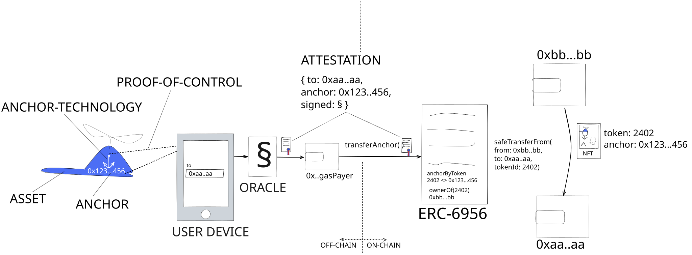

## 摘要

该标准通过扩展 [ERC-721](eip-721.md)，允许将没有签名能力的物理和数字 ASSET 集成到 dApps/web3 中。

一个 ASSET，例如一个物理对象，用一个唯一可识别的 ANCHOR 标记。ANCHOR 以安全且不可分割的方式 1:1 地绑定到链上的 NFT，贯穿 ASSET 的完整生命周期。

通过 ATTESTATION，一个 ORACLE 证明与 ANCHOR 关联的特定 ASSET 在定义某些操作（mint、transfer、burn、approve, ...）的 `to`-address 时已被 CONTROLLED。ORACLE 在链下签署 ATTESTATION。这些操作通过链上验证 ATTESTATION 是否已由受信任的 ORACLE 签名来授权。请注意，授权仅通过 ATTESTATION 提供，或者换句话说，通过对 ASSET 的 PROOF-OF-CONTROL 提供。ASSET 的控制者保证是资产绑定型 NFT 的控制者。

提议的 ATTESTATION 授权操作（如 `transferAnchor(attestation)`）是无需许可的，这意味着当前所有者（`from`-address）和接收者（`to`-address）都不需要签名。

图 1 显示了 ASSET-BOUND NFTTransfer 的数据流。简化的系统利用智能手机作为用户设备与物理 ASSET 交互并指定 `to`-address。



## 动机

众所周知的 [ERC-721](eip-721.md) 规定 NFT 可以代表“对物理财产的所有权 [...] 以及数字收藏品，甚至更抽象的东西，如责任”——更广泛地说，我们将所有这些东西称为 ASSETS，它们通常对人们有价值。

### 问题

ERC-721 概述了“NFT 可以代表对数字或物理资产的所有权”。当用于代表数字、链上资产的所有权时，即当资产是“持有特定合约的代币”或资产是 NFT 的元数据时，ERC-721 在这项任务中表现出色。如今，人们普遍将 NFT 的元数据（图像、特征等）视为资产类别，其稀有性通常直接定义了单个 NFT 的价值。

但是，我们发现存在无法通过 ERC-721 解决的完整性问题，主要是在 NFT 用于代表链下 ASSETS（“物理产品的所有权”、“数字收藏品”、“游戏内资产”、“责任”等）时。在 ASSET 的生命周期中，ASSET 的所有权和占有状态会多次更改，有时甚至数千次。这些状态更改中的每一次都可能导致相关方的义务和特权发生变化。因此，*无法*强制将 ASSET 的相关义务和属性锚定到代币的 ASSET 代币化是不完整的。如今，链下 ASSET 通常通过将 ASSET 标识符添加到 NFT 的元数据中来“锚定”。

**NFT-ASSET 完整性：** 与 NFT 投资者中的一种普遍看法相反，元数据是数据，通常是可变的和链下的。因此，通过存储在可变元数据中的资产标识符与 ASSET 之间的链接，该标识符仅通过 tokenURI 链接到 NFT，充其量只能被认为是弱链接。

存在确保元数据（=对 ASSET 的引用）和代币之间的完整性的方法。这通常通过在链上存储元数据哈希来实现。通过散列还会产生其他问题；对于许多应用程序，除了资产标识符之外，元数据应该可以更新。因此，通过存储哈希使元数据不可变是有问题的。此外，必须提供通过 tokenURI 指定的链下元数据资源直到永远，这在历史上一直容易失败（IPFS bucket 消失，中央 tokenURI 提供商停机，...）

**链下-链上完整性：** 有一些方法可以通过拥有链上表示的所有权来强制执行或限制链下 ASSET 所有权。一种常见的方法是销毁代币以获得（物理）ASSET，因为无法维护完整性。但是，目前尚不知道存在任何方法，可以通过拥有 ASSET 的链下所有权来强制执行链上所有权。特别是当 NFT 的当前所有者不合作或丧失能力时，由于当前 NFT 所有者缺乏签名能力，完整性通常会失败。

元数据是链下的。大多数实现完全忽略了元数据是可变的。更严肃的实现努力通过例如哈希元数据并将哈希映射到链上的 tokenId 来维护完整性。但是，这种方法不允许使用一些用例，例如除了资产标识符之外的元数据，例如特征、“游戏时间”等，应该是可变的或可演变的。

### ASSET-BOUND NON-FUNGIBLE TOKENS

在本标准中，我们建议

1. 通过将 ASSET 不可分割地 ANCHORING 到 NFT 中，来提升通过链上表示物理或数字链下 ASSETS 的概念。
2. 在链下控制 ASSET 必须意味着在链上控制锚定的 NFT。
3. (相关) ASSET 链下所有权的变更不可避免地应通过锚定的 NFT 链上所有权的变更来反映，即使当前所有者不合作或丧失能力。

正如 2. 和 3. 所表明的，ASSET 的控制/所有权/占有应该是唯一的真实来源，*而不是* 拥有 NFT。因此，我们提出一种 ASSET-BOUND NFT，其中对 ASSET 的链下 CONTROL 强制执行对锚定的 NFT 的链上 CONTROL。
此外，提议的 ASSET-BOUND NFT 允许将数字元数据不可分割地锚定到 ASSET。当 ASSET 是物理资产时，这允许以最纯粹的形式设计“phygitals”，即创建具有不可分割的物理和数字组件的“phygital”资产。请注意，元数据本身仍然可以更改，例如对于“可演变的 NFT”。

我们建议通过另一种机制来补充根据 [ERC-721](eip-721.md) 的代币的现有转移控制机制；ATTESTATION。ATTESTATION 由 ORACLE 在链下签名，并且只有在 ORACLE 验证了指定 `to` 地址或受益人地址的人同时控制了 ASSET 时才能发布。证明中的 `to` 地址可用于转移以及批准和其他授权。

通过 ATTESTATION 授权的交易不需要来自 `from`（捐赠者、所有者、发送者）和 `to`（受益人、接收者）帐户的签名或批准，即允许进行无需许可的转移。理想情况下，交易的签名也应独立于 ORACLE，从而允许在 gas 费用方面存在不同的场景。

最后，我们想提及使用提议标准的两个主要附带好处，这些好处大大降低了 onboarding web2 用户的障碍并提高了他们的安全性；

- 新用户，例如 `0xaa...aa`（图 1），可以使用 gasless 钱包，因此可以参与 Web3/dApps/DeFi 并铸造+转移代币，而无需拥有加密货币。Gas 费用可以通过第三方帐户 `0x..gasPayer`（图 1）支付。Gas 通常由 ASSET 发行者支付，他们签署 `transferAnchor()` 交易
- 用户不会被诈骗。常见的攻击（例如钱包耗尽诈骗）不再可能或很容易被撤销，因为只能窃取锚定的 NFT，而不是 ASSET 本身。此外，像将 NFT 转移到错误的帐户、丢失对帐户的访问权限等意外情况可以通过基于校验证对对象 ASSET 的控制权（即物理对象）执行另一个 `transferAnchor()` 交易来缓解。

### 相关工作

我们的主要目标是将物理或数字 ASSETS 加入到 dApps 中，这些 ASSETS 本身没有签名能力（与依赖于加密芯片的其他提案相反）。请注意，我们不认为有任何限制可以阻止将此类解决方案与本标准结合使用，因为加密芯片的地址有资格作为 ANCHOR。

## 规范

本文档中使用的关键词“MUST”，“MUST NOT”，“REQUIRED”，“SHALL”，“SHALL NOT”，“SHOULD”，“SHOULD NOT”，“RECOMMENDED”，“NOT RECOMMENDED”，“MAY”和“OPTIONAL”应按照 RFC 2119 和 RFC 8174 中的描述进行解释。

### 定义 (按字母顺序排列)

- **ANCHOR** 唯一地标识链下 ASSET，无论是物理的还是数字的。
- **ANCHOR-TECHNOLOGY** MUST 确保
  - ANCHOR 与 ASSET 不可分割（物理或其他方式）
  - ORACLE 可以毫无疑问地建立对 ASSET 的 PROOF-OF-CONTROL
  - 对于物理 ASSETS，必须考虑额外的 [物理资产的安全注意事项](#security-considerations-for-physical-assets)

- **ASSET** 指的是通过提议的标准通过 NFT 表示的“事物”，无论是物理的还是数字的。通常，ASSET 没有签名能力。

- **ATTESTATION** 是确认在指定 `to`（接收者、受益人）地址时已建立 PROOF OF CONTROL。

- 对 ASSET 的 **PROOF-OF-CONTROL** 意味着拥有或以其他方式控制 ASSET。如何建立控制证明取决于 ASSET，并且可以使用技术、法律或其他方式来实现。对于物理 ASSETS，CONTROL 通常通过验证物理 ASSET 和用于指定 `to` 地址的输入设备（例如智能手机）之间的物理接近度来验证。

- **ORACLE** 具有签名能力。MUST 能够以一种可以在链上验证签名的方式在链下签署 ATTESTATIONS。

### 基本接口

每个符合本标准的合约 MUST 实现 [提议的标准接口](../assets/eip-6956/contracts/IERC6956.sol)、[ERC-721](eip-721.md) 和 [ERC-165](eip-165.md) 接口，并且受以下 [基本接口的注意事项](#caveats-for-base-interface) 的约束：

```solidity
// SPDX-License-Identifier: MIT OR CC0-1.0
pragma solidity ^0.8.18;

/**
 * @title IERC6956 资产绑定型非同质化代币
 * @notice 资产绑定型非同质化代币将代币 1:1 地锚定到（物理或数字）资产，并且代币转移通过对资产控制权的证明来授权
 * @dev See https://eips.ethereum.org/EIPS/eip-6956
 *      Note: The ERC-165 identifier for this interface is 0xa9cf7635
 */
interface IERC6956 {
   
    /** @dev 授权，通常映射到 authorizationMaps，其中每个位指示是否授权了特定的 ERC6956Role
     *      通常在构造函数中使用（硬编码或参数）来设置 burnAuthorization 和 approveAuthorization
     *      也可以在可选的 updateBurnAuthorization、updateApproveAuthorization 中使用
     */ 
    enum Authorization {
        NONE,               // = 0,      // 以上都不是
        OWNER,              // = (1<<OWNER), // 代币的所有者，即数字表示
        ISSUER,             // = (1<<ISSUER), // 代币的发行者，即此智能合约
        ASSET,              // = (1<<ASSET), // 资产，即通过证明
        OWNER_AND_ISSUER,   // = (1<<OWNER) | (1<<ISSUER),
        OWNER_AND_ASSET,    // = (1<<OWNER) | (1<<ASSET),
        ASSET_AND_ISSUER,   // = (1<<ASSET) | (1<<ISSUER),
        ALL                 // = (1<<OWNER) | (1<<ISSUER) | (1<<ASSET) // 所有者 + 发行者 + 资产
    }
    
    /**
     * @notice 当锚定 tokenId 的批准地址通过证明更改或重申时，会发出此事件
     * @dev 当调用 approveAnchor() 时会发出此事件，并且对应于 ERC-721 行为
     * @param owner 锚定 tokenId 的所有者
     * @param approved 批准的地址，address(0) 表示没有批准的地址
     * @param anchor 锚，已更改其批准
     * @param tokenId 锚定代币的 ID (>0)
     */
    event AnchorApproval(address indexed owner, address approved, bytes32 indexed anchor, uint256 tokenId);

    /**
     * @notice 当任何锚定 NFT 的所有权通过任何机制更改时，会发出此事件
     * @dev 此事件与基于 tokenId 的 ERC-721.Transfer 一起发出，并且提供对转移的锚的角度
     * @param from 前一个所有者，address(0) 表示没有
     * @param to 新的所有者，address(0) 表示代币被销毁
     * @param anchor 绑定到 tokenId 的锚
     * @param tokenId 锚定代币的 ID (>0)
     */
    event AnchorTransfer(address indexed from, address indexed to, bytes32 indexed anchor, uint256 tokenId);
    /**
     * @notice 当使用证明时会发出此事件，表明不会接受具有相同 attestationHash 的第二个证明
     * @param to 证明中指定的 to 地址
     * @param anchor 证明中指定的锚
     * @param attestationHash 证明的哈希值，有关详细信息，请参见 ERC-6956
     * @param totalUsedAttestationsForAnchor 特定锚的总使用证明数 
     */
    event AttestationUse(address indexed to, bytes32 indexed anchor, bytes32 indexed attestationHash, uint256 totalUsedAttestationsForAnchor);

    /**
     * @notice 当预言机的信任状态更改时，会发出此事件。
     * @dev 必须明确指定受信任的预言机。
     *      如果特定预言机地址的最后一个事件指示它是受信任的，则来自此预言机的证明有效。
     * @param oracle 签署证明的预言机的地址
     * @param trusted 指示此地址是否受信任 (true)。使用 (false) 不再信任预言机。
     */
    event OracleUpdate(address indexed oracle, bool indexed trusted);

    /**
     * @notice 返回 tokenId 的 1:1 映射锚
     * @param tokenId 锚定代币的 ID (>0)
     * @return anchor 绑定到 tokenId 的锚，如果 tokenId 不代表锚，则为 0x0
     */
    function anchorByToken(uint256 tokenId) external view returns (bytes32 anchor);
    /**
     * @notice 返回锚的 1:1 映射代币的 ID。
     * @param anchor 锚 (>0x0)
     * @return tokenId 锚定代币的 ID，如果不存在锚定代币，则为 0
     */
    function tokenByAnchor(bytes32 anchor) external view returns (uint256 tokenId);

    /**
     * @notice 已用于修改锚或其绑定代币状态的证明数
     * @param anchor 锚 (>0)
     * @return attestationUses 特定锚的证明使用数，如果锚无效，则为 0。
     */
    function attestationsUsedByAnchor(bytes32 anchor) view external returns (uint256 attestationUses);
    /**
     * @notice 如果证明有效，则解码并返回 to-address、锚和证明哈希。
     * @dev MUST 在以下情况下抛出
     *  - 证明已被使用（已发出具有匹配 attestationHash 的 AttestationUse 事件）
     *  - 证明未由受信任的预言机签名（签名者地址的最后一个 OracleUpdate 事件未指示信任）
     *  - 证明尚未生效或已过期
     *  - [如果实现了 IERC6956AttestationLimited] attestationUsagesLeft(attestation.anchor) <= 0
     *  - [如果实现了 IERC6956ValidAnchors] validAnchors(data) 未返回 true。
     * @param attestation 证明，服从 ERC-6956 中指定的格式
     * @param data 可选的附加数据，当实现了 IERC6956ValidAnchors 时，可能包含证明作为第一个 abi 编码的参数
     * @return to 锚定代币或批准的所有权应更改为的地址
     * @return anchor 锚 (>0)
     * @return attestationHash 在链上计算的证明哈希，如 `keccak256(attestation)`
     */
    function decodeAttestationIfValid(bytes memory attestation, bytes memory data) external view returns (address to, bytes32 anchor, bytes32 attestationHash);

    /**
     * @notice 指示是否授权 ASSET、OWNER、ISSUER 进行销毁
     */
    function burnAuthorization() external view returns(Authorization burnAuth);

    /**
     * @notice 指示是否授权 ASSET、OWNER、ISSUER 进行批准
     */
    function approveAuthorization() external view returns(Authorization approveAuth);

    /**
     * @notice 对应于没有额外数据的 transferAnchor(bytes,bytes)
     * @param attestation 证明，有关详细信息，请参阅 ERC-6956
     */
    function transferAnchor(bytes memory attestation) external;

    /**
     * @notice 将映射到 attestation.anchor 的 NFT 的所有权更改为 attestation.to 地址。
     * @dev 无需许可，即任何人都可以调用和签署交易。通过预言机签署的证明授权转移。
     *  - 使用 decodeAttestationIfValid()
     *  - 当使用集中式“gas 付款人”时，建议实现 IERC6956AttestationLimited。
     *  - 匹配 ERC-721.safeTransferFrom(ownerOf[tokenByAnchor(attestation.anchor)], attestation.to, tokenByAnchor(attestation.anchor), ..) 的行为，并在 `tokenByAnchor(anchor)==0` 时 mint NFT。
     *  - 当 attestation.to == ownerOf(tokenByAnchor(attestation.anchor)) 时抛出
     *  - 发出 AnchorTransfer
     *  
     * @param attestation 证明，有关详细信息，请参阅 ERC-6956
     * @param data 附加数据，可用于其他转移条件，可以部分或全部发送到 safeTransferFrom 的调用中
     * 
     */
    function transferAnchor(bytes memory attestation, bytes memory data) external;

     /**
     * @notice 对应于没有额外数据的 approveAnchor(bytes,bytes)
     * @param attestation 证明，有关详细信息，请参阅 ERC-6956
     */
    function approveAnchor(bytes memory attestation) external;

     /**
     * @notice 批准绑定到 attestation.anchor 的代币的 attestation.to。
     * @dev 无需许可，即任何人都可以调用和签署交易。通过预言机签署的证明授权转移。
     *  - 使用 decodeAttestationIfValid()
     *  - 当使用集中式“gas 付款人”时，建议实现 IERC6956AttestationLimited。
     *  - 匹配 ERC-721.approve(attestation.to, tokenByAnchor(attestation.anchor)) 的行为。
     *  - 当未授权 ASSET 进行批准时抛出。
     * 
     * @param attestation 证明，有关详细信息，请参阅 ERC-6956
     */
    function approveAnchor(bytes memory attestation, bytes memory data) external;

    /**
     * @notice 对应于没有额外数据的 burnAnchor(bytes,bytes)
     * @param attestation 证明，有关详细信息，请参阅 ERC-6956
     */
    function burnAnchor(bytes memory attestation) external;
   
    /**
     * @notice 销毁映射到 attestation.anchor 的代币。使用 ERC-721._burn。
     * @dev 无需许可，即任何人都可以调用和签署交易。通过预言机签署的证明授权转移。
     *  - 使用 decodeAttestationIfValid()
     *  - 当使用集中式“gas 付款人”时，建议实现 IERC6956AttestationLimited。
     *  - 当未授权 ASSET 进行销毁时抛出
     * 
     * @param attestation 证明，有关详细信息，请参阅 ERC-6956
     */
    function burnAnchor(bytes memory attestation, bytes memory data) external;
}
```

#### 基本接口的注意事项

- MUST 实现 ERC-721 和 ERC-165
- MUST 具有双向映射 `tokenByAnchor(anchor)` 和 `anchorByToken(tokenId)`。这意味着每个 ANCHOR 最多存在一个代币。
- MUST 具有确定 ANCHOR 对于合约是否有效的机制。建议实现建议 [ValidAnchors 接口](#validanchors-interface)
- MUST 实现 `decodeAttestationIfValid(attestation, data)` 以验证和解码 ATTESTATIONS，如 [ORACLE 节](#oracle) 中指定的那样
  - MUST 返回 `attestation.to`、`attestation.anchor`、`attestation.attestationHash`。
  - MUST 不能修改状态，因为此函数可用于检查 ATTESTATION 的有效性，而无需赎回它。
  - MUST 在以下情况下抛出
    - ATTESTATION 未从受信任的 ORACLE 签名。
    - ATTESTATION 已过期或尚未生效
    - ATTESTATION 尚未被赎回。“已赎回”定义为至少一个状态更改操作已通过特定 ATTESTATION 授权。
    - 如果实现 [AttestationLimited 接口](#attestationlimited-interface)：当 `attestationUsagesLeft(attestation.to) <= 0` 时
    - 如果实现 [ValidAnchors 接口](#validanchors-interface)：当 `validAnchor() != true` 时。
  - 如果实现 [ValidAnchors 接口](#validanchors-interface)：MUST 调用 `validAnchor(attestation.to, abi.decode('bytes32[]',data))`，这意味着 `data` 参数中的第一个 abi 编码值对应于 `proof`。
- MUST 具有一个 ANCHOR-RELEASED 机制，指示锚定的 NFT 是否已发布/可转移。
  - 默认情况下，任何 ANCHOR MUST NOT 被发布。
- MUST 扩展任何 ERC-721 代币转移机制，方式是：
  - 当 `ANCHOR` 未发布时 MUST 抛出。
  - 当 batchSize > 1 时 MUST 抛出，即此合约不支持批量转移。
  - MUST 发出 `AnchorTransfer(from, to, anchorByToken[tokenId], tokenId)`

- MUST 实现 `attestationsUsedByAnchor(anchor)`，返回特定锚已使用的证明数。

- MUST 实现状态更改 `transferAnchor(..)`, `burnAnchor(..)`, `approveAnchor(..)` 并且 OPTIONAL MAY 实现其他状态更改操作，这些操作
  - MUST 使用 `decodeAttestationIfValid()` 来确定 `to`、`anchor` 和 `attestationHash`
  - MUST 在与任何授权状态更改操作相同的交易中赎回每个 ATTESTATION。建议通过存储每个使用的 `attestationHash`
  - MUST 递增 `attestationsUsedByAnchor[anchor]`
  - MUST 发出 `AttestationUsed`
  - `transferAnchor(attestation)` MUST 表现得并且发出事件，类似于 `ERC-721.safeTransferFrom(ownerOf[tokenByAnchor(attestation.anchor)], attestation.to, tokenByAnchor(attestation.anchor), ..)`，并在 `tokenByAnchor(anchor)==0` 时 mint NFT。
 
- 建议实现 `tokenURI(tokenId)` 以返回一个基于锚的 URI，即 `baseURI/anchor`。这会将元数据锚定到 ASSET 。在锚首次使用之前，ANCHOR 到 tokenId 的映射是未知的。因此，首选使用锚而不是 tokenId。

### ORACLE

- MUST 提供 ATTESTATION。下面我们定义 ORACLE 如何证明转移的 `to` 地址是在与转移到 `to` 的特定 ANCHOR 关联的 PROOF-OF-CONTROL 的前提下指定的格式。
- ATTESTATION MUST 对以下内容进行 abi 编码：
  - `to`，MUST 是地址，指定受益人，例如 to-address、批准的帐户等。
  - ANCHOR，又名 ASSET 标识符，MUST 与 ASSET 具有 1:1 关系
  - `attestationTime`，UTC 秒，ORACLE 签署证明的时间，
  - `validStartTime` UTC 秒，ATTESTATION 有效时间范围的开始时间
  - `validEndTime`，UTC 秒，ATTESTATION 有效时间范围的结束时间
  - `signature`，ETH 签名（65 字节）。ORACLE 签署 `attestationHash = keccak256([to, anchor, attestationTime, validStartTime, validEndTime])` 的输出。
- 如何通过 ANCHOR-TECHNOLOGY 详细建立 PROOF-OF-CONTROL 不属于本标准的范围。使用 PHYSICAL ASSETS 时，[物理资产的安全注意事项](#security-considerations-for-physical-assets) 中概述了一些 ORACLE 要求和 ANCHOR-TECHNOLOGY 要求。

可以在本提议的 [参考实现部分](#reference-implementation) 中找到用于生成 ATTESTATION 的最小 Typescript 示例。

### AttestationLimited-Interface

每个符合本标准的合约 MAY 实现 [提议的 AttestationLimited 接口](../assets/eip-6956/contracts/IERC6956AttestationLimited.sol)，并且受以下 [注意事项](#caveats-for-attestationlimited-interface) 的约束：

```solidity
// SPDX-License-Identifier: MIT OR CC0-1.0
pragma solidity ^0.8.18;
import "./IERC6956.sol";

/**
 * @title Attestation-limited Asset-Bound NFT
 * @dev See https://eips.ethereum.org/EIPS/eip-6956
 *      Note: The ERC-165 identifier for this interface is 0x75a2e933
 */
interface IERC6956AttestationLimited is IERC6956 {
  enum AttestationLimitPolicy {
    IMMUTABLE,
    INCREASE_ONLY,
    DECREASE_ONLY,
    FLEXIBLE
  }
      
  /// @notice 返回特定锚的证明限制
  /// @dev MUST 默认返回全局证明限制
  ///      并且，如果设置了基于锚的限制，则覆盖全局证明限制
  function attestationLimit(bytes32 anchor) external view returns (uint256 limit);

  /// @notice 返回特定锚剩余的证明数
  /// @dev 通过比较 attestationsUsedByAnchor(anchor) 和当前证明限制来计算
  ///      （当前限制通过 GlobalAttestationLimitUpdate 或 AttestationLimit 事件发出）
  function attestationUsagesLeft(bytes32 anchor) external view returns (uint256 nrTransfersLeft);

  /// @notice 指示更新证明限制（全局或按锚）的方向的策略
  function attestationLimitPolicy() external view returns (AttestationLimitPolicy policy);

  /// @notice 当更新全局证明限制时，会发出此事件
  event GlobalAttestationLimitUpdate(uint256 indexed transferLimit, address updatedBy);

  /// @notice 当锚特定的证明限制被更新时，会发出此事件
  event AttestationLimitUpdate(bytes32 indexed anchor, uint256 indexed tokenId, uint256 indexed transferLimit, address updatedBy);

  /// @dev 在 attestationUsagesLeft 变为 0 的交易中发出此事件
  event AttestationLimitReached(bytes32 indexed anchor, uint256 indexed tokenId, uint256 indexed transferLimit);
}
```

#### AttestationLimited 接口的注意事项

- MUST 扩展提议的标准接口
- MUST 定义上述列出的证明限制更新策略之一，并通过 `attestationLimitPolicy()` 公开它
  - MUST 支持不同的更新模式，即 FIXED、INCREASE_ONLY、DECREASE_ONLY、FLEXIBLE (= INCREASABLE 和 DECREASABLE)
  - 建议具有全局转移限制，该限制可以在令牌基础上被覆盖（当 `attestationLimitPolicy() != FIXED` 时）
- MUST 实现 `attestationLimit(anchor)`，指定一个 ANCHOR 总共可以转移多少次。返回值中的更改 MUST 反映 AttestationLimit-Policy。
- MUST 实现 `attestationUsagesLeft(anchor)`，返回特定锚剩余的用法数量（即 `attestationLimit(anchor)-attestationsUsedByAnchor[anchor]`）

### Floatable-Interface

每个符合本标准的合约 MAY 实现提议的 [Floatable 接口](../assets/eip-6956/contracts/IERC6956Floatable.sol)，并且受以下 [注意事项](#caveats-for-floatable-interface) 的约束：

```solidity
// SPDX-License-Identifier: MIT OR CC0-1.0
pragma solidity ^0.8.18;
import "./IERC6956.sol";

/**
 * @title Floatable Asset-Bound NFT
 * @notice A floatable Asset-Bound NFT can (temporarily) be transferred without attestation
 * @dev See https://eips.ethereum.org/EIPS/eip-6956
 *      Note: The ERC-165 identifier for this interface is 0xf82773f7
 */
interface IERC6956Floatable is IERC6956 {
  enum FloatState {
    Default, // 0, inherits from floatAll
    Floating, // 1
    Anchored // 2
  }

  /// @notice Indicates that an anchor-specific floating state changed
  event FloatingStateChange(bytes32 indexed anchor, uint256 indexed tokenId, FloatState isFloating, address operator);
  /// @notice Emits when FloatingAuthorization is changed.
  event FloatingAuthorizationChange(Authorization startAuthorization, Authorization stopAuthorization, address maintainer);
  /// @notice Emits, when the default floating state is changed
  event FloatingAllStateChange(bool areFloating, address operator);

  /// @notice Indicates whether an anchored token is floating, namely can be transferred without attestation
  function floating(bytes32 anchor) external view returns (bool);
  
  /// @notice Indicates whether any of OWNER, ISSUER, (ASSET) is allowed to start floating
  function floatStartAuthorization() external view returns (Authorization canStartFloating);
  
  /// @notice Indicates whether any of OWNER, ISSUER, (ASSET) is allowed to stop floating
  function floatStopAuthorization() external view returns (Authorization canStartFloating);

  /**
    * @notice Allows to override or reset to floatAll-behavior per anchor
    * @dev Must throw when newState == Floating and floatStartAuthorization does not authorize msg.sender
    * @dev Must throw when newState == Anchored and floatStopAuthorization does not authorize msg.sender
    * @param anchor The anchor, whose anchored token shall override default behavior
    * @param newState Override-State. If set to Default, the anchor will behave like floatAll
    */
  function float(bytes32 anchor, FloatState newState) external;    
}
```

#### Floatable 接口的注意事项

如果 `floating(anchor)` 返回 true，则由 `tokenByAnchor(anchor)` 标识的代币 MUST 可以无需证明即可转移，通常通过 `ERC721.isApprovedOrOwner(msg.sender, tokenId)` 授权

### ValidAnchors-Interface

每个符合此扩展的合约 MAY 实现提议的 [ValidAnchors 接口](../assets/eip-6956/contracts/IERC6956ValidAnchors.sol)，并且受以下 [注意事项](#caveats-for-validanchors-interface) 的约束：

```solidity
// SPDX-License-Identifier: MIT OR CC0-1.0
pragma solidity ^0.8.18;
import "./IERC6956.sol";

/**
 * @title Anchor-validating Asset-Bound NFT
 * @dev See https://eips.ethereum.org/EIPS/eip-6956
 *      Note: The ERC-165 identifier for this interface is 0x051c9bd8
 */
interface IERC6956ValidAnchors is IERC6956 {
    /**
     * @notice Emits when the valid anchors for the contract are updated.
     * @param validAnchorHash Hash representing all valid anchors. Typically Root of Merkle-Tree
     * @param maintainer msg.sender when updating the hash
     */
    event ValidAnchorsUpdate(bytes32 indexed validAnchorHash, address indexed maintainer);

    /**
     * @notice Indicates whether an anchor is valid in the present contract
     * @dev Typically implemented via MerkleTrees, where proof is used to verify anchor is part of the MerkleTree 
     *      MUST return false when no ValidAnchorsUpdate-event has been emitted yet
     * @param anchor The anchor in question
     * @param proof Proof that the anchor is valid, typically MerkleProof
     * @return isValid True, when anchor and proof can be verified against validAnchorHash (emitted via ValidAnchorsUpdate-event)
     */
    function anchorValid(bytes32 anchor, bytes32[] memory proof) external view returns (bool isValid);        
}
```

#### ValidAnchors 接口的注意事项

- MUST 实现 `validAnchor(anchor, proof)`，当锚有效时返回 true，即 MerkleProof 正确，否则返回 false。

## 理由

**为什么使用 anchor<>tokenId 映射，而不是直接使用 tokenIds？**
特别是对于收藏用例，特殊的或连续的 tokenIds（例如低位数字）具有价值。持有者可能会自豪地声明了 tokenId=1，或者 tokenId=1 的链下 ASSET 可能会升值，因为它是有史以来第一个被声明的。或者发行者可能想要向声明其 ASSET-BOUND NFT 的前 100 位所有者宣传。虽然这些用例在技术上当然可以通过观察区块链状态更改来覆盖，但我们认为在 tokenIds 中反映顺序是用户友好的方式。请参阅 [安全注意事项](#security-considerations)，了解为什么应避免连续锚。

**为什么 tokenId=0 和 anchor=0x0 无效？**
为了提高 gas 效率。这允许省略检查和状态变量以确定代币或锚是否存在，因为不存在的键的映射返回 0，并且不容易与 anchor=0 或 tokenId=0 区分开。

**ASSETS 通常以批量生产，目的是获得相同的属性，例如一批汽车备件。为什么要扩展 ERC-721，而不是多代币标准？**
即使（物理）ASSET 是以具有可替代特性的方式批量生产的，每个 ASSET 都有单独的属性/所有权图，因此应以非同质化的方式表示。因此，本 EIP 遵循设计决策，即 ASSET（通过名为 ANCHOR 的唯一资产标识符表示）和代币始终以 1-1 的方式映射，而不是 1-N 的方式映射，以便代币表示 ASSET 的单独属性图。

**为什么有 burnAnchor() 和 approveAnchor()？**
由于无需许可的性质，ASSET-BOUND NFT 甚至可以转移到或从任何地址转移。这包括任意和随机生成的帐户（私钥未知）以及传统上不支持 ERC-721 NFT 的智能合约。按照拥有 ASSET 必须等同于拥有 NFT 的原则，这意味着我们还需要支持 ERC-721 操作，例如通过使用证明授权操作来批准和燃烧。

**实施方案的替代方案** Soulbound 销毁+铸造组合，例如通过双方知情的 Soulbound 代币 ([ERC-5484](eip-54**为什么 start 和 stop 有不同的浮动授权？**
根据用例，不同的角色应该能够启动或停止浮动。请注意，对于许多应用程序，ISSUER 可能希望控制集合的可浮动性。

### 示例用例和推荐的接口组合

基于占有的用例由标准接口 `IERC6956` 涵盖：ASSET 的持有者拥有 ASSET。占有是一种重要的社会和经济工具：在许多体育比赛中，拥有 ASSET（通常称为“球”）至关重要。占有可以带来某些义务和特权。对 ASSET 的所有权可以带来权利和利益，以及受到留置权和义务的约束。例如，拥有的 ASSET 可用于抵押、出租，甚至可以产生回报。示例用例包括

- **基于占有的 Token 门控：** 拥有限量版 T 恤（ASSET）的俱乐部客人获得一个 Token，该 Token 允许他打开通往 VIP 休息室的门。

- **基于占有的数字孪生：** 一位游戏玩家拥有一双实体运动鞋（ASSET），并获得一个数字孪生（NFT）以在元宇宙中穿着它们。

- **稀缺的基于占有的数字孪生：** 运动鞋（ASSET）的生产商决定该产品包含 5 个数字孪生（NFT）的限制，以创造稀缺性。

- **可借用的数字孪生：** 游戏玩家可以将其运动鞋 Token（NFT）借给元宇宙中的朋友，以便该朋友可以跑得更快。

- **保护所有权免受盗窃：** 如果 ASSET 是链下拥有的，则所有者希望保护已锚定的 NFT，即不允许转移以防止盗窃或通过 ASSET 轻松恢复 NFT。

- **出售有抵押贷款的房子：** 所有者持有 NFT 作为所有权证明。DeFi 银行为房屋提供融资，并锁定 NFT 的转移。允许转移 NFT 需要偿还抵押贷款。链下出售 ASSET（房子）将是不可能的，因为它不再可能为房屋提供融资。

- **出售有租赁权的房子：** 租赁合同会对 ASSET 锚定的 NFT 设置留置权。旧所有者移除锁定，新所有者购买并为房屋再融资。NFT 的转移也将留置权的义务和利益转移给新所有者。

- **首付购买全新汽车：** 买方配置一辆汽车并支付首付，该汽车将具有 ANCHOR。只要汽车尚未生产，NFT 就可以浮动并在 NFT 市场上交易。在 ASSET 交付时 NFT 的所有者有权取车并有义务支付全价。

- **通过远期交易购买一桶石油：** 买方购买一份关于一桶石油（ASSET）远期合约的石油期权。在到期日，买方有义务取油。

下面的用例矩阵显示了哪些扩展和设置必须（除了 `IERC6956`！）与相关的配置一起为示例用例实现。

请注意，对于下表中列出的 `Lockable`，建议的 EIP 可以扩展为 ERC-721 的任何锁定或留置机制，例如 [ERC-5192](eip-5192.md) 或 [ERC-6982](eip-6982.md)。我们建议验证 Token 是否在 `_beforeTokenTransfer()` 钩子中被锁定，因为它从 `safeTransferFrom()` 以及 `transferAnchor()` 中调用，因此适合阻止“标准”ERC-721 转移以及建议的基于认证的转移。

| 用例 | approveAuthorization | burnAuthorization | `IERC6956Floatable` | `IERC6956AttestationLimited` | Lockable |
|---------------|---|---|---|---|---|
| **管理占有** |
| Token 门控 | ASSET | ANY | 不兼容 | - | - |
| 数字孪生 | ASSET | ANY | 不兼容 | - | - |
| 稀缺数字孪生 | ASSET | ANY | 不兼容 | 必需 | - |
| 可借用的数字孪生 | OWNER_AND_ASSET | ASSET | 必需 | - | - |
| **管理所有权** |
| 保护所有权免受盗窃 | OWNER 或 OWNER_AND_ASSET | ANY | 可选 | - | 必需 |
| 出售有抵押贷款的房子 | ASSET 或 OWNER_AND_ASSET | ANY | 可选 | 可选 | 必需 |
| 出售有租赁权的房子 | ASSET 或 OWNER_AND_ASSET | ANY | 可选 | 可选 | 必需 |
| 首付购买全新汽车 | ASSET 或 OWNER_AND_ASSET | ANY | 可选 | 可选 | 必需 |
| 通过远期交易购买一桶石油 | ASSET 或 OWNER_AND_ASSET | ANY | 可选 | 可选 | 必需 |

图例：

- 必需 ... 如果没有它，我们看不到如何实现该用例
- 不兼容 ... 这绝对不能实现，因为这会对用例构成安全风险
- 可选 ... 这可以有选择地实现

## 向后兼容性

未发现向后兼容性问题。

此 EIP 与 ERC-721 完全兼容，并且（当扩展为 `IERC6956Floatable` 接口时）对应于众所周知的 ERC-721 行为，并具有通过认证的附加授权机制。因此，我们建议 - 特别是对于实物资产 - 使用当前的 EIP 代替 ERC-721，并使用专为 ERC-721 设计的扩展来修订它。

但是，建议使用指示 NFT 在市场上的可转移性的接口来扩展所提出的标准的实现。示例包括 [ERC-6454](eip-6454.md) 和 [ERC-5484](eip-5484.md)。

许多 ERC-721 扩展建议向转移方法添加额外的抛出条件。此标准完全兼容，因为

- 经常使用的 ERC-721 `_beforeTokenTransfer()` 钩子必须为所有转移（包括经认证授权的转移）调用。
- 建议在参考实现中使用 `_beforeAnchorUse()` 钩子，该钩子仅在使用认证作为授权时调用。

## 测试用例

测试用例可用：

- 仅实现[建议的标准接口](../assets/eip-6956/contracts/IERC6956.sol)的测试用例可以在[这里](../assets/eip-6956/test/ERC6956.ts)找到
- 实现[建议的标准接口](../assets/eip-6956/contracts/IERC6956.sol), [Floatable 扩展](../assets/eip-6956/contracts/IERC6956Floatable.sol), [ValidAnchors 扩展](../assets/eip-6956/contracts/IERC6956ValidAnchors.sol) 和 [AttestationLimited 扩展](../assets/eip-6956/contracts/IERC6956AttestationLimited.sol) 的测试用例可以在[这里](../assets/eip-6956/test/ERC6956Full.ts)找到

## 参考实现

- 仅支持[建议的标准接口](../assets/eip-6956/contracts/IERC6956.sol)的最小实现可以在[这里](../assets/eip-6956/contracts/ERC6956.sol)找到
- 支持[建议的标准接口](../assets/eip-6956/contracts/IERC6956.sol), [Floatable 扩展](../assets/eip-6956/contracts/IERC6956Floatable.sol), [ValidAnchors 扩展](../assets/eip-6956/contracts/IERC6956ValidAnchors.sol) 和 [AttestationLimited 扩展](../assets/eip-6956/contracts/IERC6956AttestationLimited.sol)的完整实现可以在[这里](../assets/eip-6956/contracts/ERC6956Full.sol)找到
- 一个使用 ethers 库生成 ATTESTATION 的 Minimal Typescript 示例可以在[这里](../assets/eip-6956/minimalAttestationSample.ts)找到

## 安全考虑

**如果资产被盗，这是否意味着小偷可以控制 NFT？**
是的。该标准的目的是将 NFT 不可分割地且无条件地锚定到资产。这包括反映盗窃行为，因为 ORACLE 将证明已建立对 ASSET 的 PROOF-OF-CONTROL。ORACLE 不证明控制器是否为合法所有者。
请注意，这甚至可能是一种好处。如果小偷（或从盗贼那里收到资产的人）应该与锚点互动，则犯罪相关人员（直接或另一个受害者）的链上地址就会为人所知。这可能是调查的宝贵起点。
另请注意，所提出的标准可以与任何锁定机制结合使用，该机制可以暂时或永久地（在铸造后）锁定基于认证的操作。

**如何使用 AttestationLimits 避免资金耗尽**
区块链应用程序中的一个核心安全机制是 Gas 费用。Gas 费用确保执行大量交易会受到惩罚，因此所有 DoS 或其他大规模攻击都会受到阻止。由于经认证授权的操作的无需许可性质，将会出现许多用例，其中 ASSET 的发行者（通常也是 ASSET-BOUND NFT 的发行者）将支付所有交易的费用 - 这与众所周知的 ERC-721 行为相反，在 ERC-721 行为中，from 或 to 地址都会支付。因此，具有恶意意图的用户可能只是让 ORACLE 多次批准 PROOF-OF-CONTROL，并指定交替的帐户地址。这些 ATTESTATIONS 将被交给中央 Gas 支付者，后者将以无需许可的方式执行它们，并为每笔交易支付 Gas 费用。这有效地耗尽了 Gas 支付者的资金，一旦 Gas 支付者无法再支付交易费用，系统将变得不可用。

**为什么您建议对序列号进行哈希处理而不是直接使用它们？**
使用任何顺序标识符至少可以推断出有史以来使用的最低和最高序列号之间的数字。因此，这很好地表明了市场上资产的总数。虽然对于收藏品来说，有限数量的资产通常是可取的，但公布资产的确切生产数量对于大多数行业来说是不受欢迎的，因为它等于公布每个产品组的销售额/收入数字，这通常被认为是机密的。在供应链中，由于其基于范围的处理能力，序列号通常是强制性的。允许使用物理序列号并仍然混淆资产实际数量的最简单方法是通过对序列号进行哈希/加密。

**为什么需要锚点验证，为什么不简单地信任 oracle 只证明有效的锚点？**
oracle 证明 PROOF-OF-CONTROL。由于 ORACLE 必须知道有效锚点的 merkle 树，因此它也可以出于恶意修改 merkle 树。因此，需要进行链上验证，以确定是否使用了原始的 merkle 树。即使 oracle 受到损害，它也不应有权引入新的锚点。这是通过要求 oracle 知道 merkle 树来实现的，但 updateValidAnchors() 只能由维护者调用。请注意，oracle 不得是维护者。因此，应在链下小心，以确保破坏一个系统部分不会自动破坏 oracle 和维护者帐户。

**为什么您使用 merkle 树进行锚点验证？**
出于安全和 Gas 考虑。除了有限的集合外，锚点通常会随着时间的推移添加，例如，当生产或发行一批新的资产时。虽然在链上存储所有可用锚点在 Gas 方面已经无效，但发布所有锚点也会暴露资产的总数。当使用来自锚点更新的数据时，甚至可以推断出该资产的生产能力，这通常被认为是机密信息。

**假设您有 N 个锚点。如果所有锚定的 NFT 都被铸造，那么 merkle 树有什么用？**
如果所有锚定的 NFT 都被铸造，这意味着所有锚点都已发布并且可以在链上收集。因此，可以重建 merkle 树。虽然对于许多用例来说这可能不是问题（无论如何所有支持的锚点都被铸造），但我们仍然建议向 merkle 树添加一个“salt-leave”，其特征在于 ORACLE 永远不会为匹配该 salt-leave 的 ANCHOR 发布证明。因此，即使所有 N 个锚点都是

### 物理资产的安全考虑

如果 ASSET 是物理对象、商品或财产，则必须满足以下附加规范：

#### 物理锚点的 ORACLE

- 颁发 ATTESTATION 需要 ORACLE
  - 必须证明指定 `to` 地址的输入设备（例如智能手机）与特定物理 ANCHOR 及其关联的物理对象之间的物理接近程度。典型的可接受接近程度范围从几毫米到几米不等。
  - 必须在合理怀疑之外验证物理存在，特别是所采用的方法
    - 必须能够防止物理 ANCHOR 的复制或再现尝试，
    - 必须能够防止欺骗（例如演示攻击）等。
  - 必须在以下假设下实施：定义 `to` 地址的一方具有恶意意图，并且在当前或曾经没有访问包含物理 ANCHOR 的物理对象的情况下获得虚假 ATTESTATION。

#### 物理 ASSET

- 必须包含一个 ANCHOR，作为唯一的物理对象标识符，通常是一个序列号（纯文本（不推荐）或哈希（推荐））
- 必须包含一个物理安全设备、标记或任何其他功能，以便通过 ORACLE 证明 ATTESTATION 的物理存在
- 建议采用具有不可复制安全功能的 ANCHOR 技术。
- 通常不建议采用可以轻松复制的 ANCHOR 技术（例如条形码、“普通”NFC 芯片等）。复制包括物理复制和数字复制。

## 版权

版权和相关权利通过 [CC0](../LICENSE.md) 放弃。
