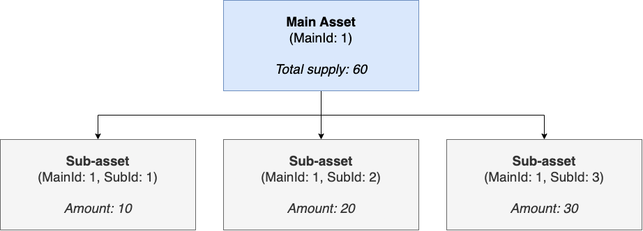

## 摘要

双层代币结合了 [ERC-20](./eip-20.md), [ERC-721](./eip-721.md), 和 [ERC-1155](./eip-1155.md) 的功能，同时添加了一个分类层，该分类层使用 `mainId` 作为主要资产类型标识符，并使用 `subId` 作为主要资产的唯一属性或变体。


拟议的代币旨在在代币管理中提供更多的粒度，从而促进组织良好的代币生态系统，并简化在合约中跟踪代币的过程。该标准对于代币化和实现现实世界资产 (RWA) 的部分所有权特别有用。它还允许对同质化和非同质化资产进行高效且灵活的管理。

以下是 DLT 标准可以代表部分所有权的资产示例：

- 发票
- 公司股票
- 数字藏品
- 房地产

## 动机

[ERC-1155](./eip-1155.md) 标准在以太坊生态系统中得到了广泛采用；但是，在处理具有多重分类的代币时，尤其是在涉及现实世界资产 (RWA) 和资产碎片化时，其设计存在局限性。

本 EIP 试图通过提出一种包含双层分类系统的代币标准来克服此限制，从而能够增强代币的组织和管理，尤其是在需要对代币类型进行额外子分类的情况下。

## 规范

本文档中的关键词“必须”，“禁止”，“需要”，“应该”，“不应该”，“推荐”，“不推荐”，“可以”和“可选”应按照 RFC 2119 和 RFC 8174 中的描述进行解释。

### DLT 接口

```solidity
// SPDX-License-Identifier: CC0-1.0
pragma solidity 0.8.17;

/**
 * @title DLT token standard interface
 * @dev Interface for any contract that wants to implement the DLT standard
 */
interface IDLT {

    /**
     * @dev MUST emit when `subId` token is transferred from `sender` to `recipient`
     * @param sender is the address of the previous holder whose balance is decreased
     * @param recipient is the address of the new holder whose balance is increased
     * @param mainId is the main token type ID to be transferred
     * @param subId is the token subtype ID to be transferred
     * @param amount is the amount to be transferred of the token subtype
     */
    event Transfer(
        address indexed sender,
        address indexed recipient,
        uint256 indexed mainId,
        uint256 subId,
        uint256 amount
    );

    /**
     * @dev MUST emit when `subIds` token array is transferred from `sender` to `recipient`
     * @param sender is the address of the previous holder whose balance is decreased
     * @param recipient is the address of the new holder whose balance is increased
     * @param mainIds is the main token type ID array to be transferred
     * @param subIds is the token subtype ID array to be transferred
     * @param amounts is the amount array to be transferred of the token subtype                
    */
    event TransferBatch(
        address indexed sender,
        address indexed recipient,
        uint256[] mainIds,
        uint256[] subIds,
        uint256[] amounts
    );

    /**
     * @dev MUST emit when `owner` enables `operator` to manage the `subId` token
     * @param owner is the address of the token owner
     * @param operator is the authorized address to manage the allocated amount for an owner address 
     * @param mainId is the main token type ID to be approved
     * @param subId is the token subtype ID to be approved
     * @param amount is the amount to be approved of the token subtype
     */
    event Approval(
        address indexed owner,
        address indexed operator,
        uint256 mainId,
        uint256 subId,
        uint256 amount
    );

    /**
     * @dev MUST emit when `owner` enables or disables (`approved`) `operator` to manage all of its assets
     * @param owner is the address of the token owner
     * @param operator is the authorized address to manage all tokens for an owner address
     * @param approved true if the operator is approved, false to revoke approval
     */
    event ApprovalForAll(
        address indexed owner,
        address indexed operator,
        bool approved
    );
    
    /**
     * @dev MUST emit when the URI is updated for a main token type ID.
     * URIs are defined in RFC 3986.
     * The URI MUST point to a JSON file that conforms to the "DLT Metadata URI JSON Schema".
     * @param oldValue is the old URI value
     * @param newValue is the new URI value
     * @param mainId is the main token type ID
     */
    event URI(string oldValue, string newValue, uint256 indexed mainId);

    /**
     * @dev Approve or remove `operator` as an operator for the caller.
     * Operators can call {transferFrom} or {safeTransferFrom} for any subId owned by the caller.
     * The `operator` MUST NOT be the caller.
     * MUST emit an {ApprovalForAll} event.     
     * @param operator is the authorized address to manage all tokens for an owner address
     * @param approved true if the operator is approved, false to revoke approval
     */
    function setApprovalForAll(address operator, bool approved) external;

    /**
     * @dev Moves `amount` tokens from `sender` to `recipient` using the
     * allowance mechanism. `amount` is then deducted from the caller's
     * allowance.
     * MUST revert if `sender` or `recipient` is the zero address.
     * MUST revert if balance of holder for token `subId` is lower than the `amount` sent.
     * MUST emit a {Transfer} event.
     * @param sender is the address of the previous holder whose balance is decreased
     * @param recipient is the address of the new holder whose balance is increased
     * @param mainId is the main token type ID to be transferred
     * @param subId is the token subtype ID to be transferred
     * @param amount is the amount to be transferred of the token subtype
     * @param data is additional data with no specified format
     * @return True if the operation succeeded, false if operation failed
     */
    function safeTransferFrom(
        address sender,
        address recipient,
        uint256 mainId,
        uint256 subId,
        uint256 amount,
        bytes calldata data
    ) external returns (bool);

    /**
     * @dev Sets `amount` as the allowance of `spender` over the caller's tokens.
     * The `operator` MUST NOT be the caller.
     * MUST revert if `operator` is the zero address.
     * MUST emit an {Approval} event.
     * @param operator is the authorized address to manage tokens for an owner address
     * @param mainId is the main token type ID to be approved
     * @param subId is the token subtype ID to be approved
     * @param amount is the amount to be approved of the token subtype
     * @return True if the operation succeeded, false if operation failed
     */
    function approve(
        address operator,
        uint256 mainId,
        uint256 subId,
        uint256 amount
    ) external returns (bool);

    /**
     * @notice Get the token with a particular subId balance of an `account`
     * @param account is the address of the token holder
     * @param mainId is the main token type ID
     * @param subId is the token subtype ID
     * @return The amount of tokens owned by `account` in subId
     */
    function subBalanceOf(
        address account,
        uint256 mainId,
        uint256 subId
    ) external view returns (uint256);

    /**
     * @notice Get the tokens with a particular subIds balance of an `accounts` array
     * @param accounts is the address array of the token holder
     * @param mainIds is the main token type ID array
     * @param subIds is the token subtype ID array
     * @return The amount of tokens owned by `accounts` in subIds
     */
    function balanceOfBatch(
        address[] calldata accounts,
        uint256[] calldata mainIds,
        uint256[] calldata subIds
    ) external view returns (uint256[] calldata);

    /** 
     * @notice Get the allowance allocated to an `operator`
     * @dev This value changes when {approve} or {transferFrom} are called
     * @param owner is the address of the token owner
     * @param operator is the authorized address to manage assets for an owner address
     * @param mainId is the main token type ID
     * @param subId is the token subtype ID
     * @return The remaining number of tokens that `operator` will be
     * allowed to spend on behalf of `owner` through {transferFrom}. This is
     * zero by default.
     */
    function allowance(
        address owner,
        address operator,
        uint256 mainId,
        uint256 subId
    ) external view returns (uint256);

    /**
     * @notice Get the approval status of an `operator` to manage assets
     * @param owner is the address of the token owner
     * @param operator is the authorized address to manage assets for an owner address
     * @return True if the `operator` is allowed to manage all of the assets of `owner`, false if approval is revoked
     * See {setApprovalForAll}
     */
    function isApprovedForAll(
        address owner,
        address operator
    ) external view returns (bool);
}
```

### `DLTReceiver` 接口

智能合约必须实现 `DLTReceiver` 接口中的所有函数才能接受转账。

```solidity
// SPDX-License-Identifier: CC0-1.0
pragma solidity 0.8.17;

/**
 * @title DLT token receiver interface
 * @dev Interface for any contract that wants to support safeTransfers
 * from DLT asset contracts.
 */
interface IDLTReceiver {
    /**
     * @notice Handle the receipt of a single DLT token type.
     * @dev Whenever an {DLT} `subId` token is transferred to this contract via {IDLT-safeTransferFrom}
     * by `operator` from `sender`, this function is called.
     * MUST return its Solidity selector to confirm the token transfer.
     * MUST revert if any other value is returned or the interface is not implemented by the recipient.
     * The selector can be obtained in Solidity with `IDLTReceiver.onDLTReceived.selector`.
     * @param operator is the address which initiated the transfer
     * @param from is the address which previously owned the token
     * @param mainId is the main token type ID being transferred
     * @param subId subId is the token subtype ID being transferred
     * @param amount is the amount of tokens being transferred
     * @param data is additional data with no specified format
     * @return `IDLTReceiver.onDLTReceived.selector`
     */
    function onDLTReceived(
        address operator,
        address from,
        uint256 mainId,
        uint256 subId,
        uint256 amount,
        bytes calldata data
    ) external returns (bytes4);

    /**
     * @notice Handle the receipts of a DLT token type array.
     * @dev Whenever an {DLT} `subIds` token is transferred to this contract via {IDLT-safeTransferFrom}
     * by `operator` from `sender`, this function is called.
     * MUST return its Solidity selector to confirm the token transfers.
     * MUST revert if any other value is returned or the interface is not implemented by the recipient.
     * The selector can be obtained in Solidity with `IDLTReceiver.onDLTReceived.selector`.
     * @param operator is the address which initiated the transfer
     * @param from is the address which previously owned the token
     * @param mainIds is the main token type ID being transferred
     * @param subIds subId is the token subtype ID being transferred
     * @param amounts is the amount of tokens being transferred
     * @param data is additional data with no specified format
     * @return `IDLTReceiver.onDLTReceived.selector`
     */
    function onDLTBatchReceived(
        address operator,
        address from,
        uint256[] calldata mainIds,
        uint256[] calldata subIds,
        uint256[] calldata amounts,
        bytes calldata data
    ) external returns (bytes4);
}
```

## 理由

本 EIP 中引入的两级分类系统允许创建一个更有组织的代币生态系统，使用户能够以更高的粒度管理和跟踪代币。对于需要超出当前 ERC-1155 标准功能的代币分类的项目，它特别有用。

由于资产可以具有各种属性或变体，因此我们的智能合约设计通过为每个资产类别分配一个 mainId，为每个衍生品或子类别分配一个唯一的 subId 来反映这一点。这种方法扩展了 ERC-1155 的功能，以支持具有复杂要求的更广泛的资产。此外，它还可以跟踪主资产的 mainBalance 和其子资产的 subBalance 的各个帐户。

可以扩展合约以支持以两种方式使用 subId：

- 共享 SubId：所有 mainId 共享同一组 subId。
- 混合 SubId：mainId 具有唯一的 subId 集。

与 ERC-20、ERC-721 和 ERC-1155 等其他代币标准相比，DLT 提供了一种更通用的解决方案，它可以在同一合约中有效地管理同质化和非同质化资产。

以下是我们在设计过程中考虑过的问题：

- 如何命名提案？
该标准向代币引入了两级分类，其中一个主要资产（第 1 层）可以进一步细分为几个子资产（第 2 层），因此我们决定将其命名为“双层”代币，以反映代币分类的层次结构。
- 我们是否应该将分类限制为两层？
该标准的实现维护了一个映射，以跟踪每个子资产的总供应量。如果我们允许子资产拥有自己的子项，则有必要引入其他方法来跟踪每个子资产，这将是不切实际的，并且会增加合约的复杂性。
- 我们应该扩展 ERC-1155 标准吗？
由于 ERC-1155 标准并非旨在支持分层分类，并且需要进行重大修改才能实现，因此我们得出结论，扩展它以用于双层代币标准是不合适的。因此，独立的实现将是一种更合适的方法。

## 向后兼容性

未发现向后兼容性问题。

## 安全考虑

需要讨论。

## 版权

在 [CC0](../LICENSE.md) 下放弃版权及相关权利。