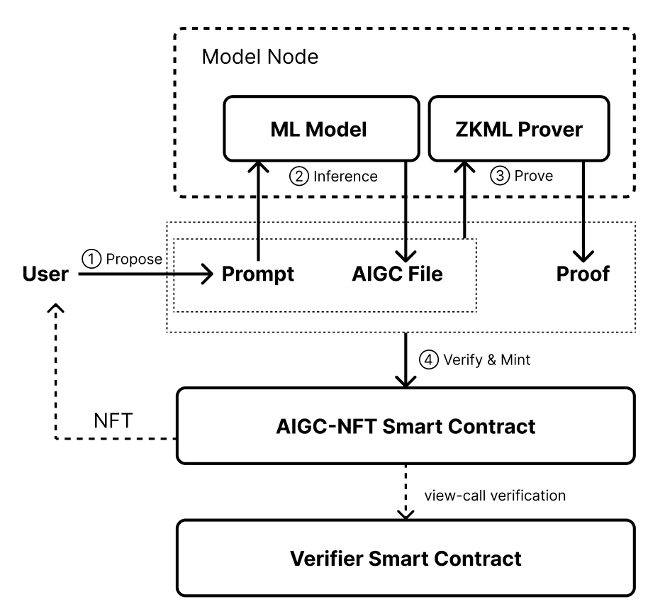

## 摘要

可验证的 AI 生成内容 (AIGC) 非同质化代币 (NFT) 标准是 [ERC-721](./eip-721.md) 代币标准的 AIGC 扩展。它为 AIGC-NFT 的基本交互和可枚举交互提出了一组接口。该标准包括 `addAigcData` 和 `verify` 函数接口、一个新的 `AigcData` 事件、可选的 `Enumerable` 和 `Updatable` 扩展，以及 AIGC-NFT 元数据的 JSON 模式。此外，它还结合了零知识机器学习 (zkML) 和乐观机器学习 (opML) 功能，以实现 AIGC 数据正确性的验证。在此标准中，`tokenId` 由 `prompt` 索引。

## 动机

可验证的 AIGC-NFT 标准旨在扩展现有的 [ERC-721](./eip-721.md) 代币标准，以适应 AI 生成内容 NFT 的独特要求，这些 NFT 代表集合中的模型。此标准提供了使用 zkML 或 opML 来验证 NFT 的 AIGC 数据是否由具有特定输入（prompt）的特定 ML 模型生成的接口。提议的接口允许与添加 AIGC 数据、验证和枚举 AIGC-NFT 相关的其他功能。此外，元数据模式提供了一种结构化格式，用于存储与 AIGC-NFT 相关的信息，例如用于生成内容的 prompt 和所有权证明。

此标准支持两种主要类型的证明：有效性证明和欺诈证明。在实践中，zkML 和 opML 通常被用作这些类型证明的主要实例。开发人员可以选择他们喜欢的。

在 zkML 场景中，该标准允许模型所有者将其训练好的模型及其 ZKP 验证器发布到以太坊。任何用户都可以声明一个输入（prompt）并发布推理任务。任何维护模型和证明电路的节点都可以执行推理和证明，并将推理的输出和推理跟踪的 ZK 证明提交给验证器。启动推理任务的用户将拥有该模型和输入（prompt）的推理输出。

在 opML 场景中，该标准允许模型所有者将其训练好的模型发布到以太坊。任何用户都可以声明一个输入（prompt）并发布推理任务。任何维护该模型的节点都可以执行推理并提交推理输出。其他节点可以在预定义的挑战期内对该结果提出质疑。在挑战期结束时，用户可以验证他们拥有该模型和 prompt 的推理输出，并根据需要更新 AIGC 数据。

这种能力对于希望利用其创作成果的 AI 模型作者和 AI 内容创作者尤其有利。有了这个标准，每个输入 prompt 及其生成的内容都可以在区块链上安全地验证。这为实施所有 AI 生成内容 (AIGC) NFT 销售的收入分成机制提供了机会。AI 模型作者现在可以分享他们的模型，而无需担心开源会降低他们的财务价值。

符合本提案的 zkML AIGC NFT 项目的一个示例工作流程如下：



此工作流程中有 4 个组件：

- ML 模型 - 包含预训练模型的权重；给定一个推理输入，生成输出
- zkML 证明器 - 给定一个带有输入和输出的推理任务，生成一个 ZK 证明
- AIGC-NFT 智能合约 - 符合本提案的合约，具有完整的 [ERC-721](./eip-721.md) 功能
- 验证器智能合约 - 实现一个 `verify` 函数，给定一个推理任务及其 ZK 证明，返回验证结果作为布尔值

## 规范

本文档中的关键词“必须”、“禁止”、“必需”、“应”、“不应”、“应该”、“不应该”、“推荐”、“不推荐”、“可以”和“可选”应按照 RFC 2119 和 RFC 8174 中的描述进行解释。

**每个符合标准的合约都必须实现 `IERC7007`、[`ERC721`](./eip-721.md) 和 [`ERC165`](./eip-165.md) 接口。**

可验证的 AIGC-NFT 标准包括以下接口：

`IERC7007`：定义了一个 `addAigcData` 函数和一个 `AigcData` 事件，用于向 AIGC-NFT 添加 AIGC 数据。定义了一个 `verify` 函数，用于使用 zkML/opML 技术检查 prompt 和 aigcData 组合的有效性。

```solidity
pragma solidity ^0.8.18;

/**
 * @dev ERC7007 兼容合约的必需接口。
 * 注意：此接口的 ERC-165 标识符是 0x702c55a6。
 */
interface IERC7007 is IERC165, IERC721 {
    /**
     * @dev 当 `tokenId` 代币的 AIGC 数据被添加时发出。
     */
    event AigcData(
        uint256 indexed tokenId,
        bytes indexed prompt,
        bytes indexed aigcData,
        bytes proof
    );

    /**
     * @dev 在给定 `prompt`、`aigcData` 和 `proof` 的情况下，将 AIGC 数据添加到 `tokenId` 的代币。
     */
    function addAigcData(
        uint256 tokenId,
        bytes calldata prompt,
        bytes calldata aigcData,
        bytes calldata proof
    ) external;

    /**
     * @dev 验证 `prompt`、`aigcData` 和 `proof`。
     */
    function verify(
        bytes calldata prompt,
        bytes calldata aigcData,
        bytes calldata proof
    ) external view returns (bool success);
}
```

### 可选扩展：可枚举

**枚举扩展**对于 [ERC-7007](./eip-7007.md) 智能合约是可选的。这允许您的合约发布其 `tokenId` 和 `prompt` 之间映射的完整列表，并使其可被发现。

```solidity
pragma solidity ^0.8.18;

/**
 * @title ERC7007 代币标准，可选的枚举扩展
 * 注意：此接口的 ERC-165 标识符是 0xfa1a557a。
 */
interface IERC7007Enumerable is IERC7007 {
    /**
     * @dev 返回给定 `prompt` 的代币 ID。
     */
    function tokenId(bytes calldata prompt) external view returns (uint256);

    /**
     * @dev 返回给定 `tokenId` 的 prompt。
     */
    function prompt(uint256 tokenId) external view returns (string calldata);
}
```

### 可选扩展：可更新

**可更新扩展**对于 [ERC-7007](./eip-7007.md) 智能合约是可选的。这允许您的合约在 opML 的情况下更新代币的 `aigcData`，其中 `aigcData` 内容可能会在挑战期内发生变化。

```solidity
pragma solidity ^0.8.18;

/**
 * @title ERC7007 代币标准，可选的可更新扩展
 * 注意：此接口的 ERC-165 标识符是 0x3f37dce2。
 */
interface IERC7007Updatable is IERC7007 {
    /**
     * @dev 更新 `prompt` 的 `aigcData`。
     */
    function update(
        bytes calldata prompt,
        bytes calldata aigcData
    ) external;

    /**
     * @dev 当 `tokenId` 代币被更新时发出。
     */
    event Update(
        uint256 indexed tokenId,
        bytes indexed prompt,
        bytes indexed aigcData
    );
}
```

### ERC-7007 元数据 JSON 模式供参考

```json
{
  "title": "AIGC 元数据",
  "type": "object",
  "properties": {
    "name": {
      "type": "string",
      "description": "标识此 NFT 代表的资产"
    },
    "description": {
      "type": "string",
      "description": "描述此 NFT 代表的资产"
    },
    "image": {
      "type": "string",
      "description": "一个 URI，指向 mime 类型为 image/* 的资源，表示此 NFT 代表的资产。考虑使任何图像的宽度在 320 到 1080 像素之间，宽高比在 1.91:1 到 4:5 之间（含）。"
    },
    "prompt": {
      "type": "string",
      "description": "标识生成此 AIGC NFT 的 prompt"
    },
    "aigc_type": {
      "type": "string",
      "description": "image/video/audio..."
    },
    "aigc_data": {
      "type": "string",
      "description": "一个 URI，指向 mime 类型为 image/* 的资源，表示此 AIGC NFT 代表的资产。"
    },
    "proof_type": {
      "type": "string",
      "description": "validity (zkML) or fraud (opML)"
    }
  }
}
```

### ML 模型发布

虽然此标准未描述机器学习模型发布阶段，但在任何实际 `addAigcData` 操作之前，将模型的承诺单独发布到以太坊是自然且推荐的。模型承诺模式的选择取决于 AIGC-NFT 项目发行方。承诺应在 `verify` 函数的实现中进行检查。

## 原理

### 唯一代币标识

本规范将 `tokenId` 设置为其对应 `prompt` 的哈希值，从而创建了一种确定性且抗冲突的方式，将代币与其唯一的内容生成参数相关联。此设计决策确保相同的 prompt（对应于相同模型种子下的相同 AI 生成内容）不能被多次铸造，从而防止重复并保持生态系统中每个 NFT 的唯一性。

### 推广到不同的证明类型

本规范容纳两种证明类型：zkML 的有效性证明和 opML 的欺诈证明。`addAigcData` 和 `verify` 中的函数参数被设计为通用性，允许与两种证明系统兼容。此外，该规范包括一个可更新的扩展，专门满足 opML 的要求。

### `verify` 接口

我们指定了一个 `verify` 接口来强制执行 `aigcData` 的正确性。它被定义为一个视图函数来降低 gas 成本。当且仅当 `aigcData` 在 zkML 和 opML 中都已最终确定时，`verify` 应返回 true。在 zkML 中，它必须验证 ZK 证明，即 `proof`；在 opML 中，它必须确保挑战期已结束，并且 `aigcData` 是最新的，即在最终确定后已更新。此外，在 opML 中，`proof` 可以是 _空的_。

### `addAigcData` 接口

我们指定了一个 `addAigcData` 接口来将 prompt 和 `aigcData` 与 `tokenId` 绑定。此函数为不同的铸造实现提供了灵活性。值得注意的是，它在 zkML 和 opML 情况下表现不同。在 zkML 中，`addAigcData` 应确保 `verify` 返回 `true`。而在 opML 中，它可以在最终确定之前被调用。这里的考虑因素是，由于证明难度，zkML 通常在实践中以简单的模型推理任务为目标，因此可以在可接受的时间范围内提供证明。另一方面，opML 启用了大型模型推理任务，但需要更长的确认时间才能达到大致相同的安全级别。考虑到现有的乐观协议，在 opML 最终确定之前进行铸造可能不是最佳实践。

### 关于 `update` 的命名选择

我们采用 "update" 而不是 "finalize"，因为在实践中很少发生成功的挑战。使用 `update` 可以避免为每个 `tokenId` 调用它并节省 gas。

## 向后兼容性

此标准与 [ERC-721](./eip-721.md) 向后兼容，因为它使用新接口扩展了现有功能。

## 测试用例

参考实现包括 `contracts/` 下 [ERC-7007](./eip-7007.md) 接口的示例实现和 `test/` 下相应的单元测试。此 repo 可用于测试提议的接口和元数据模式的功能。

## 参考实现

- 用于 [zkML](../assets/eip-7007/contracts/ERC7007Zkml.sol) 和 [opML](../assets/eip-7007/contracts/ERC7007Opml.sol) 的 ERC-7007
- [ERC-7007 可枚举扩展](../assets/eip-7007/contracts/ERC7007Enumerable.sol)

## 安全考虑

### 抢跑风险

为了解决抢跑风险，即参与者可能会在铸造过程中观察并抢先声明一个 prompt，本提案的实施者必须结合一个安全的 prompt 声明机制。实施可能包括时间锁、提交-揭示方案或其他反抢跑技术，以确保 AIGC-NFT 的公平和安全声明过程。

### 挑战期内的 AIGC 数据变更

在 opML 场景中，重要的是要考虑到由于争议或更新，`aigcData` 可能会在挑战期内发生变化。这里定义的可更新扩展提供了一种处理这些更新的方法。实施必须确保对 `aigcData` 的更新被视为关键的状态更改，需要遵守与初始铸造过程相同的安全和验证协议。索引器应始终检查任何 `Update` 事件的发出。

## 版权

版权和相关权利通过 [CC0](../LICENSE.md) 放弃。
