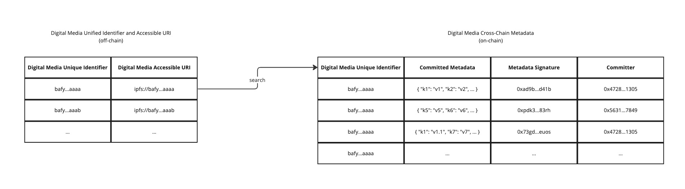

```md
---
eip: 7053
title: 可互操作的数字媒体索引
description: 一种通用的索引方法，用于记录、发现和检索 EVM 兼容区块链上的数字媒体历史。
author: Bofu Chen (@bafu), Tammy Yang (@tammyyang)
discussions-to: https://ethereum-magicians.org/t/eip-7053-interoperable-digital-media-indexing/14394
status: Final
type: Standards Track
category: ERC
created: 2023-05-22
---

## 摘要

本 EIP 提出了一种可互操作的索引策略，旨在增强跨多个智能合约和 EVM 兼容区块链的数字媒体信息的组织和检索。该系统增强了跨合约和跨链数据的可追溯性和验证，从而更有效地发现存储位置和与媒体资产相关的关键信息。主要目的是在区块链上培养一个集成的数字媒体环境。

## 动机

鉴于数字媒体文件在互联网上扮演的重要角色，拥有一个强大而高效的方法来索引不可变信息至关重要。由于缺乏适用于数字媒体内容的通用、可互操作的标识符，现有系统面临着挑战。这导致了碎片化，并使检索元数据、存储信息或特定媒体资产的出处变得复杂。随着数字媒体数量的持续增长，这些问题变得越来越关键。

本 EIP 背后的动机是建立一种标准化的、去中心化的和可互操作的方法来索引跨 EVM 兼容网络的数字媒体。通过集成去中心化内容标识符 (CID) 和 Commit 事件，本 EIP 提出了一种机制，能够唯一标识和索引每个数字媒体文件。此外，该系统还提出了一种供用户访问与数字媒体资产相关的完整数据历史记录的方法，从创建到当前状态。这种完整的视图增强了透明度，从而为用户提供与数字媒体进行未来交互所必需的信息。

此方法创建了一个通用的接口，任何数字媒体系统都可以使用该接口来提供标准化方式来索引和搜索其内容。

||
|:--:|
|  |
| 图 1：数字媒体索引关系和查找 |

本 EIP 旨在创建一个可互操作的索引系统，将相同数字内容的所有数据关联在一起（图 1）。这将使用户更容易查找和信任数字媒体内容，并且还将使系统更容易共享和交换有关此数字媒体内容的信息。

## 规范

本文档中的关键词“必须”、“不得”、“必需”、“应”、“不应”、“应该”、“不应该”、“推荐”、“不推荐”、“可以”和“可选”应按照 RFC 2119 和 RFC 8174 中的描述进行解释。

### 内容标识符

本 EIP 中的内容标识符是通过加密哈希函数传递数字媒体内容而生成的内容地址。在开始数字媒体的索引过程之前，REQUIRED 为每个文件生成唯一的内容标识符。此标识符应与去中心化存储上的内容标识符相同，确保每个标识符都提供对元数据、媒体信息和内容文件本身的访问。

### Commit 函数

为了索引数字媒体，我们应调用 commit 函数并生成 Commit 事件：

```solidity
/**
 * @notice 发出新的 commit 时触发。
 * @param recorder 进行提交的帐户的地址。
 * @param assetCid 被提交的资产的内容标识符。
 * @param commitData 与提交关联的数据。
 */
event Commit(address indexed recorder, string indexed assetCid, string commitData);

/**
 * @notice 为资产注册一个 commit。
 * 发出 Commit 事件并将 commit 的区块号记录在提供的 assetCid 的 recordLogs 映射中。
 * @dev 发出 Commit 事件并记录 commit 事件的区块号。
 * @param assetCid 被提交的资产的内容标识符。
 * @param commitData 与提交关联的数据。
 * @return 进行提交的区块号。
 */
function commit(string memory assetCid, string memory commitData) public returns (uint256 blockNumber);
```

## 合理依据

本 EIP 中的设计决策优先考虑索引方法的有效性和效率。为了实现这一目标，去中心化内容标识符 (CID) 用于唯一标识所有系统中的数字媒体内容。这种方法提供了对媒体的准确和精确搜索，以及以下好处：

1. 加强的数据完整性：CID 充当内容的加密哈希，确保它们的唯一性并防止伪造。有了内容，获取 CID 就可以搜索与该内容相关的相关信息。

2. 简化的数据可移植性：CID 能够跨不同系统无缝传输数字媒体内容，无需重新编码或重新配置协议。这促进了更具互操作性和开放性的索引系统。例如，如果在 Commit 事件之前创建了非同质化代币 (NFT)，则仍然可以使用相同的机制转换 tokenURI 引用的文件来索引数字媒体内容。此转换过程确保可以使用一致的标识方法索引与 NFT 代币关联的数字媒体内容。

## 参考实现

```solidity
// SPDX-License-Identifier: CC0-1.0
pragma solidity ^0.8.4;

import "@openzeppelin/contracts/utils/cryptography/ECDSA.sol";
import "@openzeppelin/contracts-upgradeable/proxy/utils/Initializable.sol";

contract CommitRegister is Initializable {
    using ECDSA for bytes32;

    mapping(string => uint[]) public commitLogs;

    event Commit(address indexed recorder, string indexed assetCid, string commitData);

    function initialize() public initializer {}

    function commit(string memory assetCid, string memory commitData) public returns (uint256 blockNumber) {
        emit Commit(msg.sender, assetCid, commitData);
        commitLogs[assetCid].push(block.number);
        return block.number;
    }

    function getCommits(string memory assetCid) public view returns (uint[] memory) {
        return commitLogs[assetCid];
    }
}
```

## 安全注意事项

在实施此 EIP 时，必须解决几个安全方面，以确保数字媒体索引的安全性和完整性：

1. 输入验证：鉴于 commit 函数接受字符串参数，因此验证这些输入以避免潜在的注入攻击非常重要。虽然这种攻击在智能合约中不如传统的 Web 开发中常见，但应谨慎行事。

2. 数据完整性：commit 函数依赖于 CID，这些 CID 假定是正确的并且指向正确的数据。重要的是要注意，此 EIP 不验证 CID 和 commit 数据背后的内容，这仍然是用户或实施应用程序的责任。

3. 事件监听：依赖于监听 Commit 事件以进行更改的系统需要注意潜在的错过事件或不正确的排序，尤其是在网络拥塞或重组期间。

实施者应在其特定用例和部署方案的上下文中考虑这些安全方面。强烈建议在将此 EIP 的任何实现部署到实时网络之前执行全面的安全审计。

## 版权

在 [CC0](../LICENSE.md) 下放弃版权和相关权利。
```