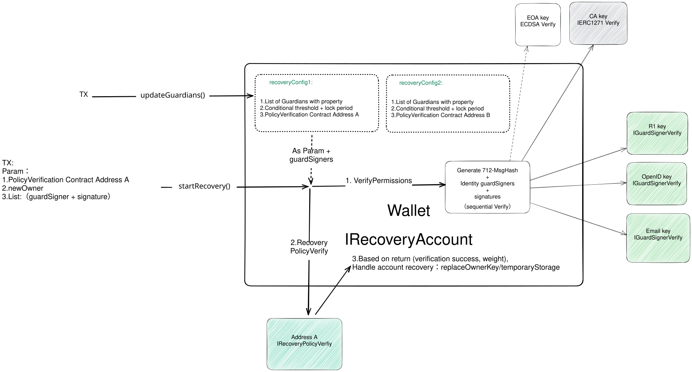

## 摘要

该 ERC 提出了一种智能合约账户社交恢复的标准接口。它将身份和策略验证与恢复过程分离，允许比仅链上账户更多的方式进行身份验证（称为监护人）。它还允许用户自定义恢复策略，而无需更改账户的智能合约。

## 动机

Vitalik Buterin 长期以来一直提倡将社交恢复作为 crypto 领域内用户保护的重要工具。他认为，该系统的价值在于它能够为用户，尤其是那些不太熟悉密码学技术细节的用户，在访问凭据丢失时提供强大的安全保障。通过将账户恢复委托给选定的个人或实体网络（称为“监护人”），用户可以防范丢失对其数字资产访问权限的风险。

本质上，社交恢复通过验证用户和所选监护人的身份，然后考虑一组他们的签名来运作。如果验证后的签名达到指定的阈值，则重新建立账户访问权限。该系统能够执行复杂的策略，例如要求来自特定监护人的签名或达到来自不同监护人类别的签名阈值。

为了克服这些限制，此以太坊改进提案 (EIP) 引入了一种新颖的、可自定义的社交恢复接口标准。该标准将身份和恢复策略验证与恢复程序本身分离，从而能够独立、通用地定义和扩展两者。此策略适应了更广泛的监护人类型和恢复策略，从而为用户提供以下好处：

1. 任命没有区块链账户的朋友或家人作为社交恢复的监护人。
2. 使用 NFT/SBT 作为其账户的监护人。
3. 个性化和实施适应性强的恢复策略。
4. 支持新型监护人和恢复策略，而无需升级其账户合约。
5. 启用多重恢复机制支持，从而消除单点故障。

这种方法使用户能够自定义恢复策略，而无需更改账户本身的智能合约。

## 规范

本文档中的关键词“必须”，“禁止”，“需要”，“应该”，“不应该”，“推荐”，“不推荐”，“可以”和“可选”应按照 RFC 2119 和 RFC 8174 中的描述进行解释。

此 EIP 由四个关键概念组成：

- **身份**：这表示监护人在区块链上的身份表示。它封装了传统的链上账户类型，例如外部拥有账户 (EOA) 和智能合约账户 (SCA)。更重要的是，它扩展到包括任何能够生成可在链上验证的结构（如签名和证明）的身份结构。范围可以从 [Webauthn](https://www.w3.org/TR/2021/REC-webauthn-2-20210408/)/Passkey R1 密钥到电子邮件域密钥识别邮件 (DKIM) 签名 [RFC 6376](https://www.rfc-editor.org/rfc/rfc6376)、OpenID 令牌、零知识证明 (ZKP)、非同质化代币 (NFT)、灵魂绑定代币 (SBT)，甚至尚未开发的类型。这种全面的方法确保了对各种身份类型的广泛的、向前兼容的支持。
- **PermissionVerifier**：此组件定义了如何验证监护人提供的签名或证明。无论监护人的账户是在链上还是链下，在包含社交恢复系统的智能合约账户的恢复过程中都会调用 PermissionVerifier。它的主要作用是确认监护人签名的有效性或证明，从而确保恢复过程中监护人的真实性。
- **RecoveryPolicyVerifier**：此组件为验证恢复策略提供了一个灵活的接口。这种灵活性源于允许账户持有人或授权方定义和存储其恢复策略。在恢复过程中，验证逻辑通过调用采用此接口的合约实例的特定函数来实现。因此，可以通过不同的合约实例和策略配置来满足各种可自定义的社交恢复场景。此合约是可选的，因为有时合约设计者可能不需要策略抽象。
- **RecoveryAccount**：此组件封装了社交恢复功能的核心。它被设计为灵活的、可组合的和可扩展的，以适应各种恢复需求。每个 RecoveryAccount 由一个实例合约定义，该合约由智能合约开发人员精心设计，其中嵌入了恢复过程的基本逻辑。
- **RecoveryModule**：在某些合约设计中，许多函数不会直接添加到账户合约中，而是以模块的形式实现，模块是账户合约之外的合约。此组件封装了社交恢复功能的核心。它被设计为灵活的、可组合的和可扩展的，以适应各种恢复需求。



### 数据类型

### `TypesAndDecoders`

这定义了此接口标准所需的必要数据类型。

```solidity
/**
 * @dev Structure representing an identity with its signature/proof verification logic.
 * Represents an EOA/CA account when signer is empty, use `guardianVerifier`as the actual signer for signature verification.
 * OtherWise execute IPermissionVerifier(guardianVerifier).isValidPermission(hash, signer, signature).
 */
struct Identity {
    address guardianVerifier;
    bytes signer;
}

/**
 * @dev Structure representing a guardian with a property
 * The property of Guardian are defined by the associated RecoveryPolicyVerifier contract.
 */
struct GuardianInfo {
    Identity guardian;
    uint64 property; //eg.,Weight,Percentage,Role with weight,etc.
}

/**
 * @dev Structure representing a threshold configuration
 */
struct ThresholdConfig {
    uint64 threshold; // Threshold value
    int48 lockPeriod; // Lock period for the threshold
}

/**
 * @dev Structure representing a recovery configuration
 * A RecoveryConfig can have multiple threshold configurations for different threshold values and their lock periods, and the policyVerifier is optional.
 */
struct RecoveryConfigArg {
    address policyVerifier;
    GuardianInfo[] guardianInfos;
    ThresholdConfig[] thresholdConfigs;
}

struct Permission {
    Identity guardian;
    bytes signature;
}

```

`Identity` 结构表示各种类型的监护人。身份验证过程如下：

- 当声明的实体中的 `signer` 值为空时，这意味着 `Identity` 实体是 EOA/SCA 账户类型。在这种情况下，`guardianVerifier` 地址应该是 EOA/SCA 的地址（实际签名者）。对于此 `Identity` 实体的权限验证，建议使用能够验证 ECDSA 和 [ERC-1271](./eip-1271.md) 签名的安全库或内置函数。这有助于防止潜在的安全漏洞，例如签名可延展性攻击。
- 当声明的实体中的 `signer` 值不为空时，这表明 `Identity` 实体是非账户类型。在这种情况下，可以通过 `IPermissionVerifier` 接口调用 `guardianVerifier` 地址合约实例来完成权限验证。

### 接口

### `IPermissionVerifier`

监护人权限验证接口。实现必须符合此接口才能启用非账户类型监护人的身份验证。

```solidity
/**
 * @dev Interface for no-account type identity signature/proof verification
 */
interface IPermissionVerifier {
    /**
     * @dev Check if the signer key format is correct
     */
    function isValidSigners(bytes[] signers) external returns (bool);

    /**
     * @dev Validate permission
     */
    function isValidPermission(
        bytes32 hash,
        bytes signer,
        bytes signature
    ) external returns (bool);

    /**
     * @dev Validate permissions
     */
    function isValidPermissions(
        bytes32 hash,
        bytes[] signers,
        bytes[] signatures
    ) external returns (bool);

    /**
     * @dev Return supported signer key information, format, signature format, hash algorithm, etc.
     * MAY TODO:using ERC-3668: ccip-read
     */
    function getGuardianVerifierInfo() public view returns (bytes memory);
}

```

### `IRecoveryPolicyVerifier`

恢复策略验证接口。实现可以符合此接口以支持验证不同的恢复策略。RecoveryPolicyVerifier 对于 SocialRecoveryInterface 是可选的。

```solidity
/**
 * @dev Interface for recovery policy verification
 */
interface IRecoveryPolicyVerifier {
    /**
     * @dev Verify recovery policy and return verification success and lock period
     * Verification includes checking if guardians exist in the Guardians List
     */
    function verifyRecoveryPolicy( Permission[] memory permissions, uint64[] memory properties)
        external
        view
        returns (bool succ, uint64 weight);

    /**
     * @dev Returns supported policy settings and accompanying property definitions for Guardian.
     */
    function getPolicyVerifierInfo() public view returns (bytes memory);
}

```

`verifyRecoveryPolicy()` 函数旨在验证所提供的 `Permissions` 列表是否遵守指定的恢复属性 (`properties`)。此函数具有以下约束和效果：对于每个匹配的 `guardian`，根据 `properties` 列表中相应的 `property` 进行计算（例如，累积权重、区分角色同时累积等）。

这些约束确保所提供的 `guardians` 和 `properties` 符合恢复策略的要求，从而维护恢复过程的安全性并确保其完整性。

### `IRecoveryAccount`

智能合约账户可以实现 `IRecoveryAccount` 接口以支持社交恢复功能，从而使用户能够自定义不同类型的监护人和恢复策略的配置。在基于模块的合约设计中，`RecoveryModule` 的实现与 `RecoveryAccount` 非常相似，只是需要区分和隔离不同的账户。

```solidity
interface IRecoveryAccount {
    modifier onlySelf() {
        require(msg.sender == address(this), "onlySelf: NOT_AUTHORIZED");
        _;
    }

    modifier InRecovering(address policyVerifyAddress) {
        (bool isRecovering, ) = getRecoveryStatus(policyVerifierAddress);
        require(isRecovering, "InRecovering: no ongoing recovery");
        _;
    }

    /**
     * @dev Events for updating guardians, starting for recovery, executing recovery, and canceling recovery
     */
    event RecoveryStarted(bytes newOwners, uint256 nonce, uint48 expiryTime);
    event RecoveryExecuted(bytes newOwners, uint256 nonce);
    event RecoveryCanceled(uint256 nonce);

    /**
     * @dev Return the domain separator name and version for signatures
     * Also return the domainSeparator for EIP-712 signature
     */

    /// @notice             Domain separator name for signatures
    function DOMAIN_SEPARATOR_NAME() external view returns (string memory);

    /// @notice             Domain separator version for signatures
    function DOMAIN_SEPARATOR_VERSION() external view returns (string memory);

    /// @notice             returns the domainSeparator for EIP-712 signature
    /// @return             the bytes32 domainSeparator for EIP-712 signature
    function domainSeparatorV4() external view returns (bytes32);

    /**
     * @dev Update /replace guardians and recovery policies
     * Multiple recovery policies can be set using an array of RecoveryConfigArg
     */
    function updateGuardians(RecoveryConfigArg[] recoveryConfigArgs) external onlySelf;

    // Generate EIP-712 message hash,
    // Iterate over signatures for verification,
    // Verify recovery policy,
    // Store temporary state or recover immediately based on the result returned by verifyRecoveryPolicy.
    function startRecovery(
        uint256 configIndex,
        bytes newOwner,
        Permission[] permissions
    ) external;

    /**
     * @dev Execute recovery
     * temporary state -> ownerKey rotation
     */
    function executeRecovery(uint256 configIndex) external;

    function cancelRecovery(uint256 configIndex) external onlySelf InRecovering(policyVerifier);

    function cancelRecoveryByGuardians(uint256 configIndex, Permission[] permissions)
        external
        InRecovering(policyVerifier);

    /**
     * @dev Get wallet recovery config, check if an identity is a guardian, get the nonce of social recovery, and get the recovery status of the wallet
     */
    function isGuardian(uint256 configIndex, identity guardian) public view returns (bool);

    function getRecoveryConfigs() public view returns (RecoveryConfigArg[] recoveryConfigArgs);

    function getRecoveryNonce() public view returns (uint256 nonce);

    function getRecoveryStatus(address policyVerifier) public view returns (bool isRecovering, uint48 expiryTime);
}

```

- 对于 `Guardian` 的可签名消息，它应该采用 [EIP-712](./eip-712.md) 类型签名，以确保签名内容可读并且可以在监护人签名过程中准确确认。
- `getRecoveryNonce()` 应该与账户资产操作相关的 nonce 分开，因为社交恢复是账户层的功能。

### **恢复账户工作流程**

注意：此工作流程作为说明性示例提供，以阐明相关接口组件的协调使用。这并不意味着必须遵守此确切的过程。

1. 用户在其 `RecoveryAccount` 中设置 `recoveryPolicyConfigA`：

   ```json
    {
    "recoveryConfigA": {
        "type": "RecoveryConfig",
        "policyVerifier": "0xA",
        "guardians": [
            {
                "type": "Identity",
                "name": "A",
                "data": {
                    "guardianVerifier": "guardianVerifier1",
                    "signer": "signerA"
                },
                "property": 30
            },
            {
                "type": "Identity",
                "name": "B",
                "data": {
                    "guardianVerifier": "guardianVerifier2",
                    "signer": ""
                },
                "property": 30
            },
            {
                "type": "Identity",
                "name": "C",
                "data": {
                    "guardianVerifier": "guardianVerifier3",
                    "signer": "signerC"
                },
                "property": 40
            }
        ],
        "thresholdConfigs": [
            { "threshold": 50, "lockPeriod": "24hours"},
            { "threshold": 100,"lockPeriod": "0"}
        ]
      }
    }
   ```

2. 当 GuardianA 和 GuardianB 协助用户执行账户恢复时，他们需要确认 [EIP-712](./eip-712.md) 用于签名的结构化数据，可能如下所示：

   ```json
   {
     "types": {
       "EIP712Domain": [
         { "name": "name", "type": "string" },
         { "name": "version", "type": "string" },
         { "name": "chainId", "type": "uint256" },
         { "name": "verifyingContract", "type": "address" }
       ],
       "StartRecovery": [
         { "name": "configIndex", "type": "uint256" },
         { "name": "newOwners", "type": "bytes" },
         { "name": "nonce", "type": "uint256" }
       ]
     },
     "primaryType": "StartRecovery",
     "domain": {
       "name": "Recovery Account Contract",
       "version": "1",
       "chainId": 1,
       "verifyingContract": "0xCCCCCCCCCCCCCCCCCCCCCCCCCCCCCCCCCCCCCCCC"
     },
     "message": {
       "policyVerifier": "0xA",
       "newOwners": "0xabcdabcdabcdabcdabcdabcdabcdabcdabcdabcdabcdabcdabcdabcdabcd",
       "nonce": 10
     }
   }
   ```

   在此步骤中，监护人需要确认域分隔符的 `verifyingContract` 是用户正确的 `RecoveryAccount` 地址，合约名称、版本和 chainId 是正确的，并且 `message` 部分中的 `policyVerifier` 和 `newOwners` 字段与用户提供的数据匹配。

   然后 `msgHash` 由以下内容组成：

   - `msgHash` = `keccak256("\\x19\\x01" + domainSeparatorV4() + dataHash)`

   其中，

   - `dataHash` = `keccak256(EXECUTE_RECOVERY_TYPEHASH + configIndex + keccak256(bytes(newOwners)) + getRecoveryNonce())`
   - `EXECUTE_RECOVERY_TYPEHASH` = `keccak256("StartRecovery(address configIndex, bytes newOwners, uint256 nonce)")`

   监护人对该哈希进行签名以获得签名：

   - `signature` = `sign(msgHash)`

   然后将 `permission` 构造为：

   - `permission` = `guardian + signature`

   一旦每个监护人都生成了他们唯一的 `permission`，所有这些单独的权限都会被收集起来以形成 `permissions`：

   `permissions`= [`guardianA+signature`, `guardianB+signature`, ...]

   `permissions` 是一个数组，由参与恢复过程的所有监护人的所有权限组成。

3. 打包器或另一个中继服务调用 `RecoveryAccount.startRecovery(0xA, newOwners, permissions)` 函数。

4. `startRecovery()` 函数的处理逻辑如下：

   - 从输入参数 `0xA`、`newOwners` 和内部生成的 [EIP-712](./eip-712.md) 签名参数以及 `RecoveryNonce` 生成消息哈希 (`msgHash`)。
   - 从输入参数 `permissions` 中提取 `guardian` 和相应的 `signature`，并按如下方式处理它们：
     - 如果 `guardianA.signer` 不为空 (Identity A)，则调用 `IPermissionVerifier(guardianVerifier1).isValidPermissions(signerA, msgHash, permissionA.signature)` 以验证签名。
     - 如果 `guardianA.signer` 为空 (Identity B)，则调用内部函数 `SignatureChecker.isValidSignatureNow(guardianVerifier2, msgHash, permissionB.signature)` 以验证签名。

5. 成功验证所有 `guardians` 签名后，获取与 policyVerifier 地址 `0xA` 关联的 `config` 数据，并调用 `IRecoveryPolicyVerifier(0xA).verifyRecoveryPolicy(permissions, properties)`。函数 `verifyRecoveryPolicy()` 执行以下检查：

   请注意，函数中的 `guardians` 参数是指签名已成功验证的监护人。

   - 验证 `guardians`（Identity A 和 B）是否存在于 `config.guardianInfos` 列表中并且是唯一的。
   - 累积 `guardians` 的 `property` 值 (30 + 30 = 60)。
   - 将计算结果 (60) 与 `config.thresholdConfigs.threshold` 进行比较，结果大于第一个元素 (`threshold: 50, lockPeriod: 24 hours`)，但小于第二个元素 (`threshold: 100, lockPeriod: ""`)，验证成功，并返回 24 小时的锁定时间。

6. `RecoveryAccount` 保存一个临时状态 `{newOwners, block.timestamp + 24 hours}` 并递增 `RecoveryNonce`。会发出一个 `RecoveryStarted` 事件。

7. 在到期时间之后，任何人（通常是中继者）都可以调用 `RecoveryAccount.executeRecovery()` 来替换 `newOwners`，删除临时状态，完成恢复，并发出 `RecoveryExecuteed` 事件。

## 理由

此提案的主要设计理由是为 RecoveryAccount 扩展更多样化的监护人类型和更灵活、可定制的恢复策略。这是通过将验证逻辑与社交恢复过程分离来实现的，从而确保账户合约的基本逻辑保持不变。

从外部合约合并 `Verifiers` 的必要性源于维护 `RecoveryAccount` 固有恢复逻辑的重要性。`Verifiers` 的逻辑旨在简单明了，其固定的调用格式意味着可以有效管理集成外部合约带来的任何安全风险。

`recoveryConfigs` 对于 `RecoveryAccount` 至关重要，应安全有效地存储。与这些配置关联的访问和修改权限必须经过仔细管理和隔离以维护安全性。`recoveryConfigs` 的存储和数量不受限制，以确保 `RecoveryAccount` 实现的最大灵活性。

`recoveryNonce` 引入到 `RecoveryAccount` 中是为了防止由于恶意使用监护人的 `permissions` 而导致的潜在重放攻击。`recoveryNonce` 确保每个恢复过程都是唯一的，从而降低了过去成功的恢复尝试被恶意重用的可能性。

## 向后兼容性

此标准不会引入任何向后兼容性问题。

## 参考实现

待定。

## 安全考虑

需要讨论。

## 版权

通过 [CC0](../LICENSE.md) 放弃版权和相关权利。