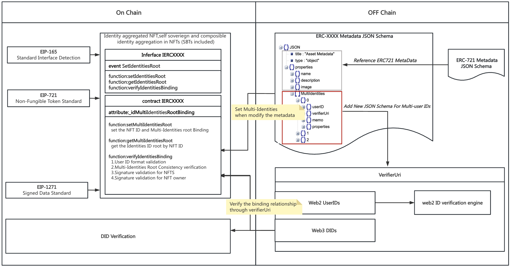

## 摘要

本标准通过将个人的 Web2 和 Web3 身份绑定到非同质化代币 (NFT) 和 soulbound 代币 (SBT)，扩展了 [ERC-721](./eip-721.md)。通过绑定多个身份，可以验证聚合和可组合的身份信息，从而为个人带来更有益的链上场景，例如自身份验证、社交重叠、通过用户定位产生商业价值等。通过在元数据中添加自定义模式，并更新和验证合约中的模式哈希，完成 NFT 和身份信息的绑定。

## 动机

Web3 最有趣的方面之一是能够将个人自己的身份带到不同的应用程序中。更强大的是，个人真正拥有他们的帐户，而无需依赖中心化的守门人，可以向不同的应用程序披露身份验证所需的组件，并获得个人的批准。
现有的解决方案（如 ENS）虽然开放、去中心化，并且对于基于以太坊的应用程序更加方便，但由于固有的匿名性，存在数据标准化和身份验证不足的问题。其他解决方案（如 SBT）依赖于中心化的证明者，无法防止数据篡改，并且无法以保护隐私的方式将数据记录到账本本身中。
该提案通过身份聚合 NFT，即个人认证的 web2 和 web3 身份（包括 SBT）聚合到 NFT，推动了解决身份问题的边界。

## 规范

本文档中的关键词“必须”、“不得”、“必需”、“应”、“不应”、“应该”、“不应该”、“推荐”、“可以”和“可选”应按照 RFC 2119 中的描述进行解释。

### 每个符合标准的合约都必须实现接口

```solidity
// SPDX-License-Identifier: CC0-1.0
pragma solidity ^0.8.15;

interface IERC7231 {

    /**
     * @notice emit the use binding information
     * @param id nft id 
     * @param identitiesRoot new identity root
     */
    event SetIdentitiesRoot(
        uint256 id,
        bytes32 identitiesRoot
    );

    /**
     * @notice 
     * @dev set the user ID binding information of NFT with identitiesRoot
     * @param id nft id 
     * @param identitiesRoot multi UserID Root data hash
     * MUST allow external calls
     */
    function setIdentitiesRoot(
        uint256 id,
        bytes32 identitiesRoot
    ) external;

    /**
     * @notice 
     * @dev get the multi-userID root by  NFTID
     * @param id nft id 
     * MUST return the bytes32 multiUserIDsRoot
     * MUST NOT modify the state
     * MUST allow external calls
     */
    function getIdentitiesRoot(
        uint256 id
    ) external returns(bytes32);

    /**
     * @notice 
     * @dev verify the userIDs binding 
    * @param id nft id 
     * @param userIDs userIDs for check
     * @param identitiesRoot msg hash to verify
     * @param signature ECDSA signature 
     * MUST If the verification is passed, return true, otherwise return false
     * MUST NOT modify the state
     * MUST allow external calls
     */
    function verifyIdentitiesBinding(
        uint256 id,address nftOwnerAddress,string[] memory userIDs,bytes32 identitiesRoot, bytes calldata signature
    ) external returns (bool);
}
```

这是上面引用的“元数据 JSON 模式”。

```json
{
  "title": "Asset Metadata",
  "type": "object",
  "properties": {
    "name": {
      "type": "string",
      "description": "Identifies the asset to which this NFT represents"
    },
    "description": {
      "type": "string",
      "description": "Describes the asset to which this NFT represents"
    },
    "image": {
      "type": "string",
      "description": "A URI pointing to a resource with mime type image"
    },
    "MultiIdentities": [
      {
        "userID": {
          "type": "string",
          "description": "User ID of Web2 and web3(DID)"
        },
        "verifierUri": {
          "type": "string",
          "description": "Verifier Uri of the userID"
        },
        "memo": {
          "type": "string",
          "description": "Memo of the userID"
        },
        "properties": {
          "type": "object",
          "description": "properties of the user ID information"
        }
      }
    ]
  }
}
```

## 理由

在设计提案时，我们考虑了本标准解决的以下问题：


1. 解决 web2 和 web3 的多重 ID 绑定问题。
通过将 MultiIdentities 模式集成到元数据文件中，可以在用户信息和 NFT 之间建立授权绑定。该模式包含一个 userID 字段，该字段可以来自各种 web2 平台或在区块链上创建的去中心化身份 (DID)。通过将 NFT ID 与 UserIDInfo 数组绑定，可以无缝地聚合多个身份。
1. 用户拥有对其数据的完全所有权和控制权
一旦用户设置了元数据，他们就可以利用 setIdentitiesRoot 函数在哈希 userIDs 对象和 NFT ID 之间建立安全绑定。由于只有用户拥有执行此绑定的权限，因此可以确保数据仅属于用户。
1. 通过基于 [ERC-1271](./eip-1271.md) 的签名，验证链上和链下数据之间的数据绑定关系
通过基于 [ERC-1271](./eip-1271.md) 协议的签名方法，本 EIP 的 verifyIdentiesBinding 函数实现了链上和链下之间 userID 和 NFT 所有者地址的绑定。
   1. NFT 所有权验证
   2. UserID 格式验证
   3. IdentitiesRoot 一致性验证
   4. 来自 nft 所有者的签名验证

至于如何验证个人身份、钱包、帐户的真实性，有多种方法，例如基于 zk 的链上 DID 身份验证和链下身份验证算法，例如 auth2、openID2 等。

## 向后兼容性

如规范部分所述，通过添加扩展函数集，此标准可以完全与 [ERC-721](./eip-721.md) 兼容。
此外，本标准中引入的新函数与 [ERC-721](./eip-721.md) 中的现有函数有很多相似之处。这使开发人员可以轻松快速地采用该标准。

## 测试用例

测试包含在 [`erc7231.ts`](../assets/eip-7231/test/erc7231.ts) 中。

要在终端中运行它们，可以使用以下命令：

```
cd ../assets/eip-7231
npm install
npx hardhat test
```

## 参考实现

`ERC7231.sol` 实现：[`ERC7231.sol`](../assets/eip-7231/contracts/ERC7231.sol)

## 安全考虑

通过自行添加或删除 NFT 和身份绑定信息，此 EIP 标准可以全面地授权个人拥有和控制其身份、钱包和相关数据。

## 版权

通过 [CC0](../LICENSE.md) 放弃版权和相关权利。