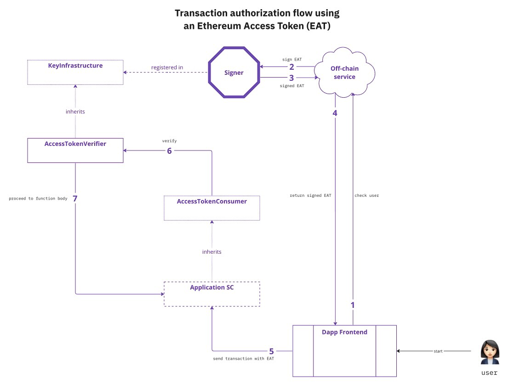

```md
---
eip: 7272
title: 以太坊访问令牌
description: 用于授权来自链下服务的函数调用的协议
author: Chris Chung (@0xpApaSmURf), Raphael Roullet (@ra-phael)
discussions-to: https://ethereum-magicians.org/t/eip-7272-ethereum-access-token/14945
status: Draft
type: Standards Track
category: ERC
created: 2023-07-03
requires: 712
---

## 摘要

以太坊访问令牌 (EAT) 是一个符合 [EIP-712](./eip-712.md) 的已签名消息，供链下服务使用，以授予以太坊账户访问特定链上资源的权限。EAT 与 JSON Web Tokens (JWT) 具有相似之处；两者都用于短期的授权。然而，以太坊访问令牌专门设计用于在链上验证，并定制用于授权智能合约函数调用。

## 动机

尽管其他提案以更狭隘的方式解决了身份验证或授权问题，但本规范允许开发人员以最小的更改为他们创建的任何函数添加一层访问控制。它最适合于最终用户应该只能通过发送交易直接访问特定的链上资源的使用场景，前提是他们事先已获得链下服务的授权。此类场景的示例包括链下验证器评估资格要求（例如，通过验证可验证凭证）来铸造代币或与需要特定合规状态的智能合约交互。
因此，本提案使链下系统能够以他们想要的任何方式对以太坊账户的控制者进行身份验证，然后再授予与该账户绑定的授权。

本规范旨在通过提供一致的机器可读消息格式来实现改进的用户体验，从而提高以太坊生态系统中的互操作性。

EAT 填补了访问控制要求与当前标准访问控制机制（基于角色的访问修饰符或检查地址是否拥有 NFT）不同的空白：

- 期望的访问是短期的
- 标准需要灵活/动态：更新授予访问权限的要求不需要对链进行任何更新
- 当不需要 Soulbound 或其他链上代币语义时。使用任何类型的“链上注册表”来授予授权会给该注册表的所有者带来始终保持其最新的负担。否则，在他们的链上状态不正确的时间段内，可能会错误地授予某人访问权限。相反，使用 EAT，用户会来请求授权，这使 EAT 颁发者有机会在授予授权之前执行一些检查并更新其记录。此外，由于当前大多数链的公开性质，完全依赖链上数据会带来隐私问题。当需要根据敏感或个人身份信息授予授权时，建议不要将该信息存储在链上并执行查找。以太坊访问令牌提供了一种替代方案，不会在链上泄露任何 PII。

## 规范

本文档中的关键词“必须 (MUST)”、“禁止 (MUST NOT)”、“必需 (REQUIRED)”、“应 (SHALL)”、“不应 (SHALL NOT)”、“应该 (SHOULD)”、“不应该 (SHOULD NOT)”、“推荐 (RECOMMENDED)”、“不推荐 (NOT RECOMMENDED)”、“可以 (MAY)”和“可选 (OPTIONAL)”应按照 RFC 2119 和 RFC 8174 中的描述进行解释。

### 概述

在 DeFi 应用程序中集成的示例流程如下：

1. 用户与 DeFi 的链下服务交互，提供足够的输入，以使链下服务能够确保用户满足其标准（例如，对用户进行身份验证和/或确保他们拥有有效的凭据）
2. 如果授予授权，则向用户颁发 EAT
3. 然后，用户在指定的时间段内与门控智能合约函数交互，并将 EAT 作为交易的一部分传递
4. EAT 在链上进行验证



以太坊访问令牌必须通过将其绑定到颁发时的特定参数来保证细粒度的访问控制。然后，链上 EAT 验证确保：

- 调用的函数是预期的函数
- 函数参数是预期的参数
- 函数调用者是预期的调用者
- 函数在授权的时间范围内被调用（即检查 EAT 是否已过期）
- 调用的智能合约是预期的合约
- 授权已由有效的颁发者给出，即 EAT 已由预期的颁发者之一签名

### 以太坊访问令牌的结构

一个以太坊访问令牌由签名和到期时间组成。

```
{
 uint8 v,
 bytes32 r,
 bytes32 s,
 uint256 expiry
}
```

签名是使用类型化结构化数据哈希和签名标准 (EIP-712) 获得的，对以下 EAT 有效负载进行签名：

```
struct AccessToken {
    uint256 expiry;
    FunctionCall functionCall;
}

struct FunctionCall {
    bytes4 functionSignature;
    address target;
    address caller;
    bytes parameters;
}
```

- **expiry**：unix 时间戳，预计在 `block.timestamp` 之前

`FunctionCall` 参数对应于以下内容：

- **functionSignature**：被调用函数的标识符，预计与 `msg.sig` 匹配
- **target**：被调用目标合约的地址
- **caller**：当前调用者的地址 - 预计与 `msg.sender` 匹配
- **parameters**：`calldata` 在剥离掉第一个参数之后，即 `v`、`r`、`s` 和 `expiry`

### EAT 验证

在链上，参考实现使用两个合约：`AccessTokenConsumer`，它被需要授予其某些函数权限的合约继承，以及 `AccessTokenVerifier`，它负责验证 EAT。

`AccessTokenConsumer` 合约调用 `AccessTokenVerifier` 以验证 EAT 的完整性。

`AccessTokenVerifier` 的 `verify()` 函数将签名和 `AccessToken` 作为输入，验证令牌是否未过期，尝试从签名和重建的 EIP-712 摘要中恢复签名者，并验证签名者是否是有效的预期签名者。

请参阅 [参考实现](../assets/eip-7272/AccessTokenVerifier.sol) 以获取如何执行此操作的示例。

## 原理

- 单次使用。参考实现保证 EAT 的不可重放性。但其他实现可能更喜欢不同的方法。

- 使用 EIP-712。通过符合 EIP-712，EAT 可以与现有的以太坊基础设施互操作，开发人员可以使用它们以最小的修改来创建访问控制。它还确保颁发的 EAT 绑定到特定的链。

- 零知识证明。使用 ZKP 会带来成本，包括增加复杂性。EAT 只不过是签名消息，更容易理解。虽然 `ecrecover` 在任何以太坊智能合约中都可以开箱即用，但 ZKP 有不同的风格，这会阻碍互操作性。

## 向后兼容性

除了特殊的 `receive` 和 `fallback` 函数之外，任何函数都可以使用 EAT 进行门控。

## 参考实现

以下是构成链上 EAT 系统的不同智能合约的参考实现：

- [IAccessTokenVerifier.sol](../assets/eip-7272/IAccessTokenVerifier.sol)
- [AccessTokenVerifier.sol](../assets/eip-7272/AccessTokenVerifier.sol)
- [AccessTokenConsumer.sol](../assets/eip-7272/AccessTokenConsumer.sol)

## 安全考虑

以太坊访问令牌 (EAT) 提案的安全性取决于以下几个因素：

### 重放攻击

该实现可能确保 EAT 在被使用后不能重复使用。这是通过在 `_consumeAccessToken` 函数中将 EAT 标记为已使用来实现的。

### 链下颁发

颁发 EAT 的链下服务的安全性至关重要，因为 EAT 门控功能的安全性取决于它。
如果此服务受到损害，恶意行为者可能会被授予 EAT，从而使他们能够访问他们不应访问的链上资源。

### 过期时间注意事项

必须明智地设置 EAT 的过期时间，以平衡可用性和安全性。如果过期时间设置得太长，可能会增加 EAT 被滥用的风险。如果时间太短，可能会影响应用程序的可用性。

## 版权

在 [CC0](../LICENSE.md) 下放弃版权及相关权利。
```