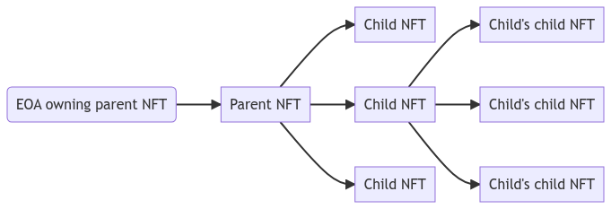
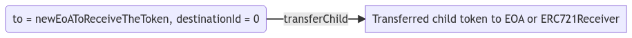
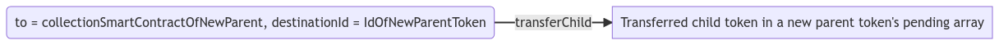

## 摘要

❗️ **[ERC-7401](./eip-7401.md) 取代 [ERC-6059](./eip-6059.md)。** ❗️

父合约管理的 NFT 嵌套标准通过允许一种新的 NFT 间关系和交互来扩展 [ERC-721](./eip-721.md)。

这项提案背后的核心思想很简单： NFT 的所有者不一定是外部拥有账户 (EOA) 或智能合约，它也可以是一个 NFT。

将一个 NFT 嵌套到另一个 NFT 中的过程在功能上与将其发送给另一个用户相同。 将代币从另一个代币中发送出去的过程涉及从拥有父代币的账户发出交易。

一个 NFT 可以由单个其他 NFT 拥有，但反过来可以拥有许多 NFT。 本提案建立了 NFT 父子关系的框架。 父代币是拥有另一个代币的代币。 子代币是由另一个代币拥有的代币。 一个代币可以同时是父代币和子代币。 给定代币的子代币可以由父代币的所有者完全管理，但可以由任何人提议。



该图示说明了子代币如何也可以是父代币，但两者仍然由根父代币的所有者管理。

## 动机

随着 NFT 成为以太坊生态系统中一种广泛的代币形式，并被用于各种用例，现在是时候标准化它们的额外效用了。 使代币能够拥有其他代币的能力可以提高效用、可用性和前向兼容性。

自从 [ERC-721](./eip-721.md) 发布以来的四年里，对额外功能的需要导致了无数的扩展。 此 ERC 在以下方面改进了 ERC-721：

- [捆绑](#bundling)
- [收集](#collecting)
- [会员资格](#membership)
- [委托](#delegation)

本提案修复了 [ERC-6059](./eip-6059.md) 接口规范中的不一致之处，其中接口 ID 与指定为接口的接口不匹配，因为接口在提案的生命周期中不断发展，但其中一个参数未添加到其中。 然而，缺少的参数存在于接口 ID 中。 除了这个修复，这个提案在功能上等同于 [ERC-6059](./eip-6059.md)。

### 捆绑

[ERC-721](./eip-721.md) 最常见的用途之一是传播与代币相关的多媒体内容。 如果有人想提供来自各种集合的 NFT 捆绑包，目前没有简单的方法将所有这些捆绑在一起并将其销售作为单个交易处理。 本提案引入了一种标准化的方法来做到这一点。 将所有代币嵌套到一个简单的捆绑包中并出售该捆绑包会将所有代币的控制权通过一次交易转移给买方。

### 收集

许多 NFT 消费者根据无数的标准来收集它们。 有些人追求代币的效用，有些追求独特性，有些追求视觉吸引力等。 没有标准化的方法来对与特定账户相关的 NFT 进行分组。 通过根据所有者的偏好嵌套 NFT，本提案引入了执行此操作的能力。 根父代币可以代表一组特定的代币，并且嵌套到其中的所有子代币都将属于它。

灵魂绑定、不可转让代币的兴起，为本提案引入了另一个需求。 拥有一个具有多个灵魂绑定特征（子代币）的代币，可以实现许多用例。 一个具体的例子可以从供应链用例中得出。 由具有自身特征的 NFT 表示的运输集装箱可以具有多个子代币，这些子代币表示其旅程的每一段。

### 会员资格

与 NFT 相关的常见效用是加入去中心化自治组织 (DAO) 或其他一些封闭访问组。 这些组织和团体中的一些组织偶尔会为会员 NFT 的当前持有者铸造 NFT。 凭借将代币嵌套铸造到代币中的能力，可以通过简单地将奖励 NFT 直接铸造到会员 NFT 中来简化这种铸造。

### 委托

DAO 的核心功能之一是投票，并且有多种方法可以实现它。 一种这样的机制是使用可替代的投票代币，成员可以通过将这些代币发送给另一个成员来委托他们的选票。 使用本提案，委托投票可以通过将您的投票 NFT 嵌套到您要委托您的投票的 NFT 中并在成员不再希望委托他们的投票时转移它来处理。

## 规范

本文档中的关键词“必须”、“禁止”、“必需”、“应”、“不应”、“应该”、“不应该”、“推荐”、“可以”和“可选”应按照 RFC 2119 中的描述进行解释。

```solidity
/// @title EIP-7401 父合约管理的非同质化代币嵌套
/// @dev See https://eips.ethereum.org/EIPS/eip-7401
/// @dev Note: the ERC-165 identifier for this interface is 0x42b0e56f.

pragma solidity ^0.8.16;

interface IERC7059 /* is ERC165 */ {
    /**
     * @notice The core struct of ownership.
     * @dev The `DirectOwner` struct is used to store information of the next immediate owner, be it the parent token,
     * an `ERC721Receiver` contract or an externally owned account.
     * @dev If the token is not owned by an NFT, the `tokenId` MUST equal `0`.
     * @param tokenId ID of the parent token
     * @param ownerAddress Address of the owner of the token. If the owner is another token, then the address MUST be
     *  the one of the parent token's collection smart contract. If the owner is externally owned account, the address
     *  MUST be the address of this account
     */
    struct DirectOwner {
        uint256 tokenId;
        address ownerAddress;
    }

    /**
     * @notice The core child token struct, holding the information about the child tokens.
     * @return tokenId ID of the child token in the child token's collection smart contract
     * @return contractAddress Address of the child token's smart contract
     */
    struct Child {
        uint256 tokenId;
        address contractAddress;
    }

    /**
     * @notice Used to notify listeners that the token is being transferred.
     * @dev Emitted when `tokenId` token is transferred from `from` to `to`.
     * @param from Address of the previous immediate owner, which is a smart contract if the token was nested.
     * @param to Address of the new immediate owner, which is a smart contract if the token is being nested.
     * @param fromTokenId ID of the previous parent token. If the token was not nested before, the value MUST be `0`
     * @param toTokenId ID of the new parent token. If the token is not being nested, the value MUST be `0`
     * @param tokenId ID of the token being transferred
     */
    event NestTransfer(
        address indexed from,
        address indexed to,
        uint256 fromTokenId,
        uint256 toTokenId,
        uint256 indexed tokenId
    );

    /**
     * @notice Used to notify listeners that a new token has been added to a given token's pending children array.
     * @dev Emitted when a child NFT is added to a token's pending array.
     * @param tokenId ID of the token that received a new pending child token
     * @param childIndex Index of the proposed child token in the parent token's pending children array
     * @param childAddress Address of the proposed child token's collection smart contract
     * @param childId ID of the child token in the child token's collection smart contract
     */
    event ChildProposed(
        uint256 indexed tokenId,
        uint256 childIndex,
        address indexed childAddress,
        uint256 indexed childId
    );

    /**
     * @notice Used to notify listeners that a new child token was accepted by the parent token.
     * @dev Emitted when a parent token accepts a token from its pending array, migrating it to the active array.
     * @param tokenId ID of the token that accepted a new child token
     * @param childIndex Index of the newly accepted child token in the parent token's active children array
     * @param childAddress Address of the child token's collection smart contract
     * @param childId ID of the child token in the child token's collection smart contract
     */
    event ChildAccepted(
        uint256 indexed tokenId,
        uint256 childIndex,
        address indexed childAddress,
        uint256 indexed childId
    );

    /**
     * @notice Used to notify listeners that all pending child tokens of a given token have been rejected.
     * @dev Emitted when a token removes all child tokens from its pending array.
     * @param tokenId ID of the token that rejected all of the pending children
     */
    event AllChildrenRejected(uint256 indexed tokenId);

    /**
     * @notice Used to notify listeners a child token has been transferred from parent token.
     * @dev Emitted when a token transfers a child from itself, transferring ownership.
     * @param tokenId ID of the token that transferred a child token
     * @param childIndex Index of a child in the array from which it is being transferred
     * @param childAddress Address of the child token's collection smart contract
     * @param childId ID of the child token in its own collection smart contract
     * @param fromPending A boolean value signifying whether the token was in the pending child tokens array (`true`) or
     *  in the active child tokens array (`false`)
     * @param toZero A boolean value signifying whether the token is being transferred to the `0x0` address (`true`) or
     *  not (`false`)
     */
    event ChildTransferred(
        uint256 indexed tokenId,
        uint256 childIndex,
        address indexed childAddress,
        uint256 indexed childId,
        bool fromPending,
        bool toZero
    );

    /**
     * @notice Used to retrieve the *root* owner of a given token.
     * @dev The *root* owner of the token is the top-level owner in the hierarchy which is not an NFT.
     * @dev If the token is owned by another NFT, it MUST recursively look up the parent's root owner.
     * @param tokenId ID of the token for which the *root* owner has been retrieved
     * @return owner The *root* owner of the token
     */
    function ownerOf(uint256 tokenId) external view returns (address owner);

    /**
     * @notice Used to retrieve the immediate owner of the given token.
     * @dev If the immediate owner is another token, the address returned, MUST be the one of the parent token's
     *  collection smart contract.
     * @param tokenId ID of the token for which the direct owner is being retrieved
     * @return address Address of the given token's owner
     * @return uint256 The ID of the parent token. MUST be `0` if the owner is not an NFT
     * @return bool The boolean value signifying whether the owner is an NFT or not
     */
    function directOwnerOf(uint256 tokenId)
        external
        view
        returns (
            address,
            uint256,
            bool
        );

    /**
     * @notice Used to burn a given token.
     * @dev When a token is burned, all of its child tokens are recursively burned as well.
     * @dev When specifying the maximum recursive burns, the execution MUST be reverted if there are more children to be
     *  burned.
     * @dev Setting the `maxRecursiveBurn` value to 0 SHOULD only attempt to burn the specified token and MUST revert if
     *  there are any child tokens present.
     * @param tokenId ID of the token to burn
     * @param maxRecursiveBurns Maximum number of tokens to recursively burn
     * @return uint256 Number of recursively burned children
     */
    function burn(uint256 tokenId, uint256 maxRecursiveBurns)
        external
        returns (uint256);

    /**
     * @notice Used to add a child token to a given parent token.
     * @dev This adds the child token into the given parent token's pending child tokens array.
     * @dev The destination token MUST NOT be a child token of the token being transferred or one of its downstream
     *  child tokens.
     * @dev This method MUST NOT be called directly. It MUST only be called from an instance of `IERC7059` as part of a 
        `nestTransfer` or `transferChild` to an NFT.
     * @dev Requirements:
     *
     *  - `directOwnerOf` on the child contract MUST resolve to the called contract.
     *  - the pending array of the parent contract MUST not be full.
     * @param parentId ID of the parent token to receive the new child token
     * @param childId ID of the new proposed child token
     */
    function addChild(uint256 parentId, uint256 childId) external;

    /**
     * @notice Used to accept a pending child token for a given parent token.
     * @dev This moves the child token from parent token's pending child tokens array into the active child tokens
     *  array.
     * @param parentId ID of the parent token for which the child token is being accepted
     * @param childIndex Index of the child token to accept in the pending children array of a given token
     * @param childAddress Address of the collection smart contract of the child token expected to be at the specified
     *  index
     * @param childId ID of the child token expected to be located at the specified index
     */
    function acceptChild(
        uint256 parentId,
        uint256 childIndex,
        address childAddress,
        uint256 childId
    ) external;

    /**
     * @notice Used to reject all pending children of a given parent token.
     * @dev Removes the children from the pending array mapping.
     * @dev The children's ownership structures are not updated.
     * @dev Requirements:
     *
     * - `parentId` MUST exist
     * @param parentId ID of the parent token for which to reject all of the pending tokens
     * @param maxRejections Maximum number of expected children to reject, used to prevent from
     *  rejecting children which arrive just before this operation.
     */
    function rejectAllChildren(uint256 parentId, uint256 maxRejections) external;

    /**
     * @notice Used to transfer a child token from a given parent token.
     * @dev MUST remove the child from the parent's active or pending children.
     * @dev When transferring a child token, the owner of the token MUST be set to `to`, or not updated in the event of `to`
     *  being the `0x0` address.
     * @param tokenId ID of the parent token from which the child token is being transferred
     * @param to Address to which to transfer the token to
     * @param destinationId ID of the token to receive this child token (MUST be 0 if the destination is not a token)
     * @param childIndex Index of a token we are transferring, in the array it belongs to (can be either active array or
     *  pending array)
     * @param childAddress Address of the child token's collection smart contract
     * @param childId ID of the child token in its own collection smart contract
     * @param isPending A boolean value indicating whether the child token being transferred is in the pending array of the
     *  parent token (`true`) or in the active array (`false`)
     * @param data Additional data with no specified format, sent in call to `to`
     */
    function transferChild(
        uint256 tokenId,
        address to,
        uint256 destinationId,
        uint256 childIndex,
        address childAddress,
        uint256 childId,
        bool isPending,
        bytes data
    ) external;

    /**
     * @notice Used to retrieve the active child tokens of a given parent token.
     * @dev Returns array of Child structs existing for parent token.
     * @dev The Child struct consists of the following values:
     *  [
     *      tokenId,
     *      contractAddress
     *  ]
     * @param parentId ID of the parent token for which to retrieve the active child tokens
     * @return struct[] An array of Child structs containing the parent token's active child tokens
     */
    function childrenOf(uint256 parentId)
        external
        view
        returns (Child[] memory);

    /**
     * @notice Used to retrieve the pending child tokens of a given parent token.
     * @dev Returns array of pending Child structs existing for given parent.
     * @dev The Child struct consists of the following values:
     *  [
     *      tokenId,
     *      contractAddress
     *  ]
     * @param parentId ID of the parent token for which to retrieve the pending child tokens
     * @return struct[] An array of Child structs containing the parent token's pending child tokens
     */
    function pendingChildrenOf(uint256 parentId)
        external
        view
        returns (Child[] memory);

    /**
     * @notice Used to retrieve a specific active child token for a given parent token.
     * @dev Returns a single Child struct locating at `index` of parent token's active child tokens array.
     * @dev The Child struct consists of the following values:
     *  [
     *      tokenId,
     *      contractAddress
     *  ]
     * @param parentId ID of the parent token for which the child is being retrieved
     * @param index Index of the child token in the parent token's active child tokens array
     * @return struct A Child struct containing data about the specified child
     */
    function childOf(uint256 parentId, uint256 index)
        external
        view
        returns (Child memory);

    /**
     * @notice Used to retrieve a specific pending child token from a given parent token.
     * @dev Returns a single Child struct locating at `index` of parent token's active child tokens array.
     * @dev The Child struct consists of the following values:
     *  [
     *      tokenId,
     *      contractAddress
     *  ]
     * @param parentId ID of the parent token for which the pending child token is being retrieved
     * @param index Index of the child token in the parent token's pending child tokens array
     * @return struct A Child struct containing data about the specified child
     */
    function pendingChildOf(uint256 parentId, uint256 index)
        external
        view
        returns (Child memory);

    /**
     * @notice Used to transfer the token into another token.
     * @dev The destination token MUST NOT be a child token of the token being transferred or one of its downstream
     *  child tokens.
     * @param from Address of the direct owner of the token to be transferred
     * @param to Address of the receiving token's collection smart contract
     * @param tokenId ID of the token being transferred
     * @param destinationId ID of the token to receive the token being transferred
     * @param data Additional data with no specified format
     */
    function nestTransferFrom(
        address from,
        address to,
        uint256 tokenId,
        uint256 destinationId,
        bytes memory data
    ) external;
}
```

ID 决不能为 `0` 值，因为本提案使用 `0` 值来表示代币/目的地不是 NFT。

## 原理

在设计提案时，我们考虑了以下问题：

1. **如何命名提案？**\
为了提供尽可能多的关于提案的信息，我们确定了提案的最重要方面； 以父节点为中心的嵌套控制。 子代币的作用只是能够 `Nestable` 并支持拥有它的代币。 这就是我们最终确定标题的 `以父节点为中心` 部分的方式。
2. **为什么使用 [EIP-712](./eip-712.md) 许可风格签名自动接受子代币不属于本提案的一部分？**\
为了保持一致性。 本提案扩展了 ERC-721，它已经使用 1 个交易来批准代币的操作。 同时支持资产操作的消息签名将是不一致的。
3. **为什么使用索引？**\
为了减少 Gas 消耗。 如果使用代币 ID 查找要接受或拒绝的代币，则需要迭代数组，并且操作的成本将取决于活动或待处理子节点的数组大小。 使用索引，成本是固定的。 需要维护每个代币的活动和待处理子节点的列表，因为获取它们的方法是所提议接口的一部分。\
为了避免代币索引发生变化的竞争条件，需要代币索引的操作中包括预期的代币 ID 以及预期的代币集合智能合约，以验证使用索引访问的代币是否是预期的代币。\
已经尝试了在内部使用映射跟踪索引的实现。 接受子代币的最低成本增加了 20% 以上，铸造的成本增加了 15% 以上。 我们得出结论，对于本提案来说，这不是必需的，可以作为一种扩展来实现，用于愿意接受由此产生的交易成本增加的用例。 在提供的示例实现中，有几个 Hook 使这成为可能。
4. **为什么待处理的子节点数组受到限制，而不是支持分页？**\
待处理的子代币数组不应该是收集父代币的根所有者想要保留的代币的缓冲区，但不足以将它们提升为活动子代币。 它应该是子代币候选者的易于遍历的列表，并且应该定期维护； 通过接受或拒绝提议的子代币。 待处理的子代币数组也不需要是不受限制的，因为活动子代币数组是。\
拥有受限制的子代币数组的另一个好处是防止垃圾邮件和恶意行为。 由于铸造恶意或垃圾邮件代币可能相对容易且成本较低，因此受限制的待处理数组可确保其中的所有代币易于识别，并且如果发生垃圾邮件洪流，合法的代币不会丢失在垃圾邮件中。\
与此问题相关的一个考虑因素是如何确保在清除待处理子代币数组时不会意外拒绝合法的代币。 我们将最大待处理子节点添加到清除待处理子节点数组调用的参数中以拒绝参数。 这确保了仅拒绝了预期数量的待处理子代币，并且如果在准备此类调用并执行它期间将新代币添加到待处理子代币数组，则清除此数组应该导致交易回滚。
5. **我们是否应该允许将代币嵌套到它的一个子代币中？**\
该提案强制执行父代币不能嵌套到它的一个子代币或其下游子代币中。 父代币及其子代币都由父代币的根所有者管理。 这意味着如果一个代币被嵌套到它的一个子代币中，这将创建一个所有权循环，并且循环中的任何代币都无法再被管理。
6. **为什么没有“安全”嵌套传输方法？**\
`nestTransfer` 始终是“安全的”，因为它必须检查目标上的 `IERC7059` 兼容性。
7. **本提案与其他试图解决类似问题的提案有何不同？**\
此接口允许代币被发送到其他代币并接收其他代币。 提议-接受和父代币管理的模式允许更安全的使用。 仅为 ERC-721 添加了向后兼容性，从而允许更简单的接口。 该提案还允许不同的集合互操作，这意味着嵌套不锁定到单个智能合约，但可以在完全独立的 NFT 集合之间执行。\
此外，本提案解决了 [ERC-6059](./eip-6059.md) 的 `interfaceId`、接口规范和示例实现之间的不一致之处。

### 用于子代币管理的提议-提交模式

将子代币添加到父代币必须以提议-提交模式的形式完成，以允许第三方进行有限的可变性。 当将子代币添加到父代币时，它首先被放置在一个 `Pending` 数组中，并且必须由父代币的根所有者迁移到 `Active` 数组中。 `Pending` 子代币数组应限制为 128 个插槽，以防止垃圾邮件和恶意行为。

只有根所有者可以接受子代币的限制也为提案引入了信任固有的。 这确保了代币的根所有者对代币拥有完全的控制权。 没有人可以强迫用户接受他们不想要的子项。

### 父代币管理模式

嵌套代币的父 NFT 和父代币的根所有者在所有方面都是它的真正所有者。 一旦您将代币发送给另一个代币，您就放弃了所有权。

我们继续使用 ERC-721 的 `ownerOf` 功能，它现在将递归地查找父代币，直到找到一个不是 NFT 的地址，这被称为 *根所有者*。 此外，我们提供 `directOwnerOf`，它使用 3 个值返回代币的最直接所有者：所有者地址、如果直接所有者不是 NFT，则必须为 0 的 tokenId 以及指示父代币是否是 NFT 的标志。

根所有者或批准的方必须能够在子代币上执行以下操作： `acceptChild`、`rejectAllChildren` 和 `transferChild`。

仅当代币不是由 NFT 拥有时，才允许根所有者或批准的方执行这些操作： `transferFrom`、`safeTransferFrom`、`nestTransferFrom`、`burn`。

如果代币由 NFT 拥有，则仅允许父 NFT 本身执行上面列出的操作。 转移必须从父代币完成，使用 `transferChild`，反过来，如果目的地不是 NFT，则此方法应在子代币的智能合约中调用 `nestTransferFrom` 或 `safeTransferFrom`。 对于燃烧，必须首先将代币转移到 EOA，然后燃烧。

我们添加此限制是为了防止父合约出现不一致，因为只有 `transferChild` 方法才能在子代币从父合约中转移出来时将其从父合约中移除。

### 子代币管理

本提案引入了许多子代币管理功能。 除了从 `Pending` 到 `Active` 子代币数组的许可迁移之外，本提案的主要代币管理功能是 `transferChild` 函数。 通过它可以实现子代币以下状态转换：

1. 拒绝子代币
2. 放弃子代币
3. 取消嵌套子代币
4. 将子代币转移到 EOA 或 `ERC721Receiver`
5. 将子代币转移到新的父代币

为了更好地理解如何实现这些状态转换，我们必须查看传递给 `transferChild` 的可用参数：

```solidity
    function transferChild(
        uint256 tokenId,
        address to,
        uint256 destinationId,
        uint256 childIndex,
        address childAddress,
        uint256 childId,
        bool isPending,
        bytes data
    ) external;
```

根据所需的状态转换，必须相应地设置这些参数的值（以下示例中未设置的任何参数都取决于正在管理的子代币）：

1. **拒绝子代币**\

2. **放弃子代币**\

3. **取消嵌套子代币**\

4. **将子代币转移到 EOA 或 `ERC721Receiver`**\

5. **将子代币转移到新的父代币**\
\
此状态更改将代币放置在新父代币的待处理数组中。 子代币仍然需要由新父代币的根所有者接受，才能放置到该代币的活动数组中。

## 向后兼容性

可嵌套代币标准已与 [ERC-721](./eip-721.md) 兼容，以便利用可用于 ERC-721 实现的强大的工具，并确保与现有 ERC-721 基础设施的兼容性。

与 ERC-721 的唯一不兼容之处在于，可嵌套代币不能使用代币 ID 0。

与 ERC-721 相比，`ownerOf` 方法的行为方式有所不同。 `ownerOf` 方法现在将递归地查找父代币，直到找到一个不是 NFT 的地址； 这被称为 *根所有者*。 此外，我们提供 `directOwnerOf`，它使用 3 个值返回代币的最直接所有者：所有者地址、如果直接所有者不是 NFT，则必须为 0 的 `tokenId` 以及指示父代币是否是 NFT 的标志。 如果代币由 EoA 或者 ERC-721 接收器拥有，则 `ownerOf` 方法的行为将与 ERC-721 中的相同。

## 测试用例

测试包含在 [`nestable.ts`](../assets/eip-7401/test/nestable.ts) 中。

要在终端中运行它们，您可以使用以下命令：

```
cd ../assets/eip-7401
npm install
npx hardhat test
```

## 参考实现

请参阅 [`NestableToken.sol`](../assets/eip-7401/contracts/NestableToken.sol)。

## 安全注意事项

与 [ERC-721](./eip-721.md) 相同的安全注意事项适用：隐藏的逻辑可能存在于任何函数中，包括燃烧、添加子节点、接受子节点等等。

由于允许代币的当前所有者管理代币，因此在父代币被列出出售后，卖家可能会在出售之前移除子代币，因此买家将无法收到预期的子代币。 这是本标准设计固有的风险。 市场应该考虑到这一点，并提供一种方法来验证出售父代币时是否存在预期的子代币，或者以另一种方式防止这种恶意行为。

值得注意的是，`balanceOf` 方法仅考虑地址拥有的直接代币数据； 嵌套到此地址拥有的代币中的代币将不会反映在此值中，因为计算此值所需的递归查找可能太深并且可能会破坏该方法。

建议在处理未经审计的合约时要谨慎。

## 版权

通过 [CC0](../LICENSE.md) 放弃版权及相关权利。