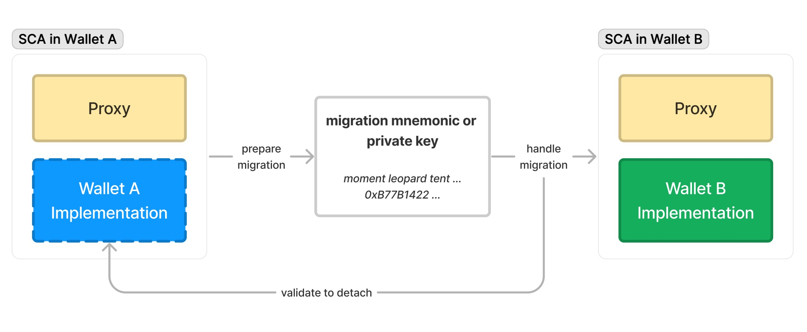

## 摘要

便携式智能合约账户（PSCA）解决了不同钱包提供商的智能合约账户（SCA）所面临的缺乏可移植性和兼容性的问题。基于 [ERC-1967](./eip-1967.md)，PSCA 系统允许用户使用新的、随机生成的迁移密钥轻松地在不同钱包之间迁移他们的 SCA。这提供了类似于使用私钥或助记词导出外部拥有账户（EOA）的体验。该系统通过采用签名和时间锁来确保安全性，允许用户在锁定期间验证和取消迁移操作，从而防止潜在的恶意行为。PSCA 提供了一种非侵入式且经济高效的方法，增强了账户抽象（AA）生态系统内的互操作性和可组合性。

## 动机

随着 [ERC-4337](./eip-4337.md) 标准的引入，AA 相关的基础设施和 SCA 已在社区中得到广泛采用。然而，与 EOA 不同，SCA 具有更多样化的代码空间，导致不同钱包提供商之间的合约实现各不相同。因此，SCA 缺乏可移植性已成为一个重要问题，使得用户难以在不同的钱包提供商之间迁移他们的账户。虽然有些人提出了 SCA 账户的模块化方法，但它带来了更高的实施成本和对钱包实现的特定先决条件。

考虑到不同的钱包提供商倾向于偏爱他们自己的实现，或者可能期望他们的合约系统简洁而强大，因此模块化系统可能不具有普遍适用性。社区目前缺乏更通用的 SCA 迁移标准。

本提案描述了一个在代理（ERC-1967）层工作的解决方案，提供类似于导出 EOA 账户（使用私钥或助记词）的用户体验。通用 SCA 迁移机制如下图所示：



考虑到不同的钱包提供商可能有他们自己的实现，此解决方案对 SCA 实现几乎没有要求，使其更具普遍适用性，更少侵入性，并降低运营成本。与在“实现”层运行的模块化系统不同，这两种方法可以相互补充，从而进一步提高 AA 生态系统的互操作性和可组合性。

## 规范

本文档中的关键词“必须”、“禁止”、“必需”、“应”、“不应”、“应该”、“不应该”、“推荐”、“可以”和“可选”应按照 RFC 2119 中的描述进行解释。

### 术语

- 钱包提供商：提供钱包服务的服务提供商。钱包提供商之间的 SCA 实现通常是不同的，彼此缺乏兼容性。
- 随机操作员：用于每次迁移的新的、随机生成的迁移助记词或私钥。其公钥对应的地址是随机操作员的地址。
    - 如果使用助记词，则派生的迁移私钥遵循 [BIP 44](https://github.com/bitcoin/bips/blob/55566a73f9ddf77b4512aca8e628650c913067bf/bip-0044.mediawiki) 规范，路径为 **`m/44'/60'/0'/0/0'`**。

### 接口

便携式智能合约账户**必须**实现 **`IERC7405`** 接口：

```solidity
interface IERC7405 {
    /**
     * @dev 当账户完成迁移时发出
     * @param oldImplementation 旧实现地址
     * @param newImplementation 新实现地址
     */
    event AccountMigrated(
        address oldImplementation,
        address newImplementation
    );
    
    /**
     * @dev 准备账户进行迁移
     * @param randomOperator 随机操作员的公钥（地址格式）
     * @param signature 随机操作员签署的签名
     *
     * **必须**检查账户的真实性
     */
    function prepareAccountMigration(
        address randomOperator,
        bytes calldata signature
    ) external;

    /**
     * @dev 取消账户迁移
     *
     * **必须**检查账户的真实性
     */
    function cancelAccountMigration() external;

    /**
     * @dev 处理账户迁移
     * @param newImplementation 新实现地址
     * @param initData 新实现的初始化数据
     * @param signature 随机操作员签署的签名
     *
     * **不得**检查真实性，以使其可被新实现访问
     */
    function handleAccountMigration(
        address newImplementation,
        bytes calldata initData,
        bytes calldata signature
    ) external;
}
```

### 签名

迁移操作的执行**必须**使用迁移私钥签署 `MigrationOp`。

```solidity
struct MigrationOp {
    uint256 chainID;
    bytes4 selector;
    bytes data;
}
```

当 **`selector`** 对应于 **`prepareAccountMigration(address,bytes)`**（即，**`0x50fe70bd`**）时，**`data`** 为 **`abi.encode(randomOperator)`**。当 **`selector`** 对应于 **`handleAccountMigration(address,bytes,bytes)`**（即，**`0xae2828ba`**）时，**`data`** 为 **`abi.encode(randomOperator, setupCalldata)`**。

签名是使用 **[ERC-191](./eip-191.md)** 创建的，签署 **`MigrateOpHash`**（计算为 **`abi.encode(chainID, selector, data)`**）。

### 注册表

为了简化迁移凭据并仅使用迁移助记词或私钥就能直接寻址 SCA 账户，本提案要求在协议层部署一个共享注册表。

```solidity
interface IERC7405Registry {
    struct MigrationData {
        address account;
        uint48 createTime;
        uint48 lockUntil;
    }

    /**
     * @dev 检查随机操作员的迁移数据是否存在
     * @param randomOperator 随机操作员的公钥（地址格式）
     */
    function migrationDataExists(
        address randomOperator
    ) external returns (bool);

    /**
     * @dev 获取随机操作员的迁移数据
     * @param randomOperator 随机操作员的公钥（地址格式）
     */
    function getMigrationData(
        address randomOperator
    ) external returns (MigrationData memory);

    /**
     * @dev 设置随机操作员的迁移数据
     * @param randomOperator 随机操作员的公钥（地址格式）
     * @param lockUntil 账户锁定以进行迁移的时间戳
     *
     * **必须**验证 `migrationDataMap[randomOperator]` 是否为空
     */
    function setMigrationData(
        address randomOperator,
        uint48 lockUntil
    ) external;

    /**
     * @dev 删除随机操作员的迁移数据
     * @param randomOperator 随机操作员的公钥（地址格式）
     *
     * **必须**验证 `migrationDataMap[randomOperator].account` 是否为 `msg.sender`
     */
    function deleteMigrationData(address randomOperator) external;
}
```

### 预期行为

当执行账户迁移时（即将 SCA 从钱包 A 迁移到钱包 B），**必须**遵循以下步骤：

1. 钱包 A 生成一个新的迁移助记词或私钥（**必须**是新的和随机的）并将其提供给用户。其公钥对应的地址用作 **`randomOperator`**。
2. 钱包 A 使用迁移私钥签署 **`MigrateOpHash`** 并调用 **`prepareAccountMigration`** 方法，该方法**必须**执行以下操作：
    - 调用内部方法 **`_requireAccountAuth()`** 以验证 SCA 账户的真实性。例如，在 ERC-4337 账户实现中，它可能需要 **`msg.sender == address(entryPoint)`**。
    - 执行签名检查以确认 **`randomOperator`** 的有效性。
    - 调用 **`IERC7405Registry.migrationDataExists(randomOperator)`** 以确保 **`randomOperator`** 尚不存在。
    - 将 SCA 账户的锁定状态设置为 true，并通过调用 **`IERC7405Registry.setMigrationData(randomOperator, lockUntil)`** 添加记录。
    - 在调用 **`prepareAccountMigration`** 之后，账户将保持锁定状态，直到成功调用 **`cancelAccountMigration`** 或 **`handleAccountMigration`**。
3. 为了继续迁移，钱包 B 初始化身份验证数据并导入迁移助记词或私钥。然后，钱包 B 使用迁移私钥签署 **`MigrateOpHash`** 并调用 **`handleWalletMigration`** 方法，该方法**必须**执行以下操作：
    - **不得**执行 SCA 账户身份验证检查以确保公共可访问性。
    - 执行签名检查以确认 **`randomOperator`** 的有效性。
    - 调用 **`IERC7405Registry.getMigrationData(randomOperator)`** 以检索 **`migrationData`**，并要求 **`require(migrationData.account == address(this) && block.timestamp > migrationData.lockUntil)`**。
    - 调用内部方法 **`_beforeWalletMigration()`** 以执行来自钱包 A 的迁移前逻辑（例如，数据清理）。
    - 将代理（ERC-1967）实现修改为钱包 B 的实现合约。
    - 调用 **`address(this).call(initData)`** 以初始化钱包 B 合约。
    - 调用 **`IERC7405Registry.deleteMigrationData(randomOperator)`** 以删除记录。
    - 发出 **`AccountMigrated`** 事件。
4. 如果需要取消迁移，钱包 A 可以调用 **`cancelAccountMigration`** 方法，该方法**必须**执行以下操作：
    - 调用内部方法 **`_requireAccountAuth()`** 以验证 SCA 账户的真实性。
    - 将 SCA 账户的锁定状态设置为 false，并通过调用 **`IERC7405Registry.deleteMigrationData(randomOperator)`** 删除记录。

### 存储布局

为了防止在不同钱包实现之间迁移时发生存储布局冲突，便携式智能合约账户实现合约：

- **不得**在合约头中直接定义状态变量。
- **必须**将所有状态变量封装在一个结构体中，并将该结构体存储在特定插槽中。该插槽索引**应该**在不同的钱包实现中是唯一的。

对于插槽索引，我们建议根据命名空间和插槽 ID 进行计算：

- 命名空间**必须**仅包含 [A-Za-z0-9_]。
- 钱包提供商的命名空间**推荐**使用 snake_case，包含钱包名称和主版本号，例如 **`foo_wallet_v1`**。
- 插槽索引的插槽 ID **应该**遵循格式 **`{namespace}.{customDomain}`**，例如 **`foo_wallet_v1.config`**。
- 插槽索引的计算方式为 **`bytes32(uint256(keccak256(slotID) - 1))`**。

## 理由

本 EIP 解决的主要挑战是智能合约账户（SCA）缺乏可移植性。目前，由于不同钱包提供商的 SCA 实现各不相同，因此在钱包之间迁移非常麻烦。虽然提出模块化方法在某些方面是有益的，但它也有其自身的成本和兼容性问题。

PSCA 系统基于 ERC-1967，引入了一种类似于使用私钥或助记词导出 EOA 的迁移机制。选择这种方法是因为用户对其熟悉，从而确保了更流畅的用户体验。

采用随机的、特定于迁移的密钥进一步加强了安全性。通过模仿 EOA 导出过程，我们的目标是使该过程易于识别，同时解决 SCA 可移植性的独特挑战。

在协议层与共享注册表集成可以简化迁移凭据。该系统仅使用迁移密钥即可直接寻址 SCA 账户，从而提高了效率。

存储布局的考虑对于避免迁移期间的冲突至关重要。将状态变量封装在存储在唯一插槽中的结构体中，可确保迁移不会导致存储重叠或覆盖。

## 向后兼容性

本提案与所有基于 ERC-1967 代理的 SCA 向后兼容，包括非 ERC-4337 SCA。 此外，本提案对 SCA 实现合约没有特定的先决条件，使其广泛适用于各种 SCA。

<!--
## 参考实现

[WIP]
-->

## 安全考虑

- 每次迁移都必须生成一个新的、随机生成的迁移助记词或私钥及其对应的随机操作员地址，以防止重放攻击或恶意签名。
- 不同的钱包实现必须考虑存储布局的独立性，以避免迁移后发生存储冲突。
- 为了防止由于恶意迁移导致账户所有者立即失去访问权限，我们引入了“时间锁”以使迁移可检测和可逆。 当恶意操作尝试立即迁移 SCA 时，账户将进入锁定状态并等待锁定期限。 在此期间，用户可以使用原始账户身份验证来取消迁移并防止资产损失。 处于锁定状态的账户**不应**允许以下操作：
    - 任何形式的资产转移操作
    - 任何形式的外部合约调用操作
    - 任何试图修改账户身份验证因素的操作
    - 任何可能影响上述三项的操作
- 执行迁移操作时，钱包提供商**应该**尝试通过所有可用的消息传递渠道将迁移详细信息通知账户所有者。

## 版权

在 **[CC0](../LICENSE.md)** 下放弃版权及相关权利。
