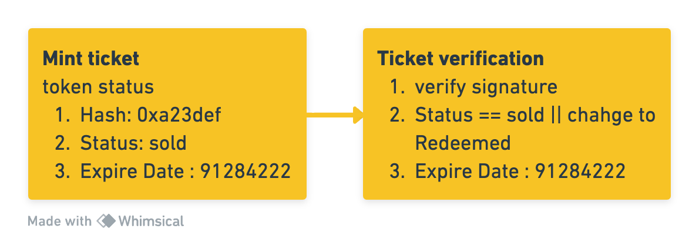
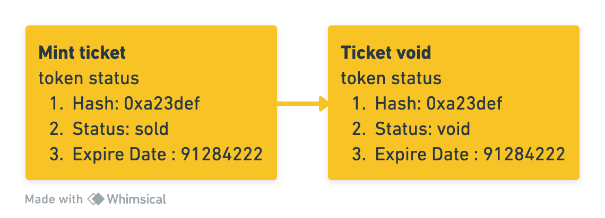
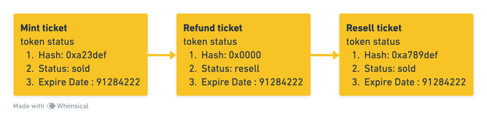

## 摘要

该标准是 [ERC-721](./eip-721.md) 的扩展，并定义了标准函数，概述了票务代理或活动组织者采取预防措施以阻止观众在倒卖门票市场中被剥削，并允许客户通过授权的门票经销商转售其门票的范围。

## 动机

工业规模的倒卖门票一直是一个长期存在的问题，与其相关的欺诈和犯罪问题导致了不幸的事件和社会资源的浪费。它也极大地损害了各个职业阶段的艺术家以及相关的业务。尽管各国政府已经开始立法限制黄牛的行为，但效果有限。他们仍然出售禁止转售的活动的门票，或者尚未拥有这些门票，然后通过投机销售获得大量的非法利润。我们咨询了许多意见，以提供一个对消费者友好的转售界面，使买家能够以最初支付的价格或更低的价格转售或重新分配门票，这是打击“二级票务”的有效方式，并使票务代理能够利用。

典型的门票可能是一张“纸”甚至是你电子邮件收件箱中的凭证，这使得伪造或流通很容易。为了限制这些门票的转让性，我们设计了一种机制，禁止所有方（包括门票所有者）转让门票，除非是授权转让门票的特定账户。这些特定账户可以是票务代理、经理、推广者和授权的转售平台。因此，黄牛无法随意转让门票。此外，为了增强功能，我们为每张门票实现了 token 信息模式，允许只有授权账户（不包括所有者）修改这些记录。

该标准定义了一个框架，使票务代理能够利用 [ERC-721](./eip-721.md) token 作为活动门票，并限制 token 的转让性，以防止倒卖门票。通过实施该标准，我们旨在保护客户免受诈骗和欺诈活动的影响。

## 规范

本文档中的关键词“MUST”、“MUST NOT”、“REQUIRED”、“SHALL”、“SHALL NOT”、“SHOULD”、“SHOULD NOT”、“RECOMMENDED”、“NOT RECOMMENDED”、“MAY”和“OPTIONAL”应按照 RFC 2119 和 RFC 8174 中的描述进行解释。

### 接口

此处引用的接口和结构如下：

* TokenInfo
    * `signature`: 建议适配器使用用户的私钥或代理的私钥自行定义要签名的内容，以证明 token 的有效性。
    * `status`: 表示 token 当前状态。
    * `expireTime`: 建议设置为事件到期时间。
* TokenStatus
    * `Sold`: 当 token 被售出时，它必须更改为 `Sold`。该 token 在此状态下有效。
    * `Resell`: 当 token 在二级市场时，它必须更改为 Resell。该 token 在此状态下有效。
    * `Void`: 当 token 所有者从事非法交易时，token 状态必须设置为 Void，并且该 token 在此状态下无效。
    * `Redeemed`: 当 token 被使用时，建议将 token 状态更改为 `Redeemed`。

```solidity
/// @title IERC7439 Prevent Ticket Touting Interface
// / @title IERC7439 防止倒卖门票接口
interface IERC7439 /* is ERC721 */ {
    /// @dev TokenStatus represent the token current status, only specific role can change status
    // / @dev TokenStatus 表示 token 当前状态，只有特定角色可以更改状态
    enum TokenStatus {
        Sold,    // 0
        Resell,  // 1
        Void,    // 2
        Redeemed // 3
    }

    /// @param signature Data signed by user's private key or agent's private key
    // / @param signature 由用户的私钥或代理的私钥签名的数据
    /// @param tokenStatus Token status changing to
    // / @param tokenStatus 要更改为的 token 状态
    /// @param expireTime Event due time
    // / @param expireTime 活动到期时间
    struct TokenInfo {
        bytes signature;
        TokenStatus tokenStatus;
        uint256 expireTime;
    }

    /// @notice Used to notify listeners that the token with the specified ID has been changed status
    // / @notice 用于通知监听器，具有指定 ID 的 token 状态已更改
    /// @param tokenId The token has been changed status
    // / @param tokenId 已更改状态的 token
    /// @param tokenStatus Token status has been changed to
    // / @param tokenStatus 已更改为的 token 状态
    /// @param signature Data signed by user's private key or agent's private key
    // / @param signature 由用户的私钥或代理的私钥签名的数据
    event TokenStatusChanged(
        uint256 indexed tokenId,
        TokenStatus indexed tokenStatus,
        bytes signature
    );

    /// @notice Used to mint token with token status
    // / @notice 用于使用 token 状态来铸造 token
    /// @dev MUST emit the `TokenStatusChanged` event if the token status is changed.
    // / @dev 如果 token 状态已更改，则必须发出 `TokenStatusChanged` 事件。
    /// @param to The receiptent of token
    // / @param to token 的接收者
    /// @param signature Data signed by user's private key or agent's private key
    // / @param signature 由用户的私钥或代理的私钥签名的数据
    function safeMint(address to, bytes memory signature) external;

    /// @notice Used to change token status and can only be invoked by a specific role
    // / @notice 用于更改 token 状态，并且只能由特定角色调用
    /// @dev MUST emit the `TokenStatusChanged` event if the token status is changed.
    // / @dev 如果 token 状态已更改，则必须发出 `TokenStatusChanged` 事件。
    /// @param tokenId The token need to change status
    // / @param tokenId 需要更改状态的 token
    /// @param signature Data signed by user's private key or agent's private key
    // / @param signature 由用户的私钥或代理的私钥签名的数据
    /// @param tokenStatus Token status changing to
    // / @param tokenStatus 要更改为的 token 状态
    /// @param newExpireTime New event due time
    // / @param newExpireTime 新的活动到期时间
    function changeState(
        uint256 tokenId,
        bytes memory signature,
        TokenStatus tokenStatus,
        uint256 newExpireTime
    ) external;
}
```
当使用 `0x15fbb306` 调用 `supportsInterface` 方法时，必须返回 `true`。

## 理由

在设计提案时，我们考虑了以下问题：
1. 对于票务代理、表演者和观众来说，什么是最重要的？
   * 对于票务公司来说，售罄所有门票至关重要。有时，为了营造活跃的销售环境，票务公司甚至可能与黄牛合作。这种做法可能对观众和表演者都不利。为了防止这种情况发生，必须有一个开放和透明的主要销售渠道，以及一个公平的二级销售机制。在 `safeMint` 函数（这是一个公共函数）中，我们希望每个人都可以通过他们自己按照列表价格透明地铸造门票。那时，`TokenInfo` 会添加一个签名，该签名只有买方帐户或代理才能根据相应的机制来解析，以证明门票的有效性。并且 token 的 `status` 为 `Sold`。尽管如此，我们还必须考虑票务公司面临的压力。他们的目标是最大化每张有效门票的效用，这意味着售罄每一张。在传统机制中，票务公司仅从初始销售中获利，这意味着他们无法享受二级销售带来的超额利润。因此，我们设计了一个票务公司可以管理的二级销售流程。在 `_beforeTokenTransfer()` 函数中，您可以看到它是一个访问控制函数，只有 `PARTNER_ROLE` `mint` 或 `burn` 的情况才能转移门票。`PARTNER_ROLE` 可以是票务代理或合法的二级票务销售平台，这可能是国家监管机构或票务代理指定的平台。为了维持公平的票务市场，我们不能允许他们自己转移门票，因为我们无法区分买家是否是黄牛。
  
   * 对于表演者或活动举办者来说，他们不愿意在售票期间看到负面消息。一个顺利的售票过程或是没有可能损害他们表演者声誉的消息是他们想要的。除此之外，真正重要的是所有到场的观众的真正粉丝。最终落入黄牛手中或进入混乱的二级市场的门票实际上对真正的粉丝没有吸引力。我们相信表演者不会对这种情况感到满意。通过这种透明化的机制，表演者或活动举办者可以随时通过 token 铸造数量和 `TokenInfo`-`TokenStatus` 的交叉比较来控制真实的销售状态。
        ```
        enum TokenStatus {
            Sold,    // 0
            Resell,  // 1
            Void,    // 2
            Redeemed // 3
        }
        ```
   * 对于观众来说，他们唯一需要的就是获得一张有效的门票。在传统机制中，粉丝会遇到很多障碍。在热门演唱会上，想要抢票的粉丝可能会遇到一些敌人，比如黄牛和票务公司。这些黄牛就像专业人士一样，在抢票方面都很有组织和策略。令人惊讶的是，票务公司实际上可能会与这些黄牛合作。或者，他们可能只是自己保留一堆免费赠品或 VIP 门票。透明的机制对于观众来说同样重要。

2. 如何建立一个健康的票务生态系统？
   * 清晰的票务规则是确保供需保持平衡的关键。

   * 开放的定价系统是确保消费者得到保护的必要条件。
 
   * 卓越的流动性。在初始市场中，用户可以自己铸造门票。如果需要，购买的门票也可以在透明和开放的二级市场中转让。在初始销售期间没有购买门票的观众也可以放心地在合法的二级市场购买门票。`changeState` 函数是为了帮助门票拥有良好的流动性。只有 `PARTNER_ROLE` 可以更改门票状态。一旦售出的门票需要在二级市场出售，就需要要求二级市场帮助将其更改为转售状态。更改状态的过程是对二手门票的一种官方验证。这是一种保护二手买家的机制。

3. 如何设计一个顺利的票务流程？
   * 易于买/卖。观众可以像铸造 NFT 一样购买门票。这是一种众所周知的做法。
   
   * 易于退款。当发生一些极端情况并且您需要取消演出时，处理门票退款可能是一个简单的过程。
 
   * 易于兑换。在演出之前，票务代理可以通过签名验证门票，以确认观众是否是真实的。`TokenStatus` 需要等于 `sold`，并且 `expireTime` 可以区分观众是否已到达正确的场次。验证通过后，票务代理可以将 `TokenStatus` 更改为 `Redeemed`。
   
   * 正常流程
        

   * 无效流程
        

   * 转售流程
        

## 向后兼容性

该标准与 [ERC-721](./eip-721.md) 兼容。

## 测试用例

```javascript
const { expectRevert } = require("@openzeppelin/test-helpers");
const { expect } = require("chai");
const ERC7439 = artifacts.require("ERC7439");

contract("ERC7439", (accounts) => {
  const [deployer, partner, userA, userB] = accounts;
  const expireTime = 19999999;
  const tokenId = 0;
  const signature = "0x993dab3dd91f5c6dc28e17439be475478f5635c92a56e17e82349d3fb2f166196f466c0b4e0c146f285204f0dcb13e5ae67bc33f4b888ec32dfe0a063e8f3f781b"
  const zeroHash = "0x";

  beforeEach(async () => {
    this.erc7439 = await ERC7439.new({
      from: deployer,
    });
    await this.erc7439.mint(userA, signature, { from: deployer });
  });

  it("Should mint a token", async () => {
    const tokenInfo = await this.erc7439.tokenInfo(tokenId);

    expect(await this.erc7439.ownerOf(tokenId)).to.equal(userA);
    expect(tokenInfo.signature).equal(signature);
    expect(tokenInfo.status).equal("0"); // Sold
    expect(tokenInfo.expireTime).equal(expireTime);
  });

  it("should ordinary users cannot transfer successfully", async () => {
    expectRevert(await this.erc7439.transferFrom(userA, userB, tokenId, { from: userA }), "ERC7439: You cannot transfer this NFT!");
  });

  it("should partner can transfer successfully and chage the token info to resell status", async () => {
    const tokenStatus = 1; // Resell

    await this.erc7439.changeState(tokenId, zeroHash, tokenStatus, { from: partner });
    await this.erc7439.transferFrom(userA, partner, tokenId, { from: partner });

    expect(tokenInfo.tokenHash).equal(zeroHash);
    expect(tokenInfo.status).equal(tokenStatus); // Resell
    expect(await this.erc7439.ownerOf(tokenId)).to.equal(partner);
  });

  it("should partner can change the token status to void", async () => {
    const tokenStatus = 2; // Void

    await this.erc7439.changeState(tokenId, zeroHash, tokenStatus, { from: partner });

    expect(tokenInfo.tokenHash).equal(zeroHash);
    expect(tokenInfo.status).equal(tokenStatus); // Void
  });

  it("should partner can change the token status to redeemed", async () => {
    const tokenStatus = 3; // Redeemed

    await this.erc7439.changeState(tokenId, zeroHash, tokenStatus, { from: partner });

    expect(tokenInfo.tokenHash).equal(zeroHash);
    expect(tokenInfo.status).equal(tokenStatus); // Redeemed
  });

  it("should partner can resell the token and change status from resell to sold", async () => {    
    let tokenStatus = 1; // Resell
    await this.erc7439.changeState(tokenId, zeroHash, tokenStatus, { from: partner });
    await this.erc7439.transferFrom(userA, partner, tokenId, { from: partner });
    
    expect(tokenInfo.status).equal(tokenStatus); // Resell
    expect(tokenInfo.tokenHash).equal(zeroHash);

    tokenStatus = 0; // Sold
    const newSignature = "0x113hqb3ff45f5c6ec28e17439be475478f5635c92a56e17e82349d3fb2f166196f466c0b4e0c146f285204f0dcb13e5ae67bc33f4b888ec32dfe0a063w7h2f742f";
    await this.erc7439.changeState(tokenId, newSignature, tokenStatus, { from: partner });
    await this.erc7439.transferFrom(partner, userB, tokenId, { from: partner });

    expect(tokenInfo.status).equal(tokenStatus); // Sold
    expect(tokenInfo.tokenHash).equal(newSignature);
  });
});
```

## 参考实现

```solidity
// SPDX-License-Identifier: CC0-1.0
pragma solidity 0.8.19;

import "@openzeppelin/contracts/token/ERC721/ERC721.sol";
// If you need additional metadata, you can import ERC721URIStorage
// 如果你需要额外的元数据，你可以导入 ERC721URIStorage
// import "@openzeppelin/contracts/token/ERC721/extensions/ERC721URIStorage.sol";
import "@openzeppelin/contracts/access/AccessControl.sol";
import "@openzeppelin/contracts/utils/Counters.sol";
import "./IERC7439.sol";

contract ERC7439 is ERC721, AccessControl, IERC7439 {
    using Counters for Counters.Counter;

    bytes32 public constant PARTNER_ROLE = keccak256("PARTNER_ROLE");
    Counters.Counter private _tokenIdCounter;

    uint256 public expireTime;

    mapping(uint256 => TokenInfo) public tokenInfo;

    constructor(uint256 _expireTime) ERC721("MyToken", "MTK") {
        _grantRole(DEFAULT_ADMIN_ROLE, msg.sender);
        _grantRole(PARTNER_ROLE, msg.sender);
        expireTime = _expireTime;
    }

    function safeMint(address to, bytes memory signature) public {
        uint256 tokenId = _tokenIdCounter.current();
        _tokenIdCounter.increment();
        _safeMint(to, tokenId);
        tokenInfo[tokenId] = TokenInfo(signature, TokenStatus.Sold, expireTime);
        emit TokenStatusChanged(tokenId, TokenStatus.Sold, signature);
    }

    function changeState(
        uint256 tokenId,
        bytes memory signature,
        TokenStatus tokenStatus,
        uint256 newExpireTime
    ) public onlyRole(PARTNER_ROLE) {
        tokenInfo[tokenId] = TokenInfo(signature, tokenStatus, newExpireTime);
        emit TokenStatusChanged(tokenId, tokenStatus, signature);
    }
    
    function _burn(uint256 tokenId) internal virtual override(ERC721) {
        super._burn(tokenId);

        if (_exists(tokenId)) {
            delete tokenInfo[tokenId];
            // If you import ERC721URIStorage
            // 如果你导入 ERC721URIStorage
            // delete _tokenURIs[tokenId];
        }
    }

    function supportsInterface(
        bytes4 interfaceId
    ) public view virtual override(AccessControl, ERC721) returns (bool) {
        return
            interfaceId == type(IERC7439).interfaceId ||
            super.supportsInterface(interfaceId);
    }

    function _beforeTokenTransfer(
        address from,
        address to,
        uint256 tokenId
    ) internal virtual override(ERC721) {
        if (!hasRole(PARTNER_ROLE, _msgSender())) {
            require(
                from == address(0) || to == address(0),
                "ERC7439: You cannot transfer this NFT!"
            );
        }

        super._beforeTokenTransfer(from, to, tokenId);
    }
}
```

## 安全考虑

没有与该标准的实施直接相关的安全考虑事项。

## 版权

版权及相关权利通过 [CC0](../LICENSE.md) 放弃。