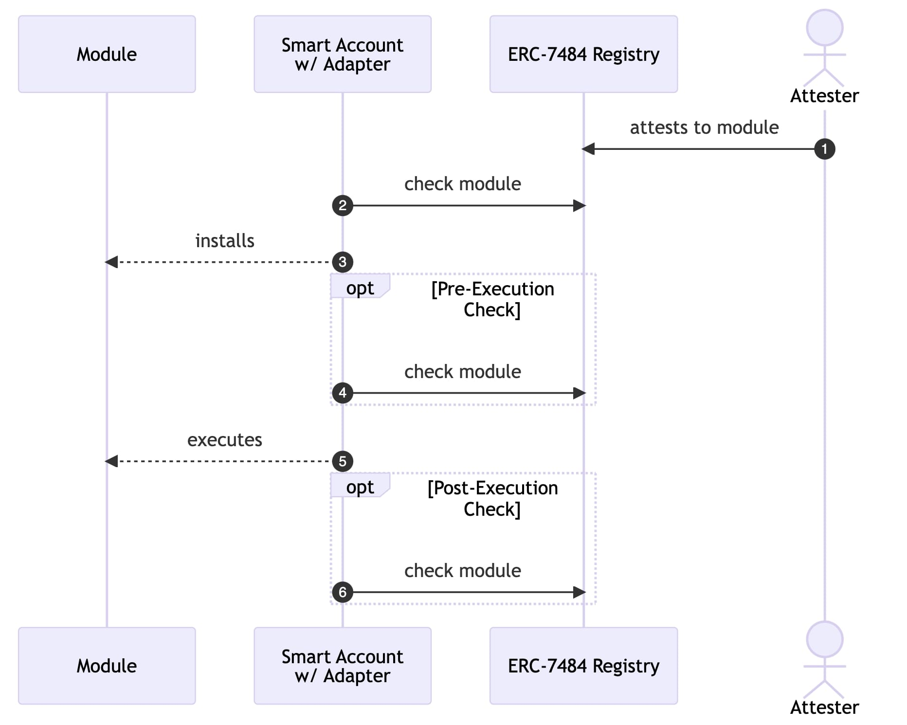

## 摘要

本提案标准化了模块注册表的接口和功能，允许模块化智能账户使用注册表适配器验证模块的安全性。它还提供了 Singleton 模块注册表的参考实现。

## 动机

[ERC-4337](./eip-4337.md) 标准化了合约账户的执行流程，而 [ERC-7579](./eip-7579.md) 标准化了这些账户的模块化实现，允许任何开发人员为这些模块化账户（以下简称智能账户）构建模块。但是，未经检查地将第三方模块添加到智能账户中会带来各种攻击媒介。

解决此安全问题的一种方法是创建一个模块注册表，该注册表存储有关模块的安全性证明，并允许智能账户在使用模块之前查询这些证明。本标准旨在实现以下两个目标：

1. 标准化模块注册表的接口和所需功能。
2. 标准化适配器的功能，该适配器允许智能账户查询模块注册表。

这确保了智能账户可以安全地查询模块注册表并正确处理注册表行为，而不管它们的架构、执行流程和安全假设如何。本标准还提供了 Singleton 模块注册表的参考实现，该注册表是无所有者的，并且可以被任何智能账户使用。虽然我们看到了整个生态系统使用此单个模块注册表的许多好处（请参阅“原理”），但我们认识到使用单例存在权衡，因此本标准不要求智能账户使用参考实现。因此，本标准确保智能账户可以查询任何实现所需接口和功能的模块注册表，从而减少集成开销并确保智能账户的互操作性。

## 规范

本文档中的关键词“必须”、“不得”、“必需”、“应该”、“不应”、“推荐”、“不推荐”、“可以”和“可选”应按照 RFC 2119 和 RFC 8174 中的描述进行解释。

### 定义

- **智能账户** - 一个 ERC-7579 的模块化智能账户。
- **模块** - 独立的智能账户功能。
- **证明** - 关于模块安全性的链上断言。
- **证明者** - 对模块进行证明的实体。
- **（模块）注册表** - 一个合约，用于存储关于模块的链上证明列表。
- **适配器** - 处理从注册表获取和验证证明的智能账户功能。

### 所需的注册表功能

注册表的核心接口如下：

```solidity
interface IERC7484Registry {
    /*´:°•.°+.*•´.*:˚.°*.˚•´.°:°•.°•.*•´.*:˚.°*.˚•´.°:°•.°+.*•´.*:*/
    /*               与内部证明者检查              */
    /*.•°:°.´+˚.*°.˚:*.´•*.+°.•°:´*.´•*.•°.•°:°.´:•˚°.*°.˚:*.´+°.•*/
    function check(address module) external view;

    function checkForAccount(address smartAccount, address module) external view;

    function check(address module, uint256 moduleType) external view;

    function checkForAccount(
        address smartAccount,
        address module,
        uint256 moduleType
    )
        external
        view;

    /*´:°•.°+.*•´.*:˚.°*.˚•´.°:°•.°•.*•´.*:˚.°*.˚•´.°:°•.°+.*•´.*:*/
    /*                   设置内部证明者                 */
    /*.•°:°.´+˚.*°.˚:*.´•*.+°.•°:´*.´•*.•°.•°:°.´:•˚°.*°.˚:*.´+°.•*/

    function trustAttesters(uint8 threshold, address[] calldata attesters) external;


    /*´:°•.°+.*•´.*:˚.°*.˚•´.°:°•.°•.*•´.*:˚.°*.˚•´.°:°•.°+.*•´.*:*/
    /*               与外部证明者检查               */
    /*.•°:°.´+˚.*°.˚:*.´•*.+°.•°:´*.´•*.•°.•°:°.´:•˚°.*°.˚:*.´+°.•*/

    function check(
        address module,
        address[] calldata attesters,
        uint256 threshold
    )
        external
        view;

    function check(
        address module,
        uint256 moduleType,
        address[] calldata attesters,
        uint256 threshold
    )
        external
        view;
}
```

注册表还必须实现以下功能：

- 在存储证明之前，验证证明者是否是证明的创建者，例如通过检查 `msg.sender` 或使用签名。
- 允许证明者撤销他们所做的证明。
- 存储证明数据或对证明数据的引用。

注册表还应该实现以下附加功能：

- 允许证明者指定其证明的到期日期，并在检查期间如果证明已过期则恢复。
- 实现一个视图函数，允许适配器或链下客户端读取特定证明的数据。

#### `check` 函数

- 如果对 `module` 进行证明的 `attesters` 的数量小于 `threshold`，则注册表必须恢复。
- 如果任何 `attester` 撤销了他们对 `module` 的证明，则注册表必须恢复。
- 提供的 `attesters` 必须是唯一且排序的，如果不是，则注册表必须恢复。

#### 带有 moduleType 的 `check` 函数

- 如果存储的 `module` 的模块类型不是提供的 `moduleType`，则注册表必须恢复。

#### 具有内部证明者的函数

- 注册表必须使用为 `smartAccount` 或 `msg.sender` 存储的证明者（如果前者不是参数）。
- 如果没有为 `smartAccount` 或 `msg.sender`（如果前者不是参数）存储任何证明者，则注册表必须恢复。

#### `trustAttesters`

- 注册表必须为 `msg.sender` 存储 `threshold` 和 `attesters`。
- 提供的 `attesters` 必须是唯一且排序的，如果不是，则注册表必须恢复。

### 适配器行为

智能账户必须在账户本身或作为模块实现以下适配器功能。此适配器功能必须确保：

- 在第一次调用 `A` 的事务之前或期间，至少查询一次有关模块 `A` 的注册表。
- 注册表恢复被视为安全风险。

此外，适配器应实现以下功能：

- 当注册表恢复时，恢复事务流程。
- 在安装 `A` 时查询有关模块 `A` 的注册表。
- 在执行 `A` 时查询有关模块 `A` 的注册表。

示例：使用 `check` 的适配器流程


## 原理

### 证明

证明是对模块进行的链上断言。这些断言可能与模块的安全性有关（类似于常规智能合约审计），模块是否符合特定标准或有关这些模块的任何其他类型的声明。虽然其中一些断言可以在链上进行验证，但大多数断言不能。

一个例子是确定哪个存储槽是特定模块可以写入的，如果智能账户使用 DELEGATECALL 调用该模块，这可能很有用。实际上，链上验证此断言是不可行的，但可以很容易地在链下进行验证。因此，证明者可以在链下执行此检查，并在链上发布一个证明，证明给定的模块只能写入其指定的存储槽。

虽然证明始终是对模块进行的某些类型的断言，但本提案有意允许证明数据是任何类型的数据或指向数据的指针。这确保了任何类型的数据都可以用作断言，从指定模块安全的简单布尔标志到运行时模块行为的复杂证明。

### 单例注册表

为了使证明可以在链上查询，它们需要存储在智能合约中的某种列表中。本提案包括一个无所有者的 Singleton 注册表的参考实现，该注册表充当证明的真实来源。

提出 Singleton 注册表的原因如下：

**安全性**：Singleton 注册表通过将账户集成集中到单个真实来源来创建更高的安全性，在该来源中，最大数量的安全实体正在进行证明。这有许多好处：a) 它增加了每个模块的最大潜在数量和类型的证明，以及 b) 消除了账户验证不同注册表的真实性和安全性的需要，从而将信任委托集中到进行证明的链上实体。结果是账户能够以较低的 gas 开销查询多个证明者，以提高安全保证，并且账户无需执行额外的工作来验证不同注册表的安全性。

**互操作性**：Singleton 注册表不仅创造了更高水平的“证明流动性”，而且还提高了模块流动性并确保了更高水平的模块互操作性。开发人员只需将其模块部署到一个地方即可接收证明并最大化模块到所有集成账户的分配。证明者还可以通过链接证明并从这些依赖性链中获得持续的安全性来受益于以前的审计工作。这允许诸如遍历证明历史或开发人员的版本控制等好处。

但是，使用单例显然存在权衡。Singleton 注册表创建了一个单点故障，如果被利用，可能会对智能账户造成严重后果。其中最严重的攻击媒介是攻击者代表受信任的证明者证明恶意模块的能力。这里的一个权衡是，使用多个注册表，安全证明的变化（例如，发现漏洞并且撤销证明）在整个生态系统中传播的速度较慢，从而使攻击者有机会利用漏洞更长的时间，甚至在看到特定注册表中指出的问题但在其他注册表中没有指出的问题后找到并利用它们。

由于是单例，因此注册表需要非常灵活，因此与狭窄的、优化的注册表相比，计算效率可能较低。这意味着查询 Singleton 注册表可能比查询更窄的注册表在计算上（以及通过扩展 gas）更密集。这里的权衡是，单例使得同时查询多个方的证明更便宜。因此，取决于注册表架构，存在一个要查询的证明数量 (N)，在此之后，使用灵活的单例实际上比查询 N 个窄注册表在计算上更便宜。但是，参考实现也考虑到了 gas 使用量进行了设计，并且专门的注册表不太可能能够显着降低 gas，超出参考实现的基准。

### 模块类型

模块可以是不同的类型，并且对于帐户来说，确保模块是某种类型可能很重要。 例如，如果帐户要安装一个处理帐户验证逻辑的模块，则它可能希望确保证明者已确认该模块确实能够执行此验证逻辑。 否则，帐户可能面临安装无法执行验证逻辑的模块的风险，这可能导致帐户无法使用。

但是，注册表本身不需要关心特定模块类型的含义。 相反，证明者可以提供这些类型，注册表可以存储它们。

### 相关工作

注册表的参考实现受到了 Ethereum Attestation Service 的极大启发。 但是，本提案的特定用例需要对 EAS 进行一些自定义修改和添加，这意味着使用现有的 EAS 合约作为模块注册表不是最佳选择。 但是，可以通过一些修改将 EAS 用作模块注册表。

## 向后兼容性

未发现向后兼容性问题。

## 参考实现

### Adapter.sol

```solidity
contract Adapter {
    IRegistry registry;

    function checkModule(address module) internal {
        // 检查注册表上的模块证明
        registry.check(module);
    }

    function checkModuleWithModuleTypeAndAttesters(address module, address[] memory attesters, uint256 threshold,  uint16 moduleType) internal {
        // 检查注册表上的模块证明列表
        registry.check(module, attesters, threshold, moduleType);
    }

}
```

### Account.sol

**注意**：这是一个符合上述“规范”的特定示例，但此实现不具有约束力。

```solidity
contract Account is Adapter {
    ...

    // 安装模块
    function installModule(
        uint256 moduleTypeId,
        address module,
        bytes calldata initData
    )
        external
        payable
    {
        checkModule(module);
        ...
    }

    // 从执行器执行模块
    function executeFromExecutor(
        ModeCode mode,
        bytes calldata executionCalldata
    )
        external
        payable
        returns (bytes[] memory returnData)
    {
        checkModule(module);
        ...
    }

    ...
}
```

### 注册表

```solidity
/**
* @dev 此实现未经过优化，以便使参考实现更易于阅读
* @dev 为了简洁起见，缺少一些函数实现
*/
contract Registry is IERC7484Registry {
    ...

    /*´:°•.°+.*•´.*:˚.°*.˚•´.°:°•.°•.*•´.*:˚.°*.˚•´.°:°•.°+.*•´.*:*/
    /*               与内部证明者检查              */
    /*.•°:°.´+˚.*°.˚:*.´•*.+°.•°:´*.´•*.•°.•°:°.´:•˚°.*°.˚:*.´+°.•*/
    function check(address module) external view {
        (address[] calldata attesters, uint256 threshold) = _getAttesters(msg.sender);

        uint256 validCount = 0;
        for (uint256 i = 0; i < attesters.length; i++) {
            bool isValid = _check(module, attesters[i]);
            if (isValid) validCount++;
        }
        if (validCount < threshold) revert AttestationThresholdNotMet();
    }

    function checkForAccount(address smartAccount, address module) external view {
        (address[] calldata attesters, uint256 threshold) = _getAttesters(smartAccount);

        ...
    }

    function check(address module, uint256 moduleType) external view {
        (address[] calldata attesters, uint256 threshold) = _getAttesters(msg.sender);

        uint256 validCount = 0;
        for (uint256 i = 0; i < attesters.length; i++) {
            bool isValid = _check(module, attesters[i]);
            if (isValid) validCount++;

            AttestationRecord storage attestation = _getAttestation(module, attester);
            if (attestation.moduleType != moduleType) revert ModuleTypeMismatch();
        }
        if (validCount < threshold) revert AttestationThresholdNotMet();
    }

    function checkForAccount(
        address smartAccount,
        address module,
        uint256 moduleType
    )
        external
        view {
        (address[] calldata attesters, uint256 threshold) = _getAttesters(smartAccount);

        ...
    }

    /*´:°•.°+.*•´.*:˚.°*.˚•´.°:°•.°•.*•´.*:˚.°*.˚•´.°:°•.°+.*•´.*:*/
    /*                   设置内部证明者                 */
    /*.•°:°.´+˚.*°.˚:*.´•*.+°.•°:´*.´•*.•°.•°:°.´:•˚°.*°.˚:*.´+°.•*/

    function trustAttesters(uint8 threshold, address[] calldata attesters) external {
        ...
    }

    /*´:°•.°+.*•´.*:˚.°*.˚•´.°:°•.°•.*•´.*:˚.°*.˚•´.°:°•.°+.*•´.*:*/
    /*               与外部证明者检查               */
    /*.•°:°.´+˚.*°.˚:*.´•*.+°.•°:´*.´•*.•°.•°:°.´:•˚°.*°.˚:*.´+°.•*/

    function check(
        address module,
        address[] calldata attesters,
        uint256 threshold
    )
        external
        view
    {
        uint256 validCount = 0;
        for (uint256 i = 0; i < attesters.length; i++) {
            bool isValid = _check(module, attesters[i]);
            if (isValid) validCount++;
        }
        if (validCount < threshold) revert AttestationThresholdNotMet();
    }

    function check(
        address module,
        uint256 moduleType,
        address[] calldata attesters,
        uint256 threshold
    )
        external
        view
    {
        uint256 validCount = 0;
        for (uint256 i = 0; i < attesters.length; i++) {
            bool isValid = _check(module, attesters[i]);
            if (isValid) validCount++;

            AttestationRecord storage attestation = _getAttestation(module, attester);
            if (attestation.moduleType != moduleType) revert ModuleTypeMismatch();
        }
        if (validCount < threshold) revert AttestationThresholdNotMet();
    }

    /*´:°•.°+.*•´.*:˚.°*.˚•´.°:°•.°•.*•´.*:˚.°*.˚•´.°:°•.°+.*•´.*:*/
    /*                         内部                           */
    /*.•°:°.´+˚.*°.˚:*.´•*.+°.•°:´*.´•*.•°.•°:°.´:•˚°.*°.˚:*.´+°.•*/

    function _check(address module, address attester) external view returns (bool isValid){
        AttestationRecord storage attestation = _getAttestation(module, attester);

        uint48 expirationTime = attestation.expirationTime;
        uint48 attestedAt =
            expirationTime != 0 && expirationTime < block.timestamp ? 0 : attestation.time;
        if (attestedAt == 0) return;

        uint48 revokedAt = attestation.revocationTime;
        if (revokedAt != 0) return;

        isValid = true;
    }

    function _getAttestation(
        address module,
        address attester
    )
        internal
        view
        virtual
        returns (AttestationRecord storage)
    {
        return _moduleToAttesterToAttestations[module][attester];
    }

    function _getAttesters(
        address account
    )
        internal
        view
        virtual
        returns (address[] calldata attesters, uint256 threshold)
    {
        ...
    }

    ...
}
```

## 安全注意事项

需要讨论。

## 版权

通过 [CC0](../LICENSE.md) 放弃版权及相关权利。
