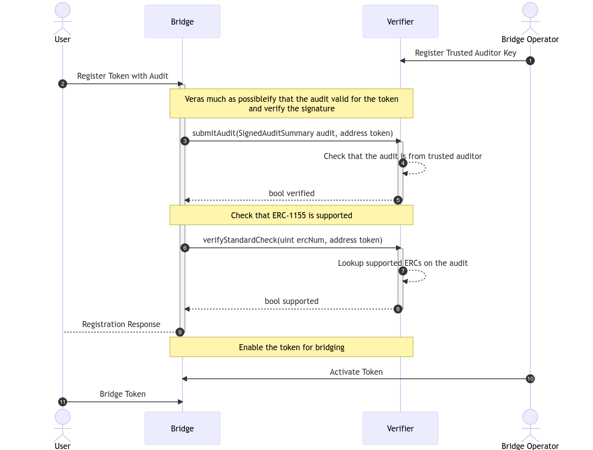

## 摘要

该提案旨在创建一个审计报告的上链表示标准，该标准可以被合约解析，以提取关于审计的相关信息，例如谁执行了审计以及验证了哪些标准。

## 动机

审计是智能合约安全框架中不可或缺的一部分。它们通常用于提高智能合约的安全性，并确保它们遵循最佳实践，并正确地实现标准，如 [ERC-20](./eip-20.md)、[ERC-721](./eip-721.md) 和类似的 ERC。区块链生态系统的许多重要部分都通过智能合约的使用来实现。以下是一些例子：

- 桥：大多数桥由桥头堡或保险箱组成，用于保护应该桥接的 token。如果这些合约中的任何一个出现故障，可能会导致桥的运行停止，或者在极端情况下，导致在卫星链上铸造无抵押资产。
- Token 合约：以太坊生态系统中的每个 token 都是一个智能合约。与这些 token 交互的应用程序依赖于它们遵守已知的 token 标准，最常见的是 [ERC-20](./eip-20.md) 和 [ERC-721](./eip-721.md)。行为不同的 token 可能会导致意外行为，甚至可能导致资金损失。
- 智能合约账户 (SCAs)：随着 [ERC-4337](./eip-4337.md) 的出现，基于智能合约的账户获得了更多的可见性。它们提供了极大的灵活性，可以满足许多不同的使用场景，同时保持对每个账户的更高程度的控制和安全性。一个已经尝试过的概念是模块的想法，允许扩展智能合约账户的功能。[ERC-6900](./eip-6900.md)) 是一个最近的标准，它定义了如何注册和设计可以在账户上注册的插件。
- 互操作性（钩子 & 回调）：随着越来越多的协议支持面向外部的函数来与它们交互，以及不同的 token 标准在转移时触发回调（例如 [ERC-1155](./eip-1155.md)），重要的是要确保这些交互经过充分审查，以尽可能地减少它们相关的安全风险。

智能合约的使用及其对去中心化应用程序日常运营的影响将稳步增加。为了提供关于安全性的切实的保证，并允许更好的可组合性，必须存在一种链上验证方法来验证合约是否经过审计。创建一个可以验证是否已对特定合约进行审计的系统将加强整个智能合约生态系统的安全保证。

虽然仅凭此信息并不能保证合约中没有错误或缺陷，但它可以提供一个重要的构建块，以链上的方式为智能合约创建创新的安全系统。

### 例子

假设有一个假设的 [ERC-1155](./eip-1155.md) token 桥。目标是创建一个可扩展的系统，可以轻松注册可以桥接的新 token。为了最大限度地降低注册恶意或有缺陷的 token 的风险，将使用审计并在链上进行验证。



为了清楚地说明图中的流程，它将桥和验证者的角色分为不同的参与者。理论上，两者可以存在于同一个合约中。

有四个参与者：

- 用户：想要桥接其 token 的最终用户
- 桥运营商：维护桥的运营商
- 桥：用户将与之交互以触发桥接操作的合约
- 验证者：验证 token 是否可以桥接的合约

作为第一步 (1)，桥运营商应定义审计师的密钥/帐户，根据这些审计师的审计结果来接受 token 注册过程。

这样，用户（或 token 所有者）可以触发注册流程 (2)。将执行两个步骤（3 和 6）：验证提供的审计是否有效并且已由可信的审计师签名 (4)，并检查 token 合约是否实施桥支持的 token 标准 ([ERC-1155](./eip-1155.md)) (7)。

在执行审计和 token 标准验证之后，仍然建议运营商进行某种形式的人工干预，以激活用于桥接的 token (10)。<!-- 如果对审计师有很强的信任，或者如果某个 ERC 提供强大的兼容性保证，则可以省略此步骤。 -->

一旦 token 在桥上被激活，用户就可以开始桥接它 (11)。

## 规范

本文档中的关键词 "MUST"，“MUST NOT”，“REQUIRED”，“SHALL”，“SHALL NOT”，“SHOULD”，“SHOULD NOT”，“RECOMMENDED”，“NOT RECOMMENDED”，“MAY” 和 “OPTIONAL” 应按照 [RFC 2119](https://datatracker.ietf.org/doc/html/rfc2119) 和 [RFC 8174](https://datatracker.ietf.org/doc/html/rfc8174) 中的描述进行解释。

### 审计属性

- 审计师
    - `name`: 审计师的名称（例如，用于向用户显示）
    - `uri`: 用于检索有关审计师的更多信息的 URI
    - `authors`: 对此审计做出贡献的作者列表。这应该是审计合约并创建审计报告的人员
- 审计
    - `auditor`: 关于审计师的信息
    - `auditedContract`: 必须是与审计相关的合约的 `chainId` 以及 `deployment`
    - `issuedAt`: 必须包含原始审计（由 `auditHash` 标识）的发布时间信息
    - `ercs`: 目标合约实施的 ERC 列表。列出的 ERC 必须完全实施。此列表可以为空
    - `auditHash`: 必须是原始审计的哈希值。这允许对可能属于特定审计的信息进行链上验证
    - `auditUri`: 应该指向可以检索审计的来源
- 合约
    - `chainId`: 必须是合约已部署的区块链的 [EIP-155](./eip-155.md) 链 ID 的 `bytes32` 表示形式
    - `deployment`: 必须是合约部署地址的 `address` 表示形式

### 审计师验证

- 签名
    - 类型
        - `SECP256K1`
            - 数据是 `r`、`s` 和 `v` 的编码表示形式
        - `BLS`
            - 待定
        - `ERC1271`
            - 数据是 `chainId`、`address`、`blocknumber` 和 `signature bytes` 的 ABI 编码表示形式
        - `SECP256R1`
            - 数据是 `r`、`s` 和 `v` 的编码表示形式
    - 数据

### 数据类型

```solidity
struct Auditor {
    string name;
    string uri;
    string[] authors;
}

struct Contract {
    bytes32 chainId;
    address deployment;
}

struct AuditSummary {
    Auditor auditor;
    uint256 issuedAt;
    uint256[] ercs;
    Contract auditedContract;
    bytes32 auditHash;
    string auditUri;
}
```

### 签名

对于签名，将使用 [EIP-712](./eip-712.md)。为此，主要类型是 `AuditSummary`，并且作为 `EIP712Domain`，以下定义适用：

```solidity
struct EIP712Domain {
    string name;
    string version;
}

EIP712Domain auditDomain = EIP712Domain("ERC-7652: Onchain Audit Representation", "1.0");
```

然后可以将生成的签名附加到 `AuditSummary` 以生成一个新的 `SignedAuditSummary` 对象：

```solidity
enum SignatureType {
    SECP256K1,
    BLS,
    ERC1271,
    SECP256R1
}

struct Signature {
    SignatureType type;
    bytes data;
}

struct SignedAuditSummary extends AuditSummary {
    uint256 signedAt;
    Signature auditorSignature;
}
```

## 原理

当前的 ERC 故意不定义审计的 `findings`。这样的定义将需要就支持的严重程度的定义，应该在链上存储的发现数据与链下存储的数据，以及其他难以严格描述的类似发现相关属性达成一致。鉴于此任务的复杂性，我们认为它超出了此 EIP 的范围。重要的是要注意，此 ERC 建议签名审计摘要表明特定的合约实例（由其 `chainId` 和 `deployment` 指定）已接受安全审计。

此外，它表明此合约实例正确地实现了列出的 ERC。这通常对应于合约的最终审计版本，该版本然后连接到部署。如上所述，此 ERC 不应被视为对合约安全性的证明，而是一种通过它提取与智能合约相关的数据的方法；数据的质量、覆盖范围和保证的评估留给 ERC 的集成者。

### 进一步考虑

- `standards` vs `ercs`
    - 将范围限制为与基于 EVM 的智能合约帐户相关的审计可以更好地定义参数。
- `chainId` 和 `deployment`
    - 由于合约的行为取决于它部署在其中的区块链，因此我们选择为每个与审计相对应的合约关联一个 `chainId` 以及 `deployment` 地址
- `contract` vs `contracts`
    - 许多审计与构成协议的多个合约相关。为了确保此 ERC 的初始版本的简单性，我们选择仅引用每个审计摘要一个合约。如果在同一审计活动中审核了多个合约，则可以将相同的审计摘要与不同的合约实例相关联。这样做的好处是可以将合约实例与其支持的 `ercs` 正确关联。这种方法的主要缺点是它需要审计师进行多次签名传递。
- 为什么选择 [EIP-712](./eip-712.md)？
    - 选择 [EIP-712](./eip-712.md) 作为基础是因为它的工具兼容性（例如，用于签名）
- 如何为审计师分配特定的签名密钥？
    - 审计师应公开分享签名的公钥部分，这可以通过他们的网站、专业页面和任何此类社交媒体来完成
    - 作为此 ERC 的扩展，可以构建公共存储库，但是，这超出了 ERC 的范围
- 多态合约和代理
    - 此 ERC 明确**未**提及多态合约和代理。这些很重要，需要考虑，但是，它们的正确管理委托给审计师以及此 ERC 的实施者

### 未来扩展

- 可能扩展 ERC 以适应非 EVM 链
- 更好地支持多态/可升级合约和多合约审计
- 审计师的签名密钥管理
- 审计发现的定义

## 向后兼容性

尚未发现与当前 ERC 标准相关的向后兼容性问题。

## 参考实现

待定。

以下功能将在参考实现中实现：

- 用于触发基于表示审计摘要的 JSON 进行签名的脚本
- 用于验证签名审计摘要的合约

## 安全考虑

### 审计师密钥管理

此 ERC 的前提依赖于参与该系统的审计师的正确密钥管理。如果审计师的密钥被泄露，他们可能与表面上经过审计或符合 ERC 标准的合约相关联，但这些合约最终可能不符合标准。作为一种潜在的保护措施，ERC 可以定义审计师（例如，审计公司）的“关联”，这将允许辅助密钥撤销审计师的现有签名，作为在审计师密钥被泄露的情况下的一种辅助安全措施。

## 版权

版权和相关权利已通过 [CC0](../LICENSE.md) 放弃。