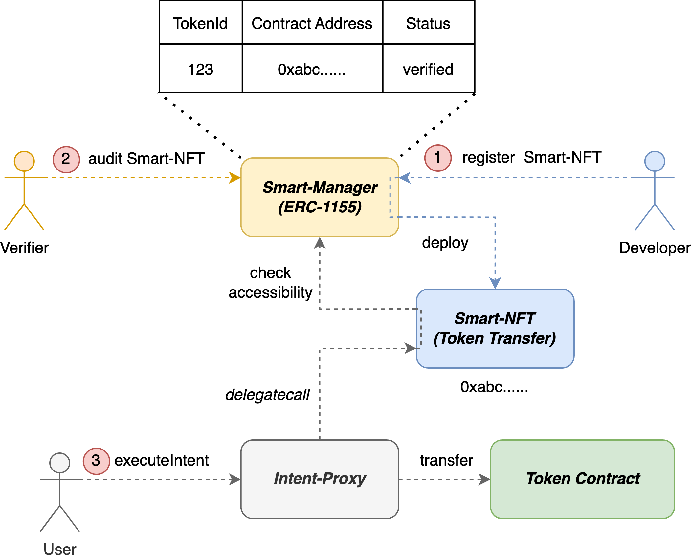

## 摘要

智能 NFT 是智能合约和 NFT 的融合。具有智能合约逻辑的 NFT 可以被执行，从而实现链上交互。从 NFT 过渡到智能 NFT 类似于从普通固定电话过渡到智能手机，为 NFT 开辟了更广阔、更智能的可能性。

## 动机

以太坊引入了智能合约，彻底改变了区块链，并为去中心化应用程序 (dApp) 的蓬勃发展生态系统铺平了道路。此外，通过 [ERC-721](./eip-721.md) 引入了非同质化代币 (NFT) 的概念，为所有权验证提供了一种范例。

然而，智能合约仍然给大多数用户带来了巨大的障碍，而 NFT 在很大程度上仅限于艺术、游戏和现实世界资产领域的重复探索。

智能合约的广泛采用和 NFT 的功能应用仍然面临着巨大的挑战。以下是一些从这种矛盾中出现的事实：

1. 对智能和可用性的强烈渴望导致用户牺牲安全性（与 BOT 共享他们的私钥）
2. 对于个体开发者来说，由于缺乏足够的资源，将功能转化为可上市产品的过程受到阻碍。
3. 在“代码即法律”的理念下，缺乏用于安全转移智能合约/代码所有权的链上基础设施。

### 兼顾安全性的可用性

IA-NFT 充当智能合约的密钥。没有私钥，就没有私钥泄露的风险。

### 作为原生链上资产的 IA-NFT

多年来，NFT 代表着图片、艺术品、游戏物品、现实世界资产的所有权。所有这些支持的资产实际上都不是加密原生资产。IA-NFT 验证一段代码或智能合约的所有权。

### 用于意图抽象的交互抽象

链上交互可以抽象为许多功能模块 IA-NFT，从而使交互过程更加有效。用户可以更多地关注他们的意图，而不是如何跨不同的 dApp 进行操作。

## 规范

本文档中的关键词“必须”、“禁止”、“必需”、“应”、“不应”、“应该”、“不应该”、“推荐”、“不推荐”、“可以”和“可选”应按照 RFC 2119 和 RFC 8174 中的描述进行解释。

### 概述

以下部分将定义三个主要对象的接口规范：Smart-NFT、Smart-Manager、Intent-Proxy，并建立三个主要角色（开发者、验证者、用户）与这些对象之间的交互关系。



### Smart-NFT 接口

在向 Smart-Manager 发送注册请求之前，开发者应在 Smart-NFT 中实现以下两个核心接口。

- `execute`：此函数**必须**仅包含一个 "bytes" 类型的参数，该参数封装特定 Smart-NFT 所需的参数。此外，在实现过程中**必须**调用 validatePermission 以确定此调用是否合法。

- `validatePermission`：此函数用于查询 Smart-Manager，以确定 Smart-NFT 是否已成功验证并且可被调用者调用。

```solidity
interface ISmartNFT {
  function execute(bytes memory data) external payable returns (bool);

  function validatePermission() external view returns (bool);
}
```

### Smart-Manager 接口

Smart-Manager 接口定义了 Smart-NFT 的 5 种可能状态：

- **UNREGISTERED**：指尚未在 Smart-Manager 中注册的 Smart-NFT。
- **DEREGISTERED**：表示先前已注册但在 Smart-Manager 中已删除或注销的 Smart-NFT。
- **UNVERIFIED**：表示已在 Smart-Manager 中注册但尚未经过验证过程的 Smart-NFT。
- **VERIFIED**：表示已在 Smart-Manager 中注册并已成功通过验证过程的 Smart-NFT，表明它们可以安全使用。
- **DENIED**：表示已注册但未通过验证过程的 Smart-NFT，表明它们不应使用，因为它们可能构成安全风险。

Smart-Manager 应实现以下三个核心接口。

- `register`：开发者可以通过此接口发起 Smart-NFT 的注册请求，并提供 Smart-NFT 的创建代码。请求成功后，Smart-NFT **必须**标记为 _UNVERIFIED_。

- `auditTo`：**应该**仅允许受信任的验证者使用此接口来审计 Smart-NFT，以将其状态更改为 _Verified_ 或 _Denied_。

- `isAccessible`：此接口用于确定用户是否可以使用特定的 Smart-NFT。该确定**必须**考虑相应的 tokenId NFT 的所有权，以及 Smart-NFT 是否已成功验证。

- `verificationStatusOf`：该函数**必须**返回指定 Smart-NFT 的当前验证阶段。

此外，Smart-Manager 的实现**应该**继承自 [ERC-1155](./eip-1155.md)。

```solidity
interface ISmartManager {
  enum VerificationStatus {
      UNREGISTERED,
      DEREGISTERED,
      UNVERIFIED,
      VERIFIED,
      DENIED
  }

  function register(
      bytes calldata creationCode,
      uint256 totalSupply
  ) external returns (uint256 tokenId, address implAddr);

  function auditTo(uint256 tokenId, bool isValid) external returns (bool);

  function isAccessible(
      address caller,
      uint256 tokenId
  ) external view returns (bool);

  function verificationStatusOf(
      uint256 tokenId
  ) external view returns (VerificationStatus);
}
```

### Intent-Proxy 接口

Intent-Proxy 接口定义了一个 Action 结构体：

| name         | type    | defination                                                              |
| ------------ | ------- | ----------------------------------------------------------------------- |
| tokenId      | uint256 | 要调用的目标 Smart-NFT 的 nft id                                         |
| executeParam | bytes   | 目标 Smart-NFT 的 execute 定义的参数编码打包输入                             |

Intent-Proxy 应该实现 `executeIntent`。

- executeIntent：用户可以通过调用此接口并提供所需操作的数组，来实现批量使用指定的 Smart-NFT。

```solidity
interface IIntentProxy {
  struct Action {
      uint256 tokenId;
      bytes executeParam;
  }

  function executeIntent(
      Action[] calldata actions
  ) external payable returns (bool);
}
```

## 原理

### 为什么使用 ERC-1155

在技术实现方面，我们选择使用 [ERC-1155](./eip-1155.md) 作为 NFT 的主要合约，原因是考虑到提高 Smart-NFT 的可重用性。选择的原因是 [ERC-721](./eip-721.md) 和 [ERC-1155](./eip-1155.md) 都基于指向 NFT 的“token ID”的概念。关键的区别在于 [ERC-1155](./eip-1155.md) 引入了“份额”的概念，这意味着拥有至少一个份额，您就有权使用该 Smart-NFT 的功能。这个概念可以比作拥有多个相同型号的智能手机，拥有多个智能手机并不会赋予您额外的功能；您只能使用每个单独设备的功能。

直接使用 [ERC-1155](./eip-1155.md) 而不是定义新的 NFT 标准的另一个原因是，Smart-NFT 交易行为可以无缝集成到现有市场中。这种方法有利于开发者和用户，因为它简化了 Smart-NFT 融入当前生态系统的过程。

### 验证者

在此协议中，验证者扮演着至关重要的角色，负责审计和验证 Smart-NFT 代码。然而，去中心化的验证者面临着一些极具挑战性的问题，其中一个主要问题是他们角色所需的专业知识，这对于普通大众来说并不容易获得。

首先，让我们明确验证者的职责，包括评估智能合约代码的安全性、功能和合规性。这项工作需要专业的编程技能、区块链技术知识和合约专业知识。验证者必须确保代码中不存在漏洞。

其次，去中心化的验证者会遇到与权威和可信度相关的挑战。在中心化模型中，我们可以信任特定的审计组织或专家来执行此任务。但是，在去中心化的环境中，很难确定验证者的专业知识和诚信。这可能会导致不正确的审计，甚至可能被滥用以破坏整体稳定性和可靠性。

最后，实现去中心化的验证者还需要解决协调和管理问题。在中心化模型中，管理和监督验证者的职责相对简单。但是，在去中心化的环境中，协调各种验证者的工作并确保他们在不同合约和代码中的审计一致性成为重要的挑战。

### 著作权侵权问题

代码抄袭一直是一个备受关注的话题，但通常，此类讨论似乎不必要。我们提出两个关键点：首先，过于简单的代码没有价值，使得有关抄袭的讨论变得无关紧要。其次，当代码足够复杂或具有创造性时，可以通过开源许可证 (OSI) 获得法律保护。

第一点是对于过于简单的代码，抄袭几乎毫无意义。例如，考虑一个非常基本的 "Hello World" 程序。这样的代码非常简单，几乎任何人都可以独立创建它。讨论此类代码的抄袭是浪费时间和资源，因为它缺乏足够的创新或价值，并且不需要法律保护。

第二点是，当代码足够复杂或具有创造性时，开源许可证 (OSI) 为软件开发人员提供法律保护。开源许可证是开发人员共享其代码并指定使用条款的一种方式。例如，GNU General Public License (GPL) 和 Massachusetts Institute of Technology (MIT) 许可证是常见的开源许可证，可确保原始代码的创建者可以保留其知识产权，同时允许其他人使用和修改代码。这种方法可以保护复杂且有价值的代码，同时促进创新和共享。

## 向后兼容性

本提案旨在确保与现有 [ERC-1155](./eip-1155.md) 协议尽可能高的兼容性。[ERC-1155](./eip-1155.md) 中存在的所有功能，包括 [ERC-165](./eip-165.md) 检测和 Smart-NFT 支持，都将保留。这包括与当前 NFT 交易平台的兼容性。

对于所有 Smart-NFT，本提案仅要求提供 `execute` 函数。这意味着现有代理合约只需要关注此接口，从而使 Smart-NFT 的集成更加简单和精简。

## 参考实现

参见 `https://github.com/TsengMJ/EIP-7513_Example`

## 安全考虑

### 恶意验证者

所有涉及人为干预的活动都固有地带有恶意行为的风险。在此协议中，在 Smart-NFT 的验证阶段，外部验证者提供保证。但是，这种结构引发了对恶意验证者可能故意认可恶意 Smart-NFT 的担忧。为了减轻这种风险，有必要实施更严格的验证机制、验证者过滤、惩罚措施，甚至更严格的共识标准。

### 意外的验证错误

除了恶意验证者的问题外，由于诸如过于复杂的 Smart-NFT 实现或 Solidity 编译器中的漏洞等因素，验证阶段可能会出现漏检。这个问题只能通过使用其他工具来协助合同审计或通过为 auditTo 接口实施多个验证者审计来减少其发生的可能性来解决。

## 版权

版权及相关权利通过 [CC0](../LICENSE.md) 放弃。